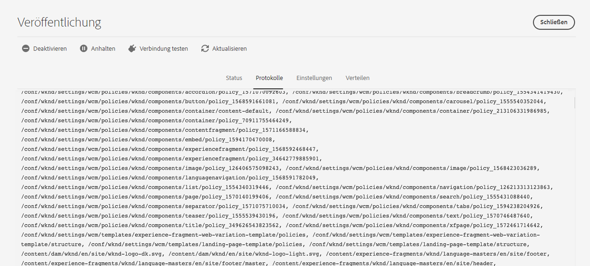

# Replikation {#replication}

Adobe Experience Manager as a Cloud Service verwendet die [Sling Content Distribution](https://sling.apache.org/documentation/bundles/content-distribution.html)-Funktion, um den zu replizierenden Inhalt in einen Pipeline-Dienst zu verschieben, der unter Adobe Developer außerhalb der AEM-Laufzeit ausgeführt wird.

>[!NOTE]
>
>Weitere Informationen finden Sie unter [Verteilung](/help/overview/architecture.md#content-distribution).

## Methoden zum Veröffentlichen von Inhalten {#methods-of-publishing-content}

>[!NOTE]
>
>Wenn Sie an Massenveröffentlichungen von Inhalten interessiert sind, erstellen Sie einen Workflow mit dem [Workflow-Schritt für die Strukturaktivierung](#tree-activation), der eine effiziente Verarbeitung umfangreicher Payloads ermöglicht.
>>Es wird nicht empfohlen, für die Massenveröffentlichung Ihren eigenen, benutzerdefinierten Code zu erstellen.
>>Wenn Sie aus irgendeinem Grund Anpassungen vornehmen müssen, können Sie mit diesem Schritt einen Workflow über vorhandene Workflow-APIs auslösen.
>>Es empfiehlt sich immer, nur Inhalte zu veröffentlichen, die auch veröffentlicht werden müssen. Achten Sie außerdem darauf, nicht zu versuchen, eine große Anzahl von Inhalten zu veröffentlichen, wenn dies nicht notwendig ist. Es gibt jedoch keine Beschränkungen hinsichtlich der Menge der Inhalte, die Sie über Workflows mit dem Workflow-Schritt für die Strukturaktivierung senden können.

### Schnelles Rückgängigmachen einer Veröffentlichung/Veröffentlichen – Geplantes Rückgängigmachen einer Veröffentlichung/Veröffentlichen {#publish-unpublish}

Diese Funktion ermöglicht das sofortige Veröffentlichen ausgewählter Seiten, ohne die zusätzlichen Optionen, die über den Ansatz „Veröffentlichung verwalten“ möglich sind.

Weitere Informationen finden Sie unter [Veröffentlichung verwalten](/help/sites-cloud/authoring/sites-console/publishing-pages.md#manage-publication).

### Einschalt- und Ausschaltzeiten – Trigger-Konfiguration {#on-and-off-times-trigger-configuration}

Die zusätzlichen Möglichkeiten für **Einschaltzeit** und **Ausschaltzeit** sind auf der [Registerkarte „Standard“ der Seiteneigenschaften](/help/sites-cloud/authoring/sites-console/page-properties.md#basic) verfügbar.

Um die automatische Replikation für diese Funktion zu realisieren, aktivieren Sie die **Automatische Replikation** in der [OSGi-Konfiguration](/help/implementing/deploying/configuring-osgi.md) **Ein-Aus-Trigger-Konfiguration**:


### Veröffentlichung verwalten {#manage-publication}

„Veröffentlichung verwalten“ bietet mehr Optionen als „Schnell veröffentlichen“. Mit diesen können Sie auch untergeordnete Seiten einschließen, Verweise anpassen, alle nötigen Workflows starten und die Veröffentlichung bei Bedarf zu einem späteren Zeitpunkt starten.

Wenn Sie die untergeordneten Elemente eines Ordners für die Option „Später veröffentlichen“ einbeziehen, wird der Workflow „Inhaltsstruktur veröffentlichen“ aufgerufen, der in diesem Artikel beschrieben wird.

Ausführlichere Informationen zur Funktion „Veröffentlichung verwalten“ finden Sie in der [Dokumentation zu Veröffentlichungsgrundlagen](/help/sites-cloud/authoring/sites-console/publishing-pages.md#manage-publication).

### Workflow-Schritt für die Strukturaktivierung {#tree-activation}

Mit dem Workflow-Schritt für die Strukturaktivierung soll eine tiefe Hierarchie von Inhaltsknoten effektiv repliziert werden. Er wird automatisch angehalten, wenn die Warteschlange zu groß wird, damit andere Replikationen parallel mit minimaler Latenz fortgesetzt werden können.

So erstellen Sie ein Workflow-Modell, das den Prozessschritt `TreeActivation` verwendet:

1. Gehen Sie auf der Homepage von AEM as a Cloud Service zu **Tools > Workflow > Modelle**.
1. Klicken Sie auf der Seite „Workflow-Modelle“ in der oberen rechten Ecke des Bildschirms auf **Erstellen**.
1. Fügen Sie Ihrem Modell einen Titel und einen Namen hinzu. Weitere Informationen finden Sie unter [Erstellen von Workflow-Modellen](https://experienceleague.adobe.com/docs/experience-manager-65/developing/extending-aem/extending-workflows/workflows-models.html?lang=de).
1. Wählen Sie das neu erstellte Modell aus der Liste aus und klicken Sie auf **Bearbeiten**
1. Löschen Sie im folgenden Fenster den standardmäßig angezeigten Schritt
1. Ziehen Sie den Prozessschritt per Drag-and-Drop in den aktuellen Modellfluss:

   

1. Klicken Sie auf den Prozessschritt im Fluss und wählen Sie **Konfigurieren** aus, indem Sie auf das Schraubenschlüsselsymbol klicken.
1. Wählen Sie die Registerkarte **Prozess** und wählen Sie `Publish Content Tree` aus der Dropdown-Liste aus; aktivieren Sie dann das Kontrollkästchen **Handler-Modus**

   

1. Legen Sie alle zusätzlichen Parameter im Feld **Argumente** fest. Mehrere kommagetrennte Argumente können zusammengefügt werden. Zum Beispiel:

   `enableVersion=false,agentId=publish,chunkSize=50,maxTreeSize=500000,dryRun=false,filters=onlyModified,maxQueueSize=10`

   >[!NOTE]
   >
   >Eine Liste der Parameter finden Sie unten im Abschnitt **Parameter**.

1. Klicken Sie auf **Fertig**, um das Workflow-Modell zu speichern.

**Parameter**

| Name | default | Beschreibung |
| -------------- | ------- | --------------------------------------------------------------- |
| path |         | Der Stammpfad zum Starten |
| agentId | publish | Der Name des zu verwendenden Replikationsagenten |
| chunkSize | 50 | Die Anzahl der Pfade, die in einer einzelnen Replikation gebündelt werden sollen |
| maxTreeSize | 500000 | Die maximale Anzahl von Knoten, damit eine Baumstruktur als klein gilt |
| maxQueueSize | 10 | Die maximale Anzahl von Elementen in der Replikationswarteschlange |
| enableVersion | false | Aktivierung der Versionierung |
| dryRun | false | Wenn „true“ festgelegt ist, wird die Replikation nicht tatsächlich aufgerufen |
| userId |         | Nur für den Job. Beim Workflow wird die Person verwendet, die den Workflow aufruft |
| filters |         | Liste mit den Namen der Knotenfilter. Siehe „Unterstützte Filter“ unten |

**Unterstützte Filter**

| Name | Beschreibung |
| ------------- | ------------------------------------------- |
| onlyModified | Knoten: sowohl neue als auch bereits vorhandene, die seit der letzten Veröffentlichung geändert wurden. |
| onlyActivated | Knoten: die vor der letzten Veröffentlichung veröffentlicht wurden. |


**Fortsetzung der Unterstützung**

Der Workflow verarbeitet Inhalte in Blöcken, von denen jeder eine Teilmenge des vollständigen zu veröffentlichenden Inhalts darstellt.  Wenn der Workflow vom System angehalten wird, wird er dort fortgesetzt, wo er abgebrochen wurde.

**Überwachen des Workflow-Fortschritts**

1. Gehen Sie auf der Startseite von AEM as a Cloud Service zu **Tools > Allgemein > Aufträge**.
1. Sehen Sie sich die Zeile an, die Ihrem Workflow entspricht. Die Spalte *Fortschritt* gibt an, wie die Replikation voranschreitet. Beispielsweise kann dort „41/564“ und nach der Aktualisierung „52/564“ angezeigt werden.

   


1. Wenn Sie die Zeile auswählen und öffnen, erhalten Sie weitere Details zum Status der Workflow-Ausführung.

   


### Workflow zum Veröffentlichen der Inhaltsstruktur {#publish-content-tree-workflow}

>[!NOTE]
>
>Diese Funktion wurde zugunsten des leistungsfähigeren Schritts zur Strukturaktivierung aufgegeben, der in einen benutzerdefinierten Workflow eingeschlossen werden kann.

+++ Klicken Sie hier, um mehr über diese nicht mehr unterstützte Funktion zu erfahren.

Sie können eine Baumstruktur replizieren, indem Sie **Tools > Workflow > Modelle** auswählen und das vorkonfigurierte Workflow-Modell **Inhaltsstruktur veröffentlichen** kopieren, wie unten dargestellt:


Rufen Sie das Originalmodell nicht auf. Kopieren Sie stattdessen unbedingt zuerst das Modell und rufen Sie dann diese Kopie auf.

Wie alle Workflows kann es auch über eine API aufgerufen werden. Weitere Informationen finden Sie unter [Programmgesteuerte Interaktion mit Workflows](https://experienceleague.adobe.com/docs/experience-manager-65/developing/extending-aem/extending-workflows/workflows-program-interaction.html?lang=de#extending-aem).

Alternativ können Sie auch ein Workflow-Modell erstellen, das den Prozessschritt `Publish Content Tree` verwendet.

1. Gehen Sie auf der Homepage von AEM as a Cloud Service zu **Tools > Workflow > Modelle**.
1. Klicken Sie auf der Seite „Workflow-Modelle“ in der oberen rechten Ecke des Bildschirms auf **Erstellen**.
1. Fügen Sie Ihrem Modell einen Titel und einen Namen hinzu. Weitere Informationen finden Sie unter [Erstellen von Workflow-Modellen](https://experienceleague.adobe.com/docs/experience-manager-65/developing/extending-aem/extending-workflows/workflows-models.html?lang=de).
1. Wählen Sie das neu erstellte Modell aus der Liste aus und klicken Sie auf **Bearbeiten**
1. Ziehen Sie im folgenden Fenster den Prozessschritt per Drag-and-Drop in den aktuellen Modellfluss:

   

1. Klicken Sie auf den Prozessschritt im Fluss und wählen Sie **Konfigurieren** aus, indem Sie auf das Schraubenschlüsselsymbol klicken.
1. Wählen Sie die Registerkarte **Prozess** und wählen Sie `Publish Content Tree` aus der Dropdown-Liste aus; aktivieren Sie dann das Kontrollkästchen **Handler-Modus**

   

1. Legen Sie alle zusätzlichen Parameter im Feld **Argumente** fest. Mehrere kommagetrennte Argumente können zusammengefügt werden. Zum Beispiel:

   `enableVersion=true,agentId=publish,includeChildren=true`


   >[!NOTE]
   >
   >Eine Liste der Parameter finden Sie unten im Abschnitt **Parameter**.

1. Klicken Sie auf **Fertig**, um das Workflow-Modell zu speichern.

**Parameter**

* `includeChildren` (boolescher Wert, Standard: `false`). Der Wert `false` bedeutet, dass nur der Pfad veröffentlicht wird, während `true` bedeutet, dass auch untergeordnete Elemente veröffentlicht werden.
* `replicateAsParticipant` (boolescher Wert, Standard: `false`). Wenn als `true` konfiguriert, verwendet die Replikation die `userid` des Prinzipals, der den Teilnehmerschritt ausgeführt hat.
* `enableVersion` (boolescher Wert, Standard: `false`). Dieser Parameter bestimmt, ob bei der Replikation eine neue Version erstellt wird.
* `agentId` (Zeichenfolgenwert, Standard bedeutet, dass nur Agenten für die Veröffentlichung verwendet werden). Es wird empfohlen, die agentId explizit anzugeben. Legen Sie sie beispielsweise auf den Wert „publish“ fest. Wird der Agent auf `preview` gesetzt, erfolgt die Veröffentlichung im Vorschau-Service.
* `filters` (Zeichenfolgenwert, Standard bedeutet, dass alle Pfade aktiviert sind). Verfügbare Werte sind:
   * `onlyActivated`: nur Seiten aktivieren, die bereits vorher aktiviert waren. Dies stellt eine Art von Reaktivierung dar.
   * `onlyModified` – Nur Pfade werden aktiviert, die bereits aktiviert sind und deren Änderungsdatum nach dem Aktivierungsdatum liegt.
   * Das obige kann als ODER mit einem senkrechten Strich („|“) angegeben werden. Beispiel: `onlyActivated|onlyModified`.

**Protokollierung**

Wenn der Workflow-Schritt für die Aktivierung der Baumstruktur gestartet wird, werden die Konfigurationsparameter auf der INFO-Protokollebene protokolliert. Wenn Pfade aktiviert werden, wird auch eine INFO-Anweisung protokolliert.

Eine endgültige INFO-Anweisung wird dann protokolliert, nachdem der Workflow-Schritt alle Pfade repliziert hat.

Zusätzlich können Sie die Protokollebene der Logger unter `com.day.cq.wcm.workflow.process.impl` auf DEBUG/TRACE erhöhen, um weitere Protokollinformationen zu erhalten.

Bei Fehlern wird der Workflow-Schritt mit einer `WorkflowException` beendet, welche die zugrunde liegende Ausnahme umschließt.

Nachfolgend finden Sie Beispiele für Protokolle, die während eines Beispiel-Workflows zum Veröffentlichen von Inhaltsstrukturen erzeugt werden:

```
21.04.2021 19:14:55.566 [cm-p123-e456-aem-author-797aaaf-wkkqt] *INFO* [JobHandler: /var/workflow/instances/server60/2021-04-20/brian-tree-replication-test-2_1:/content/wknd/us/en/adventures] com.day.cq.wcm.workflow.process.impl.treeactivation.TreeActivationWorkflowProcess TreeActivation options: replicateAsParticipant=false(userid=workflow-process-service), agentId=publish, chunkSize=100, filter=, enableVersion=false
```

```
21.04.2021 19:14:58.541 [cm-p123-e456-aem-author-797aaaf-wkkqt] *INFO* [JobHandler: /var/workflow/instances/server60/2021-04-20/brian-tree-replication-test-2_1:/content/wknd/us/en/adventures] com.day.cq.wcm.workflow.process.impl.ChunkedReplicator closing chunkedReplication-VolatileWorkItem_node1_var_workflow_instances_server60_2021-04-20_brian-tree-replication-test-2_1, 17 paths replicated in 2971 ms
```

+++

### Replikations-API {#replication-api}

Sie können Inhalte mithilfe der Replikations-API veröffentlichen, die in AEM as a Cloud Service enthalten ist.

Weitere Informationen finden Sie in der [API-Dokumentation](https://javadoc.io/doc/com.adobe.aem/aem-sdk-api/latest/com/day/cq/replication/package-summary.html).

**Grundlegende Verwendung der API**

```
@Reference
Replicator replicator;
@Reference
ReplicationStatusProvider replicationStatusProvider;

....
Session session = ...
// Activate a single page to all agents, which are active by default
replicator.replicate(session,ReplicationActionType.ACTIVATE,"/content/we-retail/en");
// Activate multiple pages (but try to limit it to approx 100 at max)
replicator.replicate(session,ReplicationActionType.ACTIVATE, new String[]{"/content/we-retail/en","/content/we-retail/de"});

// ways to get the replication status
Resource enResource = resourceResolver.getResource("/content/we-retail/en");
Resource deResource = resourceResolver.getResource("/content/we-retail/de");
ReplicationStatus enStatus = enResource.adaptTo(ReplicationStatus.class);
// if you need to get the status for more more than 1 resource at once, this approach is more performant
Map<String,ReplicationStatus> allStatus = replicationStatusProvider.getBatchReplicationStatus(enResource,deResource);
```

**Replikation mit bestimmten Agenten**

Beim Replizieren von Ressourcen, wie im Beispiel oben, werden nur die standardmäßig aktiven Agenten verwendet. In AEM as a Cloud Service ist dies nur der Publish-Agent, der die Autoren- mit der Veröffentlichungsebene verbindet.

Um die Vorschaufunktion zu unterstützen, wurde ein neuer Preview-Agent hinzugefügt, der standardmäßig nicht aktiv ist. Dieser Agent wird verwendet, um die Autoren- mit der Vorschauebene zu verbinden. Wenn Sie nur über den Vorschauagenten replizieren möchten, müssen Sie diesen Vorschauagenten explizit über einen `AgentFilter` auswählen.

Siehe folgendes Beispiel:

```
private static final String PREVIEW_AGENT = "preview";

ReplicationStatus beforeStatus = enResource.adaptTo(ReplicationStatus.class); // beforeStatus.isActivated == false

ReplicationOptions options = new ReplicationOptions();
options.setFilter(new AgentFilter() {
  @Override
  public boolean isIncluded (Agent agent) {
    return agent.getId().equals(PREVIEW_AGENT);
  }
});
// will replicate only to preview
replicator.replicate(session,ReplicationActionType.ACTIVATE,"/content/we-retail/en", options);

ReplicationStatus afterStatus = enResource.adaptTo(ReplicationStatus.class); // afterStatus.isActivated == false
ReplicationStatus previewStatus = afterStatus.getStatusForAgent(PREVIEW_AGENT); // previewStatus.isActivated == true
```

Wenn Sie keinen solchen Filter bereitstellen und nur den Publish-Agenten verwenden, wird der Preview-Agent nicht verwendet und die Replikationsaktion wirkt sich nicht auf die Vorschauebene aus.

Der Gesamt-`ReplicationStatus` einer Ressource wird nur geändert, wenn die Replikationsaktion mindestens einen Agenten enthält, der standardmäßig aktiv ist. Im obigen Beispiel war dieser Fluss nicht der Fall. Die Replikation verwendete nur den Vorschau-Agenten. Daher müssen Sie die neue Methode `getStatusForAgent()` verwenden, mit der Sie den Status für einen bestimmten Agenten abfragen können. Diese Methode funktioniert auch für den Publish-Agenten. Gibt einen Wert zurück, der nicht null ist, wenn eine Replikationsaktion mit dem bereitgestellten Agenten durchgeführt wurde.

### Methoden zum Invalidieren von Inhalten {#invalidating-content}

Sie können Inhalte direkt ungültig machen, indem Sie entweder die Sling Content Invalidation (SCD) von Author verwenden (bevorzugte Methode) oder die Replikations-API verwenden, um den Replikations-Agenten für das Leeren des Publish-Dispatchers aufzurufen. Weitere Information finden Sie auf der Seite [Caching](/help/implementing/dispatcher/caching.md).

**Kapazitätsbeschränkungen der Replikations-API**

Replizieren Sie weniger als 100 Pfade gleichzeitig, wobei 500 die Grenze ist. Oberhalb der Grenze wird eine `ReplicationException` ausgelöst.
Wenn Ihre Anwendungslogik keine atomare Replikation erfordert, kann diese Grenze außer Kraft gesetzt werden, indem Sie `ReplicationOptions.setUseAtomicCalls` auf „false“ setzen. Dadurch wird eine beliebige Anzahl von Pfaden akzeptiert, aber es werden intern Buckets erstellt, um unter diesem Grenzwert zu bleiben.

Die Größe des pro Replikationsaufruf gesendeten Inhalts darf nicht größer sein als `10 MB`. Diese Regel umfasst die Knoten und Eigenschaften, jedoch keine Binärdateien (Workflow-Pakete und Inhaltspakete werden als Binärdateien erachtet).


## Fehlerbehebung {#troubleshooting}

Um Fehler bei der Replikation zu beheben, navigieren Sie zu den Replikationswarteschlangen in der Web-Benutzeroberfläche des AEM-Authoring-Service:

1. Navigieren Sie in [ AEM ](/help/sites-cloud/authoring/basic-handling.md#global-navigation)Globale Navigation) zu **Tools** > **Bereitstellung** > **Verteilung**
1. Wählen Sie die Karte **Veröffentlichen** aus

   

1. Überprüfen des Warteschlangenstatus, der grün sein sollte
1. Sie können die Verbindung zum Replikations-Service testen
1. Wählen Sie die Registerkarte **Protokolle** aus, auf der der Verlauf der Inhaltsveröffentlichungen angezeigt wird



Wenn der Inhalt nicht veröffentlicht werden konnte, wird die gesamte Veröffentlichung vom AEM-Publish-Service zurückgesetzt.

In diesem Fall zeigt die bearbeitbare Haupt-Warteschlange einen roten Status an und sollte überprüft werden, um festzustellen, welche Elemente den Abbruch der Veröffentlichung verursacht haben. Wenn Sie auf diese Warteschlange klicken, werden die ausstehenden Elemente angezeigt, die einzeln oder insgesamt gelöscht werden können.
