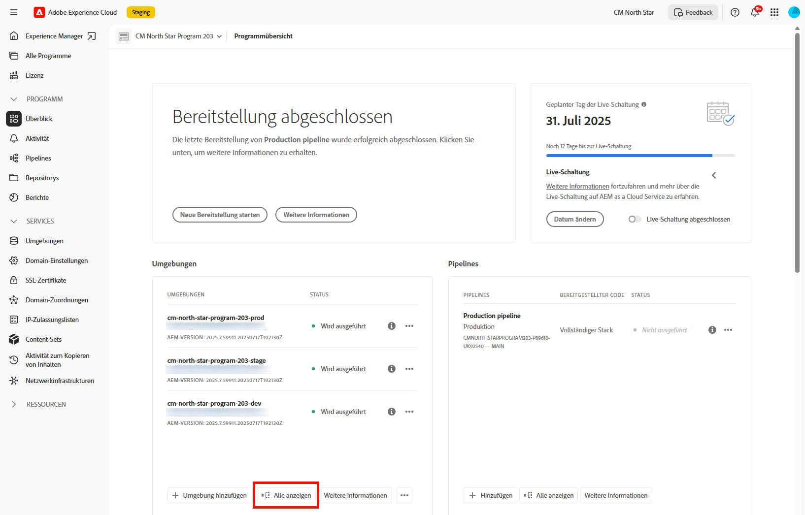

# Wiederherstellen des zuvor bereitgestellten Quell-Codes in AEM as a Cloud Service {#restore-previous-code-deployed}

>[!NOTE]
>
>Die in diesem Artikel beschriebene Funktion ist nur über das Beta-Programm verfügbar. Informationen zur Anmeldung bei der Beta-Version finden Sie unter [Rollback mit einem Klick bei Pipeline-Bereitstellungen](/help/implementing/cloud-manager/release-notes/current.md##one-click-rollback).

Verwenden Sie **Zuvor bereitgestellten Code wiederherstellen**, um eine Umgebung sofort – ohne Pipeline-Ausführung – auf den letzten erfolgreichen Build zurückzusetzen.

Öffnen Sie einfach das Menü  der ausgewählten Umgebung und wählen Sie **Wiederherstellen** > **Zuvor bereitgestellter Code**, um den zuletzt bereitgestellten Quell-Code in wenigen Sekunden zurückzusetzen.

>[!TIP]
>
>Sie können die aktive verwendete Quell-Code-Version in der Detailansicht der Umgebung auf der Registerkarte **Allgemein** anzeigen. Siehe [Anzeigen von Details einer Umgebung](/help/implementing/cloud-manager/manage-environments.md#viewing-environment).
>
>

**Zuvor bereitgestellten Code wiederherstellen** wird nur verfügbar, wenn die folgenden Bedingungen erfüllt sind:

* Pro erfolgreicher Pipeline-Ausführung ist nur eine Wiederherstellung zulässig. Schließen Sie zur erneuten Wiederherstellung eine weitere erfolgreiche Pipeline-Ausführung ab.
* Sie verfügen über die Berechtigung zum Wiederherstellen einer Umgebung **&#x200B;**. Weitere Informationen zum Verwalten von Berechtigungen finden Sie unter [Benutzerdefinierte Berechtigungen](/help/implementing/cloud-manager/custom-permissions.md).
* Ihre Organisation ist für das Beta-Programm registriert und das Feature Flag ist aktiviert.
* Das Programm läuft auf AEM as a Cloud Service.
* Die letzte Pipeline für diese Umgebung wurde **innerhalb der letzten 30 Tage** erfolgreich abgeschlossen und ausgeführt.
* Der Umgebungsstatus lautet *Wird ausgeführt* und es wird keine Pipeline ausgeführt.

**Bereits bereitgestellten Code wiederherstellen** funktioniert in `Production` Umgebung sowie in `Development` Umgebung, `Stage` und `Specialized Testing Environment`. Nach der Bestätigung startet Cloud Manager die Wiederherstellung und sendet eine Push-Benachrichtigung beim Start und nach erfolgreichem Abschluss.

>[!IMPORTANT]
>
>Adobe empfiehlt dringend, das Verfahren in `Stage` (*) zu*, `Production` Risiken zu reduzieren und Stabilität sicherzustellen.

Sollte eine Überprüfung fehlschlagen, öffnet Cloud Manager das folgende Dialogfeld mit einer Liste der nicht erfüllten Bedingungen. Die Schaltfläche **Bestätigen** ist deaktiviert, um die Wiederherstellung zu verhindern.

.

Wenn Sie nur verloren gegangene, beschädigte oder versehentlich gelöschte Daten auf ihren Originalzustand zurücksetzen möchten, können Sie [Inhalt wiederherstellen](/help/operations/restore.md) in AEM as a Cloud Service verwenden. Der Wiederherstellungsprozess wirkt sich nur auf die Inhalte aus, sodass Ihr Code und Ihre Version von AEM unverändert bleiben. 

**So stellen Sie den zuvor bereitgestellten Code wieder her:**

1. Melden Sie sich unter [my.cloudmanager.adobe.com](https://my.cloudmanager.adobe.com/) bei Cloud Manager an und wählen Sie die entsprechende Organisation aus.

1. Klicken Sie auf das Programm, für das Sie eine Wiederherstellung einleiten möchten.

1. Führen Sie einen der folgenden Schritte aus, um alle Umgebungen für das Programm aufzulisten:

   * Klicken Sie im linken Seitenmenü unter **Services** auf  **Umgebungen**.

     

   * Klicken Sie im linken Seitenmenü unter **Programm** auf **Überblick** und dann auf der Karte **Umgebungen** auf  **Alle anzeigen**.

     

     >[!NOTE]
     >
     >Die Karte **Umgebungen** listet nur drei Umgebungen auf. Klicken Sie auf der Karte auf **Alle anzeigen**, um *alle* Umgebungen des Programms anzuzeigen.

1. Klicken Sie in der Tabelle „Umgebungen“ rechts neben einer Umgebung, deren Quell-Code Sie wiederherstellen möchten, auf  und dann auf **Wiederherstellen** > **Zuvor bereitgestellter Code**.

   

1. Überprüfen Sie im Dialogfeld **Zuvor bereitgestellten Code wiederherstellen** die aktuell bereitgestellte Version sowie die Version, die Sie wiederherstellen möchten, und klicken Sie dann auf **Bestätigen**.

   

1. Cloud Manager setzt die Umgebung auf den früheren Build zurück, behält Inhalte und Konfiguration bei und markiert die Umgebung als **Wiederherstellung läuft**, bis die Bereitstellung abgeschlossen ist.

   
