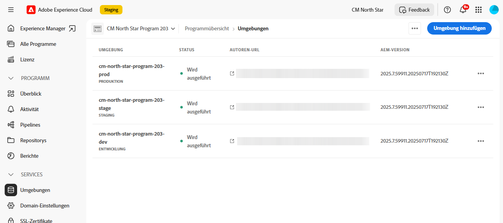
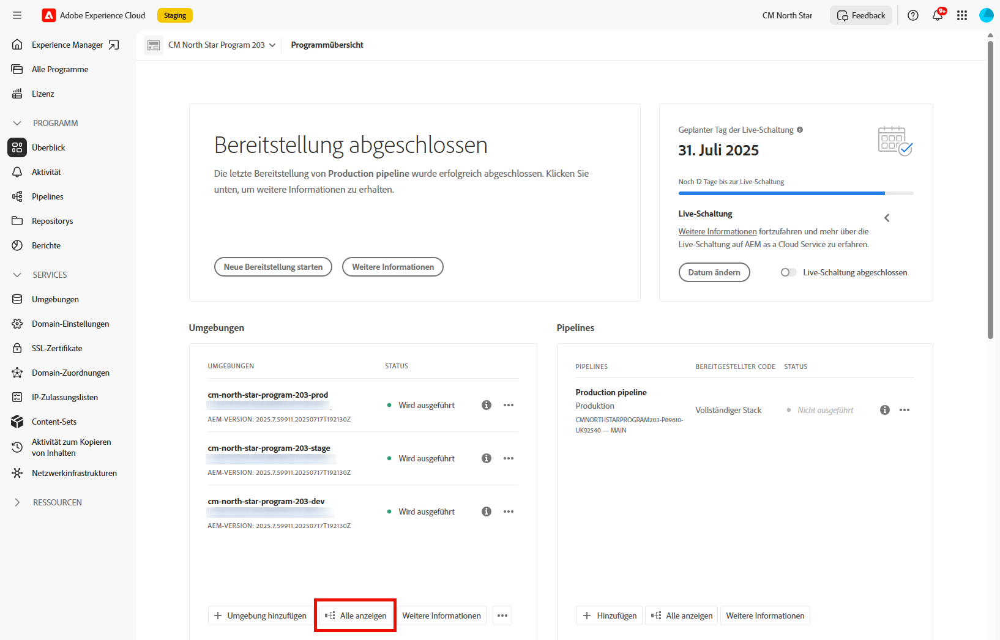
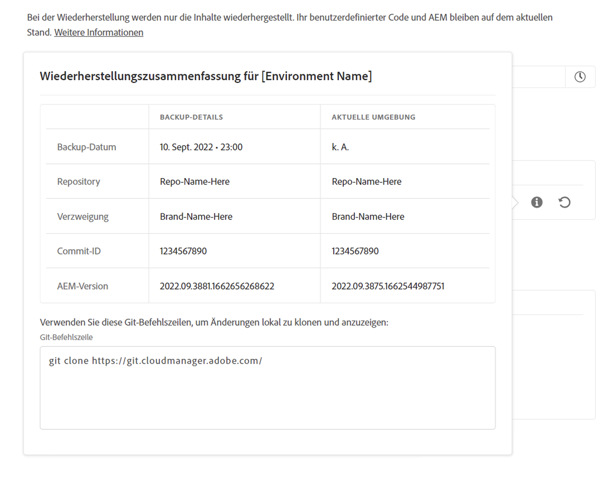
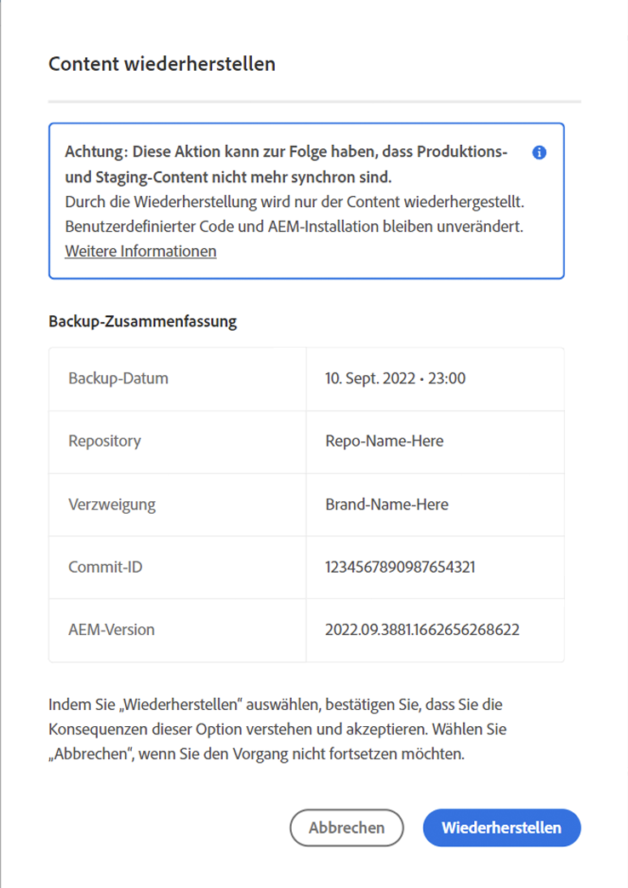
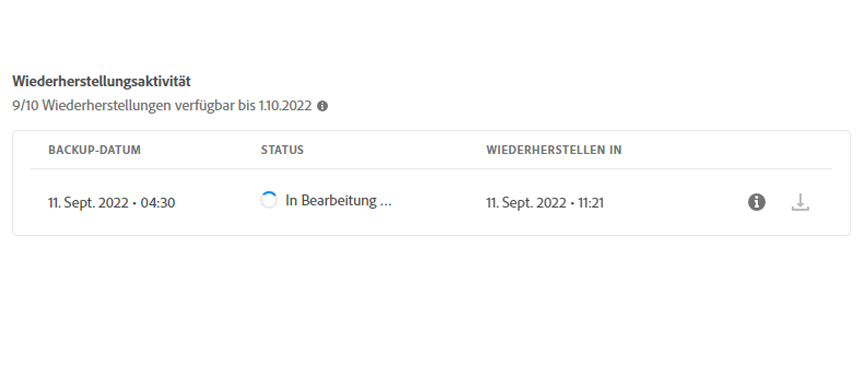

# Wiederherstellen von Inhalten in AEM as a Cloud Service {#content-restore}

Sie können mithilfe von Cloud Manager Inhalte von AEM as a Cloud Service aus einem Backup wiederherstellen.

Der Self-Service-Wiederherstellungsprozess von Cloud Manager kopiert Daten aus Adobe-Systemsicherungen und stellt sie in der Originalumgebung wieder her. Eine Wiederherstellung wird durchgeführt, um Daten, die verloren gegangen, beschädigt oder versehentlich gelöscht wurden, in ihren ursprünglichen Zustand zurückzuversetzen.

Der Wiederherstellungsprozess wirkt sich nur auf die Inhalte aus, sodass Ihr Code und Ihre Version von AEM unverändert bleiben. Sie können jederzeit einen Wiederherstellungsvorgang für einzelne Umgebungen starten.

Wenn Sie zuvor bereitgestellten Quellcode auf einfache und schnelle Weise wiederherstellen müssen, ohne eine neue Pipelineausführung Beginn zu müssen, können [Sie die Zurück wiederherstellen Symbol bereitgestellt verwenden](/help/operations/restore-previous-code-deployed.md).

Cloud Manager bietet zwei Arten von Sicherungskopien, mit denen Sie Inhalte wiederherstellen können.

* **Zeitpunkt:** Mit dieser Option werden kontinuierliche Backups wiederhergestellt, die innerhalb der letzten 24 Stunden erfasst wurden.
* **Letzte Woche**: Bei diesem Typ wird aus den Systemsicherungen der letzten sieben Tage vor den letzten 24 Stunden wiederhergestellt.

In beiden Fällen bleiben die Version Ihres benutzerspezifischen Codes und Ihre Version von AEM unverändert.

>[!TIP]
>
>Es ist auch möglich, Sicherungskopien [über die öffentliche API](https://developer.adobe.com/experience-cloud/cloud-manager/reference/api/) wiederherzustellen.

>[!WARNING]
>
>* Diese Funktion sollte nur verwendet werden, wenn schwerwiegende Probleme mit Code oder Inhalt aufgetreten sind.
>* Beim Wiederherstellen eines Backups werden alle Daten gelöscht, die nach diesem Backup hinzugefügt wurden. Staging wird ebenfalls auf die vorherige Version zurückgesetzt.
>* Bevor Sie eine Inhaltswiederherstellung starten, sollten Sie andere Optionen zur selektiven Inhaltswiederherstellung in Betracht ziehen.

## Optionen zur selektiven Inhaltswiederherstellung {#selective-options}

Bevor Sie eine vollständige Inhaltswiederherstellung vornehmen, sollten Sie diese Optionen in Erwägung ziehen, um Ihre Inhalte leichter wiederherzustellen.

* Wenn ein Paket für den gelöschten Pfad verfügbar ist, installieren Sie das Paket mit dem [Paket-Manager](/help/implementing/developing/tools/package-manager.md) erneut.
* Wenn der gelöschte Pfad eine Seite in Sites war, verwenden Sie die [Funktion „Baum wiederherstellen“](/help/sites-cloud/authoring/sites-console/page-versions.md).
* Wenn der gelöschte Pfad ein Asset-Ordner war und die Originaldateien verfügbar sind, laden Sie sie erneut über die [Assets-Konsole](/help/assets/add-assets.md) hoch.
* Wenn es sich bei dem gelöschten Inhalt um Assets handelt, sollten Sie das [Wiederherstellen früherer Versionen der Assets](/help/assets/manage-digital-assets.md) in Betracht ziehen.

Wenn keine der oben genannten Optionen funktioniert und der Inhalt des gelöschten Pfads signifikant ist, führen Sie eine Inhaltswiederherstellung durch, wie in den folgenden Abschnitten beschrieben.

## Erstellen einer Benutzerrolle {#user-role}

Standardmäßig ist keine Benutzerin und kein Benutzer berechtigt, Inhaltswiederherstellungen in der Entwicklungs-, Produktions- oder Staging-Umgebung auszuführen. Um diese Berechtigung an bestimmte Benutzende oder Gruppen zu delegieren, führen Sie die folgenden allgemeinen Schritte aus.

1. Erstellen Sie ein Produktprofil mit einem ausdrucksstarken Namen, der auf die Inhaltswiederherstellung verweist.
1. Stellen Sie die **Programmzugriff**-Berechtigung für das erforderliche Programm bereit.
1. Stellen Sie die Berechtigung **Umgebungswiederherstellung erstellen** je nach Anwendungsfall für die erforderliche Umgebung oder für alle Umgebungen des Programms bereit.
1. Weisen Sie dem Profil Benutzende zu.

Weitere Informationen zum Verwalten von Berechtigungen finden Sie unter [Benutzerdefinierte Berechtigungen](/help/implementing/cloud-manager/custom-permissions.md).

## Wiederherstellen des Inhalts einer Umgebung {#restoring-content}

>[!NOTE]
>
>Benutzende müssen über [geeignete Berechtigungen](#user-role) verfügen, um einen Wiederherstellungsvorgang zu starten.

**So stellen Sie den Inhalt einer Umgebung wieder her:**

1. Melden Sie sich unter [my.cloudmanager.adobe.com](https://my.cloudmanager.adobe.com/) bei Cloud Manager an und wählen Sie die entsprechende Organisation aus.

1. Klicken Sie auf das Programm, für das Sie eine Wiederherstellung einleiten möchten.

1. Führen Sie einen der folgenden Schritte aus, um alle Umgebungen für das Programm aufzulisten:

   * Klicken Sie im linken Seitenmenü unter **Services** auf  **Umgebungen**.

     

   * Klicken Sie im linken Seitenmenü unter **Programm** auf **Überblick** und dann auf der Karte **Umgebungen** auf  **Alle anzeigen**.

     

     >[!NOTE]
     >
     >Die Karte **Umgebungen** listet nur drei Umgebungen auf. Klicken Sie auf der Karte auf **Alle anzeigen**, um *alle* Umgebungen des Programms anzuzeigen.

1. Klicken Sie in der Tabelle „Umgebungen“ rechts neben einer Umgebung, deren Inhalt Sie wiederherstellen möchten, auf  und dann auf **Inhalt wiederherstellen**.

   

1. Wählen Sie in der Dropdown-Liste **Wiederherstellungszeit** auf der Registerkarte **Content wiederherstellen** der Seite der Umgebung den Zeitrahmen der Wiederherstellung aus.

   

   * Wenn Sie **Letzte 24 Stunden** ausgewählt haben, können Sie im angrenzenden Feld **Zeit** den genauen Zeitpunkt innerhalb der letzten 24 Stunden für die Wiederherstellung angeben.
   * Wenn Sie **Letzte Woche** ausgewählt haben, können Sie im angrenzenden Feld **Tag** ein Datum innerhalb der letzten sieben Tage auswählen, wobei die vergangenen 24 Stunden ausgeschlossen sind.

1. Sobald Sie ein Datum oder eine Uhrzeit ausgewählt haben, zeigt der Abschnitt **Verfügbare Sicherungskopien** unten eine Liste der verfügbaren Sicherungskopien, die wiederhergestellt werden können

1. Klicken Sie auf  neben einem Backup, um dessen Code-Version und AEM-Version anzuzeigen, und wägen Sie dann die Auswirkungen der Wiederherstellung ab, bevor Sie ein Backup auswählen (siehe [Auswählen des richtigen Backups](#choosing-backup)).

   

   Der für die Wiederherstellungsoptionen angezeigte Zeitstempel basiert auf der Zeitzone, in der sich der Computer der oder des Benutzenden befindet.

1. Klicken Sie am rechten Ende der Zeile, die das wiederherzustellende Backup darstellt, auf , um den Wiederherstellungsprozess zu starten.

1. Überprüfen Sie die Details im Dialogfeld **Content wiederherstellen** und klicken Sie dann auf **Wiederherstellen**.

   

Der Backup-Prozess wird gestartet. Sie können den Status der Aktivität in der Liste **[Wiederherstellungsaktivität](#restore-activity)** anzeigen. Die Dauer des Wiederherstellungsvorgangs hängt von der Größe und dem Profil des wiederherzustellenden Inhalts ab.

Wenn die Wiederherstellung erfolgreich abgeschlossen ist, führt die Umgebung Folgendes aus:

* Sie führt denselben Code und dieselbe AEM-Version aus wie zum Zeitpunkt der Initiierung des Wiederherstellungsvorgangs.
* Sie verfügt über denselben Inhalt, der beim Zeitstempel des ausgewählten Snapshots verfügbar war, wobei die Indizes neu erstellt wurden, damit sie dem aktuellen Code entsprechen.

## Auswählen des richtigen Backups {#choosing-backup}

Der Self-Service-Wiederherstellungsprozess von Cloud Manager stellt nur Inhalte in AEM wieder her. Aus diesem Grund müssen Sie Code-Änderungen sorgfältig prüfen, die zwischen dem gewünschten Wiederherstellungszeitpunkt und der aktuellen Zeit vorgenommen wurden. Überprüfen Sie den Commit-Verlauf zwischen der aktuellen Commit-ID und der ID, zu der wiederhergestellt wird.

Es gibt verschiedene Szenarien.

* Der benutzerdefinierte Umgebungs-Code und die Wiederherstellung befinden sich im selben Repository und in derselben Verzweigung.
* Der benutzerdefinierte Umgebungs-Code und die Wiederherstellung teilen sich ein Repository, verwenden eine separate Verzweigung und stammen aus einem gemeinsamen Commit.
* Der benutzerdefinierte Umgebungs-Code und die Wiederherstellung befinden sich in verschiedenen Repositorys.
   * In diesem Fall wird keine Commit-ID angezeigt.
   * Adobe empfiehlt dringend, beide Repositorys zu klonen und ein Vergleichs-Tool zu verwenden, um die Verzweigungen zu vergleichen.

Beachten Sie außerdem, dass eine Wiederherstellung dazu führen kann, dass Ihre Produktions- und Staging-Umgebungen nicht mehr synchronisiert sind. Sie sind für die Folgen der Wiederherstellung von Inhalten verantwortlich.

## Wiederherstellungsaktivität {#restore-activity}

Die Tabelle **Wiederherstellungsaktivität** zeigt den Status der zehn letzten Wiederherstellungsanfragen einschließlich aller aktiven Wiederherstellungsvorgänge an.

Wenn Sie auf  für ein Backup klicken, können Sie Protokolle für dieses Backup herunterladen und die Code-Details einschließlich der Unterschiede zwischen dem Snapshot und den Daten zum Zeitpunkt der Wiederherstellung überprüfen.

## Offsite-Backup {#offsite-backup}

Regelmäßige Backups decken das Risiko von versehentlichen Löschungen oder technischen Fehlern in AEM Cloud Services ab, aber es können zusätzliche Risiken durch das Fehlschlagen bezüglich einer Region entstehen. Neben der Verfügbarkeit besteht das größte Risiko bei Ausfällen in solchen Regionen in erster Linie in Datenverlust.

AEM as a Cloud Service mindert dieses Risiko für alle AEM-Produktionsumgebungen. Das heißt, dass alle AEM-Inhalte kontinuierlich in eine Remote-Region kopiert werden. Durch diesen Prozess steht der Inhalt drei Monate lang zur Wiederherstellung zur Verfügung. Diese Funktion wird als Offsite-Backup bezeichnet.

AEM Service Reliability Engineering stellt während Ausfällen in der Datenregion die Staging- und Produktionsumgebung in AEM Cloud Service von Offsite-Backups wieder her.

## Daten Prinzipien der Regionszuordnung {#data-region-mapping-principles}

Adobe Systems folgt einer Reihe interner Richtlinien zur Festlegung von Daten Region Zuordnungen für **AEM als Cloud Service**. Diese Richtlinien wurden entwickelt, um die betriebliche Effizienz zu unterstützen, die Einhaltung regionaler regulatorischer Anforderungen sicherzustellen und eine konsistente Kundenerlebnis auf den globalen Märkten zu gewährleisten.

### Transparenz für die Regionszuordnung {#region-mapping-transparency}

Adobe Systems veröffentlicht keine detaillierten Region-zu-Region-Zuordnungsinformationen.\
Wenn Kunden spezifische oder berechtigte Fragen zu regionalen Implementierung, Datenresidenz oder Compliance-Auswirkungen haben, wird empfohlen, sich direkt über den offiziellen Support oder Konto Kanäle an Adobe Systems zu wenden.

### Grundprinzipien für die Zuordnung von Daten Regionen {#core-principles}

Bei der Bestimmung geeigneter Daten Region das Mapping wendet Adobe Systems mehrere priorisierte Kriterien an:

1. **Verlassen Sie nicht die globale Region**\
   Die Bereitstellungen erfolgen in einer der wichtigsten globalen Regionen: **APAC,****EMEA** und Nord- und **Südamerika**.

2. **Verlassen Sie den Kontinent nicht**\
   Wo immer möglich, bleiben Datenreplikation und Failover auf demselben Kontinent.

3. **Verlassen Sie das Land nicht**\
   Soweit technisch möglich, bleiben die Daten innerhalb der gleichen Landesgrenzen.

### Behandlung von Ausnahmen {#handling-exceptions}

Wenn die oben genannten Kriterien aufgrund von technischen oder infrastrukturellen Einschränkungen nicht erfüllt werden können, gelten Adobe Systems zusätzliche Überlegungen:

* **Europa-spezifische Richtlinie**\
  Backup- oder sekundäre Regionen sollten sich nicht in Nicht-EU-Ländern befinden.\
  (Das Gegenteil – die Verwendung eines EU-Landes als Backup für eine Nicht-EU-Vorwahl – kann akzeptabel sein, wenn es keine bessere Option für dasselbe Land gibt.)

* **Meiden Sie bestimmte Regionen**\
  Regionen mit restriktiven Datenrichtlinien oder erhöhtem regulatorischem Risiko sollten als Backup- oder Failover-Standorte vermieden werden.

Wenn Kunden eine Klärung benötigen oder Compliance-bedingte Anforderungen haben, empfiehlt Adobe Systems, sich an die Adobe Systems Konto Team oder die Supportorganisation zu wenden, um eine auf ihr spezifisches Szenario zugeschnittene Beratung zu erhalten.

## Einschränkungen {#limitations}

Die Verwendung des Self-Service-Wiederherstellungsmechanismus unterliegt den folgenden Einschränkungen.

* Wiederherstellungsvorgänge sind auf sieben Tage beschränkt, d. h. es ist nicht möglich, einen Snapshot wiederherzustellen, der älter als sieben Tage ist.
* Pro Kalendermonat sind maximal zehn erfolgreiche Wiederherstellungen in allen Umgebungen eines Programms zulässig.
* Nach der Erstellung der Umgebung dauert es sechs Stunden, bis der erste Snapshot für die Sicherung erstellt wird. Solange dieser Snapshot nicht erstellt ist, kann keine Wiederherstellung in der Umgebung durchgeführt werden.
* Ein Wiederherstellungsvorgang wird nicht initiiert, wenn gerade eine Konfigurations-Pipeline (Full-Stack oder Web-Stufe) für die Umgebung ausgeführt wird.
* Eine Wiederherstellung kann nicht initiiert werden, wenn bereits eine andere Wiederherstellung in derselben Umgebung ausgeführt wird.
* In seltenen Fällen kann es vorkommen, dass aufgrund der Beschränkung von 24 Stunden bzw. 7 Tagen für Sicherungskopien die ausgewählte Sicherungskopie aufgrund einer Verzögerung zwischen dem Zeitpunkt der Auswahl und dem Beginn der Wiederherstellung nicht mehr verfügbar ist.
* Daten gelöschter Umgebungen sind dauerhaft verloren und können nicht wiederhergestellt werden.
