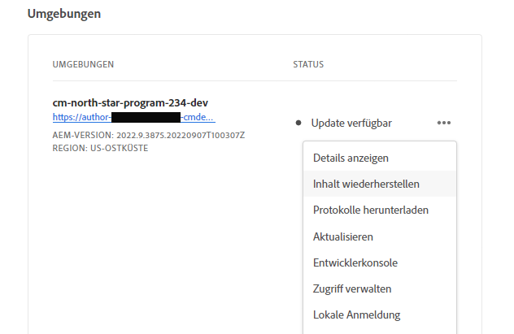

# Wiederherstellung von Inhalten in AEM as a Cloud Service {#content-restore}

Erfahren Sie, wie Sie mithilfe von Cloud Manager AEM as a Cloud Service Inhalte aus einer Sicherungskopie wiederherstellen können.

>[!NOTE]
>
>Diese Funktion steht nur für [frühzeitiges Adoptionsprogramm](/help/implementing/cloud-manager/release-notes/current.md#early-adoption) und hat einige Einschränkungen, die über die im Artikel dokumentierten hinausgehen. In der frühen Annahmephase:
>
>* Die Funktion ist nur in Entwicklungsumgebungen verfügbar.
>* Die Inhaltswiederherstellung ist auf zwei pro Monat pro Programm beschränkt.
>
>Weitere Informationen zum bestehenden Sicherungs- und Wiederherstellungssystem für AEM as a Cloud Service finden Sie im Dokument . [Sicherung und Wiederherstellung in AEM as a Cloud Service](/help/operations/backup.md)

## Übersicht {#overview}

Der Self-Service-Wiederherstellungsprozess von Cloud Manager kopiert Daten aus Adobe-Systemsicherungen und stellt sie in der Originalumgebung wieder her. Es wird eine Wiederherstellung durchgeführt, um verlorene, beschädigte oder versehentlich gelöschte Daten in den ursprünglichen Zustand zurückzugeben.

Der Wiederherstellungsprozess wirkt sich nur auf die Inhalte aus, sodass Ihr Code und Ihre Version von AEM unverändert bleiben. Sie können jederzeit einen Wiederherstellungsvorgang für einzelne Umgebungen starten.

Cloud Manager bietet zwei Arten von Sicherungskopien, mit denen Sie Inhalte wiederherstellen können.

* **Point-in-Time (PIT):** Dieser Typ wird aus kontinuierlichen Systemsicherungen der letzten 24 Stunden ab der aktuellen Zeit wiederhergestellt.
* **Letzte Woche**: Dieser Typ wird aus den Systemsicherungen der letzten sieben Tage vor den letzten 24 Stunden wiederhergestellt.

In beiden Fällen bleiben die Version Ihres benutzerspezifischen Codes und die AEM unverändert.

>[!TIP]
>
>Es ist auch möglich, Sicherungskopien [über die öffentliche API](https://developer.adobe.com/experience-cloud/cloud-manager/reference/api/) wiederherzustellen.

## Wiederherstellen von Inhalten {#restoring-content}

Bestimmen Sie zunächst den Zeitrahmen des Inhalts, den Sie wiederherstellen möchten. Führen Sie diese Schritte aus, um den Inhalt Ihrer Umgebung aus einer Sicherungskopie wiederherzustellen.

>[!NOTE]
>
>Ein Benutzer mit der **Business Owner** oder **Bereitstellungsmanager** -Rolle muss angemeldet sein, um einen Wiederherstellungsvorgang zu starten.

1. Melden Sie sich unter [my.cloudmanager.adobe.com](https://my.cloudmanager.adobe.com/) bei Cloud Manager an und wählen Sie die entsprechende Organisation aus.

1. Klicken Sie auf das Programm, für das Sie eine Wiederherstellung starten möchten.

1. Aus dem **Programmübersicht** in der **Umgebungen** -Karte, klicken Sie auf die Schaltfläche mit Auslassungspunkten neben der Umgebung, für die Sie eine Wiederherstellung starten möchten, und wählen Sie **Inhalt wiederherstellen**.

   

   * Alternativ können Sie auch direkt zur Registerkarte **Inhalt wiederherstellen** auf der Seite mit den Umgebungsdetails einer bestimmten Umgebung navigieren.

1. Wählen Sie zunächst auf der Registerkarte **Inhalt wiederherstellen** der Seite mit den Umgebungsdetails den Zeitrahmen der Wiederherstellung unter der Dropdown-Liste **Wiederherstellungszeit**.

   1. Wenn Sie **Letzte 24 Stunden** die Nachbarländer **Zeit** -Feld können Sie die genaue Zeit innerhalb der letzten 24 Stunden angeben, die wiederhergestellt werden sollen.

      

   1. Wenn Sie **Letzte Woche** die Nachbarländer **Tag** -Feld können Sie ein Datum aus den letzten sieben Tagen auswählen, mit Ausnahme der letzten 24 Stunden.

      

1. Sobald Sie ein Datum oder eine Uhrzeit ausgewählt haben, zeigt der Abschnitt **Verfügbare Sicherungskopien** unten eine Liste der verfügbaren Sicherungskopien, die wiederhergestellt werden können

   

1. Suchen Sie die Sicherungskopie, die Sie wiederherstellen möchten, indem Sie das Informationssymbol verwenden, um Informationen über die in dieser Sicherungskopie enthaltene Version des Codes und der AEM-Version anzuzeigen und die Auswirkungen einer Wiederherstellung bei der [Auswahl der Sicherungskopie](#choosing-the-right-backup) zu berücksichtigen.

   

   * Beachten Sie, dass der für die Wiederherstellungsoptionen angezeigte Zeitstempel auf der Zeitzone des Computers der Person beruht.

1. Um den Wiederherstellungsprozess zu starten, klicken Sie auf das Symbol **Wiederherstellen** am rechten Ende der Zeile, die die wiederherzustellende Sicherungskopie darstellt.

1. Überprüfen Sie die Details im Dialogfeld **Inhalt wiederherstellen**, bevor Sie Ihre Anfrage durch Klicken auf **Wiederherstellen** bestätigen.

   

Der Backup-Prozess wird initiiert und Sie können seinen Status im **[Aktivität wiederherstellen](#restore-activity)** Liste. Die Dauer des Wiederherstellungsvorgangs hängt von der Größe und dem Profil des wiederherzustellenden Inhalts ab.

Wenn die Wiederherstellung erfolgreich abgeschlossen wurde, wird die Umgebung wie folgt aussehen:

* Sie führt denselben Code und dieselbe AEM-Version aus wie zum Zeitpunkt der Initiierung des Wiederherstellungsvorgangs.
* Sie verfügt über denselben Inhalt, der beim Zeitstempel des ausgewählten Snapshots verfügbar war, wobei die Indizes neu erstellt wurden, damit sie dem aktuellen Code entsprechen.

## Auswahl der richtigen Sicherungskopie {#choosing-backup}

Der Self-Service-Wiederherstellungsprozess von Cloud Manager stellt nur Inhalte wieder AEM. Aus diesem Grund müssen Sie Codeänderungen sorgfältig berücksichtigen, die zwischen dem gewünschten Wiederherstellungspunkt und der aktuellen Zeit vorgenommen wurden, indem Sie den Commitverlauf zwischen der aktuellen Commit-ID und der wiederhergestellten überprüfen.

Es gibt verschiedene Szenarien.

* Der benutzerdefinierte Code in der Umgebung und die Wiederherstellung befinden sich im selben Repository und in derselben Verzweigung.
* Der benutzerdefinierte Code in der Umgebung und die Wiederherstellung befinden sich im selben Repository, jedoch in einer anderen Verzweigung mit einem gemeinsamen Commit.
* Der benutzerdefinierte Code in der Umgebung und die Wiederherstellung befinden sich in verschiedenen Repositorys.
   * In diesem Fall wird keine Commit-ID angezeigt.
   * Es wird dringend empfohlen, beide Repositorys zu klonen und ein Vergleichs-Tool zu verwenden, um die Verzweigungen zu vergleichen.

Beachten Sie außerdem, dass eine Wiederherstellung dazu führen kann, dass Ihre Produktions- und Staging-Umgebungen nicht mehr synchronisiert sind. Sie sind für die Folgen der Wiederherstellung von Inhalten verantwortlich.

## Wiederherstellungsaktivität {#restore-activity}

Die **Aktivität wiederherstellen** zeigt den Status der zehn letzten Wiederherstellungsanfragen einschließlich aller aktiven Wiederherstellungsvorgänge an.

Wenn Sie auf das Informationssymbol für ein Backup klicken, können Sie Protokolle für dieses Backup herunterladen und die Code-Details einschließlich der Unterschiede zwischen dem Snapshot und den Daten zum Zeitpunkt der Wiederherstellung überprüfen.

## Offsite-Sicherung {#offsite-backup}

Regelmäßige Backups decken das Risiko von versehentlichen Löschungen oder technischen Fehlern in AEM Cloud Services ab, aber es können zusätzliche Risiken durch das Fehlschlagen bezüglich einer Region entstehen. Neben der Verfügbarkeit besteht das größte Risiko bei Ausfällen in solchen Regionen in erster Linie in Datenverlust.

AEM as a Cloud Service deckt dieses Risiko für alle AEM-Produktionsumgebungen ab, indem der gesamte AEM-Inhalt kontinuierlich in eine entfernte Region kopiert und für einen Zeitraum von drei Monaten für die Wiederherstellung zur Verfügung gestellt wird. Diese Funktion wird als Offsite-Backup bezeichnet.

Die Wiederherstellung von AEM Cloud Services für Staging- und Produktionsumgebungen erfolgt im Fall von Ausfällen in der Datenregion durch AEM Service Reliability Engineering.

## Beschränkungen {#limitations}

Die Verwendung des Self-Service-Wiederherstellungsmechanismus unterliegt den folgenden Einschränkungen.

* Wiederherstellungsvorgänge sind auf sieben Tage beschränkt, d. h. es ist nicht möglich, einen Snapshot wiederherzustellen, der älter als sieben Tage ist.
* Pro Kalendermonat sind maximal zehn erfolgreiche Wiederherstellungen in allen Umgebungen eines Programms zulässig.
* Nach der Erstellung der Umgebung dauert es sechs Stunden, bis der erste Snapshot für die Sicherung erstellt wird. Solange dieser Snapshot nicht erstellt ist, kann keine Wiederherstellung in der Umgebung durchgeführt werden.
* Ein Wiederherstellungsvorgang wird nicht initiiert, wenn gerade eine Konfigurations-Pipeline (Full-Stack oder Web-Stufe) für die Umgebung ausgeführt wird.
* Eine Wiederherstellung kann nicht initiiert werden, wenn bereits eine andere Wiederherstellung in derselben Umgebung ausgeführt wird.
* In seltenen Fällen kann es vorkommen, dass aufgrund der Beschränkung von 24 Stunden bzw. 7 Tagen für Sicherungskopien die ausgewählte Sicherungskopie aufgrund einer Verzögerung zwischen dem Zeitpunkt der Auswahl und dem Beginn der Wiederherstellung nicht mehr verfügbar ist.
* Daten gelöschter Umgebungen sind dauerhaft verloren und können nicht wiederhergestellt werden.
