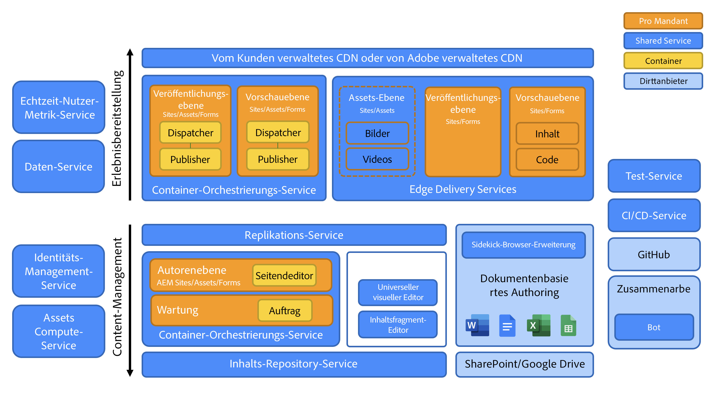
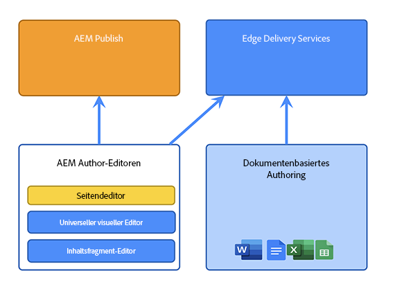
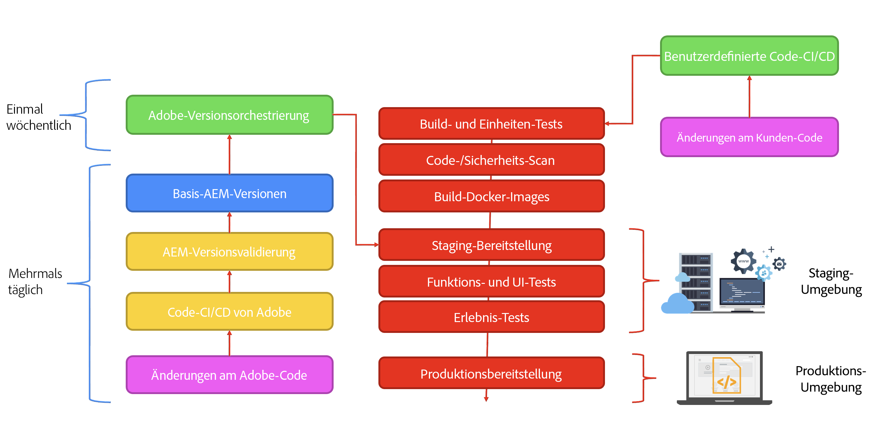

# Einführung in die Architektur von Adobe Experience Manager as a Cloud Service {#an-introduction-to-the-architecture-adobe-experience-manager-as-a-cloud-service}

>[!CONTEXTUALHELP]
>id="intro_aem_cloudservice_architecture"
>title="Einführung in die Architektur von AEM as a Cloud Service"
>abstract="Auf dieser Registerkarte können Sie die neue Architektur von AEM as a Cloud Service anzeigen und die Änderungen verstehen. AEM hat zu einer dynamischen Architektur mit einer variablen Anzahl von Bildern geführt, sodass es wichtig ist, sich Zeit dafür zu nehmen, die Cloud-Architektur zu verstehen."
>additional-url="https://video.tv.adobe.com/v/330542/" text="Architekturüberblick"

Adobe Experience Manager (AEM) as a Cloud Service bietet einen Satz an zusammenstellbaren Services für die Erstellung und Verwaltung von Erlebnissen mit hoher Wirkung.

Diese Seite bietet eine Einführung in die logische Architektur, die Dienstarchitektur, die Systemarchitektur und die Entwicklungsarchitektur für AEM as a Cloud Service.

## Logische Architektur {#logical-architecture}

AEM as a Cloud Service besteht aus übergeordneten Lösungen wie AEM Sites, AEM Assets und AEM Forms. Diese Dienste sind einzeln lizenziert, können aber gemeinsam verwendet werden. Jede Lösung verwendet eine Kombination aus zusammenstellbaren Diensten, die von AEM as a Cloud Service bereitgestellt werden, abhängig von den jeweiligen Anwendungsfällen.

### Programme {#programs}

AEM-Anwendungen werden in Form eines [Programms](/help/implementing/cloud-manager/getting-access-to-aem-in-cloud/program-types.md) materialisiert, die Sie in der Cloud Manager-Anwendung gemäß Ihren Lizenzberechtigungen erstellen. Diese Programme geben Ihnen vollständige Kontrolle darüber, wie die zugehörige AEM-Anwendung benannt und konfiguriert wird und wie Berechtigungen im Kontext eines bestimmten Projekts zugewiesen werden.

Als Kundin oder Kunde werden Sie in der Regel durch Adobe als **Mandant**, auch als bekannt als *IMS-Organisation* (Identity Management-System) identifiziert. Ein Mandant kann so viele Programme wie nötig haben und lizenzieren. So ist es zum Beispiel üblich, ein zentrales Programm für AEM Assets zu verwenden, während AEM Sites in mehreren Programmen verwendet werden kann, die mehreren Online-Erlebnissen entsprechen.

>[!NOTE]
>
>AEM Edge Delivery Services werden in Cloud Manager als Lösung der obersten Ebene bereitgestellt und sind aus Lizenzierungsgründen gleichzeitig Teil der anderen Hauptlösungen. Zum Beispiel AEM Sites mit Edge Delivery Services.

Ein Programm kann mit einer beliebigen Kombination der übergeordneten Lösungen konfiguriert werden. Jede Lösung kann ein oder mehrere Add-ons unterstützen.  Zum Beispiel Commerce oder Screens für AEM Sites, Dynamic Media oder Brand Portal für AEM Assets.

### Umgebungen {#environments}

Sobald ein Programm mit den Lösungen AEM Sites, AEM Assets oder AEM Forms erstellt wurde, werden die zugehörigen AEM-Instanzen in Form von AEM-Umgebungen in diesem Programm dargestellt.

Es gibt vier Arten von [Umgebungen](/help/implementing/cloud-manager/manage-environments.md), die mit AEM as a Cloud Service verfügbar sind:

* Produktionsumgebung:

   * Eine Produktionsumgebung enthält die Anwendungen für Geschäftsleute und führt die Live-Erlebnisse aus.

* Staging-Umgebung:

   * Eine Staging-Umgebung ist in der Regel mit einer Produktionsumgebung in einer 1::1-Beziehung verknüpft.
   * Die Staging-Umgebung ist in erster Linie für automatisierte Tests ausgelegt, bevor Änderungen an der Anwendung in die Produktionsumgebung übertragen werden.
      * Dies ist unabhängig von den Änderungen, die entweder von Adobe im Rahmen eines Wartungsupdates oder von Ihren Code-Bereitstellungen initiiert werden.
      * Im Falle einer Code-Bereitstellung können Sie auch manuelle Tests durchführen.
   * Der Inhalt der Staging-Umgebung wird in der Regel mithilfe der Self-Service-Funktion zum Kopieren von Inhalten mit dem Produktionsinhalt synchronisiert.
   * Führen Sie Leistungs- und Sicherheitstests in der Staging-Umgebung durch.  Sie hat dieselbe Größe wie die Produktion.
* Entwicklungsumgebung:
   * Eine Entwicklungsumgebung ermöglicht Ihren Entwickelnden die Implementierung und Prüfung von AEM-Anwendungen unter denselben Laufzeitbedingungen wie bei den Staging- und Produktionsumgebungen.
   * Die Änderungen durchlaufen eine Bereitstellungs-Pipeline, was für dieselbe Code-Qualität und Sicherheits-Gates wie in Produktions-Bereitstellungs-Pipelines sorgt.
   * Entwicklungsumgebungen haben nicht dieselbe Größe wie Staging- und Produktionsumgebungen und sollten nicht für Leistungs- und Sicherheitstests verwendet werden.
* Schnelle Entwicklungsumgebung (RDE):
   * Eine RDE-Umgebung ermöglicht eine schnelle Entwicklung von Iterationen bei der Bereitstellung von neuem oder vorhandenem Code in den RDE-Instanzen, ohne dass eine formale Bereitstellungs-Pipeline wie in regulären Entwicklungsumgebungen durchlaufen wird.

### Edge Delivery Services {#logical-architecture-edge-delivery-services}

Ein AEM-Programm kann auch mit den [Edge Delivery Services](/help/edge/overview.md) konfiguriert werden.

Nach der Konfiguration kann AEM auf GitHub-Code-Repositorys verweisen, die zum Erstellen der Erlebnisse mit Edge Delivery Services verwendet werden. Daher stehen neue Konfigurationsoptionen für die zugehörigen Erlebnisse zur Verfügung. Dazu gehören die Einrichtung des von Adobe verwalteten CDN und der Zugriff auf Lizenzierungsmetriken oder SLA-Berichte.

## Dienstarchitektur {#service-architecture}

Die Liste der übergeordneten, zusammenstellbaren Dienste in AEM as a Cloud Service kann mit zwei Segmenten dargestellt werden: Content-Management und Erlebnis-Bereitstellung:

Für das Content-Management gibt es zwei Hauptsätze an Diensten für die Inhaltserstellung, die beide als *Inhaltsquellen* dargestellt werden:

* AEM-Autoren-Ebene: 
Bietet eine Web-basierte Schnittstelle (mit zugehörigen APIs) für die Verwaltung von Web-Inhalten. Dies funktioniert für beide Ansätze:
   * Headful – über den Seiten-Editor und den universellen Editor
   * Headless – über den Inhaltsfragmenteditor
* Die Ebene des dokumentbasierten Authorings: 
Ermöglicht die Erstellung von Inhalten mithilfe von Standardanwendungen wie:
   * Microsoft Word und Excel – über SharePoint
   * Google Docs und Sheets – über Google Drive

Bei der Erlebnis-Bereitstellung gibt es bei der Verwendung von AEM Sites oder AEM Forms auch zwei Hauptsätze an Diensten, die sich nicht gegenseitig ausschließen und unter einem gemeinsam genutzten, von Adobe verwalteten CDN (Content Delivery Network) als unterschiedliche Ursprünge arbeiten:

* Die AEM-Veröffentlichungsebene:
   * Führt eine Farm mit standardmäßigen AEM-Publishern und Dispatchern aus, wodurch Web-Seiten und API-Inhalte (z. B. GraphQL), die mit veröffentlichten Inhalten zusammengestellt wurden, dynamisch gerendert werden können.
   * Basiert hauptsächlich auf der Server-seitigen Anwendungslogik.
* Edge Delivery-Veröffentlichungsebene:
   * Ermöglicht das dynamische Rendering von Web-Seiten und API-Inhalten aus verschiedenen Inhaltsquellen, z. B. der AEM-Autoren-Ebene oder der dokumentbasierten Authoring-Ebene.
   * Basiert auf der Client-seitigen Anwendungslogik und wurde für maximale Leistung entwickelt.

Dort befinden sich auch die wichtigsten benachbarten Dienste:

* Die Edge-Bereitstellungs-Assets-Ebene:
   * Ermöglicht die Bereitstellung genehmigter und veröffentlichter Medienelemente aus AEM Assets. Zum Beispiel Bilder und Videos.
   * Auf die Medienelemente wird in der Regel aus Erlebnissen verwiesen, die auf der AEM-Veröffentlichungsebene oder der Edge-Bereitstellungs-Veröffentlichungsebene ausgeführt werden, oder aus jeder anderen in AEM Assets integrierten Adobe Experience Cloud-Anwendung.
* Die AEM-Vorschau-Ebene und die Edge Delivery Services-Vorschau-Ebene:
   * Sind auch für Erlebnisse verfügbar, die mit der AEM-Veröffentlichungsebene oder der Edge Delivery-Veröffentlichungsebene erstellt wurden.
   * Ermöglicht es Autorinnen und Autoren von Inhalten, die Inhalte im Kontext vor Veröffentlichungsvorgängen in der Vorschau anzuzeigen.

>[!NOTE]
>
>Standardmäßig verfügen Programme, die nur für Assets vorgesehen sind, weder über eine Veröffentlichungsebene noch über eine Vorschauebene.

Es gibt weitere benachbarte Dienste:

* Der Replikationsdienst:
   * Wird zwischen der Content-Management-Ebene und der Erlebnis-Bereitstellungs-Ebene platziert.
   * Ist für die Verarbeitung der *Veröffentlichungsvorgänge* verantwortlich, die von Inhaltsautorinnen und Inhaltsautoren herausgegeben werden, und stellt dann die veröffentlichten Inhalte für die Veröffentlichungsebenen (AEM oder Edge-Bereitstellung) bereit.

  >[!NOTE]
  >Der Replikationsdienst durchlief eine vollständige Neugestaltung im Vergleich zu den 6.x-Versionen von AEM, da das Replikations-Framework aus früheren AEM-Versionen nicht mehr zum Veröffentlichen von Inhalten verwendet wird.
  >
  >Die neueste Architektur basiert auf einem Ansatz, der auf *Veröffentlichen und Abonnieren* mit Cloud-basierten Inhaltswarteschlangen beruht. Ermöglicht für die AEM Veröffentlichungsebene einer variablen Anzahl von Publishern, den Veröffentlichungsinhalt zu abonnieren, und ist ein wesentlicher Bestandteil des Erreichens einer echten und schnellen automatischen Skalierung für AEM as a Cloud Service

* Der Content-Repository-Dienst:
   * Wird von der AEM-Autoren-Ebene verwendet.
   * Ist eine Cloud-basierte Instanz eines JCR-kompatiblen Content-Repository, das von der Apache Oak-Technologie implementiert wird.
   * Die Persistenz von Inhalten basiert hauptsächlich auf Blob-basiertem Cloud-Speicher.
* Der CI/CD-Dienst:
   * Stellt die Teilmenge der Cloud Manager-Funktionen dar, die für die Verwaltung von Bereitstellungs-Pipelines für die AEM-Umgebungen vorgesehen sind.
* Der Testdienst:
   * Stellt die zugrunde liegende Infrastruktur dar, die für die Ausführung verwendet wird:
      * Funktionstests,
      * UI-Tests: beispielsweise basierend auf Selenium- oder Cypress-Skripten,
      * Erlebnisprüfungstests: beispielsweise Lighthouse-Bewertungen,

     als Teil einer Bereitstellungs-Pipeline in eine AEM-Umgebung oder als Teil einer GitHub-Abrufanfrage an ein Edge-Bereitstellungs-Code-Repository.
* Der Datendienst:
   * Ist für die Anzeige von Kundendaten wie Lizenzierungsmetriken (z. B. Inhaltsanforderungen, Speicher, Benutzende) oder Nutzungsberichten (z. B. die Anzahl der Uploads und Downloads) zuständig.
   * Die Kundendaten können über APIs und innerhalb von Produktbenutzeroberflächen (z. B. Cloud Manager) bereitgestellt werden.
* Der betriebliche Telemetrie-Dienst:
   * Ist für die Erfassung von Schlüsselmetriken aus einem Kundenerlebnis (z. B. Seitenansichten, Web-Lebenszyklen, Konversionsereignisse) und für die Beantwortung verknüpfter Abfragen zuständig (z. B. Top-Seitenansichten für eine bestimmte Domain in den letzten 7 Tagen).
* Der Asset Compute-Service:
   * ist für die Verarbeitung hochgeladener Bilder, Videos und Dokumente zuständig, z. B. PDF- und Adobe Photoshop-Dateien. Die Verarbeitung kann Adobe Sensei verwenden, um Bild- und Videometadaten (wie beschreibende Tags oder Primärfarbtöne) zu extrahieren und dann Ausgabedarstellungen (wie unterschiedliche Größen oder Formate) mit Zugriff auf APIs wie die Adobe Photoshop- und Adobe Lightroom-APIs zu generieren.
* Der Identity Management-Dienst (IMS):
   * Ist die zentrale Stelle, die für die Verwaltung und Authentifizierung von Benutzenden und Benutzergruppen für eine bestimmte Adobe Experience Cloud-Anwendung zuständig ist (z. B. die Cloud Manager- oder AEM-Autoren-Ebene).
   * Der Zugriff erfolgt über die Adobe Admin Console.

## Systemarchitektur {#system-architecture}

### AEM Autoren-, Vorschau- und Veröffentlichungsebenen {#aem-author-preview-publish-tiers}

Die AEM-Autoren- und -Veröffentlichungsebenen werden als Satz von Docker-Containern implementiert, die von einem standardmäßigen Container-Orchestrierungsdienst verwaltet werden. Die daraus resultierende, containerisierte Architektur ist ein vollständig dynamisches System mit einer variablen Anzahl von Pods, das von der tatsächlichen Aktivität (für Content-Management) und dem tatsächlichen Traffic (für die Erlebnis-Bereitstellung) abhängt. Dies ermöglicht es AEM as a Cloud Service, Ihren Traffic-Mustern bei deren Änderung Rechnung zu tragen.

Die AEM Autoren-Ebene wird als Cluster von AEM-Autoren-Pods verwendet, die ein einzelnes Content-Repository gemeinsam nutzen. Mindestens zwei Pods ermöglichen die Kontinuität des Geschäftsbetriebs, während Wartungsaufgaben ausgeführt werden oder ein Bereitstellungsprozess stattfindet.

Die AEM-Veröffentlichungsebene wird als Farm von AEM-Veröffentlichungsinstanzen mit jeweils einem eigenen Content-Repository mit veröffentlichten Inhalten betrieben. Jeder Publisher ist an eine einzige Apache-Instanz gekoppelt, die mit dem AEM-Dispatcher-Modul für eine materialisierte Ansicht des Inhalts ausgestattet ist und als Ursprung für das von Adobe verwaltete CDN dient. Mindestens zwei Pods ermöglichen auch die Kontinuität des Geschäftsbetriebs, aber es ist nicht ungewöhnlich, dass sich diese Zahl in Zeiten hohen Traffics ausweitet.

Die AEM-Vorschau-Ebene besteht aus einem einzelnen AEM-Knoten.  Dies wird zur Qualitätssicherung von Inhalten vor der Veröffentlichung auf der Veröffentlichungsebene verwendet. Auf der Vorshau-Ebene können insbesondere bei Bereitstellungen gelegentliche Ausfallzeiten auftreten.

### Edge Delivery Services {#system-architecture-edge-delivery-services}

Die Edge Delivery Services werden oben auf einer CDN- und Server-losen Infrastruktur betrieben, um die Seiten optimal zusammenzustellen. Wenn eine Ressource angefordert wird, ist die Server-lose Infrastruktur für die Konvertierung der veröffentlichten Inhalte in semantische HTML verantwortlich und dient als Ursprung für das CDN.

Die Konversion in die semantische HTML erfolgt über den veröffentlichten Inhalt, der von der AEM-Autoren-Ebene oder der dokumentbasierten Authoring-Umgebung bereitgestellt wird.

Das folgende Diagramm zeigt, wie Sie Sites-Inhalte in Microsoft Word (dokumentbasiertes Authoring) bearbeiten und mit Edge Delivery veröffentlichen können. Es zeigt auch die herkömmliche AEM-Veröffentlichungsmethode mit den verschiedenen Editoren.

Da Edge Delivery Services Teil des Adobe Experience Managers sind, können sowohl Edge Delivery als auch AEM-Sites und AEM Assets auf derselben Domain vorhanden sein. Dies ist ein häufiger Anwendungsfall für größere Websites. So kann eine Kundin oder ein Kunde beispielsweise eine bestimmte Seite mit hohem Traffic zu Edge Delivery Services migrieren, während alle anderen Seiten auf der AEM-Veröffentlichungsebene verbleiben können.

## Entwicklungsarchitektur {#development-architecture}

### Code-Repositorys {#code-repositories}

Der Code und die Konfiguration für AEM-Projekte werden in einem Code-Repository gespeichert, aus dem bei Änderungen Bereitstellungs-Pipelines ausgegeben werden. Es gibt verschiedene Typen von Code-Repositorys:

* Vollständiger AEM-Stapel:
   * Zum Speichern von Server-seitigem Java-Code und OSGi-Konfigurationen für die AEM-Autoren- und Veröffentlichungsebenen.
* AEM-Frontend:
   * Zum Speichern von Client-seitigem JS-, CSS- und HTML-Code für die AEM-Autoren- und -Veröffentlichungsebenen.
Weitere Details zu Client-seitigen Bibliotheken finden Sie unter [Verwenden Client-seitiger Bibliotheken in AEM as a Cloud Service](/help/implementing/developing/introduction/clientlibs.md).
* AEM-Web-Ebene:
   * Speichert die Dispatcher-Konfigurationsdateien für die AEM-Veröffentlichungsebene.
* AEM-Konfiguration:
   * Ermöglicht das Speichern verschiedener Konfigurationsoptionen (z. B. CDN-Einstellungen oder Einstellungen für Wartungsaufgaben) für die AEM-Veröffentlichungsebene und die Edge Delivery Services-Veröffentlichungsebene.
* AEM Edge Delivery:
   * Zum Speichern des Client-seitigem JS-, CSS- und HTML-Code für Sites, die mit den Edge Delivery Services erstellt wurden

### Bereitstellungs-Pipelines {#deployment-pipelines}

Entwickelnde und Admins verwalten die AEM as a Cloud Service-Anwendung mit einem CI/CD-Dienst (Continuous Integration/Continuous Delivery), der über Cloud Manager bereitgestellt wird. Cloud Manager bietet außerdem alles, was mit Monitoring, Wartung, Fehlerbehebung (z. B. Zugriff auf Protokolldateien) und Lizenzierung zu tun hat.

Cloud Manager verwaltet alle Aktualisierungen der Instanzen von AEM as a Cloud Service. Er ist obligatorisch, da nur auf diese Weise die Kundenanwendung erstellt, getestet und bereitgestellt werden kann, und zwar sowohl für die Autoren- und die Vorschau- als auch für die Veröffentlichungsebene. Diese Updates können von Adobe, wenn eine neue Version von AEM Cloud Service verfügbar ist, oder von Ihnen selbst ausgelöst werden, wenn eine neue Version Ihrer Anwendung verfügbar ist.

Dies wird durch eine Bereitstellungs-Pipeline implementiert, die an jede Umgebung innerhalb eines Programms gekoppelt ist. Wenn eine Cloud Manager-Pipeline ausgeführt wird, wird eine neue Version der Kundenanwendung erstellt, sowohl für die Autoren- als auch für die Veröffentlichungsebene. Dies wird erreicht, indem die neuesten Kundenpakete mit dem neuesten Adobe-Grundbild kombiniert werden.

Die Bereitstellungs-Pipeline wird ausgelöst, wenn Kunden Änderungen am Code vornehmen oder wenn Adobe eine neue Wartungsversion bereitstellt.

In beiden Fällen wird derselbe Satz von automatisierten Tests ausgeführt. Er besteht aus folgenden Tests:

* von Adobe zur Gewährleistung der Produktintegrität hinzugefügt
* auf Kundenseite hinzugefügte Tests
   * Funktionstests: über HTTP-Anforderungen an die AEM-Autoren- oder Veröffentlichungsebene.
   * UI-Tests auf Basis von Selenium- oder Cypress-Technologie

Diese automatisierten Tests werden in der Staging-Umgebung ausgeführt. Daher ist es wichtig, den Inhalt der Staging-Umgebung so nah wie möglich am Inhalt in der Produktionsinstanz zu halten.

Sobald alle Tests erfolgreich bestanden wurden, wird der neue Code in der Produktionsumgebung bereitgestellt.

### Rollierende Aktualisierungen {#rolling-updates}

Cloud Manager automatisiert den Cut-over-Vorgang vollständig auf die neueste Version der AEM Anwendung, indem alle Dienstknoten mithilfe eines rollierenden Aktualisierungsmusters aktualisiert werden. Das bedeutet, dass **keine Ausfallzeiten** für den Author- oder Publish-Service auftreten.

## Wichtige Innovationen seit AEM 6.x {#major-innovations-since-aem-6x}

Die neue Architektur von AEM as a Cloud Service führt einige grundlegende Änderungen und Innovationen im Vergleich zu früheren Generationen (AEM 6.x und früher) ein:

* Alle Dateien werden direkt aus einem Cloud-Datenspeicher hochgeladen und bereitgestellt. Der zugehörige Bitstrom durchläuft niemals die JVM des AEM-Author- und -Publish-Service. Daher können die Knoten für den AEM-Author- und -Publish-Service kleiner und mit der Erwartung einer schnellen automatischen Skalierung besser kompatibel sein. Für Geschäftsleute führt dies zu einem schnelleren Erlebnis beim Hochladen und Herunterladen von Bildern, Videos und anderen Aufgaben.

* Alle Vorgänge, die aus der Veröffentlichung von Inhalten bestehen, beinhalten jetzt eine Pipeline nach einem Abonnementmuster. Veröffentlichte Inhalte werden an verschiedene Warteschlangen in der Pipeline gesendet, die von allen Knoten des Veröffentlichungs-Service abonniert werden. Daher muss die Autorenebene nicht wissen, wie viele Knoten im Veröffentlichungs-Service vorhanden sind. Dies ermöglicht eine schnelle automatische Skalierung der Veröffentlichungsebene.

* Die Architektur trennt den Anwendungsinhalt vollständig vom Anwendungs-Code und der Konfiguration. Der gesamte Code und die Konfiguration sind praktisch unveränderlich und werden in das Grundlinienbild zur Erstellung der verschiedenen Knoten des Autoren- und Veröffentlichungs-Service zurückgeschrieben. Daher gibt es eine absolute Garantie, dass jeder Knoten identisch ist und die Änderungen am Code und der Konfiguration nur global vorgenommen werden können, indem eine Cloud Manager-Pipeline ausgeführt wird.

* Die Architektur umfasst mehrere Micro-Services, die auf Server-loser Technologie basieren, insbesondere mit Adobe I/O Runtime

## Weiterführende Informationen {#further-information}

* Einrichten von Programmen
   * [Onboarding-Tour](/help/journey-onboarding/overview.md)
   * [Programme und Programmtypen](/help/implementing/cloud-manager/getting-access-to-aem-in-cloud/program-types.md)
* Entwicklungsarchitektur
   * [Cloud Manager-Repositorys](/help/implementing/cloud-manager/managing-code/managing-repositories.md)
   * [CI/CD-Pipeline](/help/implementing/cloud-manager/configuring-pipelines/introduction-ci-cd-pipelines.md)
   * [Testen der Code-Qualität](/help/implementing/cloud-manager/code-quality-testing.md)
* Edge Delivery Services:
   * [Überblick über AEM as a Cloud Service – mit Edge Delivery Services](/help/edge/overview.md)
   * [Verwenden von Edge Delivery Services](/help/edge/overview.md)
   * [Untersuchen der zugrunde liegenden Architektur und wichtiger Teile von AEM as a Cloud Service mithilfe der Edge Delivery Services](https://experienceleague.adobe.com/docs/experience-manager-learn/cloud-service/introduction/architecture.html?lang=de)
