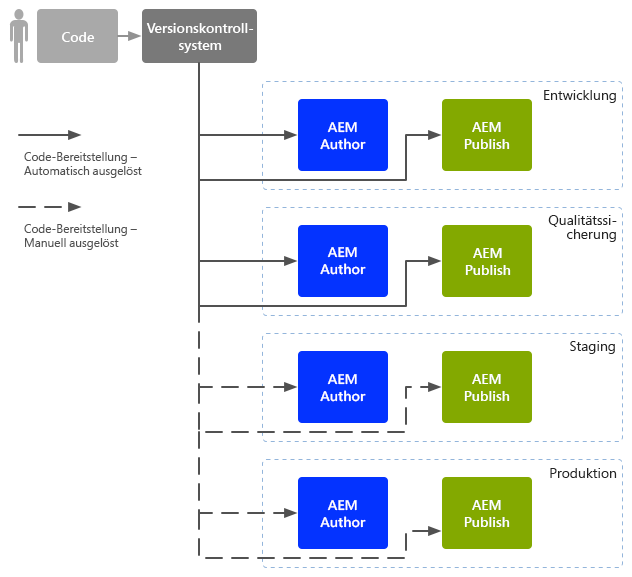
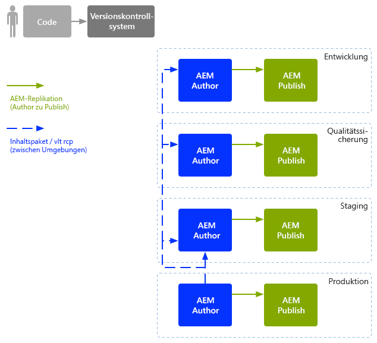

# DevOp-Strategien für Unternehmen{#enterprise-devops}

DevOp-Strategien umfassen die notwendigen Prozesse, Methoden und Kommunikation für Folgendes:

* Erleichterung der Bereitstellung der Software über die verschiedenen Umgebungen hinweg;
* Vereinfachung der Zusammenarbeit zwischen der Entwicklungs-, Test- und Bereitstellungs-Teams.

DevOp-Strategien sollen unter anderem zur Vermeidung folgender Probleme beitragen:

* Manuelle Fehler;
* Vergessene Elemente, beispielsweise Dateien, Konfigurationsdetails.
* Diskrepanzen, beispielsweise zwischen der lokalen Umgebung des Entwicklers und anderen Umgebungen.

## Umgebungen {#environments}

Adobe Experience Manager (AEM) as a Cloud Service besteht gewöhnlich aus mehreren Umgebungen, die für unterschiedliche Zwecke auf unterschiedlichen Ebenen benutzt werden:

* [Entwicklung](#development)
* [Qualitätssicherung](#quality-assurance)
* [Staging  ](#staging)
* [Produktion](#production-author-and-publish)

>[!NOTE]
>
>Die Produktionsumgebung muss mindestens eine Autoren- und eine Veröffentlichungsumgebung umfassen.
>
>Es wird empfohlen, alle anderen Umgebungen ebenfalls mit einer Autoren- und einer Veröffentlichungsumgebung zu gestalten, um die Produktionsumgebung widerzuspiegeln und frühe Test zu ermöglichen.

### Entwicklung {#development}

Die Entwicklenden sind für die Entwicklung und Anpassung des vorgeschlagenen Projekts mit sämtlichen benötigten Funktionen verantwortlich (z. B. Website, Mobile Apps, DAM-Implementierung). Sie:

* entwickeln und passen die notwendigen Elemente an, beispielsweise Vorlagen, Komponenten, Arbeitsabläufe, Anwendungen;
* setzen das Design um;
* entwickeln die zum Implementieren der erforderlichen Funktionen nötigen Dienste und Skripte

Die Konfiguration der [Entwicklungsumgebung](/help/implementing/developing/introduction/development-guidelines.md) kann von verschiedenen Faktoren abhängen, meist besteht sie jedoch aus:

* einem integrierten Entwicklungssystem mit Versionskontrolle, um eine integrierte Code-Basis zur Verfügung zu stellen. Diese integrierte Code-Basis dient der Zusammenführung und Konsolidierung von Code aus den einzelnen Entwicklungsumgebungen, die von den einzelnen Entwicklerinnen und Entwicklern verwendet werden.
* eine persönliche Umgebung für die einzelnen Entwicklenden, meist auf deren lokalem Rechner. In geeigneten Abständen wird der Code mit dem Versionskontrollsystem synchronisiert

Je nach Größe Ihres Systems kann die Entwicklungsumgebung sowohl über Autoren- als auch Veröffentlichungsinstanzen verfügen.

### Qualitätssicherung {#quality-assurance}

Diese Umgebung wird vom Qualitätssicherungs-Team zur umfassenden Prüfung des neuen Systems, sowohl in Bezug auf Design als auch Funktion, verwendet. Sie sollte über eine Autoren- und eine Veröffentlichungsumgebung mit geeignetem Inhalt verfügen und sämtliche notwendigen Dienste zur Durchführung einer Reihe von Tests bereitstellen.

### Staging   {#staging}

Die Staging-Umgebung sollte ein Spiegelbild der Produktionsumgebung sein – Konfiguration, Code und Inhalte:

* Sie wird zum Testen von Skripten genutzt, die zur Umsetzung der eigentlichen Bereitstellung verwendet werden.
* Sie kann für abschließende Tests (Design, Funktionalität und Schnittstellen) vor der Bereitstellung für die Produktionsumgebungen verwendet werden.
* Obwohl es nicht immer möglich ist, die Staging-Umgebung völlig identisch mit der Produktionsumgebung zu gestalten, sollten die beiden so ähnlich wie möglich sein, um Leistungs- und Belastungstests zu ermöglichen.

### Produktion - Autoren- und Veröffentlichungsumgebung   {#production-author-and-publish}

Die Produktionsumgebung besteht aus den für das tatsächliche [Verfassen und Veröffentlichen](/help/sites-cloud/authoring/author-publish.md) der Implementierung notwendigen Umgebungen.

Eine Produktionsumgebung besteht aus mindestens einer Autoreninstanz und einer Veröffentlichungsinstanz:

* [Autoreninstanz](#author) für die Eingabe von Inhalt;
* [Veröffentlichungsinstanz](#publish) für Inhalte, die den Besuchern/Benutzern zugänglich gemacht werden.

Je nach Größe des Projekts besteht sie oft aus mehreren Autorinnen und Autoren, Herausgebenden oder beidem. Auf niedrigerer Ebene kann das Repository in mehrere Instanzen gebündelt werden.

#### Autor {#author}

Autoreninstanzen befinden sich meist hinter der internen Firewall. Diese interne Firewall ist die Umgebung, in der Sie und Ihre Kolleginnen und Kollegen Bearbeitungsaufgaben ausführen wie die folgenden:

* Verwalten des gesamten Systems;
* Eingeben von Inhalten;
* Konfigurieren des Layouts und Designs des Inhalts;
* Aktivieren der Inhalte in der Veröffentlichungsumgebung.

Aktivierte Inhalte werden gebündelt und in der Replikationswarteschlange der Autorenumgebung abgelegt. Der Replikationsprozess überträgt den Inhalt dann in die Veröffentlichungsumgebung.

Um die in der Publishing-Umgebung erstellten Daten umgekehrt zu replizieren, durchsucht ein Replikations-Listener in der Autorenumgebung die Publishing-Umgebung und fragt solche Inhalte aus dem Postausgang für die umgekehrte Replikation der Publishing-Umgebung ab.

#### Veröffentlichen {#publish}

Normalerweise befindet sich eine Publishing-Umgebung in der „Demilitarized Zone“ (DMZ). Dies ist die Umgebung, in der die Besuchenden auf Ihren Inhalt zugreifen (beispielsweise über die Website oder über eine Mobile App) und damit interagieren, sei es öffentlich oder innerhalb Ihres Intranets. Die Veröffentlichungsumgebung:

* enthält alle aus der Autorenumgebung replizierten Inhalte;
* macht Inhalte für Besucher zugänglich;
* speichert Benutzerdaten, die von den Besuchern erstellt werden, wie Kommentare oder andere Formen von Beiträgen;
* kann so konfiguriert werden, dass solche Benutzerdaten einem Postausgang für die umgekehrte Replikation in die Autorenumgebung hinzugefügt werden.

Die Publishing-Umgebung erzeugt Ihren Inhalt dynamisch in Echtzeit und ermöglicht die Personalisierung des Inhalts für die einzelnen Benutzenden.

## Code-Verschiebung {#code-movement}

Übergeben Sie Code immer von unten nach oben:

* Der Code wird zunächst in der lokalen Umgebung entwickelt und dann in die Entwicklungsumgebungen integriert,
* gefolgt von gründlichen Tests in den QA-Umgebungen,
* und wird dann abermals in den Staging-Umgebungen getestet.
* Der Code sollte erst danach in den Produktionsumgebungen bereitgestellt werden.

In der Regel wird der Code (z. B. angepasste Funktionalitäten von Web-Anwendungen und Design-Vorlagen) durch den Export und Import von Datenpaketen zwischen den verschiedenen Inhalts-Repositorys übertragen. Ggf. kann diese Replikation als automatischer Prozess konfiguriert werden.

Projekte in AEM as a Cloud Service lösen häufig eine Code-Bereitstellung aus:

* Automatisch: zur Übertragung an die Entwicklungs- und QA-Umgebungen.
* Manuell: Die Bereitstellung für die Staging- und Produktionsumgebungen erfolgt kontrollierter und häufig manuell. Bei Bedarf ist jedoch eine Automatisierung möglich.

## Inhaltsverschiebung {#content-movement}

Inhalte, die für die Produktion erstellt werden, sollten **immer** in der Autoreninstanz der Produktion verfasst werden.

Der Inhalt sollte nicht dem Code folgen, der sich von niedrigeren Umgebungen zu höheren bewegt. Es empfiehlt sich also nicht, Inhalte auf lokalen Computern oder in niedrigeren Umgebungen zu erstellen und sie dann in die Produktionsumgebung zu verschieben. Der Grund dafür ist, dass es zu Fehlern und Inkonsistenzen führen kann.

Die Produktionsinhalte sollten von der Produktionsumgebung in die Staging-Umgebung verschoben werden, sodass gewährleistet ist, dass die Staging-Umgebung eine effiziente und genaue Testumgebung bietet.

>[!NOTE]
>
>Diese Methodik bedeutet nicht, dass die Staging-Inhalte kontinuierlich mit der Produktion synchronisiert werden müssen. Regelmäßige Updates reichen aus, jedoch sollten diese besonders vor Tests und vor der Einführung von neuem Code erfolgen. Inhalte in den QA- und Entwicklungsumgebungen müssen nicht so häufig aktualisiert werden. Es sollte einfach eine gute Darstellung des Produktionsinhalts vorliegen.

Inhalt kann wie folgt übertragen werden:

* zwischen verschiedenen Umgebungen – durch den Export und Import von Paketen;
* zwischen verschiedenen Instanzen – durch direktes Replizieren (AEM as a Cloud Service-Replikation) des Inhalts (durch Verwendung einer HTTP- oder HTTPS-Verbindung).

