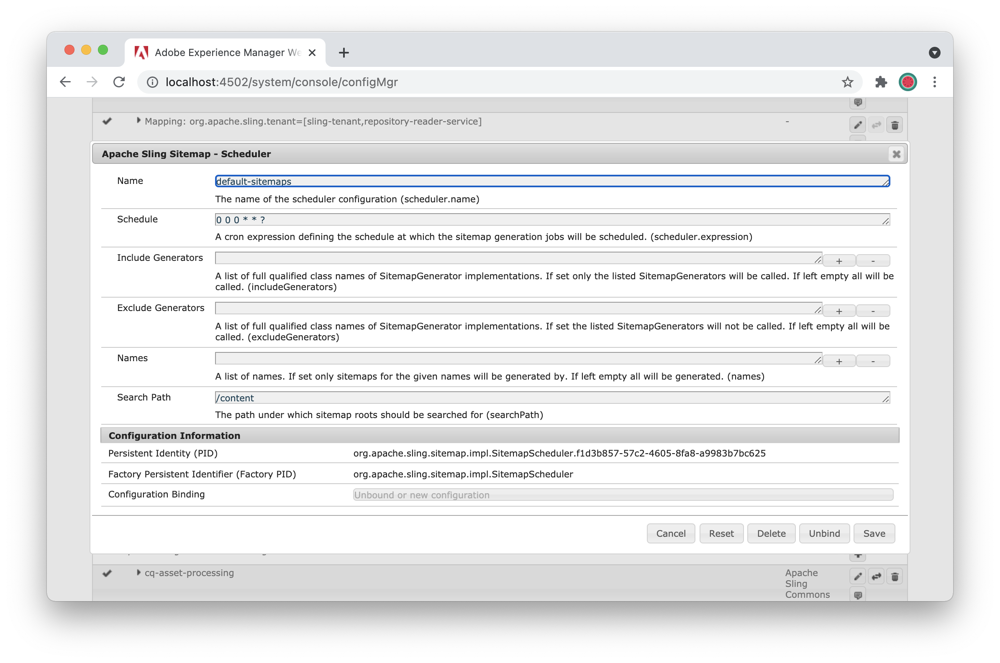

# Best Practices für SEO und URL-Verwaltung für Adobe Experience Manager as a Cloud Service{#seo-and-url-management-best-practices-for-aem}

Suchmaschinenoptimierung (SEO) ist zu einem wichtigen Thema für viele Marketer geworden. Daher müssen SEO-Themen bei vielen Adobe Experience Manager (AEM) as a Cloud Service-Projekten berücksichtigt werden.

In diesem Dokument werden zunächst einige [Best Practices für SEO](#seo-best-practices) und Empfehlungen zu deren Erreichung bei einer AEM as a Cloud Service-Implementierung beschrieben. Anschließend beschäftigt sich das Dokument intensiver mit einigen der [komplexeren Implementierungsschritte](#aem-configurations) aus dem ersten Abschnitt.

## Best Practices für SEO {#seo-best-practices}

Dieser Abschnitt beschreibt einige allgemeine Best Practices für SEO

### URLs {#urls}

Es gibt einige anerkannte Best Practices in URLs.

Wenn Sie URLs für Ihr AEM-Projekt bewerten, stellen Sie sich die folgenden Fragen:

*&quot;Wenn ein Benutzer diese URL und keinen Inhalt auf der Seite sieht, könnte er beschreiben, worum es auf dieser Seite ging?&quot;*

Wenn die Antwort ja ist, funktioniert die URL wahrscheinlich gut für eine Suchmaschine.

Im Folgenden finden Sie einige allgemeine Tipps zum Erstellen von URLs für SEO:

* Verwenden Sie Bindestriche, um Wörter voneinander zu trennen.

   * Verwenden Sie Bindestriche (-) als Trenner zwischen Seitennamen.
   * Vermeiden Sie Binnenmajuskeln, Unterstriche und Leerzeichen.

* Vermeiden Sie, wenn möglich, die Verwendung von Abfrageparametern. Falls erforderlich, begrenzen Sie diese auf maximal zwei.

   * Verwenden Sie eine Verzeichnisstruktur, um die Informationsarchitektur, falls vorhanden, darzustellen.
   * Wenn eine Ordnerstruktur keine Option ist, verwenden Sie Sling-Selektoren in der URL anstelle von Abfragezeichenfolgen. Neben dem von ihnen bereitgestellten SEO-Wert machen Sling-Selektoren die Seiten für den Dispatcher zwischenspeicherbar.

* Je menschlesbarer eine URL ist, desto besser; Wenn Suchbegriffe in der URL vorhanden sind, erhöht sich der Wert.

   * Selektoren, die einen semantischen Wert bieten, sind auf Seiten, die Selektoren verwenden, zu bevorzugen.
   * Wenn ein Mensch Ihre URL nicht lesen kann, kann eine Suchmaschine das auch nicht.
   * Beispiel:
      `mybrand.com/products/product-detail.product-category.product-name.html`
wird vorgezogen gegenüber 
`mybrand.com/products/product-detail.1234.html`

* Vermeiden Sie nach Möglichkeit Subdomains, da Suchmaschinen sie als verschiedene Entitäten behandeln und so den SEO-Wert der Site fragmentieren.

   * Nutzen Sie stattdessen Unterpfade auf erster Ebene. Verwenden Sie beispielsweise `www.mybrand.com/es/home.html` statt `es.mybrand.com/home.html`.

   * Planen Sie Ihre Inhaltshierarchie entsprechend dieser Richtlinie so, dass sie der Darstellung des Inhalts entspricht.

* Die Effektivität von Keywords in URLs nimmt bei mit zunehmender Länge der URL und späterer Position des Keywords ab. Anders ausgedrückt, kürzer ist besser.

   * Nutzen Sie die von AEM zur Verfügung gestellten Techniken und Funktionen zum Kürzen von URLs, um unnötige URL-Elemente zu entfernen.
   * Beispiel: `mybrand.com/en/myPage.html` wird `mybrand.com/content/my-brand/en/myPage.html` vorgezogen.

* Verwenden Sie kanonische URLs.

   * Wenn eine URL von unterschiedlichen Pfaden aus oder mit unterschiedlichen Parametern oder Selektoren bedient werden kann, stellen Sie sicher, dass Sie ein Tag `rel=canonical` auf der Seite verwenden.

   * Dieses kann im Code für die AEM-Vorlage enthalten sein.

* Passen Sie URLs wann immer möglich an Seitentitel an.

   * Inhaltsautoren sollten dazu ermutigt werden, diese Praxis zu befolgen.

* Unterstützen Sie das Ignorieren von Groß- und Kleinschreibung in URL-Anfragen.

   * Konfigurieren Sie den Dispatcher so, dass alle eingehenden Anforderungen in Kleinbuchstaben umgeschrieben werden.
   * Schulen Sie die Autoren darin, sämtliche Seiten mit Kleinbuchstaben zu erstellen.

* Stellen Sie sicher, dass jede Seite nur von einem Protokoll bedient wird.

   * Manchmal werden Websites über `http` bedient, bis ein Benutzer eine Seite erreicht, die beispielsweise ein Zahlungsformular oder Anmeldeformular enthält, weswegen die Seite in das `https`-Format wechselt. Wenn der Benutzer von dieser Seite aus verlinkt wird, ob er zu `http` Seiten und deren Zugriff über `https`, verfolgt die Suchmaschine diese als zwei separate Seiten.

   * Google bevorzugt derzeit `https`-Seiten gegenüber `http`-Seiten. Aus diesem Grund ist es häufig für alle Beteiligten einfacher, die ganze Website über `https` zu bedienen.

### Server-Konfiguration {#server-configuration}

Hinsichtlich der Server-Konfiguration können Sie mit den folgenden Schritten gewährleisten, dass nur korrekte Inhalte durchsucht werden:

* Verwenden Sie eine `robots.txt`-Datei, um Crawling von nicht indizierten Inhalten zu vermeiden.

   * Blockieren Sie **sämtliches** Crawling in den Testumgebungen.

* Richten Sie beim Launch einer neuen Website mit aktualisierten URLs eine 301-Weiterleitung ein, um sicherzustellen, dass das derzeitige SEO-Ranking nicht verloren geht.
* Fügen Sie der Website ein Favicon hinzu.
* Implementieren Sie eine XML-Sitemap, um Suchmaschinen das Durchsuchen des Inhalts zu erleichtern. Sorgen Sie dafür, dass mobile und/oder responsive Sites über eine mobile Sitemap verfügen.

## AEM-Konfigurationen {#aem-configurations}

In diesem Abschnitt werden die notwendigen Implementierungsschritte für die AEM-Konfiguration zur Befolgung dieser SEO-Empfehlungen erläutert.

### Verwenden von Sling-Selektoren {#using-sling-selectors}

Zuvor war die Verwendung von Abfrageparametern bei der Erstellung einer Web-Anwendung für Unternehmen gängige Praxis.

Der Trend der letzten Jahre bestand darin, diese zu entfernen, damit URLs leichter lesbar sind. Bei vielen Plattform beinhaltet dies die Einführung von Weiterleitungen auf dem Webserver oder dem Content Delivery Network (CDN), Sling macht dies jedoch zu einem geradlinigeren Prozess. Sling-Selektoren:

* verbessern die Lesbarkeit der URL;
* Sie können Ihre Seiten im Dispatcher zwischenspeichern, was häufig die Sicherheit verbessert.
* ermöglichen es, Inhalte direkt zu bearbeiten, anstelle der Verwendung eines allgemeinen Servlets zur Inhaltsabfrage. Dadurch erhalten Sie die Vorteile von ACLs, die Sie auf Ihr Repository anwenden, sowie von Filtern, die Sie auf den Dispatcher anwenden.

#### Verwenden von Selektoren für Servlets {#using-selectors-for-servlets}

AEM bietet uns zwei Optionen zum Schreiben von Servlets:

* **Container**-Servlets;
* **Sling**-Servlets.

Die folgenden Beispiele veranschaulichen, wie Servlets registriert werden, die sowohl diesen Mustern als auch dem Nutzen folgen, den die Verwendung von Sling-Servlets bietet.

#### Container-Servlets (eine Ebene nach unten) {#bin-servlets-one-level-down}

**Container**-Servlets folgen dem Muster, das viele Entwickler für die J2EE-Programmierung verwenden. Das Servlet wird an einem bestimmten Punkt des Pfades registriert, was im Falle von AEM häufig unter `/bin` geschieht, und Sie extrahieren die erforderlichen Abfrageparameter aus der Abfragezeichenfolge.

Der SCR-Vermerk für diese Art von Servlet sieht in etwa so aus:

```
@SlingServlet(paths = "/bin/myApp/myServlet", extensions = "json", methods = "GET")
```

Sie extrahieren dann die Parameter aus der Abfragezeichenfolge über das `SlingHttpServletRequest`-Objekt, das beispielsweise in der `doGet`-Methode mit eingeschlossen ist:

```
String myParam = req.getParameter("myParam");
```

Die daraus resultierende URL könnte beispielsweise in etwa so aussehen:

`https://www.mydomain.com/bin/myApp/myServlet.json?myParam=myValue`

Es gibt einige Aspekte, die bei diesem Ansatz berücksichtigt werden sollten:

* Die URL selbst verliert an SEO-Wert. Die auf die Website zugreifenden Benutzer, einschließlich Suchmaschinen, erhalten keinerlei semantischen Wert von der URL, da die URL einen Programmierungspfad darstellt und nicht die Inhaltshierarchie.
* Das Vorhandensein von Abfrageparametern in der URL bedeutet, dass der Dispatcher die Antwort nicht zwischenspeichern kann.
* Wenn Sie dieses Servlet sicher möchten, müssen Sie Ihre eigene benutzerdefinierte Sicherheitslogik in dieses Servlet implementieren.
* Der Dispatcher muss (sorgfältig) konfiguriert werden, um `/bin/myApp/myServlet`. Das Freilegen von `/bin` würde Zugang zu Servlets erlauben, die nicht für Besucher der Website offen sein sollten.

#### Sling-Servlets (eine Ebene nach unten) {#sling-servlets-one-level-down}

**Sling**-Servlets ermöglichen die Registrierung von Servlets auf gegensätzliche Art und Weise. Anstatt ein Servlet zu adressieren und den Inhalt festzulegen, welchen dieses basierend auf den Abfrageparametern rendern soll, adressieren Sie den gewünschten Inhalt und legen das Servlet fest, das den Inhalt basierend auf den Sling-Selektoren rendern soll.

Der SCR-Vermerk für diese Art von Servlet sieht in etwa so aus:

```
@SlingServlet(resourceTypes = "myBrand/components/pages/myPageType", selectors = "myRenderer", extensions = "json”, methods=”GET”)
```

In diesem Fall ist die Ressource, welche die URL bedient (eine Instanz der `myPageType`-Ressource) in dem Servlet automatisch zugänglich. Um darauf zuzugreifen, rufen Sie Folgendes ab:

```
Resource myPage = req.getResource();
```

Die daraus resultierende URL könnte beispielsweise in etwa so aussehen:

`https://www.mydomain.com/content/my-brand/my-page.myRenderer.json`

Die Vorteile dieses Ansatzes:

* Sie können den SEO-Wert, der durch die auf der Site-Hierarchie und im Seitennamen vorhandenen Semantiken erzielt wird, mit einbeziehen.
* Da keine Abfrageparameter vorhanden sind, kann der Dispatcher die Antwort zwischenspeichern. Außerdem wird dieser Cache bei jeder Aktualisierung der adressierten Seite invalidiert, wenn die Seite aktiviert wird.
* Alle auf `/content/my-brand/my-page` treten in Kraft, wenn ein Benutzer versucht, auf dieses Servlet zuzugreifen.
* Der Dispatcher wird bereits so konfiguriert, dass dieser Inhalt als Funktion der Bereitstellung der Website bereitgestellt wird. Es ist keine zusätzliche Konfiguration notwendig.

### Umschreiben der URL {#url-rewriting}

In AEM werden all Ihre Websites unter `/content/my-brand/my-content` gespeichert. Während dies aus der Perspektive der Repository-Datenverwaltung nützlich sein kann, ist dies nicht notwendigerweise die Art und Weise, wie Ihre Kunden die Website sehen sollen, und kann im Widerspruch zu den SEO-Richtlinien stehen, URLs so kurz wie möglich zu halten. Außerdem können Sie mehrere Websites von derselben AEM Instanz und von verschiedenen Domänennamen aus bedienen.

Dieser Abschnitt erläutert die verfügbaren AEM-Optionen zum Verwalten und der Präsentation dieser URLs gegenüber dem Benutzer auf leichter lesbare, SEO-freundliche Weise.

#### Vanity-URLs {#vanity-urls}

Wenn ein Autor wünscht, dass die Seite von einem zweiten Ort aus für Werbezwecke zugänglich ist, können die auf Seitenbasis definierten Vanity-URLs von AEM nützlich sein. Um einer Seite eine Vanity-URL hinzuzufügen, rufen Sie sie in der Konsole **Sites** auf und bearbeiten Sie die Seiteneigenschaften. Unten auf der Registerkarte **Allgemein** sehen Sie einen Abschnitt, dem Vanity-URLs hinzugefügt werden können. Bedenken Sie, dass die Zugänglichkeit einer Seite über mehr als eine URL den SEO-Wert der Seite fragmentiert. Der Seite sollte also ein kanonisches URL-Tag hinzugefügt werden, um dieses Problem zu vermeiden.

#### Lokalisierte Seitennamen {#localized-page-names}

Vielleicht möchten Sie den Benutzern von übersetzten Inhalten lokalisierte Seitennamen anzeigen. Beispiel:

* Anstatt einen Spanisch sprechenden Benutzer zur folgenden URL zu leiten:
   `www.mydomain.com/es/home.html`

* wäre folgende URL besser:
   `www.mydomain.com/es/casa.html`.

Die Herausforderung bei der Lokalisierung des Seitennamens besteht darin, dass viele der für die AEM-Plattform erhältlichen Lokalisierungs-Tools für die Synchronisierung von Inhalten identische Seitennamen für verschiedene Sprachen benötigen.

Die Eigenschaft `sling:alias` ermöglicht beides. `sling:alias` kann jeder Ressource als Eigenschaft hinzugefügt werden, um einen Alias für die Ressource zu erlauben. Im vorangegangenen Beispiel hätten Sie Folgendes:

* Eine Seite im JCR unter:
   `…/es/home`

* Dieser fügen Sie dann eine Eigenschaft hinzu:
   `sling:alias` = `casa`

Dies würde es den AEM-Übersetzungs-Tools wie dem Multi-Site-Manager ermöglichen, eine Beziehung zwischen folgenden Seiten beizubehalten:

* `/en/home`

* `/es/home`

während es Benutzern ermöglicht wird, in ihrer Muttersprache mit dem Seitennamen zu interagieren.

>[!NOTE]
>
>Die `sling:alias`-Eigenschaft kann [beim Bearbeiten der Seiteneigenschaften mithilfe der Alias-Eigenschaft](/help/sites-cloud/authoring/fundamentals/page-properties.md#advanced) festgelegt werden.

#### /etc/map {#etc-map}

Bei der Standardinstallation von AEM:

* für die OSGi-Konfiguration
   **Apache Sling Resource Resolver Factory**
( 
`org.apache.sling.jcr.resource.internal.JcrResourceResolverFactoryImpl`)

* ist der Standardwert der Eigenschaft
   **Zuordnungsspeicherort** ( `resource.resolver.map.location`)

* ist standardmäßig auf `/etc/map` eingestellt.

Zuordnungsdefinitionen können in diesem Verzeichnis hinzugefügt werden, um eingehende Anfragen zuzuordnen, URLs auf Seiten in AEM umzuschreiben oder beides.

Um eine Zuordnung zu erstellen, erstellen Sie eine `sling:Mapping` Knoten in diesem Speicherort unter `/http` oder `/https`. Basierend auf den Eigenschaften `sling:match` und `sling:internalRedirect`, die für diesen Knoten eingestellt sind, leitet AEM sämtlichen Traffic für die passende URL an den in der Eigenschaft `internalRedirect` spezifizierten Wert weiter.

Während dies der Ansatz ist, der in der offiziellen AEM- und Sling-Dokumentation aufgeführt wird, ist die von dieser Implementierung bereitgestellte Unterstützung für reguläre Ausdrücke im Vergleich zu den Optionen begrenzt, die durch die direkte Verwendung von `SlingResourceResolver` zur Verfügung gestellt werden. Außerdem kann die Implementierung von Zuordnungen auf diese Weise zu Problemen bei der Invalidierung des Dispatcher-Caches führen.

Ein Beispiel dafür, wie dieses Problem auftritt:

1. Ein Besucher fordert auf Ihrer Website `https://www.mydomain.com/my-page.html` an.
1. Der Dispatcher leitet diese Anforderung an den Veröffentlichungsserver weiter.
1. Der Veröffentlichungs-Server verwendet `/etc/map`, löst die Anfrage zu `/content/my-brand/my-page` auf und stellt die Seite dar.

1. Der Dispatcher speichert die Antwort unter `/my-page.html` und gibt die Antwort an den Benutzer zurück.
1. Ein Inhaltsautor ändert diese Seite und aktiviert sie.
1. Der Dispatcher-Flush-Agent sendet eine Invalidierungsanforderung für `/content/my-brand/my-page`**.** Da der Dispatcher unter diesem Pfad keine Seite zwischengespeichert hat, bleibt der alte Inhalt zwischengespeichert und veraltet.

Es gibt Möglichkeiten, benutzerdefinierte Dispatch-Flush-Regeln zu konfigurieren, die die kürzere URL zur Invalidierung des Caches der längeren URL zuordnen.

Es gibt jedoch einfachere Möglichkeiten, dies zu lösen:

1. **SlingResourceResolver-Regeln**

   Verwenden Sie die Web-Konsole (zum Beispiel localhost:4502/system/console/configMgr) zur Konfiguration von Sling Resource Resolver:

   * **Apache Sling Resource Resolver Factory**

      `(org.apache.sling.jcr.resource.internal.JcrResourceResolverFactoryImpl)`.
   Es wird empfohlen, die zur Kürzung von URLs zu regulären Ausdrücken notwendigen Zuordnungen zu erstellen und diese Konfigurationen dann unter einem OsgiConfignode, `config.publish`, zu definieren, der im Build enthalten ist.

   Anstatt Zuordnungen in `/etc/map` zu definieren, können diese direkt den Eigenschaften der **URL-Zuordnungen** (`resource.resolver.mapping`) zugeordnet werden:

   ```xml
   resource.resolver.mapping="[/content/my-brand/(.*)</$1]"
   ```

   In diesem einfachen Beispiel entfernen Sie `/content/my-brand/` von der Position am Anfang einer beliebigen URL.

   Dadurch würde eine URL umgewandelt:

   * von `/content/my-brand/my-page.html`
   * in `/my-page.html`

   Dies steht im Einklang mit den empfohlenen Verfahren, URLs so kurz wie möglich zu halten.

1. **Zuordnen von URL-Output auf Seiten**

   Nachdem Sie die Zuordnungen im Apache Sling Resource Resolver definiert haben, müssen Sie diese Zuordnungen in den Komponenten verwenden, um zu gewährleisten, dass die URLs auf Ihren Seiten kurz und ordentlich sind. Sie können dies durch die Verwendung der Zuordnungsfunktion `ResourceResolver` tun.

   Wenn Sie beispielsweise eine benutzerdefinierte Navigationskomponente implementieren, welche die untergeordneten Elemente der aktuellen Seite auflistet, können Sie die Zuordnungsmethode wie folgt verwenden:

   ```
   for (Page child : children) {
     String childUrl = resourceResolver.map(request, child.getPath());
     //Output the childUrl on the page here
   }
   ```

#### Apache HTTP-Server mod_rewrite {#apache-http-server-mod-rewrite}

Bisher haben Sie die Zuordnungen gemeinsam mit der Logik in den Komponenten implementiert, um diese Zuordnungen bei der Ausgabe von URLs auf Seiten zu verwenden.

Der letzte Teil des Puzzles besteht darin, diese gekürzten URLs zu verarbeiten, wenn sie beim Dispatcher eintreffen. Hier finden Sie die `mod_rewrite` kommt ins Spiel. Der größte Vorteil bei der Verwendung von `mod_rewrite` ist, dass die URLs wieder ihrem langen Formular zugeordnet werden *before* sie werden an das Dispatcher-Modul gesendet. Das bedeutet, dass der Dispatcher die lange URL vom Veröffentlichungsserver anfordert und sie entsprechend zwischenspeichert. Daher können alle Dispatcher-Flushes, die vom Veröffentlichungsserver eingehen, diesen Inhalt erfolgreich ungültig machen.

Um diese Regeln zu implementieren, können Sie `RewriteRule`-Elemente unter Ihrem virtuellen Host in der Apache HTTP Server-Konfiguration hinzufügen. Wenn Sie gekürzte URLs aus dem vorherigen Beispiel erweitern möchten, können Sie eine Regel implementieren, die folgendermaßen aussieht:

```
<VirtualHost *:80>
  ServerName www.mydomain.com
  RewriteEngine on
  RewriteRule ^/(.*)$ /content/my-brand/$1 [PT,L]
  …
</VirtualHost>
```

### Kanonische URL-Tags {#canonical-url-tags}

Kanonische URL-Tags sind Link-Tags die in der Kopfzeile des HTML-Dokuments eingegeben werden und festlegen, wie Suchmaschinen die Seite bei der Indizierung des Inhalts behandeln sollen. Der Vorteil, den sie bieten, besteht darin, sicherzustellen, dass (verschiedene Versionen) einer Seite als dieselbe indiziert werden, selbst wenn die URL zur Seite Unterschiede enthalten kann.

Bietet eine Website beispielsweise eine druckfreundliche Version einer Seite an, könnte eine Suchmaschine diese Seite getrennt von der regulären Version der Seite indizieren. Das kanonische Tag teilt der Suchmaschine mit, dass sie identisch sind.

Beispiele:

* `<https://www.mydomain.com/my-brand/my-page.html>`
* `<https://www.mydomain.com/my-brand/my-page.print.html>`

Bei beiden würde das folgende Tag der Kopfzeile der Seite hinzugefügt:

```xml
<link rel=”canonical” href=”my-brand/my-page.html”/>
```

Das `href`-Attribut kann relativ oder absolut sein. Der Code sollte im Seiten-Layout inbegriffen sein, um die kanonische URL und das Ausgabe-Tag zu bestimmen.

### Konfigurieren des Dispatchers für Groß-/Kleinschreibung {#configuring-the-dispatcher-for-case-insensitivity}

Die Best Practice besteht darin, alle Seiten mit Kleinbuchstaben zu bedienen. Sie wollen jedoch vermeiden, dass der Benutzer einen 404-Fehler erhält, wenn er versucht, unter Verwendung von Großbuchstaben in der URL auf die Website zuzugreifen. Aus diesem Grund empfiehlt Adobe, dass Sie eine Umschreiberegel in der Apache HTTP Server-Konfiguration hinzufügen, um alle eingehenden URLs in Kleinbuchstaben darzustellen. Außerdem müssen Autoren von Inhalten geschult werden, ihre Seiten mit Namen in Kleinbuchstaben zu erstellen.

Um Apache so zu konfigurieren, dass sämtlicher eingehender Traffic in Kleinbuchstaben erfolgt, fügen Sie der Konfiguration `vhost` Folgendes hinzu:

```xml
RewriteEngine On
RewriteMap lowercase int:tolower
```

Fügen Sie außerdem Folgendes am oberen Rand des `htaccess` Datei:

```xml
RewriteCond $1 [A-Z]
RewriteRule ^(.*)$ /${lowercase:$1} [R=301,L]
```

### Implementieren von robots.txt zum Schutz von Entwicklungsumgebungen {#implementing-robots-txt-to-protect-development-environments}

Suchmaschinen *sollten* das Vorhandensein einer Datei `robots.txt` im Stammverzeichnis der Website überprüfen, bevor die Website durchsucht wird. Während große Suchmaschinen wie Google, Yahoo oder Bing dies berücksichtigen, ist dies bei einigen ausländischen Suchmaschinen nicht der Fall.

Die einfachste Möglichkeit, den Zugang zu der gesamten Website zu blockieren, ist eine Datei namens `robots.txt` im Stammverzeichnis der Website zu platzieren, die Folgendes enthält:

```xml
User-agent: *
Disallow: /
```

Wahlweise können Sie in einer Live-Umgebung bestimmte Pfade ablehnen, die nicht indiziert werden sollen.

Der Nachteil bei der Platzierung der `robots.txt` -Datei im Stammverzeichnis der Site ist, dass Dispatcher-Flush-Anfragen diese Datei löschen können und URL-Zuordnungen den Site-Stamm wahrscheinlich an einen anderen Ort als den `DOCROOT` wie in der Apache HTTP Server-Konfiguration definiert. Aus diesem Grund ist es üblich, diese Datei in der Autoreninstanz am Site-Stamm zu platzieren und sie in der Veröffentlichungsinstanz zu replizieren.

### Erstellen einer XML-Sitemap in AEM {#building-an-xml-sitemap-on-aem}

Crawler verwenden XML-Sitemaps, um die Websitestrukturen besser zu verstehen. Es gibt zwar keine Garantie dafür, dass die Bereitstellung einer Sitemap zu besseren SEO-Rankings führt, aber es handelt sich um eine allgemein anerkannte Best Practice. Sie können eine XML-Datei auf dem Webserver manuell als Sitemap verwalten. Es wird jedoch empfohlen, die Sitemap programmatisch zu generieren. Dadurch wird sichergestellt, dass die Sitemap beim Erstellen von Inhalten durch Autoren automatisch deren Änderungen widerspiegelt.

AEM verwendet das [Apache Sling Sitemap-Modul](https://github.com/apache/sling-org-apache-sling-sitemap), um XML-Sitemaps zu generieren, die Entwicklern und Bearbeitern eine Vielzahl von Optionen zur Verfügung stellen, um die XML-Sitemap einer Website auf dem neuesten Stand zu halten.

Das Apache Sling Sitemap-Modul unterscheidet zwischen einer Sitemap der obersten Ebene und einer verschachtelten Sitemap, die beide für jede Ressource generiert werden, die über die `sling:sitemapRoot` Eigenschaft auf `true`. Im Allgemeinen werden Sitemaps mithilfe von Selektoren im Pfad der Sitemap der obersten Ebene des Baums gerendert, bei der es sich um die Ressource handelt, die keinen anderen Sitemap-Stamm-Vorgänger hat. Dieser Sitemap-Stammordner auf oberster Ebene legt auch den Sitemap-Index offen, der normalerweise von einem Site-Eigentümer im Konfigurationsportal der Suchmaschine konfiguriert oder zum Website-Konfigurationsportal hinzugefügt wird. `robots.txt`.

Betrachten Sie beispielsweise eine Site, die einen Sitemap-Stamm der obersten Ebene unter `my-page` und einen verschachtelten Sitemap-Stamm unter `my-page/news`, um eine dedizierte Sitemap für Seiten im News-Unterbaum zu erstellen. Die resultierenden, relevanten URLs wären

* `<https://www.mydomain.com/my-brand/my-page.sitemap-index.xml>`
* `<https://www.mydomain.com/my-brand/my-page.sitemap.xml>`
* `<https://www.mydomain.com/my-brand/my-page.sitemap.news-sitemap.html>`

>[!NOTE]
>
> Die Selektoren `sitemap` und `sitemap-index` können bei benutzerdefinierten Implementierungen zu Problemen führen. Wenn Sie die Produktfunktion nicht verwenden möchten, konfigurieren Sie Ihr eigenes Servlet, das diese Selektoren mit einem `service.ranking` größer als 0 bedient.

In der Standardkonfiguration bietet das Dialogfeld Seiteneigenschaften die Option, eine Seite als Sitemap-Stammordner zu markieren und so wie oben beschrieben, eine Sitemap für sich selbst und die untergeordneten Elemente zu generieren. Dieses Verhalten wird durch Implementierungen der `SitemapGenerator`-Schnittstelle implementiert und kann durch Hinzufügen alternativer Implementierungen erweitert werden. Da die Häufigkeit, mit der die XML-Sitemaps neu erzeugt werden müssen, jedoch stark von den Authoring-Workflows und der Arbeitslast abhängt, wird das Produkt ohne `SitemapScheduler`-Konfiguration ausgeliefert. Dadurch wird die Funktion tatsächlich zum Opt-in.

Um den Hintergrundauftrag zu aktivieren, der die XML-Sitemaps erzeugt, muss ein `SitemapScheduler` konfiguriert werden. Erstellen Sie dazu eine OSGi-Konfiguration für die PID `org.apache.sling.sitemap.impl.SitemapScheduler`. Der Planungsausdruck `0 0 0 * * ?` kann als Ausgangspunkt verwendet werden, um alle XML-Sitemaps einmal täglich um Mitternacht neu zu erzeugen.



Der Sitemap-Generierungsauftrag kann sowohl auf Instanzen der Autoren- als auch auf Instanzen der Veröffentlichungsebenen ausgeführt werden. In den meisten Fällen wird empfohlen, die Generierung auf Instanzen der Veröffentlichungsebene auszuführen, da korrekte kanonische URLs nur dort generiert werden können (aufgrund der Tatsache, dass die Regeln für die Sling-Ressourcenzuordnung normalerweise nur auf Instanzen der Veröffentlichungsebene vorhanden sind). Es ist jedoch möglich, eine benutzerdefinierte Implementierung des Externalisierungsmechanismus einzubinden, der zum Generieren der kanonischen URLs verwendet wird, indem die [SitemapLinkExternalizer](https://javadoc.io/doc/com.adobe.cq.wcm/com.adobe.aem.wcm.seo/latest/com/adobe/aem/wcm/seo/sitemap/externalizer/SitemapLinkExternalizer.html)-Schnittstelle implementiert wird. Wenn eine benutzerdefinierte Implementierung in der Lage ist, die kanonischen URLs einer Sitemap in den Instanzen der Autorenebene zu erzeugen, kann `SitemapScheduler` für den Autoren-Ausführungsmodus konfiguriert werden und die Arbeitslast der XML-Sitemap-Generierung könnte auf die Instanzen des Autoren-Service-Clusters verteilt werden. In diesem Szenario muss besonders vorsichtig mit Inhalten umgegangen werden, die noch nicht veröffentlicht wurden, die geändert wurden oder die nur für eingeschränkte Benutzergruppen sichtbar sind.

AEM Sites enthält eine Standardimplementierung eines `SitemapGenerator`, der durch einen Seitenbaum navigiert, um eine Sitemap zu generieren. Er ist so vorkonfiguriert, dass nur die kanonischen URLs einer Site und ggf. Sprachalternativen ausgegeben werden. Er kann bei Bedarf auch so konfiguriert werden, dass er das Datum der letzten Änderung einer Seite enthält. Aktivieren Sie dazu die Option *Zuletzt geänderte hinzufügen* der Konfiguration von *Adobe AEM SEO - Page Tree Sitemap Generator* und wählen Sie eine *Zuletzt geänderte Quelle*. Wenn die Sitemaps auf der Veröffentlichungsebene generiert werden, wird empfohlen, die `cq:lastModified` Datum.


Um den Inhalt einer Sitemap zu begrenzen, können bei Bedarf die folgenden Service-Schnittstellen implementiert werden:

* der [SitemapPageFilter](https://javadoc.io/doc/com.adobe.cq.wcm/com.adobe.aem.wcm.seo/latest/com/adobe/aem/wcm/seo/sitemap/SitemapPageFilter.html) kann implementiert werden, um Seiten aus XML-Sitemaps zu entfernen, die vom AEM Sites-spezifischen Sitemap-Generator erzeugt wurden
* ein [SitemapProductFilter](https://javadoc.io/doc/com.adobe.commerce.cif/core-cif-components-core/latest/com/adobe/cq/commerce/core/components/services/sitemap/SitemapProductFilter.html) oder [SitemapCategoryFilter](https://javadoc.io/doc/com.adobe.commerce.cif/core-cif-components-core/latest/com/adobe/cq/commerce/core/components/services/sitemap/SitemapCategoryFilter.html) kann implementiert werden, um Produkte oder Kategorien aus XML-Sitemaps herauszufiltern, die von den für [Commerce-Integrations-Frameworks](https://experienceleague.adobe.com/docs/experience-manager-cloud-service/content/content-and-commerce/home.html) spezifischen Sitemap-Generatoren erzeugt wurden.

Wenn die Standardimplementierungen in einem bestimmten Anwendungsfall nicht funktionieren oder die Erweiterungspunkte nicht flexibel genug sind, kann ein benutzerdefinierter `SitemapGenerator` implementiert werden, um die volle Kontrolle über den Inhalt einer generierten Sitemap zu übernehmen. Das folgende Beispiel zeigt, wie dies unter Verwendung der Standardimplementierungslogik für AEM Sites möglich ist. Dabei wird der [ResourceTreeSitemapGenerator](https://javadoc.io/doc/org.apache.sling/org.apache.sling.sitemap/latest/org/apache/sling/sitemap/spi/generator/ResourceTreeSitemapGenerator.html) als Ausgangspunkt verwendet, um einen Seitenbaum zu durchlaufen:

```
import java.util.Optional;

import org.apache.sling.api.resource.Resource;
import org.apache.sling.sitemap.SitemapException;
import org.apache.sling.sitemap.builder.Sitemap;
import org.apache.sling.sitemap.builder.Url;
import org.apache.sling.sitemap.spi.common.SitemapLinkExternalizer;
import org.apache.sling.sitemap.spi.generator.ResourceTreeSitemapGenerator;
import org.apache.sling.sitemap.spi.generator.SitemapGenerator;
import org.jetbrains.annotations.NotNull;
import org.osgi.service.component.annotations.Component;
import org.osgi.service.component.annotations.Reference;
import org.slf4j.Logger;
import org.slf4j.LoggerFactory;

import com.adobe.aem.wcm.seo.sitemap.PageTreeSitemapGenerator;
import com.day.cq.wcm.api.Page;

@Component(
    service = SitemapGenerator.class,
    property = { "service.ranking:Integer=20" }
)
public class SitemapGeneratorImpl extends ResourceTreeSitemapGenerator {

    private static final Logger LOG = LoggerFactory.getLogger(SitemapGeneratorImpl.class);

    @Reference
    private SitemapLinkExternalizer externalizer;
    @Reference
    private PageTreeSitemapGenerator defaultGenerator;

    @Override
    protected void addResource(@NotNull String name, @NotNull Sitemap sitemap, Resource resource) throws SitemapException {
        Page page = resource.adaptTo(Page.class);
        if (page == null) {
            LOG.debug("Skipping resource at {}: not a page", resource.getPath());
            return;
        }
        String location = externalizer.externalize(resource);
        Url url = sitemap.addUrl(location + ".html");
        // add any additional content to the Url like lastmod, change frequency, etc
    }

    @Override
    protected final boolean shouldFollow(@NotNull Resource resource) {
        return super.shouldFollow(resource)
            && Optional.ofNullable(resource.adaptTo(Page.class)).map(this::shouldFollow).orElse(Boolean.TRUE);
    }

    private boolean shouldFollow(Page page) {
        // add additional conditions to stop traversing some pages
        return !defaultGenerator.isProtected(page);
    }

    @Override
    protected final boolean shouldInclude(@NotNull Resource resource) {
        return super.shouldInclude(resource)
            && Optional.ofNullable(resource.adaptTo(Page.class)).map(this::shouldInclude).orElse(Boolean.FALSE);
    }

    private boolean shouldInclude(Page page) {
        // add additional conditions to stop including some pages
        return defaultGenerator.isPublished(page)
            && !defaultGenerator.isNoIndex(page)
            && !defaultGenerator.isRedirect(page)
            && !defaultGenerator.isProtected(page);
    }
}
```

Darüber hinaus kann die für XML-Sitemaps implementierte Funktionalität auch in verschiedenen Anwendungsfällen verwendet werden, z. B. um den kanonischen Link hinzuzufügen oder die Sprache wechselt zum Kopf einer Seite. Weitere Informationen finden Sie in der [SeoTags](https://javadoc.io/doc/com.adobe.cq.wcm/com.adobe.aem.wcm.seo/latest/com/adobe/aem/wcm/seo/SeoTags.html)-Oberfläche.

### Erstellen von 301-Weiterleitungen für veraltete URLs {#creating-redirects-for-legacy-urls}

Beim Start einer Website mit einer neuen Struktur ist die Implementierung und Prüfung von 301-Weiterleitungen in Apache HTTP Server aus zwei Gründen wichtig:

* Die veralteten URLs bauen über die Zeit hinweg SEO-Wert auf. Durch Implementierung einer Umleitung kann die Suchmaschine diesen Wert auf die neue URL anwenden.
* Benutzer der Website könnten Lesezeichen für diese Seiten erstellt haben. Durch die Implementierung von Umleitungen kann sichergestellt werden, dass der Benutzer auf den Bereich der Site weitergeleitet wird, der seinem ursprünglichen Zielort am ehesten gerecht wird.

Lesen Sie diesbezüglich auch den folgenden Abschnitt über zusätzliche Ressourcen , um Anweisungen zur Implementierung von 301-Weiterleitungen und ein Tool zum Testen der erwarteten Funktionsweise Ihrer Weiterleitungen zu erhalten.

## Zusätzliche Ressourcen {#additional-resources}

Weitere Informationen finden Sie in den folgenden zusätzlichen Ressourcen:

<!--
* [Resource Mapping](/help/sites-deploying/resource-mapping.md)
-->

* [https://moz.com/blog/seo-cheat-sheet-anatomy-of-a-url](https://moz.com/blog/seo-cheat-sheet-anatomy-of-a-url)
* [https://moz.com/blog/15-seo-best-practices-for-structuring-urls](https://moz.com/blog/15-seo-best-practices-for-structuring-urls)
* [https://mysiteauditor.com/blog/top-10-most-important-seo-tips-for-url-optimization/](https://mysiteauditor.com/blog/top-10-most-important-seo-tips-for-url-optimization/)
* [https://sling.apache.org/documentation/the-sling-engine/servlets.html](https://sling.apache.org/documentation/the-sling-engine/servlets.html)
* [https://sling.apache.org/documentation/the-sling-engine/mappings-for-resource-resolution.html](https://sling.apache.org/documentation/the-sling-engine/mappings-for-resource-resolution.html)
* [https://httpd.apache.org/docs/current/mod/mod_rewrite.html](https://httpd.apache.org/docs/current/mod/mod_rewrite.html)
* [https://moz.com/blog/canonical-url-tag-the-most-important-advancement-in-seo-practices-since-sitemaps](https://moz.com/blog/canonical-url-tag-the-most-important-advancement-in-seo-practices-since-sitemaps)
* [https://www.robotstxt.org/robotstxt.html](https://www.robotstxt.org/robotstxt.html)
* [https://www.internetmarketingninjas.com/blog/search-engine-optimization/](https://www.internetmarketingninjas.com/blog/search-engine-optimization/)
* [https://github.com/Adobe-Marketing-Cloud/tools/tree/master/dispatcher/redirectTester](https://github.com/Adobe-Marketing-Cloud/tools/tree/master/dispatcher/redirectTester)
* [https://adobe-consulting-services.github.io/](https://adobe-consulting-services.github.io/)
* [https://github.com/apache/sling-org-apache-sling-sitemap](https://github.com/apache/sling-org-apache-sling-sitemap)
