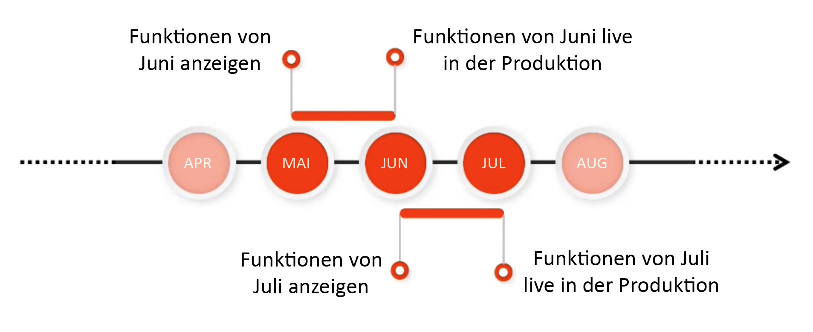

# Versionshinweise {#release-information}

| Produkt | Adobe Experience Manager as a Cloud Service |
|---|---|
| Version | 2 025,6,0 |
| Typ | Kontinuierliche Aktualisierungen |
| Verfügbarkeitsdatum | Kontinuierliche Aktualisierung |

## AEMs Veröffentlichungszeitplan {#release-schedule}

Mit dem kontinuierlichen Versionsmodell in [!DNL Adobe Experience Manager] as a Cloud Service wird die Anwendung laufend automatisch aktualisiert. Es gibt zwei Arten von Updates, nämlich Versionen mit neuen Funktionen und Wartungsversionen:

* **Funktionsveröffentlichungen** erfolgen in einem vorhersehbaren monatlichen Rhythmus und konzentrieren sich auf neue Funktionen und Produktinnovationen.
   * In den [aktuellen Versionshinweisen](/help/release-notes/release-notes-cloud/release-notes-current.md) finden Sie Details zur neuesten Version von Funktionen.
* **Wartungsversionen** werden häufig veröffentlicht und konzentrieren sich auf Sicherheits-Updates, Fehlerbehebungen und Leistungsverbesserungen.
   * Dadurch wird sichergestellt, dass [!DNL Adobe Experience Manager] as a Cloud Service mit allen wichtigen Korrekturen stets auf dem neuesten Stand ist.
   * In den [ Wartungsversionshinweisen finden Sie ](/help/release-notes/maintenance/latest.md) zur neuesten Wartungsversion.

Dieses Modell stellt kontinuierliche Versionen ohne Unterbrechung des Service sicher. Künftige -Funktionen werden im Allgemeinen in einer Version angekündigt und dann in einer nachfolgenden Version öffentlich zugänglich gemacht. Auf diese Weise können Sie die bevorstehende Funktionalität bewerten und deren mögliche Implementierung für Ihre eigenen Projekte planen. Damit können Sie im Voraus planen, wann die nächste Version verfügbar sein wird.

Wenn es zum Beispiel Mai ist, können Sie bevorstehende Funktionen auswerten, die in einer kommenden Version wie Juni allgemein verfügbar sein werden.

Mit diesem Rhythmus erhalten Sie ein rollierendes Fenster, in dem Sie die Auswirkungen bevorstehender Funktionen auf Ihre Projekte und Anpassungen bewerten und Rollouts für solche Funktionen, Tests und Benutzerschulungen planen können.

Weitere Informationen zu kommenden Versionen finden Sie in [&#128279;](https://experienceleague.adobe.com/docs/experience-manager-release-information/aem-release-updates/update-releases-roadmap.html?lang=de#aem-as-cloud-service) Roadmap für Experience Manager-Versionen von .

## Vorbereitung auf die Veröffentlichung einer Version {#how-to-prepare}

So bereiten Sie sich auf die Veröffentlichung einer Version vor:

1. [Markieren der Termine im Kalender](#mark-calendars)
1. [Lesen der Versionshinweise](#release-notes)
1. [Aufrufen und Ausprobieren der kommenden Funktionen](#upcoming-features)
1. [Schulen der Benutzenden ](#train-users)

## Markieren der Termine im Kalender {#mark-calendars}

Die Funktionsveröffentlichungen sind weit im Voraus geplant, und ihre Aktivierungstermine werden auf [Adobe Experience League](https://experienceleague.adobe.com/docs/experience-manager-release-information/aem-release-updates/update-releases-roadmap.html?lang=de#aem-as-cloud-service) veröffentlicht.

Notieren Sie sich die Veröffentlichungstermine und planen Sie Zeit ein, um bevorstehende Funktionen zu überprüfen und zu testen.

## Lesen der Versionshinweise {#release-notes}

Nachdem Sie die Veröffentlichungstermine in Ihren Kalender eingetragen haben, lesen Sie am Tag der Veröffentlichung die neuesten Versionshinweise auf der [Adobe Experience League](/help/release-notes/release-notes-cloud/release-notes-current.md)-Website.

Jeder Version sind Versionshinweise beigefügt, die nicht nur die neuen Funktionen dieser Version dokumentieren, sondern auch die kommenden Funktionen, die zur Bewertung verfügbar sind. Machen Sie sich schon vorab mit den neuesten Funktionen von AEMaaCS vertraut und erkunden Sie ihre Vorteile!

Sie können auch [bekannte Probleme überprüfen](/help/release-notes/maintenance/latest.md), die mit jeder Version veröffentlicht werden, um sich über alle technischen Fehler zu informieren, die Sie bei Ihrer Bewertung oder der möglichen Implementierung neuer Funktionen behindern könnten.

## Zugreifen auf und Ausprobieren bevorstehender Funktionen {#upcoming-features}

Künftige Funktionen werden in der Regel auf eine von zwei Arten verfügbar gemacht:

* Im Rahmen eines Alpha-, Beta- oder eingeschränkten Verfügbarkeitsprogramms
* Im Rahmen des Vorabversionskanals

Wie eine neue Funktion verfügbar gemacht wird, wird in den [Versionshinweisen“ beschrieben](#release-notes)

* Wenn es Teil eines Programms für Alpha, Beta oder eingeschränkte Verfügbarkeit ist, müssen Sie sich in der Regel an Adobe wenden, um es zu aktivieren, wie in den Versionshinweisen beschrieben.
* Wenn es Teil des Vorabversionskanals ist, müssen Sie [den Vorabversionskanal in einer Entwicklungs- oder Sandbox-Umgebung aktivieren“](/help/release-notes/prerelease.md)

## Schulung von Benutzenden  {#train-users}

Nachdem Sie die kommenden Funktionen getestet und entschieden haben, sie in Ihren Projekten zu verwenden, müssen Sie Ihre Benutzer schulen.

Adobe Experience League bietet viele Ressourcen zum Kennenlernen von AEMaaCS an.

* [Die AEMaaCS-Dokumentation](https://experienceleague.adobe.com/docs/experience-manager-cloud-service.html?lang=de)
* [Tutorials](https://experienceleague.adobe.com/docs/experience-manager-learn/aem-tutorials/overview.html?lang=de)
* [Das Übersichtsvideo zur monatlichen Version](/help/release-notes/release-notes-cloud/release-notes-current.md#release-video) in den Versionshinweisen

## Wichtige Versionshinweise {#key-articles}

* [Versionshinweise zu Funktionen](/help/release-notes/release-notes-cloud/release-notes-current.md)
* [Wartungsversionshinweise](/help/release-notes/maintenance/latest.md)
* [Neue Funktionen](what-is-new.md)
* [Wesentliche Änderungen](aem-cloud-changes.md)
* [Veraltete und entfernte Funktionen](deprecated-removed-features.md)
