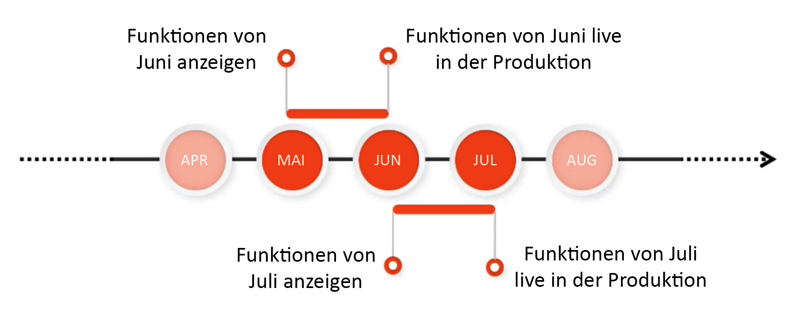
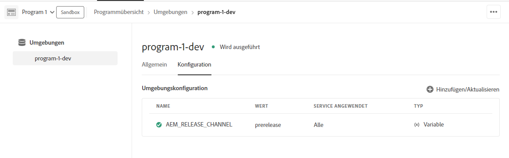

# Vorabversionskanal für Adobe Experience Manager as a Cloud Service {#prerelease-channel}

Erfahren Sie, wie Sie über den Vorabversionskanal eine Vorschau bevorstehender Funktionen von AEM as a Cloud Service erhalten.

## Einführung {#introduction}

Adobe Experience Manager as a Cloud Service entwickelt regelmäßig neue Funktionen entsprechend der Roadmap für [Experience Manager-Versionen](https://experienceleague.adobe.com/docs/experience-manager-release-information/aem-release-updates/update-releases-roadmap.html?lang=de#aem-as-cloud-service).

Um sich mit den Funktionen vertraut zu machen, die in der nächsten Version verfügbar sein werden, können Sie den Vorabversionskanal abonnieren, auf den Sie durch eine entsprechende Konfiguration Ihrer Entwicklungsumgebungen oder beliebiger Sandbox-Umgebungen zugreifen können. Sie können Änderungen, auf die über die AEM-Benutzeroberfläche zugegriffen werden kann, in der Vorschau anzeigen und Code für alle neuen Vorabversions-APIs erstellen.

Die Liste der Vorabversionsfunktionen für bestimmte Funktionsveröffentlichungen wird in den [monatlichen Versionshinweisen](/help/release-notes/release-notes-cloud/release-notes-current.md) veröffentlicht.

## AEM as a Cloud Service-Versionen {#releases}

AEM as a Cloud Service hat zwei Arten von Versionen.

* **Funktionsveröffentlichungen** fügen nach der Aktivierung neue Fähigkeiten und Funktionen zu AEM as a Cloud Service hinzu
* **Wartungsversionen** fügen Sicherheitsaktualisierungen, Leistungsverbesserungen und Fehlerbehebungen hinzu und werden regelmäßig und häufig angewendet.

Dadurch werden kontinuierliche Versionsveröffentlichungen ohne Service-Unterbrechung sichergestellt.

Der Vorabversionskanal bietet Ihnen eine Vorschau der für die bevorstehende Version geplanten Funktionen, damit Sie die neue Funktionalität bewerten und deren mögliche Implementierung in Ihre eigenen Projekte planen können. Damit können Sie schon vorab Pläne für die nächste Version erstellen.

Wenn Sie den Vorabversionskanal abonniert haben, können Sie beispielsweise schon im Mai die Funktionen der Juni-Version prüfen.



Mit der Vorabversion erhalten Sie einen rollierenden, einmonatigen Einblick in die bevorstehenden AEMaaCS-Funktionen. Damit können Sie die Auswirkungen neuer Funktionen auf Ihre Projekte und Einstellungen prüfen sowie Rollouts für diese Funktionen planen und Tests und Benutzerschulungen durchführen.

Die effektive Nutzung des Vorabversionskanals erfordert vier Schritte.

1. [Markieren der Termine im Kalender](#mark-calendars)
1. [Lesen der Versionshinweise](#release-notes)
1. [Aufrufen und ausprobieren der neuen Funktionen](#new-features)
1. [Schulen der Benutzenden ](#train-users)

## Markieren der Termine im Kalender {#mark-calendars}

Die Funktionsveröffentlichungen sind weit im Voraus geplant, und ihre Aktivierungstermine werden auf [Adobe Experience League veröffentlicht](https://experienceleague.adobe.com/docs/experience-manager-release-information/aem-release-updates/update-releases-roadmap.html?lang=de#aem-as-cloud-service).

Notieren Sie sich die Veröffentlichungstermine und planen Sie Zeit ein, um die bevorstehenden Funktionen zu überprüfen und zu testen.

## Lesen der Versionshinweise {#release-notes}

Nachdem Sie die Veröffentlichungstermine in Ihren Kalender eingetragen haben, lesen Sie am Tag der Veröffentlichung die neuesten Versionshinweise auf der [Adobe Experience League](/help/release-notes/release-notes-cloud/release-notes-current.md)-Website.

Jede Version enthält Versionshinweise, in denen nicht nur die Neuigkeiten dieser Version beschrieben werden, sondern auch die Funktionen, die für die Bewertung der Vorabversion verfügbar sind. Machen Sie sich schon vorab mit den neuesten Funktionen von AEMaaCS vertraut und erkunden Sie ihre Vorteile!

Sie können auch [bekannte Probleme überprüfen](/help/release-notes/maintenance/latest.md), die mit jeder Version veröffentlicht werden, um sich über alle technischen Fehler zu informieren, die Sie bei Ihrer Bewertung oder der möglichen Implementierung neuer Funktionen behindern könnten.

## Aktivieren des Vorabversionskanals für das Abrufen und Ausprobieren neuer Funktionen {#new-features}

Der Vorabversionskanals kann in jeder beliebigen Entwicklungs- oder Sandbox-Umgebung aktiviert werden. Eine Vorabversion kann nicht in Staging- oder Produktionsumgebungen aktiviert werden.

Die Vorabversionsfunktionen können auf unterschiedliche Weise genutzt werden:

* [Cloud-Umgebungen](#cloud-environments)
* [Lokales SDK](#local-sdk)

### Cloud-Umgebungen {#cloud-environments}

Um eine Cloud-Umgebung zu aktualisieren und die Vorabversion zu verwenden, müssen Sie eine neue Umgebungsvariable hinzufügen. Dies ist entweder über die Cloud Manager-Benutzeroberfläche oder über die CLI möglich.

#### Hinzufügen der Umgebungsvariable über die Benutzeroberfläche {#add-with-ui}

1. Melden Sie sich unter [my.cloudmanager.adobe.com](https://my.cloudmanager.adobe.com/) bei Cloud Manager an und wählen Sie die entsprechende Organisation aus.

1. Navigieren Sie zu dem Programm, für das Sie die Vorabversion aktivieren möchten.

1. Wählen Sie die Umgebung aus, in der Sie die Vorabversion aktivieren möchten, und greifen Sie über **Programm** > **Umgebung** > **Umgebungskonfiguration** auf ihre Konfiguration zu.

1. Fügen Sie eine neue [Umgebungsvariable“ ](../implementing/cloud-manager/environment-variables.md)

   | Name | Wert | Service angewendet | Typ |
   |------|-------|-----------------|------|
   | `AEM_RELEASE_CHANNEL` | `prerelease` | Alle | Variable |

1. Speichern Sie die Änderungen und die Umgebung wird aktualisiert, wenn die Umschalter für die Vorabversion aktiviert sind.

   

#### Hinzufügen der Umgebungsvariable mithilfe der CLI {#add-with-cli}

Sie können auch die Cloud Manager-API und -CLI verwenden, um die Umgebungsvariablen zu aktualisieren.

* Cloud Manager Legen Sie mithilfe des Umgebungsvariablen-Endpunkts der ](https://developer.adobe.com/experience-cloud/cloud-manager/reference/api/#operation/patchEnvironmentVariables)-API die `AEM_RELEASE_CHANNEL` Umgebungsvariable auf den Wert `prerelease` fest.[

  ```text
  PATCH /program/{programId}/environment/{environmentId}/variables
  [
          {
                  "name" : "AEM_RELEASE_CHANNEL",
                  "value" : "prerelease",
                  "type" : "string"
          }
  ]
  ```

* [Die Cloud Manager-CLI](https://github.com/adobe/aio-cli-plugin-cloudmanager#aio-cloudmanagerset-environment-variables-environmentid) kann auch verwendet werden.

  ```shell
  aio cloudmanager:environment:set-variables <ENVIRONMENT_ID> --programId=<PROGRAM_ID> --variable AEM_RELEASE_CHANNEL "prerelease
  ```

Die Variable kann gelöscht oder auf einen anderen Wert zurückgesetzt werden, wenn Sie möchten, dass das Verhalten des regulären Kanals (nicht des Kanals für Vorabversionen) wiederhergestellt wird.

### Lokales SDK {#local-sdk}

Neue Funktionen werden in der Sites-Konsole im lokalen Schnellstart-SDK angezeigt und Sie können in der Vorabversion Code für neue APIs erstellen, indem Sie Ihr Maven-Projekt auf die Vorabversion `API Jar` in Maven Central verweisen. Sie können diese Vorabversionsfunktionen auch auf Ihrer lokalen Entwicklungsumgebung sehen, indem Sie das reguläre Schnellstart-SDK im Vorabversionsmodus starten.

#### Starten des Schnellstart-SDK im Vorabversionsmodus {#prerelease-mode}

1. Laden Sie das SDK vom Software Distribution-Portal herunter und installieren Sie es wie unter [Zugriff auf das AEM as a Cloud Service-SDK](/help/implementing/developing/introduction/aem-as-a-cloud-service-sdk.md) beschrieben.
1. Fügen Sie beim Starten des QuickStart-SDK das Argument `-r prerelease` hinzu.

Der Wert bleibt erhalten und kann deshalb nur beim ersten Starten ausgewählt werden. Installieren Sie das SDK neu, um die Befehlszeilenoption zu ändern.

Da es zwischen den monatlichen Funktionsveröffentlichungen mehrere AEM-Wartungsversionen geben kann, können Sie diese neuen SDKs herunterladen und in Maven-Projekten auf die neuen SDK-API-JAR-Versionen verweisen. Mit den Wartungsversionen werden keine zusätzlichen Vorabversionsfunktionen hinzugefügt. Sie könnten jedoch andere kleinere Änderungen wie Fehlerbehebungen, Sicherheitskorrekturen und Leistungsverbesserungen umfassen.
Javadocs werden in Maven Central veröffentlicht.

#### Erstellen von Code für das Vorabversions-SDK {#build-sdk}

1. Ändern Sie das `pom.xml` Ihres Maven-Projekts, um auf ein bestimmtes Vorabversions-SDK-API-JAR zu verweisen, das in Maven Central veröffentlicht wird. Es enthält alle neuen Java-APIs für die Vorabversionsfunktionen und ist von der SDK-API-JAR-Datei abhängig. Es verwendet dieselbe Version.

   Hier finden Sie beispielsweise ein Snippet aus dem Abschnitt zur Abhängigkeitsverwaltung des übergeordneten POM, das auf das reguläre API-JAR verweist:

   ```
   <dependencyManagement>
    <dependencies>
        <dependency>
            <groupId>com.adobe.aem</groupId>
            <artifactId>aem-sdk-api</artifactId>
            <version>${aem.sdk.api}</version>
            <scope>provided</scope>
        </dependency>
   ```

   Und dann die Verwendung in einem Modul:

   ```
    <dependencies>
     <dependency>
         <groupId>com.adobe.aem</groupId>
         <artifactId>aem-sdk-api</artifactId>
     </dependency>
   ```

   Um zum Vorabversions-SDK zu wechseln, ändern Sie einfach die Abhängigkeit von `com.adobe.aem:aem-sdk-api` zu `com.adobe.aem:aem-prerelease-sdk-api` wie unten beschrieben:

   ```
   <dependencyManagement>
    <dependencies>
      <dependency>
            <groupId>com.adobe.aem</groupId>
            <artifactId>aem-prerelease-sdk-api</artifactId>
            <version>${aem.sdk.api}</version>
            <scope>provided</scope>
      </dependency>
   <dependencies>
      <dependency>
         <groupId>com.adobe.aem</groupId>
         <artifactId>aem-prerelease-sdk-api</artifactId>
      </dependency>
   ```

   Wie üblich können einzelne Projekte die Abhängigkeit verwenden.

1. Die Bereitstellung erfolgt auf Ihrem lokalen Server.

1. Nachdem Sie sich vergewissert haben, dass die Bereitstellung lokal wie erwartet funktioniert, übertragen Sie den Code auf einen Entwicklungszweig und verwenden Sie eine Nicht-Produktions-Pipeline von Cloud Manager, um ihn in einer Umgebung bereitzustellen, für die ein Abonnement für den Vorabversionskanal besteht.

>[!CAUTION]
> 
> Die `aem-prerelease-sdk-api` artifactId darf nie bei der Bereitstellung in einer Staging- oder Produktionsumgebung verwendet werden. Verwenden Sie bei der Bereitstellung über die Produktions-Pipeline immer die `aem-sdk-api`. Ebenso sollte Code, der auf Vorabversions-APIs verweist, nicht über die Produktions-Pipeline bereitgestellt werden.

Das [Build Analyzer Maven-Plug-in der AEM CS-SDK der Version 1.0 und höher](https://experienceleague.adobe.com/docs/experience-manager-core-components/using/developing/archetype/build-analyzer-maven-plugin.html?lang=de#developing) erkennt, ob die Vorabversions-API in einem Projekt verwendet wird, indem es die Abhängigkeiten überprüft. Wenn der Analyzer sie findet, verwendet er die Vorabversions-SDK-API, um das Projekt zu analysieren.

## Schulung von Benutzenden  {#train-users}

Nachdem Sie die neuen Funktionen im Vorabversionskanal getestet und entschieden haben, sie in Ihren Projekten zu nutzen, müssen Sie Ihre Benutzerinnen und Benutzer schulen.

Adobe Experience League bietet viele Ressourcen zum Kennenlernen von AEMaaCS an.

* [Die AEMaaCS-Dokumentation](https://experienceleague.adobe.com/docs/experience-manager-cloud-service.html?lang=de)
* [Tutorials](https://experienceleague.adobe.com/docs/experience-manager-learn/aem-tutorials/overview.html?lang=de)
* [Das Übersichtsvideo zur monatlichen Version](/help/release-notes/release-notes-cloud/release-notes-current.md#release-video) in den Versionshinweisen

## Zu beachten {#considerations}

Beim Verwenden des Vorabversionskanals sind einige Aspekte zu beachten.

* Der Vorabversionskanal enthält nicht unbedingt alle neuen Funktionen, die in der folgenden Version eingeführt werden sollen.
* Die Vorabversionsfunktionen durchlaufen eine strenge Kontrolle zur Qualitätssicherung und sind eher als vollständige Funktionen denn als Betaversionen konzipiert. Wenn Sie Probleme bemerken, melden Sie diese, genau wie Sie es tun würden, wenn Sie Fehler bei Funktionen in regulären AEM-Versionen vermuten.
* Um festzustellen, ob eine Umgebung für den Vorabversionskanal konfiguriert ist, wechseln Sie zur **Info**-Seite der AEM-Konsole und überprüfen Sie, ob die AEM-Versionsnummer ein *Vorabversions*-Suffix wie ```Adobe Experience Manager 2021.4.5226.20210427T070726Z-210429-PRERELEASE``` aufweist.


