# Konfigurieren der erweiterten Netzwerkfunktionen für AEM as a Cloud Service {#configuring-advanced-networking}

Dieser Artikel stellt die verschiedenen erweiterten Netzwerkfunktionen in AEM as a Cloud Service vor, einschließlich der Bereitstellung von VPN im Self-Service, nicht standardmäßiger Ports und dedizierter Ausgangs-IP-Adressen.

>[!TIP]
>
>Zusätzlich zu dieser Dokumentation gibt es auch [an diesem Ort](https://experienceleague.adobe.com/de/docs/experience-manager-learn/cloud-service/networking/advanced-networking) eine Reihe von Tutorials, die Sie durch die erweiterten Netzwerkoptionen führen sollen.

## Überblick {#overview}

AEM as a Cloud Service bietet die folgenden erweiterten Netzwerkoptionen:

* [Flexibler Port-Ausgang](#flexible-port-egress): Konfigurieren von AEM as a Cloud Service, um ausgehenden Traffic aus nicht standardmäßigen Ports zuzulassen.
* [Dedizierte Ausgangs-IP-Adresse](#dedicated-egress-ip-address): Konfigurieren von Traffic aus AEM as a Cloud Service, der von einer eindeutigen IP stammt.
* [Virtuelles privates Netzwerk (VPN)](#vpn): Sicherung des Traffics zwischen Ihrer Infrastruktur und AEM as a Cloud Service, wenn Sie über ein VPN verfügen.

In diesem Artikel wird jede dieser Optionen zunächst im Detail beschrieben und erläutert, warum Sie sie ggf. verwenden sollten. Anschließend wird beschrieben, wie die Optionen über die Cloud Manager-Benutzeroberfläche und die API konfiguriert werden. Zum Abschluss des Artikels werden einige Anwendungsfälle für Fortgeschrittene vorgestellt.

>[!CAUTION]
>
>Wenn Sie bereits mit einer älteren dedizierten Ausgangs-Technologie ausgestattet sind und eine dieser erweiterten Netzwerkoptionen konfigurieren möchten, [wenden Sie sich an die Kundenunterstützung von Adobe](https://experienceleague.adobe.com/?support-solution=Experience+Manager&amp;lang=de#home).
>
>Der Versuch, erweiterte Netzwerke mit einer veralteten Egress-Technologie zu konfigurieren, kann sich auf die Konnektivität der Site auswirken.

### Anforderungen und Einschränkungen {#requirements}

Bei der Konfiguration erweiterter Netzwerkfunktionen gelten die folgenden Einschränkungen.

* Ein Programm kann eine einzelne erweiterte Netzwerkoption (flexibler Port-Ausgang, dedizierte Ausgangs-IP-Adresse oder VPN) bereitstellen.
* Erweiterte Netzwerke sind für [Sandbox-Programme](/help/implementing/cloud-manager/getting-access-to-aem-in-cloud/program-types.md) nicht verfügbar.
* Benutzende müssen über die **Administrator**-Rolle verfügen, um die Netzwerkinfrastruktur in ihrem Programm hinzuzufügen und zu konfigurieren.
* Die Produktionsumgebung muss erstellt werden, bevor in Ihrem Programm eine Netzwerkinfrastruktur hinzugefügt werden kann.
* Ihre Netzwerkinfrastruktur muss sich in derselben Region befinden wie die primäre Region Ihrer Produktionsumgebung.
   * Wenn Ihre Produktionsumgebung über [zusätzliche Veröffentlichungsregionen](/help/implementing/cloud-manager/manage-environments.md#multiple-regions) verfügt, können Sie zusätzliche Netzwerkinfrastrukturen erstellen, die jede zusätzliche Region widerspiegeln.
   * Sie dürfen nicht mehr Netzwerkinfrastrukturen erstellen als die in Ihrer Produktionsumgebung konfigurierte maximale Anzahl von Regionen.
   * Sie können so viele Netzwerkinfrastrukturen definieren, wie Regionen in Ihrer Produktionsumgebung verfügbar sind. Die neue Infrastruktur muss jedoch vom gleichen Typ sein wie die zuvor erstellte Infrastruktur.
   * Beim Erstellen mehrerer Infrastrukturen dürfen Sie nur die Regionen auswählen, in denen keine erweiterte Netzwerkinfrastruktur erstellt wurde.

### Konfigurieren und Aktivieren erweiterter Netzwerke {#configuring-enabling}

Die Verwendung erweiterter Netzwerkfunktionen erfordert zwei Schritte:

1. Die Konfiguration der erweiterten Netzwerkoption, ob [flexibler Port-Ausgang,](#flexible-port-egress) [dedizierte Ausgangs-IP-Adresse](#dedicated-egress-ip-address) oder [VPN](#vpn), muss zunächst auf der Programmebene erfolgen.
1. Damit sie verwendet werden kann, muss die erweiterte Netzwerkoption [auf Umgebungsebene aktiviert sein](#enabling).

Beide Schritte können entweder über die Cloud Manager-Benutzeroberfläche oder die Cloud Manager-API durchgeführt werden.

* Bei Verwendung der Cloud Manager-Benutzeroberfläche müssen erweiterte Netzwerkkonfigurationen mithilfe eines Assistenten auf Programmebene erstellt und dann die einzelnen Umgebungen bearbeitet werden, in denen Sie die Konfiguration aktivieren möchten.

* Bei der Verwendung der Cloud Manager-API wird der `/networkInfrastructures`-API-Endpunkt auf der Programmebene aufgerufen, um die gewünschte Art der erweiterten Vernetzung zu deklarieren. Es folgt ein Aufruf des `/advancedNetworking`-Endpunkts für jede Umgebung, um die Infrastruktur zu aktivieren und umgebungsspezifische Parameter zu konfigurieren.

## Flexibler Port-Ausgang {#flexible-port-egress}

Diese erweiterte Netzwerkfunktion ermöglicht es Ihnen, AEM as a Cloud Service so zu konfigurieren, dass der Ausgangs-Traffic über andere Ports als HTTP (Port 80) und HTTPS (Port 443), die standardmäßig geöffnet sind, läuft.

>[!TIP]
>
>Bei der Entscheidung zwischen flexiblem Port-Ausgang und dedizierter Ausgangs-IP-Adresse empfiehlt es sich, den flexiblen Port-Ausgang zu wählen, wenn eine bestimmte IP-Adresse nicht erforderlich ist. Der Grund dafür ist, dass Adobe die Leistung des flexiblen Port-Ausgangs-Traffics optimieren kann.

>[!NOTE]
>
>Nach der Erstellung können die Infrastrukturtypen des flexiblen Port-Ausgangs nicht mehr bearbeitet werden. Die einzige Möglichkeit zum Ändern von Konfigurationswerten besteht darin, sie zu löschen und neu zu erstellen.

### Konfiguration der Benutzeroberfläche {#configuring-flexible-port-egress-provision-ui}

1. Melden Sie sich unter [my.cloudmanager.adobe.com](https://my.cloudmanager.adobe.com/) bei Cloud Manager an und wählen Sie die entsprechende Organisation aus.

1. Wählen Sie in der Konsole **[Meine Programme](/help/implementing/cloud-manager/navigation.md#my-programs)** das Programm aus.

1. Navigieren Sie auf der Seite **Programmübersicht** zur Registerkarte **Umgebungen** und wählen Sie im linken Bedienfeld **Netzwerkinfrastruktur** aus.

   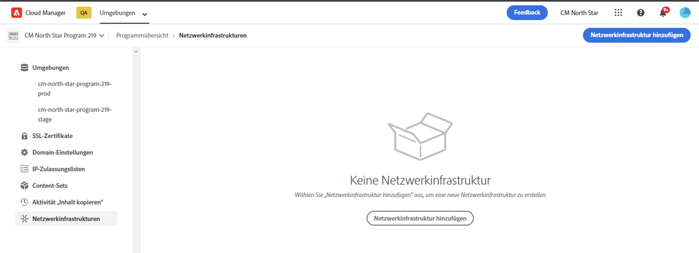

1. Wählen Sie im Assistenten **Netzwerkinfrastruktur hinzufügen** aus dem Dropdown-Menü **Region** die Option **Flexibler Port-Ausgang** und die Region, in der er erstellt werden soll, und klicken Sie auf **Fortfahren**.

   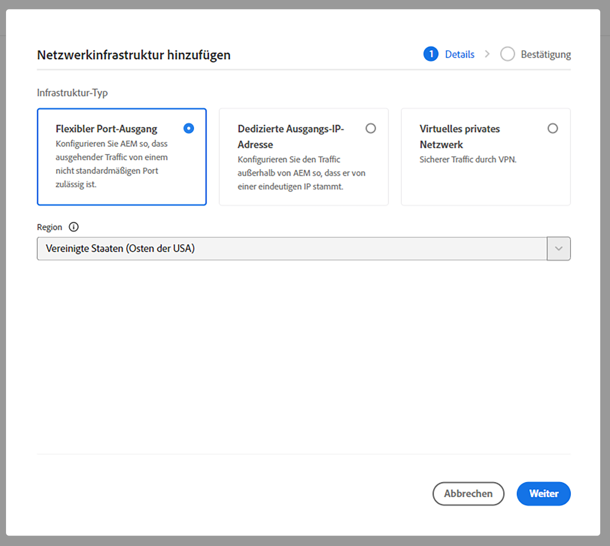

1. Die Registerkarte **Bestätigung** fasst Ihre Auswahl und die nächsten Schritte zusammen. Klicken Sie auf **Speichern**, um die Infrastruktur zu erstellen.

   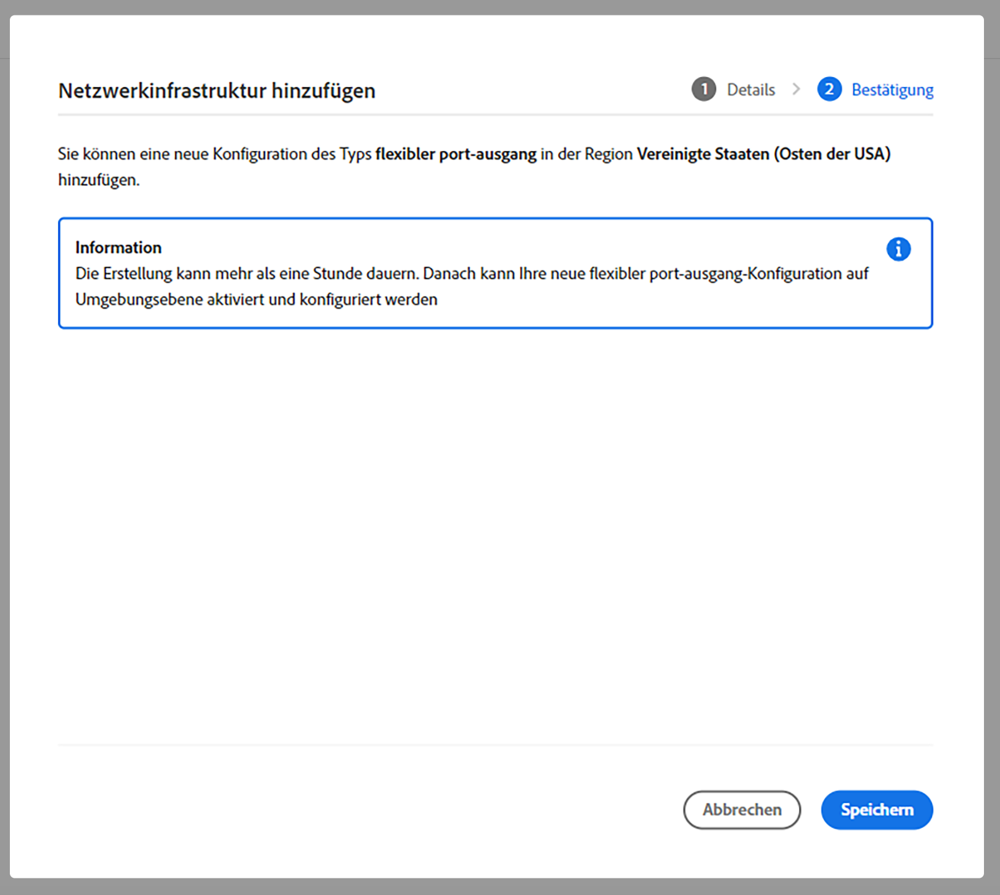

Unter der Überschrift **Netzwerkinfrastruktur** im seitlichen Bedienfeld erscheint ein neuer Eintrag mit Details zum Typ der Infrastruktur, dem Status, der Region und den Umgebungen, für die er aktiviert wurde.

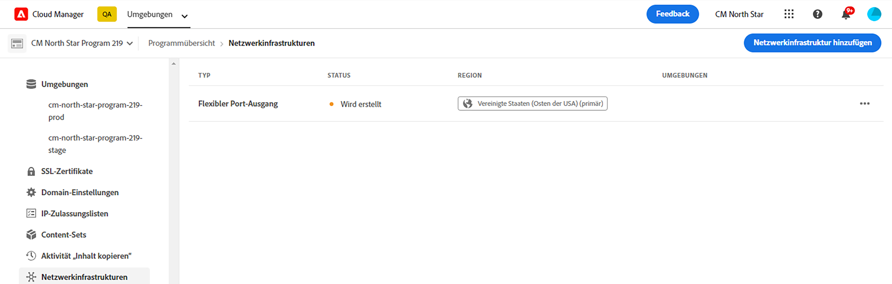

>[!NOTE]
>
>Die Erstellung der Infrastruktur für flexible Port-Ausgänge kann bis zu einer Stunde dauern. Anschließend kann sie auf Umgebungsebene konfiguriert werden.

### API-Konfiguration {#configuring-flexible-port-egress-provision-api}

Einmal pro Programm wird der POST-Endpunkt `/program/<programId>/networkInfrastructures` aufgerufen, wobei einfach der Wert von `flexiblePortEgress` für den Parameter `kind` und die Region übergeben wird. Der Endpunkt antwortet mit der `network_id` sowie anderen Informationen, einschließlich des Status. 

Nach dem Aufruf dauert es in der Regel etwa 15 Minuten, bis die Netzwerkinfrastruktur bereitgestellt wird. Ein Aufruf des [Netzwerkinfrastruktur-GET-Endpunkts](https://developer.adobe.com/experience-cloud/cloud-manager/reference/api/#operation/getNetworkInfrastructure) von Cloud Manager würde den Status **Bereit** anzeigen.

>[!TIP]
>
>Der vollständige Satz von Parametern, die genaue Syntax und wichtige Informationen darüber, welche Parameter z. B. später nicht mehr geändert werden können, [können der API-Dokumentation entnommen werden.](https://developer.adobe.com/experience-cloud/cloud-manager/reference/api/#operation/createNetworkInfrastructure)

### Traffic-Routing {#flexible-port-egress-traffic-routing}

Für HTTP- oder HTTPS-Traffic, der an andere Ports als 80 oder 443 geleitet wird, sollte ein Proxy mit den folgenden Host- und Port-Umgebungsvariablen konfiguriert werden:

* für HTTP: `AEM_PROXY_HOST` / `AEM_HTTP_PROXY_PORT ` (Standardeinstellung ist `proxy.tunnel:3128` in AEM-Versionen &lt; 6094)
* für HTTPS: `AEM_PROXY_HOST` / `AEM_HTTPS_PROXY_PORT ` (Standardeinstellung ist `proxy.tunnel:3128` in AEM-Versionen &lt; 6094)

Hier finden Sie Beispiel-Code zum Senden einer Anfrage an `www.example.com:8443`:

```java
String url = "www.example.com:8443"
String proxyHost = System.getenv().getOrDefault("AEM_PROXY_HOST", "proxy.tunnel");
int proxyPort = Integer.parseInt(System.getenv().getOrDefault("AEM_HTTPS_PROXY_PORT", "3128"));
HttpClient client = HttpClient.newBuilder()
      .proxy(ProxySelector.of(new InetSocketAddress(proxyHost, proxyPort)))
      .build();
 
HttpRequest request = HttpRequest.newBuilder().uri(URI.create(url)).build();
HttpResponse<String> response = client.send(request, BodyHandlers.ofString());
```

Wenn Sie nicht standardmäßige Java™-Netzwerkbibliotheken verwenden, konfigurieren Sie mithilfe der oben genannten Eigenschaften Proxys für den gesamten Traffic.

Nicht-HTTP/s-Traffic mit Zielen über Ports, die im `portForwards`-Parameter deklariert wurden, sollte auf eine Eigenschaft namens `AEM_PROXY_HOST` verweisen, zusammen mit dem zugeordneten Port. Zum Beispiel:

```java
DriverManager.getConnection("jdbc:mysql://" + System.getenv("AEM_PROXY_HOST") + ":53306/test");
```

In der folgenden Tabelle wird das Traffic-Routing beschrieben:

<table>
<thead>
  <tr>
    <th>Traffic</th>
    <th>Zielbedingung</th>
    <th>Port</th>
    <th>Verbindung</th>
    <th>Beispiel für ein externes Ziel</th>
  </tr>
</thead>
<tbody>
  <tr>
    <td><b>HTTP- oder HTTPS-Protokoll</b></td>
    <td>Standard-HTTP/s-Traffic</td>
    <td>80 oder 443</td>
    <td>Zugelassen</td>
    <td></td>
  </tr> 
  <tr>
    <td></td>
    <td>Nicht standardmäßiger Traffic (an anderen Ports außerhalb von 80 oder 443) über HTTP-Proxy, der mit der folgenden Umgebungsvariablen und der Proxy-Port-Nummer konfiguriert wurde. Deklarieren Sie den Ziel-Port nicht im Parameter portForwards des Cloud Manager-API-Aufrufs:<br><ul>
     <li>AEM_PROXY_HOST (in AEM-Versionen &lt; 6094 standardmäßig "proxy.tunnel")</li>
     <li>AEM_HTTPS_PROXY_PORT (standardmäßig Port 3128 in AEM Versionen &lt; 6094)</li>
    </ul>
    <td>Ports außerhalb 80 oder 443</td>
    <td>Zugelassen</td>
    <td>example.com:8443</td>
  </tr>
  <tr>
    <td></td>
    <td>Nicht standardmäßiger Traffic (an anderen Ports außerhalb der Ports 80 oder 443), der keinen HTTP-Proxy verwendet</td>
    <td>Ports außerhalb 80 oder 443</td>
    <td>Blockiert</td>
    <td></td>
  </tr>
  <tr>
    <td><b>Nicht-HTTP oder Nicht-HTTPS</b></td>
    <td>Der Client verbindet sich mit der Umgebungsvariablen <code>AEM_PROXY_HOST</code> über ein <code>portOrig</code>, das im API-Parameter <code>portForwards</code> angegeben ist.</td>
    <td>Alle</td>
    <td>Zugelassen</td>
    <td><code>mysql.example.com:3306</code></td>
  </tr>
  <tr>
    <td></td>
    <td>Alles andere</td>
    <td>Alle</td>
    <td>Blockiert</td>
    <td><code>db.example.com:5555</code></td>
  </tr>
</tbody>
</table>

#### Apache-/Dispatcher-Konfiguration {#apache-dispatcher}

Die `mod_proxy`-Direktive der Apache/Dispatcher-Schicht von AEM as a Cloud Service kann mithilfe der oben beschriebenen Eigenschaften konfiguriert werden.

```
ProxyRemote "http://example.com:8080" "http://${AEM_PROXY_HOST}:3128"
ProxyPass "/somepath" "http://example.com:8080"
ProxyPassReverse "/somepath" "http://example.com:8080"
```

```
SSLProxyEngine on //needed for https backends
 
ProxyRemote "https://example.com:8443" "http://${AEM_PROXY_HOST}:3128"
ProxyPass "/somepath" "https://example.com:8443"
ProxyPassReverse "/somepath" "https://example.com:8443"
```

## Dedizierte Ausgangs-IP-Adresse {#dedicated-egress-ip-address}

Eine dedizierte IP-Adresse kann die Sicherheit bei der Integration mit SaaS-Anbietern (wie z. B. einem CRM-Anbieter) oder anderen Integrationen außerhalb von AEM as a Cloud Service erhöhen, die eine Zulassungsliste von IP-Adressen anbieten. Durch Hinzufügen der dedizierten IP-Adresse zur Zulassungsliste wird sichergestellt, dass nur Traffic vom AEM Cloud-Service der Kundschaft in den externen Service fließen darf. Dies geschieht zusätzlich zum Traffic von allen anderen zulässigen IPs.

Dieselbe dedizierte IP wird auf alle Umgebungen in einem Programm angewendet und gilt gleichermaßen für Autoren- und Veröffentlichungs-Service.

Wenn die Funktion der dedizierten IP-Adresse nicht aktiviert ist, fließt der Traffic von AEM as a Cloud Service über eine Reihe von IPs, die mit anderen Kundinnen und Kunden von AEM as a Cloud Service gemeinsam genutzt werden.

Die Konfiguration der dedizierten Ausgangs-IP-Adresse ähnelt dem [flexiblen Port-Ausgang.](#flexible-port-egress) Der Hauptunterschied besteht darin, dass der Traffic nach der Konfiguration immer von einer dedizierten, eindeutigen IP-Adresse ausgeht. Um diese IP zu finden, verwenden Sie einen DNS-Resolver, um die IP-Adresse zu identifizieren, die mit `p{PROGRAM_ID}.external.adobeaemcloud.com` verbunden ist. Es wird nicht erwartet, dass sich die IP-Adresse ändert. Falls sie aber doch geändert werden muss, wird vorher eine Benachrichtigung gesendet.

>[!TIP]
>
>Bei der Wahl zwischen flexiblem Port-Ausgang und dedizierter Ausgangs-IP-Adresse ist der flexible Port-Ausgang zu wählen, wenn keine bestimmte IP-Adresse erforderlich ist. Der Grund dafür ist, dass Adobe die Leistung des flexiblen Port-Ausgangs-Traffics optimieren kann.

>[!NOTE]
>
>Wenn Ihnen vor dem 30.09.2021 (d. h. vor der Version September 2021) eine dedizierte Ausgangs-IP bereitgestellt wurde, unterstützt Ihre dedizierte Ausgangs-IP-Funktion nur HTTP- und HTTPS-Ports.
>
>Dazu gehören HTTP/1.1 und bei Verschlüsselung HTTP/2. Darüber hinaus kann ein dedizierter Ausgangsendpunkt nur über HTTP/HTTPS an den Ports 80/443 mit einem beliebigen Ziel kommunizieren.

>[!NOTE]
>
>Nach der Erstellung können die Infrastrukturtypen von dedizierten Ausgangs-IP-Adressen nicht mehr bearbeitet werden. Die einzige Möglichkeit zum Ändern von Konfigurationswerten besteht darin, sie zu löschen und neu zu erstellen.

### Konfiguration der Benutzeroberfläche {#configuring-dedicated-egress-provision-ui}

1. Melden Sie sich unter [my.cloudmanager.adobe.com](https://my.cloudmanager.adobe.com/) bei Cloud Manager an und wählen Sie die entsprechende Organisation aus.

1. Wählen Sie in der Konsole **[Meine Programme](/help/implementing/cloud-manager/navigation.md#my-programs)** das Programm aus.

1. Navigieren Sie auf der Seite **Programmübersicht** zur Registerkarte **Umgebungen** und wählen Sie im linken Bedienfeld **Netzwerkinfrastruktur** aus.

   

1. Wählen Sie in dem sich öffnenden Assistenten **Netzwerkinfrastruktur hinzufügen** aus dem Dropdown-Menü **Region** die Option **Dedizierte Ausgangs-IP-Adresse** und die Region, in der sie erstellt werden soll, aus und klicken Sie auf **Fortfahren**.

   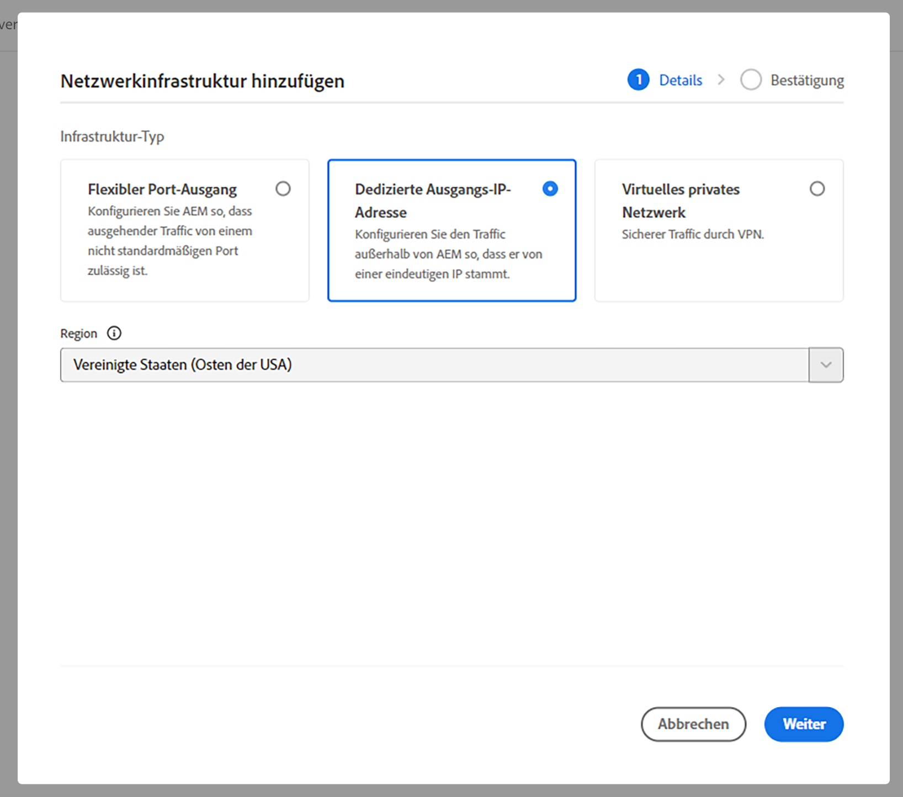

1. Die Registerkarte **Bestätigung** fasst Ihre Auswahl und die nächsten Schritte zusammen. Klicken Sie auf **Speichern**, um die Infrastruktur zu erstellen.

   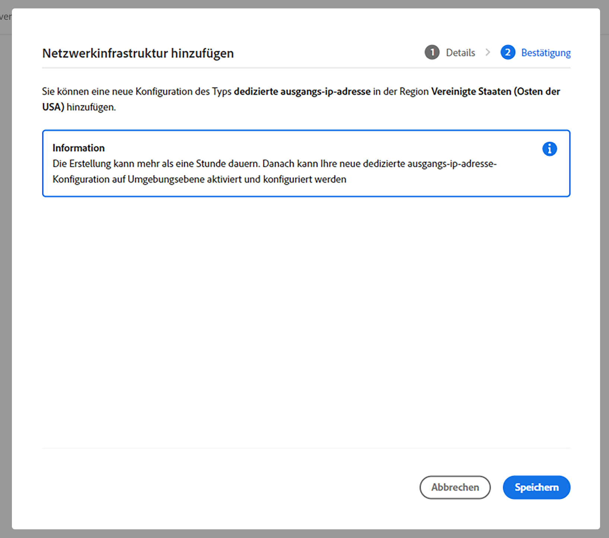

Unter der Überschrift **Netzwerkinfrastruktur** im seitlichen Bedienfeld erscheint ein neuer Eintrag mit Details zum Typ der Infrastruktur, dem Status, der Region und den Umgebungen, für die er aktiviert wurde.


>[!NOTE]
>
>Die Erstellung der Infrastruktur für flexible Port-Ausgänge kann bis zu einer Stunde dauern. Anschließend kann sie auf Umgebungsebene konfiguriert werden.

### API-Konfiguration {#configuring-dedicated-egress-provision-api}

Einmal pro Programm wird der POST-Endpunkt `/program/<programId>/networkInfrastructures` aufgerufen, wobei einfach der Wert von `dedicatedEgressIp` für den Parameter `kind` und die Region übergeben wird. Der Endpunkt antwortet mit der `network_id` sowie anderen Informationen, einschließlich des Status. 

Nach dem Aufruf dauert es in der Regel etwa 15 Minuten, bis die Netzwerkinfrastruktur bereitgestellt wird. Ein Aufruf des [Netzwerkinfrastruktur-GET-Endpunkts](https://developer.adobe.com/experience-cloud/cloud-manager/reference/api/#operation/getNetworkInfrastructure) von Cloud Manager würde den Status **Bereit** anzeigen.

>[!TIP]
>
>Der vollständige Satz von Parametern, die genaue Syntax und wichtige Informationen darüber, welche Parameter z. B. später nicht mehr geändert werden können, [können der API-Dokumentation entnommen werden.](https://developer.adobe.com/experience-cloud/cloud-manager/reference/api/#operation/createNetworkInfrastructure)

### Traffic-Routing {#dedicated-egress-ip-traffic-routing}

HTTP- oder HTTPS-Traffic durchläuft einen vorkonfigurierten Proxy, wenn er standardmäßige Java™-Systemeigenschaften für Proxy-Konfigurationen verwendet.

Nicht-HTTP/s-Traffic mit Zielen über Ports, die im `portForwards`-Parameter deklariert wurden, sollte auf eine Eigenschaft namens `AEM_PROXY_HOST` verweisen, zusammen mit dem zugeordneten Port. Zum Beispiel:

```java
DriverManager.getConnection("jdbc:mysql://" + System.getenv("AEM_PROXY_HOST") + ":53306/test");
```

<table>
<thead>
  <tr>
    <th>Traffic</th>
    <th>Zielbedingung</th>
    <th>Port</th>
    <th>Verbindung</th>
    <th>Beispiel für ein externes Ziel</th>
  </tr>
</thead>
<tbody>
  <tr>
    <td><b>HTTP- oder HTTPS-Protokoll</b></td>
    <td>Traffic zu Azure- (*.windows.net) oder Adobe-Services</td>
    <td>Alle</td>
    <td>Über die freigegebenen Cluster-IPs (nicht die dedizierte IP)</td>
    <td>adobe.io<br>api.windows.net</td>
  </tr>
  <tr>
    <td></td>
    <td>Host, der dem Parameter <code>nonProxyHosts</code> entspricht</td>
    <td>80 oder 443</td>
    <td>Über die freigegebenen Cluster-IPs</td>
    <td></td>
  </tr>
  <tr>
    <td></td>
    <td>Host, der dem Parameter <code>nonProxyHosts</code> entspricht</td>
    <td>Ports außerhalb 80 oder 443</td>
    <td>Blockiert</td>
    <td></td>
  </tr>
  <tr>
    <td></td>
    <td>Durch die HTTP-Proxy-Konfiguration, die standardmäßig für den HTTP/s-Traffic mithilfe der standardmäßigen Java™-HTTP-Client-Bibliothek konfiguriert ist</td>
    <td>Alle</td>
    <td>Über die dedizierte Ausgangs-IP</td>
    <td></td>
  </tr>
  <tr>
    <td></td>
    <td>Ignoriert die HTTP-Proxy-Konfiguration (z. B. wenn diese explizit aus der standardmäßigen Java™-HTTP-Client-Bibliothek entfernt wurde oder wenn eine Java™-Bibliothek verwendet wird, die die standardmäßige Proxy-Konfiguration ignoriert)</td>
    <td>80 oder 443</td>
    <td>Über die freigegebenen Cluster-IPs</td>
    <td></td>
  </tr>
  <tr>
    <td></td>
    <td>Ignoriert die HTTP-Proxy-Konfiguration (z. B. wenn diese explizit aus der standardmäßigen Java™-HTTP-Client-Bibliothek entfernt wurde oder wenn eine Java™-Bibliothek verwendet wird, die die standardmäßige Proxy-Konfiguration ignoriert)</td>
    <td>Ports außerhalb 80 oder 443</td>
    <td>Blockiert</td>
    <td></td>
  </tr>
  <tr>
    <td><b>Nicht-HTTP oder Nicht-HTTPS</b></td>
    <td>Der Client stellt eine Verbindung zur Umgebungsvariablen <code>AEM_PROXY_HOST</code> her, indem er ein im API-Parameter <code>portForwards</code> angegebenes <code>portOrig</code> verwendet</td>
    <td>Alle</td>
    <td>Über die dedizierte Ausgangs-IP</td>
    <td><code>mysql.example.com:3306</code></td>
  </tr>
  <tr>
    <td></td>
    <td>Alles andere</td>
    <td></td>
    <td>Blockiert</td>
    <td></td>
  </tr>
</tbody>
</table>

### Verwendung der Funktion {#feature-usage}

Die Funktion ist mit Java™-Code oder Bibliotheken kompatibel, die zu ausgehendem Traffic führen, sofern sie Standard-Java™-Systemeigenschaften für Proxy-Konfigurationen verwenden. In der Praxis sollte dies die gängigsten Bibliotheken umfassen.

Nachfolgend finden Sie ein Code-Beispiel:

```java
public JSONObject getJsonObject(String relativePath, String queryString) throws IOException, JSONException {
  String relativeUri = queryString.isEmpty() ? relativePath : (relativePath + '?' + queryString);
  URL finalUrl = endpointUri.resolve(relativeUri).toURL();
  URLConnection connection = finalUrl.openConnection();
  connection.addRequestProperty("Accept", "application/json");
  connection.addRequestProperty("X-API-KEY", apiKey);

  try (InputStream responseStream = connection.getInputStream(); Reader responseReader = new BufferedReader(new InputStreamReader(responseStream, Charsets.UTF_8))) {
    return new JSONObject(new JSONTokener(responseReader));
  }
}
```

Einige Bibliotheken erfordern eine explizite Konfiguration, um standardmäßige Java™-Systemeigenschaften für Proxy-Konfigurationen zu verwenden.

Ein Beispiel mit Apache HttpClient, das explizite Aufrufe an
[`HttpClientBuilder.useSystemProperties()`](https://hc.apache.org/httpcomponents-client-4.5.x/current/httpclient/apidocs/org/apache/http/impl/client/HttpClientBuilder.html) oder die Verwendung von
[`HttpClients.createSystem()`](https://hc.apache.org/httpcomponents-client-4.5.x/current/httpclient/apidocs/org/apache/http/impl/client/HttpClients.html#createSystem()) erfordert:

```java
public JSONObject getJsonObject(String relativePath, String queryString) throws IOException, JSONException {
  String relativeUri = queryString.isEmpty() ? relativePath : (relativePath + '?' + queryString);
  URL finalUrl = endpointUri.resolve(relativeUri).toURL();

  HttpClient httpClient = HttpClientBuilder.create().useSystemProperties().build();
  HttpGet request = new HttpGet(finalUrl.toURI());
  request.setHeader("Accept", "application/json");
  request.setHeader("X-API-KEY", apiKey);
  HttpResponse response = httpClient.execute(request);
  String result = EntityUtils.toString(response.getEntity());
}
```

### Überlegungen zum Debugging {#debugging-considerations}

Um zu überprüfen, ob der Traffic tatsächlich über die erwartete dedizierte IP-Adresse ausgeht, überprüfen Sie die Protokolle im Zieldienst, sofern verfügbar. Andernfalls kann es nützlich sein, einen Debugging-Dienst wie [https://ifconfig.me/ip](https://ifconfig.me/ip) aufzurufen, der die aufrufende IP-Adresse zurückgibt.

## Virtuelles privates Netzwerk (VPN) {#vpn}

Ein VPN ermöglicht die Verbindung zu einer On-Premise-Infrastruktur oder einem Rechenzentrum von der Autoren-, Veröffentlichungs- oder Vorschauinstanz aus. Dies kann beispielsweise nützlich sein, um den Zugriff auf eine Datenbank zu sichern. Es ermöglicht auch die Verbindung zu SaaS-Anbietern, z. B. einem CRM-Anbieter, der VPN unterstützt.

Die meisten VPN-Geräte mit IPSec-Technologie werden unterstützt. Lesen Sie die Informationen in der Spalte **RouteBased-Konfigurationsanweisungen** in [dieser Geräteliste.](https://learn.microsoft.com/de-de/azure/vpn-gateway/vpn-gateway-about-vpn-devices#devicetable) Konfigurieren Sie das Gerät wie in der Tabelle beschrieben.

>[!NOTE]
>
>Im Folgenden finden Sie Einschränkungen für eine VPN-Infrastruktur:
>
>* Die Unterstützung ist auf eine einzige VPN-Verbindung beschränkt
>* DNS-Resolver müssen im Gateway-Adressraum aufgeführt sein, um private Host-Namen aufzulösen.

### Konfiguration der Benutzeroberfläche {#configuring-vpn-ui}

1. Melden Sie sich unter [my.cloudmanager.adobe.com](https://my.cloudmanager.adobe.com/) bei Cloud Manager an und wählen Sie die entsprechende Organisation aus.

1. Wählen Sie in der Konsole **[Meine Programme](/help/implementing/cloud-manager/navigation.md#my-programs)** das Programm aus.

1. Navigieren Sie auf der Seite **Programmübersicht** zur Registerkarte **Umgebungen** und wählen Sie im linken Bedienfeld **Netzwerkinfrastruktur** aus.

   

1. In dem sich öffnenden Assistenten **Netzwerkinfrastruktur hinzufügen** wählen Sie **Virtuelles privates Netzwerk** und geben die erforderlichen Informationen ein, bevor Sie auf **Fortfahren** klicken.

   * **Region**: Dies ist die Region, in der Infrastruktur erstellt werden sollte.
   * **Adressraum**: Der Adressraum darf nur ein /26 CIDR- (64 IP-Adressen) oder ein größerer IP-Bereich in Ihrem eigenen Bereich sein.
      * Dieser Wert kann später nicht mehr geändert werden.
   * **DNS-Informationen**: Dies ist eine Liste der Remote-DNS-Resolver.
      * Drücken Sie nach dem Eingeben einer DNS-Server-Adresse auf `Enter`, um eine weitere einzugeben.
      * Klicken Sie auf das `X` hinter einer Adresse, um sie zu entfernen.
   * **Gemeinsam genutzter Schlüssel**: Dies ist Ihr vorab freigegebener VPN-Schlüssel.
      * Wählen Sie **Freigegebenen Schlüssel anzeigen** aus, um den Schlüssel anzuzeigen und dessen Wert nochmals zu prüfen.

   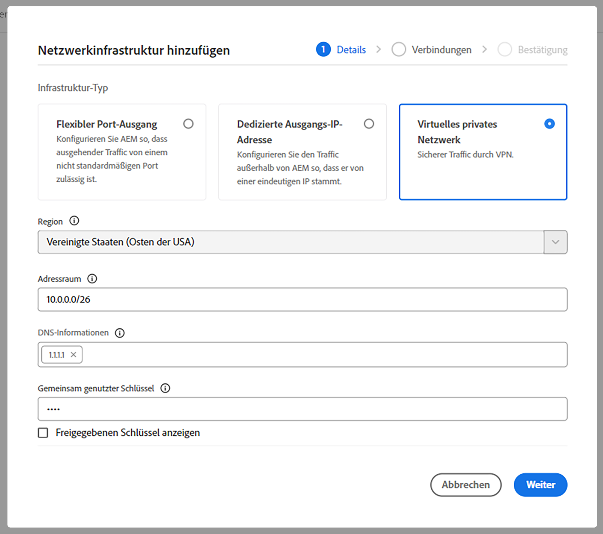

1. Geben Sie auf der Registerkarte **Verbindungen** des Assistenten einen **Verbindungsnamen** ein, um Ihre VPN-Verbindung zu identifizieren und klicken Sie auf **Verbindung hinzufügen**.

   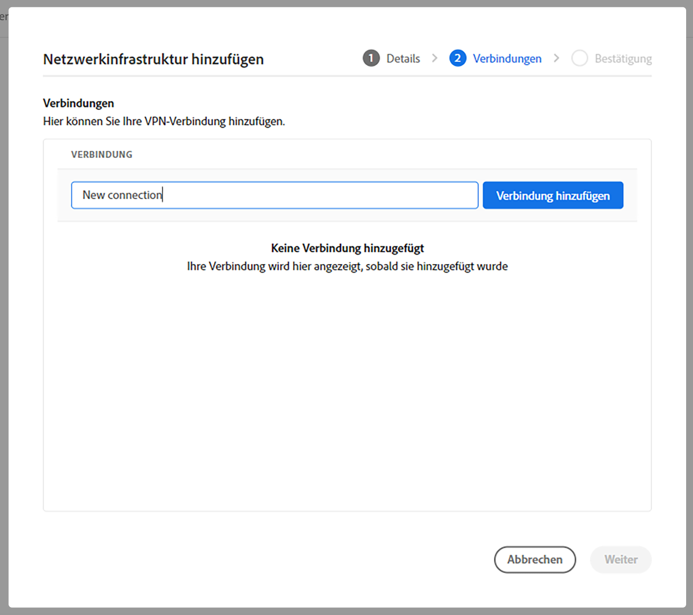

1. Im Dialog **Verbindung hinzufügen** definieren Sie Ihre VPN-Verbindung und klicken dann auf **Speichern**.

   * **Verbindungsname**: Dies ist ein beschreibender Name Ihrer VPN-Verbindung, den Sie im vorherigen Schritt angegeben haben und der hier aktualisiert werden kann.
   * **Adresse**: Dies ist die IP-Adresse des VPN-Geräts.
   * **Adressraum**: Dies sind die IP-Adressbereiche, die über das VPN weitergeleitet werden.
      * Drücken Sie nach dem Eingeben eines Bereichs auf `Enter`, um einen weiteren einzugeben.
      * Klicken Sie auf das `X` hinter einem Bereich, um ihn zu entfernen.
   * **IP-Sicherheitsrichtlinie**: Passen Sie diese bei Bedarf ausgehend von den Standardwerten an.

   

1. Das Dialogfeld wird geschlossen und Sie kehren zur Registerkarte **Verbindungen** des Assistenten zurück. Klicken Sie auf **Weiter**.

   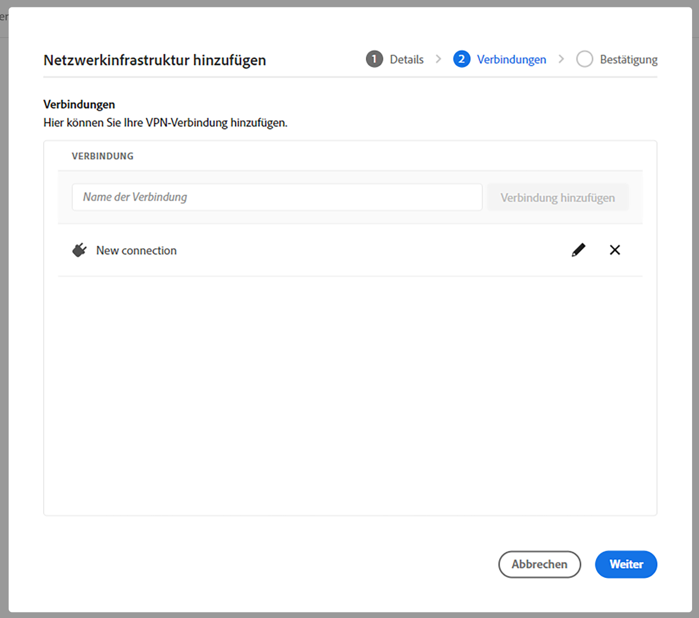

1. Die Registerkarte **Bestätigung** fasst Ihre Auswahl und die nächsten Schritte zusammen. Klicken Sie auf **Speichern**, um die Infrastruktur zu erstellen.

   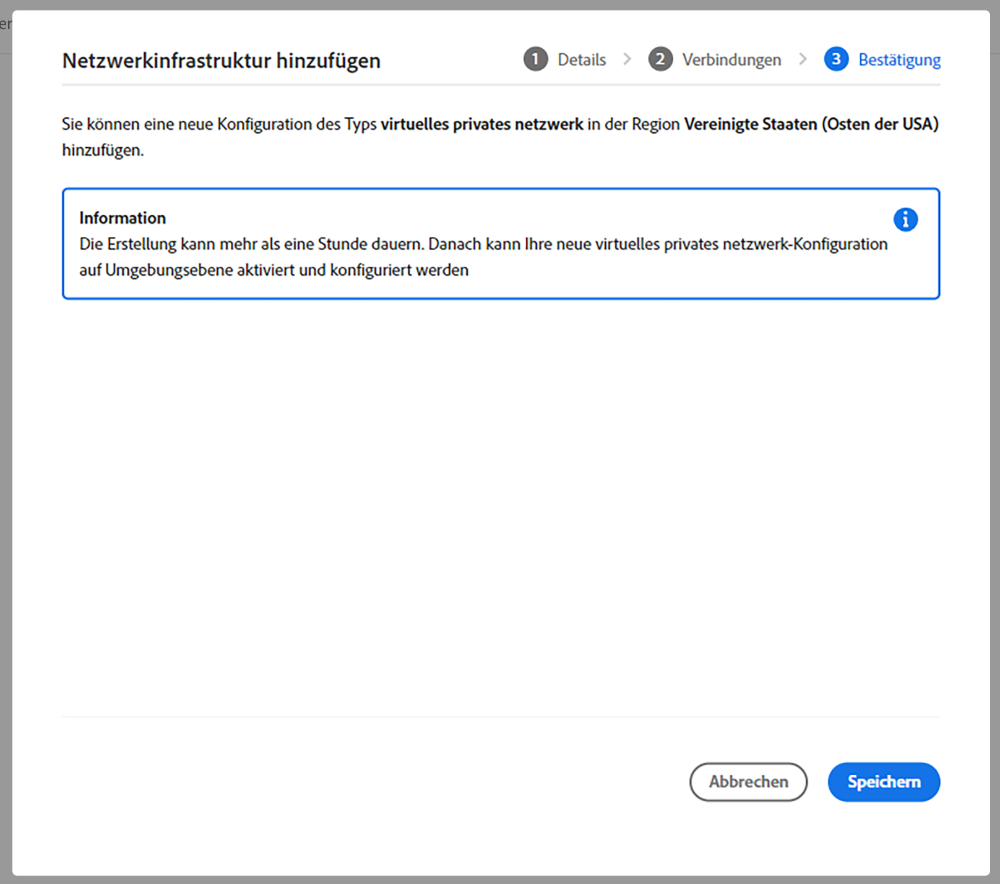

Unter der Überschrift **Netzwerkinfrastruktur** im seitlichen Bedienfeld erscheint ein neuer Eintrag mit Details zum Typ der Infrastruktur, dem Status, der Region und den Umgebungen, für die er aktiviert wurde.

### API-Konfiguration {#configuring-vpn-api}

Einmal pro Programm wird der POST-Endpunkt `/program/<programId>/networkInfrastructures` aufgerufen. Er übergibt eine Payload von Konfigurationsinformationen. Diese Informationen umfassen den Wert von **vpn** für den Parameter `kind`, Region, Adressraum (Liste der CIDRs – beachten Sie, dass dies später nicht mehr geändert werden kann), DNS-Resolver (zur Auflösung von Namen in Ihrem Netzwerk). Es enthält auch VPN-Verbindungsinformationen wie Gateway-Konfiguration, freigegebenen VPN-Schlüssel und die IP-Sicherheitsrichtlinie. Der Endpunkt antwortet mit der `network_id` sowie anderen Informationen, einschließlich des Status.

Nach dem Aufruf dauert es in der Regel zwischen 45 und 60 Minuten, bis die Netzwerkinfrastruktur bereitgestellt wird. Die GET-Methode in der API kann aufgerufen werden, um den Status zurückzugeben, der schließlich von `creating` zu `ready` wechselt. In der API-Dokumentation finden Sie alle Status.

>[!TIP]
>
>Der vollständige Satz von Parametern, die genaue Syntax und wichtige Informationen darüber, welche Parameter später nicht mehr geändert werden können, [können der API-Dokumentation entnommen werden.](https://developer.adobe.com/experience-cloud/cloud-manager/reference/api/#operation/createNetworkInfrastructure)

### Traffic-Routing {#vpn-traffic-routing}

In der folgenden Tabelle wird das Traffic-Routing beschrieben.

<table>
<thead>
  <tr>
    <th>Traffic</th>
    <th>Zielbedingung</th>
    <th>Port</th>
    <th>Verbindung</th>
    <th>Beispiel für ein externes Ziel</th>
  </tr>
</thead>
<tbody>
  <tr>
    <td><b>HTTP- oder HTTPS-Protokoll</b></td>
    <td>Traffic zu Azure- oder Adobe-Services</td>
    <td>Alle</td>
    <td>Über die freigegebenen Cluster-IPs (nicht die dedizierte IP)</td>
    <td>adobe.io<br>api.windows.net</td>
  </tr>
  <tr>
    <td></td>
    <td>Host, der dem Parameter <code>nonProxyHosts</code> entspricht</td>
    <td>80 oder 443</td>
    <td>Über die freigegebenen Cluster-IPs</td>
    <td></td>
  </tr>
  <tr>
    <td></td>
    <td>Host, der dem Parameter <code>nonProxyHosts</code> entspricht</td>
    <td>Ports außerhalb 80 oder 443</td>
    <td>Blockiert</td>
    <td></td>
  </tr>
  <tr>
    <td></td>
    <td>Wenn die IP-Adresse in den <i>Adressbereich des VPN-Gateways</i> fällt, durch die HTTP-Proxy-Konfiguration (standardmäßig für HTTP/s-Traffic unter Verwendung der Standard-Java™-HTTP-Client-Bibliothek konfiguriert)</td>
    <td>Alle</td>
    <td>Durch das VPN</td>
    <td><code>10.0.0.1:443</code><br>Es kann auch ein Hostname sein.</td>
  </tr>
  <tr>
    <td></td>
    <td>Wenn die IP nicht zum <i>Adressbereich des VPN-Gateways</i> gehört, durch die HTTP-Proxy-Konfiguration (standardmäßig für den HTTP/s-Traffic mit der standardmäßigen Java™-HTTP-Client-Bibliothek konfiguriert)</td>
    <td>Alle</td>
    <td>Über die dedizierte Ausgangs-IP</td>
    <td></td>
  </tr>
  <tr>
    <td></td>
    <td>Ignoriert die HTTP-Proxy-Konfiguration (z. B. wenn diese explizit aus der standardmäßigen Java™-HTTP-Client-Bibliothek entfernt wurde oder wenn eine Java™-Bibliothek verwendet wird, die die standardmäßige Proxy-Konfiguration ignoriert)
</td>
    <td>80 oder 443</td>
    <td>Über die freigegebenen Cluster-IPs</td>
    <td></td>
  </tr>
  <tr>
    <td></td>
    <td>Ignoriert die HTTP-Proxy-Konfiguration (z. B. wenn diese explizit aus der standardmäßigen Java™-HTTP-Client-Bibliothek entfernt wurde oder wenn eine Java™-Bibliothek verwendet wird, die die standardmäßige Proxy-Konfiguration ignoriert)</td>
    <td>Ports außerhalb 80 oder 443</td>
    <td>Blockiert</td>
    <td></td>
  </tr>
  <tr>
    <td><b>Nicht-HTTP oder Nicht-HTTPS</b></td>
    <td>Wenn die IP in den <i>Adressbereich des VPN-Gateways</i> fällt und der Client sich mithilfe einer <code>portOrig</code>, die im API-Parameter <code>portForwards</code> deklariert wurde, mit der <code>AEM_PROXY_HOST</code>-Umgebungs-Variable verbindet</td>
    <td>Alle</td>
    <td>Durch das VPN</td>
    <td><code>10.0.0.1:3306</code><br>Es kann auch ein Hostname sein.</td>
  </tr>
  <tr>
    <td></td>
    <td>Wenn die IP nicht zum <i>Adressbereich des VPN-Gateways</i> gehört und der Client sich mithilfe einer <code>portOrig</code>, die im API-Parameter <code>portForwards</code> deklariert wurde, mit der Umgebungs-Variable <code>AEM_PROXY_HOST</code> verbindet</td>
    <td>Alle</td>
    <td>Über die dedizierte Ausgangs-IP</td>
    <td></td>
  </tr>
  <tr>
    <td></td>
    <td>Alles andere</td>
    <td>Alle</td>
    <td>Blockiert</td>
    <td></td>
  </tr>
</tbody>
</table>

### Nützliche Domains für die Konfiguration {#vpn-useful-domains-for-configuration}

Das folgende Diagramm zeigt eine visuelle Darstellung einer Reihe von Domains und zugehörigen IPs, die für die Konfiguration und Entwicklung nützlich sind. Die Tabelle weiter unten im Diagramm beschreibt diese Domains und IPs.


<table>
<thead>
  <tr>
    <th>Domain-Muster</th>
    <th>Ausgang (aus AEM) Bedeutung</th>
    <th>Eingang (in AEM) Bedeutung</th>
  </tr>
</thead>
<tbody>
  <tr>
    <td><code>p{PROGRAM_ID}.external.adobeaemcloud.com</code></td>
    <td>Dedizierte Ausgangs-IP-Adresse für Traffic, der zum Internet statt über private Netzwerke geleitet wird </td>
    <td>Verbindungen des VPN würden beim CDN als von dieser IP kommend angezeigt. Um für den Eingang in AEM nur Verbindungen vom VPN zuzulassen, konfigurieren Sie Cloud Manager so, dass nur diese IP zugelassen und alles andere blockiert wird. Weitere Informationen finden Sie im Abschnitt „Eingänge auf VPN-Verbindungen beschränken“.</td>
  </tr>
  <tr>
    <td><code>p{PROGRAM_ID}.{REGION}-gateway.external.adobeaemcloud.com</code></td>
    <td>Nicht zutreffend</td>
    <td>Die IP des VPN-Gateways auf der Seite von AEM. Ihr Netzwerk-Engineering-Team kann dies verwenden, um zu Ihrem VPN-Gateway von einer bestimmten IP-Adresse aus nur VPN-Verbindungen zuzulassen. </td>
  </tr>
</tbody>
</table>

## Aktivieren erweiterter Netzwerkkonfigurationen in Umgebungen {#enabling}

Sobald Sie eine erweiterte Netzwerkoption für ein Programm konfiguriert haben, sei es [flexibler Port-Ausgang](#flexible-port-egress), [zugewiesene Ausgangs-IP-Adresse](#dedicated-egress-ip-address) oder [VPN](#vpn), müssen Sie sie auf der Umgebungsebene aktivieren, um sie zu verwenden.

Wenn Sie eine erweiterte Netzwerkkonfiguration für eine Umgebung aktivieren, können Sie auch optionale Port-Weiterleitungen und Nicht-Proxy-Hosts aktivieren. Parameter können je nach Umgebung konfiguriert werden, um Flexibilität zu bieten.

* **Port-Weiterleitung**: Für alle Ziel-Ports außer 80/443 sollten Port-Weiterleitungsregeln deklariert werden. Allerdings nur, wenn nicht das HTTP- oder HTTPS-Protokoll verwendet wird.
   * Port-Weiterleitungsregeln werden definiert, indem Ziel-Hosts (Namen oder IP sowie Ports) angegeben werden.
   * Die Client-Verbindung, die den Port 80/443 über HTTP/HTTPS verwendet, muss in ihrer Verbindung weiterhin Proxy-Einstellungen verwenden, damit die erweiterten Netzwerkeigenschaften auf die Verbindung angewendet werden. 
   * Für jeden Ziel-Host müssen Sie den vorgesehenen Ziel-Port einem Port von 30000 bis 30999 zuordnen.
   * Port-Weiterleitungsregeln sind für alle erweiterten Netzwerktypen verfügbar.

* **Nicht-Proxy-Hosts**: Nicht-Proxy-Hosts ermöglichen es Ihnen, eine Gruppe von Hosts zu deklarieren, bei denen die Weiterleitung über einen gemeinsamen IP-Adressbereich und nicht über die dedizierte IP erfolgen soll.
   * Dies kann nützlich sein, da der über gemeinsam genutzte IPs ausgehende Traffic weiter optimiert werden kann.
   * Nicht-Proxy-Hosts sind nur für die erweiterten Netzwerktypen „Dedizierte Ausgangs-IP-Adresse“ und „VPN“ verfügbar.

>[!NOTE]
>
>Sie können erweiterte Netzwerkkonfiguration für eine Umgebung nicht aktivieren, wenn sich die Umgebung im Status **Wird aktualisiert** befindet.

### Aktivieren über die Benutzeroberfläche {#enabling-ui}

1. Melden Sie sich unter [my.cloudmanager.adobe.com](https://my.cloudmanager.adobe.com/) bei Cloud Manager an und wählen Sie die entsprechende Organisation aus.

1. Wählen Sie in der Konsole **[Meine Programme](/help/implementing/cloud-manager/navigation.md#my-programs)** das Programm aus.

1. Navigieren Sie auf der Seite **Programmübersicht** zur Registerkarte **Umgebungen** und wählen Sie im linken Bedienfeld unter **Umgebungen** die Umgebung aus, in der die erweiterte Netzwerkkonfiguration aktiviert werden soll. Wählen Sie dann die Registerkarte **Erweiterte Netzwerkkonfiguration** der ausgewählten Umgebung und klicken Sie auf **Netzwerkinfrastruktur aktivieren**.

   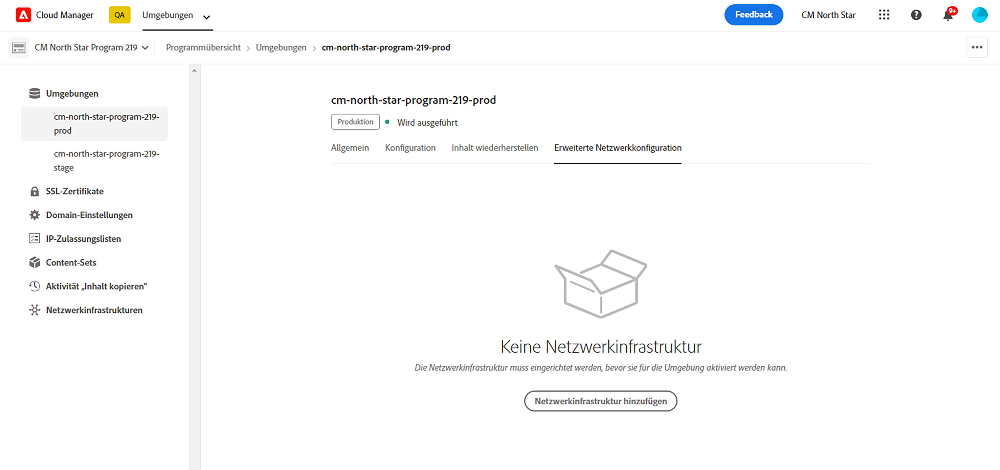

1. Daraufhin wird das Dialogfeld zum Festlegen der **erweiterten Netzwerkkonfiguration** geöffnet.

1. Auf der Registerkarte **Nicht-Proxy-Hosts** können Sie für dedizierte Ausgangs-IP-Adressen und VPNs optional eine Reihe von Hosts definieren. Diese definierten Hosts sollten über einen gemeinsam genutzten IP-Adressbereich geroutet werden und nicht über die dedizierte IP, indem Sie den Hostnamen in das Feld **Nicht-Proxy-Host** eingeben und auf **Hinzufügen** klicken.

   * Der Host wird der Host-Liste auf der Registerkarte hinzugefügt.
   * Wiederholen Sie diesen Schritt, wenn Sie mehrere Hosts hinzufügen möchten.
   * Klicken Sie auf das X rechts neben der Zeile, wenn Sie einen Host entfernen möchten.
   * Diese Registerkarte ist nicht für Konfigurationen vom Typ „Flexibler Port-Ausgang“ verfügbar.

   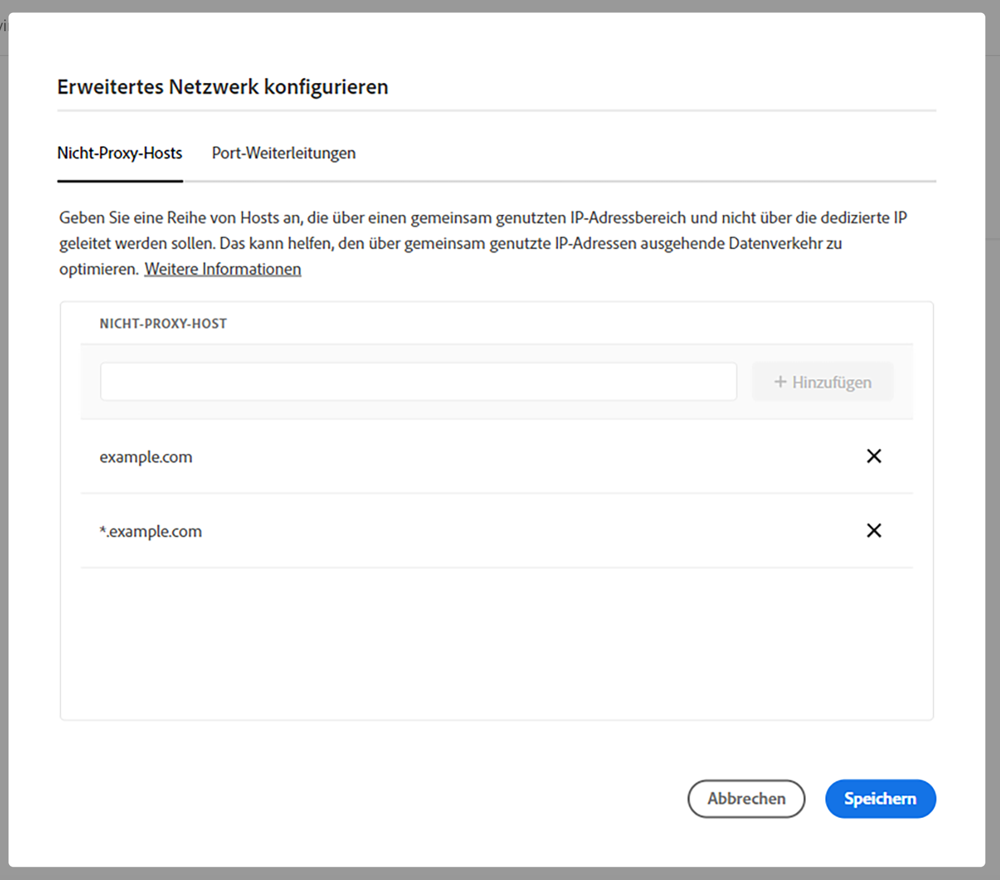

1. Auf der Registerkarte **Port-Weiterleitungen** können Sie optional Port-Weiterleitungsregeln für alle Ziel-Ports außer 80/443 definieren, sofern Sie nicht HTTP oder HTTPS verwenden. Geben Sie einen **Namen**, **Port-Ursprung** und **Port-Ziel** an und klicken Sie auf **Hinzufügen**.

   * Die Regel wird der Regelliste auf der Registerkarte hinzugefügt.
   * Wiederholen Sie diesen Schritt, wenn Sie mehrere Regeln hinzufügen möchten.
   * Klicken Sie auf das X rechts neben der Zeile, wenn Sie eine Regel entfernen möchten.

   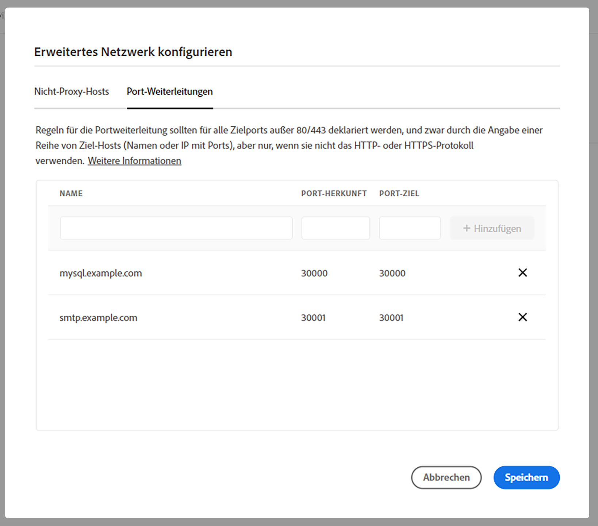

1. Klicken Sie im Dialogfeld auf **Speichern**, damit Sie die Konfiguration auf die Umgebung anwenden können.

Die erweiterte Netzwerkkonfiguration wird auf die ausgewählte Umgebung angewendet. Zurück auf der Registerkarte **Umgebungen** können Sie Details zu der auf die ausgewählte Umgebung angewendeten Konfiguration und ihren Status sehen.

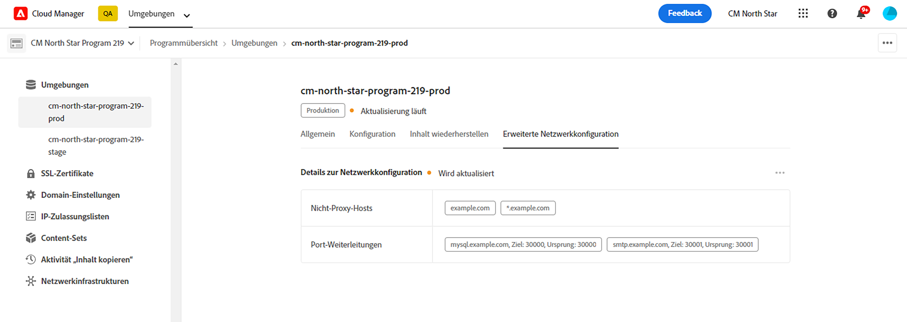

### Aktivieren über die API {#enabling-api}

Um eine erweiterte Netzwerkkonfiguration für eine Umgebung zu aktivieren, muss der Endpunkt `PUT /program/<program_id>/environment/<environment_id>/advancedNetworking` pro Umgebung aufgerufen werden.

Die API sollte in nur wenigen Sekunden antworten und den Status `updating` anzeigen. Nach etwa 10 Minuten zeigt ein Aufruf des GET-Endpunkts für die Umgebung von Cloud Manager den Status `ready` an, was bedeutet, dass die Aktualisierung der Umgebung angewendet wird.

Die umgebungsabhängigen Port-Weiterleitungsregeln können aktualisiert werden, indem der Endpunkt `PUT /program/{programId}/environment/{environmentId}/advancedNetworking` aufgerufen und dabei alle Konfigurationsparameter und nicht nur eine Teilmenge eingeschlossen werden.

Die erweiterten Netzwerkkonfigurationstypen „Dedizierte Ausgangs-IP-Adresse“ und „VPN“ unterstützen den `nonProxyHosts`-Parameter. Auf diese Weise können Sie eine Gruppe von Hosts deklarieren, bei denen die Weiterleitung über einen gemeinsamen IP-Adressbereich und nicht über die dedizierte IP erfolgen soll. Die `nonProxyHost`-URLs können dem Muster von `example.com` oder `*.example.com` folgen, wobei der Platzhalter nur am Beginn der Domain unterstützt wird.

Auch wenn es keine Regeln für die Weiterleitung des Umgebungs-Traffics gibt (Hosts oder Bypässe), muss `PUT /program/<program_id>/environment/<environment_id>/advancedNetworking` trotzdem aufgerufen werden, nur mit einer leeren Payload.

>[!TIP]
>
>Der vollständige Satz von Parametern, die genaue Syntax und wichtige Informationen darüber, welche Parameter z. B. später nicht mehr geändert werden können, [können der API-Dokumentation entnommen werden.](https://developer.adobe.com/experience-cloud/cloud-manager/reference/api/#operation/createNetworkInfrastructure)

## Bearbeiten und Löschen erweiterter Netzwerkkonfigurationen in Umgebungen {#editing-deleting-environments}

Nach der [Aktivierung der erweiterten Netzwerkkonfigurationen für Umgebungen](#enabling) können Sie die Details dieser Konfigurationen aktualisieren oder löschen.

>[!NOTE]
>
>Sie können die Netzwerkinfrastruktur nicht bearbeiten, wenn sie den Status **Wird erstellt**, **Wird aktualisiert** oder **Wird gelöscht** aufweist.

### Bearbeiten oder Löschen über die Benutzeroberfläche {#editing-ui}

1. Melden Sie sich unter [my.cloudmanager.adobe.com](https://my.cloudmanager.adobe.com/) bei Cloud Manager an und wählen Sie die entsprechende Organisation aus.

1. Wählen Sie in der Konsole **[Meine Programme](/help/implementing/cloud-manager/navigation.md#my-programs)** das Programm aus.

1. Navigieren Sie auf der Seite **Programmübersicht** zur Registerkarte **Umgebungen** und wählen Sie im linken Bedienfeld unter **Umgebungen** die Umgebung aus, in der die erweiterte Netzwerkkonfiguration aktiviert werden soll. Wählen Sie dann die Registerkarte **Erweiterte Netzwerkkonfiguration** aus und klicken Sie auf die Schaltfläche mit den Auslassungspunkten.

   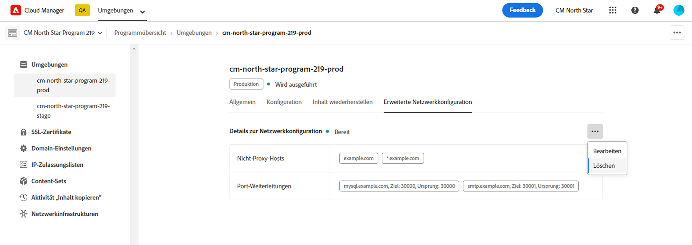

1. Wählen Sie im Menü mit den Auslassungspunkten entweder **Bearbeiten** oder **Löschen** aus.

   * Wenn Sie sich für **Bearbeiten** entscheiden, aktualisieren Sie die Informationen gemäß den im vorherigen Abschnitt [Aktivieren über die Benutzeroberfläche](#enabling-ui) beschriebenen Schritten und klicken Sie auf **Speichern**.
   * Wenn Sie sich für **Löschen** entscheiden, bestätigen Sie den Löschvorgang im Dialogfeld **Netzwerkkonfiguration löschen** mit **Löschen** oder brechen Sie ihn mit **Abbrechen** ab.

Die Änderungen werden auf der Registerkarte **Umgebungen** widergespiegelt.

### Bearbeiten oder Löschen über die API {#editing-api}

Um eine erweiterte Netzwerkkonfiguration für eine bestimmte Umgebung zu löschen, rufen Sie `DELETE [/program/{programId}/environment/{environmentId}/advancedNetworking]()` auf. 

>[!TIP]
>
>Der vollständige Satz von Parametern, die genaue Syntax und wichtige Informationen darüber, welche Parameter z. B. später nicht mehr geändert werden können, [können der API-Dokumentation entnommen werden.](https://developer.adobe.com/experience-cloud/cloud-manager/reference/api/#operation/createNetworkInfrastructure)

## Bearbeiten und Löschen der Netzwerkinfrastruktur eines Programms {#editing-deleting-program}

Sobald die Netzwerkinfrastruktur für ein Programm erstellt wurde, können nur bestimmte Eigenschaften bearbeitet werden. Wenn Sie sie nicht mehr benötigen, können Sie die erweiterte Netzwerkinfrastruktur für Ihr gesamtes Programm löschen.

>[!NOTE]
>
>Die folgenden Einschränkungen gelten für das Bearbeiten und Löschen von Netzwerkinfrastrukturen:
>
>* Durch Löschen wird die Infrastruktur nur gelöscht, wenn die erweiterte Vernetzung aller Umgebungen deaktiviert sind.
>* Sie können die Netzwerkinfrastruktur nicht bearbeiten, wenn sie den Status **Wird erstellt**, **Wird aktualisiert** oder **Wird gelöscht** aufweist.
>* Nur die erweiterte Netzwerkinfrastruktur vom Typ „VPN“ kann nach der Erstellung bearbeitet werden. Dies ist jedoch auf bestimmte Felder begrenzt.
>* Aus Sicherheitsgründen muss der **gemeinsam genutzte Schlüssel** bei der Bearbeitung einer erweiterten VPN-Netzwerkinfrastruktur immer angegeben werden, auch wenn Sie den Schlüssel selbst nicht bearbeiten.

### Bearbeiten und Löschen über die Benutzeroberfläche {#delete-ui}

1. Melden Sie sich unter [my.cloudmanager.adobe.com](https://my.cloudmanager.adobe.com/) bei Cloud Manager an und wählen Sie die entsprechende Organisation aus

1. Wählen Sie in der Konsole **[Meine Programme](/help/implementing/cloud-manager/navigation.md#my-programs)** das Programm aus.

1. Navigieren Sie auf der Seite **Programmübersicht** zur Registerkarte **Umgebungen** und wählen Sie im linken Bedienfeld die Option **Netzwerkinfrastruktur** aus. Klicken Sie dann auf die Schaltfläche mit den Auslassungspunkten neben der Infrastruktur, die Sie löschen möchten.

   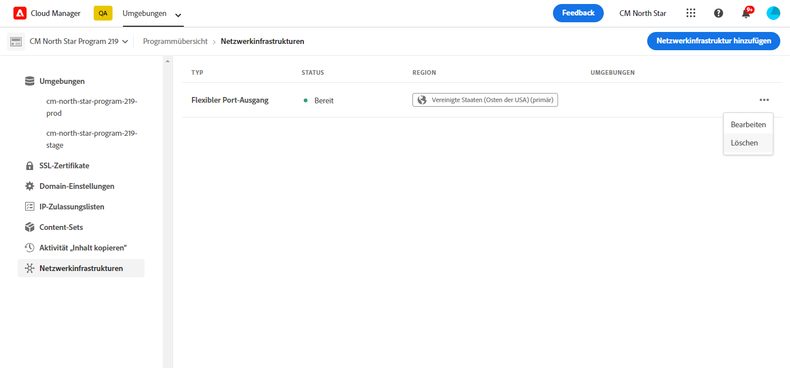

1. Wählen Sie im Menü mit den Auslassungspunkten entweder **Bearbeiten** oder **Löschen** aus.

1. Wenn Sie sich für **Bearbeiten** entscheiden, wird der Assistent **Netzwerkinfrastruktur bearbeiten** geöffnet. Bearbeiten Sie die Infrastruktur wie gewünscht und führen Sie dazu die Schritte durch, die im Abschnitt zum Erstellen der Infrastruktur beschrieben sind.

1. Wenn Sie sich für **Löschen** entscheiden, bestätigen Sie den Löschvorgang im Dialogfenster **Netzwerkkonfiguration löschen** mit **Löschen** oder brechen Sie den Vorgang mit **Abbrechen** ab.

Die Änderungen werden auf der Registerkarte **Umgebungen** widergespiegelt.

### Bearbeiten und Löschen über die API {#delete-api}

Um die Netzwerkinfrastruktur für ein Programm zu **löschen**, rufen Sie `DELETE /program/{program ID}/networkinfrastructure/{networkinfrastructureID}` auf.

## Ändern des Typs der erweiterten Netzwerkinfrastruktur eines Programms {#changing-program}

Es ist nur möglich, jeweils eine Art von erweiterter Netzwerkinfrastruktur für ein Programm zu konfigurieren. Die erweiterte Netzwerkinfrastruktur muss entweder einen flexiblen Port-Ausgang, eine dedizierte Ausgangs-IP-Adresse oder ein VPN haben.

Wenn Sie einen anderen erweiterten Netzwerkinfrastrukturtyp als den bereits konfigurierten benötigen, löschen Sie den vorhandenen und erstellen Sie einen neuen. Gehen Sie folgendermaßen vor:

1. [Löschen Sie die erweiterte Netzwerkkonfiguration in allen Umgebungen.](#editing-deleting-environments)
1. [Löschen Sie die erweiterte Netzwerkinfrastruktur.](#editing-deleting-program)
1. Erstellen Sie den von Ihnen nun benötigten erweiterten Netzwerkinfrastrukturtyp: [Flexibler Port-Ausgang,](#flexible-port-egress) [Dedizierte Ausgangs-IP-Adresse](#dedicated-egress-ip-address) oder [VPN](#vpn).
1. [Aktivieren Sie die erweiterte Netzwerkkonfiguration auf Umgebungsebene.](#enabling)

>[!WARNING]
>
> Dieses Verfahren führt zu einer Ausfallzeit der Dienste für die erweiterte Vernetzung zwischen der Löschung und der Neuerstellung.
> Wenn Ausfallzeiten erhebliche geschäftliche Auswirkungen haben würden, wenden Sie sich an den Support, um Hilfe zu erhalten, und beschreiben Sie, was bereits erstellt wurde und warum die Änderung vorgenommen wurde.

## Erweiterte Netzwerkkonfiguration für andere Veröffentlichungsregionen {#advanced-networking-configuration-for-additional-publish-regions}

Wenn eine zusätzliche Region zu einer Umgebung hinzugefügt wird, in der bereits ein erweitertes Netzwerk konfiguriert ist, wird der Traffic aus der zusätzlichen Veröffentlichungsregion, der den erweiterten Netzwerkregeln entspricht, standardmäßig durch die primäre Region geleitet. Wenn die primäre Region jedoch nicht verfügbar ist, wird der erweiterte Netzwerk-Traffic abgebrochen, wenn in der zusätzlichen Region das erweiterte Netzwerk nicht aktiviert wurde. Wenn Sie die Latenz optimieren und die Verfügbarkeit im Falle eines Ausfalls in einer der Regionen erhöhen möchten, ist es erforderlich, für die zusätzlichen Veröffentlichungsregionen ein erweitertes Netzwerk zu aktivieren. In den folgenden Abschnitten werden zwei verschiedene Szenarien beschrieben.

>[!NOTE]
>
>Alle Regionen haben die gleiche [erweiterte Netzwerkkonfiguration](https://developer.adobe.com/experience-cloud/cloud-manager/reference/api/#tag/Environment-Advanced-Networking-Configuration), sodass es nicht möglich ist, den Traffic an verschiedene Ziele zu leiten, je nachdem, aus welcher Region der Traffic kommt.

### Dedizierte Ausgangs-IP-Adressen {#additional-publish-regions-dedicated-egress}

#### Bereits aktiviertes erweitertes Netzwerk in der primären Region {#already-enabled}

Wenn in der primären Region bereits eine erweiterte Netzwerkkonfiguration aktiviert ist, führen Sie die folgenden Schritte aus:

1. Wenn Sie Ihre Infrastruktur so eingeschränkt haben, dass die dedizierte AEM-IP-Adresse auf der Zulassungsliste steht, deaktivieren Sie vorübergehend alle Ablehnungsregeln in dieser Infrastruktur. Andernfalls werden Anfragen von den IP-Adressen der neuen Region für eine kurze Zeit von Ihrer eigenen Infrastruktur abgelehnt. Dies ist nicht erforderlich, wenn Sie Ihre Infrastruktur über einen vollständig qualifizierten Domain-Namen (Fully Qualified Domain Name, FQDN) gesperrt haben (z. B. `p1234.external.adobeaemcloud.com`), da alle AEM-Regionen den erweiterten Netzwerk-Traffic von demselben FQDN ausgeben
1. Erstellen Sie die programmweite Netzwerkinfrastruktur für die sekundäre Region durch einen POST-Aufruf an die Cloud Manager-API zum Erstellen einer Netzwerkinfrastruktur, wie in der Dokumentation zu erweiterten Netzwerken beschrieben. Der einzige Unterschied in der JSON-Konfiguration der Payload im Verhältnis zur primären Region ist die Regionseigenschaft.
1. Wenn Ihre Infrastruktur nach IP gesperrt werden muss, um AEM-Traffic zu ermöglichen, fügen Sie die IPs hinzu, die mit `p1234.external.adobeaemcloud.com` übereinstimmen. Pro Region sollte es eine geben.

#### Noch kein erweitertes Netzwerk in einer Region konfiguriert {#not-yet-configured}

Das Verfahren ähnelt größtenteils den vorherigen Anweisungen. Wenn die Produktionsumgebung jedoch noch nicht für erweiterte Netzwerke aktiviert wurde, besteht die Möglichkeit, die Konfiguration zu testen, indem sie zuerst in einer Staging-Umgebung aktiviert wird:

1. Erstellen Sie eine Netzwerkinfrastruktur für alle Regionen durch einen POST-Aufruf an die [Cloud Manager-API zum Erstellen einer Netzwerkinfrastruktur](https://developer.adobe.com/experience-cloud/cloud-manager/reference/api/#tag/Network-infrastructure/operation/createNetworkInfrastructure). Der einzige Unterschied in der JSON-Konfiguration der Payload im Verhältnis zur primären Region ist die Regionseigenschaft.
1. Aktivieren und konfigurieren Sie für die Staging-Umgebung das erweiterte Netzwerk, das im Umgebungsumfang verfügbar ist, indem Sie `PUT api/program/{programId}/environment/{environmentId}/advancedNetworking` ausführen. Weitere Informationen finden Sie in der [API-Dokumentation](https://developer.adobe.com/experience-cloud/cloud-manager/reference/api/#tag/Environment-Advanced-Networking-Configuration/operation/enableEnvironmentAdvancedNetworkingConfiguration).
1. Sperren Sie ggf. die externe Infrastruktur, vorzugsweise nach FQDN (z. B. `p1234.external.adobeaemcloud.com`). Andernfalls können Sie auch die IP-Adresse verwenden.
1. Wenn die Staging-Umgebung erwartungsgemäß funktioniert, aktivieren und konfigurieren Sie die erweiterte Netzwerkkonfiguration der Umgebung für die Produktion.

#### VPN {#vpn-regions}

Das Verfahren ist fast identisch mit den Anweisungen für dedizierte Ausgangs-IP-Adressen. Der einzige Unterschied besteht darin, dass nicht nur die Eigenschaft „Region“ anders als die primäre Region konfiguriert werden kann, sondern dass auch das Feld `connections.gateway` optional konfiguriert werden kann. Die Konfiguration kann zu einem anderen VPN-Endpunkt weitergeleitet werden, der von Ihrer Organisation betrieben wird und geografisch näher an der neuen Region liegt.

## Fehlerbehebung

Beachten Sie, dass die folgenden Punkte als informative Richtlinien bereitgestellt werden und Best Practices für die Fehlerbehebung enthalten. Diese Empfehlungen sollen dazu beitragen, Probleme effektiv zu diagnostizieren und zu lösen.

### Verbindungs-Pools {#connection-pooling-advanced-networking}

Verbindungs-Pools sind eine Technik zur Erstellung und Aufrechterhaltung eines Repositorys von Verbindungen, die für die sofortige Verwendung durch jeden Thread bereit sind, der sie benötigt. Zahlreiche Verbindungs-Pool-Techniken finden Sie auf verschiedenen Online-Plattformen und -Ressourcen, jeweils mit ihren einzigartigen Vorteilen und Details. Wir empfehlen unserer Kundschaft, sich über diese Methoden zu informieren und diejenigen auszusuchen, die mit der Architektur ihres Systems am kompatibelsten sind.

Die Implementierung einer geeigneten Strategie zur Bündelung von Verbindungen ist eine proaktive Maßnahme, um ein gängiges Problem bei der Systemkonfiguration zu korrigieren, die zu einer suboptimalen Leistung führen. Durch die ordnungsgemäße Einrichtung eines Verbindungs-Pools kann Adobe Experience Manager (AEM) die Effizienz externer Aufrufe verbessern. Dies reduziert nicht nur den Ressourcenverbrauch, sondern verkleinert auch das Risiko von Dienstunterbrechungen sowie die Wahrscheinlichkeit fehlschlagender Anfragen bei der Kommunikation mit Upstream-Servern.

Somit empfiehlt Adobe, Ihre aktuelle AEM-Konfiguration zu überprüfen und die gezielte Einrichtung von Verbindungs-Pools zusammen mit erweiterten Netzwerkeinstellungen zu erwägen. Durch die Verwaltung der Anzahl paralleler Verbindungen und die Reduzierung des Auftretens veralteter Verbindungen führen diese Maßnahmen zu einer Verringerung des Risikos, dass Proxy-Server ihre Verbindungsgrenzen erreichen. Diese strategische Implementierung soll somit die Wahrscheinlichkeit verringern, dass Anfragen externe Endpunkte nicht erreichen.

#### Häufig gestellte Fragen zu Verbindungsbeschränkungen

Bei der Verwendung der erweiterten Netzwerkfunktionen ist die Anzahl der Verbindungen begrenzt, um die Stabilität in allen Umgebungen zu gewährleisten und zu verhindern, dass niedrigere Umgebungen die verfügbaren Verbindungen nicht ausschöpfen.

Die Verbindungen sind auf 1000 Verbindungen pro AEM-Instanz beschränkt, und bei Erreichen von 750 Verbindungen werden Warnhinweise an Kundinnen und Kunden gesendet.

##### Wird die Verbindungsbeschränkung nur auf ausgehenden Traffic aus nicht standardmäßigen Ports oder auf den gesamten ausgehenden Traffic angewendet?

Die Beschränkung gilt nur für Verbindungen, die erweiterte Netzwerkfunktionen nutzen (Ausgang auf nicht standardmäßigen Ports, mittels dedizierter Ausgangs-IP oder VPN).

##### Wir sehen keinen signifikanten Unterschied in der Anzahl der ausgehenden Verbindungen. Warum erhalten wir die Benachrichtigung jetzt?

Wenn die Kundin oder der Kunde dynamisch Verbindungen erstellt (z. B. eine oder mehrere Verbindungen für jede Anfrage), kann ein Anstieg des Traffics zu einer Spitze der Verbindungen führen.

##### Ist es möglich, dass in der Vergangenheit eine ähnliche Situation eingetreten ist, ohne dass wir darüber informiert wurden?

Warnhinweise werden nur gesendet, wenn die weiche Grenze erreicht ist.

##### Was passiert, wenn die Höchstgrenze erreicht wird?

Wenn die harte Grenze erreicht ist, werden neue Ausgangsverbindungen von AEM über erweiterte Netzwerkfunktionen (Ausgang auf nicht standardmäßigen Ports, mittels dedizierter Ausgangs-IP oder VPN) entfernt, um sich vor einem DoS-Angriff zu schützen.

##### Kann die Grenze angehoben werden?

Nein. Eine große Anzahl von Verbindungen kann erhebliche Leistungseinbußen verursachen und DoS über Pods und Umgebungen hinweg ermöglichen.

##### Werden die Verbindungen nach einem bestimmten Zeitraum automatisch vom AEM geschlossen?

Ja. Verbindungen werden auf JVM-Ebene und an verschiedenen Punkten in der Netzwerkinfrastruktur geschlossen. Dies wird jedoch für jeden Produktionsdienst zu spät sein. Verbindungen sollten explizit geschlossen werden, wenn sie nicht mehr benötigt werden, oder bei Verwendung von Verbindungs-Pools zum Pool zurückgegeben werden. Andernfalls ist der Ressourcenverbrauch zu hoch und kann zu einer Erschöpfung der Ressourcen führen.

##### Wenn die maximale Verbindungsgrenze erreicht ist, wirkt sich dies auf irgendwelche Lizenzen aus und verursacht zusätzliche Kosten?

Nein. Mit dieser Grenze sind keine Lizenzen oder Kosten verbunden. Es handelt sich um eine technische Grenze.

##### Wie nahe kommen wir der Grenze? Wie hoch ist die Höchstgrenze?

Der Warnhinweis wird ausgelöst, wenn die Anzahl von 750 Verbindungen überschritten wird. Die Höchstgrenze beträgt 1000 Verbindungen pro AEM Instanz.

##### Gilt diese Grenze für VPNs?

Ja, die Grenze gilt für Verbindungen, die erweiterte Netzwerkfunktionen verwenden, einschließlich VPNs.

##### Gilt diese Grenze weiterhin, wenn wir eine dedizierte Ausgangs-IP verwenden?

Ja. Die Grenze gilt bei Verwendung einer dedizierten Ausgangs-IP weiterhin.
