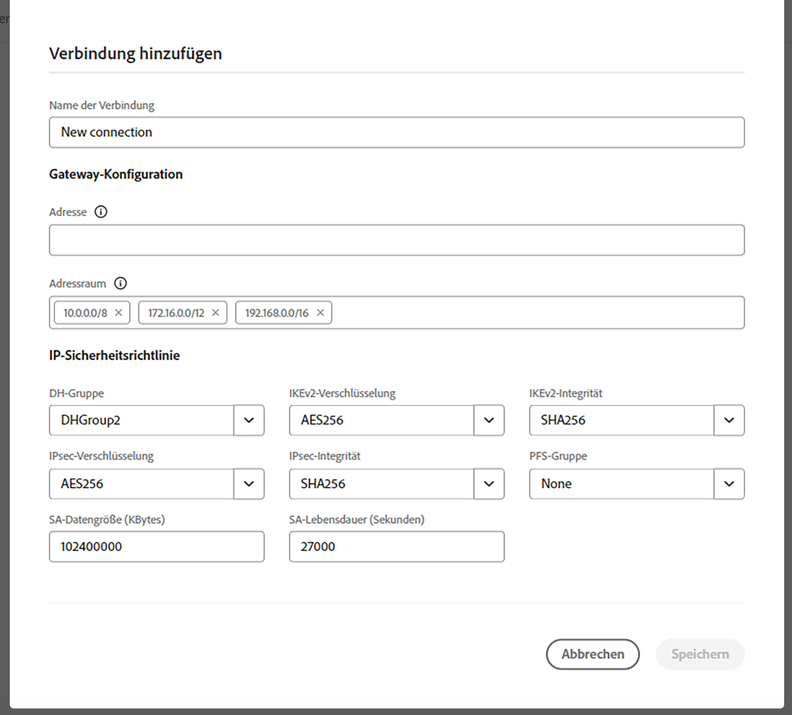

# Konfigurieren der erweiterten Netzwerkfunktionen für AEM as a Cloud Service {#configuring-advanced-networking}

Dieser Artikel stellt die verschiedenen erweiterten Netzwerkfunktionen in AEM as a Cloud Service vor, einschließlich der Bereitstellung von VPN im Self-Service, nicht standardmäßiger Ports und dedizierter Ausgangs-IP-Adressen.

>[!TIP]
>
>Zusätzlich zu dieser Dokumentation gibt es auch [an diesem Ort](https://experienceleague.adobe.com/en/docs/experience-manager-learn/cloud-service/networking/advanced-networking) eine Reihe von Tutorials, die Sie durch die erweiterten Netzwerkoptionen führen sollen.

## Übersicht {#overview}

AEM as a Cloud Service bietet die folgenden erweiterten Netzwerkoptionen:

* [Flexibler Port-Ausgang](#flexible-port-egress): Konfigurieren von AEM as a Cloud Service, um ausgehenden Traffic aus nicht standardmäßigen Ports zuzulassen.
* [Dedizierte Ausgangs-IP-Adresse](#dedicated-egress-ip-address): Konfigurieren von Traffic aus AEM as a Cloud Service, der von einer eindeutigen IP stammt.
* [Virtuelles privates Netzwerk (VPN)](#vpn): Sicherung des Traffics zwischen Ihrer Infrastruktur und AEM as a Cloud Service, wenn Sie über ein VPN verfügen.

In diesem Artikel werden diese Optionen im Detail beschrieben und Sie erfahren, warum Sie sie verwenden können, bevor Sie beschreiben, wie sie über die Cloud Manager-Benutzeroberfläche und mithilfe der API konfiguriert werden. Der Artikel schließt mit einigen erweiterten Anwendungsfällen ab.

>[!CAUTION]
>
>Wenn Sie bereits über eine ältere dedizierte Egress-Technologie verfügen und eine dieser erweiterten Netzwerkoptionen konfigurieren möchten, [Adobe Client Care kontaktieren](https://experienceleague.adobe.com/?support-solution=Experience+Manager&amp;lang=de#home).
>
>Der Versuch, erweiterte Netzwerke mit einer veralteten Egress-Technologie zu konfigurieren, kann sich auf die Konnektivität der Site auswirken.

### Anforderungen und Einschränkungen {#requirements}

Bei der Konfiguration erweiterter Netzwerkfunktionen gelten die folgenden Einschränkungen.

* Ein Programm kann eine einzelne erweiterte Netzwerkoption (flexibler Port-Ausgang, dedizierte Ausgangs-IP-Adresse oder VPN) bereitstellen.
* Erweiterte Netzwerke sind für [Sandbox-Programme](/help/implementing/cloud-manager/getting-access-to-aem-in-cloud/program-types.md) nicht verfügbar.
* Ein Benutzer in muss über die **Administrator** Rolle zum Hinzufügen und Konfigurieren der Netzwerkinfrastruktur in Ihrem Programm.
* Die Produktionsumgebung muss erstellt werden, bevor in Ihrem Programm eine Netzwerkinfrastruktur hinzugefügt werden kann.
* Ihre Netzwerkinfrastruktur muss sich in derselben Region befinden wie die primäre Region Ihrer Produktionsumgebung.
   * Wenn Ihre Produktionsumgebung [Extra Publishing-Regionen](/help/implementing/cloud-manager/manage-environments.md#multiple-regions)können Sie eine weitere Netzwerkinfrastruktur erstellen, die jede zusätzliche Region widerspiegelt.
   * Es ist nicht zulässig, mehr Netzwerkinfrastrukturen als die in Ihrer Produktionsumgebung konfigurierte maximale Anzahl von Regionen zu erstellen.
   * Sie können so viele Netzwerkinfrastrukturen definieren, wie Regionen in Ihrer Produktionsumgebung verfügbar sind. Die neue Infrastruktur muss jedoch vom gleichen Typ sein wie die zuvor erstellte Infrastruktur.
   * Beim Erstellen mehrerer Infrastrukturen dürfen Sie nur die Regionen auswählen, in denen keine erweiterte Netzwerkinfrastruktur erstellt wurde.

### Konfigurieren und Aktivieren erweiterter Netzwerke {#configuring-enabling}

Die Verwendung erweiterter Netzwerkfunktionen erfordert zwei Schritte:

1. Die Konfiguration der erweiterten Netzwerkoption, ob [flexibler Port-Ausgang,](#flexible-port-egress) [dedizierte Ausgangs-IP-Adresse](#dedicated-egress-ip-address) oder [VPN](#vpn), muss zunächst auf der Programmebene erfolgen.
1. Damit sie verwendet werden kann, muss die erweiterte Netzwerkoption [auf Umgebungsebene aktiviert sein](#enabling).

Beide Schritte können entweder über die Cloud Manager-Benutzeroberfläche oder die Cloud Manager-API durchgeführt werden.

* Bei Verwendung der Cloud Manager-Benutzeroberfläche müssen erweiterte Netzwerkkonfigurationen mithilfe eines Assistenten auf Programmebene erstellt und dann alle Umgebungen bearbeitet werden, in denen die Konfiguration aktiviert werden soll.

* Bei Verwendung der Cloud Manager-API muss die `/networkInfrastructures` API-Endpunkt wird auf Programmebene aufgerufen, um den gewünschten Typ von erweitertem Netzwerk zu deklarieren. Anschließend wird die `/advancedNetworking` Endpunkt für jede Umgebung, um die Infrastruktur zu aktivieren und umgebungsspezifische Parameter zu konfigurieren.

## Flexibler Port-Ausgang {#flexible-port-egress}

Diese erweiterte Netzwerkfunktion ermöglicht es Ihnen, AEM as a Cloud Service so zu konfigurieren, dass der Ausgangs-Traffic über andere Ports als HTTP (Port 80) und HTTPS (Port 443), die standardmäßig geöffnet sind, läuft.

>[!TIP]
>
>Bei der Entscheidung zwischen flexiblem Port-Ausgang und dedizierter Ausgangs-IP-Adresse wird empfohlen, einen flexiblen Port-Ausgang zu wählen, wenn keine bestimmte IP-Adresse erforderlich ist. Der Grund dafür ist, dass Adobe die Leistung des flexiblen Port-Egress-Traffics optimieren kann.

>[!NOTE]
>
>Nach der Erstellung können keine flexiblen Ausgangs-Infrastrukturtypen bearbeitet werden. Die einzige Möglichkeit zum Ändern von Konfigurationswerten besteht darin, sie zu löschen und neu zu erstellen.

### Konfiguration der Benutzeroberfläche {#configuring-flexible-port-egress-provision-ui}

1. Melden Sie sich unter [my.cloudmanager.adobe.com](https://my.cloudmanager.adobe.com/) bei Cloud Manager an und wählen Sie die entsprechende Organisation aus.

1. Wählen Sie im Bildschirm **[Eigene Programme](/help/implementing/cloud-manager/getting-access-to-aem-in-cloud/editing-programs.md#my-programs)** das Programm aus.

1. Navigieren Sie auf der Seite **Programmübersicht** zur Registerkarte **Umgebungen** und wählen Sie im linken Bedienfeld **Netzwerkinfrastruktur** aus.

   

1. Im **Netzwerkinfrastruktur hinzufügen** Assistent, wählen Sie **Flexibles Port-Egress** und die Region, in der sie erstellt werden soll, aus der **Region** Dropdown-Menü und klicken Sie auf **Weiter**.

   

1. Die Registerkarte **Bestätigung** fasst Ihre Auswahl und die nächsten Schritte zusammen. Klicks **Speichern** , um die Infrastruktur zu erstellen.

   

Unter der Überschrift **Netzwerkinfrastruktur** im seitlichen Bedienfeld erscheint ein neuer Eintrag mit Details zum Typ der Infrastruktur, dem Status, der Region und den Umgebungen, für die er aktiviert wurde.


>[!NOTE]
>
>Die Erstellung der Infrastruktur für flexible Port-Ausgänge kann bis zu einer Stunde dauern. Anschließend kann sie auf Umgebungsebene konfiguriert werden.

### API-Konfiguration {#configuring-flexible-port-egress-provision-api}

Einmal pro Programm wird der POST-Endpunkt `/program/<programId>/networkInfrastructures` aufgerufen, wobei einfach der Wert von `flexiblePortEgress` für den Parameter `kind` und die Region übergeben wird. Der Endpunkt antwortet mit der `network_id` sowie anderen Informationen, einschließlich des Status. 

Nach dem Aufruf dauert es in der Regel etwa 15 Minuten, bis die Netzwerkinfrastruktur bereitgestellt wird. Ein Aufruf des [Netzwerkinfrastruktur-GET-Endpunkts](https://developer.adobe.com/experience-cloud/cloud-manager/reference/api/#operation/getNetworkInfrastructure) von Cloud Manager würde den Status **Bereit** anzeigen.

>[!TIP]
>
>den vollständigen Satz von Parametern, die genaue Syntax und wichtige Informationen, wie z. B. welche Parameter später nicht mehr geändert werden können, [kann in der API-Dokumentation referenziert werden.](https://developer.adobe.com/experience-cloud/cloud-manager/reference/api/#operation/createNetworkInfrastructure)

### Traffic-Routing {#flexible-port-egress-traffic-routing}

Für HTTP- oder HTTPS-Traffic, der an andere Ports als 80 oder 443 geleitet wird, sollte ein Proxy mit den folgenden Host- und Port-Umgebungsvariablen konfiguriert werden:

* für HTTP: `AEM_PROXY_HOST` / `AEM_HTTP_PROXY_PORT ` (Standardeinstellung ist `proxy.tunnel:3128` in AEM-Versionen &lt; 6094)
* für HTTPS: `AEM_PROXY_HOST` / `AEM_HTTPS_PROXY_PORT ` (Standardeinstellung ist `proxy.tunnel:3128` in AEM-Versionen &lt; 6094)

Hier finden Sie Beispielcode zum Senden einer Anfrage an `www.example.com:8443`:

```java
String url = "www.example.com:8443"
String proxyHost = System.getenv().getOrDefault("AEM_PROXY_HOST", "proxy.tunnel");
int proxyPort = Integer.parseInt(System.getenv().getOrDefault("AEM_HTTPS_PROXY_PORT", "3128"));
HttpClient client = HttpClient.newBuilder()
      .proxy(ProxySelector.of(new InetSocketAddress(proxyHost, proxyPort)))
      .build();
 
HttpRequest request = HttpRequest.newBuilder().uri(URI.create(url)).build();
HttpResponse<String> response = client.send(request, BodyHandlers.ofString());
```

Wenn Sie nicht standardmäßige Java™-Netzwerkbibliotheken verwenden, konfigurieren Sie Proxys für den gesamten Traffic mit den oben genannten Eigenschaften.

Nicht-HTTP/s-Traffic mit Zielen über Ports, die im `portForwards`-Parameter deklariert wurden, sollte auf eine Eigenschaft namens `AEM_PROXY_HOST` verweisen, zusammen mit dem zugeordneten Port. Beispiel:

```java
DriverManager.getConnection("jdbc:mysql://" + System.getenv("AEM_PROXY_HOST") + ":53306/test");
```

In der folgenden Tabelle wird das Traffic-Routing beschrieben:

<table>
<thead>
  <tr>
    <th>Traffic</th>
    <th>Zielbedingung</th>
    <th>Port</th>
    <th>Verbindung</th>
    <th>Beispiel für ein externes Ziel</th>
  </tr>
</thead>
<tbody>
  <tr>
    <td><b>HTTP- oder HTTPS-Protokoll</b></td>
    <td>Standard-HTTP/s-Traffic</td>
    <td>80 oder 443</td>
    <td>Zugelassen</td>
    <td></td>
  </tr> 
  <tr>
    <td></td>
    <td>Nicht standardmäßiger Traffic (an anderen Ports außerhalb von 80 oder 443) über HTTP-Proxy, der mit der folgenden Umgebungsvariablen und der Proxy-Port-Nummer konfiguriert wurde. Deklarieren Sie den Ziel-Port nicht im Parameter portForwards des Cloud Manager-API-Aufrufs:<br><ul>
     <li>AEM_PROXY_HOST (in AEM-Versionen &lt; 6094 standardmäßig "proxy.tunnel")</li>
     <li>AEM_HTTPS_PROXY_PORT (standardmäßig Port 3128 in AEM Versionen &lt; 6094)</li>
    </ul>
    <td>Ports außerhalb 80 oder 443</td>
    <td>Zugelassen</td>
    <td>example.com:8443</td>
  </tr>
  <tr>
    <td></td>
    <td>Nicht standardmäßiger Traffic (an anderen Ports außerhalb der Ports 80 oder 443), der keinen HTTP-Proxy verwendet</td>
    <td>Ports außerhalb 80 oder 443</td>
    <td>Blockiert</td>
    <td></td>
  </tr>
  <tr>
    <td><b>Nicht-HTTP oder Nicht-HTTPS</b></td>
    <td>Der Client verbindet sich mit der Umgebungsvariablen <code>AEM_PROXY_HOST</code> über ein <code>portOrig</code>, das im API-Parameter <code>portForwards</code> angegeben ist.</td>
    <td>Alle</td>
    <td>Zugelassen</td>
    <td><code>mysql.example.com:3306</code></td>
  </tr>
  <tr>
    <td></td>
    <td>Alles andere</td>
    <td>Alle</td>
    <td>Blockiert</td>
    <td><code>db.example.com:5555</code></td>
  </tr>
</tbody>
</table>

#### Apache-/Dispatcher-Konfiguration {#apache-dispatcher}

Die `mod_proxy`-Direktive der Apache/Dispatcher-Schicht von AEM as a Cloud Service kann mithilfe der oben beschriebenen Eigenschaften konfiguriert werden.

```
ProxyRemote "http://example.com:8080" "http://${AEM_PROXY_HOST}:3128"
ProxyPass "/somepath" "http://example.com:8080"
ProxyPassReverse "/somepath" "http://example.com:8080"
```

```
SSLProxyEngine on //needed for https backends
 
ProxyRemote "https://example.com:8443" "http://${AEM_PROXY_HOST}:3128"
ProxyPass "/somepath" "https://example.com:8443"
ProxyPassReverse "/somepath" "https://example.com:8443"
```

## Dedizierte Ausgangs-IP-Adresse {#dedicated-egress-ip-address}

Eine dedizierte IP-Adresse kann die Sicherheit bei der Integration mit SaaS-Anbietern (wie z. B. einem CRM-Anbieter) oder anderen Integrationen außerhalb von AEM as a Cloud Service erhöhen, die eine Zulassungsliste von IP-Adressen anbieten. Durch Hinzufügen der dedizierten IP-Adresse zur Zulassungsliste wird sichergestellt, dass nur Traffic aus der AEM Cloud Service in den externen Dienst fließen darf. Dies geschieht zusätzlich zum Traffic von allen anderen zulässigen IPs.

Dieselbe dedizierte IP wird auf alle Programme in Ihrer Adobe-Organisation und auf alle Umgebungen in jedem Ihrer Programme angewendet. Sie gilt sowohl für Autoren- als auch für Veröffentlichungsdienste.

Ohne aktivierte dedizierte IP-Adressenfunktion fließt der Traffic aus AEM as a Cloud Service Datenströmen über eine Reihe von IPs, die mit anderen Kunden von AEM as a Cloud Service geteilt wurden.

Die Konfiguration der dedizierten Ausgangs-IP-Adresse ähnelt dem [flexiblen Port-Ausgang.](#flexible-port-egress) Der Hauptunterschied besteht darin, dass der Traffic nach der Konfiguration immer von einer dedizierten, eindeutigen IP-Adresse ausgeht. Um diese IP zu finden, verwenden Sie einen DNS-Resolver, um die IP-Adresse zu identifizieren, die mit `p{PROGRAM_ID}.external.adobeaemcloud.com` verbunden ist. Es wird nicht erwartet, dass sich die IP-Adresse ändert. Falls sie aber doch geändert werden muss, wird vorher eine Benachrichtigung gesendet.

>[!TIP]
>
>Wählen Sie bei der Entscheidung zwischen flexiblem Port-Ausgang und dedizierter Ausgangs-IP-Adresse eine flexible Port-Ausfahrt aus, wenn keine bestimmte IP-Adresse erforderlich ist. Der Grund dafür ist, dass Adobe die Leistung des flexiblen Port-Egress-Traffics optimieren kann.

>[!NOTE]
>
>Wenn Sie vor 2021.09.30 über eine dedizierte Ausgangs-IP verfügen (also vor der Version vom September 2021), unterstützt Ihre dedizierte Ausgangs-IP-Funktion nur HTTP- und HTTPS-Ports.
>
>Dazu gehören HTTP/1.1 und bei Verschlüsselung HTTP/2. Darüber hinaus kann ein dedizierter Ausgangsendpunkt nur über HTTP/HTTPS an den Ports 80/443 mit einem beliebigen Ziel kommunizieren.

>[!NOTE]
>
>Nach der Erstellung können die Infrastrukturtypen von dedizierten Ausgangs-IP-Adressen nicht mehr bearbeitet werden. Die einzige Möglichkeit zum Ändern von Konfigurationswerten besteht darin, sie zu löschen und neu zu erstellen.

>[!INFO]
>
>Die Splunk-Weiterleitungsfunktion ist über eine dedizierte Ausgangs-IP-Adresse nicht möglich.

### Konfiguration der Benutzeroberfläche {#configuring-dedicated-egress-provision-ui}

1. Melden Sie sich unter [my.cloudmanager.adobe.com](https://my.cloudmanager.adobe.com/) bei Cloud Manager an und wählen Sie die entsprechende Organisation aus.

1. Wählen Sie im Bildschirm **[Eigene Programme](/help/implementing/cloud-manager/getting-access-to-aem-in-cloud/editing-programs.md#my-programs)** das Programm aus.

1. Navigieren Sie auf der Seite **Programmübersicht** zur Registerkarte **Umgebungen** und wählen Sie im linken Bedienfeld **Netzwerkinfrastruktur** aus.

   

1. Im **Netzwerkinfrastruktur hinzufügen** Assistent, der gestartet wird, wählen Sie **Dedizierte Ausgangs-IP-Adresse** und die Region, in der sie erstellt werden soll, aus der **Region** Dropdown-Menü und klicken Sie auf **Weiter**.

   

1. Die Registerkarte **Bestätigung** fasst Ihre Auswahl und die nächsten Schritte zusammen. Klicks **Speichern** , um die Infrastruktur zu erstellen.

   

Unter der Überschrift **Netzwerkinfrastruktur** im seitlichen Bedienfeld erscheint ein neuer Eintrag mit Details zum Typ der Infrastruktur, dem Status, der Region und den Umgebungen, für die er aktiviert wurde.


>[!NOTE]
>
>Die Erstellung der Infrastruktur für flexible Port-Ausgänge kann bis zu einer Stunde dauern. Anschließend kann sie auf Umgebungsebene konfiguriert werden.

### API-Konfiguration {#configuring-dedicated-egress-provision-api}

Einmal pro Programm wird der POST-Endpunkt `/program/<programId>/networkInfrastructures` aufgerufen, wobei einfach der Wert von `dedicatedEgressIp` für den Parameter `kind` und die Region übergeben wird. Der Endpunkt antwortet mit der `network_id` sowie anderen Informationen, einschließlich des Status. 

Nach dem Aufruf dauert es in der Regel etwa 15 Minuten, bis die Netzwerkinfrastruktur bereitgestellt wird. Ein Aufruf des [Netzwerkinfrastruktur-GET-Endpunkts](https://developer.adobe.com/experience-cloud/cloud-manager/reference/api/#operation/getNetworkInfrastructure) von Cloud Manager würde den Status **Bereit** anzeigen.

>[!TIP]
>
>den vollständigen Satz von Parametern, die genaue Syntax und wichtige Informationen, wie z. B. welche Parameter später nicht mehr geändert werden können, [kann in der API-Dokumentation referenziert werden.](https://developer.adobe.com/experience-cloud/cloud-manager/reference/api/#operation/createNetworkInfrastructure)

### Traffic-Routing {#dedicated-egress-ip-traffic-routing}

HTTP- oder HTTPS-Traffic durchläuft einen vorkonfigurierten Proxy, vorausgesetzt, sie verwenden standardmäßige Java™-Systemeigenschaften für Proxy-Konfigurationen.

Nicht-HTTP/s-Traffic mit Zielen über Ports, die im `portForwards`-Parameter deklariert wurden, sollte auf eine Eigenschaft namens `AEM_PROXY_HOST` verweisen, zusammen mit dem zugeordneten Port. Beispiel:

```java
DriverManager.getConnection("jdbc:mysql://" + System.getenv("AEM_PROXY_HOST") + ":53306/test");
```

<table>
<thead>
  <tr>
    <th>Traffic</th>
    <th>Zielbedingung</th>
    <th>Port</th>
    <th>Verbindung</th>
    <th>Beispiel für ein externes Ziel</th>
  </tr>
</thead>
<tbody>
  <tr>
    <td><b>HTTP- oder HTTPS-Protokoll</b></td>
    <td>Traffic zu Azure- oder Adobe-Services</td>
    <td>Alle</td>
    <td>Über die freigegebenen Cluster-IPs (nicht die dedizierte IP)</td>
    <td>adobe.io<br>api.windows.net</td>
  </tr>
  <tr>
    <td></td>
    <td>Host, der dem Parameter <code>nonProxyHosts</code> entspricht</td>
    <td>80 oder 443</td>
    <td>Über die freigegebenen Cluster-IPs</td>
    <td></td>
  </tr>
  <tr>
    <td></td>
    <td>Host, der dem Parameter <code>nonProxyHosts</code> entspricht</td>
    <td>Ports außerhalb 80 oder 443</td>
    <td>Blockiert</td>
    <td></td>
  </tr>
  <tr>
    <td></td>
    <td>Durch die HTTP-Proxy-Konfiguration, die standardmäßig für den HTTP/s-Traffic mithilfe der standardmäßigen Java™-HTTP-Client-Bibliothek konfiguriert ist</td>
    <td>Alle</td>
    <td>Über die dedizierte Ausgangs-IP</td>
    <td></td>
  </tr>
  <tr>
    <td></td>
    <td>Ignoriert HTTP-Proxy-Konfiguration (z. B. wenn explizit aus der standardmäßigen Java™ HTTP-Client-Bibliothek entfernt oder eine Java™-Bibliothek verwendet wird, die die standardmäßige Proxy-Konfiguration ignoriert)</td>
    <td>80 oder 443</td>
    <td>Über die freigegebenen Cluster-IPs</td>
    <td></td>
  </tr>
  <tr>
    <td></td>
    <td>Ignoriert HTTP-Proxy-Konfiguration (z. B. wenn explizit aus der standardmäßigen Java™ HTTP-Client-Bibliothek entfernt oder eine Java™-Bibliothek verwendet wird, die die standardmäßige Proxy-Konfiguration ignoriert)</td>
    <td>Ports außerhalb 80 oder 443</td>
    <td>Blockiert</td>
    <td></td>
  </tr>
  <tr>
    <td><b>Nicht-HTTP oder Nicht-HTTPS</b></td>
    <td>Der Client stellt eine Verbindung zur Umgebungsvariablen <code>AEM_PROXY_HOST</code> her, indem er ein im API-Parameter <code>portForwards</code> angegebenes <code>portOrig</code> verwendet</td>
    <td>Alle</td>
    <td>Über die dedizierte Ausgangs-IP</td>
    <td><code>mysql.example.com:3306</code></td>
  </tr>
  <tr>
    <td></td>
    <td>Alles andere</td>
    <td></td>
    <td>Blockiert</td>
    <td></td>
  </tr>
</tbody>
</table>

### Verwendung der Funktion {#feature-usage}

Die Funktion ist mit Java™-Code oder Bibliotheken kompatibel, die zu ausgehendem Traffic führen, sofern sie für Proxy-Konfigurationen die standardmäßigen Java™-Systemeigenschaften verwenden. In der Praxis sollte dies die gängigsten Bibliotheken umfassen.

Nachfolgend finden Sie ein Code-Beispiel:

```java
public JSONObject getJsonObject(String relativePath, String queryString) throws IOException, JSONException {
  String relativeUri = queryString.isEmpty() ? relativePath : (relativePath + '?' + queryString);
  URL finalUrl = endpointUri.resolve(relativeUri).toURL();
  URLConnection connection = finalUrl.openConnection();
  connection.addRequestProperty("Accept", "application/json");
  connection.addRequestProperty("X-API-KEY", apiKey);

  try (InputStream responseStream = connection.getInputStream(); Reader responseReader = new BufferedReader(new InputStreamReader(responseStream, Charsets.UTF_8))) {
    return new JSONObject(new JSONTokener(responseReader));
  }
}
```

Einige Bibliotheken erfordern eine explizite Konfiguration, um standardmäßige Java™-Systemeigenschaften für Proxy-Konfigurationen zu verwenden.

Beispiel für die Verwendung von Apache HttpClient, für das explizite Aufrufe von
[`HttpClientBuilder.useSystemProperties()`](https://hc.apache.org/httpcomponents-client-4.5.x/current/httpclient/apidocs/org/apache/http/impl/client/HttpClientBuilder.html) oder Verwendung
[`HttpClients.createSystem()`](https://hc.apache.org/httpcomponents-client-4.5.x/current/httpclient/apidocs/org/apache/http/impl/client/HttpClients.html#createSystem()):

```java
public JSONObject getJsonObject(String relativePath, String queryString) throws IOException, JSONException {
  String relativeUri = queryString.isEmpty() ? relativePath : (relativePath + '?' + queryString);
  URL finalUrl = endpointUri.resolve(relativeUri).toURL();

  HttpClient httpClient = HttpClientBuilder.create().useSystemProperties().build();
  HttpGet request = new HttpGet(finalUrl.toURI());
  request.setHeader("Accept", "application/json");
  request.setHeader("X-API-KEY", apiKey);
  HttpResponse response = httpClient.execute(request);
  String result = EntityUtils.toString(response.getEntity());
}
```

### Überlegungen zum Debugging {#debugging-considerations}

Um zu überprüfen, ob der Traffic tatsächlich über die erwartete dedizierte IP-Adresse ausgeht, überprüfen Sie die Protokolle im Zieldienst, sofern verfügbar. Andernfalls kann es nützlich sein, einen Debugging-Dienst wie [http://ifconfig.me/ip](http://ifconfig.me/ip), der die aufrufende IP-Adresse zurückgibt.

## Virtuelles privates Netzwerk (VPN) {#vpn}

Ein VPN ermöglicht die Verbindung zu einer On-Premise-Infrastruktur oder einem Rechenzentrum von der Autoren-, Veröffentlichungs- oder Vorschauinstanz aus. Dies kann beispielsweise nützlich sein, um den Zugriff auf eine Datenbank zu sichern. Es ermöglicht auch die Verbindung zu SaaS-Anbietern, wie z. B. einem CRM-Anbieter, der VPN unterstützt, oder eine Verbindung von einem Unternehmensnetzwerk mit einer Autoren-, Vorschau- oder Veröffentlichungsinstanz von AEM as a Cloud Service.

Die meisten VPN-Geräte mit IPSec-Technologie werden unterstützt. Lesen Sie die Informationen in der Spalte **RouteBased-Konfigurationsanweisungen** in [dieser Geräteliste.](https://learn.microsoft.com/en-us/azure/vpn-gateway/vpn-gateway-about-vpn-devices#devicetable) Konfigurieren Sie das Gerät wie in der Tabelle beschrieben.

>[!NOTE]
>
>Im Folgenden finden Sie Einschränkungen für eine VPN-Infrastruktur:
>
>* Unterstützung ist auf eine einzelne VPN-Verbindung beschränkt
>* Die Splunk-Weiterleitungsfunktion ist über eine VPN-Verbindung nicht möglich.
>* DNS-Resolver müssen im Gateway-Adressraum aufgeführt sein, um private Host-Namen aufzulösen.

### Konfiguration der Benutzeroberfläche {#configuring-vpn-ui}

1. Melden Sie sich unter [my.cloudmanager.adobe.com](https://my.cloudmanager.adobe.com/) bei Cloud Manager an und wählen Sie die entsprechende Organisation aus.

1. Wählen Sie im Bildschirm **[Eigene Programme](/help/implementing/cloud-manager/getting-access-to-aem-in-cloud/editing-programs.md#my-programs)** das Programm aus.

1. Navigieren Sie auf der Seite **Programmübersicht** zur Registerkarte **Umgebungen** und wählen Sie im linken Bedienfeld **Netzwerkinfrastruktur** aus.

   

1. Im **Netzwerkinfrastruktur hinzufügen** Assistent, der gestartet wird, wählen Sie **Virtuelles privates Netzwerk** und geben Sie die erforderlichen Informationen ein, bevor Sie auf **Weiter**.

   * **Region**: Dies ist die Region, in der Infrastruktur erstellt werden sollte.
   * **Adresse** - Der Adressraum darf nur ein /26 CIDR (64 IP-Adressen) oder ein größerer IP-Bereich in Ihrem eigenen Bereich sein.
      * Dieser Wert kann später nicht mehr geändert werden.
   * **DNS-Informationen**: Dies ist eine Liste der Remote-DNS-Resolver.
      * Drücken Sie nach dem Eingeben einer DNS-Server-Adresse auf `Enter`, um eine weitere einzugeben.
      * Klicken Sie auf `X` nach einer Adresse, um sie zu entfernen.
   * **Freigegebener Schlüssel**: Dies ist Ihr vorab freigegebener VPN-Schlüssel
      * Auswählen **Freigegebenen Schlüssel anzeigen** um den Schlüssel anzuzeigen, damit Sie den Wert doppelt überprüfen können.

   

1. Im **Verbindungen** Registerkarte des Assistenten, geben Sie eine **Verbindungsname** um Ihre VPN-Verbindung zu identifizieren, klicken Sie auf **Verbindung hinzufügen**.

   

1. Im **Verbindung hinzufügen** Dialogfeld, definieren Sie Ihre VPN-Verbindung und klicken Sie auf **Speichern**.

   * **Verbindungsname**: Dies ist ein beschreibender Name Ihrer VPN-Verbindung, den Sie im vorherigen Schritt angegeben haben und der hier aktualisiert werden kann.
   * **Adresse**: Dies ist die IP-Adresse des VPN-Geräts.
   * **Adressraum**: Dies sind die IP-Adressbereiche, die über das VPN weitergeleitet werden.
      * Drücken Sie nach dem Eingeben eines Bereichs auf `Enter`, um einen weiteren einzugeben.
      * Klicken Sie auf `X` nach einem Bereich, um ihn zu entfernen.
   * **IP-Sicherheitsrichtlinie**: Passen Sie diese bei Bedarf ausgehend von den Standardwerten an.

   

1. Das Dialogfeld wird geschlossen und Sie kehren zur Registerkarte **Verbindungen** des Assistenten zurück. Klicken Sie auf **Weiter**.

   

1. Die Registerkarte **Bestätigung** fasst Ihre Auswahl und die nächsten Schritte zusammen. Klicks **Speichern** , um die Infrastruktur zu erstellen.

   

Unter der Überschrift **Netzwerkinfrastruktur** im seitlichen Bedienfeld erscheint ein neuer Eintrag mit Details zum Typ der Infrastruktur, dem Status, der Region und den Umgebungen, für die er aktiviert wurde.

### API-Konfiguration {#configuring-vpn-api}

Die POST `/program/<programId>/networkInfrastructures` -Endpunkt aufgerufen wird. Er übergibt eine Payload von Konfigurationsinformationen. Diese Informationen umfassen den Wert von **vpn** für die `kind` Parameter, Region, Adressraum (Liste der CIDRs - dies kann später nicht geändert werden), DNS-Resolver (zur Namensauflösung in Ihrem Netzwerk). Es enthält auch VPN-Verbindungsinformationen wie Gateway-Konfiguration, freigegebenen VPN-Schlüssel und die IP-Sicherheitsrichtlinie. Der Endpunkt antwortet mit der `network_id` sowie anderen Informationen, einschließlich des Status. 

Nach dem Aufruf dauert es in der Regel zwischen 45 und 60 Minuten, bis die Netzwerkinfrastruktur bereitgestellt wird. Die GET-Methode in der API kann aufgerufen werden, um den Status zurückzugeben, der schließlich aus `creating` nach `ready`. In der API-Dokumentation finden Sie alle Status.

>[!TIP]
>
>den vollständigen Satz von Parametern, die genaue Syntax und wichtige Informationen, wie z. B. welche Parameter später nicht mehr geändert werden können, [kann in der API-Dokumentation referenziert werden.](https://developer.adobe.com/experience-cloud/cloud-manager/reference/api/#operation/createNetworkInfrastructure)

### Traffic-Routing {#vpn-traffic-routing}

In der folgenden Tabelle wird das Traffic-Routing beschrieben.

<table>
<thead>
  <tr>
    <th>Traffic</th>
    <th>Zielbedingung</th>
    <th>Port</th>
    <th>Verbindung</th>
    <th>Beispiel für ein externes Ziel</th>
  </tr>
</thead>
<tbody>
  <tr>
    <td><b>HTTP- oder HTTPS-Protokoll</b></td>
    <td>Traffic zu Azure- oder Adobe-Services</td>
    <td>Alle</td>
    <td>Über die freigegebenen Cluster-IPs (nicht die dedizierte IP)</td>
    <td>adobe.io<br>api.windows.net</td>
  </tr>
  <tr>
    <td></td>
    <td>Host, der dem Parameter <code>nonProxyHosts</code> entspricht</td>
    <td>80 oder 443</td>
    <td>Über die freigegebenen Cluster-IPs</td>
    <td></td>
  </tr>
  <tr>
    <td></td>
    <td>Host, der dem Parameter <code>nonProxyHosts</code> entspricht</td>
    <td>Ports außerhalb 80 oder 443</td>
    <td>Blockiert</td>
    <td></td>
  </tr>
  <tr>
    <td></td>
    <td>Wenn die IP in die <i>VPN-Gateway-Adresse</i> Platzierungsbereich und über die HTTP-Proxy-Konfiguration (standardmäßig für HTTP/s-Traffic mit der standardmäßigen Java™-HTTP-Client-Bibliothek konfiguriert)</td>
    <td>Alle</td>
    <td>Durch das VPN</td>
    <td><code>10.0.0.1:443</code><br>Es kann auch ein Hostname sein.</td>
  </tr>
  <tr>
    <td></td>
    <td>Wenn die IP nicht in die <i>VPN-Gateway-Adressraum</i> Bereich und über die HTTP-Proxy-Konfiguration (standardmäßig für HTTP/s-Traffic mit der standardmäßigen Java™-HTTP-Client-Bibliothek konfiguriert)</td>
    <td>Alle</td>
    <td>Über die dedizierte Ausgangs-IP</td>
    <td></td>
  </tr>
  <tr>
    <td></td>
    <td>Ignoriert HTTP-Proxy-Konfiguration (z. B. wenn explizit aus der standardmäßigen Java™ HTTP-Client-Bibliothek entfernt oder wenn Java™-Bibliothek verwendet wird, die die standardmäßige Proxy-Konfiguration ignoriert)
</td>
    <td>80 oder 443</td>
    <td>Über die freigegebenen Cluster-IPs</td>
    <td></td>
  </tr>
  <tr>
    <td></td>
    <td>Ignoriert HTTP-Proxy-Konfiguration (z. B. wenn explizit aus der standardmäßigen Java™ HTTP-Client-Bibliothek entfernt oder wenn Java™-Bibliothek verwendet wird, die die standardmäßige Proxy-Konfiguration ignoriert)</td>
    <td>Ports außerhalb 80 oder 443</td>
    <td>Blockiert</td>
    <td></td>
  </tr>
  <tr>
    <td><b>Nicht-HTTP oder Nicht-HTTPS</b></td>
    <td>Wenn die IP in den <i>Adressbereich des VPN-Gateways</i> fällt und der Client sich mithilfe einer <code>portOrig</code>, die im API-Parameter <code>portForwards</code> deklariert wurde, mit der <code>AEM_PROXY_HOST</code>-Umgebungs-Variable verbindet</td>
    <td>Alle</td>
    <td>Durch das VPN</td>
    <td><code>10.0.0.1:3306</code><br>Es kann auch ein Hostname sein.</td>
  </tr>
  <tr>
    <td></td>
    <td>Wenn die IP nicht zum <i>Adressbereich des VPN-Gateways</i> gehört und der Client sich mithilfe einer <code>portOrig</code>, die im API-Parameter <code>portForwards</code> deklariert wurde, mit der Umgebungs-Variable <code>AEM_PROXY_HOST</code> verbindet</td>
    <td>Alle</td>
    <td>Über die dedizierte Ausgangs-IP</td>
    <td></td>
  </tr>
  <tr>
    <td></td>
    <td>Alles andere</td>
    <td>Alle</td>
    <td>Blockiert</td>
    <td></td>
  </tr>
</tbody>
</table>

### Nützliche Domains für die Konfiguration {#vpn-useful-domains-for-configuration}

Das folgende Diagramm zeigt eine visuelle Darstellung einer Reihe von Domains und zugehörigen IPs, die für die Konfiguration und Entwicklung nützlich sind. Die Tabelle weiter unten im Diagramm beschreibt diese Domains und IPs.


<table>
<thead>
  <tr>
    <th>Domain-Muster</th>
    <th>Ausgang (aus AEM) Bedeutung</th>
    <th>Eingang (in AEM) Bedeutung</th>
  </tr>
</thead>
<tbody>
  <tr>
    <td><code>p{PROGRAM_ID}.external.adobeaemcloud.com</code></td>
    <td>Dedizierte Ausgangs-IP-Adresse für Traffic, der zum Internet statt über private Netzwerke geleitet wird </td>
    <td>Verbindungen des VPN würden beim CDN als von dieser IP kommend angezeigt. Um für den Eingang in AEM nur Verbindungen vom VPN zuzulassen, konfigurieren Sie Cloud Manager so, dass nur diese IP zugelassen und alles andere blockiert wird. Weitere Informationen finden Sie im Abschnitt „Eingänge auf VPN-Verbindungen beschränken“.</td>
  </tr>
  <tr>
    <td><code>p{PROGRAM_ID}.{REGION}-gateway.external.adobeaemcloud.com</code></td>
    <td>Nicht zutreffend</td>
    <td>Die IP des VPN-Gateways auf der Seite von AEM. Ihr Netzwerk-Engineering-Team kann dies verwenden, um zu Ihrem VPN-Gateway von einer bestimmten IP-Adresse aus nur VPN-Verbindungen zuzulassen. </td>
  </tr>
  <tr>
    <td><code>p{PROGRAM_ID}.{REGION}.inner.adobeaemcloud.net</code></td>
    <td>Die IP des Traffics kommt dabei von der AEM-Seite des VPN zu Ihrer Seite. Dies kann in Ihrer Konfiguration auf die Zulassungsliste gesetzt werden, um sicherzustellen, dass die Verbindungen nur aus AEM hergestellt werden.</td>
    <td>Wenn Sie VPN-Zugriff auf AEM zulassen möchten, sollten Sie CNAME-DNS-Einträge konfigurieren, um <code>author-p{PROGRAM_ID}-e{ENVIRONMENT_ID}.adobeaemcloud.com</code> und/oder <code>publish-p{PROGRAM_ID}-e{ENVIRONMENT_ID}.adobeaemcloud.com</code> diesen zuzuordnen.</td>
  </tr>
</tbody>
</table>

### VPN auf eingehende Verbindungen beschränken {#restrict-vpn-to-ingress-connections}

Wenn Sie nur den VPN-Zugriff auf AEM zulassen möchten, können Umgebungszulassungslisten in Cloud Manager so konfiguriert werden, dass nur die durch `p{PROGRAM_ID}.external.adobeaemcloud.com` definierte IP mit der Umgebung kommunizieren darf. Dies kann auf dieselbe Weise wie jede andere IP-basierte Zulassungsliste in Cloud Manager erfolgen.

Wenn Regeln pfadbasiert sein müssen, verwenden Sie standardmäßige HTTP-Anweisungen auf Dispatcher-Ebene, um bestimmte IPs zu verweigern oder zuzulassen. Sie sollten sicherstellen, dass die gewünschten Pfade auch im CDN nicht zwischenspeicherbar sind, sodass die Anfrage immer an den Ursprung gelangt.

#### Beispiel für httpd-Konfiguration {#httpd-example}

```
Order deny,allow
Deny from all
Allow from 192.168.0.1
Header always set Cache-Control private
```

## Aktivieren erweiterter Netzwerkkonfigurationen in Umgebungen {#enabling}

Sobald Sie eine erweiterte Netzwerkoption für ein Programm konfiguriert haben, können Sie entscheiden, ob [flexibler Port-Ausgang](#flexible-port-egress), [dedizierte Ausgangs-IP-Adresse](#dedicated-egress-ip-address)oder [VPN](#vpn), müssen Sie sie auf Umgebungsebene aktivieren.

Wenn Sie eine erweiterte Netzwerkkonfiguration für eine Umgebung aktivieren, können Sie auch die optionale Anschlussweiterleitung und Nicht-Proxy-Hosts aktivieren. Parameter können je nach Umgebung konfiguriert werden, um Flexibilität zu bieten.

* **Port-Weiterleitung**: Für alle Ziel-Ports außer 80/443 sollten Port-Weiterleitungsregeln deklariert werden. Allerdings nur, wenn nicht das HTTP- oder HTTPS-Protokoll verwendet wird.
   * Port-Weiterleitungsregeln werden definiert, indem Ziel-Hosts (Namen oder IP sowie Ports) angegeben werden.
   * Die Clientverbindung, die Port 80/443 über http/https verwendet, muss in ihrer Verbindung weiterhin Proxy-Einstellungen verwenden, damit die Eigenschaften des erweiterten Netzwerks auf die Verbindung angewendet werden.
   * Für jeden Ziel-Host müssen Sie den vorgesehenen Ziel-Port einem Port von 30000 bis 30999 zuordnen.
   * Port-Weiterleitungsregeln sind für alle erweiterten Netzwerktypen verfügbar.

* **Nicht-Proxy-Hosts** - Nicht-Proxy-Hosts ermöglichen es Ihnen, eine Gruppe von Hosts zu deklarieren, die über einen freigegebenen IP-Adressbereich statt über die dedizierte IP weitergeleitet werden sollen.
   * Dies kann nützlich sein, da der über gemeinsam genutzte IPs ausgehende Traffic weiter optimiert werden kann.
   * Nicht-Proxy-Hosts sind nur für dedizierte Egress-IP-Adressen und VPN-erweiterte Netzwerktypen verfügbar.

>[!NOTE]
>
>Sie können keine erweiterte Netzwerkkonfiguration für eine Umgebung aktivieren, wenn sich die Umgebung in der **Aktualisieren** -Status.

### Aktivieren über die Benutzeroberfläche {#enabling-ui}

1. Melden Sie sich unter [my.cloudmanager.adobe.com](https://my.cloudmanager.adobe.com/) bei Cloud Manager an und wählen Sie die entsprechende Organisation aus.

1. Wählen Sie im Bildschirm **[Eigene Programme](/help/implementing/cloud-manager/getting-access-to-aem-in-cloud/editing-programs.md#my-programs)** das Programm aus.

1. Aus dem **Programmübersicht** Seite, navigieren Sie zur **Umgebungen** und wählen Sie die Umgebung aus, in der Sie die erweiterte Netzwerkkonfiguration aktivieren möchten, unter dem **Umgebungen** im linken Bereich. Wählen Sie dann die **Erweiterte Netzwerkkonfiguration** Registerkarte der ausgewählten Umgebung und klicken Sie auf **Netzwerkinfrastruktur aktivieren**.

   

1. Daraufhin wird das Dialogfeld zum Festlegen der **erweiterten Netzwerkkonfiguration** geöffnet.

1. Im **Nicht-Proxyhosts** für dedizierte Ausgangs-IP-Adressen und VPNs können Sie optional eine Reihe von Hosts definieren. Diese definierten Hosts sollten über einen freigegebenen IP-Adressbereich und nicht über die dedizierte IP weitergeleitet werden, indem der Hostname in der **Nicht-Proxy-Host** Feld und Klicken **Hinzufügen**.

   * Der Host wird der Host-Liste auf der Registerkarte hinzugefügt.
   * Wiederholen Sie diesen Schritt, wenn Sie mehrere Hosts hinzufügen möchten.
   * Klicken Sie auf das X rechts neben der Zeile, wenn Sie einen Host entfernen möchten.
   * Diese Registerkarte ist nicht für Konfigurationen vom Typ „Flexibler Port-Ausgang“ verfügbar.

   

1. Auf der Registerkarte **Port-Weiterleitungen** können Sie optional Port-Weiterleitungsregeln für alle Ziel-Ports außer 80/443 definieren, sofern Sie nicht HTTP oder HTTPS verwenden. Stellen Sie eine **Name**, **Port Orig**, und **Port Dest** und klicken **Hinzufügen**.

   * Die Regel wird der Regelliste auf der Registerkarte hinzugefügt.
   * Wiederholen Sie diesen Schritt, wenn Sie mehrere Regeln hinzufügen möchten.
   * Klicken Sie auf das X rechts neben der Zeile, wenn Sie eine Regel entfernen möchten.

   

1. Klicks **Speichern** im Dialogfeld, damit Sie die Konfiguration auf die Umgebung anwenden können.

Die erweiterte Netzwerkkonfiguration wird auf die ausgewählte Umgebung angewendet. Zurück auf der Registerkarte **Umgebungen** können Sie Details zu der auf die ausgewählte Umgebung angewendeten Konfiguration und ihren Status sehen.


### Aktivieren über die API {#enabling-api}

Um eine erweiterte Netzwerkkonfiguration für eine Umgebung zu aktivieren, muss der Endpunkt `PUT /program/<program_id>/environment/<environment_id>/advancedNetworking` pro Umgebung aufgerufen werden.

Die API sollte in nur wenigen Sekunden reagieren und den Status `updating`. Nach etwa 10 Minuten zeigt ein Aufruf des Umgebungs-GET von Cloud Manager den Status `ready`, um anzugeben, dass die Aktualisierung auf die Umgebung angewendet wird.

Die umgebungsabhängigen Port-Weiterleitungsregeln können aktualisiert werden, indem der Endpunkt `PUT /program/{programId}/environment/{environmentId}/advancedNetworking` aufgerufen und dabei alle Konfigurationsparameter und nicht nur eine Teilmenge eingeschlossen werden.

Die erweiterten Netzwerkkonfigurationstypen „Dedizierte Ausgangs-IP-Adresse“ und „VPN“ unterstützen den `nonProxyHosts`-Parameter. Auf diese Weise können Sie eine Gruppe von Hosts deklarieren, bei denen die Weiterleitung über einen gemeinsamen IP-Adressbereich und nicht über die dedizierte IP erfolgen soll. Die `nonProxyHost`-URLs können dem Muster von `example.com` oder `*.example.com` folgen, wobei der Platzhalter nur am Beginn der Domain unterstützt wird.

Auch wenn es keine Regeln für das Traffic-Routing der Umgebung (Hosts oder Umgehungen) gibt, `PUT /program/<program_id>/environment/<environment_id>/advancedNetworking` muss weiterhin aufgerufen werden, nur mit einer leeren Payload.

>[!TIP]
>
>den vollständigen Satz von Parametern, die genaue Syntax und wichtige Informationen, wie z. B. welche Parameter später nicht mehr geändert werden können, [kann in der API-Dokumentation referenziert werden.](https://developer.adobe.com/experience-cloud/cloud-manager/reference/api/#operation/createNetworkInfrastructure)

## Bearbeiten und Löschen erweiterter Netzwerkkonfigurationen in Umgebungen {#editing-deleting-environments}

Nachher [Aktivierung erweiterter Netzwerkkonfigurationen in Umgebungen,](#enabling) Sie können die Details dieser Konfigurationen aktualisieren oder löschen.

>[!NOTE]
>
>Sie können die Netzwerkinfrastruktur nicht bearbeiten, wenn sie den Status hat **Erstellen**, **Aktualisieren** oder **Löschen**.

### Bearbeiten oder Löschen über die Benutzeroberfläche {#editing-ui}

1. Melden Sie sich unter [my.cloudmanager.adobe.com](https://my.cloudmanager.adobe.com/) bei Cloud Manager an und wählen Sie die entsprechende Organisation aus.

1. Wählen Sie im Bildschirm **[Eigene Programme](/help/implementing/cloud-manager/getting-access-to-aem-in-cloud/editing-programs.md#my-programs)** das Programm aus.

1. Aus dem **Programmübersicht** Seite, navigieren Sie zur **Umgebungen** und wählen Sie die Umgebung aus, in der Sie die erweiterte Netzwerkkonfiguration aktivieren möchten, unter dem **Umgebungen** im linken Bereich. Wählen Sie dann die **Erweiterte Netzwerkkonfiguration** und klicken Sie auf die Schaltfläche mit den Auslassungspunkten.

   

1. Wählen Sie im Menü mit den Auslassungspunkten entweder **Bearbeiten** oder **Löschen**.

   * Wenn Sie **Bearbeiten** aktualisieren Sie die Informationen gemäß den im vorherigen Abschnitt beschriebenen Schritten. [Aktivieren der Benutzeroberfläche,](#enabling-ui) und klicken **Speichern**.
   * Wenn Sie sich für **Löschen** entscheiden, bestätigen Sie den Löschvorgang im Dialogfeld **Netzwerkkonfiguration löschen** mit **Löschen** oder brechen Sie ihn mit **Abbrechen** ab.

Die Änderungen werden im **Umgebungen** Registerkarte.

### Bearbeiten oder Löschen über die API {#editing-api}

Um eine erweiterte Netzwerkkonfiguration für eine bestimmte Umgebung zu löschen, rufen Sie `DELETE [/program/{programId}/environment/{environmentId}/advancedNetworking]()` auf. 

>[!TIP]
>
>den vollständigen Satz von Parametern, die genaue Syntax und wichtige Informationen, wie z. B. welche Parameter später nicht mehr geändert werden können, [kann in der API-Dokumentation referenziert werden.](https://developer.adobe.com/experience-cloud/cloud-manager/reference/api/#operation/createNetworkInfrastructure)

## Bearbeiten und Löschen der Netzwerkinfrastruktur eines Programms {#editing-deleting-program}

Sobald die Netzwerkinfrastruktur für ein Programm erstellt wurde, können nur bestimmte Eigenschaften bearbeitet werden. Wenn Sie sie nicht mehr benötigen, können Sie die erweiterte Netzwerkinfrastruktur für Ihr gesamtes Programm löschen.

>[!NOTE]
>
>Im Folgenden finden Sie Einschränkungen beim Bearbeiten und Löschen von Netzwerkinfrastruktur:
>
>* Beim Löschen wird die Infrastruktur nur gelöscht, wenn die erweiterte Netzwerkfunktion in allen Umgebungen deaktiviert ist.
>* Sie können die Netzwerkinfrastruktur nicht bearbeiten, wenn sie den Status hat **Erstellen**, **Aktualisieren** oder **Löschen**.
>* Nur die erweiterte Netzwerkinfrastruktur vom Typ „VPN“ kann nach der Erstellung bearbeitet werden. Dies ist jedoch auf bestimmte Felder begrenzt.
>* Aus Sicherheitsgründen muss die Variable **Gemeinsamer Schlüssel** muss bei der Bearbeitung einer erweiterten VPN-Netzwerkinfrastruktur immer bereitgestellt werden, auch wenn Sie den Schlüssel selbst nicht bearbeiten.

### Bearbeiten und Löschen über die Benutzeroberfläche {#delete-ui}

1. Melden Sie sich unter [my.cloudmanager.adobe.com](https://my.cloudmanager.adobe.com/) bei Cloud Manager an und wählen Sie die entsprechende Organisation aus

1. Wählen Sie im Bildschirm **[Eigene Programme](/help/implementing/cloud-manager/getting-access-to-aem-in-cloud/editing-programs.md#my-programs)** das Programm aus.

1. Navigieren Sie auf der Seite **Programmübersicht** zur Registerkarte **Umgebungen** und wählen Sie im linken Bedienfeld die Option **Netzwerkinfrastruktur** aus. Klicken Sie dann auf die Suchschaltfläche neben der Infrastruktur, die Sie löschen möchten.

   

1. Wählen Sie im Menü mit den Auslassungspunkten entweder **Bearbeiten** oder **Löschen**.

1. Wenn Sie sich für **Bearbeiten** entscheiden, wird der Assistent **Netzwerkinfrastruktur bearbeiten** geöffnet. Bearbeiten Sie die Infrastruktur wie gewünscht und führen Sie dazu die Schritte durch, die im Abschnitt zum Erstellen der Infrastruktur beschrieben sind.

1. Wenn Sie **Löschen**, bestätigen Sie den Löschvorgang im **Netzwerkkonfiguration löschen** Dialogfeld mit **Löschen** oder abbrechen mit **Abbrechen**.

Die Änderungen werden im **Umgebungen** Registerkarte.

### Bearbeiten und Löschen über die API {#delete-api}

Um die Netzwerkinfrastruktur für ein Programm zu **löschen**, rufen Sie `DELETE /program/{program ID}/networkinfrastructure/{networkinfrastructureID}` auf.

## Ändern des Typs der erweiterten Netzwerkinfrastruktur eines Programms {#changing-program}

Es ist nur möglich, jeweils nur einen Typ von erweiterter Netzwerkinfrastruktur für ein Programm zu konfigurieren. Die erweiterte Netzwerkinfrastruktur muss entweder flexible Port-Egress, dedizierte Egress-IP-Adresse oder VPN sein.

Wenn Sie entscheiden, dass Sie einen anderen fortgeschrittenen Netzwerkinfrastrukturtyp als den bereits konfigurierten benötigen, löschen Sie die vorhandene und erstellen Sie einen anderen. Gehen Sie folgendermaßen vor:

1. [Löschen Sie die erweiterte Netzwerkkonfiguration in allen Umgebungen.](#editing-deleting-environments)
1. [Löschen Sie die erweiterte Netzwerkinfrastruktur.](#editing-deleting-program)
1. Erstellen Sie den von Ihnen nun benötigten erweiterten Netzwerkinfrastrukturtyp: [Flexibler Port-Ausgang,](#flexible-port-egress) [Dedizierte Ausgangs-IP-Adresse](#dedicated-egress-ip-address) oder [VPN](#vpn).
1. [Aktivieren Sie die erweiterte Netzwerkkonfiguration auf Umgebungsebene.](#enabling)

>[!WARNING]
>
> Diese Vorgehensweise führt zu einer Ausfallzeit von erweiterten Netzwerkdiensten zwischen dem Löschen und der Wiederherstellung.
> Wenn Ausfallzeiten erhebliche geschäftliche Auswirkungen haben würden, wenden Sie sich an den Support, um Hilfe zu erhalten, und beschreiben Sie, was bereits erstellt wurde und warum die Änderung vorgenommen wurde.

## Erweiterte Netzwerkkonfiguration für andere Veröffentlichungsregionen {#advanced-networking-configuration-for-additional-publish-regions}

Wenn eine zusätzliche Region zu einer Umgebung hinzugefügt wird, in der bereits ein erweitertes Netzwerk konfiguriert ist, wird der Traffic aus der zusätzlichen Veröffentlichungsregion, der mit den erweiterten Netzwerkregeln übereinstimmt, standardmäßig durch die primäre Region geleitet. Wenn die primäre Region jedoch nicht verfügbar ist, wird der erweiterte Netzwerk-Traffic abgebrochen, wenn in der zusätzlichen Region das erweiterte Netzwerk nicht aktiviert wurde. Wenn Sie die Latenz optimieren und die Verfügbarkeit im Fall eines Ausfalls in einer Region erhöhen möchten, müssen Sie für die zusätzlichen Veröffentlichungsregionen ein erweitertes Netzwerk aktivieren. In den folgenden Abschnitten werden zwei verschiedene Szenarien beschrieben.

>[!NOTE]
>
>Alle Regionen teilen sich [Erweiterte Netzwerkkonfiguration der Umgebung](https://developer.adobe.com/experience-cloud/cloud-manager/reference/api/#tag/Environment-Advanced-Networking-Configuration), sodass es nicht möglich ist, Traffic zu verschiedenen Zielen zu leiten, basierend auf der Region, aus der der Traffic austretet.

### Dedizierte Ausgangs-IP-Adressen {#additional-publish-regions-dedicated-egress}

#### Bereits aktiviertes erweitertes Netzwerk in der primären Region {#already-enabled}

Wenn in der primären Region bereits eine erweiterte Netzwerkkonfiguration aktiviert ist, führen Sie die folgenden Schritte aus:

1. Wenn Sie Ihre Infrastruktur so gesperrt haben, dass die dedizierte AEM IP-Adresse auf die Zulassungsliste gesetzt wird, deaktivieren Sie vorübergehend alle Regeln, die die IP-Adresse verweigern. Andernfalls werden Anfragen von den IP-Adressen der neuen Region für eine kurze Zeit von Ihrer eigenen Infrastruktur abgelehnt. Dies ist nicht erforderlich, wenn Sie Ihre Infrastruktur über einen vollständig qualifizierten Domain-Namen (Fully Qualified Domain Name, FQDN) gesperrt haben (z. B. `p1234.external.adobeaemcloud.com`), da alle AEM-Regionen den erweiterten Netzwerk-Traffic von demselben FQDN ausgeben
1. Erstellen Sie die programmweite Netzwerkinfrastruktur für die sekundäre Region durch einen POST-Aufruf an die Cloud Manager-API zum Erstellen einer Netzwerkinfrastruktur, wie in der Dokumentation zu erweiterten Netzwerken beschrieben. Der einzige Unterschied in der JSON-Konfiguration der Payload im Verhältnis zur primären Region ist die Regionseigenschaft.
1. Wenn Ihre Infrastruktur nach IP gesperrt werden muss, um AEM-Traffic zu ermöglichen, fügen Sie die IPs hinzu, die mit `p1234.external.adobeaemcloud.com` übereinstimmen. Pro Region sollte es eine geben.

#### Noch kein erweitertes Netzwerk in einer Region konfiguriert {#not-yet-configured}

Das Verfahren ähnelt größtenteils den vorherigen Anweisungen. Wenn die Produktionsumgebung jedoch noch nicht für erweiterte Netzwerke aktiviert wurde, besteht die Möglichkeit, die Konfiguration zu testen, indem sie zuerst in einer Staging-Umgebung aktiviert wird:

1. Erstellen Sie eine Netzwerkinfrastruktur für alle Regionen durch einen POST-Aufruf an die [Cloud Manager-API zum Erstellen einer Netzwerkinfrastruktur](https://developer.adobe.com/experience-cloud/cloud-manager/reference/api/#tag/Network-infrastructure/operation/createNetworkInfrastructure). Der einzige Unterschied in der JSON-Konfiguration der Payload im Verhältnis zur primären Region ist die Regionseigenschaft.
1. Aktivieren und konfigurieren Sie für die Staging-Umgebung das erweiterte Netzwerk, das im Umgebungsumfang verfügbar ist, indem Sie `PUT api/program/{programId}/environment/{environmentId}/advancedNetworking` ausführen. Weitere Informationen finden Sie in der API-Dokumentation [hier](https://developer.adobe.com/experience-cloud/cloud-manager/reference/api/#tag/Environment-Advanced-Networking-Configuration/operation/enableEnvironmentAdvancedNetworkingConfiguration)
1. Sperren Sie ggf. die externe Infrastruktur, vorzugsweise nach FQDN (z. B. `p1234.external.adobeaemcloud.com`). Andernfalls können Sie auch die IP-Adresse verwenden.
1. Wenn die Staging-Umgebung erwartungsgemäß funktioniert, aktivieren und konfigurieren Sie die erweiterte Netzwerkkonfiguration der Umgebung für die Produktion.

#### VPN {#vpn-regions}

Das Verfahren ist fast identisch mit den Anweisungen für dedizierte Ausgangs-IP-Adressen. Der einzige Unterschied besteht darin, dass zusätzlich zur Eigenschaft region , die anders als der primäre Bereich konfiguriert wird, die `connections.gateway` -Feld kann optional konfiguriert werden. Die Konfiguration kann zu einem anderen VPN-Endpunkt weitergeleitet werden, der von Ihrer Organisation betrieben wird und geografisch näher an der neuen Region liegt.
