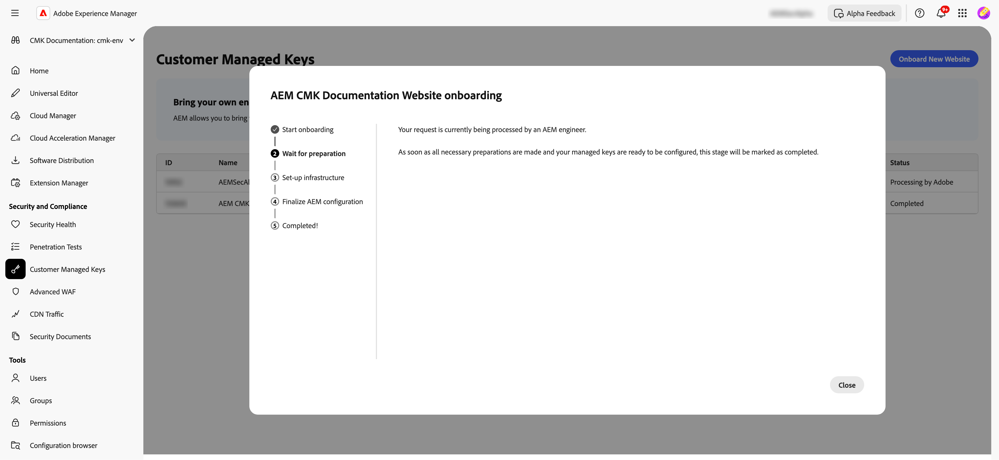
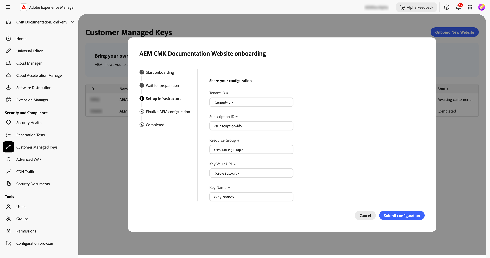

# Einrichten von kundenseitig verwalteten Schlüsseln für AEM as a Cloud Service {#customer-managed-keys-for-aem-as-a-cloud-service}

AEM as a Cloud Service speichert derzeit Kundendaten in Azure Blob Storage und MongoDB, wobei zur Datensicherung standardmäßig vom Anbieter verwaltete Verschlüsselungsschlüssel verwendet werden. Dieses Setup erfüllt zwar die Sicherheitsanforderungen vieler Organisationen, aber Unternehmen in regulierten Branchen oder Unternehmen, die eine verbesserte Datensicherheit benötigen, streben möglicherweise eine bessere Kontrolle über ihre Verschlüsselungsverfahren an. Für Unternehmen, die Datensicherheit, Compliance und die Möglichkeit priorisieren, ihre Verschlüsselungsschlüssel zu verwalten, bietet die CMK-Lösung (Customer-Managed Keys, kundenseitig verwaltete Schlüssel) eine wichtige Verbesserung.

## Das zu lösende Problem {#the-problem-being-solved}

Vom Anbieter verwaltete Schlüssel können zu Bedenken für Unternehmen führen, die zusätzliche Datenschutz- und Integritätsanforderungen stellen. Ohne Kontrolle über das Schlüssel-Management stehen Organisationen vor Herausforderungen bei der Einhaltung von Compliance-Anforderungen, der Implementierung benutzerdefinierter Sicherheitsrichtlinien und der Gewährleistung vollständiger Datensicherheit.

Durch die Einführung von kundenseitig verwalteten Schlüsseln (CMK) werden diese Bedenken behoben, da AEM-Kundschaft die volle Kontrolle über ihre Verschlüsselungsschlüssel erhält. Durch die Authentifizierung über die Microsoft Entra ID (ehemals Azure Active Directory) stellt AEM CS eine sichere Verbindung zu Azure Key Vault von Kundschaft her, sodass diese den Lebenszyklus ihrer Verschlüsselungsschlüssel verwalten kann, einschließlich Schlüsselerstellung, -rotation und -widerruf.

CMK bietet mehrere Vorteile:

* **Steuern der Daten- und Anwendungsverschlüsselung:** Erhöhen Sie die Sicherheit mit direkter Governance Ihrer AEM-Anwendung und kryptografischen Datenschlüsseln.
* **Erhöhen der Vertraulichkeit und Integrität:** Reduzieren Sie mit vollständiger Verschlüsselungsverwaltung die Wahrscheinlichkeit eines unbeabsichtigten Zugriffs und der Offenlegung sensibler oder proprietärer Daten.
* **Unterstützung von Azure Key Vault:** Die Verwendung von Azure Key Vault ermöglicht die Speicherung von Schlüsseln, die Verarbeitung von geheimen Daten und die Durchführung von Schlüsselrotationen.

Durch die Verwendung von CMK kann die Kundschaft die Kontrolle über ihre Datensicherheits- und Verschlüsselungsverfahren erhöhen, die Sicherheit verbessern und Risiken mindern, während sie gleichzeitig weiterhin von der Skalierbarkeit und Flexibilität von AEM CS profitiert.

Mit AEM as a Cloud Service können Sie Ihre eigenen Verschlüsselungsschlüssel für die Verschlüsselung von Daten im Ruhezustand mitbringen. In diesem Handbuch werden die Schritte zum Einrichten eines kundenseitig verwalteten Schlüssels (CMK) in Azure Key Vault für AEM as a Cloud Service beschrieben.

>[!WARNING]
>
>Nach dem Einrichten von CMK können Sie nicht zu systemseitig verwalteten Schlüsseln zurückkehren. Sie sind dafür verantwortlich, Ihre Schlüssel sicher zu verwalten und den Zugriff auf Ihre Key Vault-, Schlüssel- und CMK-App in Azure bereitzustellen, um zu verhindern, dass der Zugriff auf Ihre Daten verloren geht.

Außerdem werden Sie durch die folgenden Schritte zum Erstellen und Konfigurieren der erforderlichen Infrastruktur geführt:

1. Einrichten Ihrer Arbeitsumgebung
1. Erhalten einer Anwendungs-ID von Adobe
1. Erstellen einer neuen Ressourcengruppe
1. Schlüsseltresor erstellen
1. Adobe Zugriff auf den Schlüsseltresor gewähren
1. Erstellen eines Verschlüsselungsschlüssels

Sie müssen die Schlüsseltresor-URL, den Verschlüsselungsschlüsselnamen und Informationen über den Schlüsseltresor für Adobe freigeben.

## Einrichten der Umgebung {#setup-your-environment}

Einzige Voraussetzung, um den Anweisungen dieses Handbuchs folgen zu können, ist die Azure-Befehlszeilenschnittstelle (CLI). Wenn Sie die Azure-CLI noch nicht installiert haben, befolgen Sie die offiziellen Installationsanweisungen [hier](https://learn.microsoft.com/de-de/cli/azure/install-azure-cli).

Bevor Sie mit dem Rest dieses Handbuchs fortfahren, melden Sie sich mit `az login` bei Ihrer CLI an.

>[!NOTE]
>
>Obwohl dieses Handbuch die Azure-CLI verwendet, ist es möglich, dieselben Vorgänge über die Azure-Konsole auszuführen. Wenn Sie die Azure-Konsole bevorzugen, verwenden Sie die folgenden Befehle als Referenz.


## Starten des CMK-Konfigurationsprozesses für AEM as a Cloud Service {#request-cmk-for-aem-as-a-cloud-service}

Sie müssen die Konfiguration für kundenverwaltete Schlüssel (CMK) für Ihre AEM as a Cloud Service-Umgebung über die Benutzeroberfläche anfordern. Navigieren Sie dazu zur AEM Home Security-Benutzeroberfläche im Abschnitt **Kundenseitig verwaltete Schlüssel** .
Sie können dann den Onboarding-Prozess starten, indem Sie auf die Schaltfläche **Onboarding starten** klicken.


## Erhalten einer Anwendungs-ID von Adobe {#obtain-an-application-id-from-adobe}

Nach Beginn des Onboarding-Prozesses wird von Adobe eine Entra-Anwendungs-ID bereitgestellt. Diese Anwendungs-ID ist für den Rest des Handbuchs erforderlich und wird verwendet, um einen Service-Prinzipal zu erstellen, der Adobe den Zugriff auf Ihren Schlüsseltresor ermöglicht. Wenn Sie noch keine Anwendungs-ID haben, müssen Sie warten, bis sie von Adobe bereitgestellt wird.



Nachdem die Anfrage abgeschlossen ist, können Sie die Anwendungs-ID in der CMK-Benutzeroberfläche sehen.


## Erstellen einer neuen Ressourcengruppe {#create-a-new-resource-group}

Erstellen Sie eine neue Ressourcengruppe an einem Speicherort Ihrer Wahl.

```powershell
# Choose a location and a name for the resource group.
$location="<AZURE LOCATION>"
$resourceGroup="<RESOURCE GROUP>"

# Create the resource group.
az group create --location $location --resource-group $resourceGroup
```

Wenn Sie bereits über eine Ressourcengruppe verfügen, können Sie stattdessen diese verwenden. Im Rest dieses Handbuchs werden der Speicherort der Ressourcengruppe und ihr Name mit `$location` bzw. `$resourceGroup` bezeichnet.

## Erstellen eines Schlüsseltresors {#create-a-key-vault}

Sie müssen einen Schlüsseltresor erstellen, der Ihren Verschlüsselungsschlüssel enthält. Für den Schlüsseltresor muss der Bereinigungsschutz aktiviert sein. Der Bereinigungsschutz ist erforderlich, um Daten im Ruhezustand von anderen Azure-Services zu verschlüsseln. Der Zugriff auf das öffentliche Netzwerk muss aktiviert sein, damit die Adobe-Services auf den Schlüsseltresor zugreifen können.

>[!IMPORTANT]
>Wenn der Schlüsseltresor erstellt wird, während der Zugriff auf das öffentliche Netzwerk deaktiviert ist, wird erzwungen, dass alle Vorgänge im Zusammenhang mit dem Schlüsseltresor, wie Schlüsselerstellung oder -rotation, von einer Umgebung aus ausgeführt werden müssen, die Netzwerkzugriff auf den Schlüsseltresor hat – z. B. eine VM, die auf den Schlüsseltresor zugreifen kann.

```powershell
# Reuse this information from the previous step.
$location="<AZURE LOCATION>"
$resourceGroup="<RESOURCE GROUP>"

# Choose a name for the key vault.
$keyVaultName="<KEY VAULT NAME>"

# Create the key vault.
az keyvault create `
  --location $location `
  --resource-group $resourceGroup `
  --name $keyVaultName `
  --default-action=Allow `
  --enable-purge-protection `
  --enable-rbac-authorization `
  --public-network-access Enabled
```

## Gewähren des Zugriffs auf den Schlüsseltresor für Adobe {#grant-adobe-access-to-the-key-vault}

In diesem Schritt ermöglichen Sie Adobe den Zugriff auf Ihren Schlüsseltresor über eine Entra-Anwendung. Die ID der Entra-Anwendung sollte bereits von Adobe zur Verfügung gestellt worden sein.

Zunächst müssen Sie einen Service-Prinzipal erstellen, der an die Entra-Anwendung angehängt ist, und ihr die Rollen **Key Vault Reader** und **Key Vault Crypto User** zuweisen. Die Rollen sind auf den in diesem Handbuch erstellten Schlüsseltresor beschränkt.

```powershell
# Reuse this information from the previous steps.
$resourceGroup="<RESOURCE GROUP>"
$keyVaultName="<KEY VAULT NAME>"

# The application ID is provided by Adobe.
$appId="<APPLICATION ID>"

# Retrieve the ID of the key vault.
$keyVaultId=(az keyvault show --resource-group $resourceGroup --name $keyVaultName --query id --output tsv)

# Create a new service principal.
$servicePrincipalId=(az ad sp create --id $appId --query id --out tsv)

# Assign the roles to the service principal.
az role assignment create --assignee $servicePrincipalId --role "Key Vault Reader" --scope $keyVaultId
az role assignment create --assignee $servicePrincipalId --role "Key Vault Crypto User" --scope $keyVaultId
```

## Erstellen eines Verschlüsselungsschlüssels {#create-an-encryption-key}

Schließlich können Sie einen Verschlüsselungsschlüssel in Ihrem Schlüsseltresor erstellen. Bitte beachten Sie, dass Sie die Rolle **Schlüsseltresor-Crypto-Beauftragter** benötigen, um diesen Schritt abzuschließen. Wenn die angemeldete Benutzerin bzw. der angemeldete Benutzer nicht über diese Rolle verfügt, wenden Sie sich an den oder die Systemadmin, damit Ihnen diese Rolle zugewiesen wird, oder bitten Sie jemanden, der bereits über diese Rolle verfügt, diesen Schritt für Sie auszuführen.

Zum Erstellen des Verschlüsselungsschlüssels ist Netzwerkzugriff auf den Schlüsseltresor erforderlich. Stellen Sie zunächst sicher, dass Sie auf den Schlüsseltresor zugreifen können, und fahren Sie mit der Erstellung des Schlüssels fort:

```powershell
# Reuse this information from the previous steps.
$keyVaultName="<KEY VAULT NAME>"

# Choose a name for your key.
$keyName="<KEY NAME>"

# Create the key.
az keyvault key create --vault-name $keyVaultName --name $keyName
```

## Freigeben von Schlüsseltresorinformationen {#share-the-key-vault-information}

An dieser Stelle sind Sie bereit. Sie müssen nur einige erforderliche Informationen über die CMK-Benutzeroberfläche freigeben, wodurch der Konfigurationsprozess der Umgebung gestartet wird.

```powershell
# Reuse this information from the previous steps.
$resourceGroup="<RESOURCE GROUP>"
$keyVaultName="<KEY VAULT NAME>"

# Retrieve the URL of your key vault.
$keyVaultUri=(az keyvault show --name $keyVaultName `
    --resource-group $resourceGroup `
    --query properties.vaultUri `
    --output tsv)

# In addition we would need the tenantId and the subscriptionId in order to setup the connection.
$tenantId=(az keyvault show --name $keyVaultName `
    --resource-group $resourceGroup `
    --query properties.tenantId `
    --output tsv)
$subscriptionId="<Subscription ID>"
```

Geben Sie diese Informationen in der CMK-Benutzeroberfläche an:


## Auswirkungen eines Widerrufs des Schlüsselzugriffs {#implications-of-revoking-key-access}

Das Widerrufen oder Deaktivieren des Zugriffs auf die Key Vault-, Schlüssel- oder CMK-App kann zu erheblichen Störungen führen, darunter auch zu Änderungen an den Vorgängen Ihrer Plattform, die Probleme verursachen könnten. Sobald diese Schlüssel deaktiviert sind, kann es sein, dass Daten in Platform nicht mehr zugänglich sind, und nachgelagerte Vorgänge, die auf diese Daten angewiesen sind, funktionieren nicht mehr. Es ist wichtig, die nachgelagerten Auswirkungen vollständig zu verstehen, bevor Sie Änderungen an Ihren Schlüsselkonfigurationen vornehmen.

Wenn Sie sich entscheiden, den Platform-Zugriff auf Ihre Daten zu widerrufen, können Sie dies tun, indem Sie die mit der Anwendung verknüpfte Benutzerrolle aus dem Schlüsseltresor in Azure entfernen.

## Nächste Schritte {#next-steps}

Nachdem Sie die erforderlichen Informationen in der CMK-Benutzeroberfläche bereitgestellt haben, startet Adobe den Konfigurationsprozess für Ihre AEM as a Cloud Service-Umgebung. Dieser Vorgang kann einige Zeit in Anspruch nehmen, und Sie werden benachrichtigt, sobald er abgeschlossen ist.


## CMK-Setup abschließen {#complete-the-cmk-setup}

Sobald der Konfigurationsprozess abgeschlossen ist, können Sie den Status Ihrer CMK-Einrichtung in der Benutzeroberfläche sehen. Sie können auch den Schlüsseltresor und den Verschlüsselungsschlüssel sehen.


## Fragen und Support {#questions-and-support}

Wenden Sie sich an uns, wenn Sie Fragen haben oder Unterstützung beim Einrichten von kundenverwalteten Schlüsseln für AEM as a Cloud Service benötigen. Der Adobe-Support kann Ihnen bei allen Fragen behilflich sein.
