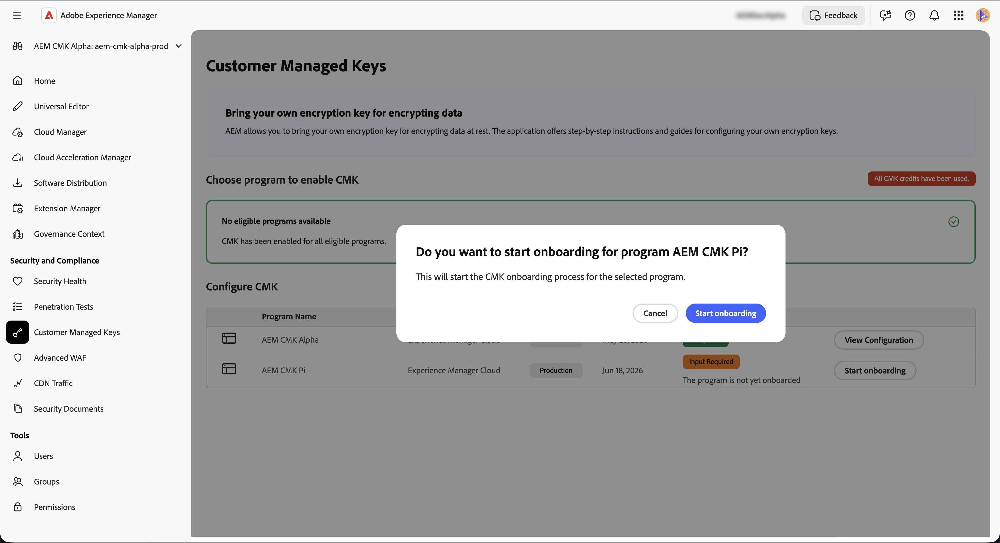
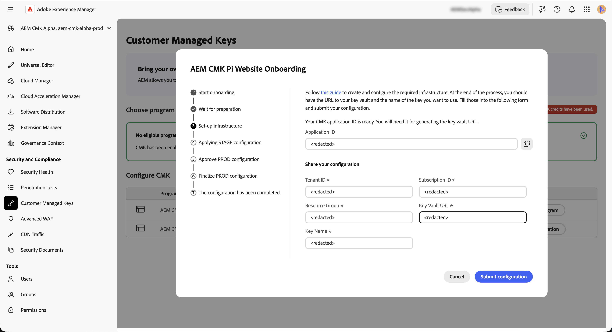
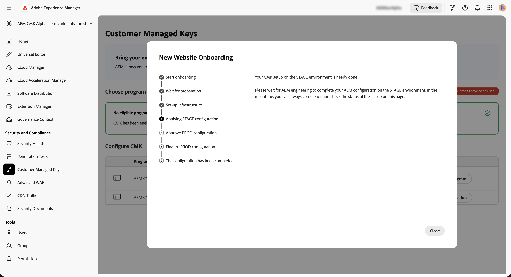
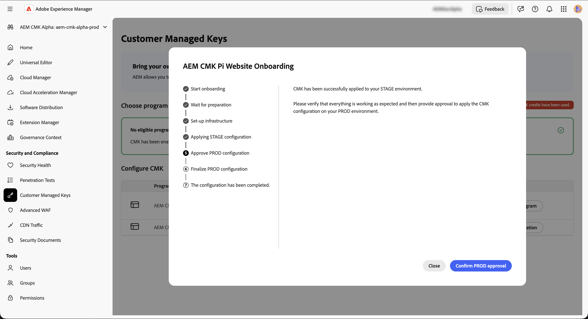

# Einrichten von kundenseitig verwalteten Schlüsseln für AEM as a Cloud Service {#customer-managed-keys-for-aem-as-a-cloud-service}

AEM as a Cloud Service speichert derzeit Kundendaten in Azure Blob Storage und MongoDB, wobei zur Datensicherung standardmäßig vom Anbieter verwaltete Verschlüsselungsschlüssel verwendet werden. Dieses Setup erfüllt zwar die Sicherheitsanforderungen vieler Unternehmen, aber Unternehmen in regulierten Branchen oder Unternehmen, die eine erhöhte Datensicherheit benötigen, wünschen sich eine bessere Kontrolle über ihre Verschlüsselungsverfahren. Für Unternehmen, die Datensicherheit, Compliance und die Möglichkeit priorisieren, ihre Verschlüsselungsschlüssel zu verwalten, bietet die CMK-Lösung (Customer-Managed Keys, kundenseitig verwaltete Schlüssel) eine wichtige Verbesserung.

>[!NOTE]
>
>Bevor Sie Ihren Azure-Schlüsseltresor konfigurieren, müssen Sie zunächst CMK für Ihr Cloud Service-Programm in Cloud Manager aktivieren. CMK wird während der Erstellung eines Produktionsprogramms oder **Bearbeitung eines vorhandenen Programms auf der Registerkarte** Sicherheit“ aktiviert.
>
>Siehe [Erstellen von Produktionsprogrammen](/help/implementing/cloud-manager/getting-access-to-aem-in-cloud/creating-production-programs.md) oder [Bearbeiten von &#x200B;](/help/implementing/cloud-manager/getting-access-to-aem-in-cloud/editing-programs.md).


## Zweck dieser Lösung {#the-problem-being-solved}

Vom Anbieter verwaltete Schlüssel können für Unternehmen, die zusätzliche Datenschutz- und Integritätsanforderungen stellen, zu Schwierigkeiten führen. Ohne Kontrolle über das Schlüssel-Management stehen Organisationen vor Herausforderungen bei der Einhaltung von Compliance-Anforderungen, der Implementierung benutzerdefinierter Sicherheitsrichtlinien und der Gewährleistung vollständiger Datensicherheit.

Durch die Einführung von kundenseitig verwalteten Schlüsseln (CMK) werden diese Bedenken behoben, da AEM-Kundschaft die volle Kontrolle über ihre Verschlüsselungsschlüssel erhält. Durch die Authentifizierung über die Microsoft Entra ID (ehemals Azure Active Directory) stellt AEM CS eine sichere Verbindung zum Azure-Schlüsseltresor des Kunden her, sodass dieser den Lebenszyklus seiner Verschlüsselungsschlüssel verwalten kann, einschließlich Schlüsselerstellung, -rotation und -widerruf.

CMK bietet mehrere Vorteile:

* **Verwalten von Daten- und Anwendungsverschlüsselung:** Erhöhen Sie die Sicherheit mit der direkten Governance Ihrer AEM-Anwendung und Ihrer kryptografischen Datenschlüssel.
* **Verbesserung der Vertraulichkeit und Integrität:** Verringern der Wahrscheinlichkeit von unbeabsichtigtem Zugriff und Offenlegung sensibler oder proprietärer Daten durch vollständiges Verschlüsselungsmanagement.
* **Azure Key Vault-Unterstützung:** Verwendung von Azure Key Vault ermöglicht die Speicherung von Schlüsseln, die Verarbeitung von geheimen Vorgängen und die Durchführung von Schlüsselrotationen.

Durch die Verwendung von CMK können Kunden die Kontrolle über ihre Datensicherheits- und Verschlüsselungsverfahren verbessern, die Sicherheit erhöhen und Risiken mindern, während die Skalierbarkeit und Flexibilität von AEM CS erhalten bleibt.

AEM as a Cloud Service ermöglicht die Verwendung eigener Verschlüsselungsschlüssel für die Verschlüsselung von Daten im Ruhezustand. In diesem Handbuch werden die Schritte zum Einrichten eines kundenverwalteten Schlüssels (CMK) in Azure Key Vault für AEM as a Cloud Service beschrieben.

>[!WARNING]
>
>Nach dem Einrichten von CMK können Sie nicht zu systemseitig verwalteten Schlüsseln zurückkehren. Sie sind dafür verantwortlich, Ihre Schlüssel sicher zu verwalten und den Zugriff auf Ihre Key Vault-, Schlüssel- und CMK-App in Azure bereitzustellen, um zu verhindern, dass der Zugriff auf Ihre Daten verloren geht.

Dieses Handbuch enthält die folgenden Schritte zum Erstellen und Konfigurieren der erforderlichen Infrastruktur:

1. Einrichten Ihrer Arbeitsumgebung
1. Erhalten einer Anwendungs-ID von Adobe
1. Erstellen einer neuen Ressourcengruppe
1. Erstellen eines Schlüsseltresors
1. Gewähren von Zugriff auf den Schlüsseltresor für Adobe
1. Erstellen eines Verschlüsselungsschlüssels

Sie müssen die Schlüsseltresor-URL, den Namen des Verschlüsselungsschlüssels und Informationen zum Schlüsseltresor für Adobe freigeben.

## Einrichten Ihrer Arbeitsumgebung {#setup-your-environment}

Einzige Voraussetzung, um den Anweisungen dieses Handbuchs folgen zu können, ist die Azure-Befehlszeilenschnittstelle (CLI). Wenn Sie die Azure-CLI noch nicht installiert haben, befolgen Sie die offiziellen Installationsanweisungen [hier](https://learn.microsoft.com/en-us/cli/azure/install-azure-cli?view=azure-cli-latest).

Bevor Sie mit dem Rest dieses Handbuchs fortfahren, melden Sie sich mit `az login` bei Ihrer CLI an.

>[!NOTE]
>
>Obwohl dieses Handbuch die Azure-CLI verwendet, ist es möglich, dieselben Vorgänge über die Azure-Konsole auszuführen. Wenn Sie die Azure-Konsole bevorzugen, verwenden Sie die folgenden Befehle als Referenz.


## Starten des CMK-Konfigurationsprozesses für AEM as a Cloud Service {#request-cmk-for-aem-as-a-cloud-service}

Sie müssen die Konfiguration für kundenverwaltete Schlüssel (CMK) für Ihre AEM as a Cloud Service-Umgebung über die Benutzeroberfläche anfordern. Navigieren Sie dazu zur AEM Home Security-Benutzeroberfläche im Abschnitt **Kundenseitig verwaltete Schlüssel** .
Sie können dann den Onboarding-Prozess starten, indem Sie auf die Schaltfläche **Onboarding starten** klicken.




## Erhalten einer Anwendungs-ID von Adobe {#obtain-an-application-id-from-adobe}

Nach dem Start des Onboarding-Prozesses stellt Adobe eine zusätzliche Anwendungs-ID bereit. Diese Anwendungs-ID ist für den Rest des Handbuchs erforderlich und erstellt einen Service-Prinzipal, der Adobe den Zugriff auf Ihren Schlüsseltresor ermöglicht. Wenn Sie noch keine Anwendungs-ID haben, warten Sie, bis Adobe sie bereitstellt.


Nachdem die Anfrage abgeschlossen ist, wird in der CMK-Benutzeroberfläche die Anwendungs-ID angezeigt.


## Erstellen einer neuen Ressourcengruppe {#create-a-new-resource-group}

Erstellen Sie eine neue Ressourcengruppe an einem Speicherort Ihrer Wahl.

```powershell
# Choose a location and a name for the resource group.
$location="<AZURE LOCATION>"
$resourceGroup="<RESOURCE GROUP>"

# Create the resource group.
az group create --location $location --resource-group $resourceGroup
```

Wenn Sie bereits über eine Ressourcengruppe verfügen, verwenden Sie diese stattdessen. Im Rest dieses Handbuchs werden der Speicherort der Ressourcengruppe und ihr Name mit `$location` bzw. `$resourceGroup` bezeichnet.

## Erstellen eines Schlüsseltresors {#create-a-key-vault}

Erstellen Sie einen Schlüsseltresor, der Ihren Verschlüsselungsschlüssel enthält. Für den Schlüsseltresor muss der Bereinigungsschutz aktiviert sein. Der Bereinigungsschutz ist erforderlich, um Daten im Ruhezustand von anderen Azure-Services zu verschlüsseln. Der Zugriff auf das öffentliche Netzwerk muss ebenfalls aktiviert sein, damit Adobe-Dienste auf den Schlüsseltresor zugreifen können.

>[!IMPORTANT]
>Um den öffentlichen Netzwerkzugriff für den Schlüsseltresor zu deaktivieren, müssen Vorgänge wie die Schlüsselerstellung oder -rotation in einer Umgebung mit Netzwerkzugriff auf den Schlüsseltresor ausgeführt werden. Beispiel: eine VM, die auf den Schlüsseltresor zugreifen kann.

```powershell
# Reuse this information from the previous step.
$location="<AZURE LOCATION>"
$resourceGroup="<RESOURCE GROUP>"

# Choose a name for the key vault.
$keyVaultName="<KEY VAULT NAME>"

# Create the key vault.
az keyvault create `
  --location $location `
  --resource-group $resourceGroup `
  --name $keyVaultName `
  --default-action=Allow `
  --enable-purge-protection `
  --enable-rbac-authorization `
  --public-network-access Enabled
```

## Gewähren von Zugriff auf den Schlüsseltresor für Adobe {#grant-adobe-access-to-the-key-vault}

In diesem Schritt ermöglichen Sie Adobe den Zugriff auf Ihren Schlüsseltresor über eine Entra-Anwendung. Adobe sollte bereits die ID der Entra-Anwendung angegeben haben.

Zunächst müssen Sie einen Service-Prinzipal erstellen, der an die Entra-Anwendung angehängt ist, und ihr die Rollen **Key Vault Reader** und **Key Vault Crypto User** zuweisen. Die Rollen sind auf den in diesem Handbuch erstellten Schlüsseltresor beschränkt.

```powershell
# Reuse this information from the previous steps.
$resourceGroup="<RESOURCE GROUP>"
$keyVaultName="<KEY VAULT NAME>"

# The application ID is provided by Adobe.
$appId="<APPLICATION ID>"

# Retrieve the ID of the key vault.
$keyVaultId=(az keyvault show --resource-group $resourceGroup --name $keyVaultName --query id --output tsv)

# Create a new service principal.
$servicePrincipalId=(az ad sp create --id $appId --query id --out tsv)

# Assign the roles to the service principal.
az role assignment create --assignee $servicePrincipalId --role "Key Vault Reader" --scope $keyVaultId
az role assignment create --assignee $servicePrincipalId --role "Key Vault Crypto User" --scope $keyVaultId
```

## Erstellen eines Verschlüsselungsschlüssels {#create-an-encryption-key}

Schließlich können Sie einen Verschlüsselungsschlüssel in Ihrem Schlüsseltresor erstellen. Sie benötigen die Rolle **Key Vault Crypto Officer** , um diesen Schritt abzuschließen. Um diese Rolle erhalten zu können, wenden Sie sich an Ihren Systemadministrator, wenn der angemeldete Benutzer nicht über diese Rolle verfügt. Bitten Sie alternativ eine Person, die bereits über diese Rolle verfügt, diesen Schritt für Sie abzuschließen.

Zum Erstellen des Verschlüsselungsschlüssels ist Netzwerkzugriff auf den Schlüsseltresor erforderlich. Stellen Sie zunächst sicher, dass Sie auf den Schlüsseltresor zugreifen können, und fahren Sie mit der Erstellung des Schlüssels fort:

```powershell
# Reuse this information from the previous steps.
$keyVaultName="<KEY VAULT NAME>"

# Choose a name for your key.
$keyName="<KEY NAME>"

# Create the key.
az keyvault key create --vault-name $keyVaultName --name $keyName
```

## Schlüsseltresorinformationen freigeben {#share-the-key-vault-information}

An dieser Stelle ist die Konfiguration abgeschlossen. Geben Sie die erforderlichen Informationen über die CMK-Benutzeroberfläche frei, über die der Prozess zur Umgebungskonfiguration gestartet wird.

```powershell
# Reuse this information from the previous steps.
$resourceGroup="<RESOURCE GROUP>"
$keyVaultName="<KEY VAULT NAME>"

# Retrieve the URL of your key vault.
$keyVaultUri=(az keyvault show --name $keyVaultName `
    --resource-group $resourceGroup `
    --query properties.vaultUri `
    --output tsv)

# In addition we would need the tenantId and the subscriptionId in order to setup the connection.
$tenantId=(az keyvault show --name $keyVaultName `
    --resource-group $resourceGroup `
    --query properties.tenantId `
    --output tsv)
$subscriptionId="<Subscription ID>"
```

Geben Sie diese Informationen in der CMK-Benutzeroberfläche an:


## Auswirkungen der Sperrung des Schlüsselzugriffs {#implications-of-revoking-key-access}

Das Widerrufen oder Deaktivieren des Zugriffs auf die Schlüsseltresor-, Schlüssel- oder CMK-App kann zu erheblichen Betriebsstörungen in Ihrer AEM as a Cloud Service-Umgebung führen. Sobald diese Schlüssel deaktiviert sind, können keine Daten mehr in AEM as a Cloud Service aufgerufen werden, und alle nachgelagerten Vorgänge, die auf diese Daten angewiesen sind, funktionieren nicht mehr. Es ist wichtig, die potenziellen Auswirkungen zu verstehen, bevor Sie Änderungen an Ihren wichtigsten Konfigurationen vornehmen.

Wenn Sie sich entscheiden, den Zugriff von AEM as a Cloud Service auf Ihre Daten zu sperren, können Sie dies tun, indem Sie die mit dem Programm verknüpfte Benutzerrolle aus dem Schlüsseltresor in Azure entfernen.

## Nächste Schritte {#next-steps}

Nachdem Sie die erforderlichen Informationen in der CMK-Benutzeroberfläche bereitgestellt haben, startet Adobe den Konfigurationsprozess für Ihre AEM as a Cloud Service-Umgebung. Dieser Vorgang erfordert Zeit, und Sie werden benachrichtigt, sobald er abgeschlossen ist.




## Abschließen der CMK-Einrichtung {#complete-the-cmk-setup}

Sobald der Konfigurationsprozess abgeschlossen ist, können Sie den Status Ihrer CMK-Einrichtung in der Benutzeroberfläche sehen. Sie können auch den Schlüsseltresor und den Verschlüsselungsschlüssel sehen.


## Fragen und Support {#questions-and-support}

Wenden Sie sich an Adobe, wenn Sie Fragen haben oder Hilfe bei der Einrichtung von kundenverwalteten Schlüsseln für AEM as a Cloud Service benötigen. Der Adobe-Support beantwortet alle Ihre Fragen.
