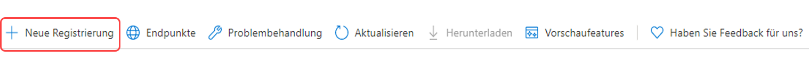

# OAuth2-Unterstützung für den E-Mail-Service {#oauth2-support-for-the-mail-service}

AEM as a Cloud Service bietet OAuth2-Unterstützung für seinen integrierten E-Mail-Service an, um Unternehmen die Einhaltung der E-Mail-Sicherheitsanforderungen zu ermöglichen.

Sie können OAuth für mehrere E-Mail-Anbieter konfigurieren. Im Folgenden finden Sie eine schrittweise Anleitung zum Konfigurieren des AEM-E-Mail-Service für die Authentifizierung über OAuth2 mit Microsoft® Office 365 Outlook. Andere Anbieter können auf ähnliche Weise konfiguriert werden.

Weitere Informationen zum AEM as a Cloud Service E-Mail-Service finden Sie unter [Senden von E-Mails](/help/implementing/developing/introduction/development-guidelines.md#sending-email).

## Microsoft® Outlook {#microsoft-outlook}

1. Gehen Sie zu [https://portal.azure.com/](https://portal.azure.com/) und melden Sie sich an.
1. Suchen Sie in der Suchleiste nach **Azure Active Directory** und klicken Sie auf das Ergebnis. Alternativ können Sie direkt zu [https://portal.azure.com/#blade/Microsoft_AAD_IAM/ActiveDirectoryMenuBlade/Overview](https://portal.azure.com/#blade/Microsoft_AAD_IAM/ActiveDirectoryMenuBlade/Overview) navigieren
1. Klicken Sie auf **App-Registrierung** > **Neue Registrierung**.

   

1. Füllen Sie die Informationen entsprechend Ihren Anforderungen aus und klicken Sie dann auf **Registrieren**.
1. Wechseln Sie zur erstellten Anwendung und wählen Sie **API-Berechtigungen** aus.
<!-- Alexandru: removing as a result of CQDOC-20609 
1. Click **Add Permission** > **Graph Permission** > **Delegated Permissions**. -->
1. Wählen Sie die folgenden Berechtigungen für Ihre Anwendung aus und klicken Sie dann auf **Berechtigung hinzufügen**:

   >[!NOTE]
   >
   >Die Konfiguration von Berechtigungen kann sich im Laufe der Zeit weiterentwickeln. Arbeiten Sie mit Microsoft® zusammen, wenn diese nicht erwartungsgemäß funktionieren.

   * `https://outlook.office.com/SMTP.Send`
   * `openid`
   * `offline_access`
   * `email`
   * `profile`
1. Gehen Sie zu **Authentifizierung** > **Plattform hinzufügen** > **Web** und fügen Sie im Abschnitt **URLs umleiten** die folgenden URLs hinzu – eine mit und eine ohne Schrägstrich:
   * `http://localhost/`
   * `http://localhost`
1. Klicken Sie auf **Konfigurieren**, nachdem Sie jede URL hinzugefügt und Ihre Einstellungen Ihren Anforderungen entsprechend konfiguriert haben.
1. Gehen Sie dann zu **Zertifikate und geheime Schlüssel**, klicken Sie auf **Neuer geheimer Client-Schlüssel** und folgen Sie den Anweisungen auf dem Bildschirm, um einen geheimen Schlüssel zu erstellen. Notieren Sie sich dieses Geheimnis für die spätere Verwendung.
1. Klicken Sie auf **Überblick** im linken Bereich und kopieren Sie die Werte für **Anwendungs-ID (Client)** und **Verzeichnis-ID (Mandant)** zur späteren Verwendung.

Zusammenfassend benötigen Sie die folgenden Informationen, um OAuth2 für den E-Mail-Service auf der AEM-Seite zu konfigurieren:

* Die Auth-URL, die mit der Mandanten-ID erstellt wird. Sie besitzt folgende Form: `https://login.microsoftonline.com/<tenantID>/oauth2/v2.0/authorize`
* Die Token-URL, die mit der Mandanten-ID erstellt wird. Sie besitzt folgende Form: `https://login.microsoftonline.com/<tenantID>/oauth2/v2.0/token`
* Die Aktualisierungs-URL, die mit der Mandanten-ID erstellt wird. Sie besitzt folgende Form: `https://login.microsoftonline.com/<tenantID>/oauth2/v2.0/token`
* Die Client-ID
* Das Client-Geheimnis

### Erzeugen des Aktualisierungstokens {#generating-the-refresh-token}

Generieren Sie anschließend in einem nachfolgenden Schritt das Aktualisierungs-Token, das Teil der OSGi-Konfiguration ist, indem Sie Folgendes ausführen:

1. Öffnen Sie die folgende URL im Browser, nachdem Sie `clientID` und `tenantID` durch die für Ihr Konto spezifischen Werte ersetzt haben:

   ```
   https://login.microsoftonline.com/%3ctenantID%3e/oauth2/v2.0/authorize?client_id=%3cclientId%3e&response_type=code&redirect_uri=http://localhost&response_mode=query&scope=https://outlook.office.com/SMTP.Send%20email%20openid%20profile%20offline_access&state=12345`
   ```

1. Wenn Sie gefragt werden, erlauben Sie die Berechtigung.
1. Die URL wird an einen neuen Ort umgeleitet. Sie wird in folgendem Format erstellt:

   ```
   http://localhost/?code=<code>&state=12345&session_state=4f984c6b-cc1f-47b9-81b2-66522ea83f81#`
   ```

1. Kopieren Sie den Wert von `<code>` aus dem obigen Beispiel.
1. Verwenden Sie den folgenden cURL-Befehl, um das refreshToken abzurufen. Ersetzen Sie tenantID, clientID und clientSecret durch die Werte für Ihr Konto und den Wert für `<code>`:

   ```
   curl --location --request POST 'https://login.microsoftonline.com/<tenantId>/oauth2/v2.0/token' \
   --header 'Content-Type: application/x-www-form-urlencoded' \
   --header 'Cookie: buid=0.ARgAep0nU49DzUGmoP2wnvyIkcQjsx26HEpOnvHS0akqXQgYAAA.AQABAAEAAAD--DLA3VO7QrddgJg7Wevry9XPJSKbGVlPt5NWYxLtTl3K1W0LwHXelrffApUo_K02kFrkvmGm94rfBT94t25Zq4bCd5IM3yFOjWb3V22yDM7-rl112sLzbBQBRCL3QAAgAA; esctx=AQABAAAAAAD--DLA3VO7QrddgJg7Wevr4a8wBjYcNbBXRievdTOd15caaeAsQdXeBAQA3tjVQaxmrOXFGkKaE7HBzsJrzA-ci4RRpor-opoo5gpGLh3pj_iMZuqegQPEb1V5sUVQV8_DUEbBv5YFV2eczS5EAhLBAwAd1mHx6jYOL8LwZNDFvd2-MhVXwPd6iKPigSuBxMogAA; x-ms-gateway-slice=estsfd; stsservicecookie=estsfd; fpc=Auv6lTuyAP1FuOOCfj9w0U_5vR5dAQAAALDXP9gOAAAAwIpkkQEAAACT2T_YDgAAAA' \
   --data-urlencode 'client_id=<clientID>' \
   --data-urlencode 'scope=https://outlook.office.com/SMTP.Send email openid profile offline_access' \
   --data-urlencode 'redirect_uri=http://localhost' \
   --data-urlencode 'grant_type=authorization_code' \
   --data-urlencode 'client_secret=<clientSecret>' \
   --data-urlencode 'code=<code>'
   ```

1. Notieren Sie sich die Werte für refreshToken und accessToken.

### Validieren der Tokens {#validating-the-tokens}

Bevor Sie mit der OAuth-Konfiguration auf der AEM-Seite fortfahren, überprüfen Sie mit dem folgenden Verfahren sowohl accessToken als auch refreshToken:

1. Generieren Sie das accessToken, indem Sie das im vorherigen Verfahren erzeugte refreshToken verwenden, wobei Sie die folgende cURL verwenden und die Werte für `<client_id>`, `<client_secret>` und `<refreshToken>` ersetzen:

   ```
   curl --location --request POST 'https://login.microsoftonline.com/<tenetId>/oauth2/v2.0/token' \
   --header 'Content-Type: application/x-www-form-urlencoded' \
   --header 'Cookie: buid=0.ARgAep0nU49DzUGmoP2wnvyIkcQjsx26HEpOnvHS0akqXQgYAAA.AQABAAEAAAD--DLA3VO7QrddgJg7Wevry9XPJSKbGVlPt5NWYxLtTl3K1W0LwHXelrffApUo_K02kFrkvmGm94rfBT94t25Zq4bCd5IM3yFOjWb3V22yDM7-rl112sLzbBQBRCL3QAAgAA; esctx=AQABAAAAAAD--DLA3VO7QrddgJg7Wevr4a8wBjYcNbBXRievdTOd15caaeAsQdXeBAQA3tjVQaxmrOXFGkKaE7HBzsJrzA-ci4RRpor-opoo5gpGLh3pj_iMZuqegQPEb1V5sUVQV8_DUEbBv5YFV2eczS5EAhLBAwAd1mHx6jYOL8LwZNDFvd2-MhVXwPd6iKPigSuBxMogAA; x-ms-gateway-slice=estsfd; stsservicecookie=estsfd; fpc=Auv6lTuyAP1FuOOCfj9w0U_IezHLAQAAAPeNSdgOAAAA' \
   --data-urlencode 'client_id=<client_id>' \
   --data-urlencode 'scope=https://outlook.office.com/SMTP.Send email openid profile offline_access' \
   --data-urlencode 'redirect_uri=http://localhost' \
   --data-urlencode 'grant_type=refresh_token' \
   --data-urlencode 'client_secret=<client_secret>' \
   --data-urlencode 'refresh_token=<refreshToken>'
   ```

1. Senden Sie eine E-Mail mit dem accessToken, damit Sie sehen können, ob es funktioniert.

>[!NOTE]
>
> Sie können die Postman-API-Sammlung von [diesem Speicherort](https://learn.microsoft.com/de-de/entra/identity-platform/v2-oauth2-auth-code-flow) abrufen.
>
> Weitere Informationen finden Sie in der [MSFT OAuth-Dokumentation](https://learn.microsoft.com/de-de/exchange/client-developer/legacy-protocols/how-to-authenticate-an-imap-pop-smtp-application-by-using-oauth).

### Integration mit AEM as a Cloud Service {#integration-with-aem-as-a-cloud-service}

1. Erstellen Sie eine OSGi-Eigenschaftendatei mit dem Namen `com.day.cq.mailer.oauth.impl.OAuthConfigurationProviderImpl.cfg.json` unter `/apps/<my-project>/osgiconfig/config` mit der folgenden Syntax:

   ```
   {
       authUrl: "<Authorization Url>",
       tokenUrl: "<Token Url>",
       clientId: "<clientID>",
       clientSecret: "$[secret:SECRET_SMTP_OAUTH_CLIENT_SECRET]",
       scopes: [
          "scope1",
          "scope2"
       ],
       authCodeRedirectUrl: "http://localhost",
       refreshUrl: "<Refresh token Url>",
       refreshToken: "$[secret:SECRET_SMTP_OAUTH_REFRESH_TOKEN]"
   }
   ```

1. Füllen Sie die Felder `authUrl`, `tokenUrl`, und `refreshURL` aus, indem Sie sie wie im vorherigen Abschnitt beschrieben erstellen.
1. Fügen Sie der Konfiguration die folgenden Umfänge hinzu:

   >[!NOTE]
   >
   >Der Umfang kann sich im Laufe der Zeit weiterentwickeln. Arbeiten Sie mit Microsoft® zusammen, wenn diese nicht erwartungsgemäß funktionieren.

   * `https://outlook.office.com/SMTP.Send`
   * `openid`
   * `offline_access`
   * `email`
   * `profile`
1. Erstellen Sie eine OSGi-Eigenschaftendatei mit dem Namen `called com.day.cq.mailer.DefaultMailService.cfg.json`
unter `/apps/<my-project>/osgiconfig/config` mit der folgenden Syntax: Die Werte `smtp.host` und `smtp.port` spiegeln die erweiterte Netzwerkkonfiguration wider, wie im Abschnitt [Tutorial zum E-Mail-Service](https://experienceleague.adobe.com/de/docs/experience-manager-learn/cloud-service/networking/examples/email-service) beschrieben.

   ```
   {
    "smtp.host": "$[env:AEM_PROXY_HOST;default=proxy.tunnel]",
    "smtp.user": "<user account that logged into get the oauth tokens>",
    "smtp.password": "value not used",
    "smtp.port": 30465,
    "from.address": "<from address used for sending>",
    "smtp.ssl": false,
    "smtp.starttls": true,
    "smtp.requiretls": true,
    "debug.email": false,
    "oauth.flow": true
   }
   ```

1. Für Outlook ist der `smtp.host`-Konfigurationswert `smtp.office365.com`.
1. Übergeben Sie zur Laufzeit die Geheimnisse `refreshToken values` und `clientSecret` mithilfe der [Cloud Manager-Variablen-API](/help/implementing/deploying/configuring-osgi.md#setting-values-via-api) oder indem Sie [Cloud Manager zum Hinzufügen von Variablen](/help/implementing/cloud-manager/environment-variables.md) verwenden. Die Werte für die Variablen `SECRET_SMTP_OAUTH_REFRESH_TOKEN` und `SECRET_SMTP_OAUTH_CLIENT_SECRET` sollten definiert werden.

### Fehlerbehebung {#troubleshooting}

Wenn der E-Mail-Service nicht ordnungsgemäß funktioniert, müssen Sie `refreshToken` wie oben beschrieben neu generieren und den neuen Wert über die Cloud Manager-API übergeben. Es dauert ein paar Minuten, bis der neue Wert bereitgestellt wird.
