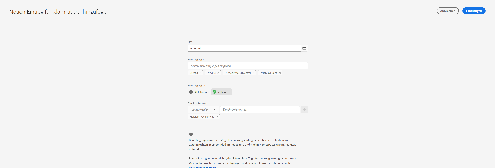

# Prinzipalansicht für die Berechtigungsverwaltung {#principal-view-for-permissions-management}

## Übersicht {#overview}

AEM führt die Berechtigungsverwaltung für Benutzende und Gruppen ein. Die Hauptfunktionalität bleibt mit der klassischen Benutzeroberfläche identisch, ist jedoch benutzerfreundlicher und effizienter.

## Zugriff auf die Benutzeroberfläche {#accessing-the-ui}

Die Berechtigungsverwaltung, die auf der neuen Benutzeroberfläche basiert, wird wie unten dargestellt unter „Sicherheit“ auf der Karte für Berechtigungen aufgerufen:

Die neue Ansicht erleichtert die Anzeige aller Berechtigungen und Einschränkungen für einen bestimmten Prinzipal auf allen Pfaden, auf denen Berechtigungen explizit gewährt wurden. Dadurch entfällt die Notwendigkeit,

CRXDE zum Verwalten erweiterter Berechtigungen und Einschränkungen zu verwenden. Er wurde in derselben Ansicht konsolidiert.

Es gibt einen Filter, mit dem die Art der Prinzipale ausgewählt werden kann, um **Benutzende**, **Gruppen** oder **Alle** anzuzeigen und nach jedem Prinzipal zu suchen **.**

## Anzeigen von Berechtigungen für einen Prinzipal {#viewing-permissions-for-a-principal}

Im linken Rahmen können Benutzende nach unten scrollen, um einen Prinzipal zu finden oder basierend auf dem ausgewählten Filter nach einer Gruppe oder einer Einzelperson zu suchen:

Wenn Sie auf den Namen klicken, werden die zugewiesenen Berechtigungen auf der rechten Seite angezeigt. Der Berechtigungsbereich zeigt die Liste der Zugriffssteuerungseinträge für bestimmte Pfade sowie konfigurierte Einschränkungen an.

## Hinzufügen eines neuen Zugriffssteuerungseintrags (Access Control Entry, ACE) für einen Prinzipal {#adding-new-access-control-entry-for-a-principal}

Neue Berechtigungen können durch Hinzufügen eines Zugriffssteuerungseintrags hinzugefügt werden. Klicken Sie einfach auf die Schaltfläche zum Hinzufügen eines Zugriffssteuerungseintrags.

Dadurch wird das unten dargestellte Fenster angezeigt. Der nächste Schritt besteht in der Auswahl eines Pfades, in dem die Berechtigung konfiguriert werden muss.

Hier wird ein Pfad ausgewählt, in dem Sie eine Berechtigung für **dam-users** konfigurieren können:

Nachdem der Pfad ausgewählt wurde, wechselt der Workflow zurück zu diesem Bildschirm, wobei der Benutzer dann eine oder mehrere Berechtigungen aus den verfügbaren Namespaces (z. B. `jcr`, `rep` oder `crx`) auswählen kann, wie weiter unten dargestellt.

Berechtigungen können hinzugefügt werden, indem Sie mithilfe des Textfelds suchen und dann aus der Liste auswählen.

>[!NOTE]
>
>Eine vollständige Liste der Berechtigungen und Beschreibungen finden Sie unter [Verwaltung von Benutzenden, Gruppen und Zugriffsrechten](https://experienceleague.adobe.com/de/docs/experience-manager-65/content/security/user-group-ac-admin#access-right-management).

 

Nachdem die Liste der Berechtigungen ausgewählt wurde, lässt sich der Berechtigungstyp auswählen: „Ablehnen“ oder „Zulassen“, wie unten dargestellt.

 

## Verwenden von Einschränkungen {#using-restrictions}

Zusätzlich zur Liste der Berechtigungen und dem Berechtigungstyp für einen bestimmten Pfad können auf diesem Bildschirm auch Einschränkungen für fein abgestufte Zugriffssteuerungsmöglichkeiten hinzugefügt werden:

>[!NOTE]
>
>Weitere Informationen zu den einzelnen Beschränkungen finden Sie in der [Jackrabbit Oak-Dokumentation](https://jackrabbit.apache.org/oak/docs/security/authorization/restriction.html).

Einschränkungen können wie unten dargestellt hinzugefügt werden, indem Sie den Einschränkungstyp auswählen, den Wert eingeben und auf das **+**-Symbol klicken.

 

Der neue ACE wird in der Zugriffssteuerungsliste wie unten dargestellt angezeigt. Beachten Sie, dass `jcr:write` eine aggregierte Berechtigung ist, die `jcr:removeNode` enthält. Diese Berechtigung wurde oben hinzugefügt, wird aber unten nicht angezeigt, da sie unter `jcr:write` aufgeführt wird.

## Bearbeiten von ACEs {#editing-aces}

Zugriffssteuerungseinträge können bearbeitet werden, indem Sie einen Prinzipal auswählen und dann den zu bearbeitenden ACE.

Hier können Sie beispielsweise den unten stehenden Eintrag für **dam-users** bearbeiten, indem Sie auf das Stiftsymbol rechts klicken:

Der Bearbeitungsbildschirm wird mit vorausgewählten konfigurierten ACEs-Voreinstellungen angezeigt. Diese können gelöscht werden, indem Sie auf das Kreuzsymbol neben ihnen klicken. Sie können auch neue Berechtigungen für den angegebenen Pfad hinzufügen, wie unten dargestellt.

Hier wird die Berechtigung `addChildNodes` für **dam-users** auf dem bestimmten Pfad hinzugefügt.

Änderungen können gespeichert werden, indem Sie oben rechts auf die Schaltfläche **Speichern** klicken. Die geänderten Berechtigungen für **dam-users** werden wie unten dargestellt übernommen:

## Löschen von ACEs {#deleting-aces}

Zugriffssteuerungseinträge können gelöscht werden, um alle Berechtigungen zu entfernen, die einem Prinzipal für einen bestimmten Pfad erteilt wurden. Das X-Symbol neben dem ACE kann wie unten gezeigt zum Löschen verwendet werden:

 

## Berechtigungsansicht {#permissions-view}

### Berechtigungsansicht für Touch-optimierte Benutzeroberfläche {#touch-ui-permisions-view}

Admins benötigen eine granularere Kontrolle und Einsicht in die Berechtigungszuweisungen auf Knotenebene, um die Sicherheit und Verwaltung in AEM zu verbessern. Zuvor war nur eine prinzipalbasierte Ansicht der Berechtigungen verfügbar, wodurch die Möglichkeit eingeschränkt wurde zu sehen, wie ACLs auf bestimmte Knoten oder gefilterte Ansichten angewendet werden. Der neue Knoten und die gefilterte Ansicht bieten eine detaillierte und kontextualisierte Perspektive auf Berechtigungszuweisungen, die eine bessere Verwaltung und Prüfung von Sicherheitskonfigurationen ermöglicht. Diese Funktion verbessert die administrative Aufsicht und vereinfacht die Berechtigungsverwaltung, verbessert die Sicherheit, reduziert Fehlkonfigurationen und optimiert die Benutzerzugriffssteuerung in AEM.

Sie können auf die Ansicht der Touch-optimierten Benutzeroberfläche für Berechtigungen zugreifen, indem Sie auf **Tools - Sicherheit - Berechtigungen** klicken, wie unten dargestellt:

Sobald Sie die Berechtigungsansicht gestartet haben, können Sie je nach Ihren bevorzugten Anzeigeoptionen in **&#x200B;**&#x200B;oberen rechten Ecke **Knotenansicht“ oder** Gefilterte Ansicht“ klicken.

#### Knotenansicht

In dieser Ansicht werden ACLs für jeden einzelnen Knoten (Pfad) angezeigt. Es enthält Informationen zu folgenden Themen:

Lokale ACLs für den ausgewählten Knoten.
Effektive ACLs, einschließlich ACLs, die auf jeden übergeordneten Knoten bis zum Stamm (/) angewendet werden.
Benutzende haben die Möglichkeit, ACLs hinzuzufügen, zu entfernen oder zu aktualisieren. Wenn auf einen Pfad geklickt wird, werden im linken Bereich die untergeordneten Elemente angezeigt, während auf der rechten Seite eine Tabellenansicht aller mit diesem Pfad verknüpften ACLs angezeigt wird.

#### Gefilterte Ansicht

In dieser Ansicht können Benutzer effizient nach Berechtigungen für einen angegebenen Pfad und Prinzipale suchen. In dieser Ansicht können Benutzende den Typ der Berechtigungen, die einer Gruppe von Prinzipalen für den ausgewählten Pfad gewährt werden, einfach bestimmen.
Darüber hinaus bietet die gefilterte Ansicht Einblicke in effektive ACLs. Es werden die mit dem übergeordneten Knoten des ausgewählten Pfads verknüpften ACLs angezeigt, wobei der ausgewählte Prinzipal und alle allgemeinen Prinzipale berücksichtigt werden.

### Die Repository-Browser-Berechtigungsansicht {#the-repository-browser-permissions-view}

Der Zugriff auf die Berechtigungsansicht ist auch über den [Repository-Browser](/help/implementing/developing/tools/repository-browser.md) möglich.

Sie können wie folgt darauf zugreifen:

1. Öffnen Sie die Entwicklerkonsole, klicken Sie auf die Registerkarte **Repository-**) und dann auf **Repository-Browser öffnen**

   

1. Klicken Sie im Repository-Browser auf die Registerkarte **Berechtigungen** .

   

**Hinweis**: Zum Anzeigen der Berechtigungen sind Administratorrechte erforderlich. Führen Sie die hier [ Schritte aus](/help/implementing/developing/tools/repository-browser.md#navigate-the-hierarchy-navigate-the-hierarchy) um auf die Berechtigungen zuzugreifen.

## Berechtigungskombinationen in der klassischen Benutzeroberfläche {#classic-ui-privilege-combinations}

In der neuen Benutzeroberfläche für Berechtigungen wird explizit der grundlegende Satz von Berechtigungen, anstelle vordefinierter Kombinationen verwendet, die nicht immer exakt die gewährten Berechtigungen wiedergegeben.

Das führte in der Vergangenheit zu Unklarheit, was genau konfiguriert wird. In der folgenden Tabelle finden Sie die Zuordnung zwischen den Berechtigungskombinationen aus der klassischen Benutzeroberfläche und den tatsächlichen Berechtigungen, aus denen sie bestehen:

<table>
 <tbody>
  <tr>
   <th>Berechtigungskombinationen in der klassischen Benutzeroberfläche</th>
   <th>Berechtigungen der Berechtigungs-Benutzeroberfläche</th>
  </tr>
  <tr>
   <td>Lesen</td>
   <td><code>jcr:read</code></td>
  </tr>
  <tr>
   <td>Ändern</td>
   <td>
<code>jcr:modifyProperties</code>
 
<code>jcr:lockManagement</code>
 
<code>jcr:versionManagement</code>
 </td>
  </tr>
  <tr>
   <td>Erstellen</td>
   <td>
<code>jcr:addChildNodes</code>
 
<code>jcr:nodeTypeManagement</code>
 </td>
  </tr>
  <tr>
   <td>Löschen</td>
   <td>
<code>jcr:removeNode</code>
 
<code>jcr:removeChildNodes</code>
 </td>
  </tr>
  <tr>
   <td>ACL lesen</td>
   <td><code>jcr:readAccessControl</code></td>
  </tr>
  <tr>
   <td>ACL bearbeiten</td>
   <td><code>jcr:modifyAccessControl</code></td>
  </tr>
  <tr>
   <td>Replizieren</td>
   <td><code>crx:replicate</code></td>
  </tr>
 </tbody>
</table>
