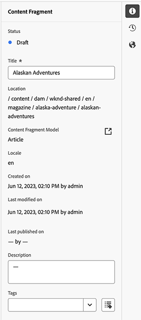
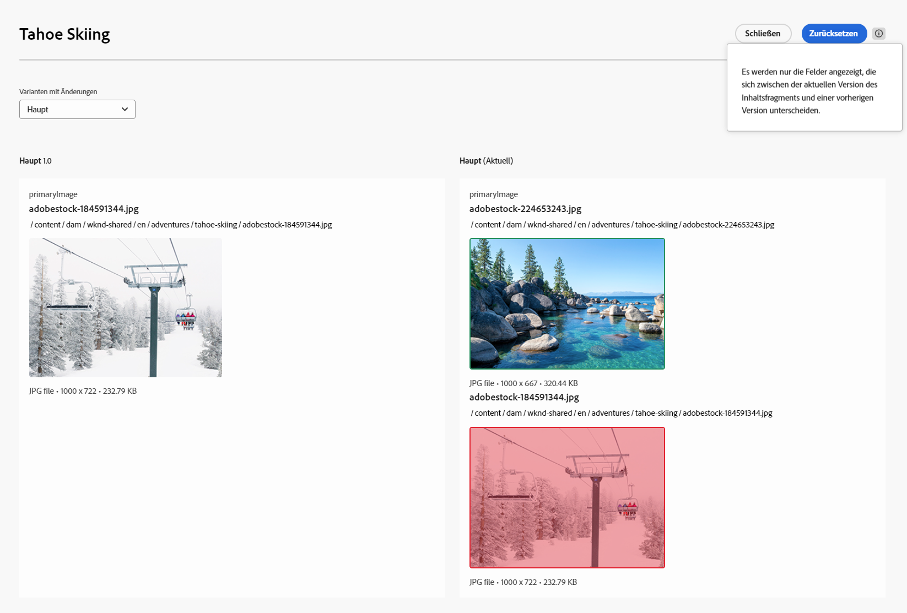
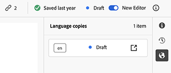
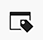

# Erstellen von Inhaltsfragmenten {#authoring-content-fragments}

Die Erstellung von Inhaltsfragmenten konzentriert sich sowohl auf die Headless-Bereitstellung als auch auf die Seitenbearbeitung.

Es gibt zwei Editoren für Inhaltsfragmente. Der Editor, der in diesem Abschnitt beschrieben wird:

* wurde für die Bereitstellung von Headless-Inhalten entwickelt (obwohl er für alle Szenarien verwendet werden kann)
* ist über die **Inhaltsfragmentkonsole** verfügbar

Dieser Editor bietet Folgendes:

* [Automatisches Speichern](#saving-autosaving) zur Vermeidung von versehentlichen Verlusten von Bearbeitungen.
* [Online-Upload von Assets als Inhaltsverweise](#reference-images), ohne sie zuerst in Asset DAM hochladen zu müssen.
* [Generieren von Varianten](#generate-variations-ai): Zur Verwendung der generativen KI, um die Inhaltserstellung auf der Grundlage von Prompts zu beschleunigen.
* [Vorschau](#preview-content-fragment) des vom Inhaltsfragment bereitgestellten gerenderten Erlebnisses.
* Fähigkeit zum [Veröffentlichen](#publish-content-fragment) und [Aufheben der Veröffentlichung](#unpublish-content-fragment) über den Editor.
* Fähigkeit zum [Anzeigen und Öffnen zugehöriger Sprachkopien](#view-language-copies) im Editor.
* Fähigkeit zum [Anzeigen von Versionsdetails](#view-version-history) im Editor. Sie können auch eine ausgewählte Version wiederherstellen.
* Fähigkeit zum [Anzeigen und Öffnen von übergeordneten Verweisen](#view-parent-references).
* Eine hierarchische Ansicht des Inhaltsfragments und seiner Verweise mithilfe der [Baumstruktur](#structure-tree).

>[!WARNING]
>
>Der in diesem Abschnitt beschriebene Editor ist *nur* in der [Unified Shell](/help/overview/aem-cloud-service-on-unified-shell.md) verfügbar, also *online* in Adobe Experience Manager (AEM) as a Cloud Service, aber nicht in einer lokalen Instanz.

## Inhaltsfragment-Editor {#content-fragment-editor}

Beim ersten Öffnen des Inhaltsfragmenteditors werden vier Hauptbereiche angezeigt:

* obere Symbolleiste: für wichtige Informationen und Aktionen
   * ein Link zur Inhaltsfragmentkonsole (Startseiten-Symbol)
   * Informationen zum Modell und Ordner
   * Links zur [Vorschau (wenn das URL-Standardmuster für die Vorschau für das Modell konfiguriert ist)](/help/sites-cloud/administering/content-fragments/managing-content-fragment-models.md#model-properties)
   * die Aktionen [Veröffentlichen](#publish-content-fragment) und [Veröffentlichung aufheben](#unpublish-content-fragment)
   * eine Option zum Anzeigen aller **übergeordneten Verweise** (Verknüpfungssymbol)
   * der **[Status](/help/sites-cloud/administering/content-fragments/managing.md#statuses-content-fragments)** des Fragments und Informationen über die letzte Speicherung
   * ein Umschalter zum Umschalten auf den ursprünglichen (Assets-basierten) Editor

     >[!WARNING]
     >
     >Der ursprüngliche Editor wird auf derselben Registerkarte geöffnet. Es wird nicht empfohlen, beide Editoren gleichzeitig geöffnet zu haben.

* linker Bereich: zeigt die **[Varianten](#variations)** für das Inhaltsfragment und dessen **Felder** an:
   * diese Links können verwendet werden, um [in der Inhaltsfragmentstruktur zu navigieren](#navigate-structure)
* rechter Bereich: enthält Registerkarten [mit den Eigenschaften (Metadaten) und Tags](#view-properties-tags), Informationen über den [Versionsverlauf](#view-version-history) sowie Informationen zu [Sprachkopien](#view-language-copies)
   * auf der Registerkarte **Eigenschaften** können Sie den **Titel** und die **Beschreibung** für das Fragment oder die **Variante** aktualisieren
   * Auf der Registerkarte **Kommentare** können Sie Kommentare hinzufügen und lesen und so einfacher mit anderen Autorinnen und Autoren zusammenarbeiten
* zentraler Bereich: zeigt die tatsächlichen Felder und den Inhalt der ausgewählten Variante an
   * ermöglicht das Bearbeiten des Inhalts
      * wenn im Modell (als mehrfach) konfiguriert, ermöglichen verschiedene Datentypen das **Hinzufügen** von Instanzen des relevanten Feldes
   * wenn **Registerkartenplatzhalter**-Felder innerhalb des Modells definiert sind, werden sie hier angezeigt und:
      * können für die Navigation verwendet werden
      * werden entweder horizontal oder als Dropdown-Liste angezeigt

  >[!NOTE]
  >
  >Abhängig von den Definitionen im zugrunde liegenden Modell können Felder bestimmten Arten von [Validierung](/help/assets/content-fragments/content-fragments-models.md#validation) unterliegen.

## In der Inhaltsfragmentstruktur navigieren {#navigate-structure}

Ein einzelnes Inhaltsfragment;

* Besteht aus zwei Ebenen:

   * **[Varianten](#variations)** des Inhaltsfragments
   * **Felder** – vom Inhaltsfragmentmodell definiert und von jeder Variante verwendet

* Kann eine Reihe von Verweisen enthalten.

### Varianten und Felder {#variations-and-fields}

Im linken Bereich können Sie Folgendes sehen:

* die Liste der **[Varianten](#variations)**, die für dieses Fragment erstellt wurden:
   * **Haupt** ist die Variante, die beim ersten Erstellen des Inhaltsfragments vorhanden ist. Sie können später weitere hinzufügen
   * Sie können mit der Funktion „Varianten generieren“ (#generate-variations) eine auf Prompts basierende Vorlage verwenden, die Adobe für einen bestimmten Anwendungsfall erstellt hat.
   * Sie können auch [eine Variante erstellen](#create-variation)
* die **Felder** innerhalb des Fragments und dessen Varianten:
   * das Symbol zeigt den [Datentyp](/help/sites-cloud/administering/content-fragments/content-fragment-models.md#data-types) an
   * der Text ist der Feldname
   * diese stellen gemeinsam einen direkten Link zum Feldinhalt im zentralen Bereich bereit (für die aktuelle Variante)

### Links folgen {#follow-links}

Das Link-Symbol wird in verschiedenen Bereichen des Editors angezeigt. Dieses Symbol kann verwendet werden, um das angezeigte Element zu öffnen, z. B. ein Inhaltsfragmentmodell, einen übergeordneten Verweis oder ein Fragment, auf das verwiesen wird:

### Strukturbaum {#structure-tree}

Öffnen Sie die Registerkarte **Baumstruktur** über die Editor-Symbolleiste, um die hierarchische Struktur des Inhaltsfragments und dessen Verweise anzuzeigen. Verwenden Sie die Link-Symbole, um zu den Verweisen zu navigieren.

>[!NOTE]
>
>Siehe [Analysieren der Struktur von Inhaltsfragmenten – Baumstruktur](/help/sites-cloud/administering/content-fragments/analysis.md#structure-tree) für weitere Details.

## Speichern und automatisches Speichern {#saving-autosaving}

<!-- CHECK: cannot be saved, no undo, redo -->

Das Inhaltsfragment wird bei jeder von Ihnen vorgenommenen Aktualisierung automatisch gespeichert. Die Zeit der letzten Speicherung wird in der oberen Symbolleiste angezeigt.

## Varianten {#variations}

[Varianten](/help/sites-cloud/administering/content-fragments/overview.md#main-and-variations) sind eine wichtige Funktion von AEM-Inhaltsfragmenten. Sie können damit Kopien des **Haupt-Inhalts** erstellen und bearbeiten, um sie in bestimmten Kanälen und Szenarien zu verwenden. Dadurch wird die Bereitstellung von Headless-Inhalten und die Seitenbearbeitung noch flexibler.

Über den Editor haben Sie folgende Möglichkeiten:

* [Erstellen von Varianten](#create-variation) des **Haupt-Inhalts**

* [Unter Verwendung der Funktion „Varianten generieren“ ](#generate-variations-ai) können Sie eine auf Prompts basierende Vorlage verwenden, die Adobe für einen bestimmten Anwendungsfall erstellt hat.

* Die erforderliche Variante zum Bearbeiten des Inhalts auswählen

* [Variante umbenennen](#rename-variation)

* [Löschen einer Variante](#delete-variation)

### Variante erstellen {#create-variation}

So erstellen Sie eine Variante Ihres Inhaltsfragments:

1. Wählen Sie im linken Bereich das **Pluszeichen** (**Variante erstellen**), das sich rechts von **Varianten** befindet.

   >[!NOTE]
   >
   >Nach der Erstellung Ihrer ersten Variante werden vorhandene Varianten im selben Bereich aufgelistet.

   

1. Geben Sie im Dialogfeld einen **Titel** für Ihre Variante und, wenn gewünscht, eine **Beschreibung** ein:

   

1. **Erstellen** Sie die Variante. Sie wird in der Liste angezeigt.

### Umbenennen einer Variante {#rename-variation}

So benennen Sie eine **Variante** um:

1. Wählen Sie die gewünschte Variante aus.

1. Öffnen Sie die Registerkarte **Eigenschaften** im rechten Bereich.

1. Aktualisieren Sie den **Titel** der Variante.

1. Drücken Sie entweder auf die **Return-Taste** oder wechseln Sie in ein anderes Feld, um die Änderung automatisch zu speichern. Der Titel wird im Bereich **Varianten** auf der linken Seite aktualisiert.

### Erstellen von Varianten mit GenAI durch Variantengenerierung {#generate-variations-ai}

Verwenden Sie generative Varianten, um die generative KI zu nutzen und so die Inhaltserstellung zu beschleunigen.

Öffnen Sie den Inhaltsfragmenteditor. Dort finden Sie den Einstiegspunkt zur Variantengenerierung:

Weitere Informationen finden Sie unter [Varianten generieren – in AEM-Editoren integriert](/help/generative-ai/generate-variations-integrated-editor.md).

### Löschen einer Variante {#delete-variation}

So löschen Sie eine Variante Ihres Inhaltsfragments:

    >[!HINWEIS]
    >
    >Sie können die **Hauptversion** nicht löschen.

1. Wählen Sie die Variante aus.

1. Wählen Sie im Bereich **Variante** das Symbol „Löschen“ (Papierkorb) aus:

   

1. Ein Dialogfeld wird geöffnet. Wählen Sie **Löschen** aus, um die Aktion zu bestätigen.

## Bearbeiten mehrzeiliger Textfelder – Nur-Text oder Markdown {#edit-multi-line-text-fields-plaintext-markdown}

**[Mehrzeilige Textfelder](/help/sites-cloud/administering/content-fragments/content-fragment-models.md#data-types)** können eines von drei Formaten aufweisen:

* Nur Text
* [Markdown](/help/sites-cloud/administering/content-fragments/markdown.md)
* [Rich-Text](#edit-multi-line-text-fields-rich-text)

Bei Feldern, die als Nur-Text- oder Markdown-Felder definiert sind, handelt es sich um einfache Textfelder ohne Formatierungsoptionen (auf dem Bildschirm):

## Bearbeiten mehrzeiliger Textfelder – Rich-Text {#edit-multi-line-text-fields-rich-text}

Für Felder mit **[mehrzeiligem Text](/help/sites-cloud/administering/content-fragments/content-fragment-models.md#data-types)**, die als **Rich-Text** definiert sind, stehen verschiedene Funktionen zur Verfügung:

* Den Inhalt bearbeiten:
   * Rückgängig/Wiederholen
   * Als Text einfügen/einfügen
   * Kopieren
   * Absatzformat auswählen
   * Tabelle erstellen/verwalten
   * Text formatieren; fett, kursiv, unterstrichen, Farbe
   * Absatzausrichtung festlegen
   * Listen erstellen/verwalten, mit Aufzählungszeichen, mit Nummerierung
   * Texteinzug; verringern, erhöhen
   * Aktuelle Formatierung löschen
   * Links einfügen
   * Verweise auf Bild-Assets auswählen und einfügen
   * Sonderzeichen hinzufügen
* [Vollbild-Editor](#full-screen-editor-rich-text) – Zwischen Vollbild und Textfluss umschalten
* [Statistiken](#statistics-rich-text)
* [Vergleichen und Synchronisieren](#compare-and-synchronize-rich-text)

Zum Beispiel:

>[!NOTE]
>
>Mehrzeilige Textfelder werden auch durch das entsprechende [Symbol](#fields-datatypes-icons) im Bereich **Felder** angezeigt.

### Vollbild-Editor – Rich-Text {#full-screen-editor-rich-text}

Der Vollbild-Editor bietet dieselben Bearbeitungsoptionen wie im Textfluss, lässt jedoch mehr Platz für den Text.

Zum Beispiel:

### Statistiken – Rich-Text {#statistics-rich-text}

Die Aktion **Statistik** zeigt eine Reihe von Informationen über den Text in einem mehrzeiligen Feld an.

Zum Beispiel:

### Vergleichen und Synchronisieren – Rich-Text {#compare-and-synchronize-rich-text}

Die Aktion **Vergleichen** ist für mehrzeilige Felder verfügbar, wenn eine **Variante** geöffnet ist.

Dadurch wird das mehrzeilige Feld im Vollbild geöffnet und:

* es wird der Inhalt für die **Hauptvariante** und die aktuelle **Variante** parallel angezeigt, wobei alle Unterschiede hervorgehoben werden.

* Unterschiede sind farblich gekennzeichnet:

   * Grün zeigt an, dass der Inhalt (zur Variante) hinzugefügt wurde
   * Rot zeigt an, dass Inhalt entfernt wurde (aus der Variante)
   * Blau zeigt an, dass Text ersetzt wurde

* stellt die Aktion **Synchronisieren** zur Verfügung, die den Inhalt der **Hauptvariante** mit der aktuellen Variante synchronisiert

   * wenn die **Hauptvariante** aktualisiert wurde, werden diese Änderungen in die Variante übertragen
   * wenn die Variante aktualisiert wurde, werden diese Änderungen mit dem Inhalt der **Hauptvariante** überschrieben

  >[!CAUTION]
  >
  >Die Synchronisierung ist nur verfügbar, um Änderungen *von der **Hauptvariante**in die Variante* zu kopieren.
  >
  >Es ist nicht möglich, Änderungen *von einer Variante auf die **Hauptvariante*** zu übertragen.

Beispiel: ein Szenario, in dem der Varianteninhalt vollständig umgeschrieben wurde, sodass eine Synchronisierung diesen neuen Inhalt durch den Inhalt aus der **Hauptvariante** ersetzt:

## Verweise verwalten {#manage-references}

### Fragmentreferenzen {#fragment-references}

[Fragmentreferenzen](/help/sites-cloud/administering/content-fragments/content-fragment-models.md#fragment-reference-nested-fragments) können für Folgendes verwendet werden:

* [einen Verweis auf ein vorhandenes Inhaltsfragment erstellen](#create-reference-existing-content-fragment)
* [ein Inhaltsfragment erstellen und dann darauf verweisen](#create-reference-content-fragment)

#### einen Verweis auf ein vorhandenes Inhaltsfragment erstellen {#create-reference-existing-content-fragment}

So erstellen Sie einen Verweis auf ein vorhandenes Inhaltsfragment:

1. Wählen Sie das Feld aus.
1. Wählen Sie **Vorhandenes Fragment hinzufügen** aus.
1. Wählen Sie das erforderliche Fragment aus der Fragmentauswahl aus.

   >[!NOTE]
   >
   >Sie können jeweils nur ein Fragment auswählen.

#### Ein Inhaltsfragment erstellen und darauf verweisen {#create-reference-content-fragment}

Alternativ können Sie [**Neues Fragment erstellen** auswählen, um das Dialogfeld **Erstellen** zu öffnen](/help/sites-cloud/administering/content-fragments/managing.md#creating-a-content-fragment). Nach der Erstellung wird auf dieses Fragment verwiesen.

### Inhaltsverweise {#content-references}

[Inhaltsverweise](/help/sites-cloud/administering/content-fragments/content-fragment-models.md#content-reference) werden verwendet, um auf andere AEM-Inhaltstypen zu verweisen, z. B. Bilder, Seiten und Experience Fragments.

#### Auf Bilder verweisen {#reference-images}

In Feldern vom Typ **Inhaltsverweis** haben Sie folgende Möglichkeiten:

* Verweisen auf Assets, die bereits in Ihrem lokalen Repository vorhanden sind
* Verweisen auf Assets, die sich in einem Remote-Repository befinden
* Direktes Hochladen von Assets in das Feld, wodurch es nicht nötig ist, die Konsole **Assets** zum Hochladen zu verwenden

  >[!NOTE]
  >
  >Damit ein Bild direkt in das Feld **Inhaltsverweis** hochgeladen werden kann, **muss** es Folgendes erfüllen:
  >
  >* Es muss über einen definierten **Stammpfad** verfügen (im [Inhaltsfragmentmodell](/help/sites-cloud/administering/content-fragments/content-fragment-models.md#content-reference)). Dieser gibt an, wo das Bild gespeichert wird.
  >* Es muss ein **Bild** entsprechend der Liste der akzeptierten Inhaltstypen enthalten

##### Verweisen auf lokale Assets {#reference-local-assets}

Um auf ein lokales Asset zu verweisen, haben Sie folgende Möglichkeiten:

* ziehen Sie die neue Asset-Datei direkt (z. B. aus Ihrem Dateisystem) in das Feld **Inhaltsverweis**
* verwenden Sie die Aktion **Asset hinzufügen** und wählen Sie anschließend entweder **Assets durchsuchen** oder **Hochladen** aus, um die entsprechende Auswahl zu öffnen, die Sie verwenden möchten:

  

##### Verweisen auf Remote-Assets {#reference-remote-assets}

So verweisen Sie auf Remote-Assets:

1. Geben Sie beim Suchen nach Assets das Remote-**Repository** an:

   

2. Nach der Auswahl wird der Speicherort in den Asset-Informationen angezeigt:

   

###### Remote-Assets – Einschränkungen {#remote-assets-limitations}

Es gibt einige Einschränkungen beim Verweisen auf Remote-Assets:

* Nur [genehmigte](/help/assets/approve-assets.md) Assets sind in einem Remote-Asset-Repository für Verweise verfügbar.

* Wenn ein referenziertes Asset aus dem Remote-Repository entfernt wird, führt dies zu einem fehlerhaften Inhaltsverweis.

* Alle Repositorys für Bereitstellungs-Assets, auf die Benutzende Zugriff haben, stehen zur Auswahl. Die Liste „Verfügbar“ kann nicht beschränkt werden.

* Sowohl die AEM-Instanz als auch die Remote-Asset-Repository-Instanz müssen dieselbe Version aufweisen.

* Es werden keine Asset-Metadaten über die Verwaltungs-API oder die Bereitstellungs-API bereitgestellt. Sie müssen die Asset-Metadaten-API verwenden, um die Details der Asset-Metadaten abzurufen.

   * Die einzelnen Asset-Metadaten: [https://adobe-aem-assets-delivery.redoc.ly/#operation/getAssetMetadata](https://adobe-aem-assets-delivery.redoc.ly/#operation/getAssetMetadata)

   * Abrufen von Informationen zu Massenmetadaten mit der Such-API (experimentell): [https://adobe-aem-assets-delivery-experimental.redoc.ly/#operation/search](https://adobe-aem-assets-delivery-experimental.redoc.ly/#operation/search)

>[!NOTE]
>
>Siehe auch [AEM GraphQL-API zur Verwendung mit Inhaltsfragmenten – Dynamic Media für die Unterstützung von OpenAPI-Assets (Remote-Assets)](/help/headless/graphql-api/content-fragments.md#dynamic-media-for-openapi-asset-support)

#### Auf Seiten verweisen {#reference-pages}

So fügen Sie Verweise zu AEM-Seiten, Experience Fragments oder anderen ähnlichen Inhaltsypen hinzu:

1. Wählen Sie **Inhaltspfad hinzufügen** aus.

1. Fügen Sie im Eingabefeld den erforderlichen Pfad hinzu.

1. Bestätigen Sie mit **Hinzufügen**.

>[!NOTE]
>
>Dies sollte nicht für Verweise auf Folgendes verwendet werden:
>
>* Inhaltsfragmente: Verwenden Sie eine [Fragmentreferenz](#fragment-references)
>* Bilder: Verwenden Sie [Referenzbilder](#reference-images)

### Anzeigen übergeordneter Verweise {#view-parent-references}

Durch Auswahl des Link-Symbols in der oberen Symbolleiste wird eine Liste aller übergeordneten Verweise geöffnet.

Zum Beispiel:

Ein Fenster mit allen zugehörigen Verweisen wird geöffnet. Wählen Sie zum Öffnen eines Verweises den Namen, den Titel oder das Link-Symbol aus.

Zum Beispiel:

## Anzeigen von Eigenschaften und Tags {#view-properties-tags}

Auf der Registerkarte „Eigenschaften“des rechten Bereichs können Eigenschaften (Metadaten) und Tags angezeigt werden. Die Eigenschaften können wie folgt lauten:

* für das **Inhaltsfragment** – wenn derzeit die **Hauptvariante** ausgewählt ist
* für eine bestimmte **Variante**

### Bearbeiten von Eigenschaften und Tags {#edit-properties-tags}

Auf der Registerkarte „Eigenschaften“(rechter Bereich) können Sie auch Folgendes bearbeiten:

* **Titel**
* **Beschreibung**
* **Tags**: über die Dropdown-Liste oder das Dialogfeld „Auswahl“

  

### Öffnen des Inhaltsfragmentmodells {#open-content-fragment-model}

Wenn Sie die **Hauptvariante** ausgewählt haben, wird der Name des zugrunde liegenden Inhaltsfragmentmodells im Abschnitt „Eigenschaften“ angezeigt. Wenn Sie das Symbol „Link“ auswählen, wird das Modell auf einer separaten Registerkarte geöffnet.

Zum Beispiel:

## Anzeigen des Versionsverlaufs {#view-version-history}

Auf der Registerkarte **Versionsverlauf** im rechten Bereich werden Details zu der aktuellen und vorherigen Version angezeigt:

>[!NOTE]
>
>Eine neue Version wird erstellt, wenn das Inhaltsfragment veröffentlicht wird.

### Vergleichen der Version {#compare-version}

Für ein Inhaltsfragment können Sie eine frühere Version mit der aktuellen Version vergleichen.

So vergleichen Sie eine frühere Version mit der aktuellen:

1. Wählen Sie das Symbol mit den drei Punkten neben der Version aus.

1. Wählen Sie **Vergleichen**.

Es wird eine Ansicht geöffnet, die Unterschiede zwischen der aktuellen Version und der ausgewählten vorherigen Version des Inhaltsfragments anzeigt. Aus der Dropdown-Liste **Varianten mit Änderungen** können Sie auswählen, ob Sie Unterschiede zum Hauptinhalt und/oder zum Inhalt einer Variante anzeigen möchten.

Unterschiede sind farblich gekennzeichnet:

* Grün zeigt an, dass Inhalte (zur aktuellen Version) hinzugefügt wurden
* Rot zeigt an, dass Inhalte (aus der aktuellen Version) entfernt wurden

### Auf eine Version zurücksetzen {#revert-version}

Sie können eine beliebige Version wiederherstellen.

So stellen Sie eine bestimmte Version wieder her:

1. Wählen Sie das Symbol mit den drei Punkten neben der Version aus.

1. Wählen Sie **Wiederherstellen** aus.

## Anzeigen der Sprachkopien {#view-language-copies}

Auf der Registerkarte **Spracheigenschaften** werden Details zu zugehörigen Sprachkopien angezeigt. Durch Auswahl eines Link-Symbols wird die Kopie auf einer separaten Registerkarte geöffnet.

Zum Beispiel:

>[!NOTE]
>
>Weitere Informationen zum Übersetzen eines Inhaltsfragments und Erstellen von Sprachkopien finden Sie unter [AEM Headless-Übersetzungs-Journey](/help/journey-headless/translation/overview.md).

## Kommentieren von Fragmenten {#commenting-on-your-fragment}

Um eine produkt- und kontextbezogene Zusammenarbeit zu ermöglichen, stellt die Registerkarte **Kommentare** im rechten Bedienfeld die folgenden Funktionen zur Verfügung:

* Neue Kommentare hinzufügen
* Bestimmte Benutzende in einem Kommentar taggen
   * Benachrichtigung der Benutzenden mit einem Link zum direkten Öffnen des Fragments
* Vorhandene Kommentare liken
* Auf einen Kommentar antworten
* Kommentare formatieren; grundlegende Formatierung verfügbar
* Textsuche in vorhandenen Kommentaren durchführen
* Vorhandene Kommentare bearbeiten
* Kommentare löschen

>[!NOTE]
>
>Diese Kommentare sind weder als [Anmerkungen im Originaleditor](/help/assets/content-fragments/content-fragments-managing.md#annotating-a-content-fragment) noch in der [Zeitleiste der Assets-Konsole](/help/assets/content-fragments/content-fragments-managing.md#timeline-for-content-fragments) sichtbar.

## Vorschau des Fragments anzeigen {#preview-content-fragment}

Der Inhaltsfragmenteditor bietet Autorinnen und Autoren die Möglichkeit, die Vorschau von Bearbeitungen in einer externen Frontend-Anwendung anzuzeigen.

Für die Verwendung dieser Funktion müssen Sie zunächst wie folgt vorgehen:

* Arbeiten Sie mit Ihrem IT-Team zusammen, um die externe Frontend-Anwendung einzurichten, die das Inhaltsfragment rendert, indem sie die JSON-Ausgabe nutzt.
* Wenn die externe Frontend-Anwendung eingerichtet ist, muss das **Standard-URL-Vorschaumuster** als [-Eigenschaft des entsprechenden Inhaltsfragmentmodells](/help/sites-cloud/administering/content-fragments/managing-content-fragment-models.md#model-properties) definiert werden.

Wenn die URL definiert wurde, wird die Schaltfläche **Vorschau** aktiv. Sie können diese Schaltfläche auswählen, um die externe Anwendung (auf einer separaten Registerkarte) zum Rendern des Inhaltsfragments zu starten.

## Veröffentlichen Ihres Fragments {#publish-content-fragment}

Sie können Ihr Fragment für Folgendes **veröffentlichen**:

* Vorschauinstanz
* Veröffentlichungsinstanz

Sie können das Fragment entweder über den Editor oder die Konsole veröffentlichen. Die vollständigen Details finden Sie unter [Veröffentlichen und Anzeigen der Vorschau eines Fragments](/help/sites-cloud/administering/content-fragments/managing.md#publishing-and-previewing-a-fragment).

## Veröffentlichung des Fragments aufheben {#unpublish-content-fragment}

Sie können für Ihr Fragment auch die **Veröffentlichung aufheben**, und zwar in beiden Instanzen:

* Vorschauinstanz
* Veröffentlichungsinstanz

Sie können die Veröffentlichung des Fragments über den Editor oder die Konsole aufheben. Die vollständigen Details finden Sie unter [Aufheben der Veröffentlichung eines Fragments](/help/sites-cloud/administering/content-fragments/managing.md#unpublishing-a-fragment).

## Felder, Datentypen und Symbole {#fields-datatypes-icons}

Im Bereich **Felder** sind alle Felder im Inhaltsfragment aufgeführt. Das Symbol zeigt den **[Datentyp](/help/sites-cloud/administering/content-fragments/content-fragment-models.md#data-types)** an:

<table style="table-layout:auto">
 <tbody>
  <tr>
   <td>
<b>Einzeilentext</b>
 </td>
   <td>
  
</td>
  </tr>
  <tr>
   <td>
<b>Mehrzeilentext</b>
 </td>
   <td>
  
</td>
  </tr>
  <tr>
   <td>
<b>Zahl</b>
 </td>
   <td>
  
</td>
  </tr>
  <tr>
   <td>
<b>Boolesch</b>
 </td>
   <td>
  
</td>
  </tr>
  <tr>
   <td>
<b>Datum und Uhrzeit</b>
 </td>
   <td>
  
</td>
  </tr>
  <tr>
   <td>
<b>Aufzählung</b>
 </td>
   <td>
  
</td>
  </tr>
  <tr>
   <td>
<b>Tags</b>
 </td>
   <td>
  
</td>
  </tr>
  <tr>
   <td>
<b>Inhaltsreferenz</b>
 </td>
   <td>
  
</td>
  </tr>
  <tr>
   <td>
<b>Fragmentreferenz</b>
 </td>
   <td>
  
</td>
  </tr>
  <tr>
   <td>
<b>JSON-Objekt</b>
 </td>
   <td>
  
</td>
  </tr>
  <tr>
   <td>
<b>Registerkartenplatzhalter</b>

Obwohl nicht durch ein tatsächliches Symbol dargestellt, wird ein <b>Registerkartenplatzhalter</b> wird im linken Bereich angezeigt.  Er wird auch im zentralen Bereich angezeigt, entweder horizontal wie gezeigt oder in einer Dropdown-Liste (wenn für eine horizontale Anzeige zu viele vorhanden sind).
 </td>
   <td>
  
</td>
  </tr>
 </tbody>
</table>

## Wissenswertes {#good-to-know}

* Um ein Inhaltsfragment zu bearbeiten, benötigen Sie [die entsprechenden Berechtigungen](/help/implementing/developing/extending/content-fragments-customizing.md#asset-permissions). Wenden Sie sich an Ihre Systemadmins, falls Probleme auftreten.

  Wenn Sie beispielsweise nicht über `edit`-Berechtigungen verfügen, ist der Editor schreibgeschützt.

* Ein Inhaltsfragmentmodell kann häufig Datenfelder mit dem Namen **Titel** und **Beschreibung** definieren. Wenn diese Felder vorhanden sind, handelt es sich um benutzerdefinierte Felder, die im *zentralen Bereich* beim Bearbeiten des Fragments aktualisiert werden können.

  Das Inhaltsfragment und seine Varianten verfügen auch über Metadatenfelder (Varianteneigenschaften) namens **Titel** und **Beschreibung**. Diese Felder sind integraler Bestandteil jedes Inhaltsfragments und werden beim Fragment anfänglich definiert. Sie können im *rechten Bereich* beim Bearbeiten des Fragments aktualisiert werden.

* Umfassende Informationen zum [ursprünglichen Inhaltsfragmenteditor](/help/assets/content-fragments/content-fragments-variations.md) finden Sie in der Assets-Dokumentation. Diese ist über die **Assets-Konsole** und die **Inhaltsfragmentkonsole** verfügbar.

* Ihr Projekt-Team kann die Konsole bei Bedarf anpassen. Weitere Details hierzu finden Sie unter [Anpassen von Inhaltsfragmentkonsole und Editor](/help/implementing/developing/extending/content-fragments-console-and-editor.md).
