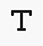

# Erstellung von Inhaltsfragmenten {#authoring-content-fragments}

Die Inhaltserstellung von Inhaltsfragmenten konzentriert sich sowohl auf die Headless-Bereitstellung als auch auf die Seitenbearbeitung.

Für Inhaltsfragmente stehen zwei Editoren zur Verfügung. Der in diesem Abschnitt beschriebene Editor:

* wurde für die Headless-Content-Bereitstellung entwickelt (obwohl sie für alle Szenarien verwendet werden kann)
* ist im **Inhaltsfragmente** console

Dieser Editor bietet Folgendes:

* [Automatisches Speichern](#saving-autosaving), um einen versehentlichen Verlust von Bearbeitungen zu verhindern.
* [Online-Upload von Assets als Inhaltsreferenzen](#reference-images), ohne sie zuerst in Asset DAM hochladen zu müssen.
* [Vorschau](#preview-content-fragment) des vom Inhaltsfragment bereitgestellten gerenderten Erlebnisses.
* Fähigkeit [Veröffentlichen](#publish-content-fragment) und [Veröffentlichung rückgängig machen](#unpublish-content-fragment) aus dem Editor aus.
* Fähigkeit [zugehörige Sprachkopien anzeigen und öffnen](#view-language-copies) im Editor.
* Fähigkeit [Versionsdetails anzeigen](#view-version-history) im Editor. Sie können auch zu einer ausgewählten Version zurückkehren.
* Fähigkeit [Anzeigen und Öffnen von übergeordneten Verweisen](#view-parent-references).
* Eine hierarchische Ansicht des Inhaltsfragments und seiner Verweise mithilfe der [Strukturstruktur](#structure-tree).

>[!WARNING]
>
>Der in diesem Abschnitt beschriebene Editor ist: *only* verfügbar im *online* Adobe Experience Manager (AEM) as a Cloud Service.

## Inhaltsfragment-Editor {#content-fragment-editor}

Beim ersten Öffnen des Inhaltsfragment-Editors werden vier Hauptbereiche angezeigt:

* obere Symbolleiste: für wichtige Informationen und Aktionen
   * einen Link zur Inhaltsfragmentkonsole (Startseiten-Symbol)
   * Informationen zum Modell und Ordner
   * Links zu [Vorschau (wenn das URL-Standardmuster für die Vorschau für das Modell konfiguriert ist)](/help/sites-cloud/administering/content-fragments/content-fragment-models.md#content-fragment-model-properties)
   * [Veröffentlichen](#publish-content-fragment), und [Veröffentlichung rückgängig machen](#unpublish-content-fragment) Aktionen
   * eine Option zum Anzeigen aller **Übergeordnete Verweise** (Verknüpfungssymbol)
   * das Fragment **[Status](/help/sites-cloud/administering/content-fragments/managing.md#statuses-content-fragments)** und zuletzt gespeicherte Informationen
   * Umschalten auf den ursprünglichen (Assets-basierten) Editor

     >[!WARNING]
     >
     >Der ursprüngliche Editor wird auf derselben Registerkarte geöffnet. Es wird nicht empfohlen, beide Editoren gleichzeitig geöffnet zu haben.

* linker Bereich: zeigt die **[Varianten](#variations)** für das Inhaltsfragment und dessen **Felder**:
   * Diese Links können verwendet werden, um [Navigieren in der Inhaltsfragmentstruktur](#navigate-structure)
* Rechter Bereich: enthält Registerkarten [Anzeigen der Eigenschaften (Metadaten) und Tags](#view-properties-tags), Informationen über die [Versionsverlauf](#view-version-history)sowie Informationen zu allen [Sprachkopien](#view-language-copies)
   * im **Eigenschaften** Registerkarte können Sie die **Titel** und **Beschreibung** für das Fragment oder **Variante**
* Zentralbereich: zeigt die tatsächlichen Felder und den Inhalt der ausgewählten Variante an
   * ermöglicht die Bearbeitung des Inhalts
   * if **Registerkartenplatzhalter** -Felder werden innerhalb des hier gezeigten Modells definiert und können für die Navigation verwendet werden. Sie werden entweder horizontal oder als Dropdown-Liste angezeigt.

  >[!NOTE]
  >
  >Abhängig von den Definitionen im zugrunde liegenden Modell können Felder bestimmten Typen von [Validierung](/help/assets/content-fragments/content-fragments-models.md#validation).

## Navigieren zur Inhaltsfragmentstruktur {#navigate-structure}

Ein einzelnes Inhaltsfragment;

* Besteht aus zwei Ebenen:

   * **[Varianten](#variations)** des Inhaltsfragments
   * **Felder** - vom Inhaltsfragmentmodell definiert und von jeder Variante verwendet

* Kann verschiedene Verweise enthalten.

### Varianten und Felder {#variations-and-fields}

Im linken Bereich können Sie Folgendes sehen:

* die Liste der **[Varianten](#variations)** die für dieses Fragment erstellt wurden:
   * **Main** ist die Variante, die beim ersten Erstellen des Inhaltsfragments vorhanden ist. Sie können später weitere hinzufügen
   * Sie können eine Variante zur Bearbeitung auswählen und öffnen
   * Sie können auch [eine Variante erstellen](#create-variation)
* die **Felder** innerhalb des Fragments und dessen Varianten:
   * Das Symbol zeigt an, dass [Datentyp](/help/sites-cloud/administering/content-fragments/content-fragment-models.md#data-types)
   * der Text ist der Feldname
   * Diese stellen einen direkten Link zum Feldinhalt im zentralen Bedienfeld bereit (für die aktuelle Variante).

### Links folgen {#follow-links}

In verschiedenen Bereichen des Editors wird das Link-Symbol angezeigt. Dies kann zum Öffnen des angezeigten Elements verwendet werden, z. B. ein Inhaltsfragmentmodell, eine übergeordnete Referenz oder ein Fragment, auf das verwiesen wird:

### Strukturstruktur {#structure-tree}

Öffnen Sie die **Strukturstruktur** in der Editor-Symbolleiste, um die hierarchische Struktur des Inhaltsfragments und dessen Verweise anzuzeigen. Verwenden Sie die Link-Symbole, um zu den Verweisen zu navigieren.

>[!NOTE]
>
>Siehe [Analysieren der Struktur von Inhaltsfragmenten - Strukturstruktur](/help/sites-cloud/administering/content-fragments/analysis.md#structure-tree) für weitere Details.

## Speichern und automatisches Speichern {#saving-autosaving}

<!-- CHECK: cannot be saved, no undo, redo -->

Bei jeder von Ihnen vorgenommenen Aktualisierung wird das Inhaltsfragment automatisch gespeichert. Die zuletzt gespeicherte Zeit wird in der oberen Symbolleiste angezeigt.

## Varianten {#variations}

[Varianten](/help/sites-cloud/administering/content-fragments/overview.md#main-and-variations) sind eine wichtige Funktion AEM Inhaltsfragmente. Sie ermöglichen es Ihnen, Kopien der **Main** Inhalte für die Verwendung in bestimmten Kanälen und Szenarien, wodurch die Headless Content-Bereitstellung und das Seiten-Authoring noch flexibler werden.

Im Editor haben Sie folgende Möglichkeiten:

* [Erstellen von Varianten](#create-variation) des **Main** content

* Wählen Sie die erforderliche Variante zum Bearbeiten des Inhalts aus.

* [Variante umbenennen](#rename-variation)

* [Variante löschen](#delete-variation)

### Variante erstellen {#create-variation}

So erstellen Sie eine Variante Ihres Inhaltsfragments:

1. Wählen Sie im linken Bereich die **Pluszeichen** (**Variante erstellen**), das rechts von **Varianten**.

   >[!NOTE]
   >
   >Nach der Erstellung Ihrer ersten Variante werden vorhandene Varianten im selben Bedienfeld aufgelistet.

   

1. Geben Sie im Dialogfeld einen **Titel** für Ihre Variante und eine **Beschreibung** wenn gewünscht:

   

1. **Erstellen** die Variante. Er wird in der Liste angezeigt.

### Umbenennen einer Variante {#rename-variation}

So benennen Sie eine **Variante**:

1. Wählen Sie die gewünschte Variante aus.

1. Öffnen Sie die **Eigenschaften** im rechten Bereich.

1. Variante aktualisieren **Titel**.

1. Entweder drücken Sie **Rückgabe** oder in ein anderes Feld wechseln, um die Änderung automatisch zu speichern. Der Titel wird im Abschnitt **Varianten** auf der linken Seite.

### Variante löschen {#delete-variation}

So löschen Sie eine Variante Ihres Inhaltsfragments:

>[!NOTE]
>
>Löschen ist nicht möglich **Main**.

1. Wählen Sie die Variante aus.

1. Im **Variante** das Löschsymbol (Papierkorbsymbol):

   

1. Ein Dialogfeld wird geöffnet. Auswählen **Löschen** , um die Aktion zu bestätigen.

## Mehrzeilige Textfelder bearbeiten - Nur Text oder Markdown {#edit-multi-line-text-fields-plaintext-markdown}

**[Mehrzeiliger Text](/help/sites-cloud/administering/content-fragments/content-fragment-models.md#data-types)** -Felder können eines von drei Formaten aufweisen:

* Nur Text
* [Markdown](/help/sites-cloud/administering/content-fragments/markdown.md)
* [Rich-Text](#edit-multi-line-text-fields-rich-text)

Felder, die als Nur-Text- oder Markdown-Felder definiert sind, haben ein einfaches Textfeld ohne Formatierungsoptionen (auf dem Bildschirm):

## Mehrzeilige Textfelder bearbeiten - Rich-Text {#edit-multi-line-text-fields-rich-text}

Für **[Mehrzeiliger Text](/help/sites-cloud/administering/content-fragments/content-fragment-models.md#data-types)** Felder, die als **Rich-Text**, stehen verschiedene Funktionen zur Verfügung:

* Bearbeiten Sie den Inhalt:
   * Rückgängig/Wiederherstellen
   * Als Text einfügen/einfügen
   * Kopieren
   * Absatzformat auswählen
   * Tabelle erstellen/verwalten
   * Text formatieren; fett, kursiv, unterstrichen, Farbe
   * Absatzausrichtung festlegen
   * Listen erstellen/verwalten, Aufzählungszeichen, Nummerierung
   * Texteinzug; verringern, erhöhen
   * Aktuelle Formatierung löschen
   * Links einfügen
   * Auswählen und Einfügen von Verweisen auf Bild-Assets
   * Hinzufügen von Sonderzeichen
* [Vollbild-Editor](#full-screen-editor-rich-text) - Umschalten zwischen Vollbild und In-Flow
* [Statistiken](#statistics-rich-text)
* [Vergleichen und Synchronisieren](#compare-and-synchronize-rich-text)

Zum Beispiel:

>[!NOTE]
>
>Mehrzeilige Textfelder werden auch durch die entsprechenden [icon](#fields-datatypes-icons) im **Felder** Bedienfeld.

### Vollbild-Editor - Rich-Text {#full-screen-editor-rich-text}

Der Vollbild-Editor bietet dieselben Bearbeitungsoptionen wie im Textfluss - bietet jedoch mehr Platz für den Text.

Zum Beispiel:

### Statistiken - Rich-Text {#statistics-rich-text}

Die Aktion **Statistik** zeigt eine Reihe von Informationen zum Text in einem mehrzeiligen Feld an.

Zum Beispiel:

### Vergleichen und Synchronisieren - Rich-Text {#compare-and-synchronize-rich-text}

Die Aktion **Vergleichen** ist für mehrzeilige Felder verfügbar, wenn Sie über eine **Variante** öffnen.

Dadurch wird das mehrzeilige Feld im Vollbildmodus geöffnet und:

* zeigt den Inhalt für beide **Main** und der aktuelle **Variante** parallel, wobei alle Unterschiede hervorgehoben werden

* Unterschiede sind farblich gekennzeichnet:

   * Grün kennzeichnet hinzugefügten Inhalt (zur Variante)
   * Rot zeigt an, dass Inhalt entfernt wurde (aus der Variante)
   * Blau zeigt an, dass Text ersetzt wurde

* stellt die **Synchronisieren** Aktion, die den Inhalt von synchronisiert **Main** zur aktuellen Variante

   * if **Main** aktualisiert wurde, werden diese Änderungen in die Variante übertragen
   * Wenn die Variante aktualisiert wurde, werden diese Änderungen durch den Inhalt von **Main**

  >[!CAUTION]
  >
  >Die Synchronisierung ist nur zum Kopieren von Änderungen verfügbar *von **Main**zur Änderung*.
  >
  >Änderungen übertragen *von einer Änderung zu **Main*** ist nicht als Option verfügbar.

Beispiel: ein Szenario, in dem der Varianteninhalt vollständig umgeschrieben wurde, sodass eine Synchronisierung diesen neuen Inhalt durch den Inhalt aus ersetzt **Main**:

## Verweise verwalten {#manage-references}

### Fragmentreferenzen {#fragment-references}

[Fragmentverweise](/help/sites-cloud/administering/content-fragments/content-fragment-models.md#fragment-reference-nested-fragments) kann verwendet werden für:

* [einen Verweis auf ein vorhandenes Inhaltsfragment erstellen](#create-reference-existing-content-fragment)
* [ein Inhaltsfragment erstellen und dann darauf verweisen](#create-reference-content-fragment)

#### Erstellen eines Verweises auf ein vorhandenes Inhaltsfragment {#create-reference-existing-content-fragment}

So erstellen Sie einen Verweis auf ein vorhandenes Inhaltsfragment:

1. Wählen Sie das Feld aus.
1. Auswählen **Vorhandenes Fragment hinzufügen**.
1. Wählen Sie das gewünschte Fragment aus der Fragmentauswahl aus.

   >[!NOTE]
   >
   >Sie können jeweils nur ein Fragment auswählen.

#### Erstellen eines Inhaltsfragments und einer Referenz {#create-reference-content-fragment}

Alternativ können Sie [select **Neues Fragment erstellen** , um die **Erstellen** dialog](/help/sites-cloud/administering/content-fragments/managing.md#creating-a-content-fragment). Nach der Erstellung wird auf dieses Fragment verwiesen.

### Inhaltsreferenzen {#content-references}

[Inhaltsreferenzen](/help/sites-cloud/administering/content-fragments/content-fragment-models.md#content-reference) werden verwendet, um andere AEM Content-Typen zu referenzieren, z. B. Bilder, Seiten und Experience Fragments.

#### Referenzbilder {#reference-images}

In **Inhaltsreferenz** -Felder können Sie beides:

* Referenz-Assets, die bereits im Repository vorhanden sind
* sie direkt in das Feld hochladen, wodurch die Verwendung der **Assets** Hochladen der Konsole

  >[!NOTE]
  >
  >So laden Sie Bilder direkt in die **Inhaltsreferenz** Feld, it **must**:
  >
  >* über eine **Stammverzeichnis** definiert (im [Inhaltsfragmentmodell](/help/sites-cloud/administering/content-fragments/content-fragment-models.md#content-reference)). Gibt an, wo das Bild gespeichert wird.
  >* include **Bild** in der Liste der akzeptierten Inhaltstypen

Um ein Asset hinzuzufügen, haben Sie folgende Möglichkeiten:

* Ziehen Sie die neue Asset-Datei direkt (z. B. aus Ihrem Dateisystem) in den **Inhaltsreferenz** field
* die **Asset hinzufügen** Aktion und wählen Sie entweder **Durchsuchen von Assets** oder **Hochladen** , um den entsprechenden Selektor zu öffnen, den Sie verwenden können:

  

#### Referenzseiten {#reference-pages}

So fügen Sie Verweise auf AEM Seiten, Experience Fragments oder andere Content-Typen hinzu:

1. Auswählen **Inhaltspfad hinzufügen**.

1. Fügen Sie im Eingabefeld den erforderlichen Pfad hinzu.

1. Bestätigen mit **Hinzufügen**.

### Übergeordnete Verweise anzeigen {#view-parent-references}

Durch Auswahl des Link-Symbols in der oberen Symbolleiste wird eine Liste aller übergeordneten Verweise geöffnet.

Zum Beispiel:

Ein Fenster mit allen zugehörigen Verweisen wird geöffnet. Um einen Verweis zu öffnen, wählen Sie den Namen, den Titel oder das Link-Symbol aus.

Zum Beispiel:

## Eigenschaften und Tags anzeigen {#view-properties-tags}

Auf der Registerkarte &quot;Eigenschaften&quot;des rechten Bedienfelds können Eigenschaften (Metadaten) und Tags angezeigt werden. Die Eigenschaften können wie folgt lauten:

* für die **Inhaltsfragment** - wenn **Main** ist derzeit ausgewählt
* für bestimmte **Variante**

### Eigenschaften und Tags bearbeiten {#edit-properties-tags}

Auf der Registerkarte &quot;Eigenschaften&quot;(rechtes Bedienfeld) können Sie auch Folgendes bearbeiten:

* **Titel**
* **Beschreibung**
* **Tags**: über die Dropdownliste oder das Auswahldialogfeld

  

### Inhaltsfragmentmodell öffnen {#open-content-fragment-model}

Wenn Sie **Main** ausgewählt ist, wird der Name des zugrunde liegenden Inhaltsfragmentmodells im Abschnitt &quot;Eigenschaften&quot;angezeigt. Wenn Sie das Link-Symbol auswählen, wird das Modell in einer separaten Registerkarte geöffnet.

Zum Beispiel:

## Versionsverlauf anzeigen {#view-version-history}

Im **Versionsverlauf** im rechten Bereich Details zu den aktuellen und vorherigen Versionen angezeigt werden:

>[!NOTE]
>
>Eine neue Version wird erstellt, wenn das Inhaltsfragment veröffentlicht wird.

### Auf eine Version zurücksetzen {#revert-version}

Sie können zu einer beliebigen Version zurückkehren.

So stellen Sie eine bestimmte Version wieder her:

1. Wählen Sie das Symbol mit den drei Punkten neben der Version aus.

1. Auswählen **Wiederherstellen**.

## Anzeigen der Sprachkopien {#view-language-copies}

Im **Spracheigenschaften** -Tab-Details verwandter Sprachkopien werden angezeigt. Wenn Sie ein Link-Symbol auswählen, wird die Kopie auf einer separaten Registerkarte geöffnet.

Zum Beispiel:

>[!NOTE]
>
>Weitere Informationen zum Übersetzen eines Inhaltsfragments und Erstellen von Sprachkopien finden Sie unter [AEM Headless Translation Journey](/help/journey-headless/translation/overview.md).

## Vorschau des Fragments anzeigen {#preview-content-fragment}

Der Inhaltsfragment-Editor bietet Autoren die Möglichkeit, ihre Bearbeitungen in einer externen Frontend-Anwendung in der Vorschau anzuzeigen.

Um diese Funktion verwenden zu können, müssen Sie zunächst:

* Arbeiten Sie mit Ihrem IT-Team zusammen, um die externe Frontend-Anwendung einzurichten, die das Inhaltsfragment rendert, indem sie die JSON-Ausgabe nutzt.
* Wenn die externe Frontend-Anwendung eingerichtet ist, wird die **Standard-URL-Vorschaumuster** als [-Eigenschaft des entsprechenden Inhaltsfragmentmodells](/help/sites-cloud/administering/content-fragments/content-fragment-models.md#properties).

Wenn die URL definiert wurde, wird die **Vorschau** -Schaltfläche aktiv ist. Sie können diese Schaltfläche auswählen, um die externe Anwendung (in einer separaten Registerkarte) zum Rendern des Inhaltsfragments zu starten.

## Veröffentlichen des Fragments {#publish-content-fragment}

Sie können **Veröffentlichen** Ihr Fragment zu Ihrem

* Vorschauinstanz
* Veröffentlichungsinstanz

Sie können das Fragment entweder im Editor oder in der Konsole veröffentlichen. Siehe [Veröffentlichen und Anzeigen der Vorschau eines Fragments](/help/sites-cloud/administering/content-fragments/managing.md#publishing-and-previewing-a-fragment) für ausführliche Informationen.

## Veröffentlichung des Fragments rückgängig machen {#unpublish-content-fragment}

Sie können auch **Veröffentlichung rückgängig machen** Ihr Fragment aus Ihrem

* Vorschauinstanz
* Veröffentlichungsinstanz

Sie können die Veröffentlichung des Fragments im Editor oder in der Konsole rückgängig machen. Siehe [Rückgängigmachen der Veröffentlichung eines Fragments](/help/sites-cloud/administering/content-fragments/managing.md#unpublishing-a-fragment) für ausführliche Informationen.

## Felder, Datentypen und Symbole {#fields-datatypes-icons}

Die **Felder** enthält alle Felder im Inhaltsfragment. Das Symbol zeigt die **[Datentyp](/help/sites-cloud/administering/content-fragments/content-fragment-models.md#data-types)**:

<table style="table-layout:auto">
 <tbody>
  <tr>
   <td>
<b>Einzeilentext</b>
 </td>
   <td>
  
</td>
  </tr>
  <tr>
   <td>
<b>Mehrzeilentext</b>
 </td>
   <td>
  
</td>
  </tr>
  <tr>
   <td>
<b>Zahl</b>
 </td>
   <td>
  
</td>
  </tr>
  <tr>
   <td>
<b>Boolesch</b>
 </td>
   <td>
  
</td>
  </tr>
  <tr>
   <td>
<b>Datum und Uhrzeit</b>
 </td>
   <td>
  
</td>
  </tr>
  <tr>
   <td>
<b>Aufzählung</b>
 </td>
   <td>
  
</td>
  </tr>
  <tr>
   <td>
<b>Tags</b>
 </td>
   <td>
  
</td>
  </tr>
  <tr>
   <td>
<b>Inhaltsreferenz</b>
 </td>
   <td>
  
</td>
  </tr>
  <tr>
   <td>
<b>Fragmentreferenz</b>
 </td>
   <td>
  
</td>
  </tr>
  <tr>
   <td>
<b>JSON-Objekt</b>
 </td>
   <td>
  
</td>
  </tr>
  <tr>
   <td>
<b>Registerkarten-Platzhalter</b>

Obwohl nicht durch ein reales Symbol dargestellt, wird eine <b>Registerkartenplatzhalter</b> wird im linken Bereich angezeigt.  Sie wird auch im zentralen Bedienfeld angezeigt, entweder horizontal wie angezeigt oder in einer Dropdown-Liste (wenn zu viele vorhanden sind, um horizontal angezeigt zu werden).
 </td>
   <td>
  
</td>
  </tr>
 </tbody>
</table>

## Wissenswertes {#good-to-know}

* Zum Bearbeiten eines Inhaltsfragments benötigen Sie [die entsprechenden Berechtigungen](/help/implementing/developing/extending/content-fragments-customizing.md#asset-permissions). Wenden Sie sich an Ihre Systemadmins, falls Probleme auftreten.

  Wenn Sie beispielsweise `edit` -Berechtigungen ist der Editor schreibgeschützt.

* Ein Inhaltsfragmentmodell kann häufig Datenfelder definieren, die **Titel** und **Beschreibung**. Wenn diese Felder vorhanden sind, handelt es sich um benutzerdefinierte Felder, die im *Zentralbereich* beim Bearbeiten des Fragments.

  Das Inhaltsfragment und seine Varianten verfügen auch über Metadatenfelder (Varianteneigenschaften) namens **Titel** und **Beschreibung**. Diese Felder sind integraler Bestandteil jedes Inhaltsfragments und werden beim Fragment anfänglich definiert. Sie können im Abschnitt *Rechter Bereich* beim Bearbeiten des Fragments.

* Umfassende Informationen zu den [ursprünglicher Inhaltsfragmente-Editor](/help/assets/content-fragments/content-fragments-variations.md) - sie ist sowohl über die **Assets** und **Inhaltsfragmente** Konsole.

* Ihr Projektteam kann den Editor bei Bedarf anpassen. Siehe [Anpassen der Inhaltsfragment-Konsole und des Editors](/help/implementing/developing/extending/content-fragments-console-and-editor.md) für weitere Informationen.
