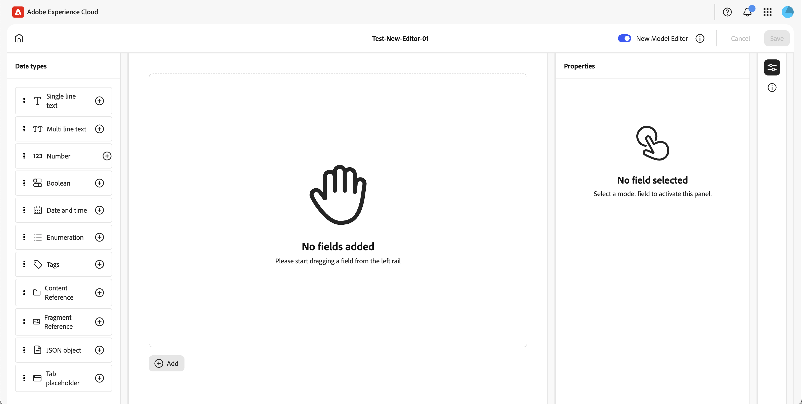

# Definieren von Inhaltsfragmentmodellen {#defining-content-fragment-models}

In Inhaltsfragmentmodellen in Adobe Experience Manager (AEM) as a Cloud Service wird die Struktur des Inhalts Ihrer [Inhaltsfragmente](/help/sites-cloud/administering/content-fragments/overview.md) definiert. Diese Fragmente können dann für die Seitenbearbeitung oder als Grundlage für Ihre Headless-Inhalte verwendet werden.

Auf dieser Seite wird beschrieben, wie Sie Ihr Inhaltsfragmentmodell mithilfe des dedizierten Editors definieren. Unter [Verwalten Ihrer Inhaltsfragmentmodelle](/help/sites-cloud/administering/content-fragments/managing-content-fragment-models.md) finden Sie weitere Aufgaben und Optionen, die nach dem Erstellen Ihrer Ihre Fragmente verfügbar sind, einschließlich [Aktionen, die in der Inhaltsfragmentkonsole verfügbar sind](/help/sites-cloud/administering/content-fragments/managing-content-fragment-models.md#actions), dem [Zulassen des Modells für Ihren Ordner](/help/sites-cloud/administering/content-fragments/managing-content-fragment-models.md#allowing-content-fragment-models-assets-folder) und dem [Veröffentlichen Ihres Modells](/help/sites-cloud/administering/content-fragments/managing-content-fragment-models.md#publishing-a-content-fragment-model).

>[!NOTE]
>
>Beachten Sie die [Best Practices](/help/sites-cloud/administering/content-fragments/overview.md) beim Arbeiten mit Ihren Inhaltsfragmentmodellen und Inhaltsfragmenten.

>[!CAUTION]
>
>Wenn Sie mehrere referenzierte Fragmente abfragen, wird nicht empfohlen, dass die verschiedenen Fragmentmodelle Feldnamen mit demselben Namen, sondern unterschiedlichen Typen aufweisen.
>
>Weitere Informationen finden Sie unter [AEM GraphQL-API zur Verwendung mit Inhaltsfragmenten – Einschränkungen](/help/headless/graphql-api/content-fragments.md#limitations).

>[!NOTE]
>
>Wenn Sie ein Modell mit diesem neuen Editor erstellen, sollten Sie immer diesen Editor für dieses Modell verwenden.
>
>Wenn Sie dann das Modell mit dem [ursprünglichen Modell-Editor](/help/assets/content-fragments/content-fragments-models.md) öffnen, wird die Meldung angezeigt:
>
>* „Für dieses Modell ist ein benutzerdefiniertes Benutzeroberflächenschema konfiguriert. Die Reihenfolge der in dieser Benutzeroberfläche angezeigten Felder stimmt möglicherweise nicht mit dem Benutzeroberflächenschema überein. Um die Felder anzuzeigen, die mit dem Benutzeroberflächenschema abgestimmt sind, müssen Sie zum neuen Inhaltsfragment-Editor wechseln.“

## Definieren des Inhaltsfragmentmodells {#defining-your-content-fragment-model}

Das Inhaltsfragmentmodell definiert effektiv die Struktur der resultierenden Inhaltsfragmente unter Verwendung unterschiedlicher **[Datentypen](#data-types)**. Mithilfe des Modell-Editors können Sie Instanzen der Datentypen hinzufügen und diese dann so konfigurieren, dass die erforderlichen Felder erstellt werden:

>[!CAUTION]
>
>Das Bearbeiten eines Modells, das bereits von vorhandenen Inhaltsfragmenten verwendet wird, kann sich auf diese abhängigen Fragmente auswirken.

1. Wählen Sie in der Inhaltsfragmentkonsole das Panel für [Inhaltsfragmentmodelle](/help/sites-cloud/administering/content-fragments/managing-content-fragment-models.md#basic-structure-handling-content-fragment-models-console) aus und navigieren Sie zu dem Ordner mit Ihrem Inhaltsfragmentmodell.

   >[!NOTE]
   >
   >Sie können ein Modell auch direkt nach dem [Erstellen](/help/sites-cloud/administering/content-fragments/managing-content-fragment-models.md#creating-a-content-fragment-model) öffnen.

1. Öffnen Sie das gewünschte Modell für **Bearbeiten** verwenden Sie einen der Schnellzugriff-Links oder wählen Sie das Modell und dann die Aktion in der Symbolleiste aus.


   

   Nach dem Öffnen zeigt der Modell-Editor Folgendes an:

   * Oben:
      * Symbol **Startseite**
      * Option zum Umschalten zwischen dem [Original](/help/assets/content-fragments/content-fragments-models.md) und neuen Editor
      * **Abbrechen**
      * **Speichern**

   * Links: **Datentypen** zum Erstellen von Feldern verfügbar

   * Middle: Felder, die bereits zusammen mit der Option **Hinzufügen** definiert wurden

   * Rechts: Mithilfe der Symbole ganz rechts können Sie zwischen folgenden Optionen wählen:

      * **Eigenschaften**: Definieren und Anzeigen von Eigenschaften für das ausgewählte Feld
      * **Modelldetails**: Anzeigen des **Aktiviert**-Status, **Modelltitel**, **Tags**, **Beschreibung** und **Vorschau-URL**

1. **So fügen Sie ein Feld hinzu**

   * Sie haben folgende Möglichkeiten:

      * Ziehen Sie einen Datentyp aus dem linken Bereich an die erforderliche Position für ein Feld im mittleren Bereich.
      * Wählen Sie das Symbol **+** nach einem Datentyp aus, um es am unteren Rand der Feldliste hinzuzufügen.
      * Wählen Sie **mittleren Bereich** Hinzufügen“ und dann den erforderlichen Datentyp aus der resultierenden Dropdown-Liste aus, um ein Feld zum Ende der Liste hinzuzufügen.

     >[!NOTE]
     >
     >**Registerkarten-Platzhalter** Felder müssen immer über den vorhandenen Feldern angezeigt werden.

   * Sie können ein Feld mithilfe der Punktbildung links im Feld neu positionieren:

     

   * Nachdem ein Feld zum Modell hinzugefügt wurde (und ausgewählt ist), werden im rechten Bereich die **Eigenschaften** angezeigt, die für diesen bestimmten Datentyp definiert werden können. Hier können Sie festlegen, was für die jeweiligen
Feld.

      * Viele Eigenschaften sind selbsterklärend. Weitere Informationen finden Sie unter [Eigenschaften (Datentypen)](#properties).
      * Wenn Sie eine **Feldbeschriftung** eingeben, wird der **Eigenschaftsname** automatisch ausgefüllt, falls das Feld leer ist, und kann anschließend manuell aktualisiert werden.

        >[!CAUTION]
        >
        >Wenn Sie die Eigenschaft **Eigenschaftsname** für einen Datentyp manuell aktualisieren, dürfen die Namen *nur* A–Z, a–z, 0–9 und den Unterstrich „_“ als Sonderzeichen enthalten.
        >
        >Wenn in früheren Versionen von AEM erstellte Modelle unzulässige Zeichen enthalten, entfernen oder ändern Sie diese Zeichen.

     Zum Beispiel:

     

     >[!NOTE]
     >
     >Wenn ein Feld als &quot;**&quot; definiert**, wird **Beschriftung** im mittleren Bereich mit einem Stern markiert (**&#42;**).

1. **So entfernen Sie ein Feld**

   Wählen Sie das Papierkorbsymbol für das entsprechende Feld im mittleren Bereich aus.

   

1. Fügen Sie alle erforderlichen Felder hinzu und legen Sie bei Bedarf die zugehörigen Eigenschaften fest.

1. Wählen Sie **Speichern**, um die Definition beizubehalten.

## Datentypen {#data-types}

Zum Definieren Ihres Modells stehen unterschiedliche Datentypen zur Verfügung:

* **Einzeilentext**
   * Fügt ein Feld für eine einzelne Textzeile hinzu; die maximale Länge kann definiert werden.
   * Das Feld kann so konfiguriert werden, dass Fragmentautorinnen und -autoren neue Instanzen des Felds erstellen können.

* **Mehrzeilentext**
   * Ein Textbereich, der Rich Text, Nur Text oder Markdown sein kann
   * Das Feld kann so konfiguriert werden, dass Fragmentautorinnen und -autoren neue Instanzen des Felds erstellen können.

  >[!NOTE]
  >
  >Ob es sich bei dem Textbereich um Rich Text, Nur Text oder Markdown handelt, wird im Modell durch die Eigenschaft **Standardtyp** definiert.
  >
  >Dieses Format kann nicht über den [Inhaltsfragmenteditor](/help/sites-cloud/administering/content-fragments/authoring.md), sondern nur vom Modell aus geändert werden.

* **Zahl**
   * Fügt ein numerisches Feld hinzu.
   * Das Feld kann so konfiguriert werden, dass Fragmentautorinnen und -autoren neue Instanzen des Felds erstellen können.

* **Boolesch**
   * Fügen Sie ein boolesches Kontrollkästchen hinzu.

* **Datum und Uhrzeit**
   * Fügt ein Datums- und/oder Zeitfeld hinzu.

* **Aufzählung**
   * Fügt einen Satz Kontrollkästchen, Optionsfelder oder Dropdown-Felder hinzu.
      * Sie können die für Fragmentautorinnen und -autoren verfügbaren Optionen festlegen.

* **Tags**
   * Ermöglicht Fragmentautoren den Zugriff auf und die Auswahl von Tag-Bereichen.

* **Fragmentreferenz**
   * Verweist auf andere Inhaltsfragmente. Kann zum [Erstellen verschachtelter Inhalte](#using-references-to-form-nested-content) verwendet werden.
   * Der Datentyp kann so konfiguriert werden, dass Fragmentautoren folgende Möglichkeiten haben:
      * Direktes Bearbeiten des referenzierten Fragments
      * Erstellen eines neuen Inhaltsfragments basierend auf dem entsprechenden Modell
      * Erstellen neuer Instanzen des Felds
   * Die Referenz gibt den Pfad zur referenzierten Ressource an, z. B. `/content/dam/path/to/resource`.

     <!--
    * Internally the reference is held as a universally unique ID (UUID) that references the resource
    * You do not need to know the UUID; in the fragment editor you can browse to the required fragment.
    -->

  <!--
  >[!NOTE]
  >
  >The UUIDs are repository specific. If you use the [Content Copy Tool](/help/implementing/developing/tools/content-copy.md) to copy Content Fragments, the UUIDs will be recalculated in the target environment.
  -->

* **Inhaltsreferenz**
   * Verweist auf andere Inhalte jeden Typs. Kann zum [Erstellen verschachtelter Inhalte](#using-references-to-form-nested-content) verwendet werden.
   * Wenn ein Bild referenziert wird, kann wahlweise eine Miniatur angezeigt werden.
   * Das Feld kann so konfiguriert werden, dass Fragmentautorinnen und -autoren neue Instanzen des Felds erstellen können.
   * Die Referenz gibt den Pfad zur referenzierten Ressource an, z. B. `/content/dam/path/to/resource`.

     <!--
    * Internally the reference is held as a universally unique ID (UUID) that references the resource
    * You do not need to know the UUID; in the fragment editor you can browse to the required asset resource
    -->

  <!--
  >[!NOTE]
  >
  >The UUIDs are repository specific. If you use the [Content Copy Tool](/help/implementing/developing/tools/content-copy.md) to copy Content Fragments, the UUIDs will be recalculated in the target environment.
  -->

* **JSON-Objekt**
   * Ermöglicht es der Autorin bzw. dem Autor des Inhaltsfragments, JSON-Syntax in die entsprechenden Elemente eines Fragments einzugeben.
      * Damit AEM direktes JSON speichern kann, das Sie von einem anderen Service kopiert/eingefügt haben.
      * Das JSON wird weitergegeben und als JSON in GraphQL ausgegeben.
      * Umfasst JSON-Syntaxhervorhebung, automatische Vervollständigung und Fehlerhervorhebung im Inhaltsfragmenteditor.

* **Registerkarten-Platzhalter**
   * Ermöglicht die Einführung von Registerkarten zur Bearbeitung des Inhalts von Inhaltsfragmenten.
      * Dies wird als Trennzeichen im Modell-Editor angezeigt, das Abschnitte der Liste der Inhaltsdatentypen trennt. Jede Instanz stellt den Beginn einer neuen Registerkarte dar.
      * Im Fragment-Editor wird jede Instanz als Registerkarte angezeigt.

     >[!NOTE]
     >
     >Dieser Datentyp dient ausschließlich zur Formatierung und wird vom GraphQL-Schema von AEM ignoriert.
     >
     >**Registerkarten-Platzhalter** Felder müssen immer über den vorhandenen Feldern angezeigt werden.

## Eigenschaften (Datentypen) {#properties}

Viele Eigenschaften sind selbsterklärend. Im Folgenden finden Sie weitere Informationen zu bestimmten Eigenschaften:

* **Eigenschaftsname**

  Wenn Sie diese Eigenschaft für einen Datentyp manuell aktualisieren, **dürfen** die Namen *nur* A–Z, a–z, 0–9 und den Unterstrich „_“ als Sonderzeichen enthalten.

  >[!CAUTION]
  >
  >Wenn in früheren Versionen von AEM erstellte Modelle unzulässige Zeichen enthalten, entfernen oder ändern Sie diese Zeichen.

* **Rendern als**

  Die verschiedenen Möglichkeiten, das Feld in einem Fragment zu erstellen/zu rendern. Oft können Sie damit festlegen, ob dem Autor oder der Autorin nur eine einzige Instanz des Feldes angezeigt wird oder ob mehrere Instanzen erstellt werden dürfen. Wenn **Mehrere Felder** verwendet wird, können Sie die Mindest- und Höchstanzahl der Elemente definieren. Siehe [Validierung](#validation) für weitere Informationen.

* **Feldbezeichnung**
Das Eingeben einer **Feldbezeichnung** generiert automatisch einen **Eigenschaftsnamen**, der dann bei Bedarf manuell aktualisiert werden kann.

* **Validierung**
Die grundlegende Basic ist mittels Mechanismen wie etwa die Eigenschaft **Erforderlich** verfügbar. Einige Datentypen verfügen über zusätzliche Validierungsfelder. Weitere Informationen finden Sie unter [Validierung](#validation).

* Beim Datentyp **Mehrzeilentext** können Sie den **Standardtyp** folgendermaßen definieren:

   * **Rich-Text**
   * **Markdown**
   * **Nur Text**

  Wenn Sie keinen Typ angeben, wird der Standardwert **Rich-Text** in diesem Feld verwendet.

  Änderungen am **Standardtyp** in einem Fragmentmodell werden erst dann auf vorhandene, zugehörige Inhaltsfragmente angewendet, wenn das Fragment im Editor geöffnet und gespeichert wurde.

* **Eindeutig**
Der Inhalt (für das spezifische Feld) muss für alle Inhaltsfragmente, die anhand des aktuellen Modells erstellt werden, eindeutig sein.

  Dadurch wird sichergestellt, dass Inhaltsersteller Content, der bereits einem anderen Fragment desselben Modells hinzugefügt wurde, nicht wiederholen können.

  Beispielsweise kann ein **einzeiliges Textfeld** mit dem Namen `Country` im Inhaltsfragmentmodell nicht den Wert `Japan` in zwei abhängigen Inhaltsfragmenten haben. Eine Warnung wird ausgegeben, wenn versucht wird, eine zweite Instanz zu erstellen.

  >[!NOTE]
  >
  >Die Eindeutigkeit wird pro Sprachstamm gewährleistet.

  >[!NOTE]
  >
  >Varianten können denselben *eindeutigen* Wert haben wie Varianten desselben Fragments, jedoch nicht denselben Wert wie Varianten anderer Fragmente.

* Weitere Informationen zu diesem bestimmten Datentyp und seinen Eigenschaften finden Sie unter **[Inhaltsreferenz](#content-reference)**.

* Weitere Informationen zu diesem bestimmten Datentyp und seinen Eigenschaften finden Sie unter **[Fragmentreferenz (verschachtelte Fragmente)](#fragment-reference-nested-fragments)**.

* **Übersetzbar**

  Durch Aktivieren des Kontrollkästchens **Übersetzbar** für ein Feld im Editor für Inhaltsfragmentmodelle geschieht Folgendes:

   * Es wird sichergestellt, dass der Eigenschaftsname zur Übersetzungskonfiguration im Kontext `/content/dam/<sites-configuration>` hinzugefügt wird, falls er noch nicht vorhanden ist.
   * Für GraphQL: Im Inhaltsfragmentfeld wird die Eigenschaft `<translatable>` auf `yes` festgelegt, um den GraphQL-Abfragefilter für die JSON-Ausgabe nur mit übersetzbarem Inhalt zuzulassen.

## Validierung {#validation}

Verschiedene Datentypen bieten jetzt die Möglichkeit, Validierungsanforderungen für den Zeitpunkt zu definieren, an dem Inhalt in das resultierende Fragment eingefügt wird:

* **Einzeilentext**
   * Führen Sie einen Vergleich mit einem vordefinierten Regex durch.
* **Zahl**
   * Suchen Sie nach bestimmten Werten.
* **Inhaltsreferenz**
   * Testen Sie, ob bestimmte Content-Typen vorhanden sind.
   * Es können nur Assets bis zur angegebenen maximalen Dateigröße referenziert werden.
   * Es können nur Bilder in einem vordefinierten Bereich von Breite und/oder Höhe (in Pixel) referenziert werden.
* **Fragmentreferenz**
   * Testen Sie, ob ein bestimmtes Inhaltsfragmentmodell vorhanden ist.
* **Mindestanzahl der Elemente**/**Maximale Anzahl der Elemente**

  Felder, die als **Mehrere Felder** festgelegt wurden (mit **Rendern als**) haben die Optionen:

   * **Mindestanzahl der Elemente**
   * **Maximale Anzahl der Elemente**

  Diese werden im [Inhaltsfragmenteditor](/help/sites-cloud/administering/content-fragments/authoring.md) validiert.

## Verwenden von Verweisen, um verschachtelten Inhalt zu bilden {#using-references-to-form-nested-content}

Inhaltsfragmente können mit einem der folgenden Datentypen verschachtelte Inhalte bilden:

* [Inhaltsreferenz](#content-reference)
   * Bietet einen einfachen Verweis auf andere Inhalte eines beliebigen Typs.
   * Wird vom Datentyp **Inhaltsreferenz** bereitgestellt
   * Kann für eine oder mehrere Referenzen konfiguriert werden (im resultierenden Fragment).

* [Fragmentreferenz](#fragment-reference-nested-fragments) (verschachtelte Fragmente)
   * Verweist auf andere Fragmente, abhängig von den angegebenen Modellen.
   * Wird vom Datentyp **Fragmentreferenz** bereitgestellt
   * Ermöglicht das Einschließen/Abrufen strukturierter Daten.

     >[!NOTE]
     >
     >Diese Methode ist vor allem bei der Verwendung in Verbindung mit der [Headless-Inhaltsbereitstellung mittels Inhaltsfragmenten mit GraphQL](/help/sites-cloud/administering/content-fragments/content-delivery-with-graphql.md) interessant.
   * Kann für einen oder mehrere Verweise konfiguriert werden (im resultierenden Fragment).

<!--
>[!NOTE]
>
>See [Upgrade your Content Fragments for UUID References](/help/headless/graphql-api/uuid-reference-upgrade.md) for further information about Content/Fragment Reference and Content/Fragment Reference (UUID), and upgrading to the UUID-based data types.
-->

>[!NOTE]
>
>AEM bietet Schutz vor Wiederholungen für:
>
>* Inhaltsverweise
>  Dies verhindert, dass Benutzende einen Verweis zum aktuellen Fragment hinzufügen, und kann zu einem leeren Auswahldialogfeld der Fragmentreferenzen führen.
>
>* Fragmentreferenzen in GraphQL
>  Wenn Sie eine tiefe Abfrage erstellen, die mehrere Inhaltsfragmente zurückgibt, die gegenseitig aufeinander verweisen, gibt sie beim ersten Auftreten null zurück.

>[!CAUTION]
>
>Wenn Sie mehrere referenzierte Fragmente abfragen, wird nicht empfohlen, dass die verschiedenen Fragmentmodelle Feldnamen mit demselben Namen, sondern unterschiedlichen Typen aufweisen.
>
>Weitere Informationen finden Sie unter [AEM GraphQL-API zur Verwendung mit Inhaltsfragmenten – Einschränkungen](/help/headless/graphql-api/content-fragments.md#limitations).

### Inhaltsreferenz {#content-reference}

Mit **Datentyp „Inhaltsreferenz** können Sie Inhalte aus einer anderen Quelle rendern, z. B. Bild, Seite oder Experience Fragment.

Zusätzlich zu den Standardeigenschaften können Sie Folgendes angeben:

* Das **Stammverzeichnis**, das angibt, wo referenzierte Inhalte gespeichert werden sollen

  >[!NOTE]
  >
  >Dies ist erforderlich, wenn Sie mit dem Inhaltsfragmenteditor Bilder in diesem Feld direkt hochladen und referenzieren möchten.
  >
  >Siehe [Bilder referenzieren](/help/sites-cloud/administering/content-fragments/authoring.md#reference-images) für weitere Informationen.

* Die Inhaltstypen, auf die verwiesen werden kann

  >[!NOTE]
  >
  >Dazu gehören **Bilder**, wenn Sie mit dem Inhaltsfragmenteditor Bilder in diesem Feld direkt hochladen und referenzieren möchten.
  >
  >Siehe [Bilder referenzieren](/help/sites-cloud/administering/content-fragments/authoring.md#reference-images) für weitere Informationen.

* Einschränkungen bezüglich der Dateigrößen
* Wenn ein Bild referenziert wird:

   * Miniatur anzeigen
   * Bildeinschränkungen hinsichtlich Höhe und Breite


### Fragmentreferenz (verschachtelte Fragmente) {#fragment-reference-nested-fragments}

Der **Fragmentverweis** Datentyp kann auf ein oder mehrere Inhaltsfragmente verweisen. Diese Funktion ist besonders beim Abrufen von Inhalten für die Verwendung in Ihrem Programm interessant, da sie es Ihnen ermöglicht, strukturierte Daten mit mehreren Ebenen abzurufen.

Zum Beispiel:

* Ein Modell, das Details für eine Mitarbeiterin oder einen Mitarbeiter definiert, beispielsweise:
   * Ein Verweis auf das Modell, das den Arbeitgeber (Firma) definiert

```xml
type EmployeeModel {
    name: String
    firstName: String
    company: CompanyModel
}

type CompanyModel {
    name: String
    street: String
    city: String
}
```

>[!NOTE]
>
>Fragmentreferenzen sind für die [Headless-Bereitstellung von Inhalten mithilfe von Inhaltsfragmenten mit GraphQL](/help/sites-cloud/administering/content-fragments/content-delivery-with-graphql.md) besonders interessant.

Zusätzlich zu den Standardeigenschaften können Sie Folgendes definieren:

* **Rendern als**:

   * **multifield**: Der Fragmentautor kann mehrere einzelne Verweise erstellen.

   * **fragmentreference**: Der Fragmentautor kann einen einzelnen Verweis auf ein Fragment auswählen.

* **Modelltyp**
Es können mehrere Modelle ausgewählt werden. Beim Hinzufügen von Referenzen zu einem Inhaltsfragment müssen alle referenzierten Fragmente mit diesen Modellen erstellt worden sein.

* **Stammpfad**
Gibt einen Stammpfad für referenzierte Fragmente an.

* **Fragmenterstellung zulassen**

  Auf diese Weise kann die Autorin oder der Autor des Fragments ein Fragment auf der Grundlage des entsprechenden Modells erstellen.

   * **fragmentreferencecomposite**: Ermöglicht dem Fragmentautor das Erstellen einer Composite-Datei durch Auswahl mehrerer Fragmente.

  

>[!NOTE]
>
>Es gibt einen Mechanismus zum Wiederholungsschutz. Er hindert Benutzende daran, das aktuelle Inhaltsfragment in der Fragmentreferenz auszuwählen, und kann zu einem leeren Auswahldialogfeld der Fragmentreferenzen führen.
>
>Es gibt auch einen Wiederholungsschutz für Fragmentreferenzen in GraphQL. Wenn Sie eine tiefe Abfrage über zwei Inhaltsfragmente hinweg erstellen, die gegenseitig aufeinander verweisen, wird null zurückgegeben.
