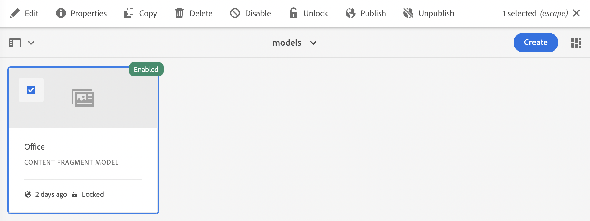

# Inhaltsfragmentmodelle {#content-fragment-models}

Inhaltsfragmentmodelle in Adobe Experience Manager (AEM) as a Cloud Service definieren die Inhaltsstruktur Ihrer [Inhaltsfragmente](/help/sites-cloud/administering/content-fragments/overview.md). Diese Fragmente können dann für die Seitenbearbeitung oder als Grundlage für Ihren Headless Content verwendet werden.

So verwenden Sie Inhaltsfragmentmodelle:

1. [Aktivieren Sie die Funktion für Inhaltsfragmentmodelle für Ihre Instanz.](/help/sites-cloud/administering/content-fragments/setup.md)
1. [Erstellen](#creating-a-content-fragment-model) und [konfigurieren](#defining-your-content-fragment-model) Sie Ihre Inhaltsfragmentmodelle.
1. [Aktivieren Ihrer Inhaltsfragmentmodelle](#enabling-disabling-a-content-fragment-model) zur Verwendung beim Erstellen von Inhaltsfragmenten
1. [Lassen Sie Ihre Inhaltsfragmentmodelle in den erforderlichen Asset-Ordnern zu](#allowing-content-fragment-models-assets-folder), indem Sie **Richtlinien** konfigurieren.

## Erstellen eines Inhaltsfragmentmodells {#creating-a-content-fragment-model}

1. Navigieren Sie zu **Tools** > **Allgemein** und öffnen Sie dann **Inhaltsfragmentmodelle**.
1. Navigieren Sie zu dem Ordner, der Ihrer [Konfiguration oder Unterkonfiguration](/help/sites-cloud/administering/content-fragments/setup.md).
1. Verwenden Sie **Erstellen**, um den Assistenten zu öffnen.

   >[!CAUTION]
   >
   >Wenn die Variable [Verwendung von Inhaltsfragmentmodellen wurde nicht aktiviert](/help/sites-cloud/administering/content-fragments/setup.md), die **Erstellen** nicht verfügbar.

1. Geben Sie den **Modell-Titel** an.
Sie können auch verschiedene Eigenschaften definieren, beispielsweise **Tags**, a **Beschreibung** auswählen **Modell aktivieren** nach [das Modell aktivieren](#enabling-disabling-a-content-fragment-model) bei Bedarf und definieren Sie die
   **Standardmäßige Echtzeitansicht für URL-Muster**.

   >[!NOTE]
   >
   >Siehe [Inhaltsfragmentmodell - Eigenschaften](#content-fragment-model-properties) für ausführliche Informationen.

   

1. Verwenden Sie **Erstellen**, um das leere Modell zu speichern. Eine Meldung weist auf den Erfolg der Aktion hin. Sie können **Öffnen** das Modell sofort bearbeiten oder **Fertig** , um zur Konsole zurückzukehren.

### Inhaltsfragmentmodell – Eigenschaften {#content-fragment-model-properties}

Diese Eigenschaften werden beim Erstellen eines Modells definiert und können später mit der **Eigenschaften** -Option für das Inhaltsfragmentmodell:

* **Allgemein**
   * **Modell-Titel**
   * **Tags**
   * **Beschreibung**
   * **Modell aktivieren**
   * **Standard-URL-Vorschaumuster**
Der Inhaltsfragment-Editor ermöglicht es Autoren, **Vorschau** ihren Inhalt in einer externen Frontend-Anwendung. Einmal die **Vorschaufunktion** konfiguriert ist, fügen Sie die URL für die Frontend-Anwendung hinzu.

     Die Vorschau-URL sollte diesem Muster entsprechen:
    `https://<preview_url>?param=${expression}`

     Verfügbare Ausdrücke sind:

      * `${contentFragment.path}`
      * `${contentFragment.model.path}`
      * `${contentFragment.model.name}`
      * `${contentFragment.variation}`
      * `${contentFragment.id}`

   * **Bild hochladen**

<!-- CHECK: currently under FT -->
<!--
* **GraphQL**
  Define names relevant for GraphQL.
  Changing the GraphQL API Name, or Query field names will impact client applications.
  * **API Name**
    Represents the GraphQL type and query field names in the GraphQL schema.
  * **Single Query Field Name**
    Represents the GraphQL single query field name in the GraphQL schema.
  * **Multiple Query Field Name**
    Represents the GraphQL multiple query field name in the GraphQL schema.
-->

## Definieren des Inhaltsfragmentmodells {#defining-your-content-fragment-model}

Das Inhaltsfragmentmodell definiert die Struktur der resultierenden Inhaltsfragmente mithilfe einer Auswahl von **[Datentypen](#data-types)**. Mithilfe des Modell-Editors können Sie Instanzen der Datentypen hinzufügen und diese dann so konfigurieren, dass die erforderlichen Felder erstellt werden:

>[!CAUTION]
>
>Das Bearbeiten eines Modells, das bereits von vorhandenen Inhaltsfragmenten verwendet wird, kann sich auf diese abhängigen Fragmente auswirken.

1. Navigieren Sie zu **Tools** > **Allgemein** und öffnen Sie dann **Inhaltsfragmentmodelle**.

1. Navigieren Sie zum Ordner mit Ihrem Inhaltsfragmentmodell.
1. Öffnen Sie das zu **bearbeitende** Modell; nutzen Sie dazu entweder die entsprechende Schnellaktion oder wählen Sie das Modell und anschließend die Aktion aus der Symbolleiste aus.

   Nach dem Öffnen zeigt der Modell-Editor Folgendes an:

   * Links: bereits definierte Felder
   * Rechts: verfügbare **Datentypen** für das Erstellen von Feldern (und **Eigenschaften**, die für erstellte Felder verwendet werden können)

   >[!NOTE]
   >
   >Wenn ein Feld als **Erforderlich**, die **Titel** im linken Bereich mit einem Sternchen (**&#42;**).


1. **So fügen Sie ein Feld hinzu**

   * Ziehen Sie einen erforderlichen Datentyp an die entsprechende Stelle für ein Feld:

     

   * Nachdem dem Modell ein Feld hinzugefügt wurde, zeigt das rechte Bedienfeld die **Eigenschaften** , die für diesen Datentyp definiert werden können. Hier können Sie festlegen, was für dieses Feld erforderlich ist.

      * Viele Eigenschaften sind selbsterklärend. Weitere Informationen finden Sie unter [Eigenschaften](#properties).
      * Typisierung **Feldbezeichnung** schließt automatisch die **Eigenschaftsname**  - wenn leer, und kann danach manuell aktualisiert werden.

        >[!CAUTION]
        >
        >Beim manuellen Aktualisieren der Eigenschaft **Eigenschaftsname** für einen Datentyp müssen Namen *only* A-Z, a-z, 0-9 und Unterstrich &quot;_&quot;als Sonderzeichen.
        >
        >Wenn Modelle, die in früheren Versionen von AEM erstellt wurden, unzulässige Zeichen enthalten, entfernen oder ändern Sie diese Zeichen.

     Beispiel:

     

1. **So entfernen Sie ein Feld**

   Wählen Sie das gewünschte Feld aus und wählen Sie dann das Papierkorbsymbol aus. Sie werden aufgefordert, die Aktion zu bestätigen.

   

1. Fügen Sie alle erforderlichen Felder hinzu und legen Sie bei Bedarf die zugehörigen Eigenschaften fest. Beispiel:

   

1. Wählen Sie **Speichern**, um die Definition beizubehalten.

## Datentypen {#data-types}

Zum Definieren Ihres Modells stehen unterschiedliche Datentypen zur Verfügung:

* **Einzeilentext**
   * Fügen Sie ein oder mehrere Felder mit einer einzelnen Textzeile hinzu. Die maximale Länge kann festgelegt werden.
* **Mehrzeilentext**
   * Ein Textbereich, der Rich-Text, Klartext oder Markdown sein kann

  >[!NOTE]
  >
  >Ob der Textbereich Rich Text, Nur Text oder Markdown ist, wird im Modell durch die Eigenschaft definiert **Standardtyp**.
  >
  >Dieses Format kann nicht über die [Inhaltsfragmente-Editor](/help/sites-cloud/administering/content-fragments/authoring.md), aber nur vom Modell.

* **Zahl**
   * Fügen Sie ein oder mehrere numerische Felder hinzu.
* **Boolesch**
   * Fügen Sie ein boolesches Kontrollkästchen hinzu.
* **Datum und Uhrzeit**
   * Fügen Sie ein Datum und/oder eine Uhrzeit hinzu.
* **Aufzählung**
   * Hinzufügen von Kontrollkästchen, Optionsfeldern oder Dropdown-Listenfeldern
* **Tags**
   * Ermöglicht Fragmentautoren den Zugriff auf und die Auswahl von Tag-Bereichen.
* **Inhaltsreferenz**
   * Verweist auf andere Inhalte jeden Typs. Kann zum [Erstellen verschachtelter Inhalte](#using-references-to-form-nested-content) verwendet werden.
   * Wenn ein Bild referenziert wird, kann wahlweise eine Miniatur angezeigt werden.
* **Fragmentreferenz**
   * Verweise auf andere Inhaltsfragmente; kann verwendet werden für [Erstellen verschachtelter Inhalte](#using-references-to-form-nested-content)
   * Der Datentyp kann so konfiguriert werden, dass Fragmentautoren folgende Möglichkeiten haben:
      * Direktes Bearbeiten des referenzierten Fragments
      * Erstellen Sie ein neues Inhaltsfragment basierend auf dem entsprechenden Modell
* **JSON-Objekt**
   * Ermöglicht dem Inhaltsfragmentautor die Eingabe der JSON-Syntax in die entsprechenden Elemente eines Fragments.
      * Damit AEM direktes JSON speichern kann, das Sie von einem anderen Service kopiert/eingefügt haben.
      * Das JSON wird weitergegeben und als JSON in GraphQL ausgegeben.
      * Enthält JSON-Syntaxhervorhebung, automatische Vervollständigung und Fehlerhervorhebung im Inhaltsfragment-Editor.
* **Registerkarten-Platzhalter**
   * Ermöglicht die Einführung von Registerkarten zur Bearbeitung des Inhalts von Inhaltsfragmenten.
      * Diese werden als Trennzeichen im Modell-Editor angezeigt, wobei Abschnitte der Liste der Inhaltsdatentypen getrennt werden. Jede Instanz stellt den Beginn einer neuen Registerkarte dar.
      * Im Fragment-Editor wird jede Instanz als Registerkarte angezeigt.

     >[!NOTE]
     >
     >Dieser Datentyp dient ausschließlich zur Formatierung und wird vom GraphQL-Schema von AEM ignoriert.

## Eigenschaften {#properties}

Viele Eigenschaften sind selbsterklärend. Im Folgenden finden Sie weitere Informationen zu bestimmten Eigenschaften:

* **Eigenschaftsname**

  Beim manuellen Aktualisieren dieser Eigenschaft für einen Datentyp werden Namen **must** contain *only* A-Z, a-z, 0-9 und Unterstrich &quot;_&quot;als Sonderzeichen.

  >[!CAUTION]
  >
  >Wenn Modelle, die in früheren Versionen von AEM erstellt wurden, unzulässige Zeichen enthalten, entfernen oder ändern Sie diese Zeichen.

* **Rendern als**
Die verschiedenen Möglichkeiten, das Feld in einem Fragment zu erstellen/zu rendern. Häufig können Sie damit definieren, ob der Autor eine einzelne Instanz des Felds sieht oder ob es möglich ist, mehrere Instanzen zu erstellen.

* **Feldbezeichnung**
Eingabe einer **Feldbezeichnung** automatisch generiert eine **Eigenschaftsname**, die dann bei Bedarf manuell aktualisiert werden kann.

* **Validierung**
Die grundlegende Basic ist mittels Mechanismen wie etwa die Eigenschaft **Erforderlich** verfügbar. Einige Datentypen verfügen über zusätzliche Validierungsfelder. Weitere Informationen finden Sie unter [Validierung](#validation).

* Beim Datentyp **Mehrzeilentext** können Sie den **Standardtyp** folgendermaßen definieren:

   * **Rich-Text**
   * **Markdown**
   * **Nur Text**

  Wenn Sie keinen Typ angeben, wird der Standardwert **Rich-Text** in diesem Feld verwendet.

  Ändern der **Standardtyp** in einem Inhaltsfragmentmodell wird nur auf ein vorhandenes, zugehöriges Inhaltsfragment wirksam, nachdem dieses Fragment im Editor geöffnet und gespeichert wurde.

* **Eindeutig**
Der Inhalt (für das spezifische Feld) muss für alle Inhaltsfragmente eindeutig sein, die vom aktuellen Modell erstellt werden.

  Dadurch wird sichergestellt, dass Inhaltsersteller Content, der bereits einem anderen Fragment desselben Modells hinzugefügt wurde, nicht wiederholen können.

  Beispielsweise kann ein **einzeiliges Textfeld** mit dem Namen `Country` im Inhaltsfragmentmodell nicht den Wert `Japan` in zwei abhängigen Inhaltsfragmenten haben. Eine Warnung wird ausgegeben, wenn versucht wird, eine zweite Instanz zu erstellen.

  >[!NOTE]
  >
  >Die Eindeutigkeit wird pro Sprachstamm gewährleistet.

  >[!NOTE]
  >
  >Varianten können denselben *eindeutigen* Wert haben wie Varianten desselben Fragments, jedoch nicht denselben Wert wie Varianten anderer Fragmente.

* Weitere Informationen zu diesem bestimmten Datentyp und seinen Eigenschaften finden Sie unter **[Inhaltsreferenz](#content-reference)**.

* Weitere Informationen zu diesem bestimmten Datentyp und seinen Eigenschaften finden Sie unter **[Fragmentreferenz (verschachtelte Fragmente)](#fragment-reference-nested-fragments)**.

* **Übersetzbar**

  Durch Aktivieren des Kontrollkästchens **Übersetzbar** für ein Feld im Editor für Inhaltsfragmentmodelle geschieht Folgendes:

   * Es wird sichergestellt, dass der Eigenschaftsname zur Übersetzungskonfiguration im Kontext `/content/dam/<sites-configuration>` hinzugefügt wird, falls er noch nicht vorhanden ist.
   * Für GraphQL: Im Inhaltsfragmentfeld wird die Eigenschaft `<translatable>` auf `yes` festgelegt, um den GraphQL-Abfragefilter für die JSON-Ausgabe nur mit übersetzbarem Inhalt zuzulassen.

## Validierung {#validation}

Verschiedene Datentypen bieten jetzt die Möglichkeit, Validierungsanforderungen für den Zeitpunkt zu definieren, an dem Inhalt in das resultierende Fragment eingefügt wird:

* **Einzeilentext**
   * Führen Sie einen Vergleich mit einem vordefinierten Regex durch.
* **Zahl**
   * Suchen Sie nach bestimmten Werten.
* **Inhaltsreferenz**
   * Testen Sie, ob bestimmte Content-Typen vorhanden sind.
   * Es können nur Assets bis zur angegebenen maximalen Dateigröße referenziert werden.
   * Es können nur Bilder in einem vordefinierten Bereich von Breite und/oder Höhe (in Pixel) referenziert werden.
* **Fragmentreferenz**
   * Testen Sie auf ein bestimmtes Inhaltsfragmentmodell.

## Verwenden von Verweisen, um verschachtelten Inhalt zu bilden {#using-references-to-form-nested-content}

Inhaltsfragmente können mit einem der folgenden Datentypen verschachtelte Inhalte bilden:

* **[Inhaltsreferenz](#content-reference)**
   * Bietet einen einfachen Verweis auf anderen Content jedes Typs.
   * Kann für einen oder mehrere Verweise konfiguriert werden (im resultierenden Fragment).

* **[Fragmentreferenz](#fragment-reference-nested-fragments)** (verschachtelte Fragmente)
   * Verweist auf andere Fragmente, abhängig von den angegebenen Modellen.
   * Ermöglicht das Einschließen/Abrufen strukturierter Daten.
     >[!NOTE]
     >
     >Diese Methode ist bei der Verwendung von [Headless-Content-Bereitstellung mit Inhaltsfragmenten mit GraphQL](/help/sites-cloud/administering/content-fragments/content-delivery-with-graphql.md).
   * Kann für eine oder mehrere Verweise (im resultierenden Fragment) konfiguriert werden.

>[!NOTE]
>
>AEM bietet Wiederholungsschutz für:
>
>* Inhaltsreferenzen
>  Dies verhindert, dass der Benutzer einen Verweis zum aktuellen Fragment hinzufügt, und kann zu einem leeren Dialogfeld für die Auswahl der Fragmentverweise führen.
>
>* Fragmentverweise in GraphQL
>  Wenn Sie eine Deep-Abfrage erstellen, die mehrere Inhaltsfragmente zurückgibt, auf die sich gegenseitig verweisen, wird beim ersten Auftreten null zurückgegeben.

### Inhaltsreferenz {#content-reference}

Mit der Inhaltsreferenz können Sie Inhalte aus einer anderen Quelle rendern, z. B. Bild, Seite oder Experience Fragment.

Zusätzlich zu den Standardeigenschaften können Sie Folgendes angeben:

* Die **Stammverzeichnis**, der angibt, wo referenzierte Inhalte gespeichert werden sollen
  >[!NOTE]
  >
  >Dies ist erforderlich, wenn Sie Bilder in diesem Feld bei Verwendung des Inhaltsfragment-Editors direkt hochladen und referenzieren möchten.
  >
  >Siehe [Referenzbilder](/help/sites-cloud/administering/content-fragments/authoring.md#reference-images) für weitere Informationen.

* Die Inhaltstypen, auf die verwiesen werden kann
  >[!NOTE]
  >
  >Diese müssen **Bild** , wenn Sie Bilder in diesem Feld bei Verwendung des Inhaltsfragment-Editors direkt hochladen und referenzieren möchten.
  >
  >Siehe [Referenzbilder](/help/sites-cloud/administering/content-fragments/authoring.md#reference-images) für weitere Informationen.

* Einschränkungen bezüglich der Dateigrößen
* Wenn ein Bild referenziert wird:
   * Miniatur anzeigen
   * Bildeinschränkungen hinsichtlich Höhe und Breite


### Fragmentreferenz (verschachtelte Fragmente) {#fragment-reference-nested-fragments}

Die Fragmentreferenz verweist auf ein oder mehrere Inhaltsfragmente. Diese Funktion ist besonders beim Abrufen von Inhalten für die Verwendung in Ihrer App interessant, da Sie damit strukturierte Daten mit mehreren Ebenen abrufen können.

Beispiel:

* Ein Modell, das Details für einen Mitarbeiter definiert, einschließlich:
   * Ein Verweis auf das Modell, das den Arbeitgeber definiert (Firma)

```xml
type EmployeeModel {
    name: String
    firstName: String
    company: CompanyModel
}

type CompanyModel {
    name: String
    street: String
    city: String
}
```

>[!NOTE]
>
>Fragmentverweise sind für [Headless-Content-Bereitstellung mit Inhaltsfragmenten mit GraphQL](/help/sites-cloud/administering/content-fragments/content-delivery-with-graphql.md).

Zusätzlich zu den Standardeigenschaften können Sie Folgendes definieren:

* **Rendern als**:

   * **multifield**: Der Fragmentautor kann mehrere einzelne Verweise erstellen.

   * **fragmentreference**: Der Fragmentautor kann einen einzelnen Verweis auf ein Fragment auswählen.

* **Modelltyp**
Es können mehrere Modelle ausgewählt werden. Beim Hinzufügen von Verweisen zu einem Inhaltsfragment müssen alle referenzierten Fragmente mit diesen Modellen erstellt worden sein.

* **Stammpfad**
Gibt einen Stammpfad für referenzierte Fragmente an.

* **Fragmenterstellung zulassen**

  Dadurch kann der Fragmentautor ein Fragment basierend auf dem entsprechenden Modell erstellen.

   * **fragmentreferencecomposite**: Ermöglicht dem Fragmentautor das Erstellen einer Composite-Datei durch Auswahl mehrerer Fragmente.

  

>[!NOTE]
>
>Es gibt einen Mechanismus zum Wiederholungsschutz. Es untersagt dem Benutzer, das aktuelle Inhaltsfragment in der Fragmentreferenz auszuwählen, und kann zu einem leeren Dialogfeld für die Auswahl von Fragmentverweisen führen.
>
>Es gibt auch Wiederholungsschutz für Fragmentverweise in GraphQL. Wenn Sie eine tiefe Abfrage über zwei Inhaltsfragmente erstellen, die sich gegenseitig referenzieren, wird null zurückgegeben.

## Aktivieren oder Deaktivieren von Inhaltsfragmentmodellen {#enabling-disabling-a-content-fragment-model}

Sie können **Aktivieren** oder **Deaktivieren** Ihre Inhaltsfragmentmodelle, um deren Verwendung vollständig zu kontrollieren.

### Aktivieren eines Inhaltsfragmentmodells {#enabling-a-content-fragment-model}

Nachdem ein Modell erstellt wurde, muss es aktiviert werden, damit es:

* Kann beim Erstellen eines Inhaltsfragments ausgewählt werden.
* Damit es in einem Inhaltsfragmentmodell referenziert werden kann.
* Damit es für GraphQL verfügbar ist, sodass das Schema generiert wird.

So aktivieren Sie ein Modell, das folgendermaßen gekennzeichnet ist:

* **Entwurf** : neu (nie aktiviert).
* **Deaktiviert**: wurde eigens deaktiviert.

Sie verwenden die Option **Aktivieren** aus einem der folgenden Bereiche:

* Die obere Symbolleiste, wenn das erforderliche Modell ausgewählt ist.
* Die entsprechende Schnellaktion (bewegen Sie den Mauszeiger über das entsprechende Modell).


### Deaktivieren eines Inhaltsfragmentmodells {#disabling-a-content-fragment-model}

Ein Modell lässt sich auch aus folgenden Gründen deaktivieren:

* Das Modell ist nicht mehr als Grundlage für die Erstellung *neuer* Inhaltsfragmente verfügbar.
* Beachten Sie jedoch Folgendes:
   * Das GraphQL-Schema wird weiterhin generiert und kann weiterhin abgefragt werden (um eine Beeinträchtigung der JSON-API zu vermeiden).
   * Inhaltsfragmente, die auf dem Modell basieren, können weiterhin abgefragt und vom GraphQL-Endpunkt zurückgegeben werden.
* Das Modell kann nicht mehr referenziert werden. Vorhandene Referenzen bleiben jedoch unverändert und können weiterhin abgefragt und vom GraphQL-Endpunkt zurückgegeben werden.

So deaktivieren Sie ein Modell, das als **Aktiviert**, verwenden Sie die **Deaktivieren** -Option entweder:

* Die obere Symbolleiste, wenn das erforderliche Modell ausgewählt ist.
* Die entsprechende Schnellaktion (bewegen Sie den Mauszeiger über das entsprechende Modell).


## Zulassen von Inhaltsfragmentmodellen im Asset-Ordner {#allowing-content-fragment-models-assets-folder}

Zur Implementierung der Inhaltsverwaltung können Sie **Richtlinien** im Asset-Ordner konfigurieren, um zu steuern, welche Inhaltsfragmentmodelle für die Fragmenterstellung in diesem Ordner zulässig sind.

>[!NOTE]
>
>Der Mechanismus ähnelt dem [Zulassen von Seitenvorlagen](/help/sites-cloud/authoring/features/templates.md#allowing-a-template-author) für eine Seite und deren untergeordnete Elemente in den erweiterten Eigenschaften einer Seite.

So konfigurieren Sie die **Richtlinien** für **Zulässige Inhaltsfragmentmodelle**:

1. Navigieren Sie zum gewünschten Asset-Ordner und öffnen Sie **Eigenschaften**.

1. Öffnen Sie die Registerkarte **Richtlinien**, in der Sie Folgendes konfigurieren können:

   * **Vererbt von`<folder>`**

     Richtlinien werden beim Erstellen neuer untergeordneter Ordner automatisch vererbt. Die Richtlinie kann neu konfiguriert werden (und die Vererbung ist unterbrochen), wenn Unterordner Modelle zulassen müssen, die sich vom übergeordneten Ordner unterscheiden.

   * **Zugelassene Inhaltsfragmentmodelle nach Pfad**

     Es können mehrere Modelle zugelassen werden.

   * **Zugelassene Inhaltsfragmentmodelle nach Tag**

     Es können mehrere Modelle zugelassen werden.

   

1. **Speichern** Sie die Änderungen.

Die für einen Ordner zulässigen Inhaltsfragmentmodelle werden wie folgt aufgelöst:
* Die **Richtlinien** für **Zulässige Inhaltsfragmentmodelle**.
* Falls leer, versuchen Sie, die Richtlinie mithilfe der Vererbungsregeln zu bestimmen.
* Wenn die Vererbungskette kein Ergebnis liefert, prüfen Sie die **Cloud Services**-Konfiguration für diesen Ordner (auch zuerst direkt und dann über Vererbung).
* Wenn keines der oben genannten Verfahren Ergebnisse liefert, gibt es keine zulässigen Modelle für diesen Ordner.

## Löschen eines Inhaltsfragmentmodells {#deleting-a-content-fragment-model}

>[!CAUTION]
>
>Das Löschen eines Inhaltsfragmentmodells kann sich auf abhängige Fragmente auswirken.

So löschen Sie ein Inhaltsfragmentmodell:

1. Navigieren Sie zu **Tools** > **Allgemein** und öffnen Sie dann **Inhaltsfragmentmodelle**.

1. Navigieren Sie zum Ordner mit Ihrem Inhaltsfragmentmodell.
1. Wählen Sie Ihr Modell und anschließend die Option **Löschen** aus der Symbolleiste aus.

   >[!NOTE]
   >
   >Wenn auf das Modell verwiesen wird, wird eine Warnung angezeigt, damit Sie entsprechende Maßnahmen treffen können.

## Veröffentlichen eines Inhaltsfragmentmodells {#publishing-a-content-fragment-model}

Inhaltsfragmentmodelle müssen veröffentlicht werden, wenn/bevor abhängige Inhaltsfragmente veröffentlicht werden.

So veröffentlichen Sie ein Inhaltsfragmentmodell:

1. Navigieren Sie zu **Tools** > **Allgemein** und öffnen Sie dann **Inhaltsfragmentmodelle**.

1. Navigieren Sie zum Ordner mit Ihrem Inhaltsfragmentmodell.
1. Wählen Sie Ihr Modell und anschließen die Option **Veröffentlichen** aus der Symbolleiste aus.
Der veröffentlichte Status wird in der Konsole angezeigt.

   >[!NOTE]
   >
   >Wenn Sie ein Inhaltsfragment veröffentlichen, für das das Modell noch nicht veröffentlicht wurde, wird dies in einer Auswahlliste angezeigt und das Modell wird mit dem Fragment veröffentlicht.

## Rückgängigmachen der Veröffentlichung eines Inhaltsfragmentmodells {#unpublishing-a-content-fragment-model}

Die Veröffentlichung von Inhaltsfragmentmodellen kann aufgehoben werden, wenn sie nicht von Fragmenten referenziert werden.

So machen Sie die Veröffentlichung eines Inhaltsfragmentmodells rückgängig:

1. Navigieren Sie zu **Tools** > **Allgemein** und öffnen Sie dann **Inhaltsfragmentmodelle**.

1. Navigieren Sie zum Ordner mit Ihrem Inhaltsfragmentmodell.
1. Wählen Sie Ihr Modell und anschließen die Option **Veröffentlichung aufheben** aus der Symbolleiste aus.
Der Status „Veröffentlicht“ wird in der Konsole angezeigt.

Wenn Sie versuchen, die Veröffentlichung eines Modells aufzuheben, das derzeit von einem oder mehreren Fragmenten verwendet wird, wird eine Fehlerwarnung angezeigt. Beispiel:


Die Nachricht weist darauf hin, dass Sie die [Verweise](/help/sites-cloud/authoring/getting-started/basic-handling.md#references) -Gremium weiter zu untersuchen:


## Gesperrte (veröffentlichte) Inhaltsfragmentmodelle {#locked-published-content-fragment-models}

Diese Funktion bietet Governance für Inhaltsfragmentmodelle, die veröffentlicht wurden.

### Die Herausforderung {#the-challenge}

* Inhaltsfragmentmodelle bestimmen das Schema für GraphQL-Abfragen in AEM.

   * AEM GraphQL-Schemas werden erstellt, sobald ein Inhaltsfragmentmodell erstellt wird, und sie können in der Autoren- und Veröffentlichungsumgebung vorhanden sein.

   * Schemas in der Veröffentlichungsinstanz sind die wichtigsten, da sie die Grundlage für die Live-Bereitstellung von Inhaltsfragmentinhalten im JSON-Format bieten.

* Probleme können auftreten, wenn Inhaltsfragmentmodelle geändert oder bearbeitet werden. Das bedeutet, dass sich das Schema ändert, was wiederum vorhandene GraphQL-Abfragen beeinflussen kann.

* Das Hinzufügen neuer Felder zu einem Inhaltsfragmentmodell sollte (in der Regel) keine schädlichen Auswirkungen haben. Wenn Sie jedoch vorhandene Datenfelder (z. B. deren Namen) ändern oder Felddefinitionen löschen, werden vorhandene GraphQL-Abfragen bei der Anforderung dieser Felder beschädigt.

### Die Voraussetzungen {#the-requirements}

* Anwender wurden auf die Risiken aufmerksam gemacht, die bei der Bearbeitung von Modellen auftreten, die bereits für die Bereitstellung von Live-Inhalten verwendet werden (d. h. von Modellen, die veröffentlicht wurden).

* Außerdem die Vermeidung von unbeabsichtigten Änderungen.

Jedes dieser Kriterien kann Abfragen unterbrechen, wenn die geänderten Modelle erneut veröffentlicht werden.

### Die Lösung {#the-solution}

Um diese Probleme zu lösen, werden die Inhaltsfragmentmodelle in der Autorenumgebung durch einen SCHREIBGESCHÜTZTEN Modus *gesperrt*, sobald sie veröffentlicht wurden. Dieser Status wird durch **Gesperrt**:



Wenn das Modell **Gesperrt** ist (im schreibgeschützten Modus), können Sie die Inhalte und die Struktur der Modelle anzeigen, sie jedoch nicht bearbeiten.

Sie können **Gesperrte** Modelle entweder aus der Konsole heraus oder im Modell-Editor verwalten:

* Konsole

  In der Konsole können Sie den SCHREIBGESCHÜTZTEN Modus mit den Aktionen **Entsperren** und **Sperren** in der Symbolleiste verwalten:

  

   * Sie können ein Modell zum Aktivieren von Bearbeitungen **Entsperren**.

     Wenn Sie **Entsperren** ein Warnhinweis angezeigt wird, und Sie müssen die **Entsperren** Aktion:
     

     Anschließend können Sie das Modell zum Bearbeiten öffnen.

   * Sie können das Modell anschließend auch wieder **Sperren**.
   * Wenn Sie das Modell erneut veröffentlichen, wird es sofort an **Gesperrt** (SCHREIBGESCHÜTZT).

* Modell-Editor

   * Wenn Sie ein gesperrtes Modell öffnen, werden Sie gewarnt und es werden Ihnen drei Aktionen angezeigt: **Abbrechen**, **Schreibgeschützt anzeigen**, **Bearbeiten**:

     

   * Wenn Sie **Schreibgeschützt anzeigen**, können Sie den Inhalt und die Struktur des Modells sehen:

     

   * Wenn Sie **Bearbeiten** können Sie Ihre Aktualisierungen bearbeiten und speichern:

     

     >[!NOTE]
     >
     >Oben kann noch eine Warnung angezeigt werden. In diesem Fall wird das Modell jedoch bereits von vorhandenen Inhaltsfragmenten verwendet.

   * **Abbrechen** kehrt Sie zur Konsole zurück.
