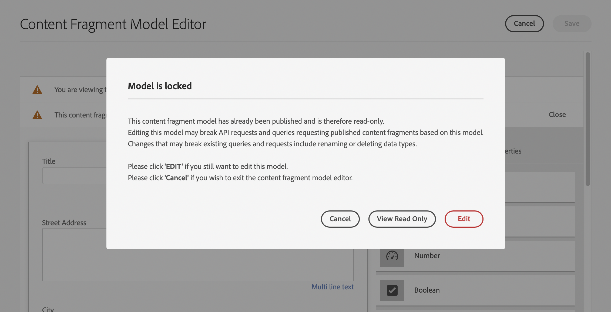

# Inhaltsfragmentmodelle {#content-fragment-models}

>[!IMPORTANT]
>
>Verschiedene Funktionen der Inhaltsfragmentmodelle sind über das Early-Adopter-Programm verfügbar.
>
>Den Status und Informationen zur Bewerbung für das Programm finden Sie in den [Versionshinweisen](/help/release-notes/release-notes-cloud/release-notes-current.md).

In Inhaltsfragmentmodellen in Adobe Experience Manager (AEM) as a Cloud Service wird die Struktur des Inhalts Ihrer [Inhaltsfragmente](/help/sites-cloud/administering/content-fragments/overview.md) definiert. Diese Fragmente können dann für die Seitenbearbeitung oder als Grundlage für Ihre Headless-Inhalte verwendet werden.

So verwenden Sie Inhaltsfragmentmodelle:

1. [Aktivieren Sie die Funktion für Inhaltsfragmentmodelle für Ihre Instanz.](/help/sites-cloud/administering/content-fragments/setup.md)
1. [Erstellen](#creating-a-content-fragment-model) und [konfigurieren](#defining-your-content-fragment-model) Sie Ihre Inhaltsfragmentmodelle.
1. [Aktivieren Ihrer Inhaltsfragmentmodelle](#enabling-disabling-a-content-fragment-model) zur Verwendung beim Erstellen von Inhaltsfragmenten
1. [Lassen Sie Ihre Inhaltsfragmentmodelle in den erforderlichen Asset-Ordnern zu](#allowing-content-fragment-models-assets-folder), indem Sie **Richtlinien** konfigurieren.

## Erstellen eines Inhaltsfragmentmodells {#creating-a-content-fragment-model}

1. Navigieren Sie zu **Tools** > **Allgemein** und öffnen Sie dann **Inhaltsfragmentmodelle**.
1. Navigieren Sie zu dem Ordner, der Ihrer [Konfiguration oder Unterkonfiguration](/help/sites-cloud/administering/content-fragments/setup.md) entspricht.
1. Verwenden Sie **Erstellen**, um den Assistenten zu öffnen.

   >[!CAUTION]
   >
   >Wenn die [Verwendung von Inhaltsfragmentmodellen nicht aktiviert wurde](/help/sites-cloud/administering/content-fragments/setup.md), ist die Option **Erstellen** nicht verfügbar.

1. Geben Sie den **Modelltitel** an.
Sie können auch verschiedene Eigenschaften definieren, zum Beispiel: **Tags**, und eine **Beschreibung** hinzufügen sowie **Modell aktivieren** auswählen, um bei Bedarf das [Modell zu aktivieren](#enabling-disabling-a-content-fragment-model) und die.
   **standardmäßige Echtzeitansicht für URL-Muster** zu definieren.

   >[!NOTE]
   >
   >Weitere Informationen finden Sie unter [Inhaltsfragmentmodell – Eigenschaften](#content-fragment-model-properties).

   

1. Verwenden Sie **Erstellen**, um das leere Modell zu speichern. Eine Meldung zeigt den Erfolg der Aktion an. Sie können **Öffnen** auswählen, um das Modell sofort zu bearbeiten, oder **Fertig**, um zur Konsole zurückzukehren.

>[!CAUTION]
>
>Wenn Sie mehrere referenzierte Fragmente abfragen, wird nicht empfohlen, dass die verschiedenen Fragmentmodelle Feldnamen mit demselben Namen, sondern unterschiedlichen Typen aufweisen.
>
>Weitere Informationen finden Sie unter [AEM GraphQL-API zur Verwendung mit Inhaltsfragmenten – Einschränkungen](/help/headless/graphql-api/content-fragments.md#limitations).

### Inhaltsfragmentmodell – Eigenschaften {#content-fragment-model-properties}

Diese Eigenschaften werden beim Erstellen eines Modells definiert und können später mit der Option **Eigenschaften** für das Inhaltsfragmentmodell definiert werden:

* **Allgemein**
   * **Modell-Titel**
   * **Tags**
   * **Beschreibung**
   * **Modell aktivieren**
   * **Standardmäßige Echtzeitansicht für URL-Muster**
Der Inhaltsfragmenteditor ermöglicht es Autorinnen und Autoren, ihren Inhalt in einer externen Frontend-Anwendung in der **Vorschau** anzuzeigen. Sobald der **Vorschau-Service** konfiguriert ist, können Sie die URL für die Frontend-Anwendung hinzufügen.

     Die Vorschau-URL sollte diesem Muster entsprechen:
`https://<preview_url>?param=${expression}`

     Verfügbare Ausdrücke sind:

      * `${contentFragment.path}`
      * `${contentFragment.model.path}`
      * `${contentFragment.model.name}`
      * `${contentFragment.variation}`
      * `${contentFragment.id}`

   * **Bild hochladen**

<!-- CHECK: currently under FT -->
<!--
* **GraphQL**
  Define names relevant for GraphQL.
  Changing the GraphQL API Name, or Query field names will impact client applications.
  * **API Name**
    Represents the GraphQL type and query field names in the GraphQL schema.
  * **Single Query Field Name**
    Represents the GraphQL single query field name in the GraphQL schema.
  * **Multiple Query Field Name**
    Represents the GraphQL multiple query field name in the GraphQL schema.
-->

## Definieren des Inhaltsfragmentmodells {#defining-your-content-fragment-model}

Das Inhaltsfragmentmodell definiert effektiv die Struktur der resultierenden Inhaltsfragmente unter Verwendung unterschiedlicher **[Datentypen](#data-types)**. Mithilfe des Modell-Editors können Sie Instanzen der Datentypen hinzufügen und diese dann so konfigurieren, dass die erforderlichen Felder erstellt werden:

>[!CAUTION]
>
>Das Bearbeiten eines Modells, das bereits von vorhandenen Inhaltsfragmenten verwendet wird, kann sich auf diese abhängigen Fragmente auswirken.

1. Navigieren Sie zu **Tools** > **Allgemein** und öffnen Sie dann **Inhaltsfragmentmodelle**.

1. Navigieren Sie zu dem Ordner, der Ihr Inhaltsfragmentmodell enthält.
1. Öffnen Sie das zu **bearbeitende** Modell; nutzen Sie dazu entweder die entsprechende Schnellaktion oder wählen Sie das Modell und anschließend die Aktion aus der Symbolleiste aus.

   Nach dem Öffnen zeigt der Modell-Editor Folgendes an:

   * Links: Felder bereits definiert
   * Rechts: verfügbare **Datentypen** für das Erstellen von Feldern (und **Eigenschaften**, die für erstellte Felder verwendet werden können)

   >[!NOTE]
   >
   >Wenn ein Feld als **Pflichtfeld** definiert ist, wird die **Bezeichnung** im linken Bereich mit einem Stern (**&#42;**) markiert.


1. **So fügen Sie ein Feld hinzu**

   * Ziehen Sie einen erforderlichen Datentyp an die entsprechende Stelle für ein Feld:

     

   * Wenn ein Feld zum Modell hinzugefügt wurde, werden im rechten Bereich die **Eigenschaften** angezeigt, die für diesen speziellen Datentyp definiert werden können. Hier können Sie festlegen, was für dieses Feld erforderlich ist.

      * Viele Eigenschaften sind selbsterklärend. Weitere Informationen finden Sie unter [Eigenschaften](#properties).
      * Wenn Sie eine **Feldbeschriftung** eingeben, wird der **Eigenschaftsname** automatisch ausgefüllt, falls das Feld leer ist, und kann anschließend manuell aktualisiert werden.

        >[!CAUTION]
        >
        >Wenn Sie die Eigenschaft **Eigenschaftsname** für einen Datentyp manuell aktualisieren, dürfen die Namen *nur* A–Z, a–z, 0–9 und den Unterstrich „_“ als Sonderzeichen enthalten.
        >
        >Wenn in früheren Versionen von AEM erstellte Modelle unzulässige Zeichen enthalten, entfernen oder ändern Sie diese Zeichen.

     Zum Beispiel:

     

1. **So entfernen Sie ein Feld**

   Wählen Sie das entsprechende Feld aus und wählen Sie das Papierkorb-Symbol aus. Sie werden aufgefordert, die Aktion zu bestätigen.

   

1. Fügen Sie alle erforderlichen Felder hinzu und legen Sie bei Bedarf die zugehörigen Eigenschaften fest. Zum Beispiel:

   

1. Wählen Sie **Speichern**, um die Definition beizubehalten.

## Datentypen {#data-types}

Zum Definieren Ihres Modells stehen unterschiedliche Datentypen zur Verfügung:

* **Einzeilentext**
   * Fügt ein Feld für eine einzelne Textzeile hinzu; die maximale Länge kann definiert werden.
   * Das Feld kann so konfiguriert werden, dass Fragmentautorinnen und -autoren neue Instanzen des Felds erstellen können.

* **Mehrzeilentext**
   * Ein Textbereich, der Rich Text, Nur Text oder Markdown sein kann
   * Das Feld kann so konfiguriert werden, dass Fragmentautorinnen und -autoren neue Instanzen des Felds erstellen können.

  >[!NOTE]
  >
  >Ob es sich bei dem Textbereich um Rich Text, Nur Text oder Markdown handelt, wird im Modell durch die Eigenschaft **Standardtyp** definiert.
  >
  >Dieses Format kann nicht über den [Inhaltsfragmenteditor](/help/sites-cloud/administering/content-fragments/authoring.md), sondern nur vom Modell aus geändert werden.

* **Zahl**
   * Fügt ein numerisches Feld hinzu.
   * Das Feld kann so konfiguriert werden, dass Fragmentautorinnen und -autoren neue Instanzen des Felds erstellen können.

* **Boolesch**
   * Fügen Sie ein boolesches Kontrollkästchen hinzu.

* **Datum und Uhrzeit**
   * Fügt ein Datums- und/oder Zeitfeld hinzu.

* **Aufzählung**
   * Fügt einen Satz Kontrollkästchen, Optionsfelder oder Dropdown-Felder hinzu.
      * Sie können die für Fragmentautorinnen und -autoren verfügbaren Optionen festlegen.

* **Tags**
   * Ermöglicht Fragmentautoren den Zugriff auf und die Auswahl von Tag-Bereichen.
* **Fragmentreferenz**
   * Verweist auf andere Inhaltsfragmente. Kann zum [Erstellen verschachtelter Inhalte](#using-references-to-form-nested-content) verwendet werden.
   * Der Datentyp kann so konfiguriert werden, dass Fragmentautoren folgende Möglichkeiten haben:
      * Direktes Bearbeiten des referenzierten Fragments
      * Erstellen eines neuen Inhaltsfragments basierend auf dem entsprechenden Modell
      * Erstellen neuer Instanzen des Felds
   * Die Referenz gibt den Pfad zur referenzierten Ressource an, z. B. `/content/dam/path/to/resource`.
* **Fragmentreferenz (UUID)**
   * Verweist auf andere Inhaltsfragmente. Kann zum [Erstellen verschachtelter Inhalte](#using-references-to-form-nested-content) verwendet werden.
   * Der Datentyp kann so konfiguriert werden, dass Fragmentautoren folgende Möglichkeiten haben:
      * Direktes Bearbeiten des referenzierten Fragments
      * Erstellen eines neuen Inhaltsfragments basierend auf dem entsprechenden Modell
      * Erstellen neuer Instanzen des Felds
   * Im Editor gibt die Referenz den Pfad zur referenzierten Ressource an. Intern wird die Referenz als Universally Unique ID (UUID) gespeichert, die auf die Ressource verweist.
      * Sie müssen die UUID nicht kennen. Sie können im Fragmenteditor zum gewünschten Fragment navigieren.

* **Inhaltsreferenz**
   * Verweist auf andere Inhalte jeden Typs. Kann zum [Erstellen verschachtelter Inhalte](#using-references-to-form-nested-content) verwendet werden.
   * Wenn ein Bild referenziert wird, kann wahlweise eine Miniatur angezeigt werden.
   * Das Feld kann so konfiguriert werden, dass Fragmentautorinnen und -autoren neue Instanzen des Felds erstellen können.
   * Die Referenz gibt den Pfad zur referenzierten Ressource an, z. B. `/content/dam/path/to/resource`.
* **Inhaltsreferenz (UUID)**
   * Verweist auf andere Inhalte jeden Typs. Kann zum [Erstellen verschachtelter Inhalte](#using-references-to-form-nested-content) verwendet werden.
   * Wenn ein Bild referenziert wird, kann wahlweise eine Miniatur angezeigt werden.
   * Das Feld kann so konfiguriert werden, dass Fragmentautorinnen und -autoren neue Instanzen des Felds erstellen können.
   * Im Editor gibt die Referenz den Pfad zur referenzierten Ressource an. Intern wird die Referenz als Universally Unique ID (UUID) gespeichert, die auf die Ressource verweist.
      * Sie müssen die UUID nicht kennen. Sie können im Fragmenteditor zur gewünschten Asset-Ressource navigieren.

* **JSON-Objekt**
   * Ermöglicht es der Autorin bzw. dem Autor des Inhaltsfragments, JSON-Syntax in die entsprechenden Elemente eines Fragments einzugeben.
      * Damit AEM direktes JSON speichern kann, das Sie von einem anderen Service kopiert/eingefügt haben.
      * Das JSON wird weitergegeben und als JSON in GraphQL ausgegeben.
      * Umfasst JSON-Syntaxhervorhebung, automatische Vervollständigung und Fehlerhervorhebung im Inhaltsfragmenteditor.

* **Registerkarten-Platzhalter**
   * Ermöglicht die Einführung von Registerkarten zur Bearbeitung des Inhalts von Inhaltsfragmenten.
      * Dies wird als Trennzeichen im Modell-Editor angezeigt, das Abschnitte der Liste der Inhaltsdatentypen trennt. Jede Instanz stellt den Beginn einer neuen Registerkarte dar.
      * Im Fragment-Editor wird jede Instanz als Registerkarte angezeigt.

     >[!NOTE]
     >
     >Dieser Datentyp dient ausschließlich zur Formatierung und wird vom GraphQL-Schema von AEM ignoriert.

## Eigenschaften {#properties}

Viele Eigenschaften sind selbsterklärend. Im Folgenden finden Sie weitere Informationen zu bestimmten Eigenschaften:

* **Eigenschaftsname**

  Wenn Sie diese Eigenschaft für einen Datentyp manuell aktualisieren, **dürfen** die Namen *nur* A–Z, a–z, 0–9 und den Unterstrich „_“ als Sonderzeichen enthalten.

  >[!CAUTION]
  >
  >Wenn in früheren Versionen von AEM erstellte Modelle unzulässige Zeichen enthalten, entfernen oder ändern Sie diese Zeichen.

* **Rendern als**

  Die verschiedenen Möglichkeiten, das Feld in einem Fragment zu erstellen/zu rendern. Oft können Sie damit festlegen, ob dem Autor oder der Autorin nur eine einzige Instanz des Feldes angezeigt wird oder ob mehrere Instanzen erstellt werden dürfen. Wenn **Mehrere Felder** verwendet wird, können Sie die Mindest- und Höchstanzahl der Elemente definieren. Siehe [Validierung](#validation) für weitere Informationen.

* **Feldbezeichnung**
Das Eingeben einer **Feldbezeichnung** generiert automatisch einen **Eigenschaftsnamen**, der dann bei Bedarf manuell aktualisiert werden kann.

* **Validierung**
Die grundlegende Basic ist mittels Mechanismen wie etwa die Eigenschaft **Erforderlich** verfügbar. Einige Datentypen verfügen über zusätzliche Validierungsfelder. Weitere Informationen finden Sie unter [Validierung](#validation).

* Beim Datentyp **Mehrzeilentext** können Sie den **Standardtyp** folgendermaßen definieren:

   * **Rich-Text**
   * **Markdown**
   * **Nur Text**

  Wenn Sie keinen Typ angeben, wird der Standardwert **Rich-Text** in diesem Feld verwendet.

  Änderungen am **Standardtyp** in einem Fragmentmodell werden erst dann auf vorhandene, zugehörige Inhaltsfragmente angewendet, wenn das Fragment im Editor geöffnet und gespeichert wurde.

* **Eindeutig**
Der Inhalt (für das spezifische Feld) muss für alle Inhaltsfragmente, die anhand des aktuellen Modells erstellt werden, eindeutig sein.

  Dadurch wird sichergestellt, dass Inhaltsersteller Content, der bereits einem anderen Fragment desselben Modells hinzugefügt wurde, nicht wiederholen können.

  Beispielsweise kann ein **einzeiliges Textfeld** mit dem Namen `Country` im Inhaltsfragmentmodell nicht den Wert `Japan` in zwei abhängigen Inhaltsfragmenten haben. Eine Warnung wird ausgegeben, wenn versucht wird, eine zweite Instanz zu erstellen.

  >[!NOTE]
  >
  >Die Eindeutigkeit wird pro Sprachstamm gewährleistet.

  >[!NOTE]
  >
  >Varianten können denselben *eindeutigen* Wert haben wie Varianten desselben Fragments, jedoch nicht denselben Wert wie Varianten anderer Fragmente.

* Weitere Informationen zu diesem bestimmten Datentyp und seinen Eigenschaften finden Sie unter **[Inhaltsreferenz](#content-reference)**.

* Weitere Informationen zu diesem bestimmten Datentyp und seinen Eigenschaften finden Sie unter **[Fragmentreferenz (verschachtelte Fragmente)](#fragment-reference-nested-fragments)**.

* **Übersetzbar**

  Durch Aktivieren des Kontrollkästchens **Übersetzbar** für ein Feld im Editor für Inhaltsfragmentmodelle geschieht Folgendes:

   * Es wird sichergestellt, dass der Eigenschaftsname zur Übersetzungskonfiguration im Kontext `/content/dam/<sites-configuration>` hinzugefügt wird, falls er noch nicht vorhanden ist.
   * Für GraphQL: Im Inhaltsfragmentfeld wird die Eigenschaft `<translatable>` auf `yes` festgelegt, um den GraphQL-Abfragefilter für die JSON-Ausgabe nur mit übersetzbarem Inhalt zuzulassen.

## Validierung {#validation}

Verschiedene Datentypen bieten jetzt die Möglichkeit, Validierungsanforderungen für den Zeitpunkt zu definieren, an dem Inhalt in das resultierende Fragment eingefügt wird:

* **Einzeilentext**
   * Führen Sie einen Vergleich mit einem vordefinierten Regex durch.
* **Zahl**
   * Suchen Sie nach bestimmten Werten.
* **Inhaltsreferenz**
   * Testen Sie, ob bestimmte Content-Typen vorhanden sind.
   * Es können nur Assets bis zur angegebenen maximalen Dateigröße referenziert werden.
   * Es können nur Bilder in einem vordefinierten Bereich von Breite und/oder Höhe (in Pixel) referenziert werden.
* **Fragmentreferenz**
   * Testen Sie, ob ein bestimmtes Inhaltsfragmentmodell vorhanden ist.
* **Mindestanzahl der Elemente**/**Maximale Anzahl der Elemente**

  Felder, die als **Mehrere Felder** festgelegt wurden (mit **Rendern als**) haben die Optionen:

   * **Mindestanzahl der Elemente**
   * **Maximale Anzahl der Elemente**

  Diese werden im [Inhaltsfragmenteditor](/help/sites-cloud/administering/content-fragments/authoring.md) validiert.

## Verwenden von Verweisen, um verschachtelten Inhalt zu bilden {#using-references-to-form-nested-content}

Inhaltsfragmente können mit einem der folgenden Datentypen verschachtelte Inhalte bilden:

* [Inhaltsreferenz](#content-reference)
   * Bietet einen einfachen Verweis auf andere Inhalte eines beliebigen Typs.
   * Bereitgestellt von den Datentypen:
      * **Inhaltsreferenz** – pfadbasiert
      * **Inhaltsreferenz (UUID)** – UUID-basiert
   * Kann für eine oder mehrere Referenzen konfiguriert werden (im resultierenden Fragment).

* [Fragmentreferenz](#fragment-reference-nested-fragments) (verschachtelte Fragmente)
   * Verweist auf andere Fragmente, abhängig von den angegebenen Modellen.
   * Bereitgestellt von den Datentypen:
      * **Fragmentreferenz** – pfadbasiert
      * **Fragmentreferenz (UUID)** – UUID-basiert
   * Ermöglicht das Einschließen/Abrufen strukturierter Daten.

     >[!NOTE]
     >
     >Diese Methode ist vor allem bei der Verwendung in Verbindung mit der [Headless-Inhaltsbereitstellung mittels Inhaltsfragmenten mit GraphQL](/help/sites-cloud/administering/content-fragments/content-delivery-with-graphql.md) interessant.
   * Kann für eine oder mehrere Referenzen konfiguriert werden (im resultierenden Fragment).

>[!NOTE]
>
>Weitere Informationen zu „Inhaltsreferenz“ bzw. „Fragmentreferenz“ und „Inhaltsreferenz (UUID) bzw. „Fragmentreferenz (UUID)“ sowie zum Aktualisieren auf UUID-basierte Datentypen finden Sie unter [Aktualisieren Ihrer Inhaltsfragmente für UUID-Referenzen](/help/headless/graphql-api/uuid-reference-upgrade.md).

>[!NOTE]
>
>AEM bietet Schutz vor Wiederholungen für:
>
>* Inhaltsverweise
>Dies verhindert, dass Benutzende einen Verweis zum aktuellen Fragment hinzufügen, und kann zu einem leeren Auswahldialogfeld „Fragmentreferenz“ führen.
>
>* Fragmentverweise in GraphQL
>Wenn Sie eine Deep-Abfrage erstellen, die mehrere, sich gegenseitig referenzierende Inhaltsfragmente zurückgibt, gibt sie beim ersten Auftreten NULL zurück.

>[!CAUTION]
>
>Wenn Sie mehrere referenzierte Fragmente abfragen, wird nicht empfohlen, dass die verschiedenen Fragmentmodelle Feldnamen mit demselben Namen, sondern unterschiedlichen Typen aufweisen.
>
>Weitere Informationen finden Sie unter [AEM GraphQL-API zur Verwendung mit Inhaltsfragmenten – Einschränkungen](/help/headless/graphql-api/content-fragments.md#limitations).

### Inhaltsreferenz {#content-reference}

Mit den Datentypen **Inhaltsreferenz** und **Inhaltsreferenz (UUID)** können Sie Inhalte aus einer anderen Quelle rendern, z. B. ein Bild, eine Seite oder ein Experience Fragment.

Zusätzlich zu den Standardeigenschaften können Sie Folgendes angeben:

* Das **Stammverzeichnis**, das angibt, wo referenzierte Inhalte gespeichert werden sollen
  >[!NOTE]
  >
  >Dies ist erforderlich, wenn Sie mit dem Inhaltsfragmenteditor Bilder in diesem Feld direkt hochladen und referenzieren möchten.
  >
  >Siehe [Bilder referenzieren](/help/sites-cloud/administering/content-fragments/authoring.md#reference-images) für weitere Informationen.

* Die Inhaltstypen, auf die verwiesen werden kann
  >[!NOTE]
  >
  >Dazu gehören **Bilder**, wenn Sie mit dem Inhaltsfragmenteditor Bilder in diesem Feld direkt hochladen und referenzieren möchten.
  >
  >Siehe [Bilder referenzieren](/help/sites-cloud/administering/content-fragments/authoring.md#reference-images) für weitere Informationen.

* Einschränkungen bezüglich der Dateigrößen
* Wenn ein Bild referenziert wird:
   * Miniatur anzeigen
   * Bildeinschränkungen hinsichtlich Höhe und Breite


### Fragmentreferenz (verschachtelte Fragmente) {#fragment-reference-nested-fragments}

Die Datentypen **Fragmentreferenz** und **Fragmentreferenz (UUID)** können auf ein oder mehrere Inhaltsfragmente verweisen. Diese Funktion ist besonders beim Abrufen von Inhalten für die Verwendung in Ihrem Programm interessant, da sie es Ihnen ermöglicht, strukturierte Daten mit mehreren Ebenen abzurufen.

Zum Beispiel:

* Ein Modell, das Details für eine Mitarbeiterin oder einen Mitarbeiter definiert, beispielsweise:
   * Ein Verweis auf das Modell, das den Arbeitgeber (Firma) definiert

```xml
type EmployeeModel {
    name: String
    firstName: String
    company: CompanyModel
}

type CompanyModel {
    name: String
    street: String
    city: String
}
```

>[!NOTE]
>
>Fragmentreferenzen sind für die [Headless-Bereitstellung von Inhalten mithilfe von Inhaltsfragmenten mit GraphQL](/help/sites-cloud/administering/content-fragments/content-delivery-with-graphql.md) besonders interessant.

Zusätzlich zu den Standardeigenschaften können Sie Folgendes definieren:

* **Rendern als**:

   * **multifield**: Der Fragmentautor kann mehrere einzelne Verweise erstellen.

   * **fragmentreference**: Der Fragmentautor kann einen einzelnen Verweis auf ein Fragment auswählen.

* **Modelltyp**
Es können mehrere Modelle ausgewählt werden. Beim Hinzufügen von Referenzen zu einem Inhaltsfragment müssen alle referenzierten Fragmente mit diesen Modellen erstellt worden sein.

* **Stammpfad**
Gibt einen Stammpfad für referenzierte Fragmente an.

* **Fragmenterstellung zulassen**

  Auf diese Weise kann die Autorin oder der Autor des Fragments ein Fragment auf der Grundlage des entsprechenden Modells erstellen.

   * **fragmentreferencecomposite**: Ermöglicht dem Fragmentautor das Erstellen einer Composite-Datei durch Auswahl mehrerer Fragmente.

  

>[!NOTE]
>
>Es gibt einen Mechanismus zum Wiederholungsschutz. Er hindert Benutzende daran, das aktuelle Inhaltsfragment in der Fragmentreferenz auszuwählen, und kann zu einem leeren Auswahldialogfeld der Fragmentreferenzen führen.
>
>Es gibt auch einen Wiederholungsschutz für Fragmentreferenzen in GraphQL. Wenn Sie eine tiefe Abfrage über zwei Inhaltsfragmente hinweg erstellen, die gegenseitig aufeinander verweisen, wird null zurückgegeben.

## Aktivieren oder Deaktivieren von Inhaltsfragmentmodellen {#enabling-disabling-a-content-fragment-model}

Sie können Ihre Inhaltsfragmentmodelle **aktivieren** oder **deaktivieren**, um deren Verwendung vollständig zu kontrollieren.

### Aktivieren eines Inhaltsfragmentmodells {#enabling-a-content-fragment-model}

Nachdem ein Modell erstellt wurde, muss es aus folgenden Gründen aktiviert werden:

* Damit es zur Auswahl steht, wenn ein neues Inhaltsfragment erstellt wird.
* Damit es in einem Inhaltsfragmentmodell referenziert werden kann.
* Damit es für GraphQL verfügbar ist, sodass das Schema generiert wird.

So aktivieren Sie ein Modell, das folgendermaßen gekennzeichnet ist:

* **Entwurf**: neu (noch nie aktiviert).
* **Deaktiviert**: wurde eigens deaktiviert.

Sie verwenden die Option **Aktivieren** aus einem der folgenden Bereiche:

* Die obere Symbolleiste, wenn das erforderliche Modell ausgewählt ist.
* Die entsprechende Schnellaktion (bewegen Sie den Mauszeiger über das entsprechende Modell).


### Deaktivieren eines Inhaltsfragmentmodells {#disabling-a-content-fragment-model}

Ein Modell lässt sich auch aus folgenden Gründen deaktivieren:

* Das Modell ist nicht mehr als Grundlage für die Erstellung *neuer* Inhaltsfragmente verfügbar.
* Beachten Sie jedoch Folgendes:
   * Das GraphQL-Schema wird weiterhin generiert und kann weiterhin abgefragt werden (um eine Beeinträchtigung der JSON-API zu vermeiden).
   * Inhaltsfragmente, die auf dem Modell basieren, können weiterhin abgefragt und vom GraphQL-Endpunkt zurückgegeben werden.
* Das Modell kann nicht mehr referenziert werden. Vorhandene Referenzen bleiben jedoch unverändert und können weiterhin abgefragt und vom GraphQL-Endpunkt zurückgegeben werden.

Um ein Modell zu deaktivieren, das als **Aktiviert** gekennzeichnet ist, verwenden Sie die Option **Deaktivieren** aus einem der folgenden Bereiche:

* Die obere Symbolleiste, wenn das erforderliche Modell ausgewählt ist.
* Die entsprechende Schnellaktion (bewegen Sie den Mauszeiger über das entsprechende Modell).


## Zulassen von Inhaltsfragmentmodellen im Asset-Ordner {#allowing-content-fragment-models-assets-folder}

Zur Implementierung der Inhaltsverwaltung können Sie **Richtlinien** im Asset-Ordner konfigurieren, um zu steuern, welche Inhaltsfragmentmodelle für die Fragmenterstellung in diesem Ordner zulässig sind.

>[!NOTE]
>
>Der Mechanismus ähnelt dem [Zulassen von Seitenvorlagen](/help/sites-cloud/authoring/page-editor/templates.md#allowing-a-template-author) für eine Seite und deren untergeordnete Elemente in den erweiterten Eigenschaften einer Seite.

So konfigurieren Sie die **Richtlinien** für **Zulässige Inhaltsfragmentmodelle**:

1. Navigieren Sie zum gewünschten Asset-Ordner und öffnen Sie **Eigenschaften**.

1. Öffnen Sie die Registerkarte **Richtlinien**, in der Sie Folgendes konfigurieren können:

   * **Vererbt von`<folder>`**

     Richtlinien werden beim Erstellen untergeordneter Ordner automatisch übernommen. Die Richtlinie kann neu konfiguriert (und die Vererbung aufgehoben) werden, wenn für Unterordner Modelle zugelassen werden müssen, die vom übergeordneten Ordner abweichen.

   * **Zugelassene Inhaltsfragmentmodelle nach Pfad**

     Es können mehrere Modelle zugelassen werden.

   * **Zugelassene Inhaltsfragmentmodelle nach Tag**

     Es können mehrere Modelle zugelassen werden.

   

1. **Speichern** Sie die Änderungen.

Die für einen Ordner zulässigen Inhaltsfragmentmodelle werden wie folgt aufgelöst:
* Die **Richtlinien** für **Zulässige Inhaltsfragmentmodelle**.
* Falls leer, versuchen Sie, die Richtlinie mithilfe der Vererbungsregeln zu bestimmen.
* Wenn die Vererbungskette kein Ergebnis liefert, prüfen Sie die **Cloud Services**-Konfiguration für diesen Ordner (auch zuerst direkt und dann über Vererbung).
* Wenn keines der oben genannten Verfahren Ergebnisse liefert, gibt es keine zulässigen Modelle für diesen Ordner.

## Löschen eines Inhaltsfragmentmodells {#deleting-a-content-fragment-model}

>[!CAUTION]
>
>Das Löschen eines Inhaltsfragmentmodells kann sich auf abhängige Fragmente auswirken.

So löschen Sie ein Inhaltsfragmentmodell:

1. Navigieren Sie zu **Tools** > **Allgemein** und öffnen Sie dann **Inhaltsfragmentmodelle**.

1. Navigieren Sie zu dem Ordner, der Ihr Inhaltsfragmentmodell enthält.
1. Wählen Sie Ihr Modell und anschließend die Option **Löschen** aus der Symbolleiste aus.

   >[!NOTE]
   >
   >Wenn auf das Modell verwiesen wird, wird eine Warnung angezeigt, damit Sie entsprechende Maßnahmen treffen können.

## Veröffentlichen eines Inhaltsfragmentmodells {#publishing-a-content-fragment-model}

Inhaltsfragmentmodelle müssen zeitgleich mit oder im Vorfeld der Veröffentlichung abhängiger Inhaltsfragmente veröffentlicht werden.

So veröffentlichen Sie ein Inhaltsfragmentmodell:

1. Navigieren Sie zu **Tools** > **Allgemein** und öffnen Sie dann **Inhaltsfragmentmodelle**.

1. Navigieren Sie zu dem Ordner, der Ihr Inhaltsfragmentmodell enthält.
1. Wählen Sie Ihr Modell und anschließend die Option **Veröffentlichen** aus der Symbolleiste aus.
Der Status „Veröffentlicht“ wird in der Konsole angezeigt.

   >[!NOTE]
   >
   >Wenn Sie Inhaltsfragmente veröffentlichen, deren Modell noch nicht veröffentlicht wurde, wird dies in der Auswahlliste angezeigt und das Modell mit dem Fragment veröffentlicht.

## Rückgängigmachen der Veröffentlichung eines Inhaltsfragmentmodells {#unpublishing-a-content-fragment-model}

Die Veröffentlichung von Inhaltsfragmentmodellen kann rückgängig gemacht werden, sofern sie nicht von Fragmenten referenziert werden.

So machen Sie die Veröffentlichung eines Inhaltsfragmentmodells rückgängig:

1. Navigieren Sie zu **Tools** > **Allgemein** und öffnen Sie dann **Inhaltsfragmentmodelle**.

1. Navigieren Sie zu dem Ordner, der Ihr Inhaltsfragmentmodell enthält.
1. Wählen Sie Ihr Modell und anschließen die Option **Veröffentlichung aufheben** aus der Symbolleiste aus.
Der Status „Veröffentlicht“ wird in der Konsole angezeigt.

Wenn Sie versuchen, die Veröffentlichung eines Modells aufzuheben, das aktuell von einem oder mehreren Fragmenten verwendet wird, dann wird Ihnen eine Fehlermeldung angezeigt. Zum Beispiel:


In der Meldung wird vorgeschlagen, dass Sie das Bedienfeld [Verweise](/help/sites-cloud/authoring/basic-handling.md#references) überprüfen, um weitere Nachforschungen anzustellen:


## Gesperrte (veröffentlichte) Inhaltsfragmentmodelle {#locked-published-content-fragment-models}

Diese Funktion bietet Governance für Inhaltsfragmentmodelle, die veröffentlicht wurden.

### Die Herausforderung {#the-challenge}

* Inhaltsfragmentmodelle bestimmen das Schema für GraphQL-Abfragen in AEM.

   * AEM GraphQL-Schemas werden erstellt, sobald ein Inhaltsfragmentmodell erstellt wird, und sie können in der Autoren- und Veröffentlichungsumgebung vorhanden sein.

   * Schemas in der Veröffentlichungsinstanz sind die wichtigsten, da sie die Grundlage für die Live-Bereitstellung von Inhaltsfragmentinhalten im JSON-Format bieten.

* Probleme können auftreten, wenn Inhaltsfragmentmodelle geändert oder bearbeitet werden. Das bedeutet, dass sich das Schema ändert, was wiederum vorhandene GraphQL-Abfragen beeinflussen kann.

* Das Hinzufügen neuer Felder zu einem Inhaltsfragmentmodell sollte (in der Regel) keine schädlichen Auswirkungen haben. Wenn Sie jedoch vorhandene Datenfelder (z. B. deren Namen) ändern oder Felddefinitionen löschen, werden vorhandene GraphQL-Abfragen bei der Anforderung dieser Felder beschädigt.

### Die Voraussetzungen {#the-requirements}

* Anwender wurden auf die Risiken aufmerksam gemacht, die bei der Bearbeitung von Modellen auftreten, die bereits für die Bereitstellung von Live-Inhalten verwendet werden (d. h. von Modellen, die veröffentlicht wurden).

* Außerdem die Vermeidung von unbeabsichtigten Änderungen.

In beiden Fällen können Abfragen beschädigt werden, wenn die geänderten Modelle erneut veröffentlicht werden.

### Die Lösung {#the-solution}

Um diese Probleme zu lösen, werden die Inhaltsfragmentmodelle in der Autorenumgebung durch einen SCHREIBGESCHÜTZTEN Modus *gesperrt*, sobald sie veröffentlicht wurden. Dieser Status wird durch **Gesperrt** angezeigt:


Wenn das Modell **Gesperrt** ist (im schreibgeschützten Modus), können Sie die Inhalte und die Struktur der Modelle anzeigen, sie jedoch nicht bearbeiten.

Sie können **Gesperrte** Modelle entweder aus der Konsole heraus oder im Modell-Editor verwalten:

* Konsole

  In der Konsole können Sie den SCHREIBGESCHÜTZTEN Modus mit den Aktionen **Entsperren** und **Sperren** in der Symbolleiste verwalten:

  

   * Sie können ein Modell zum Aktivieren von Bearbeitungen **Entsperren**.

     Wenn Sie **Entsperren** wählen, wird eine Warnung angezeigt, und Sie müssen die **Entsperren**-Aktion bestätigen:
     

     Anschließend können Sie das Modell zum Bearbeiten öffnen.

   * Sie können das Modell anschließend auch wieder **Sperren**.
   * Wenn Sie das Modell erneut veröffentlichen, wird es sofort wieder in den Modus **Gesperrt** (SCHREIBGESCHÜTZT) zurückgesetzt.

* Modell-Editor

   * Wenn Sie ein gesperrtes Modell öffnen, werden Sie gewarnt und es werden Ihnen drei Aktionen angezeigt: **Abbrechen**, **Schreibgeschützt anzeigen**, **Bearbeiten**:

     

   * Wenn Sie **Schreibgeschützt anzeigen** auswählen, können Sie den Inhalt und die Struktur des Modells sehen:

     

   * Wenn Sie **Bearbeiten** auswählen, können Sie Ihre Änderungen bearbeiten und speichern:

     

     >[!NOTE]
     >
     >Oben kann noch eine Warnung angezeigt werden. In diesem Fall wird das Modell jedoch bereits von vorhandenen Inhaltsfragmenten verwendet.

   * Mit **Abbrechen** kehren Sie zur Konsole zurück.
