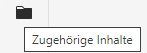
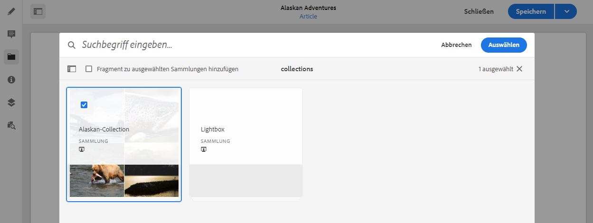
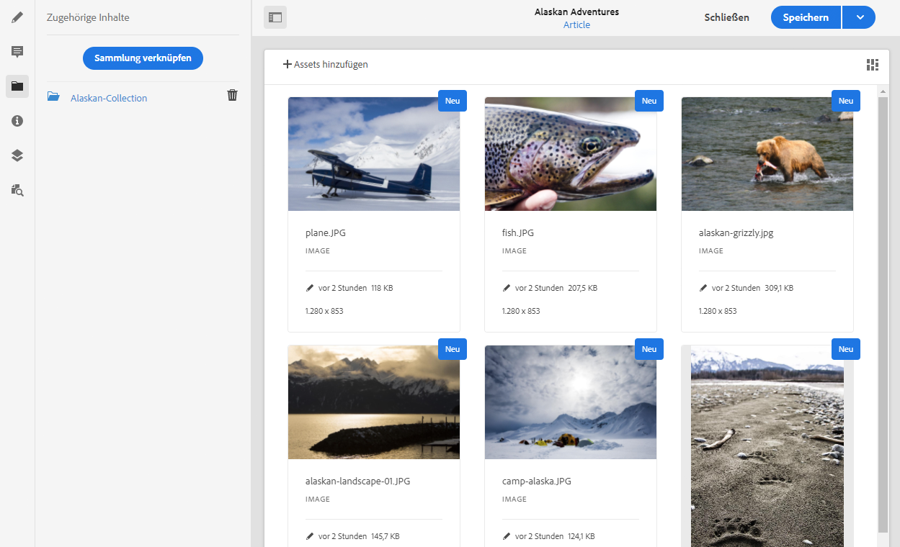

# Zugehörige Inhalte{#associated-content}

AEM Funktion für verknüpfte Inhalte stellt die Verbindung bereit, damit Assets optional mit dem Fragment verwendet werden können, wenn es zu einer Inhaltsseite hinzugefügt wird, indem [Bereitstellung einer Reihe von Assets, auf die bei Verwendung des Inhaltsfragments auf einer Seite zugegriffen werden kann,](/help/sites-cloud/authoring/fundamentals/content-fragments.md#using-associated-content) Außerdem können Sie den Zeitaufwand für die Suche nach dem entsprechenden Asset reduzieren. Dies bietet auch Flexibilität bei der Bereitstellung von Headless Content.

## Hinzufügen von zugehörigen Inhalten {#adding-associated-content}

>[!NOTE]
>
>Es gibt verschiedene Methoden zum Hinzufügen von [visuelle Assets (z. B. Bilder)](/help/sites-cloud/administering/content-fragments/content-fragments.md#fragments-with-visual-assets) auf das Fragment und/oder die Seite.

Um zugehörige Inhalte zu verknüpfen, müssen zunächst [Medien-Assets zu einer Sammlung hinzugefügt werden](/help/assets/manage-collections.md). Danach können Sie Folgendes tun:

1. Öffnen Sie das Fragment und wählen Sie im seitlichen Bedienfeld **Zugehörige Inhalte** aus.

   

1. Je nachdem, ob bereits Sammlungen zugeordnet wurden oder nicht, wählen Sie eine der folgenden Optionen aus:

   * **Inhalt verknüpfen**: dies wird die erste zugehörige Sammlung
   * **Sammlung verknüpfen**: Zugehörige Sammlungen sind bereits konfiguriert

1. Wählen Sie die erforderliche Sammlung aus.

   Optional können Sie das eigentliche Fragment zur ausgewählten Sammlung hinzufügen. Dies hilft bei der Nachverfolgung.

   

1. Bestätigen (mit **Auswählen**). Die Sammlung wird als verknüpft aufgeführt.

   

## Bearbeiten zugehöriger Inhalte {#editing-associated-content}

Nachdem Sie eine Sammlung zugewiesen haben, können Sie Folgendes tun:

* Die Verknüpfung **entfernen**.
* Der Sammlung **Assets hinzufügen**.
* Ein Asset für weitere Aktionen auswählen.
* Das Asset bearbeiten.
