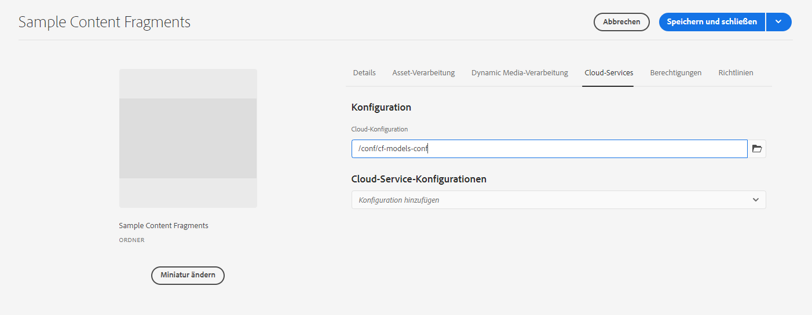

# Inhaltsfragmente – Konfigurations-Browser{#content-fragments-configuration-browser}

Erfahren Sie, wie Sie bestimmte Inhaltsfragmentfunktionen im Konfigurations-Browser aktivieren.

## Aktivieren der Funktionen für Inhaltsfragmente für Ihre Instanz {#enable-content-fragment-functionality-instance}

Bevor Sie Inhaltsfragmente verwenden können, müssen Sie den **Konfigurations-Browser** verwenden, um Folgendes zu aktivieren:

* **Inhaltsfragmentmodelle** – obligatorisch
* **GraphQL: Beständige Abfragen** – optional

>[!CAUTION]
>
>Wenn Sie **Inhaltsfragmentmodelle** nicht aktivieren:
>
>* ist die Option **Erstellen** für das Erstellen neuer Modelle nicht verfügbar.
>* können Sie die [Sites-Konfiguration nicht auswählen, um den entsprechenden Endpunkt zu erstellen](/help/headless/graphql-api/graphql-endpoint.md).

Gehen Sie wie folgt vor, um die Inhaltsfragmentfunktionen zu aktivieren:

* Aktivieren Sie die Verwendung der Inhaltsfragmentfunktionen im Konfigurations-Browser.
* Wenden Sie die Konfiguration auf Ihren Assets-Ordner an.

### Aktivieren der Funktionen für Inhaltsfragmente im Konfigurations-Browser {#enable-content-fragment-functionality-in-configuration-browser}

Um [bestimmte Inhaltsfragmentfunktionen zu verwenden](#creating-a-content-fragment-model), **müssen** Sie diese zunächst über den **Konfigurations-Browser** aktivieren:

>[!NOTE]
>
>Weitere Informationen finden Sie auch unter [Konfigurations-Browser](/help/implementing/developing/introduction/configurations.md#using-configuration-browser).

>[!NOTE]
>
>[Unterkonfigurationen](/help/implementing/developing/introduction/configurations.md#configuration-resolution) (eine Konfiguration, die in einer anderen Konfiguration verschachtelt ist) werden vollständig zur Verwendung mit Inhaltsfragmenten, Inhaltsfragmentmodellen und GraphQL-Abfragen unterstützt.
>
>Beachten Sie Folgendes:
>
>
>* Nach dem Erstellen von Modellen in einer Unterkonfiguration ist es NICHT möglich, das Modell in eine andere Unterkonfiguration zu verschieben oder zu kopieren.
>
>* Ein GraphQL-Endpunkt basiert (weiterhin) auf einer übergeordneten (Stamm-)Konfiguration.
>
>* Beständige Abfragen werden (weiterhin) gespeichert und sind für die übergeordnete (Stamm-)Konfiguration relevant.

1. Navigieren Sie zu **Tools** > **Allgemein** und öffnen Sie dann den **Konfigurations-Browser**.

1. Öffnen Sie über **Erstellen** das Dialogfeld, in dem Sie:

   1. einen **Titel** angeben,
   1. Der **Name** wird zum Knotennamen im Repository.
      * Er wird automatisch auf der Grundlage des Titels generiert und gemäß den [AEM-Benennungskonventionen](/help/implementing/developing/introduction/naming-conventions.md) angepasst.
      * Sie können sie bei Bedarf anpassen.
   1. Um ihre Verwendung zu aktivieren, wählen Sie
      * **Inhaltsfragmentmodelle**
      * **GraphQL – Persistente Abfragen**

      

1. Wählen Sie **Erstellen** aus, um die Definition zu speichern.

<!-- 1. Select the location appropriate to your website. -->

### Wenden Sie die Konfiguration auf Ihren Ordner an {#apply-the-configuration-to-your-folder}

Wenn die Konfiguration **global** für die Funktion für Inhaltsfragmente aktiviert ist, gilt dies für alle Assets-Ordner, die über die **Assets**-Konsole zugänglich ist.

Um eine andere Konfiguration (d. h. nicht „Global“) mit einem vergleichbaren Assets-Ordner zu verwenden, müssen Sie die Verbindung definieren. Wählen Sie dazu die entsprechende **Konfiguration** in der Registerkarte **Cloud-Services** der **Ordnereigenschaften** des entsprechenden Ordners aus.

