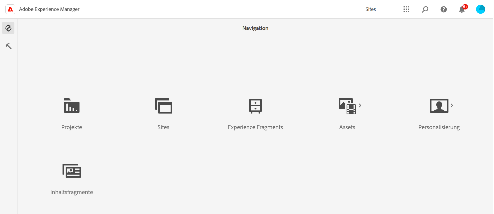
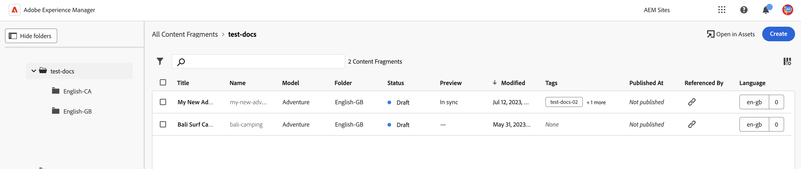
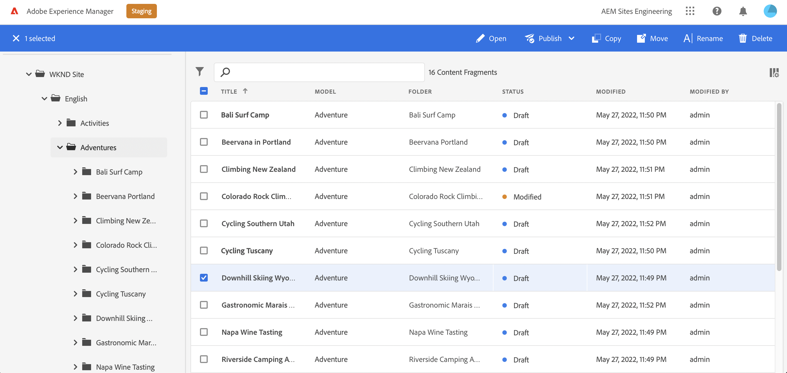
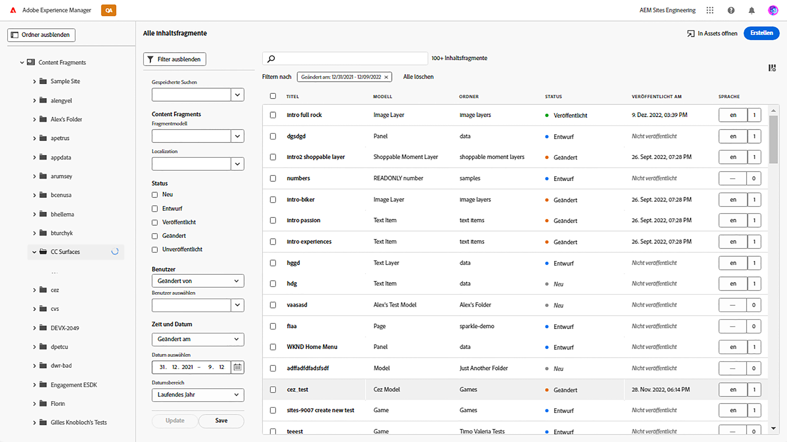

# Inhaltsfragmentkonsole  {#content-fragments-console}

Erfahren Sie, wie die Konsole &quot;Inhaltsfragmente&quot;den Zugriff auf Ihre Inhaltsfragmente optimiert und Sie dabei unterstützt, diese zu erstellen, zu durchsuchen und zu verwalten, indem Sie Verwaltungsaktionen wie die Veröffentlichung, das Rückgängigmachen der Veröffentlichung und das Kopieren durchführen.

Die Konsole &quot;Inhaltsfragmente&quot;dient der Verwaltung, Suche und Erstellung von Inhaltsfragmenten. Es wurde für die Verwendung in einem Headless-Kontext optimiert, wird aber auch beim Erstellen von Inhaltsfragmenten für die Seitenbearbeitung verwendet.

>[!NOTE]
>
>In dieser Konsole werden nur Inhaltsfragmente angezeigt. Andere Asset-Typen wie Bilder und Videos werden nicht angezeigt.

>[!NOTE]
>
>Der Zugriff auf Ihre Inhaltsfragmente ist derzeit über folgende Kanäle möglich:
>
>* this **Inhaltsfragmente** console
>* die **Assets** console - see [Verwalten von Inhaltsfragmenten](/help/assets/content-fragments/content-fragments-managing.md)

>[!NOTE]
>
>Auswahl von [Tastaturbefehle sind in dieser Konsole verfügbar](/help/sites-cloud/administering/content-fragments/content-fragments-console-keyboard-shortcuts.md).

Die Konsole &quot;Inhaltsfragmente&quot;kann direkt von der obersten Ebene der globalen Navigation aus aufgerufen werden:

Auswählen **Inhaltsfragmente** öffnet die Konsole in einer neuen Registerkarte.

Hier können Sie sehen, dass es drei Hauptbereiche gibt:

* die obere Symbolleiste
   * Standard-AEM
   * Zeigt auch Ihre IMS-Organisation an
* Das linke Bedienfeld
   * Hier können Sie die Ordnerstruktur ein- oder ausblenden
   * Sie können einen bestimmten Zweig des Baums auswählen
* Das Haupt-/rechte Bedienfeld - von hier aus können Sie:
   * Liste aller Inhaltsfragmente im ausgewählten Zweig des Baums anzeigen
      * Der Standort wird durch die Breadcrumbs angegeben. diese können auch verwendet werden, um den Standort zu ändern
      * Inhaltsfragmente aus dem ausgewählten Ordner und alle untergeordneten Ordner werden angezeigt
         * Verschiedene Informationsfelder über ein Inhaltsfragment bieten Links. Diese können das entsprechende Fragment im Editor öffnen
      * Sie können eine Spaltenüberschrift auswählen, um die Tabelle nach dieser Spalte zu sortieren. Wählen Sie erneut aus, um zwischen aufsteigender und absteigender
   * **[Erstellen](#creating-new-content-fragment)** ein neues Inhaltsfragment
   * [Filter](#filtering-fragments) die Inhaltsfragmente entsprechend einer Auswahl von Eigenschaften und speichern Sie den Filter für die zukünftige Verwendung
   * [Suche](#searching-fragments) die Inhaltsfragmente
   * Anpassen der Tabellenansicht zum Anzeigen ausgewählter Informationsspalten
   * Verwendung **In Assets öffnen** , um die aktuelle Position direkt im **Assets** Konsole.

      >[!NOTE]
      >
      >Die **Assets** -Konsole wird verwendet, um auf Assets wie Bilder, Videos usw. zuzugreifen.  Auf diese Konsole kann zugegriffen werden:
      >
      >* mithilfe der **In Assets öffnen** Link (in der Konsole &quot;Inhaltsfragmente&quot;)
      >* direkt über das globale Navigationsfenster

Wenn Sie ein bestimmtes Fragment auswählen, wird eine Symbolleiste geöffnet, die sich auf die für dieses Fragment verfügbaren Aktionen konzentriert. Sie können auch mehrere Fragmente auswählen. Die Auswahl der Aktionen wird entsprechend angepasst.

## Erstellen eines neuen Inhaltsfragments {#creating-new-content-fragment}

Auswählen **Erstellen** öffnet den Kompakt **Neues Inhaltsfragment** dialog:

## Filtern von Fragmenten {#filtering-fragments}

Der Bereich Filter bietet folgende Optionen:

* Auswahl an Eigenschaften, die ausgewählt und kombiniert werden können
* die Möglichkeit, **Speichern** Ihre Konfiguration
* die Option zum Abrufen eines gespeicherten Suchfilters für die Wiederverwendung

## Suchen von Fragmenten {#searching-fragments}

Das Suchfeld unterstützt die Volltextsuche. Geben Sie Ihre Suchbegriffe in das Suchfeld ein:

Stellt die ausgewählten Ergebnisse bereit:

Das Suchfeld bietet außerdem schnellen Zugriff auf **Letzte Inhaltsfragmente** und **Gespeicherte Suchen**:

