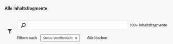

# Inhaltsfragmentkonsole  {#content-fragments-console}

Erfahren Sie, wie die Inhaltsfragmentkonsole den Zugriff auf Ihre Inhaltsfragmente optimiert und Sie dabei unterstützt, diese zu erstellen, zu durchsuchen und zu verwalten, indem Sie Verwaltungsaufgaben durchführen, wie Inhalte veröffentlichen, ihre Veröffentlichung aufheben und Kopien anfertigen.

Die Inhaltsfragmentkonsole dient der Verwaltung, Suche und Erstellung von Inhaltsfragmenten. Sie wurde für die Verwendung in einem Headless-Kontext optimiert, wird aber auch beim Erstellen von Inhaltsfragmenten für die Seitenbearbeitung verwendet.

>[!NOTE]
>
>In dieser Konsole werden nur Inhaltsfragmente angezeigt. Andere Asset-Typen wie Bilder und Videos werden nicht angezeigt.

>[!NOTE]
>
>Der Zugriff auf Ihre Inhaltsfragmente ist derzeit über folgende Kanäle möglich:
>
>* diese **Inhaltsfragmentkonsole**
>* die **Assets**-Konsole – siehe [Verwalten von Inhaltsfragmenten](/help/assets/content-fragments/content-fragments-managing.md)

>[!NOTE]
>
>[In dieser Konsole stehen verschiedene Tastaturbefehle zur Verfügung](/help/sites-cloud/administering/content-fragments/content-fragments-console-keyboard-shortcuts.md).

>[!NOTE]
>
>Ihr Projekt-Team kann die Konsole bei Bedarf anpassen. Weitere Details hierzu finden Sie unter [Anpassen der Inhaltsfragmentkonsole](/help/implementing/developing/extending/content-fragment-console-customizing.md).

Die Inhaltsfragmentkonsole kann direkt von der obersten Ebene der globalen Navigation aus aufgerufen werden:

## Grundlegende Struktur und Handhabung der Konsole {#basic-structure-handling-content-fragments-console}

Wenn Sie **Inhaltsfragmente** auswählen, wird die Konsole in einer neuen Registerkarte geöffnet.

Hier können Sie sehen, dass es drei Hauptbereiche gibt:

* Die obere Symbolleiste
   * Bietet die standardmäßigen AEM-Funktionen
   * Zeigt auch Ihre IMS-Organisation an
* Das linke Bedienfeld
   * Hier können Sie die Ordnerstruktur ein- oder ausblenden
   * Sie können einen bestimmten Zweig des Baums auswählen
   * Diese Größe kann so geändert werden, dass verschachtelte Ordner angezeigt werden
* Das Haupt-/rechte Bedienfeld – von hier aus können Sie:
   * Eine Liste aller Inhaltsfragmente im ausgewählten Zweig des Baums anzeigen:
      * Der Speicherort wird durch die Breadcrumbs angegeben. Diese können auch verwendet werden, um den Speicherort zu ändern.
      * Es werden die Inhaltsfragmente aus dem ausgewählten Ordner und dazu alle untergeordneten Ordner angezeigt.:
         * [Verschiedene Informationsfelder](#selectuse-available-columns) zu einem Inhaltsfragment stellen Links bereit. Je nach Feld können diese
            * das entsprechende Fragment im Editor öffnen,
            * Informationen zu Verweisen anzeigen,
            * Informationen zu Sprachversionen des Fragments anzeigen.
      * Wenn Sie den Mauszeiger über die Spaltenüberschriften bewegen, werden ein Dropdown-Aktionsselektor und Breitenregler angezeigt. Diese ermöglichen Ihnen Folgendes:
         * Sortieren - Wählen Sie die entsprechende Aktion für aufsteigende oder absteigende Darstellung aus. Dadurch wird die gesamte Tabelle nach dieser Spalte sortiert. Die Sortierung ist nur für die entsprechenden Spalten verfügbar.
         * Größe der Spalte ändern - entweder mithilfe der Aktion oder der Breitenregler
      * Sie können [eines oder mehrere der Inhaltsfragmente auswählen, um die verfügbaren Aktionen anzuzeigen](#actions-selected-content-fragment)
   * Ein neues Inhaltsfragment **[erstellen](#creating-new-content-fragment)**
   * Die Inhaltsfragmente entsprechend einer Auswahl von Eigenschaften [filtern](#filtering-fragments) und den Filter für die zukünftige Verwendung speichern
   * Die Inhaltsfragmente [durchsuchen](#searching-fragments)
   * [Die Tabellenansicht so anpassen, dass ausgewählte Spalten mit Informationen angezeigt werden](#select-available-columns)
   * Verwenden Sie **In Assets öffnen**, um den aktuellen Speicherort direkt in der **Assets**-Konsole zu öffnen

      >[!NOTE]
      >
      >Die Konsole **Assets** wird verwendet, um auf Assets wie Bilder, Videos usw. zuzugreifen.  Auf die Konsole kann wie folgt zugegriffen werden:
      >
      >* mithilfe des Links **In Assets öffnen** (in der Konsole „Inhaltsfragmente“)
      >* direkt über das globale Navigationsfenster

## Aktionen für ein (ausgewähltes) Inhaltsfragment {#actions-selected-content-fragment}

Wenn Sie ein bestimmtes Fragment auswählen, wird eine Symbolleiste geöffnet, die die verfügbaren Aktionen für dieses Fragment anzeigt. Sie können auch mehrere Fragmente auswählen. Die Auswahl der Aktionen wird dann entsprechend angepasst.

* **Öffnen**
* **Veröffentlichen** (und **Veröffentlichung rückgängig machen**)
* **Kopieren**
* **Verschieben**
* **Umbenennen**
* **Löschen**

>[!NOTE]
>
>Aktionen wie Veröffentlichen, Veröffentlichung aufheben, Löschen, Verschieben, Umbenennen, Kopieren lösen einen asynchronen Vorgang aus. Der Fortschritt dieses Vorgangs kann über die AEM-Benutzeroberfläche für asynchrone Vorgänge überwacht werden.

## Die bereitgestellten Informationen zu Ihren Inhaltsfragmenten {#information-content-fragments}

Der Haupt-/rechte Bereich (Tabellenansicht) der Konsole enthält eine Reihe von Informationen zu Ihren Inhaltsfragmenten. Einige Elemente bieten auch direkte Links zu weiteren Aktionen und/oder Informationen:

* **Name**
   * Stellt einen Link zum Öffnen des Fragments im Editor bereit.
* **Modell**
   * Stellt einen Link zum Öffnen des Fragments im Editor bereit.
* **Ordner**
   * Stellt einen Link zum Öffnen des Ordners in der Konsole bereit.
Wenn Sie den Mauszeiger über einen Ordnernamen bewegen, wird der JCR-Pfad angezeigt.
* **Status**
   * Nur Informationen
* **Geändert**
   * Nur Informationen
* **Geändert von**
   * Nur Informationen
* **Veröffentlicht um**
   * Nur Informationen
* **Herausgeber**
   * Nur Informationen
* **Referenziert von**

   * Stellt einen Link bereit, der ein Dialogfeld öffnet, in dem alle übergeordneten Verweise dieses Fragments aufgelistet werden, einschließlich der Referenzierung von Inhaltsfragmenten, Experience Fragments und Seiten. Um eine bestimmte Referenz zu öffnen, klicken Sie im Dialogfeld auf **Titel**.

      

* **Sprache**

   * Gibt das Gebietsschema des Inhaltsfragments zusammen mit der Gesamtzahl der mit dem Inhaltsfragment verknüpften Gebietsschemata/Sprachkopien an.

      

      * Klicken/tippen Sie auf die Anzahl, um ein Dialogfeld zu öffnen, in dem alle Sprachkopien angezeigt werden. Um eine bestimmte Sprachkopie zu öffnen, klicken Sie auf den **Titel** im Dialogfeld.

         

## Auswählen der verfügbaren Spalten {#select-available-columns}

Wie bei anderen Konsolen können Sie konfigurieren, welche Spalten sichtbar und für eine Aktion verfügbar sind:

Daraufhin wird eine Liste von Spalten angezeigt, die Sie ausblenden oder anzeigen können:

## Erstellen eines neuen Inhaltsfragments {#creating-new-content-fragment}

Durch Klicken auf **Erstellen** wird das kompakte Dialogfeld **Neues Inhaltsfragment** geöffnet:

## Filtern von Fragmenten {#filtering-fragments}

Der Filterbereich bietet folgende Optionen:

* eine Auswahl von Prädikaten; Es können mindestens ein Prädikat ausgewählt und kombiniert werden, um den Filter zu erstellen
* die Möglichkeit, Ihre Konfiguration zu **speichern**
* die Option zum Abrufen eines gespeicherten Suchfilters für die Wiederverwendung

### Schnelles Filtern {#fast-filtering}

Sie können auch eine Eigenschaft auswählen, indem Sie auf einen bestimmten Spaltenwert in der Liste klicken. Sie können einen oder mehrere Werte auswählen, um Eigenschaften zu kombinieren.

Wählen Sie beispielsweise **Veröffentlicht** im **Status** column:

>[!NOTE]
>
>Die schnelle Filterung wird nur für die **Modell**, **Status**, **Geändert von** und **Veröffentlicht von** Spalten.

Nach der Auswahl wird dies als Filtereigenschaft angezeigt und die Liste wird entsprechend gefiltert:

## Suchen von Fragmenten {#searching-fragments}

Das Suchfeld unterstützt die Volltextsuche. Geben Sie Ihre Suchbegriffe in das Suchfeld ein:

Die ausgewählten Ergebnisse werden bereitgestellt:

Das Suchfeld bietet außerdem schnellen Zugriff auf die **letzten Inhaltsfragmente** und die **gespeicherten Suchvorgänge**:

