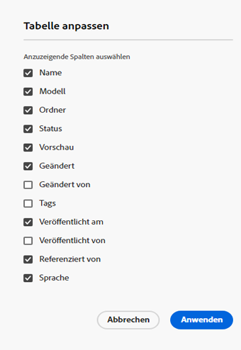

# Inhaltsfragmentkonsole  {#content-fragments-console}

Erfahren Sie, wie die Konsole &quot;Inhaltsfragmente&quot;den Zugriff auf Ihre Inhaltsfragmente optimiert und Sie dabei unterstützt, diese zu erstellen, zu durchsuchen und zu verwalten, indem Sie Verwaltungsaktionen wie die Veröffentlichung, das Rückgängigmachen der Veröffentlichung und das Kopieren durchführen.

Die Konsole &quot;Inhaltsfragmente&quot;dient der Verwaltung, Suche und Erstellung von Inhaltsfragmenten. Es wurde für die Verwendung in einem Headless-Kontext optimiert, wird aber auch beim Erstellen von Inhaltsfragmenten für die Seitenbearbeitung verwendet.

>[!NOTE]
>
>In dieser Konsole werden nur Inhaltsfragmente angezeigt. Andere Asset-Typen wie Bilder und Videos werden nicht angezeigt.

>[!NOTE]
>
>Der Zugriff auf Ihre Inhaltsfragmente ist derzeit über folgende Kanäle möglich:
>
>* this **Inhaltsfragmente** console
>* die **Assets** console - see [Verwalten von Inhaltsfragmenten](/help/assets/content-fragments/content-fragments-managing.md)

>[!NOTE]
>
>Auswahl von [Tastaturbefehle sind in dieser Konsole verfügbar](/help/sites-cloud/administering/content-fragments/content-fragments-console-keyboard-shortcuts.md).

Die Konsole &quot;Inhaltsfragmente&quot;kann direkt von der obersten Ebene der globalen Navigation aus aufgerufen werden:

## Grundlegende Struktur und Handhabung der Konsole {#basic-structure-handling-content-fragments-console}

Auswählen **Inhaltsfragmente** öffnet die Konsole in einer neuen Registerkarte.

Hier können Sie sehen, dass es drei Hauptbereiche gibt:

* die obere Symbolleiste
   * Standard-AEM
   * Zeigt auch Ihre IMS-Organisation an
* Das linke Bedienfeld
   * Hier können Sie die Ordnerstruktur ein- oder ausblenden
   * Sie können einen bestimmten Zweig des Baums auswählen
* Das Haupt-/rechte Bedienfeld - von hier aus können Sie:
   * Anzeigen der Liste aller Inhaltsfragmente im ausgewählten Zweig des Baums:
      * Der Standort wird durch die Breadcrumbs angegeben. diese können auch verwendet werden, um den Standort zu ändern
      * Inhaltsfragmente aus dem ausgewählten Ordner und alle untergeordneten Ordner werden angezeigt:
         * [Verschiedene Informationsfelder](#selectuse-available-columns) über ein Inhaltsfragment Links bereitstellt; Je nach Feld können diese:
            * Öffnen Sie das entsprechende Fragment im Editor
            * Anzeigen von Informationen zu Verweisen
            * Informationen zu Sprachversionen des Fragments anzeigen
         * Sie können [Wählen Sie mindestens ein Inhaltsfragment aus, um die verfügbaren Aktionen anzuzeigen.](#actions-selected-content-fragment)
      * Sie können eine Spaltenüberschrift auswählen, um die Tabelle nach dieser Spalte zu sortieren. Wählen Sie erneut aus, um zwischen aufsteigender und absteigender
   * **[Erstellen](#creating-new-content-fragment)** ein neues Inhaltsfragment
   * [Filter](#filtering-fragments) die Inhaltsfragmente entsprechend einer Auswahl von Eigenschaften und speichern Sie den Filter für die zukünftige Verwendung
   * [Suche](#searching-fragments) die Inhaltsfragmente
   * [Anpassen der Tabellenansicht zum Anzeigen ausgewählter Informationsspalten](#selectuse-available-columns)
   * Verwendung **In Assets öffnen** , um die aktuelle Position direkt im **Assets** console

      >[!NOTE]
      >
      >Die **Assets** -Konsole wird verwendet, um auf Assets wie Bilder, Videos usw. zuzugreifen.  Auf diese Konsole kann zugegriffen werden:
      >
      >* mithilfe der **In Assets öffnen** Link (in der Konsole &quot;Inhaltsfragmente&quot;)
      >* direkt über das globale Navigationsfenster

## Aktionen für ein (ausgewähltes) Inhaltsfragment {#actions-selected-content-fragment}

Wenn Sie ein bestimmtes Fragment auswählen, wird eine Symbolleiste geöffnet, die sich auf die für dieses Fragment verfügbaren Aktionen konzentriert. Sie können auch mehrere Fragmente auswählen. Die Auswahl der Aktionen wird entsprechend angepasst.

* **Öffnen Sie**
* **Veröffentlichen** und **Veröffentlichung rückgängig machen**)
* **Kopieren**
* **Verschieben**
* **Umbenennen**
* **Löschen**

>[!NOTE]
>
>Aktionen wie Veröffentlichen, Rückgängigmachen der Veröffentlichung, Löschen, Verschieben, Umbenennen, Kopieren, Trigger eines asynchronen Auftrags. Der Fortschritt dieses Auftrags kann über die Benutzeroberfläche für asynchrone Aufträge AEM überwacht werden.

## Informationen zu Ihren Inhaltsfragmenten {#information-content-fragments}

Der Rechts-/Hauptbereich (Tabellenansicht) der Konsole enthält eine Reihe von Informationen zu Ihren Inhaltsfragmenten. Einige Elemente bieten auch direkte Links zu weiteren Aktionen und/oder Informationen:

* **Name**
   * Stellt einen Link zum Öffnen des Fragments im Editor bereit.
* **Modell**
   * Stellt einen Link zum Öffnen des Fragments im Editor bereit.
* **Ordner**
   * Stellt einen Link zum Öffnen des Ordners in der Konsole bereit.
Wenn Sie den Mauszeiger über den Ordnernamen bewegen, wird der JCR-Pfad angezeigt.
* **Status**
   * Nur Informationen
* **Geändert**
   * Nur Informationen
* **Geändert von**
   * Nur Informationen
* **Veröffentlicht bei**
   * Nur Informationen
* **Herausgeber**
   * Nur Informationen
* **Referenziert von**

   * Stellt einen Link bereit, der ein Dialogfeld öffnet, in dem alle übergeordneten Verweise dieses Fragments aufgelistet werden. einschließlich der Referenzierung von Inhaltsfragmenten, Experience Fragments und Seiten. Um eine bestimmte Referenz zu öffnen, klicken Sie auf die **Titel** im Dialogfeld.

      

* **Sprache**

   * Gibt das Gebietsschema des Inhaltsfragments zusammen mit der Gesamtzahl der mit dem Inhaltsfragment verknüpften Gebietsschemas/Sprachkopien an.

      

      * Klicken/tippen Sie auf die Anzahl , um ein Dialogfeld zu öffnen, in dem alle Sprachkopien angezeigt werden. Um eine bestimmte Sprachkopie zu öffnen, klicken Sie auf die Schaltfläche **Titel** im Dialogfeld.

         

## Verfügbare Spalten auswählen {#select-available-columns}

Wie bei anderen Konsolen können Sie die sichtbaren und für die Aktion verfügbaren Spalten konfigurieren:

Daraufhin wird eine Liste von Spalten angezeigt, die Sie ausblenden oder anzeigen können:

## Erstellen eines neuen Inhaltsfragments {#creating-new-content-fragment}

Auswählen **Erstellen** öffnet den Kompakt **Neues Inhaltsfragment** dialog:

## Filtern von Fragmenten {#filtering-fragments}

Der Bereich Filter bietet folgende Optionen:

* Auswahl an Eigenschaften, die ausgewählt und kombiniert werden können
* die Möglichkeit, **Speichern** Ihre Konfiguration
* die Option zum Abrufen eines gespeicherten Suchfilters für die Wiederverwendung

## Suchen von Fragmenten {#searching-fragments}

Das Suchfeld unterstützt die Volltextsuche. Geben Sie Ihre Suchbegriffe in das Suchfeld ein:

Stellt die ausgewählten Ergebnisse bereit:

Das Suchfeld bietet außerdem schnellen Zugriff auf **Letzte Inhaltsfragmente** und **Gespeicherte Suchen**:

