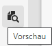
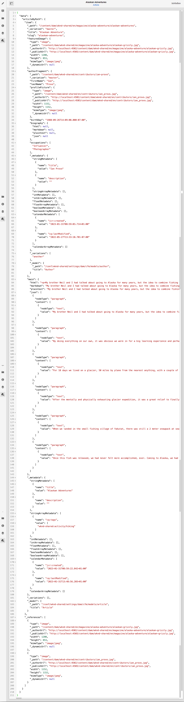

# Anzeigen in der Vorschau – JSON-Repräsentation {#preview-json-representation}

Beim Entwickeln der Modelle für Inhaltsfragmente als Teil Ihrer AEM Headless-Implementierung sollten Sie ggf. eine JSON-Beispielausgabe für ein Inhaltsfragment auf der Grundlage eines Modells anzeigen. So erhalten Sie beispielsweise eine Vorstellung davon, wie die endgültige Ausgabe aussehen wird. Dies könnte bei der Validierung der Modell-JSON-Struktur hilfreich sein, ggf. mit standardmäßigen Beispielinhalten pro Datentyp.

Verwendung des **Vorschau**-Symbols:

Sie können die JSON-Repräsentation des aktuellen Fragments anzeigen. Beispiel:

<!--
**Copy URL** allows you to copy to clipboard the URL for either author or publish.
-->
