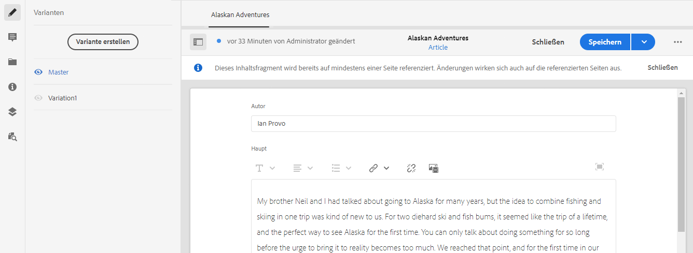
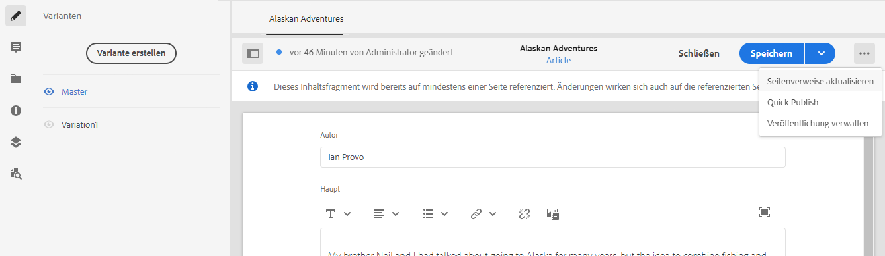
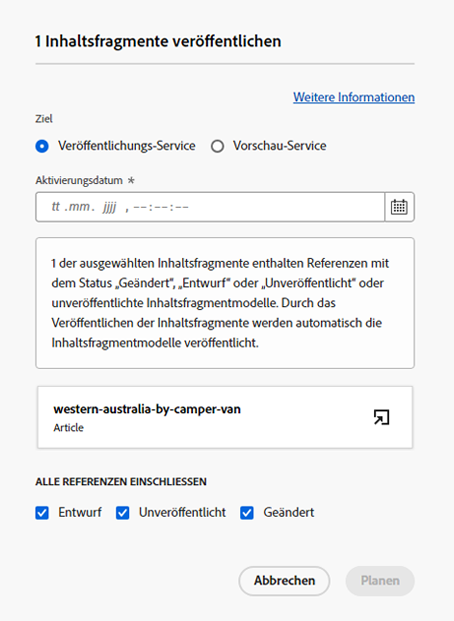
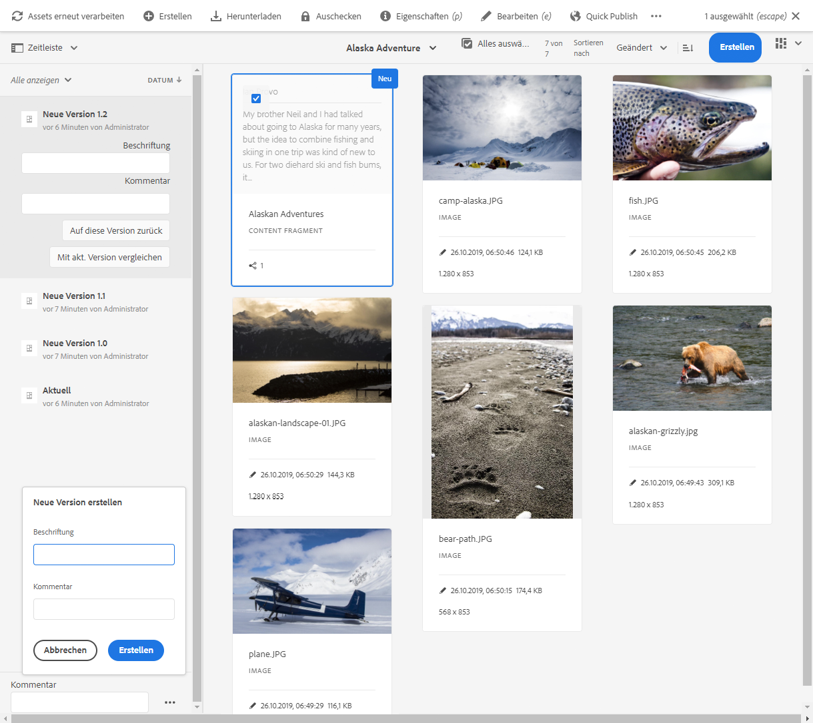
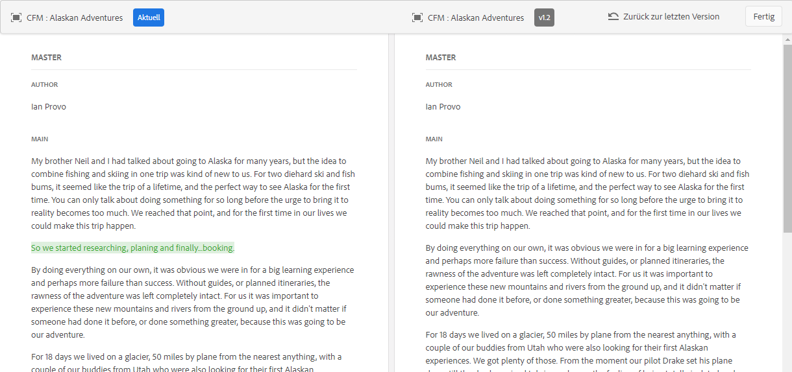

# Verwalten von Inhaltsfragmenten {#managing-content-fragments}

Erfahren Sie, wie Sie die **Inhaltsfragment**-Konsole zur Verwaltung Ihrer AEM-Inhaltsfragmente verwenden. Diese können für die Seitenbearbeitung oder als Grundlage für Ihre Headless-Inhalte verwendet werden.

Nachdem Sie Ihre [Inhaltsfragmentmodelle](#creating-a-content-model) definiert haben, können Sie diese verwenden, um [Ihre Inhaltsfragmente](#creating-a-content-fragment) zu erstellen.

Der [Inhaltsfragment-Editor](#opening-the-fragment-editor) bietet verschiedene [Modi](#modes-in-the-content-fragment-editor), die Folgendes ermöglichen:

* [Bearbeiten der Inhalte](#editing-the-content-of-your-fragment) und [Verwalten von Varianten](#creating-and-managing-variations-within-your-fragment)
* [Hinzufügen von Anmerkungen zu Fragmenten](/help/sites-cloud/administering/content-fragments/content-fragments-variations.md#annotating-a-content-fragment)
* [Verknüpfen von Inhalten mit Ihrem Fragment](#associating-content-with-your-fragment)
* [Konfigurieren der Metadaten](#viewing-and-editing-the-metadata-properties-of-your-fragment)
* [Strukturbaum anzeigen](/help/sites-cloud/administering/content-fragments/content-fragments-structure-tree.md)
* [Anzeigen der JSON-Repräsentation in der Vorschau](/help/sites-cloud/administering/content-fragments/content-fragments-json-preview.md)

>[!NOTE]
>
>Inhaltsfragmente können in folgenden Fällen verwendet werden:
>
>* Beim Erstellung von Seiten. Siehe [Seitenbearbeitung mit Inhaltsfragmenten](/help/sites-cloud/authoring/fundamentals/content-fragments.md).
>* Für [Headless-Bereitstellung mithilfe von Inhaltsfragmenten mit GraphQL](/help/sites-cloud/administering/content-fragments/content-fragments-graphql.md).

>[!NOTE]
>
>Inhaltsfragmente werden als **Assets** gespeichert. Sie werden hauptsächlich über die **Inhaltsfragment**-Konsole verwaltet, können jedoch auch über die **Assets**-Konsole verwaltet werden.

## Die Inhaltsfragmentkonsole {#content-fragments-console}

Die Inhaltsfragmentkonsole bietet direkten Zugriff auf Ihre Fragmente und zugehörige Aufgaben. Weitere Einzelheiten finden Sie unter:

* [Grundlegende Struktur und Handhabung der Inhaltsfragmentkonsole](/help/sites-cloud/administering/content-fragments/content-fragments-console.md#basic-structure-handling-content-fragments-console)

* [Die bereitgestellten Informationen zu Ihren Inhaltsfragmenten](/help/sites-cloud/administering/content-fragments/content-fragments-console.md#information-content-fragments)

* [Aktionen für ein Inhaltsfragment in der Inhaltsfragmentkonsole](/help/sites-cloud/administering/content-fragments/content-fragments-console.md#actions-selected-content-fragment)

* [Anpassen der verfügbaren Spalten in der Inhaltsfragmentkonsole](/help/sites-cloud/administering/content-fragments/content-fragments-console.md#select-available-columns)

* [Suchen und Filtern in der Inhaltsfragmentkonsole](/help/sites-cloud/administering/content-fragments/content-fragments-console.md#filtering-fragments)

## Erstellen von Inhaltsfragmenten {#creating-content-fragments}

### Erstellen von Inhaltsmodellen {#creating-a-content-model}

[Inhaltsfragmentmodelle](/help/sites-cloud/administering/content-fragments/content-fragments-models.md) können vor dem Erstellen von Inhaltsfragmenten mit strukturiertem Inhalt aktiviert und erstellt werden.

### Erstellen eines Inhaltsfragments {#creating-a-content-fragment}

So erstellen Sie ein Inhaltsfragment:

1. Wählen Sie in der **Inhaltsfragment**-Konsole **Erstellen** (oben rechts).

   >[!NOTE]
   >
   >Damit der Speicherort des neuen Fragments vordefiniert ist, können Sie zu dem Ordner navigieren, in dem Sie das Fragment erstellen möchten, oder Sie können den Speicherort während des Erstellungsprozesses angeben.

1. Das Dialogfeld **Neues Inhaltsfragment** wird geöffnet. Hier können Sie Folgendes angeben:

   * **Speicherort** – wird automatisch mit dem aktuellen Speicherort ausgefüllt, Sie können jedoch bei Bedarf einen anderen Speicherort auswählen.
   * **Inhaltsfragmentmodell** – Wählen Sie aus der Dropdown-Liste das Modell aus, das als Grundlage für das Fragment verwendet werden soll.
   * **Titel**
   * **Name** – wird basierend auf der Variablen **Titel** automatisch ausgefüllt, kann jedoch bei Bedarf bearbeitet werden
   * **Beschreibung**

   

1. Wählen Sie **Erstellen** oder, um Ihre Definition beizubehalten, **Erstellen und öffnen** aus.

## Status von Inhaltsfragmenten {#statuses-content-fragments}

Während seines Bestehens kann ein Inhaltsfragment mehrere Status haben, wie in der [Inhaltsfragmentkonsole](/help/sites-cloud/administering/content-fragments/content-fragments-console.md) gezeigt:

* **Neu**
Im Inhaltsfragmente-Editor wurde ein neues Inhaltsfragment erstellt, jedoch nie bearbeitet oder geöffnet.
* **Entwurf**
Das (neue) Inhaltsfragment wurde im Inhaltsfragmente-Editor von jemandem bearbeitet oder geöffnet, es wurde jedoch noch nicht veröffentlicht.
* **Veröffentlicht**
Das Inhaltsfragment wurde veröffentlicht.
* **Geändert**
Das Inhaltsfragment wurde nach der Veröffentlichung bearbeitet (aber vor der Veröffentlichung der Änderung).
* **Veröffentlichung rückgängig gemacht**
Die Veröffentlichung des Inhaltsfragments wurde rückgängig gemacht.

## Öffnen des Fragmenteditors {#opening-the-fragment-editor}

So öffnen Sie ein Fragment zur Bearbeitung:

>[!CAUTION]
>
>Um ein Inhaltsfragment zu bearbeiten, benötigen Sie [die entsprechenden Berechtigungen](/help/implementing/developing/extending/content-fragments-customizing.md#asset-permissions). Wenden Sie sich an Ihren Systemadministrator, falls Probleme auftreten.

1. Navigieren Sie in der **Inhaltsfragmentkonsole** zum Speicherort des gewünschten Inhaltsfragments.
1. Öffnen Sie das Fragment zur Bearbeitung, indem Sie das Fragment auswählen und dann in der Symbolleiste **Öffnen** auswählen.

1. Der Fragment-Editor wird geöffnet. Nehmen Sie die gewünschten Änderungen vor:

   

1. Nachdem Sie Änderungen vorgenommen haben, verwenden Sie nach Bedarf die Optionen **Speichern**, **Speichern und schließen** oder **Schließen**.

   >[!NOTE]
   >
   >**Speichern und schließen** ist über das Dropdown-Menü **Speichern** verfügbar.

   >[!NOTE]
   >
   >Sowohl **Speichern und schließen** als auch **Schließen** beenden den Editor – siehe [Speichern, Schließen und Versionen](#save-close-and-versions) für ausführliche Informationen zur Funktionsweise beider Optionen für Inhaltsfragmente.

## Modi und Aktionen im Inhaltsfragment-Editor {#modes-actions-content-fragment-editor}

Im Inhaltsfragment-Editor stehen verschiedene Modi und Aktionen zur Verfügung.

### Modi im Inhaltsfragment-Editor {#modes-in-the-content-fragment-editor}

Navigieren Sie mit den Symbolen im seitlichen Bedienfeld durch die vier Modi:

* Varianten: [Bearbeiten des Inhalts](#editing-the-content-of-your-fragment) und [Verwalten Ihrer Varianten](#creating-and-managing-variations-within-your-fragment)

* [Anmerkungen](/help/sites-cloud/administering/content-fragments/content-fragments-variations.md#annotating-a-content-fragment)
* [Zugehörige Inhalte](#associating-content-with-your-fragment)
* [Metadaten](#viewing-and-editing-the-metadata-properties-of-your-fragment)
* [Strukturbaum](/help/sites-cloud/administering/content-fragments/content-fragments-structure-tree.md)
* [Vorschau](/help/sites-cloud/administering/content-fragments/content-fragments-json-preview.md)

### Symbolleisten-Aktionen im Inhaltsfragment-Editor {#toolbar-actions-in-the-content-fragment-editor}

Einige Funktionen in der oberen Symbolleiste stehen in mehreren Modi zur Verfügung:

* Es wird eine Benachrichtigung angezeigt, wenn das Fragment bereits auf einer Inhaltsseite referenziert wird. Sie können die Nachricht **schließen**

* Das seitliche Bedienfeld kann über das Symbol **Seitliches Bedienfeld ein/aus** ein- oder ausgeblendet werden.

* Unter dem Fragmentnamen sehen Sie den Namen des [Inhaltsfragmentmodells](/help/sites-cloud/administering/content-fragments/content-fragments-models.md), das zum Erstellen des aktuellen Fragments verwendet wurde:

   * Der Name ist auch ein Link, über den der Modell-Editor geöffnet wird.

* Zeigen Sie den Status des Fragments an, zum Beispiel Informationen zum Zeitpunkt der Erstellung, Änderung oder Veröffentlichung. Der Status ist auch farbcodiert:

   * **Neu**: grau
   * **Entwurf**: blau
   * **Veröffentlicht**: grün
   * **Geändert**: orange
   * **Deaktiviert**: rot

* Über **Speichern** haben Sie Zugriff auf die Option **Speichern und schließen**.

* Über die drei Punkte (**...**) können Sie auf weitere Aktionen zugreifen:
   * **Seitenverweise aktualisieren**
      * Damit werden alle Seitenverweise aktualisiert.
   * **[Quick Publish](#publishing-and-referencing-a-fragment)**
   * **[Veröffentlichung verwalten](#publishing-and-referencing-a-fragment)**

<!--
This updates any page references and ensures that the Dispatcher is flushed as required. -->

## Speichern, Schließen und Versionen {#save-close-and-versions}

>[!NOTE]
>
>Versionen können [über die Zeitleiste auch erstellt, verglichen und zurückgesetzt werden](/help/sites-cloud/administering/content-fragments/content-fragments-managing.md#timeline-for-content-fragments).

Der Editor bietet mehrere Optionen:

* **Speichern** und **Speichern und schließen**

   * Mit **Speichern** werden die aktuellen Änderungen gespeichert und der Editor bleibt geöffnet.
   * Mit **Speichern und schließen** werden die aktuellen Änderungen gespeichert und der Editor wird beendet.

   >[!CAUTION]
   >
   >Um ein Inhaltsfragment zu bearbeiten, benötigen Sie [die entsprechenden Berechtigungen](/help/implementing/developing/extending/content-fragments-customizing.md#asset-permissions). Wenden Sie sich an Ihren Systemadministrator, falls Probleme auftreten.

   >[!NOTE]
   >
   >Es ist möglich, im Fragment-Editor zu bleiben und vor dem Speichern Änderungen vorzunehmen.

   >[!CAUTION]
   >
   >Mit der Aktion werden nicht nur einfach Ihre Änderungen gespeichert, sondern auch alle Verweise aktualisiert und sichergestellt, dass der Dispatcher nach Bedarf geleert wird. Es kann einige Zeit dauern, bis diese Änderungen verarbeitet werden. Aus diesem Grund kann die Leistung eines umfassenden/komplexen/stark belasteten Systems beeinträchtigt werden.
   >
   >Beachten Sie dies, wenn Sie die Option **Speichern und schließen** auswählen und den Fragment-Editor danach schnell erneut aufrufen, um weitere Änderungen vorzunehmen und zu speichern.

* **Schließen**

   Damit wird der Editor beendet, ohne die neuesten Änderungen zu speichern (also die Änderungen seit dem letzten **Speichern**).

Beim Bearbeiten Ihres Inhaltsfragments erstellt AEM automatisch Versionen, damit ältere Inhalte werden können, falls Sie Ihre Änderungen verwerfen möchten (verwenden Sie dazu die Option **Schließen** ohne zu Speichern):

1. Wenn ein Inhaltsfragment zur Bearbeitung geöffnet ist, überprüft AEM, ob ein Cookie-basiertes Token vorliegt, das angibt, ob eine *Bearbeitungssitzung* vorhanden ist:

   1. Wird das entsprechende Token gefunden, gilt das Fragment als Teil der vorhandenen Bearbeitungssitzung.
   2. Wenn das Token *nicht* verfügbar ist und der Benutzer mit dem Bearbeiten von Inhalt beginnt, wird eine Version erstellt, und ein Token für diese neue Bearbeitungssitzung wird an den Client gesendet, wo er in einem Cookie gespeichert wird.

2. Während einer *aktiven* Bearbeitungssitzung wird der bearbeitete Inhalt automatisch alle 600 Sekunden gespeichert (Standardeinstellung).

   >[!NOTE]
   >
   >Das Intervall für das automatische Speichern kann mit dem Mechanismus `/conf` konfiguriert werden.
   >
   >Den Standardwert finden Sie unter:
   >  `/libs/settings/dam/cfm/jcr:content/autoSaveInterval`

3. Wenn Anwender die Bearbeitung abbrechen, wird die am Anfang der Bearbeitungssitzung erstellte Version wiederhergestellt, und das Token wird zum Beenden der Bearbeitungssitzung entfernt.
4. Werden die Bearbeitungen über die Option **Speichern** gespeichert, werden die aktualisierten Elemente/Varianten beibehalten und das Token wird zum Beenden der Bearbeitungssitzung entfernt.

## Bearbeiten des Inhalts Ihres Fragments {#editing-the-content-of-your-fragment}

Wenn Sie das Fragment geöffnet haben, können Sie die Registerkarte [Varianten](/help/sites-cloud/administering/content-fragments/content-fragments-variations.md) verwenden, um Ihren Inhalt zu erstellen.

## Erstellen und Verwalten von Varianten innerhalb Ihres Fragments {#creating-and-managing-variations-within-your-fragment}

Sobald Sie den primären Inhalt erstellt haben, können Sie [Varianten](/help/sites-cloud/administering/content-fragments/content-fragments-variations.md) dieses Inhalts erstellen und verwalten.

## Verknüpfen von Inhalt mit Ihrem Fragment {#associating-content-with-your-fragment}

Sie können auch Inhalt mit einem Fragment [verknüpfen](/help/sites-cloud/administering/content-fragments/content-fragments-assoc-content.md). So entsteht eine Verbindung, mit der Assets (d. h. Bilder) für ein Fragment verwendet werden können (falls gewünscht), wenn sie zu einer Inhaltsseite hinzugefügt werden.

## Anzeigen und Bearbeiten von Metadaten (Eigenschaften) des Fragments {#viewing-and-editing-the-metadata-properties-of-your-fragment}

Sie können die Eigenschaften eines Fragments über die Registerkarte [Metadaten](/help/sites-cloud/administering/content-fragments/content-fragments-metadata.md) anzeigen und bearbeiten.

## Veröffentlichen und Referenzieren von Fragmenten {#publishing-and-referencing-a-fragment}

>[!CAUTION]
>Wenn das Fragment auf einem Modell basiert, sollten Sie sicherstellen, dass das [Modell veröffentlicht wurde](/help/sites-cloud/administering/content-fragments/content-fragments-models.md#publishing-a-content-fragment-model).
>Wenn Sie Inhaltsfragmente veröffentlichen, deren Modell noch nicht veröffentlicht wurde, wird dies in der Auswahlliste angezeigt und das Modell wird mit dem Fragment veröffentlicht.

Inhaltsfragmente müssen veröffentlicht werden, um in der Veröffentlichungsumgebung genutzt werden zu können. Dies geschieht mithilfe der standardmäßigen Assets-Funktionen

* Mit der Option **Veröffentlichen** in der Symbolleiste der [Inhaltsfragmentkonsole](/help/sites-cloud/administering/content-fragments/content-fragments-console.md#actions-selected-content-fragment)
   * **Jetzt** – Nach der Bestätigung wird das Fragment sofort veröffentlicht
   * **Zeitplan** – Sie können Datum und Uhrzeit der Veröffentlichung des Fragments auswählen

   Bei Bedarf müssen Sie das **Aktivierungsdatum** und die zu veröffentlichenden Referenzen angeben. Beispiel:
   

* Im [Inhaltsfragment-Editor](#toolbar-actions-in-the-content-fragment-editor)
   * [**Quick Publish**](/help/assets/manage-publication.md#quick-publish)
   * [**Veröffentlichung verwalten**](/help/assets/manage-publication.md#manage-publication)

Wenn Sie [eine Seite veröffentlichen, in der das Fragment verwendet wird](/help/sites-cloud/authoring/fundamentals/content-fragments.md#publishing), wird das Fragment außerdem in den Seitenverweisen aufgeführt.

>[!CAUTION]
>Nachdem ein Fragment veröffentlicht und/oder referenziert wurde, zeigt AEM eine Warnmeldung an, wenn ein Autor das Fragment erneut zur Bearbeitung öffnet. Dies dient als Hinweis darauf, dass am Fragment vorgenommene Änderungen sich auch auf die referenzierten Seiten auswirken.

## Rückgängigmachen der Veröffentlichung eines Fragments {#unpublishing-a-fragment}

Um die Veröffentlichung von Inhaltsfragmenten rückgängig zu machen, wählen Sie ein oder mehrere Fragmente aus und klicken Sie auf **Veröffentlichung rückgängig machen**.

>[!NOTE]
>Die Aktion **Veröffentlichung rückgängig machen** wird angezeigt, wenn veröffentlichte Fragmente verfügbar sind.

>[!CAUTION]
>Wenn das Fragment bereits von einem anderen Fragment oder von einer Seite referenziert wird, wird eine Warnmeldung angezeigt, in der Sie zur Bestätigung des Vorgangs aufgefordert werden.

## Löschen von Fragmenten {#deleting-a-fragment}

So löschen Sie ein Fragment:

1. Navigieren Sie in der **Inhaltsfragmentkonsole** zum Speicherort des Inhaltsfragments.
2. Wählen Sie das Fragment aus.

   >[!NOTE]
   >Die Aktion **Löschen** ist nicht als Schnellzugriff verfügbar.

3. Wählen Sie **Löschen** in der Symbolleiste aus.
4. Bestätigen Sie die **Löschaktion**.

   >[!CAUTION]
   >Wenn das Fragment bereits auf einer Seite referenziert wird, wird eine Warnmeldung angezeigt, mit der Sie dazu aufgefordert werden, zu bestätigen, dass Sie mit **Löschen erzwingen** fortfahren möchten. Das Fragment wird zusammen mit seiner Inhaltsfragmentkomponente aus allen Inhaltsseiten gelöscht.

## Suchen von übergeordneten Referenzen Ihres Fragments {#parent-references-fragment}

Details der übergeordneten Referenzen sind über die Spalte **Referenzen** der [Inhaltsfragmentkonsole](/help/sites-cloud/administering/content-fragments/content-fragments-console.md#information-content-fragments) verfügbar.

## Suchen von Sprachkopien Ihres Fragments {#language-copies-fragment}

Details zu Sprachkopien sind über die Spalte **Sprache** der [Inhaltsfragmentkonsole](/help/sites-cloud/administering/content-fragments/content-fragments-console.md#information-content-fragments) verfügbar.

## Timeline für Inhaltsfragmente {#timeline-for-content-fragments}

>[!NOTE]
>Diese Funktion ist nur in der **Assets**-Konsole verfügbar

Neben den Standardoptionen enthält die [Zeitleiste](/help/assets/manage-digital-assets.md#timeline) Informationen und Aktionen für Inhaltsfragmente.

* Anzeigen von Informationen zu Versionen, Kommentaren und Anmerkungen
* Aktionen für Versionen

   * **[Auf diese Version zurück](#reverting-to-a-version)** (ein vorhandenes Fragment und eine bestimmte Version auswählen)

   * **[Mit aktueller Version vergleichen](#comparing-fragment-versions)** (ein vorhandenes Fragment und eine bestimmte Version auswählen)

   * **Beschriftung** und/oder **Kommentar** hinzufügen (ein vorhandenes Fragment und eine bestimmte Version auswählen)

   * **Als Version speichern** (ein vorhandenes Fragment und dann den Pfeil nach oben am unteren Rand der Zeitleiste auswählen)

* Aktionen für Anmerkungen

   * **Löschen**

>[!NOTE]
>Kommentare sind:
>* Standardfunktionen für alle Assets
>* In der Zeitleiste erstellt worden
>* Mit dem Fragment-Asset verbunden
>Anmerkungen (für Inhaltsfragmente) sind:
>* Im Fragmenteditor eingegeben worden
>* Spezifisch für ein ausgewähltes Textsegment innerhalb des Fragments
>

Beispiel:

## Vergleichen von Fragment-Versionen {#comparing-fragment-versions}

>[!NOTE]
>Diese Funktion ist nur in der **Assets**-Konsole verfügbar

Die Aktion **Mit aktueller Version vergleichen** ist in der [Zeitleiste](/help/sites-cloud/administering/content-fragments/content-fragments-managing.md#timeline-for-content-fragments) verfügbar, sobald Sie eine bestimmte Version ausgewählt haben.

Folgendes wird geöffnet:

* die **aktuelle** (neueste) Version (links)

* die ausgewählte Version **v&lt;*x.y*>** (rechts)

Sie werden nebeneinander angezeigt, wobei:

* Unterschiede werden hervorgehoben

   * Gelöschter Text: Rot
   * Eingefügter Text: Grün
   * Ersetzter Text: Blau

* Über das Vollbildsymbol können Sie jede Version separat öffnen. Wechseln Sie dann wieder zur parallelen Ansicht.
* Sie können die jeweilige Version **wiederherstellen**.
* Über **Fertig** kehren Sie zur Konsole zurück.

>[!NOTE]
>Sie können den Fragmentinhalt nicht bearbeiten, während Sie Fragmente vergleichen.

## Wiederherstellen einer früheren Version  {#reverting-to-a-version}

>[!NOTE]
>Diese Funktion ist nur in der **Assets**-Konsole verfügbar

Sie können eine frühere Version wiederherstellen.

* Direkt über die [Zeitleiste](/help/sites-cloud/administering/content-fragments/content-fragments-managing.md#timeline-for-content-fragments).

   Wählen Sie die gewünschte Version und dann die Aktion **Auf diese Version zurück** aus.

* Beim [Vergleichen einer Version mit der aktuellen Version](/help/sites-cloud/administering/content-fragments/content-fragments-managing.md#comparing-fragment-versions) können Sie die ausgewählte Version **wiederherstellen**.
