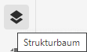
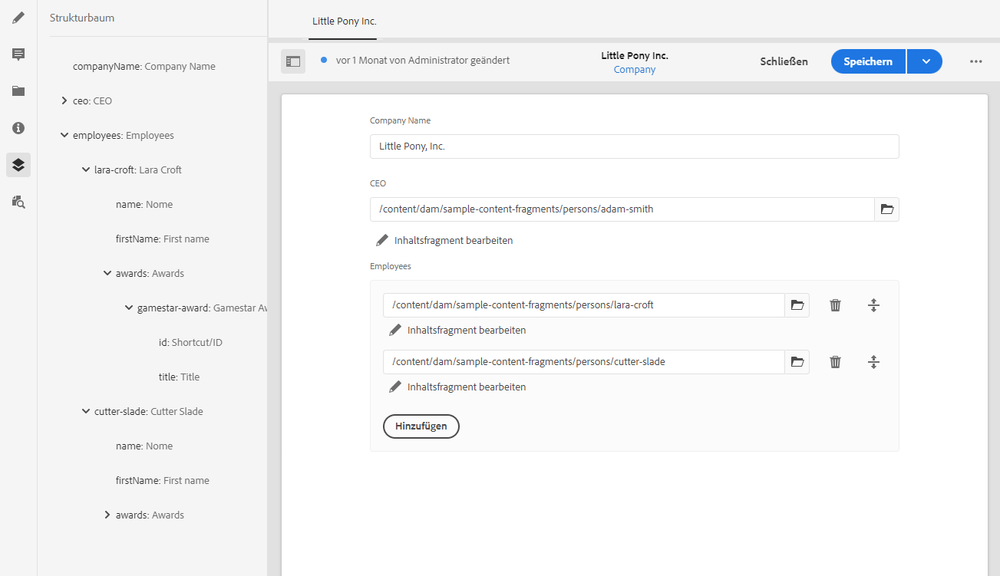

# Strukturbaum der Inhaltsfragmente {#content-fragment-structure-tree}

Verwenden Sie die Strukturbaum-Funktion des Inhaltsfragment-Editors in AEM, um Ihnen beim Verständnis Ihres Headless-Inhalts zu helfen.

Im Inhaltsfragment-Editor können Sie das Strukturbaumsymbol auswählen:

Dadurch wird eine Darstellung der Fragmentstruktur im linken Fensterbereich geöffnet. Auf diese Weise können Sie durch referenzierte Fragmente navigieren und zu ihnen gelangen. Wenn Sie eine Referenz auswählen, wird dieses Fragment zur Bearbeitung geöffnet.

>[!NOTE]
>
>Mithilfe der Breadcrumbs im Hauptbereich können Sie zurück zu Ihrem Ausgangspunkt navigieren.

