# Varianten – Erstellen von Fragmentinhalten{#variations-authoring-fragment-content}

[Varianten](/help/sites-cloud/administering/content-fragments/content-fragments.md#constituent-parts-of-a-content-fragment) sind eine wichtige Funktion für Inhaltsfragmente in AEM, da sie Ihnen die Möglichkeit bieten, Kopien des primären Inhalts für die Verwendung in bestimmten Kanälen und/oder Szenarien zu erstellen und zu bearbeiten, was sowohl die Seitenerstellung als auch die Bereitstellung von Headless-Inhalten noch flexibler macht.

Aus dem **Varianten** können Sie Folgendes tun:

* [Inhalt eingeben](#authoring-your-content) für Ihr Fragment,
* [Erstellen und Verwalten von Varianten](#managing-variations) des **primären** Inhalts,

Führen Sie eine Vielzahl weiterer Aktionen abhängig vom bearbeiteten Datentyp aus, z. B.:

* [Einfügen von visuellen Assets in Ihr Fragment](#inserting-assets-into-your-fragment) (Bilder)

* Wählen Sie zwischen [Rich-Text](#rich-text), [Nur Text](#plain-text) und [Markdown](#markdown) zur Bearbeitung

* [Inhalt hochladen](#uploading-content)

* [Anzeigen von Schlüsselstatistiken](#viewing-key-statistics) (über mehrzeiligen Text)

* [Zusammenfassen von Text](#summarizing-text)

* [Synchronisieren von Varianten mit dem primären Inhalt](#synchronizing-with-master)

>[!CAUTION]
>
>Nachdem ein Fragment veröffentlicht und/oder referenziert wurde, zeigt AEM eine Warnmeldung an, wenn ein Autor das Fragment erneut zur Bearbeitung öffnet. Dies dient als Hinweis darauf, dass am Fragment vorgenommene Änderungen sich auch auf die referenzierten Seiten auswirken.

## Verfassen Ihres Inhalts {#authoring-your-content}

Wenn Sie das Inhaltsfragment zur Bearbeitung öffnen, wird die **Varianten** ist standardmäßig geöffnet. Hier können Sie den Inhalt bearbeiten, und zwar den der primären Version sowie sämtlicher Varianten. Das strukturierte Fragment enthält verschiedene Felder mit verschiedenen Datentypen, die im Inhaltsmodell definiert wurden.

Beispiel:

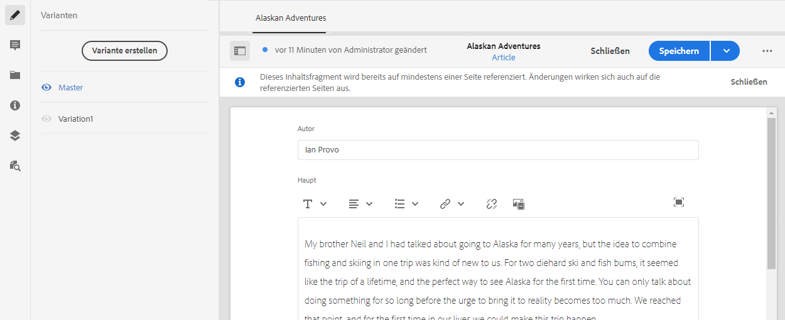

Sie haben folgende Möglichkeiten:

* Bearbeiten Sie Ihre Inhalte direkt auf der Registerkarte **Varianten**. Jeder Datentyp bietet verschiedene Bearbeitungsoptionen, z. B.:

   * Für **mehrzeilige Textfelder** können Sie auch den [Vollbild-Editor](#full-screen-editor) öffnen, um:

      * das [Format](#formats) auszuwählen
      * weitere Bearbeitungsoptionen anzuzeigen ([Rich-Text](#rich-text)-Format)
      * auf eine Reihe von [Aktionen](#actions) zuzugreifen
   * Für die Felder **Fragmentreferenz** kann je nach Modelldefinition die Option [Inhaltsfragment bearbeiten](#fragment-references-edit-content-fragment) verfügbar sein.

* Weisen Sie der aktuellen Variante **Tags** zu; die Tags können hinzugefügt, aktualisiert und entfernt werden

   * [Tags](/help/sites-cloud/authoring/features/tags.md) sind besonders leistungsstark bei der Organisation Ihrer Fragmente, da sie für die Inhaltsklassifizierung und -taxonomie verwendet werden können. Tags können zum Suchen von Inhalten (nach Tags) und zum Anwenden von Massenvorgängen verwendet werden.

      * Bei der Suche nach einem Tag wird das Fragment zurückgegeben, wobei die getaggte Variante hervorgehoben ist.
      * Varianten-Tags können auch verwendet werden, um Varianten für ein bestimmtes CDN-Profil (Content Delivery Network) (für CDN-Caching) zu gruppieren, anstatt den Variantennamen zu verwenden.

      Beispielsweise können Sie relevante Fragmente als „Weihnachts-Launch“ taggen, um nur diese als Teilmenge zu durchsuchen oder sie für einen anderen zukünftigen Launch in einen neuen Ordner zu kopieren.
   >[!NOTE]
   >
   >**Tags** können auch (in der **primären** Variante) als Teil der [Metadaten](/help/sites-cloud/administering/content-fragments/content-fragments-metadata.md) hinzugefügt werden

* [Erstellen und Verwalten von Varianten](#managing-variations) des **primären** Inhalts.

### Vollbild-Editor {#full-screen-editor}

Beim Bearbeiten eines mehrzeiligen Textfelds können Sie den Vollbild-Editor öffnen. Tippen oder klicken Sie in den eigentlichen Text und wählen Sie dann das folgende Aktionssymbol aus:

Dadurch wird der Texteditor im Vollbildmodus geöffnet:

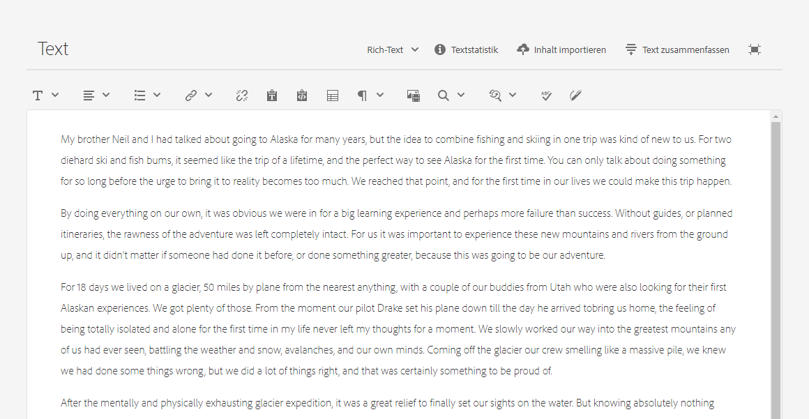

Der Texteditor im Vollbildmodus bietet:

* Zugriff auf verschiedene [Aktionen](#actions)
* Je nach [format](#formats), zusätzliche Formatierungsoptionen ([Rich-Text](#rich-text))

### Aktionen {#actions}

Die folgenden Aktionen sind ebenfalls verfügbar (für sämtliche [Formate](#formats)), wenn der Vollbild-Editor (d. h. mehrzeiliger Text) geöffnet ist:

* [Format](#formats) auswählen ([Rich-Text](#rich-text), [Nur Text](#plain-text), [Markdown](#markdown))

* [Inhalt hochladen](#uploading-content)

* [Textstatistiken anzeigen](#viewing-key-statistics)

* [Mit primärer Version synchronisieren](#synchronizing-with-master) (beim Bearbeiten einer Variante)

* [Zusammenfassen von Text](#summarizing-text)

### Formate {#formats}

Die Optionen für das Bearbeiten von mehrzeiligem Text hängen vom ausgewählten Format ab:

* [Rich-Text](#rich-text)
* [Nur Text](#plain-text)
* [Markdown](#markdown)

Das Format kann im Vollbild-Editor ausgewählt werden.

### Rich-Text {#rich-text}

Mit der Rich-Text-Bearbeitung können Sie Folgendes formatieren:

* Fett
* Kursiv
* Unterstrichen
* Ausrichtung: links, zentriert, rechts
* Aufzählungsliste
* Nummerierte Liste
* Einzug: erhöhen, verringern
* Hyperlinks erstellen/unterbrechen
* Text/aus Word einfügen
* Tabelle einfügen
* Absatzstil: Absatz 1 Überschrift 1/2/3
* [Asset einfügen](#inserting-assets-into-your-fragment)
* Öffnen Sie den Vollbild-Editor, in dem die folgenden Formatierungsoptionen zur Verfügung stehen:
   * Suchen
   * Suchen/Ersetzen
   * Rechtschreibprüfung
   * [Anmerkungen](/help/sites-cloud/administering/content-fragments/content-fragments-variations.md#annotating-a-content-fragment)
* [Inhaltsfragment einfügen](#inserting-content-fragment-into-your-fragment); verfügbar, wenn Ihr **mehrzeiliges Textfeld** mit **Fragmentreferenz zulassen** konfiguriert wurde.

Die [Aktionen](#actions) sind ebenfalls über den Vollbild-Editor verfügbar.

### Nur Text {#plain-text}

Nur Text ermöglicht die schnelle Eingabe von Inhalt ohne Formatierungs- oder Markdown-Informationen. Für weitere [Aktionen](#actions) können Sie auch den Vollbild-Editor öffnen.

>[!CAUTION]
>
>Wenn Sie **Nur Text** auswählen, gehen möglicherweise alle Formatierungen, Markierungen und/oder Assets verloren, die Sie in **Rich-Text** oder **Markdown** eingefügt haben.

### Markdown {#markdown}

>[!NOTE]
>
>Umfassende Informationen finden Sie unter [Markdown](/help/sites-cloud/administering/content-fragments/content-fragments-markdown.md) Dokumentation.

Auf diese Weise können Sie Ihren Text mithilfe von Markdown formatieren. Sie können Folgendes definieren:

* Überschriften
* Absätze und Zeilenumbrüche
* Links
* Bilder
* Blockzitate
* Listen
* Hervorhebungen
* Code-Blöcke
* Umgekehrter Schrägstrich - Escape

Für weitere [Aktionen](#actions) können Sie auch den Vollbild-Editor öffnen.

>[!CAUTION]
>
>Wenn Sie zwischen **Rich-Text** und **Markdown** umschalten, treten möglicherweise unerwartete Effekte mit Blockzitaten und Code-Blöcken auf, da diese beiden Formate unterschiedlich verarbeitet werden.

### Fragmentreferenzen {#fragment-references}

Wenn das Inhaltsfragmentmodell Fragmentreferenzen enthält, stehen Ihren Fragmentautoren möglicherweise zusätzliche Optionen zur Verfügung:

* [Inhaltsfragment bearbeiten](#fragment-references-edit-content-fragment)
* [Neues Inhaltsfragment](#fragment-references-new-content-fragment)

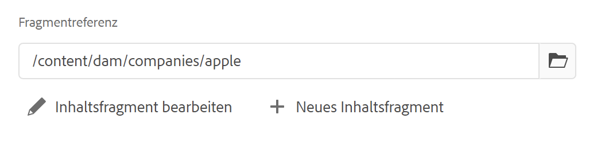

#### Inhaltsfragment bearbeiten {#fragment-references-edit-content-fragment}

Mit der Option **Inhaltsfragment bearbeiten** wird dieses Fragment in einer neuen Editor-Registerkarte (innerhalb derselben Browser-Registerkarte) geöffnet.

Wenn Sie die ursprüngliche Registerkarte erneut auswählen (z. B. **Little Pony Inc.**), wird diese sekundäre Registerkarte geschlossen (in diesem Fall **Adam Smith**).

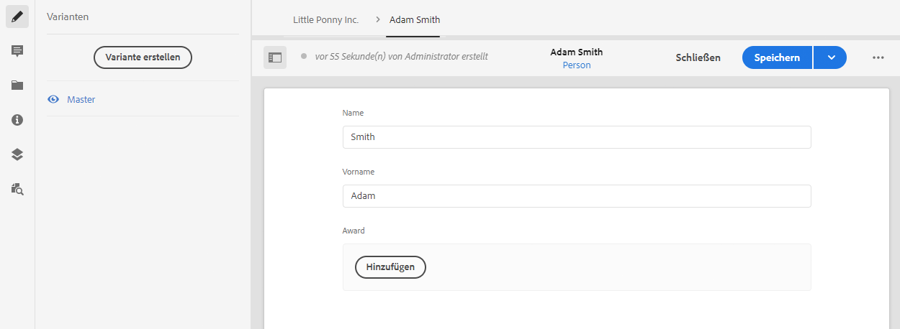

#### Neues Inhaltsfragment {#fragment-references-new-content-fragment}

Mit der Option **Neues Inhaltsfragment** können Sie ein komplett neues Fragment erstellen. Dazu öffnet sich im Editor eine Variante des Assistenten zum Erstellen von Inhaltsfragmenten.

Anschließend können Sie wie folgt ein neues Fragment erstellen:

1. Navigieren Sie zum gewünschten Ordner und wählen Sie ihn aus.
1. Wählen Sie **Weiter** aus.
1. Legen Sie Eigenschaften fest. Beispiel: **Titel**.
1. Wählen Sie **Erstellen** aus.
1. Abschließend:
   1. Mit **Fertig** kehren Sie (zum ursprünglichen Fragment) zurück und verweisen auf das neue Fragment.
   1. **Öffnen** referenziert das neue Fragment und öffnet das neue Fragment zur Bearbeitung in einer neuen Browser-Registerkarte.

### Anzeigen von wichtigen Statistiken {#viewing-key-statistics}

Wenn der Vollbild-Editor geöffnet ist, zeigt die Aktion **Textstatistik** eine Reihe von Informationen über den Text an.

Beispiel:

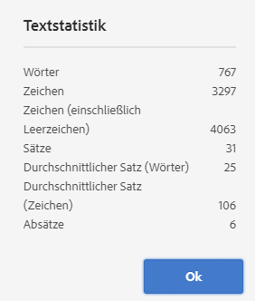

### Hochladen von Inhalt {#uploading-content}

Um die Erstellung von Inhaltsfragmenten zu vereinfachen, können Sie Text hochladen, der in einem externen Editor vorbereitet wurde, und ihn direkt in das Fragment einfügen.

### Zusammenfassung von Text {#summarizing-text}

Mithilfe der Zusammenfassung von Text können Benutzer die Länge des Textes auf eine vordefinierte Anzahl von Wörtern verringern, während die wichtigen Punkte und die allgemeine Bedeutung beibehalten werden.

>[!NOTE]
>
>Auf einer technischeren Stufe behält das System die Sätze bei, die in Übereinstimmung mit bestimmten Algorithmen das *beste Verhältnis von Informationsdichte und Eindeutigkeit* bieten.

>[!CAUTION]
>
>Das Inhaltsfragment muss einen gültigen Sprachordner (ISO-Code) als Vorgänger haben, der verwendet wird, um das zu verwendende Sprachmodell zu bestimmen.
>
>Beispiel: `en/` wie im folgenden Pfad:
>
>  `/content/dam/my-brand/en/path-down/my-content-fragment`

>[!CAUTION]
Englisch ist standardmäßig verfügbar.
Andere Sprachen sind als Sprachmodellpakete von Software Distribution verfügbar:
* [Französisch (fr)](https://experience.adobe.com/#/downloads/content/software-distribution/en/aem.html?lang=de?package=/content/software-distribution/en/details.html/content/dam/aem/public/adobe/packages/cq630/product/smartcontent-model-fr)
* [Deutsch (de)](https://experience.adobe.com/#/downloads/content/software-distribution/en/aem.html?lang=de?package=/content/software-distribution/en/details.html/content/dam/aem/public/adobe/packages/cq630/product/smartcontent-model-de)
* [Italienisch (it)](https://experience.adobe.com/#/downloads/content/software-distribution/en/aem.html?lang=de?package=/content/software-distribution/en/details.html/content/dam/aem/public/adobe/packages/cq630/product/smartcontent-model-it)
* [Spanisch (es)](https://experience.adobe.com/#/downloads/content/software-distribution/en/aem.html?lang=de?package=/content/software-distribution/en/details.html/content/dam/aem/public/adobe/packages/cq630/product/smartcontent-model-es)
>

1. Wählen Sie **Primäre Version** oder die erforderliche Variante aus.
1. Öffnen Sie den Vollbild-Editor.

1. Wählen Sie in der Symbolleiste die Option **Text zusammenfassen** aus.

   

1. Geben Sie den Zielwert der Wörter an und wählen Sie **Starten**:
1. Der ursprüngliche Text wird nebeneinander mit der vorgeschlagenen Zusammenfassung angezeigt:

   * Alle zu beseitigenden Sätze werden rot hervorgehoben und durchgestrichen.
   * Klicken Sie auf einen markierten Satz, um ihn im zusammengefassten Inhalt zu behalten.
   * Klicken Sie auf einen nicht hervorgehobenen Satz, um ihn zu eliminieren.

1. Wählen Sie **Zusammenfassen** aus, um die Änderungen zu bestätigen.

1. Der ursprüngliche Text wird nebeneinander mit der vorgeschlagenen Zusammenfassung angezeigt:

   * Alle zu beseitigenden Sätze werden rot hervorgehoben und durchgestrichen.
   * Klicken Sie auf einen markierten Satz, um ihn im zusammengefassten Inhalt zu behalten.
   * Klicken Sie auf einen nicht hervorgehobenen Satz, um ihn zu eliminieren.
   * Die Zusammenfassungsstatistiken werden gezeigt: **Actual** und **Target**.
   * Sie können die Änderungen in der **Vorschau** sehen.

   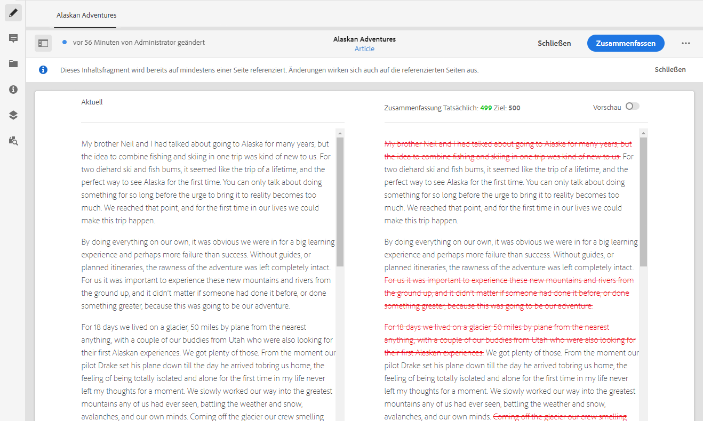

### Anmerkungen zu Inhaltsfragmenten {#annotating-a-content-fragment}

So kommentieren Sie ein Fragment:

1. Wählen Sie **Primäre Version** oder die erforderliche Variante aus.

1. Öffnen Sie den Vollbild-Editor.

1. Das Symbol **Anmerken** ist in der Symbolleiste oben verfügbar. Sie können bei Bedarf Text auswählen.

   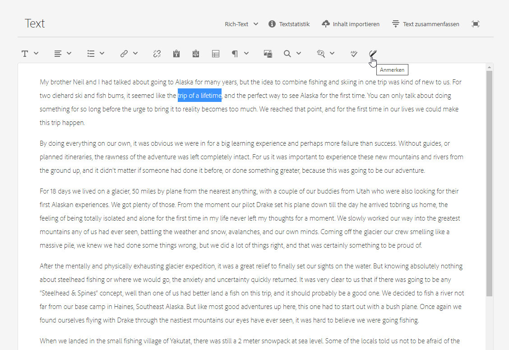

1. Ein Dialogfeld wird geöffnet. Hier können Sie Ihre Anmerkungen eingeben.

   

1. Wählen Sie **Anwenden** im Dialogfeld aus.

   

   Wenn die Anmerkung auf den ausgewählten Text angewendet wurde, bleibt dieser Text hervorgehoben.

   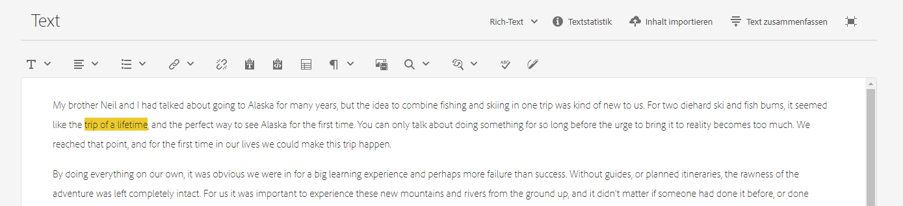

1. Schließen Sie den Editor für den Vollbildmodus. Die Anmerkungen sind weiterhin hervorgehoben. Wenn diese Option aktiviert ist, wird ein Dialogfeld geöffnet, in dem Sie die Anmerkung weiter bearbeiten können.

1. Klicken Sie auf **Speichern**.

1. Schließen Sie den Editor für den Vollbildmodus. Die Anmerkungen sind weiterhin hervorgehoben. Wenn diese Option aktiviert ist, wird ein Dialogfeld geöffnet, in dem Sie die Anmerkung weiter bearbeiten können.

   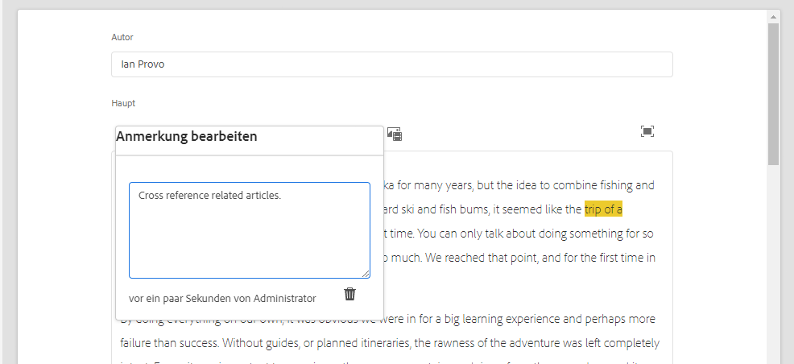

### Anzeigen, Bearbeiten und Löschen von Anmerkungen {#viewing-editing-deleting-annotations}

Anmerkungen:

* Sie werden durch die Markierung auf dem Text sowohl im Vollbildmodus als auch im normalen Modus des Editors angezeigt. Vollständige Details einer Anmerkung können angezeigt, bearbeitet und/oder gelöscht werden, indem Sie auf den markierten Text klicken, der das Dialogfeld erneut öffnet.

   >[!NOTE]
   Eine Dropdown-Liste wird angezeigt, wenn mehrere Anmerkungen auf einen Textausschnitt angewendet wurden.

* Wenn Sie den gesamten Text löschen, auf den die Anmerkung angewendet wurde, wird der Kommentar ebenfalls gelöscht.

* Kann durch das Auswählen der Registerkarte **Anmerkungen** im Fragment-Editor aufgeführt und gelöscht werden.

   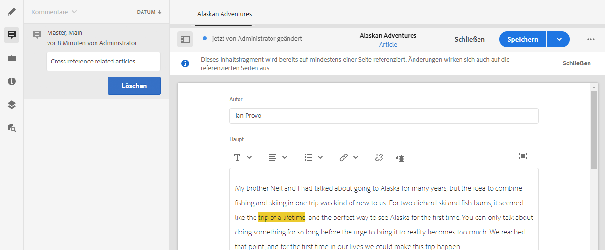

* Kann in der [Zeitleiste](/help/sites-cloud/administering/content-fragments/content-fragments-managing.md#timeline-for-content-fragments) für das ausgewählte Fragment angezeigt und gelöscht werden.

### Einfügen von Assets in das Fragment {#inserting-assets-into-your-fragment}

Um die Erstellung von Inhaltsfragmenten zu vereinfachen, können Sie [Assets](/help/assets/manage-digital-assets.md) (Bilder) direkt zum Fragment hinzufügen.

Sie werden der Absatzsequenz des Fragments ohne Formatierung hinzugefügt. Formatierung kann durchgeführt werden, wenn die [Fragment wird auf einer Seite verwendet/referenziert](/help/sites-cloud/authoring/fundamentals/content-fragments.md).

>[!CAUTION]
Diese Assets können auf einer referenzierenden Seite nicht verschoben oder gelöscht werden, sondern nur im Fragment-Editor.
Das Formatieren von Assets (z. B. Größe) muss im [Seiten-Editor](/help/sites-cloud/authoring/fundamentals/content-fragments.md) erfolgen. Die Darstellung des Assets im Fragment-Editor dient lediglich der Erstellung des Inhaltsflusses.

>[!NOTE]
Es gibt verschiedene Methoden, um [Bilder](/help/sites-cloud/administering/content-fragments/content-fragments.md#fragments-with-visual-assets) zu einem Fragment und/oder einer Seite hinzuzufügen.

1. Positionieren Sie den Cursor über der Position, an der Sie das Bild hinzufügen möchten.
1. Öffnen Sie das Suchdialogfeld mithilfe der Schaltfläche **Asset einfügen**.

   

1. In diesem Dialogfeld haben Sie folgende Möglichkeiten:

   * Navigieren zum erforderlichen Asset in DAM
   * Suchen nach dem Asset in DAM

   Nachdem Sie das gewünschte Asset gefunden haben, wählen Sie es aus, indem Sie auf die Miniatur klicken.

1. Verwenden Sie **Auswahl**, um das Asset dem Absatzsystem Ihres Inhaltsfragments am aktuellen Speicherort hinzuzufügen.

   >[!CAUTION]
   Wenn Sie nach dem Hinzufügen eines Assets das Format ändern in:
   * **Klartext:** Das Asset geht im Fragment vollständig verloren.
   * **Markdown:** Das Asset wird nicht angezeigt, ist aber immer noch vorhanden, wenn Sie zu **Rich Text** zurückkehren.

### Einfügen eines Inhaltsfragments in ein Fragment {#inserting-content-fragment-into-your-fragment}

Um die Erstellung von Inhaltsfragmenten zu vereinfachen, können Sie Ihrem Fragment auch ein anderes Inhaltsfragment hinzufügen.

Es wird an der aktuellen Position in Ihrem Fragment als Referenz hinzugefügt.

>[!NOTE]
Diese Option ist verfügbar, wenn Ihr **mehrzeiliges Textfeld** mit **Fragmentreferenz zulassen** konfiguriert wurde.

>[!CAUTION]
Diese Assets können auf einer referenzierenden Seite nicht verschoben oder gelöscht werden, sondern nur im Fragment-Editor.
Das Formatieren von Assets (z. B. Größe) muss im [Seiten-Editor](/help/sites-cloud/authoring/fundamentals/content-fragments.md) erfolgen. Die Darstellung des Assets im Fragment-Editor dient lediglich der Erstellung des Inhaltsflusses.

>[!NOTE]
Es gibt verschiedene Methoden, um [Bilder](/help/sites-cloud/administering/content-fragments/content-fragments.md#fragments-with-visual-assets) zu einem Fragment und/oder einer Seite hinzuzufügen.

1. Positionieren Sie den Cursor über der Position, an der Sie das Fragment hinzufügen möchten.
1. Öffnen Sie das Suchdialogfeld mithilfe der Schaltfläche **Inhaltsfragment einfügen**.

   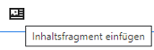

1. In diesem Dialogfeld haben Sie folgende Möglichkeiten:

   * Navigieren zum gewünschten Fragment im Assets-Ordner,
   * Suchen nach dem Fragment,

   Nachdem Sie das gewünschte Fragment gefunden haben, klicken Sie auf die Miniatur, um es auszuwählen.

1. Verwenden Sie **Auswahl**, um dem aktuellen Inhaltsfragment (an der aktuellen Position) eine Referenz zum ausgewählten Inhaltsfragment hinzuzufügen.

   >[!CAUTION]
   Wenn Sie nach dem Hinzufügen einer Referenz zu einem anderem Fragment das Format ändern, könnte folgendes auftreten:
   * **Klartext**: Die Referenz geht im Fragment vollständig verloren.
   * **Markdown**: Die Referenz bleibt bestehen.

## Verwalten von Varianten {#managing-variations}

[!CONTEXTUALHELP]
id="aemcloud_sites_contentfragments_variations"
title="Varianten – Erstellen von Fragmentinhalten"
abstract="Erfahren Sie, wie Sie Inhaltsvarianten für die Verwendung in bestimmten Kanälen erstellen."
additional-url="https://video.tv.adobe.com/v/333295?captions=ger" text="Inhaltsfragmentvarianten"

### Erstellen einer Variante {#creating-a-variation}

Varianten ermöglichen die Abänderung von **primärem** Inhalt für einen bestimmten Zweck (sofern notwendig).

So erstellen Sie eine neue Variante:

1. Öffnen Sie das Fragment und stellen Sie sicher, dass der Seitenbereich sichtbar ist.
1. Wählen Sie im seitlichen Bedienfeld in der Symbolleiste die Option **Varianten** aus.
1. Auswählen **Variante erstellen**.
1. Daraufhin wird ein Dialogfeld geöffnet, in dem der **Titel** und die **Beschreibung** für die neue Variante angegeben werden.
1. Wählen Sie **Hinzufügen** aus. Das Fragment **Primäre Version** wird in die neue Variante kopiert, die nun zur [Bearbeitung](#editing-a-variation) geöffnet ist.

   >[!NOTE]
   Wenn eine neue Variante erstellt wird, wird immer die **Primäre Version** kopiert, nicht die gerade geöffnete Variante.

   >[!NOTE]
   Wenn Sie eine neue Variante erstellen, werden alle **Tags**, die derzeit der **primären** Variante zugewiesen sind, in Ihre neue Variante kopiert.

### Bearbeiten einer Variante {#editing-a-variation}

Sie können Änderungen am Varianteninhalt vornehmen, nachdem Sie entweder:

* [Variante erstellen](#creating-a-variation).
* Öffnen Sie ein vorhandenes Fragment und wählen Sie dann die gewünschte Variante aus dem Seitenbereich aus.

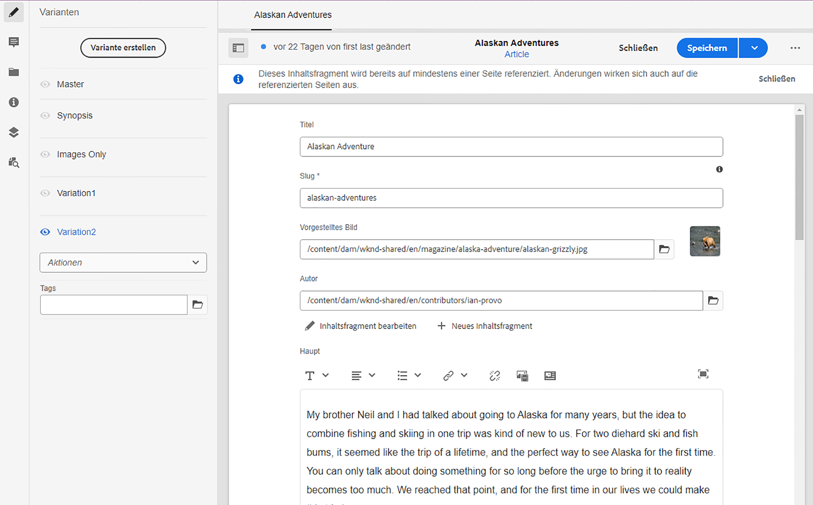

### Umbenennen einer Variante {#renaming-a-variation}

So benennen Sie eine vorhandene Variante um:

1. Öffnen Sie das Fragment und wählen Sie über den Seitenbereich die Option **Varianten** aus.
1. Wählen Sie die gewünschte Variante aus.
1. Wählen Sie im Dropdown-Menü **Aktionen** die Option **Umbenennen** aus.

1. Geben Sie im Dialogfeld den neuen **Titel** und/oder die **Beschreibung** ein.

1. Bestätigen Sie die **Umbenennen** Aktion.

>[!NOTE]
Dies betrifft nur die Variante **Titel**.

### Löschen einer Variante {#deleting-a-variation}

So löschen Sie eine vorhandene Variante:

1. Öffnen Sie das Fragment und wählen Sie über den Seitenbereich die Option **Varianten** aus.
1. Wählen Sie die gewünschte Variante aus.
1. Wählen Sie im Dropdown-Menü **Aktionen** die Option **Löschen** aus.

1. Bestätigen Sie im Dialogfeld die Aktion **Löschen**.

>[!NOTE]
**Primäre Version** kann nicht gelöscht werden.

### Mit primärer Version synchronisieren {#synchronizing-with-master}

**Primäre Version** ist ein wesentlicher Bestandteil eines Inhaltsfragments und enthält die primäre Version des Inhalts, während die Varianten einzelne aktualisierte und maßgeschneiderten Versionen des Inhalts enthalten. Wenn die primäre Version aktualisiert wird, können diese Änderungen auch für die Varianten relevant sein und müssen daher auf diese übertragen werden.

Beim Bearbeiten einer Variante haben Sie Zugriff auf die Aktion zur Synchronisierung des aktuellen Elements der Variante mit der primären Version. Dadurch können Sie an der primären Version vorgenommene Änderungen automatisch in die entsprechende Variante kopieren.

>[!CAUTION]
Die Synchronisierung ist nur verfügbar, um Änderungen *von der **primären Version**in die Variante* zu kopieren.
Nur das aktuelle Element der Variante wird synchronisiert.
Die Synchronisierung funktioniert nur mit dem Datentyp **Mehrzeiliger Text**.
Es ist nicht möglich, Änderungen *von einer Variante auf die **primäre Version*** zu übertragen.

1. Öffnen Sie das Inhaltsfragment im Fragment-Editor. Stellen Sie sicher, dass die **primäre Version** bearbeitet wurde.

1. Wählen Sie eine bestimmte Variante und dann die entsprechende Synchronisierungsaktion aus:

   * über den Dropdown-Selektor **Aktionen** – **Aktuelles Element mit primärer Version synchronisieren**

      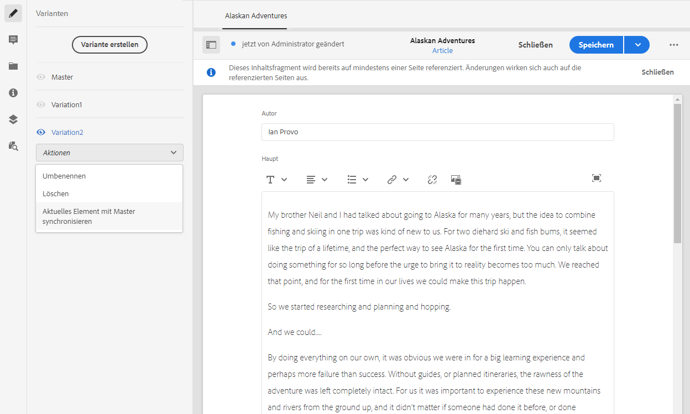

   * über die Symbolleiste des Vollbild-Editors – **Mit primärer Version synchronisieren**

      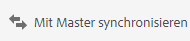

1. Primäre Version und Variante werden nebeneinander angezeigt:

   * Grün zeigt an, dass Inhalt (zur Variante) hinzugefügt wurde
   * Rot zeigt an, dass Inhalt entfernt wurde (aus der Variante)
   * Blau zeigt an, dass Text ersetzt wurde

   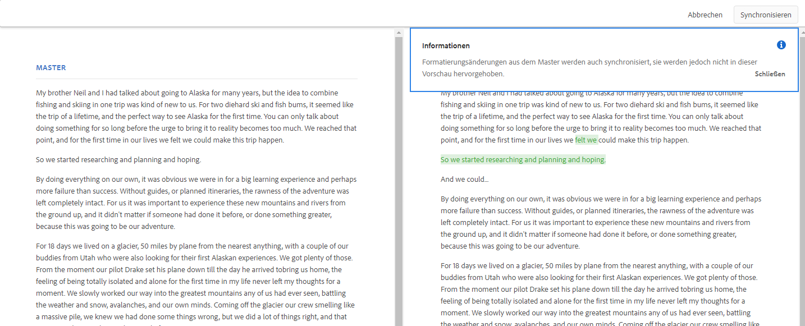

1. Wählen Sie **Synchronisieren**, um die Variante zu aktualisieren und anzuzeigen.
