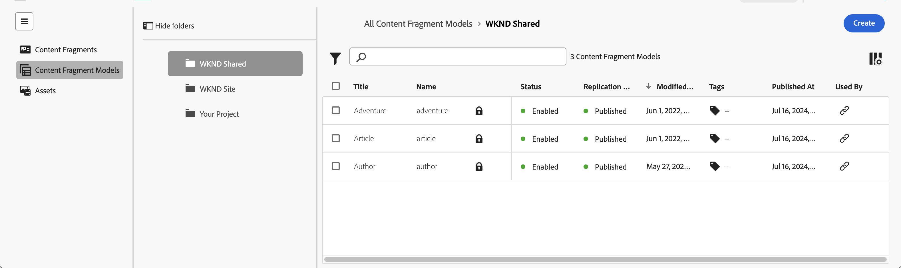
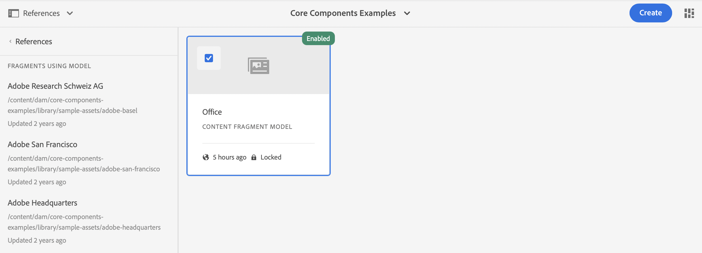

# Verwalten von Inhaltsfragmentmodellen {#managing-content-fragment-models}

In der Inhaltsfragmentkonsole können Sie Ihre Inhaltsfragmentmodelle verwalten und dann [den Editor öffnen](/help/sites-cloud/administering/content-fragments/content-fragment-models.md) um die Struktur zu definieren.

In Inhaltsfragmentmodellen in Adobe Experience Manager (AEM) as a Cloud Service wird die Struktur des Inhalts Ihrer [Inhaltsfragmente](/help/sites-cloud/administering/content-fragments/overview.md) definiert. Diese Fragmente können dann als Grundlage für Ihre Headless-Inhalte oder für die Seitenbearbeitung verwendet werden.

>[!NOTE]
>
>Diese Seite enthält den Abschnitt der Konsole, in dem (nur) Inhaltsfragmentmodelle angezeigt werden. Für andere Panels siehe:
>
>* [Verwalten von Inhaltsfragmenten](/help/sites-cloud/administering/content-fragments/managing.md)   
>* [Anzeigen und Verwalten von Assets in der Inhaltsfragmentkonsole](/help/sites-cloud/administering/content-fragments/assets-content-fragments-console.md)

>[!NOTE]
>
>Inhaltsfragmente werden als **Assets** gespeichert. Inhaltsfragmentmodelle werden hauptsächlich über die Konsole **Inhaltsfragmente** verwaltet, können jedoch auch über die Konsole [Assets](/help/assets/content-fragments/content-fragments-managing.md) und die Option [Inhaltsfragmentmodelle](/help/assets/content-fragments/content-fragments-models.md) verwaltet werden, die unter **Tools** - **Allgemein** ist.

## Arbeiten mit Inhaltsfragmentmodellen {#how-to-work-with-content-fragment-models}

Einen schnellen Überblick bietet die Arbeit mit Inhaltsfragmentmodellen:

1. [Aktivieren Sie die Funktion für Inhaltsfragmentmodelle für Ihre Instanz.](/help/sites-cloud/administering/content-fragments/setup.md)
1. [Erstellen](#creating-a-content-fragment-model) Ihres Inhaltsfragmentmodells.
   * An dieser Stelle können Sie auch **Aktivieren** das Modell auswählen (zur Verwendung beim Erstellen von Inhaltsfragmenten).
1. [Definieren](/help/sites-cloud/administering/content-fragments/content-fragment-models.md#defining-your-content-fragment-model) die Struktur Ihres Modells.
1. [Aktivieren Sie Ihr Inhaltsfragmentmodell](#enabling-a-content-fragment-model) falls noch nicht geschehen.
1. [Lassen Sie Ihre Inhaltsfragmentmodelle in den erforderlichen Asset-Ordnern zu](#allowing-content-fragment-models-assets-folder), indem Sie **Richtlinien** konfigurieren.

## Grundlegende Struktur und Handhabung von Inhaltsfragmentmodellen in der Konsole {#basic-structure-handling-content-fragment-models-console}

Sie können das ganz linke Bedienfeld der [Inhaltsfragmentkonsole](/help/sites-cloud/administering/content-fragments/overview.md#content-fragments-console) verwenden, um **Inhaltsfragmentmodelle** als Ressourcentyp zum Anzeigen, Durchsuchen und Verwalten auszuwählen:

Dadurch wird die Ansicht für Inhaltsfragmentmodelle geöffnet:

Hier können Sie sehen, dass es drei Hauptbereiche gibt:

* Die obere Symbolleiste
   * Bietet die standardmäßigen AEM-Funktionen
   * Zeigt auch Ihre IMS-Organisation an
   * Bietet verschiedene [Aktionen](#actions-unselected)
* Das linke Panel
   * Zeigt die [Pfade zu allen Konfigurationen](/help/sites-cloud/administering/content-fragments/setup.md#enable-content-fragment-functionality-configuration-browser) aufgeführt als Ordner
   * Hier können Sie die Ordnerstruktur ein- oder ausblenden
   * Sie können einen bestimmten Ordner des Baums auswählen
   * Die Größe kann geändert werden, um verschachtelte Ordner anzuzeigen (Unterkonfigurationen)
   * Neben Inhaltsfragmentmodellen können Sie [Inhaltsfragmente“ oder {](/help/sites-cloud/administering/content-fragments/managing.md)}Assets](/help/sites-cloud/administering/content-fragments/assets-content-fragments-console.md) anzeigen. Sie können auch Links zu den Bedienfeldern komprimieren oder erweitern[
* Das Haupt-/rechte Bedienfeld – von hier aus können Sie:
   * Zeigen Sie die Liste aller Inhaltsfragmentmodelle an, die sich im ausgewählten Ordner befinden:
      * Inhaltsfragmentmodelle aus dem ausgewählten Ordner und allen Unterordnern werden angezeigt:
         * Der Speicherort wird durch die Breadcrumbs angegeben. Diese können auch verwendet werden, um den Speicherort zu ändern:
      * [Es werden Informationen zu jedem Modell angezeigt](#information-content-fragment-models)
         * [Sie können auswählen, welche Spalten angezeigt werden sollen.](#select-columns-console)
      * [Verschiedene Informationsfelder](#information-content-fragment-models) zu einem Inhaltsfragmentmodell stellen Links bereit. Je nach Feld können diese:
         * Öffnen Sie das entsprechende Modell im Editor
         * Informationen über den Pfad zur Konfiguration anzeigen
         * Zeigt Informationen zum Status des Modells an
      * [Bestimmte andere Informationsfelder](#information-content-fragments) über ein Inhaltsfragmentmodell können für die [Schnellfilterung“ verwendet ](#fast-filtering):
         * Auswählen eines Wertes in der Spalte, der sofort als Filter angewendet wird
         * Die Schnellfilterung wird für die Spalten **Geändert von**, **Veröffentlicht** und **Status** unterstützt.
      * Wenn Sie den Mauszeiger über die Spaltenüberschriften bewegen, werden ein Selektor der Dropdown-Aktionen und ein Breitenregler angezeigt. Diese ermöglichen Ihnen Folgendes:
         * Sortieren – Wählen Sie die entsprechende Aktion für aufsteigende bzw. absteigende Darstellung aus. 
Dadurch wird die gesamte Tabelle nach dieser Spalte sortiert. Die Sortierung ist nur für die entsprechenden Spalten verfügbar.
         * Ändern Sie die Größe der Spalte – entweder mithilfe der Aktion oder der Breitenregler
      * Wählen Sie ein oder mehrere Modelle für weitere [Aktionen](#actions-selected-content-fragment-models)
   * Den [Filterbereich](#filter-content-fragment-models) öffnen
   * In dieser Konsole stehen verschiedene [Tastaturbefehle](/help/sites-cloud/administering/content-fragments/keyboard-shortcuts.md) zur Verfügung

## Die bereitgestellten Informationen zu Ihren Inhaltsfragmentmodellen {#information-content-fragment-models}

Das Haupt-/rechte Bedienfeld (Tabellenansicht) der Konsole bietet eine Reihe von Informationen zu Ihren Inhaltsfragmentmodellen. Einige Elemente bieten auch direkte Links zu weiteren Aktionen und/oder Informationen:

* **Name**
   * Stellt einen Link zum Öffnen des Modells im Editor bereit.
* **Gesperrt** (Schlosssymbol)
   * Wenn das Modell gesperrt ist, wird dies durch ein Vorhängeschloss-Symbol angezeigt.
* **Pfad**
   * Stellt den Pfad als Link zum Öffnen der Konfiguration in der Konsole bereit.
Wenn Sie den Mauszeiger über einen Ordnernamen bewegen, wird der JCR-Pfad angezeigt.
* **Status**
   * Nur Informationen.
   * Kann für [Schnelles Filtern](#fast-filtering) verwendet werden.
* **Geändert**
   * Nur Informationen.
* **Geändert von**
   * Nur Informationen.
   * Kann für [Schnelles Filtern](#fast-filtering) verwendet werden.
* **Tags**
   * Nur Informationen.
   * Zeigt alle Tags im Zusammenhang mit dem Modell an.
   * Kann für [Schnelles Filtern](#fast-filtering) verwendet werden.
* **Veröffentlicht um**
   * Nur Informationen.
* **Herausgeber**
   * Nur Informationen.
   * Kann für [Schnelles Filtern](#fast-filtering) verwendet werden.

## Modelleigenschaften {#model-properties}

Wenn Sie ein bestimmtes Modell auswählen, werden die Eigenschaften dieses Modells angezeigt (wie beim Erstellen [ Modells definiert](#creating-a-content-fragment-model). Wenn das Modell nicht **gesperrt** ist, können einige Elemente aktualisiert werden. Sie können auch das Informationssymbol (neben dem Modell **Titel**) verwenden, um dieses Informationsfenster zu öffnen und zu schließen.

* **[Pfad](/help/sites-cloud/administering/content-fragments/setup.md#enable-content-fragment-functionality-configuration-browser)**
* **[Status](#enabling-a-content-fragment-model)**
* **Titel**
* **Tags**
* **Beschreibung**
* **Vorschau des URL-Musters**

  Inhaltsfragmentmodelle ermöglichen es Autoren **ihren Inhalt** einer externen Frontend-Anwendung in der Vorschau anzuzeigen. Sobald der **Vorschau-Service** konfiguriert ist, können Sie die URL für die Frontend-Anwendung hinzufügen.

  Die Vorschau-URL sollte diesem Muster entsprechen:
`https://<preview_url>?param=${expression}`

  Verfügbare Ausdrücke sind:

   * `${contentFragment.path}`
   * `${contentFragment.model.path}`
   * `${contentFragment.model.name}`
   * `${contentFragment.variation}`
   * `${contentFragment.id}`

<!-- CHECK: currently under FT -->
<!--
* **GraphQL**
  Define names relevant for GraphQL.
  Changing the GraphQL API Name, or Query field names will impact client applications.
  * **API Name**
    Represents the GraphQL type and query field names in the GraphQL schema.
  * **Single Query Field Name**
    Represents the GraphQL single query field name in the GraphQL schema.
  * **Multiple Query Field Name**
    Represents the GraphQL multiple query field name in the GraphQL schema.
-->

## Aktionen {#actions}

Nachdem Sie einen Ordner ausgewählt haben (im linken Bereich), gibt es eine Reihe von Aktionen, die Sie entweder direkt oder nach Auswahl eines bestimmten Modells verwenden können:

* Verschiedene Aktionen sind direkt [von der Konsole aus verfügbar](#actions-unselected)
* Sie können [ein oder mehrere Inhaltsfragmentmodelle auswählen, um entsprechende Aktionen anzuzeigen](#actions-selected-content-fragment)

### Aktionen (nicht ausgewählt) {#actions-unselected}

Bestimmte Aktionen sind über die Konsole verfügbar - nachdem Sie einen Ordner ausgewählt haben, aber ohne ein bestimmtes Inhaltsfragmentmodell auszuwählen:

* **[Erstellen](#creating-a-content-fragment-model)** eines neuen (leeren) Modells

### Aktionen für ein Inhaltsfragmentmodell in der Inhaltsfragmentkonsole {#actions-selected-content-fragment-models}

Wenn Sie ein bestimmtes Modell auswählen, wird eine Symbolleiste geöffnet, die die für dieses Modell verfügbaren Aktionen anzeigt. Sie können auch mehrere Modelle auswählen. Die verfügbaren Aktionen werden entsprechend angepasst.

* **[Bearbeiten](/help/sites-cloud/administering/content-fragments/content-fragment-models.md)**, um Ihr Inhaltsfragmentmodell zu definieren.
* **Veröffentlichen** entweder auf der [Veröffentlichen](/help/implementing/cloud-manager/manage-environments.md#environment-types) oder [Vorschau](/help/implementing/cloud-manager/manage-environments.md#access-preview-service) Ebene.
* **lock**/**unlock**, um zu steuern, ob ein Benutzer berechtigt ist, das Modell zu ändern.
* **[Aktivieren](#enabling-a-content-fragment-model)**/**[Deaktivieren](#disabling-a-content-fragment-model)**, um zu steuern, ob ein Benutzer Inhaltsfragmente auf Grundlage dieses Modells erstellen darf.

Wenn Sie ein einzelnes Modell auswählen, werden [Modelleigenschaften](#properties) im rechten Bereich angezeigt.

## Auswählen der Spalten, die in der Konsole angezeigt werden {#select-columns-console}

Wie bei anderen Konsolen können Sie konfigurieren, welche Spalten sichtbar und für eine Aktion verfügbar sind:

Daraufhin wird eine Liste von Spalten angezeigt, die Sie ausblenden oder anzeigen können:

## Filtern von Inhaltsfragmentmodellen {#filter-content-fragment-models}

Der Filterbereich bietet folgende Optionen:

* eine Auswahl von Prädikaten;
   * Einschließlich Statusfeldern, Tags, Benutzern usw
   * es kann ein Prädikat ausgewählt oder auch mehrere kombiniert werden, um den Filter zu erstellen.

<!--
* the opportunity to **Save** your filter
* the option to retrieve a saved search filter for reuse
-->

Nach der Auswahl **die Optionen** Filtern nach“ angezeigt (oben im Hauptbedienfeld). Sie können von dort aus abgewählt werden. Zum Beispiel:

### Schnelles Filtern {#fast-filtering}

Sie können auch ein Prädikat auswählen, indem Sie auf einen bestimmten Spaltenwert in der Liste klicken. Sie können einen oder mehrere Werte auswählen, um Eigenschaften zu kombinieren.

Wählen Sie beispielsweise &quot;**&quot;** der Spalte **Status** aus. Nach der Auswahl wird dies als Filtereigenschaft angezeigt und die Liste wird entsprechend gefiltert.

>[!NOTE]
>
>Die Schnellfilterung wird nur für die Spalten **Status**, **Geändert**, **Tags** und **Veröffentlicht von** unterstützt.

>[!NOTE]
>
>Die Schnellfilterung funktioniert auf die gleiche Weise wie für [Inhaltsfragmente](/help/sites-cloud/administering/content-fragments/managing.md#fast-filtering) in der Konsole.

## Erstellen eines Inhaltsfragmentmodells {#creating-a-content-fragment-model}

1. Navigieren Sie zu dem Ordner, der Ihrer [Konfiguration oder Unterkonfiguration](/help/sites-cloud/administering/content-fragments/setup.md) entspricht.
1. Verwenden **Erstellen** um das Dialogfeld zu öffnen.

   >[!CAUTION]
   >
   >Die **Erstellen**-Option ist nur verfügbar:
   >
   >* Wenn die [Verwendung von Inhaltsfragmentmodellen aktiviert wurde](/help/sites-cloud/administering/content-fragments/setup.md)
   >* Wenn Sie den Ordner ausgewählt haben, in dem Sie das Modell erstellen möchten.

1. Wählen Sie den **Pfad** zur Konfiguration aus und geben Sie den **Namen** an.

   >[!NOTE]
   >
   >Die Konfiguration wird automatisch mit der aktuellen Konfiguration ausgefüllt (dem Ordner, in dem Sie sich derzeit befinden).
   >
   >Sie können die Konfiguration auch ändern, indem Sie auf das Ordnersymbol klicken.

   Sie können auch verschiedene Eigenschaften definieren:

   * **Titel**
Wenn Sie zuerst **Titel** eingeben, wird **Name** daraus generiert.
   * a **Beschreibung**
   * **Modell aktivieren**, um [Modell zu aktivieren](#enabling-disabling-a-content-fragment-model)

   >[!NOTE]
   >
   >Weitere Informationen finden Sie unter [Inhaltsfragmentmodell – Eigenschaften](#model-properties).

   

1. Wählen Sie **Erstellen** aus, um das leere Modell zu speichern, oder verwenden Sie **Erstellen und öffnen**.

### Aktivieren eines Inhaltsfragmentmodells {#enabling-a-content-fragment-model}

Nachdem ein Modell erstellt wurde, muss es aus folgenden Gründen aktiviert werden:

* Damit es zur Auswahl steht, wenn ein neues Inhaltsfragment erstellt wird.
* Damit es in einem Inhaltsfragmentmodell referenziert werden kann.
* Damit es für GraphQL verfügbar ist, sodass das Schema generiert wird.

Sie können **Modell** aktivieren):

* Beim Erstellen eines neuen Modells
   * Eine Option wird im Dialogfeld angezeigt.
* Wenn ein Modell speziell deaktiviert **deaktiviert**
   * Wenn das gewünschte Modell ausgewählt ist, ist die Aktion **Aktivieren** in der oberen Symbolleiste verfügbar.

### Deaktivieren eines Inhaltsfragmentmodells {#disabling-a-content-fragment-model}

Ein Modell lässt sich auch aus folgenden Gründen deaktivieren:

* Das Modell ist nicht mehr als Grundlage für die Erstellung *neuer* Inhaltsfragmente verfügbar.
* Beachten Sie jedoch Folgendes:
   * Das GraphQL-Schema wird weiterhin generiert und kann weiterhin abgefragt werden (um eine Beeinträchtigung der JSON-API zu vermeiden).
   * Inhaltsfragmente, die auf dem Modell basieren, können weiterhin abgefragt und vom GraphQL-Endpunkt zurückgegeben werden.
* Das Modell kann nicht mehr referenziert werden. Vorhandene Referenzen bleiben jedoch unverändert und können weiterhin abgefragt und vom GraphQL-Endpunkt zurückgegeben werden.

Um ein Modell zu deaktivieren, das als **Aktiviert** gekennzeichnet ist, verwenden Sie die Option **Deaktivieren** aus:

* Die obere Symbolleiste, wenn das erforderliche Modell ausgewählt ist.

## Zulassen von Inhaltsfragmentmodellen im Asset-Ordner {#allowing-content-fragment-models-assets-folder}

Zur Implementierung der Inhaltsverwaltung können Sie **Richtlinien** im Asset-Ordner konfigurieren, um zu steuern, welche Inhaltsfragmentmodelle für die Fragmenterstellung in diesem Ordner zulässig sind.

>[!NOTE]
>
>Der Mechanismus ähnelt dem [Zulassen von Seitenvorlagen](/help/sites-cloud/authoring/page-editor/templates.md#allowing-a-template-author) für eine Seite und deren untergeordnete Elemente in den erweiterten Eigenschaften einer Seite.

So konfigurieren Sie die **Richtlinien** für **Zulässige Inhaltsfragmentmodelle**:

1. Navigieren Sie zum gewünschten Asset-Ordner und öffnen Sie **Eigenschaften**.

1. Öffnen Sie die Registerkarte **Richtlinien**, in der Sie Folgendes konfigurieren können:

   * **Vererbt von`<folder>`**

     Richtlinien werden beim Erstellen untergeordneter Ordner automatisch übernommen. Die Richtlinie kann neu konfiguriert (und die Vererbung aufgehoben) werden, wenn für Unterordner Modelle zugelassen werden müssen, die vom übergeordneten Ordner abweichen.

   * **Zugelassene Inhaltsfragmentmodelle nach Pfad**

     Es können mehrere Modelle zugelassen werden.

   * **Zugelassene Inhaltsfragmentmodelle nach Tag**

     Es können mehrere Modelle zugelassen werden.

   

1. **Speichern** Sie die Änderungen.

Die für einen Ordner zulässigen Inhaltsfragmentmodelle werden wie folgt aufgelöst:

* Die **Richtlinien** für **Zulässige Inhaltsfragmentmodelle**.
* Falls leer, versuchen Sie, die Richtlinie mithilfe der Vererbungsregeln zu bestimmen.
* Wenn die Vererbungskette kein Ergebnis liefert, prüfen Sie die **Cloud Services**-Konfiguration für diesen Ordner (auch zuerst direkt und dann über Vererbung).
* Wenn keines der oben genannten Verfahren Ergebnisse liefert, gibt es keine zulässigen Modelle für diesen Ordner.

<!--
## Deleting a Content Fragment Model {#deleting-a-content-fragment-model}

>[!CAUTION]
>
>Deleting a Content Fragment model can impact dependent fragments.

To delete a Content Fragment model:

1. Navigate to, and select your Content Fragment Model. You can select multiple models.

1. Select **Delete** from the toolbar.

   >[!NOTE]
   >
   >If the model is referenced a warning is given, so that you can take appropriate action.
-->

## Veröffentlichen eines Inhaltsfragmentmodells {#publishing-a-content-fragment-model}

Inhaltsfragmentmodelle müssen zeitgleich mit oder im Vorfeld der Veröffentlichung abhängiger Inhaltsfragmente veröffentlicht werden.

So veröffentlichen Sie ein Inhaltsfragmentmodell:

1. Navigieren Sie zu und wählen Sie Ihr Inhaltsfragmentmodell aus. Sie können mehrere Modelle auswählen.

1. Wählen Sie **Veröffentlichen** aus der Symbolleiste aus.

1. Wählen Sie im Dialogfeld „Veröffentlichen“ die **Ziel**:

   * **Veröffentlichungs-Service**
   * **Vorschau-Service**

1. Der Workflow zum Veröffentlichen der ausgewählten Modelle und ihrer Referenzen wird gestartet. Der Veröffentlichungsstatus wird dann in der Konsole angezeigt.

<!--
## Unpublishing a Content Fragment Model {#unpublishing-a-content-fragment-model}

Content Fragment Models can be unpublished if they are not referenced by any fragments.

To unpublish a Content Fragment Model:

1. Navigate to, and select your Content Fragment Model.
1. Select **Unpublish** from the toolbar.
   The published status is indicated in the console. 

If you try to unpublish a model that is currently used by one or more fragments, then an error warning is shown. For example: 

The message suggests that you check the [References](/help/sites-cloud/authoring/basic-handling.md#references) panel to investigate further:

-->

## Gesperrte Inhaltsfragmentmodelle {#locked-content-fragment-models}

Mit dieser Funktion können Sie steuern, ob ein Modell aktualisiert werden kann. Sie bietet aber auch Governance für Inhaltsfragmentmodelle, die veröffentlicht wurden.

### Die Herausforderung {#the-challenge}

* Inhaltsfragmentmodelle bestimmen das Schema für GraphQL-Abfragen in AEM.

   * AEM GraphQL-Schemas werden erstellt, sobald ein Inhaltsfragmentmodell erstellt wird, und sie können in der Autoren- und Veröffentlichungsumgebung vorhanden sein.

   * Schemas in der Veröffentlichungsinstanz sind die wichtigsten, da sie die Grundlage für die Live-Bereitstellung von Inhaltsfragmentinhalten im JSON-Format bieten.

* Probleme können auftreten, wenn Inhaltsfragmentmodelle geändert oder bearbeitet werden. Das bedeutet, dass sich das Schema ändert, was wiederum vorhandene GraphQL-Abfragen beeinflussen kann.

* Das Hinzufügen neuer Felder zu einem Inhaltsfragmentmodell sollte (in der Regel) keine schädlichen Auswirkungen haben. Wenn Sie jedoch vorhandene Datenfelder (z. B. deren Namen) ändern oder Felddefinitionen löschen, werden vorhandene GraphQL-Abfragen bei der Anforderung dieser Felder beschädigt.

### Die Voraussetzungen {#the-requirements}

* Anwender wurden auf die Risiken aufmerksam gemacht, die bei der Bearbeitung von Modellen auftreten, die bereits für die Bereitstellung von Live-Inhalten verwendet werden (d. h. von Modellen, die veröffentlicht wurden).

* Außerdem die Vermeidung von unbeabsichtigten Änderungen.

In beiden Fällen können Abfragen beschädigt werden, wenn die geänderten Modelle erneut veröffentlicht werden.

### Die Lösung {#the-solution}

Um diese Probleme zu lösen, werden die Inhaltsfragmentmodelle in der Autorenumgebung durch einen SCHREIBGESCHÜTZTEN Modus *gesperrt*, sobald sie veröffentlicht wurden. Dieser Status wird durch &quot;**&quot;**.

Wenn das Modell **Gesperrt** ist (im schreibgeschützten Modus), können Sie die Inhalte und die Struktur der Modelle anzeigen, sie jedoch nicht bearbeiten.

Sie können **Gesperrte** Modelle entweder aus der Konsole heraus oder im Modell-Editor verwalten:

* Konsole

  In der Konsole können Sie den SCHREIBGESCHÜTZTEN Modus mit den Aktionen **Entsperren** und **Sperren** in der Symbolleiste verwalten.

   * Sie können ein Modell zum Aktivieren von Bearbeitungen **Entsperren**.

     Wenn Sie **Entsperren** auswählen, wird eine Warnung angezeigt, und Sie müssen die Aktion **Entsperren** bestätigen.

     Anschließend können Sie das Modell zum Bearbeiten öffnen.

   * Sie können das Modell anschließend auch wieder **Sperren**.
   * Wenn Sie das Modell erneut veröffentlichen, wird es sofort wieder in den Modus **Gesperrt** (SCHREIBGESCHÜTZT) zurückgesetzt.

* Modell-Editor

   * Wenn Sie ein gesperrtes Modell öffnen, werden Sie gewarnt und es werden Ihnen drei Aktionen angezeigt: **Abbrechen**, **Schreibgeschützt anzeigen**, **Bearbeiten**.

   * Wenn Sie **Schreibgeschützt anzeigen** auswählen, können Sie den Inhalt und die Struktur des Modells sehen.

   * Wenn Sie **Bearbeiten** auswählen, können Sie Ihre Änderungen bearbeiten und speichern:

     

     >[!NOTE]
     >
     >Oben kann noch eine Warnung angezeigt werden. In diesem Fall wird das Modell jedoch bereits von vorhandenen Inhaltsfragmenten verwendet.

   * Mit **Abbrechen** kehren Sie zur Konsole zurück.
