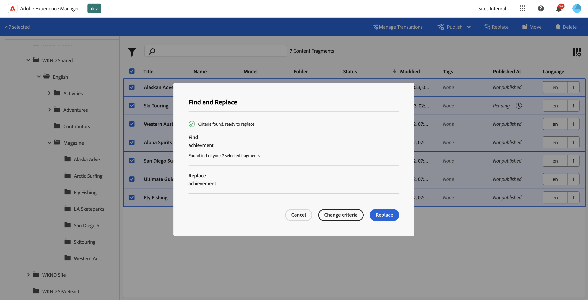
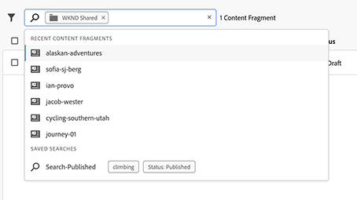

# Verwalten von Inhaltsfragmenten {#managing-content-fragments}

>[!IMPORTANT]
>
>Verschiedene Funktionen von Inhaltsfragmenten und Inhaltsfragmentmodellen sind im Rahmen des Early-Adopter-Programms verfügbar.
>
>Den Status und Informationen zur Bewerbung für das Programm finden Sie in den [Versionshinweisen](/help/release-notes/release-notes-cloud/release-notes-current.md).

Erfahren Sie, wie Sie Ihre **Inhaltsfragmente** in Adobe Experience Manager (AEM) as a Cloud Service über die dedizierte [Inhaltsfragmentkonsole](#content-fragments-console) und den [Inhaltsfragmenteditor](/help/sites-cloud/administering/content-fragments/authoring.md#content-fragment-editor) verwalten. Diese Inhaltsfragmente können als Grundlage für Ihren Headless-Inhalt oder für die Seitenbearbeitung verwendet werden.

>[!NOTE]
>
>Ihr Projekt-Team kann die Konsole und den Editor bei Bedarf anpassen. Weitere Details hierzu finden Sie unter [Anpassen von Inhaltsfragmentkonsole und Editor](/help/implementing/developing/extending/content-fragments-console-and-editor.md).

Nachdem Sie Ihre [Inhaltsfragmentmodelle](#creating-a-content-model) definiert haben, können Sie diese für Folgendes verwenden:

* [Erstellen Sie Inhaltsfragmente](#creating-a-content-fragment).
* Öffnen Sie anschließend den [Inhaltsfragmenteditor](#opening-the-fragment-editor), um [Inhalte zu erstellen und Varianten zu verwalten](#editing-the-content-of-your-fragment).
* [Tags verwalten](#manage-tags)
* [Eigenschaften (Metadaten) anzeigen und bearbeiten](#viewing-and-editing-properties)
* [Strukturbaum anzeigen](/help/sites-cloud/administering/content-fragments/authoring.md#structure-tree)

>[!NOTE]
>
>Inhaltsfragmente können in folgenden Fällen verwendet werden:
>
>* Für [Headless-Bereitstellung mithilfe von Inhaltsfragmenten mit GraphQL](/help/sites-cloud/administering/content-fragments/content-delivery-with-graphql.md),
>* Beim Erstellung von Seiten. Siehe [Seitenbearbeitung mit Inhaltsfragmenten](/help/sites-cloud/authoring/fragments/content-fragments.md).

>[!NOTE]
>
>Inhaltsfragmente werden als **Assets** gespeichert. Sie werden hauptsächlich über die **Inhaltsfragment**-Konsole verwaltet, können jedoch auch über die [Assets](/help/assets/content-fragments/content-fragments-managing.md)-Konsole verwaltet werden.

## Die Inhaltsfragmentkonsole {#content-fragments-console}

Die Inhaltsfragmentkonsole dient der Verwaltung, Suche und Erstellung von Inhaltsfragmenten. Sie wurde für die Verwendung in einem Headless-Kontext optimiert, wird aber auch beim Erstellen von Inhaltsfragmenten für die Seitenbearbeitung verwendet.

Die Inhaltsfragmentkonsole bietet direkten Zugriff auf Ihre Fragmente und zugehörige Aufgaben. Die Konsole kann direkt von der obersten Ebene der globalen Navigation aus aufgerufen werden.

Weitere Einzelheiten finden Sie unter:

* [Grundlegende Struktur und Handhabung der Inhaltsfragmentkonsole](#basic-structure-handling-content-fragments-console)

* [Die bereitgestellten Informationen zu Ihren Inhaltsfragmenten](#information-content-fragments)

* [Aktionen für ein Inhaltsfragment in der Inhaltsfragmentkonsole](#actions-selected-content-fragment)

* [Auswählen der Spalten, die in der Konsole angezeigt werden](#select-columns-console)

* [Suchen und Filtern in der Inhaltsfragmentkonsole](#filtering-fragments)

* In dieser Konsole stehen verschiedene [Tastaturbefehle](/help/sites-cloud/administering/content-fragments/keyboard-shortcuts.md) zur Verfügung

>[!NOTE]
>
>In dieser Konsole werden nur Inhaltsfragmente angezeigt. Andere Asset-Typen wie Bilder und Videos werden nicht angezeigt.

>[!CAUTION]
>
>Diese Konsole ist *nur* online in Adobe Experience Manager (AEM) as a Cloud Service verfügbar.

### Grundlegende Struktur und Handhabung der Konsole {#basic-structure-handling-content-fragments-console}

Wenn Sie **Inhaltsfragmente** auswählen, wird die Konsole in einer neuen Registerkarte geöffnet.

<!-- CQDOC-21349: screenshot -->

Hier können Sie sehen, dass es drei Hauptbereiche gibt:

* Die obere Symbolleiste
   * Bietet die standardmäßigen AEM-Funktionen
   * Zeigt auch Ihre IMS-Organisation an
   * Bietet verschiedene [Aktionen](#actions-unselected)
* Das linke Bedienfeld
   * Hier können Sie die Ordnerstruktur ein- oder ausblenden
   * Sie können einen bestimmten Zweig des Baums auswählen
   * Die Größe kann geändert werden, um verschachtelte Ordner anzuzeigen
   * Sie können zwischen der Anzeige von Inhaltsfragmenten oder [Assets](/help/sites-cloud/administering/content-fragments/assets-content-fragments-console.md) wählen.
* Das Haupt-/rechte Bedienfeld – von hier aus können Sie:
   * Eine Liste aller Inhaltsfragmente im ausgewählten Zweig des Baums anzeigen:
      * Es werden die Inhaltsfragmente aus dem ausgewählten Ordner und dazu alle untergeordneten Ordner angezeigt.
         * Der Speicherort wird durch die Breadcrumbs angegeben. Diese können auch verwendet werden, um den Speicherort zu ändern:
      * [Es werden Informationen zu den einzelnen Fragmenten angezeigt.](#information-content-fragments)
         * [Sie können auswählen, welche Spalten angezeigt werden sollen.](#select-columns-console)
      * [Verschiedene Informationsfelder](#information-content-fragments) zu einem Inhaltsfragment stellen Links bereit. Je nach Feld können diese:
         * Das entsprechende Fragment im Editor öffnen,
         * Informationen zu Verweisen anzeigen,
         * Informationen zu Sprachversionen des Fragments anzeigen.
      * [Bestimmte andere Informationsfelder](#information-content-fragments) über ein Inhaltsfragment können für [Schnelles Filtern](#fast-filtering) verwendet werden:
         * Auswählen eines Wertes in der Spalte, der sofort als Filter angewendet wird
         * „Schnelles Filtern“ wird nur für die Spalten **Modell**, **Status**, **Geändert von**, **Tags** und **Veröffentlicht von** unterstützt.
      * Wenn Sie den Mauszeiger über die Spaltenüberschriften bewegen, werden ein Selektor der Dropdown-Aktionen und ein Breitenregler angezeigt. Diese ermöglichen Ihnen Folgendes:
         * Sortieren – Wählen Sie die entsprechende Aktion für aufsteigende bzw. absteigende Darstellung aus. 
Dadurch wird die gesamte Tabelle nach dieser Spalte sortiert. Die Sortierung ist nur für die entsprechenden Spalten verfügbar.
         * Ändern Sie die Größe der Spalte – entweder mithilfe der Aktion oder der Breitenregler
      * Ein oder mehrere Fragmente für weitere [Aktionen](#actions-selected-content-fragment) wählen
   * Das Feld [Suchen](#searching-fragments) verwenden
   * Den [Filterbereich](#filtering-fragments) öffnen

### Aktionen {#actions}

In der Konsole gibt es eine Reihe von Aktionen, die Sie entweder direkt oder nach Auswahl eines bestimmten Fragments verwenden können:

* Verschiedene Aktionen sind direkt [von der Konsole aus verfügbar](#actions-unselected)
* Sie können [ein oder mehrere Inhaltsfragmente auswählen, um entsprechende Aktionen anzuzeigen](#actions-selected-content-fragment)

#### Aktionen (nicht ausgewählt) {#actions-unselected}

Bestimmte Aktionen sind über die Konsole verfügbar, ohne ein bestimmtes Inhaltsfragment auszuwählen:

* Ein neues Inhaltsfragment **[erstellen](#creating-a-content-fragment)**
* Die Inhaltsfragmente entsprechend einer Auswahl von Eigenschaften [filtern](#filtering-fragments) und den Filter für die zukünftige Verwendung speichern
* Die Inhaltsfragmente [durchsuchen](#searching-fragments)
* [Die Tabellenansicht so anpassen, dass ausgewählte Spalten mit Informationen angezeigt werden](#select-columns-console)
* Verwenden Sie **In Assets öffnen**, um den aktuellen Speicherort direkt in der **Assets**-Konsole zu öffnen

  >[!NOTE]
  >
  >Die **Assets-Konsole** wird verwendet, um auf Assets wie Bilder und Videos zuzugreifen. Auf die Konsole kann wie folgt zugegriffen werden:
  >
  >* mithilfe des Links **In Assets öffnen** (in der Konsole „Inhaltsfragmente“)
  >* direkt über das globale **Navigationsfenster**

#### Aktionen für ein (ausgewähltes) Inhaltsfragment {#actions-selected-content-fragment}

Wenn Sie ein bestimmtes Fragment auswählen, wird eine Symbolleiste geöffnet, die die verfügbaren Aktionen für dieses Fragment anzeigt. Sie können auch mehrere Fragmente auswählen. Die Auswahl der Aktionen wird dann entsprechend angepasst.

<!-- CQDOC-21349: screenshot -->

* **[In neuem Editor öffnen](#editing-the-content-of-your-fragment)**
* **[Öffnen](/help/assets/content-fragments/content-fragments-variations.md)** (im ursprünglichen Editor)
* **[Veröffentlichen](#publishing-and-previewing-a-fragment)** (und **[Veröffentlichung rückgängig machen](#unpublishing-a-fragment)**)
* **[Tags verwalten](#manage-tags)**
* **[Kopieren](/help/assets/manage-digital-assets.md)**
* **[Verschieben](/help/assets/manage-digital-assets.md)**
* **[Umbenennen](/help/assets/manage-digital-assets.md)**
* **[Löschen](#deleting-a-fragment)**
* **[Ersetzen](#find-and-replace)**

>[!NOTE]
>
>Verwenden Sie die Option **Öffnen**, um das ausgewählte Fragment im *ursprünglichen* Editor zu öffnen.

>[!NOTE]
>
>Aktionen wie Veröffentlichen, Veröffentlichung aufheben, Löschen, Verschieben, Umbenennen und Kopieren lösen einen asynchronen Vorgang aus. Der Fortschritt dieses Vorgangs kann über die AEM-Benutzeroberfläche für asynchrone Vorgänge überwacht werden.

### Die bereitgestellten Informationen zu Ihren Inhaltsfragmenten {#information-content-fragments}

Der Haupt-/rechte Bereich (Tabellenansicht) der Konsole enthält eine Reihe von Informationen zu Ihren Inhaltsfragmenten. Einige Elemente bieten auch direkte Links zu weiteren Aktionen und/oder Informationen:

* **Name**
   * Stellt einen Link zum Öffnen des Fragments im Editor bereit.
* **Modell**
   * Nur Informationen.
   * Kann für [Schnelles Filtern](#fast-filtering) verwendet werden.
* **Ordner**
   * Stellt einen Link zum Öffnen des Ordners in der Konsole bereit.
Wenn Sie den Mauszeiger über einen Ordnernamen bewegen, wird der JCR-Pfad angezeigt.
* **Status**
   * Nur Informationen.
   * Kann für [Schnelles Filtern](#fast-filtering) verwendet werden.
* **Vorschau**
   * Nur Informationen:
      * **Synchronisiert**: Inhaltsfragment ist mit den **Autoren-** und **Vorschau-** Services synchronisiert.
      * **Nicht synchronisiert**: Inhaltsfragment ist nicht mit den **Autoren-** und **Vorschau-** Services synchronisiert. Sie müssen **Veröffentlichen** für eine **Vorschau** einrichten, um sicherzustellen, dass die beiden Instanzen wieder synchronisiert werden.
      * leer: Das Inhaltsfragment existert nicht im **Vorschau**-Service.
* **Geändert**
   * Nur Informationen.
* **Geändert von**
   * Nur Informationen.
   * Kann für [Schnelles Filtern](#fast-filtering) verwendet werden.
* **Tags**
   * Nur Informationen.
   * Zeigt alle Tags an, die sich auf das Inhaltsfragment beziehen, sowohl das Hauptfragment als auch alle Varianten.
   * Kann für [Schnelles Filtern](#fast-filtering) verwendet werden.
* **Veröffentlicht um**
   * Nur Informationen.
* **Herausgeber**
   * Nur Informationen.
   * Kann für [Schnelles Filtern](#fast-filtering) verwendet werden.
* **Referenziert von**:
   * Stellt einen Link bereit, der ein Dialogfeld öffnet, in dem alle [übergeordneten Verweise](#parent-references-fragment) dieses Fragments aufgelistet werden, einschließlich der Referenzierung von Inhaltsfragmenten, Experience Fragments und Seiten. Um eine bestimmte Referenz zu öffnen, klicken Sie im Dialogfeld auf **Titel**.

     

* **Sprache**: Angabe jedweder [Sprachkopie](#language-copies-fragment)

   * Gibt das Gebietsschema des Inhaltsfragments zusammen mit der Gesamtzahl der mit dem Inhaltsfragment verknüpften Gebietsschemata/[Sprachkopien](#language-copies-fragment) an.

     

   * Wählen Sie die Anzahl aus, um ein Dialogfeld zu öffnen, in dem alle Sprachkopien angezeigt werden. Um eine bestimmte Sprachkopie zu öffnen, klicken Sie auf den **Titel** im Dialogfeld.

     

## Erstellen von Inhaltsfragmenten {#creating-content-fragments}

Vor der Erstellung des Inhaltsfragments muss das zugrunde liegende Inhaltsfragmentmodell erstellt werden.

### Erstellen eines Inhaltsmodells {#creating-a-content-model}

[Inhaltsfragmentmodelle](/help/sites-cloud/administering/content-fragments/content-fragment-models.md) müssen vor dem Erstellen von Inhaltsfragmenten mit strukturiertem Inhalt aktiviert und erstellt werden.

### Erstellen eines Inhaltsfragments {#creating-a-content-fragment}

So erstellen Sie ein Inhaltsfragment:

1. Wählen Sie in der **Inhaltsfragment**-Konsole **Erstellen** (oben rechts).

   >[!NOTE]
   >
   >Damit der Speicherort des neuen Fragments vordefiniert ist, können Sie zu dem Ordner navigieren, in dem Sie das Fragment erstellen möchten, oder Sie können den Speicherort während des Erstellungsprozesses angeben.

1. Das Dialogfeld **Neues Inhaltsfragment** wird geöffnet. Hier können Sie Folgendes angeben:

   * **Speicherort** – Dies wird automatisch mit dem aktuellen Speicherort ausgefüllt, Sie können jedoch bei Bedarf einen anderen Speicherort auswählen.
   * **Inhaltsfragmentmodell** – Wählen Sie aus der Dropdown-Liste das Modell aus, das als Grundlage für das Fragment verwendet werden soll.
   * **Automatisches Tagging** - Wenn Sie diese Option auswählen, werden alle dem Inhaltsfragmentmodell zugewiesenen Tags vom neuen Inhaltsfragment übernommen und hinzugefügt.
   * **Titel**
   * **Name** – Dies wird basierend auf dem **Titel** automatisch ausgefüllt, kann jedoch bei Bedarf bearbeitet werden.
   * **Beschreibung**

   

1. Wählen Sie **Erstellen** oder, um Ihre Definition beizubehalten, **Erstellen und öffnen** aus.

## Status von Inhaltsfragmenten {#statuses-content-fragments}

Während seines Bestehens kann ein Inhaltsfragment mehrere Status haben, wie in der [Inhaltsfragmentkonsole](/help/sites-cloud/administering/content-fragments/managing.md#content-fragments-console) und dem [Inhaltsfragmenteditor](/help/sites-cloud/administering/content-fragments/authoring.md) gezeigt:

* **Neu** (Grau)
Im Inhaltsfragmenteditor wurde ein neues Inhaltsfragment erstellt, es hat jedoch keinen Inhalt und wurde nie bearbeitet oder geöffnet.
* **Entwurf** (Blau)
Das (neue) Inhaltsfragment wurde im Inhaltsfragmenteditor von jemandem bearbeitet oder geöffnet, es wurde jedoch noch nicht veröffentlicht.
* **Veröffentlicht** (Grün)
Das Inhaltsfragment wurde veröffentlicht.
* **Geändert** (Orange)
Das Inhaltsfragment wurde nach der Veröffentlichung bearbeitet (aber vor der Veröffentlichung der Änderung).
* **Veröffentlichung rückgängig gemacht** (Rot)
Die Veröffentlichung des Inhaltsfragments wurde rückgängig gemacht.

## Bearbeiten des Inhalts Ihres Fragments (und von Varianten) {#editing-the-content-of-your-fragment}

>[!IMPORTANT]
>
>Ausführliche Informationen finden Sie unter [Erstellen von Inhaltsfragmenten](/help/sites-cloud/administering/content-fragments/authoring.md)

So öffnen Sie ein Fragment zur Bearbeitung:

1. Navigieren Sie in der **Inhaltsfragmentkonsole** zum Speicherort des gewünschten Inhaltsfragments.
1. Öffnen Sie das Fragment zur Bearbeitung, indem Sie das Fragment auswählen und dann in der Symbolleiste **In neuem Editor öffnen** auswählen.

1. Der Fragmenteditor wird geöffnet. Wählen Sie Ihre erforderliche **Variante** aus und nehmen Sie Ihre Änderungen nach Bedarf vor (sie werden automatisch gespeichert):

   

## Anzeigen und Verwalten von Tags {#manage-tags}

In der Inhaltsfragmentkonsole können Sie alle angewendeten Tags in der Spalte **Tags** anzeigen, nachdem sichergestellt wurde, dass [die Spalte angezeigt wird](#select-columns-console).

### Verwalten von Tags (Konsole) {#manage-tags-console}

So verwalten Sie die Tags:

1. Navigieren Sie zur Inhaltsfragmentkonsole.
1. Wählen Sie ein Inhaltsfragment aus.
1. Wählen Sie in der Symbolleiste **Tags verwalten** aus.
1. Verwenden Sie die Tag-Auswahl, um Tags auszuwählen, die angewendet oder entfernt werden sollen:

   

1. **Speichern** Sie die Aktualisierungen. Hierdurch kehren Sie zur Konsole zurück.

### Anzeigen und Bearbeiten von Tags (Editor) {#viewing-and-editing-tags}

Sie können die auf ein Fragment angewendeten Tags auch mithilfe der [Eigenschaften](/help/sites-cloud/administering/content-fragments/authoring.md)-Registerkarte des Editors anzeigen und bearbeiten. Die angezeigten Informationen unterscheiden sich zwischen **Hauptversion** und **Varianten**.

## Anzeigen und Bearbeiten von Eigenschaften (Editor) {#viewing-and-editing-properties}

Sie können die Eigenschaften (Metadaten) eines Fragments mithilfe der Registerkarte [Eigenschaften](/help/sites-cloud/administering/content-fragments/authoring.md) des Editors anzeigen und bearbeiten. Die angezeigten Informationen unterscheiden sich zwischen **Hauptversion** und **Varianten**.

## Veröffentlichen und Anzeigen von Fragmenten in der Vorschau {#publishing-and-previewing-a-fragment}

Sie können Ihre Inhaltsfragmente hier veröffentlichen:

* der **[Publishing-Service](/help/headless/deployment/architecture.md)** – für uneingeschränkten öffentlichen Zugriff

* der **[Vorschau-Service](/help/headless/deployment/architecture.md)** – um den Inhalt for der vollständigen Verfügbarkeit in der Vorschau zu sehen

  >[!CAUTION]
  >
  >Das Veröffentlichen von Inhaltsfragmenten im **Vorschau-Service** ist nur über die Inhaltsfragmentkonsole mithilfe der Aktion **Veröffentlichen** verfügbar.

  >[!NOTE]
  >
  >Weitere Informationen zu den Vorschauumgebungen finden Sie unter [Verwalten von Umgebungen](/help/implementing/cloud-manager/manage-environments.md#access-preview-service).

>[!CAUTION]
>
>Wenn das Fragment auf einem Modell basiert, sollten Sie sicherstellen, dass das [Modell veröffentlicht wurde](/help/sites-cloud/administering/content-fragments/content-fragment-models.md#publishing-a-content-fragment-model).
>
>Wenn Sie Inhaltsfragmente veröffentlichen, deren Modell noch nicht veröffentlicht wurde, wird dies in der Auswahlliste angezeigt und das Modell wird mit dem Fragment veröffentlicht.

### Veröffentlichung {#publishing}

Sie können Ihre Inhaltsfragmente über die Option **Veröffentlichen** mit folgenden Methoden veröffentlichen:

* Über die Symbolleiste der [Inhaltsfragmentkonsole](#actions-selected-content-fragment)

   * Wählen Sie ein oder mehrere Fragmente aus der Liste aus.

* Über die Symbolleiste des [Inhaltsfragmenteditors](/help/sites-cloud/administering/content-fragments/authoring.md#content-fragment-editor)

Nach Auswahl der Aktion **Veröffentlichen**:

1. Wählen Sie eine der folgenden Optionen aus, um das entsprechende Dialogfeld zu öffnen:

   * **Jetzt** – Wählen Sie entweder den **Publishing-Service** oder den **Vorschau-Service**. Nach Bestätigung wird dann das Fragment sofort veröffentlicht.
   * **Zeitplan** – Zusätzlich zum erforderlichen Service können Sie auch das Datum und die Uhrzeit aussuchen, wann das Fragment veröffentlicht werden soll.

1. Geben Sie alle Details im Dialogfeld an. Beispiel für eine geplante Veröffentlichungsanfrage:

   

   >[!NOTE]
   >
   >Bei Bedarf müssen Sie die zu veröffentlichenden Verweise angeben. Standardmäßig werden Verweise auch im Vorschau-Service veröffentlicht, um sicherzustellen, dass keine Brüche im Inhalt vorhanden sind.

1. Bestätigen Sie die Veröffentlichungsaktion.

Nach der Veröffentlichung wird der Fragmentstatus aktualisiert und im Editor und in der Konsole angezeigt. Wenn Sie eine geplante Veröffentlichung festgelegt haben, werden Informationen angezeigt.

>[!NOTE]
>
>Wenn Sie [eine Seite veröffentlichen, in der das Fragment verwendet wird](/help/sites-cloud/authoring/fragments/content-fragments.md#publishing), wird das Fragment außerdem in den Seitenverweisen aufgeführt.

## Rückgängigmachen der Veröffentlichung eines Fragments {#unpublishing-a-fragment}

Sie können die Veröffentlichung von Inhaltsfragmenten rückgängig machen:

* die Symbolleiste der [Inhaltsfragmentkonsole](#actions-selected-content-fragment)

   * Wählen Sie ein oder mehrere Fragmente aus der Liste aus.

* die Symbolleiste des [Inhaltsfragmenteditors](/help/sites-cloud/administering/content-fragments/authoring.md#content-fragment-editor)

Wählen Sie in beiden Fällen **Veröffentlichung rückgängig machen** in der Symbolleiste aus, gefolgt von **Jetzt** oder **Geplant**.

Wenn das entsprechende Dialogfeld geöffnet wird, können Sie den gewünschten Service auswählen:

>[!NOTE]
>
>Die Aktion **Veröffentlichung rückgängig machen** wird nur dann angezeigt, wenn veröffentlichte Fragmente verfügbar sind.

>[!CAUTION]
>
>Wenn das Fragment bereits von einem anderen Fragment oder von einer Seite referenziert wird, wird eine Warnmeldung angezeigt, in der Sie zur Bestätigung des Vorgangs aufgefordert werden.

## Suchen und Ersetzen {#find-and-replace}

<!-- CQDOC-21349: screenshot -->

Die Aktion **Ersetzen** ist verfügbar (in der oberen Symbolleiste), um den angegebenen Text in den ausgewählten Inhaltsfragmenten zu suchen und zu ersetzen.

Vor dem Ersetzen werden die Validierungskriterien überprüft und Sie werden über etwaige Konflikte informiert, sodass Sie die Ersatz-Zeichenfolge ändern oder nur die validierten Instanzen ersetzen können.

>[!NOTE]
>
>Die Aktion „Suchen und Ersetzen“ kann nur für maximal 20 ausgewählte Inhaltsfragmente (gleichzeitig) ausgeführt werden.
>
>Wenn Sie mehr als 20 Inhaltsfragmente auswählen, wird die Nachricht **Suchen und Ersetzen ist nicht möglich** angezeigt.

<!-- CQDOC-21349: screenshot -->

## Löschen von Fragmenten {#deleting-a-fragment}

So löschen Sie ein Fragment:

1. Navigieren Sie in der **Inhaltsfragmentkonsole** zum Speicherort des Inhaltsfragments.
1. Wählen Sie das Fragment aus.
1. Wählen Sie **Löschen** in der Symbolleiste aus.
1. Bestätigen Sie die **Löschaktion**.

>[!NOTE]
>
>Die Aktion **Löschen** ist nicht für Fragmente verfügbar, die derzeit veröffentlicht sind. Für diese muss die Veröffentlichung zuerst rückgängig gemacht werden.

## Suchen von übergeordneten Referenzen Ihres Fragments {#parent-references-fragment}

Auf die Details der übergeordneten Verweise kann über die

* Spalte **Verweise** der Inhaltsfragmentkonsole zugegriffen werden.
* der [Link zu übergeordneten Verweisen in der oberen Symbolleiste des Inhaltsfragmenteditors](/help/sites-cloud/administering/content-fragments/authoring.md#view-parent-references)

Beide stellen einen Link bereit, der ein Dialogfeld öffnet, in dem alle übergeordneten Verweise dieses Fragments aufgelistet werden, einschließlich der Referenzierung von Inhaltsfragmenten, Experience Fragments und Seiten. Um eine bestimmte Referenz zu öffnen, klicken Sie im Dialogfeld auf den **Titel** oder auf das Link-Symbol.

Zum Beispiel:

## Suchen von Sprachkopien Ihres Fragments {#language-copies-fragment}

Details zu Sprachkopien sind abrufbar über:

* die Spalte **Sprache** der [Inhaltsfragmentkonsole](#information-content-fragments)
* die [Registerkarte „Sprachkopien“ des Inhaltsfragmenteditors](/help/sites-cloud/administering/content-fragments/authoring.md#view-language-copies)

Das Symbol gibt das Gebietsschema des Inhaltsfragments zusammen mit der Gesamtzahl der mit dem Inhaltsfragment verknüpften Gebietsschemata/Sprachkopien an. Beispielsweise in der Konsole:

Wählen Sie die Anzahl aus, um ein Dialogfeld zu öffnen, in dem alle Sprachkopien angezeigt werden. Um eine bestimmte Sprachkopie zu öffnen, klicken Sie auf den **Titel** im Dialogfeld.

## Auswählen der Spalten, die in der Konsole angezeigt werden {#select-columns-console}

Wie bei anderen Konsolen können Sie konfigurieren, welche Spalten sichtbar und für eine Aktion verfügbar sind:

Daraufhin wird eine Liste von Spalten angezeigt, die Sie ausblenden oder anzeigen können:

## Filtern von Fragmenten {#filtering-fragments}

Der Filterbereich bietet folgende Optionen:

* eine Auswahl von Prädikaten;
   * einschließlich Inhaltsfragmentmodellen, Lokalisierung, Tags, Statusfeldern usw.
   * es kann ein Prädikat ausgewählt oder auch mehrere kombiniert werden, um den Filter zu erstellen.
* die Option **Unterordnerelemente ausschließen**, mit der Sie in Unterordnern gespeicherte Inhaltsfragmente ausschließen können
* die Möglichkeit, Ihre Konfiguration zu **speichern**
* die Option zum Abrufen eines gespeicherten Suchfilters für die Wiederverwendung

Nach der Auswahl werden die Optionen **Filtern nach** angezeigt (unter dem Suchfeld). Sie können von dort aus abgewählt werden. Zum Beispiel:

<!-- CQDOC-21349: screenshot -->

### Schnelles Filtern {#fast-filtering}

Sie können auch ein Prädikat auswählen, indem Sie auf einen bestimmten Spaltenwert in der Liste klicken. Sie können einen oder mehrere Werte auswählen, um Eigenschaften zu kombinieren.

Wählen Sie zum Beispiel **Veröffentlicht** in der Spalte **Status**:

>[!NOTE]
>
>Die Schnellfilterung wird nur für die Spalten **Modell**, **Status**, **Geändert von**, **Tags** und **Veröffentlicht von** unterstützt.

Nach der Auswahl wird dies als Filtereigenschaft angezeigt und die Liste entsprechend gefiltert:

## Suchen von Fragmenten {#searching-fragments}

Das Suchfeld unterstützt die Volltextsuche. Geben Sie Ihre Suchbegriffe in das Suchfeld ein:

<!-- CQDOC-21349: screenshot -->

Die ausgewählten Ergebnisse werden bereitgestellt:

<!-- CQDOC-21349: screenshot -->

Das Suchfeld bietet außerdem schnellen Zugriff auf die **letzten Inhaltsfragmente** und die **gespeicherten Suchvorgänge**:

