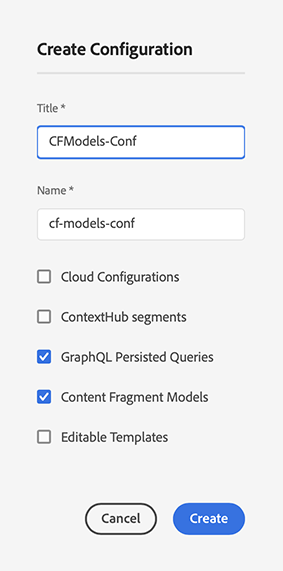

# Inhaltsfragmente – Einrichtung {#content-fragments-setup}

Inhaltsfragmente in Adobe Experience Manager (AEM) as a Cloud Service ermöglichen die Vorbereitung von Inhalten für die Verwendung an mehreren Orten und über mehrere Kanäle. Dies ist ideal für die Headless-Bereitstellung und die Seitenbearbeitung.

Um Ihre Instanz für die Inhaltsfragmentfunktionen zu aktivieren, müssen Sie Folgendes aktivieren:

* **Inhaltsfragmentmodelle** – obligatorisch

  >[!CAUTION]
  >
  >Wenn Sie **Inhaltsfragmentmodelle** nicht aktivieren:
  >
  >* ist die Option **Erstellen** für das Erstellen von Modellen nicht verfügbar.
  >* können Sie die [Sites-Konfiguration nicht auswählen, um den entsprechenden Endpunkt zu erstellen](/help/headless/graphql-api/graphql-endpoint.md).

* **GraphQL: Beständige Abfragen** – optional

Das Einrichten Ihrer Instanz ist abgeschlossen:

* durch das [Aktivieren der Funktionen im Konfigurations-Browser](#enable-content-fragment-functionality-configuration-browser)
* dann das [Anwenden der Konfiguration auf Ihre einzelnen Assets-Ordner](#apply-the-configuration-to-your-folder)

>[!TIP]
>
>Edge Delivery Services Inhaltsfragmente können in [&#x200B; veröffentlicht werden](https://www.aem.live/developer/content-fragment-overlay)

## Aktivieren von Inhaltsfragmentfunktionen im Konfigurations-Browser {#enable-content-fragment-functionality-configuration-browser}

Um die Inhaltsfragmentfunktionen von Inhaltsfragmentmodellen und von GraphQL beständigen Abfragen zu verwenden, **müssen** Sie sie zunächst über den **Konfigurations-Browser** aktivieren:

>[!NOTE]
>
>Weitere Informationen finden Sie unter [Konfigurations-Browser](/help/implementing/developing/introduction/configurations.md#using-configuration-browser).

>[!NOTE]
>
>[Unterkonfigurationen](/help/implementing/developing/introduction/configurations.md#configuration-resolution) (eine Konfiguration, die in einer anderen Konfiguration verschachtelt ist) werden vollständig zur Verwendung mit Inhaltsfragmenten, Inhaltsfragmentmodellen und GraphQL-Abfragen unterstützt.
>
>Beachten Sie Folgendes:
>
>* Nach dem Erstellen von Modellen in einer Unterkonfiguration ist es NICHT möglich, das Modell in eine andere Unterkonfiguration zu verschieben oder zu kopieren.
>
>* Ein GraphQL-Endpunkt basiert (weiterhin) auf einer übergeordneten (Stamm-)Konfiguration.
>
>* Beständige Abfragen werden (weiterhin) gespeichert und sind für die übergeordnete (Stamm-)Konfiguration relevant.

1. Navigieren Sie zu **Tools** > **Allgemein** und öffnen Sie dann den **Konfigurations-Browser**.

1. Öffnen Sie über **Erstellen** das Dialogfeld, in dem Sie:

   1. einen **Titel** angeben,
   1. Bei der Erstellung wird der **Name** zum Knotennamen im Repository
Sie können einen Namen eingeben. Wenn Sie das Feld leer lassen, wird automatisch ein Name basierend auf dem Titel generiert und dann entsprechend der [AEM-Namenskonventionen](/help/implementing/developing/introduction/naming-conventions.md) angepasst. Sie können das Ergebnis bei Bedarf anpassen.
   1. Um ihre Verwendung zu aktivieren, wählen Sie
      * **Inhaltsfragmentmodelle**
      * **GraphQL – Persistente Abfragen**

      

1. Wählen Sie **Erstellen** aus, um die Definition zu speichern.

## Wenden Sie die Konfiguration auf Ihren Ordner an {#apply-the-configuration-to-your-folder}

Wenn die Konfiguration **Global** für die Inhaltsfragmentfunktionen aktiviert ist, gilt dies für alle Assets-Ordner, die über die **Assets**-Konsole zugänglich sind.

Um eine andere Konfiguration (d. h. nicht „Global“) mit einem vergleichbaren Assets-Ordner zu verwenden, müssen Sie die Verbindung definieren. Wählen Sie dazu die entsprechende **Konfiguration** in der Registerkarte **Cloud-Services** der **Ordnereigenschaften** des entsprechenden Ordners aus.

