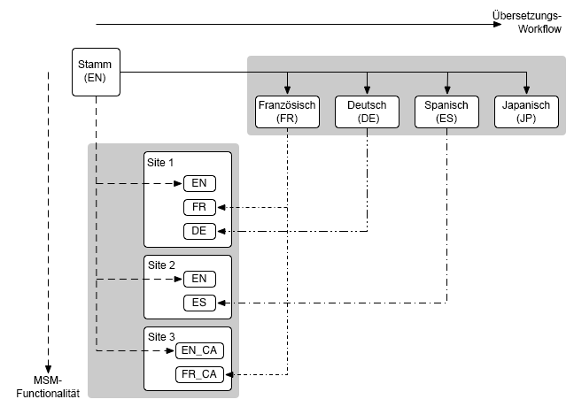

# Multi-Site Manager und Übersetzung {#msm-and-translation}

Multi-Site Manager und Übersetzungs-Tools von Adobe Experience Manager vereinfachen die Lokalisierung Ihrer Inhalte.

* Multi Site Manager (MSM) und seine Live Copy-Funktionen ermöglichen Ihnen die Verwendung desselben Site-Inhalts sowie deren Variationen an mehreren Orten:
   * [Wiederverwenden von Inhalten: Multi-Site Manager und Live Copy](msm/overview.md)
* Die Übersetzungsfunktion ermöglicht Ihnen die Automatisierung der Übersetzung von Seiteninhalten, um mehrsprachige Websites zu erstellen und zu pflegen:
   * [Übersetzen von Inhalten für mehrsprachige Sites](translation/overview.md)

Diese beiden Funktionen können kombiniert und für [internationale, mehrsprachige](#multinational-and-multilingual-sites) Websites eingesetzt werden.

>[!TIP]
>
>Wenn Sie mit der Übersetzung von Inhalten noch nicht vertraut sind, gehen Sie die [Sites-Übersetzungs-Tour](/help/journey-sites/translation/overview.md) durch. Es ist ein geführter Weg durch die Übersetzung Ihrer AEM-Sites-Inhalte mit den leistungsstarken Übersetzungs-Tools von AEM und ideal, wenn Sie noch keine Erfahrung mit AEM oder Übersetzungen haben.

## Internationale, mehrsprachige Websites {#multinational-and-multilingual-sites}

Sie können durch den kombinierten Einsatz von Multi-Site Manager und Übersetzungs-Workflow auf effiziente Weise Inhalte für internationale, mehrsprachige Websites erstellen.

In der Regel erstellen Sie eine primäre Site in einer Sprache und für ein bestimmtes Land und verwenden dann diese Inhalte als Grundlage für die anderen Sites, wobei Sie bei Bedarf Übersetzungen vornehmen.

1. [Übersetzen](translation/overview.md) Sie die primäre Site in verschiedene Sprachen.
1. Verwenden Sie [Multi Site Manager](msm/overview.md) für Folgendes:
   1. Verwenden Sie die Inhalte der primären Site sowie ihre Übersetzungen, um Sites für andere Länder und Kulturen zu erstellen.
   1. Trennen Sie bei Bedarf Elemente von den Live Copies, um Lokalisierungsdetails hinzuzufügen.

>[!TIP]
>
>Beschränken Sie die Verwendung von Multi-Site Manager auf Inhalte in einer Sprache.
>
>Verwenden Sie z. B. die primäre englische Version, um die englische Seitenversion für die USA, Kanada und Großbritannien zu erstellen. Verwenden Sie dann die primäre französische Version, um die französische Seitenversion für Frankreich, die Schweiz, Kanada usw. zu erstellen.

Das folgende Diagramm veranschaulicht, wie sich die Hauptkonzepte überschneiden (es sind jedoch nicht alle beteiligten Ebenen/Elemente dargestellt):

In diesem und in vergleichbaren Szenarien verwaltet MSM die verschiedenen Sprachversionen nicht als solche.

* [MSM](msm/overview.md) verwaltet die Bereitstellung übersetzter Inhalte von einem Blueprint (d. h. einem primären globalen) zu den Live Copys (d. h. den lokalen Sites) innerhalb der Grenzen einer Sprache.
* Die AEM-Integrationsfunktionen zur [Übersetzung](translation/overview.md) verwalten mit Übersetzungs-Management-Diensten von Drittanbietern die Sprachen und die Übersetzung der Inhalte in diese verschiedenen Sprachen.

Für erweiterte Anwendungsfälle kann MSM auch in allen Primärsprachen verwendet werden.

>[!TIP]
>
>Bei allen Nutzungsszenarien wird empfohlen, die folgenden Best Practices zu lesen:
>
>* [Best Practices für MSM](msm/best-practices.md)
>* [Best Practices für die Übersetzung](translation/best-practices.md)
