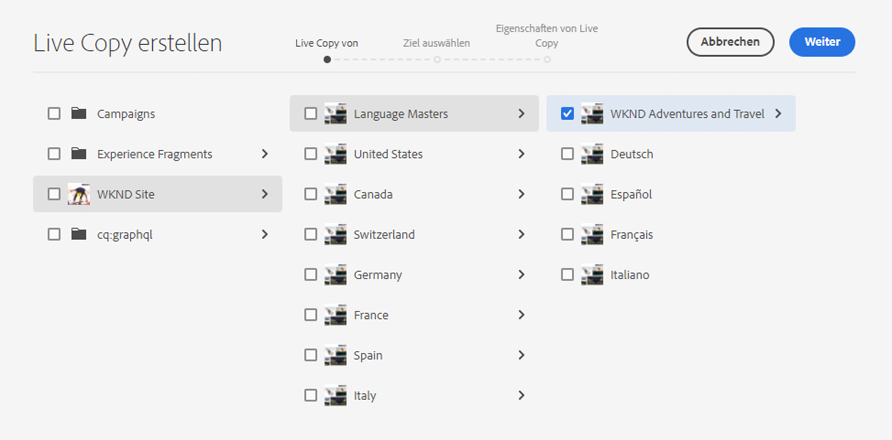
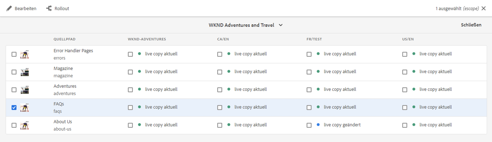
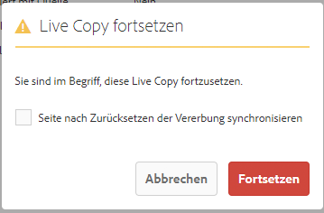

# Erstellen und Synchronisieren von Live CopYs {#creating-and-synchronizing-live-copies}

Sie können eine Live Copy über eine Seiten- oder Blueprint-Konfiguration erstellen, um diesen Inhalt auf Ihrer Website wiederzuverwenden. Verwalten Sie die Vererbung und Synchronisation und legen Sie fest, wie Inhaltsänderungen weitergegeben werden.

## Verwalten von Blueprint-Konfigurationen {#managing-blueprint-configurations}

Eine Blueprint-Konfiguration identifiziert eine vorhandene Website, die als Quelle für eine oder mehrere Live Copy-Seiten verwendet werden soll.

>[!TIP]
>
>Mit Blueprint-Konfigurationen können Sie Inhaltsänderungen an Live Copies pushen. Siehe [Live Copies – Quelle, Blueprints und Blueprint-Konfigurationen](overview.md#source-blueprints-and-blueprint-configurations).

Wenn Sie eine Blueprint-Konfiguration erstellen, wählen Sie eine Vorlage aus, die die interne Struktur des Blueprints definiert. Die standardmäßige Blueprint-Vorlage geht davon aus, dass die Quell-Website folgende Merkmale aufweist:

* Die Website verfügt über eine Stammseite.
* Die unmittelbar untergeordneten Seiten der Stammseite sind Sprachzweige der Website. Beim Erstellen einer Live Copy werden die Sprachen als optionaler Inhalt angezeigt, der in die Live Copy eingeschlossen werden soll.
* Der Stamm jedes Sprachzweigs hat mindestens eine untergeordnete Seite. Beim Erstellen einer Live Copy werden die untergeordneten Seiten angezeigt, sodass sie in die Live Copy eingeschlossen werden können.

>[!NOTE]
>
>Verschiedene Strukturen bedürfen unterschiedlicher Blueprint-Vorlagen.

Nachdem Sie die Blueprint-Konfiguration erstellt haben, können Sie die folgenden Eigenschaften konfigurieren:

* **Name**: Name der Blueprint-Konfiguration
* **Quellpfad**: Pfad der Stammseite der Site, der als Quelle (Blueprint) verwendet wird.
* **Beschreibung**. (Optional) Eine Beschreibung der Blueprint-Konfiguration, die in der Liste der Blueprint-Konfigurationen angezeigt wird. Beim Erstellen einer Site können Sie aus dieser Liste wählen.

Wird Ihre Blueprint-Konfiguration verwendet, können Sie sie mit einer Rollout-Konfiguration verknüpfen, die bestimmt, wie die Live Copies der Quelle/Blueprint synchronisiert werden. Siehe [Angeben der zu verwendenden Rollout-Konfigurationen](live-copy-sync-config.md#specifying-the-rollout-configurations-to-use).

### Erstellen und Bearbeiten von Blueprint-Konfigurationen {#creating-editing-blueprint-configurations}

Blueprint-Konfigurationen werden als unveränderliche Daten betrachtet und sind daher zur Laufzeit nicht bearbeitbar. Aus diesem Grund müssen alle Konfigurationsänderungen über Git unter Verwendung der CI/CD-Pipeline bereitgestellt werden.

Weitere Informationen finden Sie im Artikel [Wesentliche Änderungen an Adobe Experience Manager (AEM) as a Cloud Service](/help/release-notes/aem-cloud-changes.md).

Die folgenden Schritte stehen einem Administrator in einer lokalen Entwicklungsinstanz nur zu Test- und Entwicklungszwecken zur Verfügung. Diese Optionen sind in keiner AEMaaCS-Cloud-Instanz verfügbar.

#### Lokales Erstellen einer Blueprint-Konfiguration {#creating-a-blueprint-configuration}

So erstellen Sie eine Blueprint-Konfiguration:

1. [Navigieren](/help/sites-cloud/authoring/basic-handling.md#global-navigation) Sie zum Menü **Tools** und wählen Sie dann das Menü **Sites** aus.
1. Wählen Sie **Blueprints**, um die Konsole **Blueprint-Konfigurationen** zu öffnen:

   

1. Wählen Sie **Erstellen**.
1. Wählen Sie die Blueprint-Vorlage und dann **Weiter**, um fortzufahren.
1. Wählen Sie die Quellseite aus, die als Blueprint verwendet werden soll, und fahren Sie mit **Weiter** fort.
1. Definieren Sie:

   * Den **Titel**: obligatorischer Titel für den Blueprint
   * Die **Beschreibung**: eine optionale Beschreibung, um weitere Details anzugeben.

1. Mit **Erstellen** wird die Blueprint-Konfiguration basierend auf Ihren Angaben erstellt.

### Lokales Bearbeiten oder Löschen einer Blueprint-Konfiguration{#editing-or-deleting-a-blueprint-configuration}

Sie können eine vorhandene Blueprint-Konfiguration bearbeiten oder löschen:

1. [Navigieren](/help/sites-cloud/authoring/basic-handling.md#global-navigation) Sie zum Menü **Tools** und wählen Sie dann das Menü **Sites** aus.
1. Wählen Sie **Blueprints**, um die Konsole **Blueprint-Konfigurationen** zu öffnen:

   

1. Wenn Sie die erforderliche Blueprint-Konfiguration auswählen, werden die entsprechenden Aktionen in der Symbolleiste verfügbar:

   * **Eigenschaften**; Sie können dies verwenden, um die Eigenschaften der Konfiguration anzuzeigen und zu bearbeiten.
   * **Löschen**

## Erstellen von Live Copies {#creating-a-live-copy}

Sie haben mehrere Möglichkeiten, eine Live Copy zu erstellen.

### Erstellen von Live Copies einer Seite {#creating-a-live-copy-of-a-page}

Sie können eine Live Copy einer Seite oder eines Zweigs erstellen. Beim Erstellen der Live Copy können Sie die für die Inhaltssynchronisierung zu verwendenden Rollout-Konfigurationen angeben:

* Die ausgewählten Rollout-Konfigurationen gelten für die Live Copy-Seite und ihre untergeordneten Seiten.
* Wenn Sie keine Rollout-Konfigurationen angeben, bestimmt MSM, welche Rollout-Konfigurationen verwendet werden sollen. Siehe [Angeben der zu verwendenden Rollout-Konfigurationen](live-copy-sync-config.md#specifying-the-rollout-configurations-to-use).

Sie können Live Copies für beliebige Seite erstellen.

* Seiten, auf die eine [Blueprint-Konfiguration](#creating-a-blueprint-configuration) verweist;
* Seiten ohne verbundene Konfiguration
* Live Copy in den Seiten einer anderen Live Copy ([verschachtelte Live Copies](overview.md#nested-live-copies))

Der einzige Unterschied besteht darin, dass die Verfügbarkeit des Befehls **Rollout** auf den Quell-/Blueprint-Seiten davon abhängig ist, ob die Quelle von einer Blueprint-Konfiguration referenziert wird:

* Wenn Sie die Live Copy von einer Quellseite erstellen, die von einer Blueprint-Konfiguration **referenziert wird**, dann ist der Befehl „Rollout“ auf den Quell-/Blueprint-Seiten verfügbar.
* Wenn Sie die Live Copy ausgehend von einer Quellseite erstellen, die **nicht** von einer Blueprint-Konfiguration referenziert wird, dann ist der Befehl „Rollout“ auf der oder den Quell-/Blueprint-Seite(n) nicht verfügbar.

So erstellen Sie eine Live Copy:

1. Wählen Sie in der **Sites-Konsole** zuerst **Erstellen** und dann **Live Copy**.

   

1. Wählen Sie die Quellseite und anschließend **Weiter** aus. Zum Beispiel:

   

1. Geben Sie den Zielpfad der Live Copy an (öffnen Sie den übergeordneten Ordner/die übergeordnete Seite der Live Copy) und wählen Sie dann **Weiter** aus.

   

   >[!NOTE]
   >
   >Der Zielpfad darf sich nicht im Quellpfad befinden.

1. Geben Sie ein:

   * einen **Titel** für die Seite;
   * einen **Namen**, der in der URL verwendet wird.

   

1. Verwenden Sie das Kontrollkästchen **Unterseiten ausschließen**:

   * Bei Aktivierung wird nur eine Live Copy der ausgewählten Seite erstellt (flache Live Copy).
   * Bei Deaktivierung wird eine Live Copy mit allen untergeordneten Elementen der ausgewählten Seite erstellt (tiefe Live Copy).

1. (Optional) Um eine oder mehrere Rollout-Konfigurationen für die Live Copy zu spezifizieren, wählen Sie sie in der Dropdown-Liste **Rollout-Konfigurationen** aus. Ausgewählte Konfigurationen werden unter der Dropdown-Auswahl angezeigt.
1. Wählen Sie **Erstellen** aus. Eine Bestätigungsmeldung wird angezeigt. Hier können Sie entweder **Öffnen** oder **Fertig** auswählen.

   >[!NOTE]
   >
   >Es kann ein Fehlerdialogfeld mit der Meldung „Senden des Formulars fehlgeschlagen“ erscheinen. Dies geschieht aufgrund eines Netzwerk-Timeouts. Der Prozess zum Erstellen der Live Copy wird jedoch im Hintergrund ausgeführt. Warten Sie einige Minuten und überprüfen Sie, ob die Seiten der Live Copy korrekt erstellt wurden.

### Erstellen einer Live Copy einer Site über eine Blueprint-Konfiguration {#creating-a-live-copy-of-a-site-from-a-blueprint-configuration}

Erstellen Sie eine Live Copy mit einer Blueprint-Konfiguration, um eine Site basierend auf dem Blueprint(-Quell)-Inhalt anzulegen. Wenn Sie eine Live Copy über eine Blueprint-Konfiguration erstellen, wählen Sie einen oder mehrere Sprachzweige der zu kopierenden Blueprint-Quelle aus. Wählen Sie dann die Kapitel aus, die aus den Sprachzweigen kopiert werden sollen. Siehe [Erstellen von Blueprint-Konfigurationen](#creating-a-blueprint-configuration).

Wenn Sie einige Sprachzweige aus der Live Copy überspringen, können Sie sie später hinzufügen. Siehe [Erstellen von Live Copies in einer Live Copy (Blueprint-Konfiguration)](#creating-a-live-copy-inside-a-live-copy-blueprint-configuration)

>[!CAUTION]
>
>Wenn die Blueprint-Quelle Links und Verweise zu einem Absatz in einem anderen Zweig enthält, werden die Ziele in den Live Copy-Seiten nicht aktualisiert, sondern verweisen nach wie vor auf das ursprüngliche Ziel.

Geben Sie beim Erstellen der Site Werte für die folgenden Eigenschaften an:

* **Anfangssprachen**: Sprachzweige der Blueprint-Quelle, die in die Live Copy eingeschlossen werden sollen
* **Anfangskapitel**: Untergeordnete Seiten der Blueprint-Sprachzweige, die in die Live Copy eingeschlossen werden sollen
* **Zielpfad**: Verzeichnis der Stammseite der Live Copy-Site
* **Titel**: Titel der Stammseite der Live Copy-Site
* **Name**: (Optional) Der Name des JCR-Knotens, der die Stammseite der Live Copy speichert (der Standardwert basiert auf dem Titel)
* **Site-Inhaber**: (Optional) Informationen zum Verantwortlichen für die Live Copy
* **Live Copy**: Wählen Sie diese Option, um eine Live-Beziehung zur Quell-Site herzustellen. Wenn Sie diese Option nicht auswählen, wird eine Kopie des Blueprints erstellt, aber sie wird anschließend nicht mit der Quelle synchronisiert.
* **Rollout-Konfigurationen**: (Optional) Wählen Sie eine oder mehrere Rollout-Konfigurationen für die Synchronisierung der Live Copy aus. Die Rollout-Konfigurationen werden standardmäßig vom Blueprint übernommen. Weitere Informationen finden Sie unter [Angeben der zu verwendenden Rollout-Konfigurationen](live-copy-sync-config.md#specifying-the-rollout-configurations-to-use).

So erstellen Sie die Live Copy einer Site über eine Blueprint-Konfiguration:

1. Wählen Sie in der **Sites**-Konsole die Option **Erstellen** und dann aus der Dropdown-Auswahl die Option **Site** aus.
1. Wählen Sie die als Quelle der Live Copy zu verwendende Blueprint-Konfiguration aus und fahren Sie mit **Weiter** fort:

   

1. Geben Sie über die Auswahl **Anfangssprachen** die Sprachen der Blueprint-Site an, die für die Live Copy verwendet werden sollen.

   Alle verfügbaren Sprachen sind standardmäßig ausgewählt. Um eine Sprache zu entfernen, wählen Sie das **X** neben der Sprache aus.

   Zum Beispiel:

   

1. Wählen Sie die in die Live Copy einzuschließenden Blueprint-Abschnitte über das Dropdown-Menü **Anfangskapitel** aus. Alle verfügbaren Kapitel sind standardmäßig enthalten, können aber entfernt werden.
1. Geben Sie Werte für die verbleibenden Eigenschaften an und wählen Sie dann **Erstellen**. Wählen Sie im Bestätigungsdialogfeld **Fertig**, um zur **Sites-Konsole** zurückzukehren, oder **Site öffnen**, um die Stammseite der Site zu öffnen.

### Erstellen von Live Copies in einer Live Copy (Blueprint-Konfiguration) {#creating-a-live-copy-inside-a-live-copy-blueprint-configuration}

Wenn Sie eine Live Copy in der bereits vorhandenen (mit einer Blueprint-Konfiguration angelegten) Live Copy erstellen, können Sie beliebige Sprachkopien oder Kapitel einfügen, die bei der ursprünglichen Erstellung der Live Copy nicht einbezogen wurden.

## Überwachen Ihrer Live Copy {#monitoring-your-live-copy}

### Anzeigen des Status einer Live Copy {#seeing-the-status-of-a-live-copy}

Die Eigenschaften einer Live Copy-Seite zeigen die folgenden Informationen zur Live Copy an:

* **Quelle**: Quellseite der Live Copy-Seite
* **Status**: Der Synchronisierungsstatus der Live Copy, einschließlich der Angabe, ob die Live Copy mit der Quelle auf dem neuesten Stand ist, wann die letzte Synchronisierung stattgefunden hat und wer die Synchronisierung durchgeführt hat
* **Konfiguration**:

   * Angabe, ob die Seite nach wie vor einer Live Copy-Vererbung unterliegt
   * Angabe, ob die Konfiguration von der übergeordneten Seite vererbt wurde
   * Angabe etwaiger Rollout-Konfigurationen, die von der Live Copy verwendet werden

So zeigen Sie die Eigenschaften an:

1. Wählen Sie in der **Sites-Konsole** die Live Copy-Seite aus und öffnen Sie die Eigenschaften.
1. Wählen Sie die Registerkarte **Live Copy**.

   Zum Beispiel:

   

   Weitere Informationen finden Sie im Abschnitt zur [Verwendung der Live Copy-Übersicht](live-copy-overview.md#using-the-live-copy-overview) im Artikel „Konsole ‚Live Copy-Übersicht‘“.

### Anzeigen der Live Copies einer Blueprint-Seite {#seeing-the-live-copies-of-a-blueprint-page}

Mit Blueprint-Seiten (auf die in einer Blueprint-Konfiguration verwiesen wird) erhalten Sie eine Liste der Live Copy-Seiten, die die aktuelle (Blueprint-)Seite als Quelle verwenden. In dieser Liste können Sie die Live Copies nachverfolgen. Die Liste wird auf der Registerkarte **Blueprint** der [Seiteneigenschaften](/help/sites-cloud/authoring/sites-console/page-properties.md) angezeigt.

## Synchronisieren Ihrer Live Copy {#synchronizing-your-live-copy}

Es gibt mehrere Möglichkeiten, Ihre Live Copy zu synchronisieren.

### Durchführen von Blueprint-Rollouts {#rolling-out-a-blueprint}

Führen Sie den Rollout für eine Blueprint-Seite durch, um Inhaltsänderungen auf Live Copies zu pushen. Mit einer **Rollout**-Aktion werden die Rollout-Konfigurationen ausgeführt, die den Auslöser [Bei Rollout](live-copy-sync-config.md#rollout-triggers) verwenden.

>[!NOTE]
>
>Konflikte sind möglich, wenn neue Seiten mit demselben Seitennamen im Blueprint-Zweig und in einem abhängigen Live Copy-Zweig erstellt werden.
>
>Solche [Konflikte müssen beim Rollout gehandhabt und aufgelöst werden](rollout-conflicts.md).

#### Durchführen von Blueprint-Rollouts über Seiteneigenschaften {#rolling-out-a-blueprint-from-page-properties}

1. Wählen Sie in der **Sites-Konsole** die Seite aus und öffnen Sie die Eigenschaften.
1. Öffnen Sie die Registerkarte **Blueprint**.
1. Wählen Sie **Rollout** aus.

   

1. Geben Sie die Seiten und etwaigen Unterseiten an und bestätigen Sie den Vorgang durch Setzen eines Häkchens:

   

1. Geben Sie an, ob der Rollout-Vorgang sofort (**Jetzt**) oder zu einem anderen Datum/einer anderen Uhrzeit (**Später**) ausgeführt werden soll.

   

Rollouts werden als asynchrone Vorgänge verarbeitet und können auf der Seite [***Status asynchroner Vorgänge** überprüft werden](/help/operations/asynchronous-jobs.md#monitor-the-status-of-asynchronous-operations).

#### Durchführen von Blueprint-Rollouts über die Verweisleiste {#roll-out-a-blueprint-from-the-reference-rail}

1. Wählen Sie in der **Sites**-Konsole die Seite in der Live Copy aus und öffnen Sie das Bedienfeld **[Referenzen](/help/sites-cloud/authoring/basic-handling.md#references)** (in der Symbolleiste).
1. Wählen Sie die Option **Blueprint** aus der Liste, um die mit dieser Seite verbundenen Blueprints anzuzeigen.
1. Wählen Sie die erforderliche Blueprint aus der Liste aus.
1. Wählen Sie **Rollout** aus.

   

1. Sie werden zum Bestätigen der Rollout-Details aufgefordert:

   * **Rollout-Umfang**:

     Geben Sie an, ob sich der Umfang nur auf die ausgewählte Seite erstreckt oder Unterseiten einschließen soll.

   * **Zeitplan**:

     Geben Sie an, ob der Rollout-Vorgang sofort (**Jetzt**) oder zu einem späteren Zeitpunkt (**Später**) ausgeführt werden soll.

     

1. Wählen Sie nach Bestätigung dieser Details die Option **Rollout** aus, um die Aktion durchzuführen.

Rollouts werden als asynchrone Vorgänge verarbeitet und können auf der Seite [**Status asynchroner Vorgänge** überprüft werden](/help/operations/asynchronous-jobs.md#monitor-the-status-of-asynchronous-operations).

#### Durchführen von Blueprint-Rollouts über die Live Copy-Übersicht {#roll-out-a-blueprint-from-the-live-copy-overview}

Die [**Rollout**-Aktion ist auch über die Live Copy-Übersicht verfügbar](live-copy-overview.md#using-the-live-copy-overview), wenn eine Blueprint-Seite ausgewählt wird.

1. Öffnen Sie die [Live Copy-Übersicht](live-copy-overview.md#using-the-live-copy-overview) und wählen Sie eine Blueprint-Seite aus.
1. Wählen Sie in der Symbolleiste die Option **Rollout** aus.

   

1. Geben Sie die Seiten und etwaigen Unterseiten an und bestätigen Sie den Vorgang durch Setzen eines Häkchens:

   

1. Geben Sie an, ob der Rollout-Vorgang sofort (**Jetzt**) oder zu einem anderen Datum/einer anderen Uhrzeit (**Später**) ausgeführt werden soll.

   

Rollouts werden als asynchrone Vorgänge verarbeitet und können auf der Seite [**Status asynchroner Vorgänge** überprüft werden](/help/operations/asynchronous-jobs.md#monitor-the-status-of-asynchronous-operations).

### Synchronisieren von Live Copies {#synchronizing-a-live-copy}

Synchronisieren Sie eine Live Copy-Seite, um Änderungen von der Quelle per Pull auf die Live Copy zu übertragen.

#### Synchronisieren von Live Copies über Seiteneigenschaften {#synchronize-a-live-copy-from-page-properties}

Synchronisieren Sie eine Live Copy, um Änderungen von der Quelle per Pull auf die Live Copy zu übertragen.

>[!NOTE]
>
>Durch eine Synchronisierung werden die Rollout-Konfigurationen ausgeführt, die den Auslöser [Bei Rollout](live-copy-sync-config.md#rollout-triggers) verwenden.

1. Wählen Sie in der **Sites-Konsole** die Live Copy-Seite aus und öffnen Sie die Eigenschaften.
1. Öffnen Sie die Registerkarte **Live Copy**.
1. Wählen Sie **Synchronisieren** aus.

   

   Sie werden zur Bestätigung aufgefordert. Verwenden Sie **Sync**, um fortzufahren.

#### Synchronisieren von Live Copies über die Live Copy-Übersicht {#synchronize-a-live-copy-from-the-live-copy-overview}

Die [Synchronisierungsaktion ist auch über die Live Copy-Übersicht verfügbar](live-copy-overview.md#using-the-live-copy-overview), wenn eine Live Copy-Seite ausgewählt wird.

1. Öffnen Sie die [Live Copy-Übersicht](live-copy-overview.md#using-the-live-copy-overview) und wählen Sie eine Live Copy-Seite aus.
1. Wählen Sie in der Symbolleiste die Option **Synchronisieren** aus.
1. Bestätigen Sie die **Rollout**-Aktion im Dialogfeld, nachdem Sie angegeben haben, ob Folgendes eingeschlossen werden soll:

   * **Seite und Unterseiten**
   * **Nur Seite**

   

## Ändern von Live Copy-Inhalt {#changing-live-copy-content}

Zum Ändern von Live Copy-Inhalt haben Sie folgende Möglichkeiten:

* Hinzufügen von Absätzen zur Seite
* Aktualisieren von vorhandenem Inhalt durch Unterbrechen der Live Copy-Vererbung für eine beliebige Seite oder Komponente

>[!TIP]
>
>Wenn Sie eine Seite manuell in der Live Copy erstellen, liegt diese neue Seite für die Live Copy lokal vor. Sie verfügt also über keine entsprechende Quellseite, mit der sie verbunden ist.
>
>Eine Best Practice zur Erstellung einer lokalen Seite, die Teil der Beziehung ist, besteht darin, die lokale Seite in der Quelle zu erstellen und einen tiefen Rollout durchzuführen. Hierdurch wird die Seite lokal als Live Copy erstellt.

>[!NOTE]
>
>Konflikte sind möglich, wenn neue Seiten mit demselben Seitennamen im Blueprint-Zweig und in einem abhängigen Live Copy-Zweig erstellt werden.
>
>Solche [Konflikte müssen beim Rollout gehandhabt und aufgelöst werden](rollout-conflicts.md).

### Hinzufügen von Komponenten zu einer Live Copy-Seite {#adding-components-to-a-live-copy-page}

Sie können einer Live Copy-Seite jederzeit Komponenten hinzufügen. Der Vererbungsstatus der Live Copy und ihres Absatzsystems hat keinen Einfluss auf Ihre Fähigkeit, Komponenten hinzuzufügen.

Wenn die Live Copy-Seite mit der Quellseite synchronisiert wird, bleiben die hinzugefügten Komponenten unverändert. Siehe auch [Ändern der Komponentenanordnung auf einer Live Copy-Seite](#changing-the-order-of-components-on-a-live-copy-page).

>[!TIP]
>
>Lokale Änderungen an einer als Container markierten Komponente werden bei einem Rollout nicht vom Blueprint-Inhalt überschrieben. Weitere Informationen finden Sie in den [Best Practices für MSM](best-practices.md#components-and-container-synchronization).

### Aussetzen der Vererbung für Seiten {#suspending-inheritance-for-a-page}

Wenn Sie eine Live Copy erstellen, wird die Live Copy-Konfiguration auf der Stammseite der kopierten Seiten gespeichert. Alle untergeordneten Seiten der Stammseite übernehmen die Live Copy-Konfigurationen. Die Komponenten auf den Live Copy-Seiten übernehmen ebenfalls die Live Copy-Konfiguration.

Sie können die Live Copy-Vererbung für eine Live Copy-Seite aussetzen, damit Sie Seiteneigenschaften und Komponenten ändern können. Wenn Sie die Vererbung aussetzen, werden die Seiteneigenschaften und Komponenten nicht mehr mit der Quelle synchronisiert.

>[!TIP]
>
>Sie können auch [eine Live Copy von ihrer Blueprint trennen](#detaching-a-live-copy), um alle Verbindungen zu entfernen. Anders als beim Aussetzen der Vererbung ist die Trenn-Aktion dauerhaft und kann nicht rückgängig gemacht werden.

#### Aussetzen der Vererbung über Seiteneigenschaften {#suspending-inheritance-from-page-properties}

So setzen Sie die Vererbung auf einer Seite aus:

1. Öffnen Sie die Eigenschaften der Live Copy-Seite entweder über den Befehl **Eigenschaften anzeigen** der **Sites-Konsole** oder über das Symbol **Seiteninformationen** der Seitensymbolleiste.
1. Wählen Sie die Registerkarte **Live Copy**.
1. Wählen Sie in der Symbolleiste die Option **Aussetzen** aus. Sie können dann eine der folgenden Optionen auswählen:

   * **Aussetzen**: Zum Aussetzen der aktuellen Seite.
   * **Aussetzen mit untergeordneten Elementen**: Zum Aussetzen der aktuellen Seite sowie etwaiger untergeordneter Seiten.

1. Wählen Sie im Bestätigungsdialogfeld die Option **Aussetzen** aus.

#### Aussetzen der Vererbung über die Live Copy-Übersicht {#suspending-inheritance-from-the-live-copy-overview}

Die [Aussetzungsaktion ist auch über die Live Copy-Übersicht verfügbar](live-copy-overview.md#using-the-live-copy-overview), wenn eine Live Copy-Seite ausgewählt wird.

1. Öffnen Sie die [Live Copy-Übersicht](live-copy-overview.md#using-the-live-copy-overview) und wählen Sie eine Live Copy-Seite aus.
1. Wählen Sie in der Symbolleiste die Option **Aussetzen** aus.
1. Wählen Sie die entsprechende Option aus:

   * **Aussetzen**
   * **Aussetzen mit untergeordneten Elementen**

   

1. Bestätigen Sie die Aktion **Aussetzen** im Dialogfeld **Live Copy aussetzen**:

   

### Fortsetzen der Vererbung für Seiten {#resuming-inheritance-for-a-page}

Das Aussetzen der Live Copy-Vererbung für eine Seite ist eine vorübergehende Aktion. Nach dem Aussetzen wird die Aktion **Fortsetzen** verfügbar, über die Sie die Live-Beziehung reaktivieren können.

Wenn Sie die Vererbung erneut aktivieren, wird die Seite nicht automatisch mit der Quelle synchronisiert. Sie können auch eine Synchronisierung anfordern, wenn diese erforderlich ist:

* Im Dialog **Fortsetzen**/**Wiederherstellen**; zum Beispiel:

  

* Später durch manuelle Auswahl der Synchronisierungsaktion.

>[!NOTE]
>
>Wenn Sie die Vererbung erneut aktivieren, wird die Seite nicht automatisch mit der Quelle synchronisiert. Wenn dies erforderlich ist, können Sie eine Synchronisierung entweder zum Zeitpunkt der Wiederaufnahme oder später manuell anfordern.

#### Fortsetzen der Vererbung über Seiteneigenschaften {#resuming-inheritance-from-page-properties}

Nach dem [Aussetzen](#suspending-inheritance-from-page-properties) wird die Aktion **Fortsetzen** in der Symbolleiste der Seiteneigenschaften verfügbar:

Wenn diese Option ausgewählt ist, wird das Dialogfeld angezeigt. Sie können ggf. eine Synchronisierung auswählen. Bestätigen Sie anschließend die Aktion.

#### Fortsetzen von Live Copy-Seiten über die Live Copy-Übersicht {#resume-a-live-copy-page-from-the-live-copy-overview}

Die [Fortsetzungsaktion ist auch über die Live Copy-Übersicht verfügbar](live-copy-overview.md#using-the-live-copy-overview), wenn eine Live Copy-Seite ausgewählt wird.

1. Öffnen Sie die [Live Copy-Übersicht](live-copy-overview.md#using-the-live-copy-overview) und wählen Sie eine Live Copy-Seite aus. Die Seite ist mit **VERERBUNG ABGEBROCHEN** gekennzeichnet.
1. Wählen Sie in der Symbolleiste die Option **Fortsetzen** aus.
1. Geben Sie an, ob die Seite nach Wiederherstellung der Vererbung synchronisiert werden soll. Bestätigen Sie dann die Aktion **Fortsetzen** im Dialogfeld **Live Copy fortsetzen**.

### Ändern der Vererbungstiefe (flach/tief) {#changing-inheritance-depth-shallow-deep}

Sie können bei einer vorhandenen Live Copy die Tiefe für eine Seite ändern, d. h. ob untergeordnete Seiten eingeschlossen werden sollen.

* Wechseln zu einer flachen Live Copy:

   * Dieser Vorgang wirkt sich sofort aus und kann nicht rückgängig gemacht werden.

   * Trennt untergeordnete Seiten von der Live Copy. Weitere Änderungen bei untergeordneten Elementen können bei einer Rückgängigmachung nicht beibehalten werden.

   * Alle untergeordneten `LiveRelationships` werden entfernt, selbst wenn es sich um verschachtelte `LiveCopies` handelt.

* Wechseln zu einer tiefen Live Copy:

   * Behält untergeordnete Seiten bei.
   * Um sich ein Bild von der Wirkung des Wechsels zu machen, können Sie einen Rollout durchführen. Sämtliche Inhaltsänderungen werden gemäß der Rollout-Konfiguration angewendet.

* Wechseln zu einer flachen und dann wieder zu einer tiefen Live Copy:

   * Behandelt alle untergeordneten Elemente der (ehemals) flachen Live Copy so, als wären sie manuell erstellt worden und werden daher mit `[oldname]_msm_moved name` entfernt.

So geben Sie die Tiefe an oder ändern diese:

1. Öffnen Sie die Eigenschaften der Live Copy-Seite entweder über den Befehl **Eigenschaften anzeigen** der **Sites-Konsole** oder über das Symbol **Seiteninformationen** der Seitensymbolleiste.
1. Wählen Sie die Registerkarte **Live Copy**.
1. Aktivieren oder deaktivieren Sie im Abschnitt **Konfiguration** die Option **Live Copy-Vererbung**, je nachdem, ob untergeordnete Seiten enthalten sind:

   * Aktivierung: eine tiefe Live Copy (untergeordnete Seiten eingeschlossen)
   * Deaktivierung: eine flache Live Copy (untergeordnete Seiten ausgeschlossen)

   >[!CAUTION]
   >
   >Der Wechsel zu einer flachen Live Copy wirkt sich sofort aus und kann nicht rückgängig gemacht werden.
   >
   >Weitere Informationen finden Sie unter [Live Copies – Komposition](overview.md#live-copies-composition).

1. Wählen Sie **Speichern**, um ihre Aktualisierungen beizubehalten.

### Abbrechen der Vererbung für Komponenten {#cancelling-inheritance-for-a-component}

Brechen Sie die Live Copy-Vererbung für eine Komponente ab, sodass die Komponente nicht länger mit der Quellkomponente synchronisiert wird. Falls erforderlich, können Sie die Vererbung zu einem späteren Zeitpunkt aktivieren.

>[!NOTE]
>
>Wenn Sie die Vererbung erneut aktivieren, wird die Komponente nicht automatisch mit der Quelle synchronisiert. Sie können ggf. manuell eine Synchronisierung anfordern.

Vererbung abbrechen, um den Komponenteninhalt zu ändern oder die Komponente zu löschen:

1. Wählen Sie die Komponente aus, für die die Vererbung abgebrochen werden soll.

   

1. Wählen Sie in der Symbolleiste „Komponente“ das Symbol **Vererbung abbrechen** aus.

   

1. Bestätigen Sie die Aktion im Dialogfeld „Vererbung abbrechen“ mit **Ja**.

   Die Komponenten-Symbolleiste wird aktualisiert und enthält alle (entsprechenden) Bearbeitungsbefehle.

### Erneutes Aktivieren der Vererbung für eine Komponente {#re-enabling-inheritance-for-a-component}

Um die Vererbung für eine Komponente zu aktivieren, wählen Sie in der Symbolleiste „Komponente“ das Symbol **Vererbung erneut aktivieren** aus.

### Ändern der Komponentenanordnung auf einer Live Copy-Seite {#changing-the-order-of-components-on-a-live-copy-page}

Wenn eine Live Copy Komponenten enthält, die zu einem Absatzsystem gehören, werden bei der Vererbung dieses Absatzsystems die folgenden Regeln befolgt:

* Die Komponentenanordnung in einem vererbten Absatzsystem kann selbst bei bestehender Vererbung geändert werden.
* Beim Rollout wird die Komponentenanordnung anhand des Blueprints wiederhergestellt. Wenn der Live Copy vor dem Rollout neue Komponenten hinzugefügt wurden, werden diese gemeinsam mit den Komponenten, über denen sie eingefügt wurden, neu angeordnet.
* Wird die Vererbung des Absatzsystems abgebrochen, wird die Komponentenanordnung beim Rollout nicht wiederhergestellt und bleibt gegenüber der Live Copy unverändert.

>[!NOTE]
>
>Wird eine abgebrochene Vererbung bei einem Absatzsystem wiederhergestellt, wird die Komponentenanordnung **nicht automatisch anhand der Blueprint zurückgesetzt** Sie können ggf. manuell eine Synchronisierung anfordern.

Gehen Sie wie folgt vor, um die Vererbung des Absatzsystems abzubrechen.

1. Öffnen Sie die Live Copy-Seite.
1. Ziehen Sie eine vorhandene Komponente an eine neue Position auf der Seite.
1. Bestätigen Sie die Aktion im Dialogfeld **Vererbung abbrechen** mit **Ja**.

### Außerkraftsetzen der Eigenschaften einer Live Copy-Seite {#overriding-properties-of-a-live-copy-page}

Die Seiteneigenschaften einer Live Copy-Seite werden standardmäßig von der Quellseite übernommen und können nicht bearbeitet werden.

Sie können die Vererbung für eine Eigenschaft abbrechen, wenn Sie den Eigenschaftswert für die Live Copy ändern müssen. Über ein Verknüpfungssymbol wird angegeben, dass die Vererbung für die Eigenschaft aktiviert ist.

Wenn Sie die Vererbung abbrechen, können Sie den Eigenschaftswert ändern. Ein Symbol für einen fehlerhaften Link zeigt an, dass die Vererbung abgebrochen wurde.

Sie können später ggf. die Vererbung für eine Eigenschaft erneut aktivieren.

>[!NOTE]
>
>Wenn Sie die Vererbung erneut aktivieren, wird die Eigenschaft der Live Copy-Seite nicht automatisch mit der Quelleigenschaft synchronisiert. Sie können ggf. manuell eine Synchronisierung anfordern.

1. Öffnen Sie die Eigenschaften der Live Copy-Seite entweder über die Option **Eigenschaften anzeigen** der **Sites-Konsole** oder über das Symbol **Seiteninformationen** der Seitensymbolleiste.
1. Um die Vererbung einer Eigenschaft abzubrechen, wählen Sie das Verknüpfungssymbol rechts neben der Eigenschaft aus.

   

1. Wählen Sie im Bestätigungsdialogfeld **Vererbung abbrechen** die Option **Ja** aus.

### Wiederherstellen der Eigenschaften einer Live Copy-Seite {#revert-properties-of-a-live-copy-page}

Um die Vererbung für eine Eigenschaft zu aktivieren, wählen Sie das Symbol **Vererbung wiederherstellen** neben der entsprechenden Eigenschaft aus.

### Zurücksetzen von Live Copy-Seiten {#resetting-a-live-copy-page}

Sie können eine Live Copy-Seite zurücksetzen, um Folgendes zu tun:

* alle abgebrochenen Vererbungsvorgänge zu entfernen und
* die Seite in denselben Status wie die Quellseite zurückzuversetzen.

Eine Rücksetzung wirkt sich auf die von Ihnen durchgeführten Änderungen an den Seiteneigenschaften, am Absatzsystem und an den Komponenten aus.

#### Zurücksetzen von Live Copy-Seiten über die Seiteneigenschaften {#reset-a-live-copy-page-from-the-page-properties}

1. Wählen Sie in der **Sites-Konsole** die Live Copy-Seite und dann **Eigenschaften anzeigen** aus.
1. Öffnen Sie die Registerkarte **Live Copy**.
1. Wählen Sie in der Symbolleiste die Option **Zurücksetzen** aus.

   

1. Bestätigen Sie den Vorgang im Dialogfeld **Live Copy zurücksetzen** mit **Zurücksetzen**.

#### Zurücksetzen von Live Copy-Seiten über die Live Copy-Übersicht {#reset-a-live-copy-page-from-the-live-copy-overview}

Die [**Rücksetzungsaktion** ist auch über die Live Copy-Übersicht verfügbar](live-copy-overview.md#using-the-live-copy-overview), wenn eine Live Copy-Seite ausgewählt wird.

1. Öffnen Sie die [Live Copy-Übersicht](live-copy-overview.md#using-the-live-copy-overview) und wählen Sie eine Live Copy-Seite aus.
1. Wählen Sie in der Symbolleiste die Option **Zurücksetzen** aus.
1. Bestätigen Sie die Aktion **Zurücksetzen** im Dialogfeld **Live Copy zurücksetzen**:

   

## Vergleichen von Live Copy-Seiten mit Blueprint-Seiten {#comparing-a-live-copy-page-with-a-blueprint-page}

Zum Nachverfolgen der von Ihnen durchgeführten Änderungen können Sie die Blueprint-Seite unter **Verweise** anzeigen und mit der zugehörigen Live Copy-Seite vergleichen:

1. Navigieren Sie in der **Sites-Konsole** [zu einer Blueprint- oder Live Copy-Seite und wählen Sie diese aus](/help/sites-cloud/authoring/basic-handling.md#viewing-and-selecting-resources).
1. Öffnen Sie das Bedienfeld **[Verweise](/help/sites-cloud/authoring/basic-handling.md#references)** und wählen Sie je nach Kontext entweder:

   * **Blueprint**
   * **Live Copies**

1. Wählen Sie je nach Kontext Ihre spezifische Live Copy aus:

   * **Mit Blueprint vergleichen**
   * **Mit Live Copy vergleichen**

   Zum Beispiel:

   

1. Die Live Copy- und Blueprint-Seiten werden nebeneinander geöffnet.

   Vollständige Informationen zur Verwendung der Vergleichsfunktion finden Sie unter [Seitenvergleich](/help/sites-cloud/authoring/sites-console/page-diff.md).

## Trennen von Live Copies {#detaching-a-live-copy}

Beim Trennen wird die Live-Beziehung zwischen einer Live Copy und der zugehörigen Quell-/Blueprint-Seite dauerhaft entfernt. Alle MSM-bezogenen Eigenschaften werden aus der Live Copy entfernt und die Live Copy-Seiten werden zu einer eigenständigen Kopie.

>[!CAUTION]
>
>Sie können die Live-Beziehung nicht reaktivieren, nachdem Sie die Live Copy getrennt haben.
>
>Um die Live-Beziehung mit der Möglichkeit einer späteren Reaktivierung zu entfernen, können Sie die [Live Copy-Vererbung für die Seite abbrechen](#suspending-inheritance-for-a-page).

Je nachdem, wo innerhalb der Struktur die Option **Trennen** verwendet wird, ist dies mit unterschiedlichen Folgen verbunden:

* **Trennen auf der Stammseite einer Live Copy**

  Wenn dieser Vorgang auf der Stammseite einer Live Copy durchgeführt wird, wird die Live-Beziehung zwischen allen Seiten des Blueprints und seiner Live Copy entfernt.

  Weitere Änderungen an Seiten in der Blueprint **wirken sich nicht** auf die Live Copy aus.

* **Trennen auf einer Unterseite einer Live Copy**

  Wenn dieser Vorgang auf einer Unterseite (oder im Zweig) in einer Live Copy durchgeführt wird:

   * wird die Live-Beziehung für diese Unterseite (oder diesen Zweig) entfernt
   * und die (Unter-)Seiten im Live Copy-Zweig werden so behandelt, als wären sie manuell erstellt worden.

  Allerdings sind die Unterseiten weiterhin der Live-Beziehung des übergeordneten Zweigs unterworfen, sodass bei einem weiteren Rollout der Blueprint-Seite(n) Folgendes geschieht:

   1. Die getrennten Seite(n) werden umbenannt:

      * Der Grund: MSM betrachtet die Seiten als manuell erstellte Seiten, die einen Konflikt verursachen, da sie denselben Namen aufweisen wie die zu erstellenden Live Copy-Seiten.

   1. Es wird eine neue (Live Copy-)Seite mit dem ursprünglichen Namen und den Änderungen vom Rollout erstellt.

  >[!NOTE]
  >
  >Details für solche Situationen finden Sie unter [MSM-Rollout-Konflikte](rollout-conflicts.md).

### Trennen von Live Copy-Seiten über Seiteneigenschaften {#detach-a-live-copy-page-from-the-page-properties}

So trennen Sie eine Live Copy:

1. Wählen Sie in der **Sites-Konsole** die Live Copy-Seite und dann **Eigenschaften anzeigen** aus.
1. Öffnen Sie die Registerkarte **Live Copy**.
1. Wählen Sie in der Symbolleiste die Option **Trennen** aus.

   

1. Wählen Sie im daraufhin angezeigten Bestätigungsdialogfeld die Option **Trennen** aus, um die Aktion abzuschließen.

### Trennen von Live Copy-Seiten über die Live Copy-Übersicht {#detach-a-live-copy-page-from-the-live-copy-overview}

Die [Trennaktion ist auch über die Live Copy-Übersicht verfügbar](live-copy-overview.md#using-the-live-copy-overview), wenn eine Live Copy-Seite ausgewählt wird.

1. Öffnen Sie die [Live Copy-Übersicht](live-copy-overview.md#using-the-live-copy-overview) und wählen Sie eine Live Copy-Seite aus.
1. Wählen Sie in der Symbolleiste die Option **Trennen** aus.
1. Bestätigen Sie die Aktion **Trennen** im Dialogfeld **Live Copy trennen**:

   
