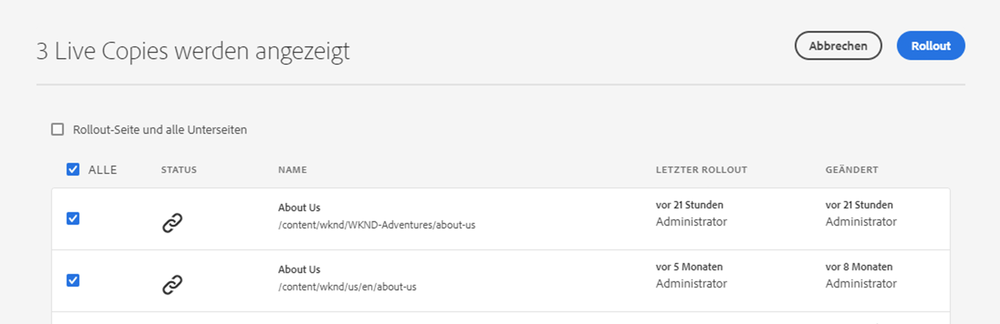

# Erstellen und Synchronisieren von Live Copies {#creating-and-synchronizing-live-copies}

Sie können eine Live Copy aus einer Seite oder Blueprint-Konfiguration erstellen, um diesen Inhalt auf Ihrer Site wiederzuverwenden. Verwalten Sie Vererbung und Synchronisierung. Sie können steuern, wie Änderungen am Inhalt propagiert werden.

## Verwalten von Blueprint-Konfigurationen {#managing-blueprint-configurations}

Eine Blueprint-Konfiguration identifiziert eine vorhandene Website, die Sie als Quelle für eine oder mehrere Live Copy-Seiten verwenden möchten.

>[!TIP]
>
>Mit Blueprint-Konfigurationen können Sie Inhaltsänderungen in Live Copies übertragen. Siehe [Live Copies – Quelle, Blueprints und Blueprint-Konfigurationen](overview.md#source-blueprints-and-blueprint-configurations).

Wählen Sie beim Erstellen einer Blueprint-Konfiguration eine Vorlage aus, die die interne Blueprint-Struktur definiert. Die standardmäßige Blueprint-Vorlage geht davon aus, dass die Quell-Website folgende Merkmale aufweist:

* Die Website verfügt über eine Stammseite.
* Die unmittelbar untergeordneten Seiten der Stammseite sind Sprachzweige der Website. Beim Erstellen einer Live Copy werden die Sprachen als optionaler Inhalt angezeigt, der in die Kopie eingefügt werden soll.
* Der Stamm jedes Sprachzweigs hat mindestens eine untergeordnete Seite. Beim Erstellen einer Live Copy werden untergeordnete Seiten angezeigt, damit Sie sie in die Live Copy aufnehmen können.

>[!NOTE]
>
>Eine andere Struktur erfordert eine andere Blueprint-Vorlage.

Nachdem Sie die Blueprint-Konfiguration erstellt haben, können Sie die folgenden Eigenschaften konfigurieren:

* **Name**: Name der Blueprint-Konfiguration
* **Quellpfad**: Der Pfad der Stammseite der Site, die Sie als Quelle verwenden (Blueprint)
* **Beschreibung**. (Optional) Eine Beschreibung der Blueprint-Konfiguration, die in der Liste der Blueprint-Konfigurationen angezeigt wird, aus denen Sie beim Erstellen einer Site wählen können

Wenn Ihre Blueprint-Konfiguration verwendet wird, können Sie sie mit einer Rollout-Konfiguration verknüpfen, die bestimmt, wie die Live Copies der Quelle/des Blueprints synchronisiert werden. Siehe [Angeben der zu verwendenden Rollout-Konfigurationen](live-copy-sync-config.md#specifying-the-rollout-configurations-to-use).

### Erstellen und Bearbeiten von Blueprint-Konfigurationen {#creating-editing-blueprint-configurations}

Blueprint-Konfigurationen werden als unveränderliche Daten betrachtet und sind daher zur Laufzeit nicht bearbeitbar. Aus diesem Grund müssen alle Konfigurationsänderungen über Git mithilfe der CI/CD-Pipeline bereitgestellt werden.

Weitere Informationen finden Sie im Artikel [Wesentliche Änderungen an Adobe Experience Manager (AEM) als Cloud Service.](/help/release-notes/aem-cloud-changes.md)

Die folgenden Schritte stehen einem Administrator in einer lokalen Entwicklungsinstanz nur zu Test- und Entwicklungszwecken zur Verfügung. Diese Optionen sind in keiner AEMaaCS-Cloud-Instanz verfügbar.

#### Erstellen einer Blueprint-Konfiguration lokal {#creating-a-blueprint-configuration}

So erstellen Sie eine Blueprint-Konfiguration:

1. [Navigieren](/help/sites-cloud/authoring/getting-started/basic-handling.md#global-navigation) Sie zum Menü **Tools** und wählen Sie das Menü **Sites** aus.
1. Wählen Sie **Blueprints** aus, um die Konsole **Blueprint-Konfigurationen** zu öffnen:

   

1. Wählen Sie **Erstellen**.
1. Wählen Sie die Blueprint-Vorlage aus und dann **Weiter**, um fortzufahren.
1. Wählen Sie die als Blueprint zu verwendende Quellseite aus und dann **Weiter**, um fortzufahren.
1. Definieren Sie Folgendes:

   * **Titel**: obligatorischer Blueprint-Titel
   * **Beschreibung**: optionale Beschreibung zur Angabe zusätzlicher Details

1. Mit **Erstellen** wird die Blueprint-Konfiguration basierend auf Ihren Angaben erstellt.

### Bearbeiten oder Löschen von Blueprint-Konfigurationen Locale{#editing-or-deleting-a-blueprint-configuration}

Sie können eine vorhandene Blueprint-Konfiguration bearbeiten oder löschen:

1. [Navigieren](/help/sites-cloud/authoring/getting-started/basic-handling.md#global-navigation) Sie zum Menü **Tools** und wählen Sie das Menü **Sites** aus.
1. Wählen Sie **Blueprints** aus, um die Konsole **Blueprint-Konfigurationen** zu öffnen:

   

1. Wählen Sie die erforderliche Blueprint-Konfiguration aus – die entsprechenden Aktionen werden in der Symbolleiste verfügbar:

   * **Eigenschaften**: Hierüber können Sie die Eigenschaften der Konfiguration anzeigen und bearbeiten.
   * **Löschen**

## Erstellen von Live Copies {#creating-a-live-copy}

Es gibt verschiedene Möglichkeiten, eine Live Copy zu erstellen.

### Erstellen von Live Copies einer Seite {#creating-a-live-copy-of-a-page}

Sie können eine Live Copy einer beliebigen Seite oder Verzweigung erstellen. Beim Erstellen der Live Copy können Sie die Rollout-Konfigurationen angeben, die zum Synchronisieren des Inhalts verwendet werden sollen:

* Die ausgewählten Rollout-Konfigurationen gelten für die Live Copy-Seite und die untergeordneten Seiten.
* Wenn Sie keine Rollout-Konfigurationen angeben, legt MSM die zu verwendenden Rollout-Konfigurationen fest. Siehe [Angeben der zu verwendenden Rollout-Konfiguration](live-copy-sync-config.md#specifying-the-rollout-configurations-to-use).

Sie können eine Live Copy einer beliebigen Seite erstellen:

* Seiten, die durch eine [Blueprint-Konfiguration](#creating-a-blueprint-configuration) referenziert werden
* Seiten ohne verbundene Konfiguration
* Live Copy auf den Seiten einer anderen Live Copy ([verschachtelte Live Copies](overview.md#nested-live-copies))

Der einzige Unterschied besteht darin, dass die Verfügbarkeit des Befehls **Rollout** auf den Quell-/Blueprint-Seiten davon abhängig ist, ob die Quelle von einer Blueprint-Konfiguration referenziert wird:

* Wenn Sie die Live Copy von einer Quellseite erstellen, auf die **in einer Blueprint-Konfiguration** verwiesen wird, ist der Befehl &quot;Rollout&quot;auf der/den Quell-/Blueprint-Seite(n) verfügbar.
* Wenn Sie die Live Copy von einer Quellseite erstellen, auf die **in einer Blueprint-Konfiguration nicht** verwiesen wird, ist der Befehl &quot;Rollout&quot;auf der/den Quell-/Blueprint-Seite(n) nicht verfügbar.

So erstellen Sie eine Live Copy:

1. Wählen Sie in der **Sites-Konsole** zuerst **Erstellen** und dann **Live Copy**.

   

1. Wählen Sie die Quellseite aus und klicken oder tippen Sie auf **Weiter**. Beispiel:

   

1. Geben Sie den Zielpfad der Live Copy an (öffnen Sie den übergeordneten Ordner/die übergeordnete Seite der Live Copy) und klicken oder tippen Sie dann auf **Weiter**.

   

   >[!NOTE]
   >
   >Der Zielpfad darf sich nicht innerhalb des Quellpfads befinden.

1. Geben Sie Folgendes ein:

   * einen **Titel** für die Seite;
   * einen **Namen**, der in der URL verwendet wird.

   

1. Verwenden Sie das Kontrollkästchen **Unterseiten ausschließen**:

   * Ausgewählt: eine Live Copy nur der ausgewählten Seite erstellen (flache Live Copy)
   * Nicht ausgewählt: eine Live Copy erstellen, die alle untergeordneten Elemente der ausgewählten Seite enthält (tiefe Live Copy)

1. (Optional) Um eine oder mehrere Rollout-Konfigurationen für die Live Copy anzugeben, wählen Sie diese über die Dropdownliste **Rollout-Konfigurationen** aus. Ausgewählte Konfigurationen werden unter der Dropdown-Auswahl angezeigt.
1. Klicken oder tippen Sie auf **Erstellen**. Eine Bestätigungsmeldung wird angezeigt. Hierüber können Sie entweder **Öffnen** oder **Fertig** auswählen.

### Erstellen von Live Copies einer Site über eine Blueprint-Konfiguration {#creating-a-live-copy-of-a-site-from-a-blueprint-configuration}

Erstellen Sie eine Live Copy mit einer Blueprint-Konfiguration, um eine Site basierend auf dem Blueprint (Quelle)-Inhalt zu erstellen. Wenn Sie eine Live Copy aus einer Blueprint-Konfiguration erstellen, wählen Sie mindestens einen Sprachzweig der zu kopierenden Blueprint-Quelle aus und wählen Sie dann die Kapitel aus, die aus den Sprachzweigen kopiert werden sollen. Siehe [Erstellen einer Blueprint-Konfiguration](#creating-a-blueprint-configuration).

Wenn Sie einige Sprachzweige aus der Live Copy auslassen, können Sie sie später hinzufügen. Weitere Informationen finden Sie unter [Erstellen einer Live Copy innerhalb einer Live Copy (Blueprint-Konfiguration)](#creating-a-live-copy-inside-a-live-copy-blueprint-configuration) .

>[!CAUTION]
>
>Wenn die Blueprint-Quelle Links enthält und auf einen Absatz in einem anderen Zweig verweist, werden die Ziele nicht auf den Live Copy-Seiten aktualisiert, sondern bleiben auf das ursprüngliche Ziel verweisen.

Geben Sie beim Erstellen der Site Werte für die folgenden Eigenschaften an:

* **Ausgangssprachen**: Die Sprachzweige der Blueprint-Quelle, die in die Live Copy aufgenommen werden sollen
* **Erste Kapitel**: Die untergeordneten Seiten der Blueprint-Sprachzweige, die in die Live Copy aufgenommen werden sollen
* **Zielpfad**: Der Speicherort der Stammseite der Live Copy-Site
* **Titel**: Der Titel der Stammseite der Live Copy-Site
* **Name**: (Optional) Der Name des JCR-Knotens, der die Stammseite der Live Copy speichert (der Standardwert basiert auf dem Titel)
* **Site-Eigentümer**: (Optional) Informationen zu der Partei, die für die Live Copy verantwortlich ist
* **Live Copy**: Wählen Sie diese Option aus, um eine Live-Beziehung zur Quell-Site herzustellen. Wenn Sie diese Option nicht auswählen, wird zwar eine Blueprint-Kopie erstellt, aber sie wird nachfolgend nicht mit der Quelle synchronisiert.
* **Rollout-Konfigurationen**: (Optional) Wählen Sie eine oder mehrere Rollout-Konfigurationen aus, die zum Synchronisieren der Live Copy verwendet werden sollen. Standardmäßig werden die Rollout-Konfigurationen vom Blueprint übernommen. Weitere Informationen finden Sie unter [Festlegen der zu verwendenden Rollout-Konfigurationen](live-copy-sync-config.md#specifying-the-rollout-configurations-to-use) .

So erstellen Sie eine Live Copy einer Site aus einer Blueprint-Konfiguration:

1. Wählen Sie in der **Sites-Konsole** die Option **Erstellen** und dann aus der Dropdown-Auswahl die Option **Website** aus.
1. Wählen Sie die Blueprint-Konfiguration aus, die als Quelle der Live Copy verwendet werden soll, und fahren Sie mit **Next** fort:

   

1. Verwenden Sie den Selektor **Anfangssprachen** , um die Sprache(n) der Blueprint-Site anzugeben, die für die Live Copy verwendet werden soll(en).

   Alle verfügbaren Sprachen sind standardmäßig ausgewählt. Um eine Sprache zu entfernen, klicken oder tippen Sie auf **X** neben der Sprache.

   Beispiel:

   

1. Verwenden Sie das Dropdown-Menü **Erste Kapitel** , um die Abschnitte des Blueprints auszuwählen, die in die Live Copy aufgenommen werden sollen. Alle verfügbaren Kapitel sind standardmäßig enthalten, können jedoch entfernt werden.
1. Geben Sie Werte für die übrigen Eigenschaften ein und wählen Sie dann **Erstellen**. Wählen Sie im Bestätigungsdialogfeld die Option **Fertig** aus, um zur **Sites-Konsole** zurückzukehren, oder wählen Sie **Site öffnen** aus, um die Stammseite der Site zu öffnen.

### Erstellen von Live Copies in einer Live Copy (Blueprint-Konfiguration)  {#creating-a-live-copy-inside-a-live-copy-blueprint-configuration}

Wenn Sie eine Live Copy innerhalb der vorhandenen Live Copy erstellen (die mithilfe einer Blueprint-Konfiguration erstellt wurde), können Sie eine beliebige Sprachkopie oder Kapitel einfügen, die bei der ursprünglichen Erstellung der Live Copy nicht enthalten waren.

## Überwachen Ihrer Live Copy {#monitoring-your-live-copy}

### Anzeigen des Status einer Live Copy {#seeing-the-status-of-a-live-copy}

Die Eigenschaften einer Live Copy-Seite zeigen die folgenden Informationen zur Live Copy an:

* **Quelle**: Die Quellseite der Live Copy-Seite
* **Status**: Der Synchronisierungsstatus der Live Copy, einschließlich der Frage, ob die Live Copy mit der Quelle auf dem neuesten Stand ist, wann die letzte Synchronisierung stattgefunden hat und wer die Synchronisierung durchgeführt hat
* **Konfiguration**:

   * Ob die Seite weiterhin der Live Copy-Vererbung unterliegt
   * Angabe, ob die Konfiguration von der übergeordneten Seite vererbt wurde
   * Alle Rollout-Konfigurationen, die die Live Copy verwendet

So zeigen Sie die Eigenschaften an:

1. Wählen Sie in der Konsole **Sites** die Seite Live Copy aus und öffnen Sie die Eigenschaften.
1. Wählen Sie die Registerkarte **Live Copy** aus.

   Beispiel:

   

   Weitere Informationen finden Sie im Abschnitt [Verwenden der Live Copy-Übersicht](live-copy-overview.md#using-the-live-copy-overview) im Artikel Live Copy Overview Console .

### Anzeigen der Live Copies einer Blueprint-Seite {#seeing-the-live-copies-of-a-blueprint-page}

Blueprint-Seiten (die in einer Blueprint-Konfiguration referenziert werden) bieten eine Liste der Live Copy-Seiten, die die aktuelle (Blueprint-)Seite als Quelle verwenden. Verwenden Sie diese Liste, um die Live Copies zu verfolgen. Die Liste wird auf der Registerkarte **Blueprint** der [Seiteneigenschaften](/help/sites-cloud/authoring/fundamentals/page-properties.md) angezeigt.

## Synchronisieren Ihrer Live Copy {#synchronizing-your-live-copy}

Es gibt verschiedene Möglichkeiten, Ihre Live Copy zu synchronisieren.

### Durchführen von Blueprint-Rollouts {#rolling-out-a-blueprint}

Führen Sie eine Blueprint-Seite aus, um Inhaltsänderungen in Live Copies zu übertragen. Mit einer **Rollout**-Aktion werden die Rollout-Konfigurationen ausgeführt, die den Auslöser [Bei Rollout](live-copy-sync-config.md#rollout-triggers) verwenden.

>[!NOTE]
>
>Konflikte können auftreten, wenn neue Seiten mit demselben Seitennamen sowohl in der Blueprint-Verzweigung als auch in einer abhängigen Live Copy-Verzweigung erstellt werden.
>
>Solche [Konflikte müssen beim Rollout gehandhabt und aufgelöst werden](rollout-conflicts.md).

#### Durchführen von Blueprint-Rollouts über Seiteneigenschaften  {#rolling-out-a-blueprint-from-page-properties}

1. Wählen Sie in der **Sites-Konsole** die Seite aus und öffnen Sie die Eigenschaften.
1. Öffnen Sie die Registerkarte **Blueprint**.
1. Wählen Sie **Rollout** aus.

   

1. Geben Sie die Seiten und alle Unterseiten an und bestätigen Sie dann mit dem Häkchen:

   

1. Geben Sie an, ob der Rollout-Auftrag sofort (**Now**) oder zu einem anderen Datum/zu einer anderen Uhrzeit (**Später**) ausgeführt werden soll.

   

Rollouts werden als asynchrone Aufträge verarbeitet und können auf der Seite [***Status asynchroner Aufträge** überprüft werden.](/help/operations/asynchronous-jobs.md#monitor-the-status-of-asynchronous-operations)

#### Durchführen von Blueprint-Rollouts über die Verweisleiste {#roll-out-a-blueprint-from-the-reference-rail}

1. Wählen Sie in der Konsole **Sites** die Seite in der Live Copy aus und öffnen Sie das Bedienfeld **[Verweise](/help/sites-cloud/authoring/getting-started/basic-handling.md#references)** (aus der Symbolleiste).
1. Wählen Sie die Option **Blueprint** aus der Liste, um die mit dieser Seite verbundenen Blueprints anzuzeigen.
1. Wählen Sie den erforderlichen Blueprint aus der Liste aus.
1. Klicken oder tippen Sie auf **Rollout**.

   

1. Sie werden zum Bestätigen der Rollout-Details aufgefordert:

   * **Rollout-Umfang**:

      Geben Sie an, ob der Bereich nur für die ausgewählte Seite bestimmt ist oder Unterseiten enthalten soll.

   * **Zeitplan**:

      Geben Sie an, ob der Rollout-Auftrag sofort (**Jetzt**) oder zu einem späteren Zeitpunkt (**Später**) ausgeführt werden soll.

      

1. Wählen Sie nach Bestätigung dieser Details die Option **Rollout** aus, um die Aktion durchzuführen.

Rollouts werden als asynchrone Aufträge verarbeitet und können auf der Seite [**Status asynchroner Aufträge** überprüft werden.](/help/operations/asynchronous-jobs.md#monitor-the-status-of-asynchronous-operations)

#### Durchführen von Blueprint-Rollouts über die Live Copy-Übersicht {#roll-out-a-blueprint-from-the-live-copy-overview}

Die [**** Rollout-Aktion ist auch über die Live Copy-Übersicht verfügbar](live-copy-overview.md#using-the-live-copy-overview), wenn eine Blueprint-Seite ausgewählt wird.

1. Öffnen Sie die [Live Copy-Übersicht](live-copy-overview.md#using-the-live-copy-overview) und wählen Sie eine Blueprint-Seite aus.
1. Wählen Sie in der Symbolleiste die Option **Rollout** aus.

   

1. Geben Sie die Seiten und alle Unterseiten an und bestätigen Sie dann mit dem Häkchen:

   

1. Geben Sie an, ob der Rollout-Auftrag sofort (**Now**) oder zu einem anderen Datum/zu einer anderen Uhrzeit (**Später**) ausgeführt werden soll.

   

Rollouts werden als asynchrone Aufträge verarbeitet und können auf der Seite [**Status asynchroner Aufträge** überprüft werden.](/help/operations/asynchronous-jobs.md#monitor-the-status-of-asynchronous-operations)

### Synchronisieren von Live Copies {#synchronizing-a-live-copy}

Synchronisieren Sie eine Live Copy-Seite, um Inhaltsänderungen von der Quelle an die Live Copy zu ziehen.

#### Synchronisieren von Live Copies über Seiteneigenschaften {#synchronize-a-live-copy-from-page-properties}

Synchronisieren Sie eine Live Copy, um Änderungen von der Quelle an die Live Copy zu ziehen.

>[!NOTE]
>
>Durch eine Synchronisierung werden die Rollout-Konfigurationen ausgeführt, die den Auslöser [Bei Rollout](live-copy-sync-config.md#rollout-triggers) verwenden.

1. Wählen Sie in der Konsole **Sites** die Seite Live Copy aus und öffnen Sie die Eigenschaften.
1. Öffnen Sie die Registerkarte **Live Copy**.
1. Klicken oder tippen Sie auf **Synchronisieren**.

   

   Sie werden zur Bestätigung aufgefordert. Verwenden Sie **Sync**, um fortzufahren.

#### Synchronisieren von Live Copies über die Live Copy-Übersicht  {#synchronize-a-live-copy-from-the-live-copy-overview}

Die [Synchronisierungsaktion ist auch über die Live Copy-Übersicht verfügbar](live-copy-overview.md#using-the-live-copy-overview), wenn eine Live Copy-Seite ausgewählt wird.

1. Öffnen Sie die [Live Copy-Übersicht](live-copy-overview.md#using-the-live-copy-overview) und wählen Sie eine Live Copy-Seite aus.
1. Wählen Sie in der Symbolleiste die Option **Synchronisieren** aus.
1. Bestätigen Sie die Aktion **Rollout** im Dialogfeld, nachdem Sie angegeben haben, ob Folgendes enthalten sein soll:

   * **Seite und Unterseiten**
   * **Nur Seite**

   

## Ändern von Live Copy-Inhalt {#changing-live-copy-content}

Um den Live Copy-Inhalt zu ändern, können Sie:

* Fügen Sie der Seite Absätze hinzu.
* Aktualisieren Sie vorhandenen Inhalt, indem Sie die Live Copy-Vererbung für jede Seite oder Komponente unterbrechen.

>[!TIP]
>
>Wenn Sie in der Live Copy manuell eine neue Seite erstellen, ist die neue Seite lokal für die Live Copy verfügbar, d. h. sie weist keine entsprechende Quellseite auf, an die sie angehängt ist.
>
>Als Best Practice zum Erstellen einer lokalen Seite, die Teil der Beziehung ist, wird empfohlen, die lokale Seite in der Quelle zu erstellen und einen tiefen Rollout durchzuführen. Dadurch wird die Seite lokal als Live Copies erstellt.

>[!NOTE]
>
>Konflikte können auftreten, wenn neue Seiten mit demselben Seitennamen sowohl in der Blueprint-Verzweigung als auch in einer abhängigen Live Copy-Verzweigung erstellt werden.
>
>Solche [Konflikte müssen beim Rollout gehandhabt und aufgelöst werden](rollout-conflicts.md).

### Hinzufügen von Komponenten zu einer Live Copy-Seite  {#adding-components-to-a-live-copy-page}

Sie können einer Live Copy-Seite jederzeit Komponenten hinzufügen. Der Vererbungsstatus der Live Copy und ihres Absatzsystems hat keine Kontrolle über Ihre Fähigkeit, Komponenten hinzuzufügen.

Wenn die Live Copy-Seite mit der Quellseite synchronisiert wird, bleiben die hinzugefügten Komponenten unverändert. Siehe auch [Ändern der Komponentenanordnung auf einer Live Copy-Seite.](#changing-the-order-of-components-on-a-live-copy-page)

>[!TIP]
>
>Lokale Änderungen an einer als Container markierten Komponente werden bei einem Rollout nicht vom Blueprint-Inhalt überschrieben. Weitere Informationen finden Sie in den [Best Practices für MSM](best-practices.md#components-and-container-synchronization).

### Aussetzen der Vererbung für Seiten {#suspending-inheritance-for-a-page}

Wenn Sie eine Live Copy erstellen, wird die Live Copy-Konfiguration auf der Stammseite der kopierten Seiten gespeichert. Alle untergeordneten Seiten der Stammseite übernehmen die Live Copy-Konfigurationen. Die Komponenten auf den Live Copy-Seiten übernehmen auch die Live Copy-Konfiguration.

Sie können die Live Copy-Vererbung für eine Live Copy-Seite aussetzen, damit Sie Seiteneigenschaften und -komponenten ändern können. Wenn Sie die Vererbung aussetzen, werden die Seiteneigenschaften und Komponenten nicht mehr mit der Quelle synchronisiert.

>[!TIP]
>
>Sie können auch [eine Live Copy](#detaching-a-live-copy) aus ihrem Blueprint entfernen, um alle Verbindungen zu entfernen. Im Gegensatz zum Aussetzen der Vererbung ist die Löschaktion dauerhaft und nicht rückgängig zu machen.

#### Aussetzen der Vererbung über Seiteneigenschaften {#suspending-inheritance-from-page-properties}

So setzen Sie die Vererbung auf einer Seite aus:

1. Öffnen Sie die Eigenschaften der Live Copy-Seite entweder mit dem Befehl **Eigenschaften anzeigen** der Konsole **Sites** oder mit **Seiteninformationen** in der Seitensymbolleiste.
1. Klicken oder tippen Sie auf die Registerkarte **Live Copy**.
1. Wählen Sie in der Symbolleiste die Option **Aussetzen** aus. Sie können dann eine der folgenden Optionen auswählen:

   * **Aussetzen**: , um nur die aktuelle Seite auszusetzen.
   * **Aussetzen mit untergeordneten Elementen**: , um die aktuelle Seite zusammen mit untergeordneten Seiten auszusetzen.

1. Wählen Sie im Bestätigungsdialogfeld die Option **Aussetzen** aus.

#### Aussetzen der Vererbung über die Live Copy-Übersicht {#suspending-inheritance-from-the-live-copy-overview}

Die [Aussetzungsaktion ist auch über die Live Copy-Übersicht verfügbar](live-copy-overview.md#using-the-live-copy-overview), wenn eine Live Copy-Seite ausgewählt wird.

1. Öffnen Sie die [Live Copy-Übersicht](live-copy-overview.md#using-the-live-copy-overview) und wählen Sie eine Live Copy-Seite aus.
1. Wählen Sie in der Symbolleiste die Option **Aussetzen** aus.
1. Wählen Sie die entsprechende Option aus:

   * **Aussetzen**
   * **Aussetzen mit untergeordneten Elementen**

   

1. Bestätigen Sie die Aktion **Aussetzen** im Dialogfeld **Live Copy aussetzen** :

   

### Fortsetzen der Vererbung für Seiten {#resuming-inheritance-for-a-page}

Das Aussetzen der Live Copy-Vererbung für eine Seite ist eine temporäre Aktion. Nach dem Aussetzen wird die Aktion **Fortsetzen** verfügbar, über die Sie die Live-Beziehung reaktivieren können.

Wenn Sie die Vererbung erneut aktivieren, wird die Seite nicht automatisch mit der Quelle synchronisiert. Sie können ggf. eine Synchronisierung anfordern, und zwar entweder:

* im Dialogfeld **Fortsetzen**/**Zurück zur letzten Version**, z. B.:

   

* später durch manuelle Auswahl der Synchronisierungsaktion.

>[!NOTE]
>
>Wenn Sie die Vererbung erneut aktivieren, wird die Seite nicht automatisch mit der Quelle synchronisiert. Ist dies erforderlich, können Sie eine Synchronisierung entweder zum Zeitpunkt der Wiederaufnahme oder zu einem späteren Zeitpunkt manuell anfordern.

#### Fortsetzen der Vererbung über Seiteneigenschaften {#resuming-inheritance-from-page-properties}

Nach dem [Aussetzen](#suspending-inheritance-from-page-properties) wird die Aktion **Fortsetzen** in der Symbolleiste der Seiteneigenschaften verfügbar:

Bei Auswahl wird das entsprechende Dialogfeld angezeigt. Sie können bei Bedarf eine Synchronisierung auswählen und dann die Aktion bestätigen.

#### Fortsetzen von Live Copy-Seiten über die Live Copy-Übersicht {#resume-a-live-copy-page-from-the-live-copy-overview}

Die [Fortsetzungsaktion ist auch über die Live Copy-Übersicht verfügbar](live-copy-overview.md#using-the-live-copy-overview), wenn eine Live Copy-Seite ausgewählt wird.

1. Öffnen Sie die [Live Copy-Übersicht](live-copy-overview.md#using-the-live-copy-overview) und wählen Sie eine Live Copy-Seite aus, die ausgesetzt wurde. Die Seite wird als **VERERBUNG ABGEBROCHEN** angezeigt.
1. Wählen Sie in der Symbolleiste die Option **Fortsetzen** aus.
1. Geben Sie an, ob Sie die Seite nach dem Wiederherstellen der Vererbung synchronisieren möchten, und bestätigen Sie dann die Aktion **Fortsetzen** im Dialogfeld **Live Copy fortsetzen** .

### Ändern der Vererbungstiefe (flach/tief) {#changing-inheritance-depth-shallow-deep}

Bei einer vorhandenen Live Copy können Sie die Tiefe einer Seite ändern, d. h., ob untergeordnete Seiten einbezogen werden.

* Wechseln zu einer flachen Live Copy:

   * Dieser Vorgang wirkt sich direkt aus und kann nicht rückgängig gemacht werden.

   * Löst untergeordnete Seiten explizit aus der Live Copy aus. Weitere Änderungen bei untergeordneten Elementen können bei Rückgängigmachung nicht beibehalten werden.

   * Alle untergeordneten `LiveRelationships` werden entfernt, selbst wenn es sich um geschachtelte `LiveCopies` handelt.

* Wechseln zu einer tiefen Live Copy:

   * Lässt untergeordnete Seiten unberührt.
   * Um sich ein Bild von der Wirkung des Wechsels zu machen, können Sie einen Rollout durchführen. Sämtliche Inhaltsänderungen werden gemäß der Rollout-Konfiguration angewendet.

* Wechseln zu einer flachen Live Copy und dann zurück zu &quot;Deep&quot;:

   * Behandelt alle untergeordneten Elemente der (ehemals) flachen Live Copy so, als wären sie manuell erstellt worden, und werden daher mit `[oldname]_msm_moved name` entfernt.

So geben Sie die Tiefe an oder ändern diese:

1. Öffnen Sie die Eigenschaften der Live Copy-Seite entweder mit dem Befehl **Eigenschaften anzeigen** der Konsole **Sites** oder mit **Seiteninformationen** in der Seitensymbolleiste.
1. Klicken oder tippen Sie auf die Registerkarte **Live Copy**.
1. Aktivieren oder deaktivieren Sie im Abschnitt **Konfiguration** die Option **Live Copy-Vererbung** abhängig davon, ob untergeordnete Seiten eingeschlossen sind:

   * Aktiviert - eine tiefe Live Copy (die untergeordneten Seiten sind eingeschlossen)
   * Nicht aktiviert - eine flache Live Copy (untergeordnete Seiten sind ausgeschlossen)

   >[!CAUTION]
   >
   >Der Wechsel zu einer flachen Live Copy hat sofortige Wirkung und ist nicht rückgängig zu machen.
   >
   >Weitere Informationen finden Sie unter [Live Copies – Komposition](overview.md#live-copies-composition).

1. Klicken oder tippen Sie auf **Speichern**, um Updates beizubehalten.

### Abbrechen der Vererbung für Komponenten  {#cancelling-inheritance-for-a-component}

Brechen Sie die Live Copy-Vererbung für eine Komponente ab, damit die Komponente nicht mehr mit der Quellkomponente synchronisiert wird. Sie können die Vererbung ggf. zu einem späteren Zeitpunkt aktivieren.

>[!NOTE]
>
>Wenn Sie die Vererbung erneut aktivieren, wird die Komponente nicht automatisch mit der Quelle synchronisiert. Sie können ggf. manuell eine Synchronisierung anfordern.

Brechen Sie die Vererbung ab, um den Komponenteninhalt zu ändern oder die Komponente zu löschen:

1. Klicken oder tippen Sie auf die Komponente, für die die Vererbung abgebrochen werden soll.

   

1. Klicken oder tippen Sie in der Symbolleiste „Komponente“ auf das Symbol **Vererbung abbrechen**.

   

1. Bestätigen Sie die Aktion im Dialogfeld „Vererbung abbrechen“ mit **Ja**.

   Die Symbolleiste „Komponente“ wird um alle (entsprechenden) Bearbeitungsbefehle aktualisiert.

### Erneutes Aktivieren der Vererbung für eine Komponente {#re-enabling-inheritance-for-a-component}

Um die Vererbung für eine Komponente zu aktivieren, klicken oder tippen Sie in der Komponentensymbolleiste auf das Symbol **Vererbung erneut aktivieren** .

### Ändern der Komponentenanordnung auf einer Live Copy-Seite {#changing-the-order-of-components-on-a-live-copy-page}

Wenn eine Live Copy Komponenten enthält, die Teil eines Absatzsystems sind, werden bei der Vererbung dieses Absatzsystems die folgenden Regeln beachtet:

* Die Komponentenanordnung in einem vererbten Absatzsystem kann geändert werden, selbst bei bestehender Vererbung 
* Beim Rollout wird die Komponentenanordnung anhand des Blueprints wiederhergestellt. Wenn der Live Copy vor dem Rollout neue Komponenten hinzugefügt wurden, werden diese zusammen mit den Komponenten, über denen sie hinzugefügt wurden, neu angeordnet.
* Wenn die Vererbung des Absatzsystems abgebrochen wird, wird die Komponentenreihenfolge beim Rollout nicht wiederhergestellt und bleibt unverändert in der Live Copy.

>[!NOTE]
>
>Wird eine abgebrochene Vererbung bei einem Absatzsystem wiederhergestellt, wird die Komponentenanordnung **nicht automatisch anhand des Blueprints zurückgesetzt** Sie können ggf. manuell eine Synchronisierung anfordern.

Gehen Sie wie folgt vor, um die Vererbung des Absatzsystems abzubrechen.

1. Öffnen Sie die Seite Live Copy .
1. Ziehen Sie eine bereits vorhandene Komponente an eine neue Position auf der Seite.
1. Bestätigen Sie die Aktion im Dialogfeld **Vererbung abbrechen** mit **Ja**.

### Außerkraftsetzen der Eigenschaften einer Live Copy-Seite  {#overriding-properties-of-a-live-copy-page}

Die Seiteneigenschaften einer Live Copy-Seite werden standardmäßig von der Quellseite übernommen und können nicht bearbeitet werden.

Sie können die Vererbung für eine Eigenschaft abbrechen, wenn Sie den Eigenschaftswert für die Live Copy ändern müssen. Über ein Verknüpfungssymbol wird angegeben, dass die Vererbung für die Eigenschaft aktiviert ist.

Wenn Sie die Vererbung abbrechen, können Sie den Eigenschaftswert ändern. Ein Symbol „Fehlerhafte Verknüpfung“ gibt an, dass die Vererbung abgebrochen wurde.

Sie können später ggf. die Vererbung für eine Eigenschaft erneut aktivieren.

>[!NOTE]
>
>Wenn Sie die Vererbung erneut aktivieren, wird die Seiteneigenschaft &quot;Live Copy&quot;nicht automatisch mit der Quelleigenschaft synchronisiert. Sie können ggf. manuell eine Synchronisierung anfordern.

1. Öffnen Sie die Eigenschaften der Live Copy-Seite entweder über die Option **Eigenschaften anzeigen** der Konsole **Sites** oder über das Symbol **Seiteninformationen** in der Seitensymbolleiste.
1. Um die Vererbung einer Eigenschaft abzubrechen, klicken oder tippen Sie auf das Verknüpfungssymbol rechts neben der Eigenschaft.

   

1. Klicken oder tippen Sie im Bestätigungsdialogfeld **Vererbung abbrechen** auf **Ja**.

### Wiederherstellen der Eigenschaften einer Live Copy-Seite  {#revert-properties-of-a-live-copy-page}

Um die Vererbung für eine Eigenschaft zu aktivieren, klicken oder tippen Sie auf das Symbol **Vererbung wiederherstellen** , das neben der Eigenschaft angezeigt wird.

### Zurücksetzen von Live Copy-Seiten {#resetting-a-live-copy-page}

Sie können eine Live Copy-Seite zurücksetzen, um:

* alle abgebrochenen Vererbungsvorgänge zu entfernen und
* die Seite in denselben Status wie die Quellseite zurückzuversetzen.

Das Zurücksetzen wirkt sich auf Änderungen aus, die Sie an den Seiteneigenschaften, am Absatzsystem und an den Komponenten vorgenommen haben.

#### Zurücksetzen von Live Copy-Seiten über die Seiteneigenschaften {#reset-a-live-copy-page-from-the-page-properties}

1. Wählen Sie in der Konsole **Sites** die Seite &quot;Live Copy&quot;aus und wählen Sie **Eigenschaften anzeigen**.
1. Öffnen Sie die Registerkarte **Live Copy**.
1. Wählen Sie in der Symbolleiste die Option **Zurücksetzen** aus.

   

1. Bestätigen Sie den Vorgang im Dialogfeld **Live Copy zurücksetzen** mit **Zurücksetzen**.

#### Zurücksetzen von Live Copy-Seiten über die Live Copy-Übersicht  {#reset-a-live-copy-page-from-the-live-copy-overview}

Die [**** Rücksetzungsaktion ist auch über die Live Copy-Übersicht verfügbar](live-copy-overview.md#using-the-live-copy-overview), wenn eine Live Copy-Seite ausgewählt wird.

1. Öffnen Sie die [Live Copy-Übersicht](live-copy-overview.md#using-the-live-copy-overview) und wählen Sie eine Live Copy-Seite aus.
1. Wählen Sie in der Symbolleiste die Option **Zurücksetzen** aus.
1. Bestätigen Sie die Aktion **Reset** im Dialogfeld **Live Copy zurücksetzen** :

   

## Vergleichen von Live Copy-Seiten mit Blueprint-Seiten {#comparing-a-live-copy-page-with-a-blueprint-page}

Um die vorgenommenen Änderungen zu verfolgen, können Sie die Blueprint-Seite in **Verweise** anzeigen und mit der zugehörigen Live Copy-Seite vergleichen:

1. Navigieren Sie in der Konsole **Sites** [zu einer Blueprint- oder Live Copy-Seite und wählen Sie sie aus.](/help/sites-cloud/authoring/getting-started/basic-handling.md#viewing-and-selecting-resources)
1. Öffnen Sie das Bedienfeld **[Verweise](/help/sites-cloud/authoring/getting-started/basic-handling.md#references)** und wählen Sie je nach Kontext eine der folgenden Optionen aus:

   * **Blueprint**
   * **Live Copies**

1. Wählen Sie je nach Kontext Ihre spezifische Live Copy aus:

   * **Mit Blueprint vergleichen**
   * **Mit Live Copy vergleichen**

   Beispiel:

   

1. Die Live Copy- und Blueprint-Seiten werden nebeneinander geöffnet.

   Ausführliche Informationen zur Verwendung der Vergleichsfunktion finden Sie unter [Seitenvergleich](/help/sites-cloud/authoring/features/page-diff.md).

## Trennen von Live Copies {#detaching-a-live-copy}

Die Aktion &quot;Trennen&quot;entfernt die Live-Beziehung zwischen einer Live Copy und ihrer Quell-/Blueprint-Seite dauerhaft. Alle MSM-relevanten Eigenschaften werden aus der Live Copy entfernt und die Live Copy-Seiten werden zu einer eigenständigen Kopie.

>[!CAUTION]
>
>Sie können die Live-Beziehung nicht erneut aktivieren, nachdem Sie die Live Copy getrennt haben.
>
>Um die Live-Beziehung mit der Option zu entfernen, sie später erneut zu aktivieren, können Sie [die Live Copy-Vererbung für die Seite abbrechen](#suspending-inheritance-for-a-page).

Je nachdem, wo innerhalb der Struktur die Option **Trennen** verwendet wird, ist dies mit unterschiedlichen Folgen verbunden:

* **Trennen auf einer Stammseite einer Live Copy**

   Wenn dieser Vorgang auf der Stammseite einer Live Copy ausgeführt wird, entfernt er die Live-Beziehung zwischen allen Seiten des Blueprints und seiner Live Copy.

   Weitere Änderungen an Seiten im Blueprint **wirken sich nicht** auf die Live Copy aus.

* **Trennen auf einer Unterseite einer Live Copy**

   Wenn dieser Vorgang auf einer Unterseite (oder einem Zweig) in einer Live Copy ausgeführt wird:

   * Die Live-Beziehung wird für diese Unterseite (oder Verzweigung) entfernt und
   * Die (Unter-)Seiten in der Live Copy-Verzweigung werden so behandelt, als wären sie manuell erstellt worden.

   Allerdings sind die Unterseiten weiterhin der Live-Beziehung des übergeordneten Zweigs unterworfen, sodass bei einem weiteren Rollout der Blueprint-Seite(n) Folgendes geschieht:

   1. Die getrennten Seite(n) werden umbenannt:

      * Dies liegt daran, dass MSM sie als manuell erstellte Seiten betrachtet, die einen Konflikt verursachen, da sie denselben Namen wie die Live Copy-Seiten haben, die erstellt werden sollen.
   1. Erstellen Sie eine neue Live Copy-Seite mit dem ursprünglichen Namen, die die Änderungen aus dem Rollout enthält.

   >[!NOTE]
   >
   >Details für solche Situationen finden Sie unter [MSM-Rollout-Konflikte](rollout-conflicts.md).

### Trennen von Live Copy-Seiten über Seiteneigenschaften {#detach-a-live-copy-page-from-the-page-properties}

So trennen Sie eine Live Copy:

1. Wählen Sie in der Konsole **Sites** die Live Copy-Seite aus und klicken oder tippen Sie auf **Eigenschaften anzeigen**.
1. Öffnen Sie die Registerkarte **Live Copy**.
1. Wählen Sie in der Symbolleiste die Option **Trennen** aus.

   

1. Wählen Sie im daraufhin angezeigten Bestätigungsdialogfeld die Option **Trennen** aus, um die Aktion abzuschließen.

### Trennen von Live Copy-Seiten über die Live Copy-Übersicht  {#detach-a-live-copy-page-from-the-live-copy-overview}

Die [Trennaktion ist auch über die Live Copy-Übersicht verfügbar](live-copy-overview.md#using-the-live-copy-overview), wenn eine Live Copy-Seite ausgewählt wird.

1. Öffnen Sie die [Live Copy-Übersicht](live-copy-overview.md#using-the-live-copy-overview) und wählen Sie eine Live Copy-Seite aus.
1. Wählen Sie in der Symbolleiste die Option **Trennen** aus.
1. Bestätigen Sie die Aktion **Trennen** im Dialogfeld **Live Copy trennen** :

   
