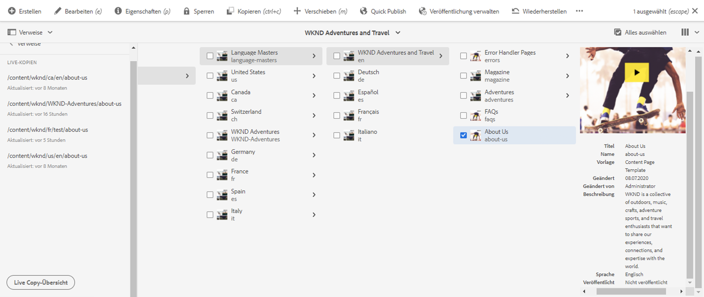
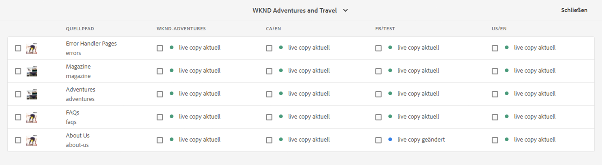
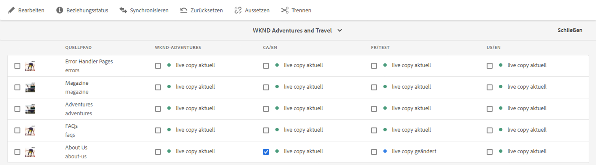
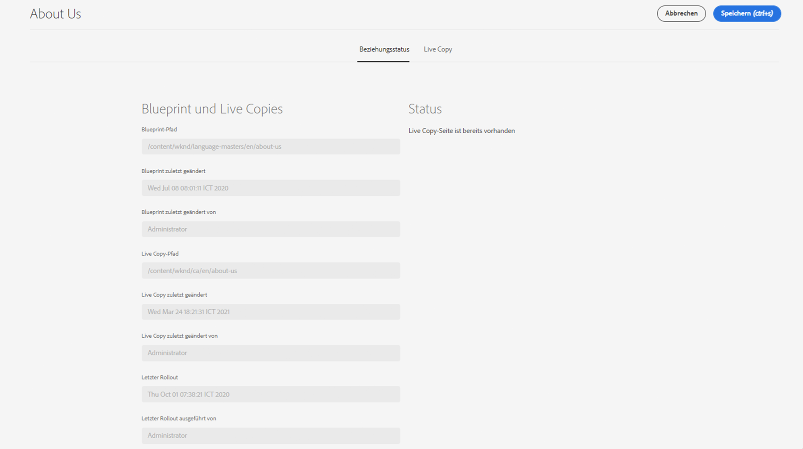
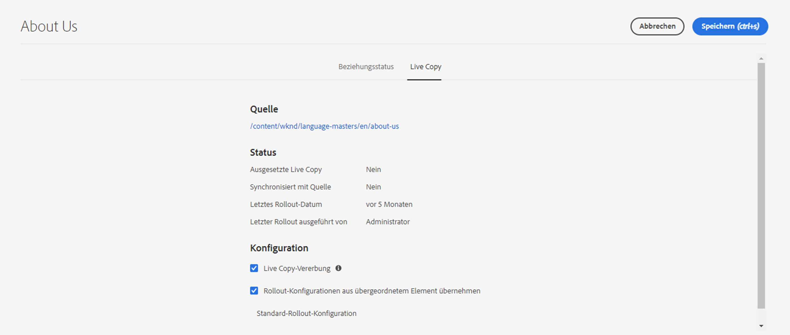

# Konsole „Live Copy-Übersicht“ {#live-copy-overview-console}

Über die Konsole **Live Copy-Übersicht** führen Sie folgende Vorgänge durch:

* Anzeigen/Verwalten der Vererbung einer Site
   * Anzeigen der Blueprint-Struktur und der entsprechenden Live Copy-Struktur samt Vererbungsstatus
   * Ändern des Vererbungsstatus, z. B. Aussetzen und Fortsetzen
   * Anzeigen von Blueprint- und Live Copy-Eigenschaften
* Durchführen von Rollout-Aktionen

## Öffnen der Live Copy-Übersicht {#opening-the-live-copy-overview}

Sie können die Live Copy-Übersicht wie folgt öffnen:

* [über das seitliche Bedienfeld „Verweise“ einer Blueprint-Seite (Sites-Konsole);](#opening-live-copy-overview-references-for-a-blueprint-page)
* [über die Eigenschaften der Blueprint-Seite.](#opening-live-copy-overview-properties-of-a-blueprint-page)

### Verweise auf eine Blueprint-Seite {#references-to-a-blueprint-page}

Die **Live Copy-Übersicht** wird über das seitliche Bedienfeld **Verweise** der Konsole **Sites** geöffnet:

1. Navigieren Sie in der Konsole **Sites** [zu Ihrer Blueprint-Seite und wählen Sie diese aus](/help/sites-cloud/authoring/basic-handling.md#viewing-and-selecting-resources).
1. Öffnen Sie die Leiste **[Verweise](/help/sites-cloud/authoring/basic-handling.md#references)** und wählen Sie **Live Copies** aus.

   

   >[!TIP]
   >
   >Sie können auch zuerst die Verweise öffnen und dann die Blueprint-Seite auswählen.

1. Wählen Sie **Live Copy-Übersicht** aus, um eine Übersicht aller Live Copies mit Bezug zur ausgewählten Blueprint-Seite anzuzeigen und zu verwenden.
1. Verwenden Sie **Schließen**, um den Vorgang zu beenden, und kehren Sie zur **Sites-Konsole** zurück.

### Eigenschaften der Blueprint-Seite {#properties-of-a-blueprint-page}

Die **Live Copy-Übersicht** kann beim Anzeigen der Eigenschaften einer Blueprint-Seite geöffnet werden:

1. Öffnen Sie die **Eigenschaften** für die entsprechende Blueprint-Seite.
1. Wenn Sie nun die Registerkarte **Blueprint** öffnen, wird die Option **Live Copy-Übersicht** in der oberen Symbolleiste angezeigt:

   

1. Wählen Sie **Live Copy-Übersicht** aus, um eine Übersicht aller Live Copies mit Bezug zur aktuellen Blueprint-Seite anzuzeigen und zu verwenden.

1. Verwenden Sie **Schließen**, um den Vorgang zu beenden, und kehren Sie zur **Sites-Konsole** zurück.

## Verwenden der Live Copy-Übersicht {#using-the-live-copy-overview}

Das Fenster **Live Copy-Übersicht** bietet einen Überblick über den Status der Live Copies in Bezug auf die ausgewählte Seite.

Ein Rollout hängt von den Synchronisierungsaktionen ab, die in der jeweiligen Rollout-Konfiguration definiert sind. Einige Aktionen sind abhängig von Änderungen am Inhalt. Es gibt jedoch auch viele Aktionen, die nicht von Änderungen am Inhalt, sondern von Ereignissen wie der Seitenaktivierung abhängen. Solche Ereignisse ändern zwar nicht den Inhalt, aber die internen Eigenschaften in Zusammenhang mit dem Inhalt.

Die Statusfelder hängen ebenfalls von den Synchronisierungsaktionen ab, die in der jeweiligen Rollout-Konfiguration definiert sind. Sie geben an, ob derartige Aktionen seit dem letzten erfolgreichen Rollout entweder im Blueprint oder in der Live Copy durchgeführt wurden. Ein Statusfeld spiegelt nur die Aktionen der jeweiligen Rollout-Konfiguration wider. Wenn bei einer Live Copy noch nie ein erfolgreicher Rollout durchgeführt wurde, wird der Status immer als auf dem neuesten Stand angezeigt.

Eine Rollout-Konfiguration wird beispielsweise als `targetActivate` definiert. Daher hängt ein Rollout ausschließlich von Aktivierungsereignissen ab. Das Statusfeld gibt nur an, ob seit dem letzten erfolgreichen Rollout Aktivierungsereignisse aufgetreten sind.

Mit der **Live Copy-Übersicht** können auch Aktionen in der Live Copy durchgeführt werden:

1. Öffnen Sie die **Live Copy-Übersicht**.
1. Wählen Sie die erforderliche Blueprint- oder Live Copy-Seite aus. Die Symbolleiste wird aktualisiert und zeigt die verfügbaren Aktionen an. Die verfügbaren [Aktionen](overview.md#terms-used) hängen davon ab, ob Sie eine [Blueprint](#actions-for-a-blueprint-page)- oder eine [Live Copy](#actions-for-a-live-copy-page)-Seite auswählen.

### Aktionen für Blueprint-Seiten {#actions-for-a-blueprint-page}

Bei Auswahl einer Blueprint-Seite sind die folgenden Aktionen verfügbar:

* **Bearbeiten** – öffnet die Blueprint-Seite zur Bearbeitung
* **[Rollout](overview.md#rollout-and-synchronize)** – führt einen Rollout durch, um Änderungen von der Quelle auf die Live Copy zu pushen

### Aktionen für eine Live Copy-Seite {#actions-for-a-live-copy-page}

Bei Auswahl einer Live Copy-Seite sind die folgenden Aktionen verfügbar:

* **Bearbeiten** – öffnet die Live Copy-Seite zur Bearbeitung
* **[Beziehungsstatus](#relationship-status)** – zeigt Informationen zum Status und zur Vererbung an
* **[Synchronisieren](overview.md#rollout-and-synchronize)** – synchronisiert eine Live Copy, um Änderungen von der Quelle auf die Live Copy zu übertragen
* **[Zurücksetzen](creating-live-copies.md#resetting-a-live-copy-page)** – setzt eine Live Copy-Seite zurück, um alle abgebrochenen Vererbungsvorgänge zu entfernen und die Seite in denselben Status wie die Quellseite zurückzuversetzen
* **[Aussetzen](overview.md#suspending-and-cancelling-inheritance-and-synchronization)** – deaktiviert vorübergehend die Live-Beziehung zwischen einer Live Copy und der zugehörigen Blueprint-Seite
* **[Fortsetzen](creating-live-copies.md#resuming-inheritance-for-a-page)** – Reaktiviert eine ausgesetzte Beziehung.
* **[Trennen](overview.md#detaching-a-live-copy)** – entfernt die Live-Beziehung zwischen einer Live Copy und der zugehörigen Blueprint-Seite dauerhaft

## Beziehungsstatus {#relationship-status}

Die Konsole **Beziehungsstatus** verfügt über zwei Registerkarten mit verschiedenen Funktionen.

* [Beziehungsstatus](#relationship-status-tab)
* [Live Copy](#live-copy-tab)

### Beziehungsstatus {#relationship-status-tab}

Diese Registerkarte liefert detaillierte Informationen zum Status der Beziehung zwischen Blueprint und Live Copy.

### Live Copy {#live-copy-tab}

Auf dieser Registerkarte können Sie die Konfiguration der Live Copy anzeigen und bearbeiten.

