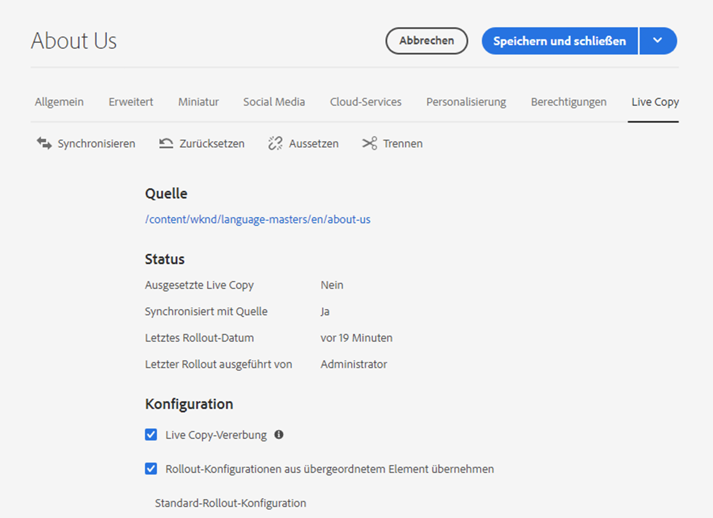
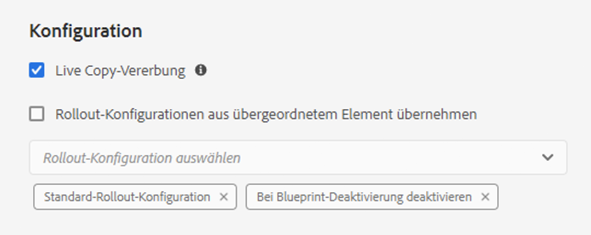

# Konfigurieren der Synchronisierung von Live Copies  {#configuring-live-copy-synchronization}

Adobe Experience Manager bietet standardmäßig mehrere Synchronisierungskonfigurationen. Vor der Verwendung von Live Copies sollten Sie Folgendes berücksichtigen, um festzulegen, wie und wann Live Copies mit ihrem Quellinhalt synchronisiert werden.

1. Entscheiden Sie, ob bestehende Rollout-Konfigurationen Ihren Anforderungen entsprechen.
1. Wenn dies für bestehende Rollout-Konfigurationen nicht zutrifft, entscheiden Sie, ob Sie Ihre eigenen erstellen müssen.
1. Legen Sie fest, welche Rollout-Konfigurationen für Ihre Live Copies verwendet werden sollen.

## Installierte und benutzerdefinierte Rollout-Konfigurationen {#installed-and-custom-rollout-configurations}

In diesem Abschnitt finden Sie Informationen zu den installierten Rollout-Konfigurationen und den von ihnen verwendeten Synchronisierungsaktionen. Außerdem erfahren Sie, wie Sie ggf. benutzerdefinierte Konfigurationen erstellen.

>[!CAUTION]
>
>Das Aktualisieren oder Ändern einer vorkonfigurierten Rollout-Konfiguration wird **nicht** empfohlen. Wenn eine benutzerdefinierte Live-Aktion erforderlich ist, sollte sie in einer benutzerdefinierten Rollout-Konfiguration hinzugefügt werden.

### Rollout-Auslöser {#rollout-triggers}

Jede Rollout-Konfiguration nutzt einen Rollout-Trigger, der den Rollout auslöst. Rollout-Konfigurationen können einen der folgenden Trigger verwenden:

* **Bei Rollout**: Der Befehl **Rollout** wird auf der Blueprint-Seite genutzt oder der Befehl **Synchronisieren** wird auf der Live Copy-Seite verwendet.
* **Bei Modifizierung**: Die Quellseite wird bearbeitet.
* **Bei Aktivierung**: Die Quellseite wird aktiviert.
* **Bei Deaktivierung**: Die Quellseite wird deaktiviert.

>[!NOTE]
>
>Die Verwendung des Auslösers **Bei Modifizierung** kann die Leistung beeinträchtigen. Weitere Informationen finden Sie in den [Best Practices für MSM](best-practices.md#onmodify).

### Rollout-Konfigurationen {#rollout-configurations}

In der folgenden Tabelle sind die Rollout-Konfigurationen aufgeführt, die standardmäßig mit AEM bereitgestellt werden. Auslöser und Synchronisierungsaktionen jeder Rollout-Konfigurationen werden ebenfalls angegeben.

Wenn die Aktionen der installierten Rollout-Konfiguration Ihre Anforderungen nicht erfüllen, können Sie [eine Rollout-Konfiguration erstellen](#creating-a-rollout-configuration).

| Name | Beschreibung | Auslöser | [Synchronisierungsaktionen](#synchronization-actions) |
|---|---|---|---|
| Standard-Rollout-Konfiguration | Standard-Rollout-Konfiguration, die den Start des Rollout-Prozesses bei Rollout-Auslösern ermöglicht und Aktionen ausführt: Erstellen, Aktualisieren, Löschen von Inhalten und Sortierung untergeordneter Knoten | Bei Rollout | `contentUpdate` `contentCopy` `contentDelete` `referencesUpdate` `productUpdate` `orderChildren` |
| Bei Blueprint-Aktivierung aktivieren | Veröffentlicht die Live Copy, wenn die Quelle veröffentlicht wird | Bei Aktivierung | `targetActivate` |
| Bei Blueprint-Deaktivierung deaktivieren | Deaktiviert die Live Copy, wenn die Quelle deaktiviert wird | Be Deaktivierung | `targetDeactivate` |
| Push bei Bearbeitung | Verschiebt den Inhalt in die Live Copy, wenn die Quelle geändert wird.  Verwenden Sie diese Rollout-Konfiguration sparsam, da der Trigger „Bei Modifizierung“ verwendet wird. | Bei Modifizierung | `contentUpdate` `contentCopy` `contentDelete` `referencesUpdate` `orderChildren` |
| Push bei Bearbeitung (leicht) | Verschiebt den Inhalt in die Live Copy, wenn die Blueprint-Seite modifiziert wird, ohne die Referenzen zu aktualisieren (z. B. für flache Kopien) Verwenden Sie diese Rollout-Konfiguration sparsam, da darin der Trigger „Bei Modifizierung“ verwendet wird. | Bei Modifizierung | `contentUpdate` `contentCopy` `contentDelete` `orderChildren` |
| Launch bewerben | Standard-Rollout-Konfigurationen zur Veröffentlichung von Startseiten. | Bei Rollout | `contentUpdate` `contentCopy` `contentDelete` `referencesUpdate` `orderChildren` `markLiveRelationship` |

### Synchronisierungsaktionen {#synchronization-actions}

In der folgenden Tabelle sind Synchronisierungsaktionen aufgeführt, die standardmäßig mit AEM bereitgestellt werden.

Wenn die installierten Aktionen Ihre Anforderungen nicht erfüllen, können Sie [eine neue Synchronisierungsaktion erstellen](/help/implementing/developing/extending/msm.md#creating-a-new-synchronization-action).

| Aktionsname | Beschreibung | Eigenschaften |
|---|---|---|
| `contentCopy` | Wenn Knoten der Quelle in der Live Copy nicht vorhanden sind, kopiert diese Aktion die Knoten in die Live Copy. [Konfigurieren Sie den Service **CQ MSM Content Copy Action**](#excluding-properties-and-node-types-from-synchronization), um die Knotentypen, Absatzelemente und Seiteneigenschaften zu definieren, die ausgeschlossen werden sollen. |  |
| `contentDelete` | Diese Aktion löscht Knoten der Live Copy, die in der Quelle nicht vorhanden sind. [Konfigurieren Sie den Service **CQ MSM Content Delete Action**](#excluding-properties-and-node-types-from-synchronization), um die Knotentypen, Absatzelemente und Seiteneigenschaften zu definieren, die ausgeschlossen werden sollen. |  |
| `contentUpdate` | Diese Aktion aktualisiert den Live Copy-Inhalt mit den Änderungen in der Quelle. [Konfigurieren Sie den Service **CQ MSM Content Update Action**](#excluding-properties-and-node-types-from-synchronization), um die Knotentypen, Absatzelemente und Seiteneigenschaften zu definieren, die ausgeschlossen werden sollen. |  |
| `editProperties` | Diese Aktion bearbeitet die Eigenschaften der Live Copy. Die `editMap`-Eigenschaft bestimmt, welche Eigenschaften bearbeitet werden, und legt ihren Wert fest. Der Wert der Eigenschaft `editMap` muss das folgende Format verwenden: `[property_name_n]#[current_value]#[new_value]` `current_value` und `new_value` sind reguläre Ausdrücke und `n` ist eine inkrementierte Ganzzahl. Betrachten Sie zum Beispiel den folgenden Wert für `editMap`: `sling:resourceType#/(contentpage`‖`homepage)#/mobilecontentpage,cq:template#/contentpage#/mobilecontentpage` Dieser Wert bearbeitet die Eigenschaften der Live Copy-Knoten wie folgt:  Die `sling:resourceType`-Eigenschaften, die entweder auf `contentpage` oder auf `homepage` festgelegt sind, werden auf `mobilecontentpage` gesetzt. Die `cq:template`-Eigenschaften, die auf `contentpage` eingestellt sind, werden auf `mobilecontentpage` eingestellt. | `editMap: (String)` identifiziert die Eigenschaft, den aktuellen Wert und den neuen Wert. Weitere Informationen finden Sie in der Beschreibung. |
| `notify` | Diese Aktion sendet ein Seitenereignis, dass das Rollout der Seite erfolgt ist. Um Benachrichtigungen zu erhalten, müssen Benutzende zunächst Rollout-Ereignisse abonnieren. |  |
| `orderChildren` | Diese Aktion ordnet die untergeordneten Knoten basierend auf der Reihenfolge auf dem Blueprint an. |  |
| `referencesUpdate` | Durch diese Synchronisierungsaktion werden die Verweise der Live Copy aktualisiert. Sie sucht in den Live Copy-Seiten Pfade, die auf eine Ressource im Blueprint verweisen. Wenn sie solch einen Pfad gefunden hat, wird er so aktualisiert, dass er auf die zugehörige Ressource in der Live Copy verweist. Verweise, die Ziele außerhalb des Blueprints aufweisen, werden nicht geändert.  [Konfigurieren Sie den Service **CQ MSM References Update Action**](#excluding-properties-and-node-types-from-synchronization), um die Knotentypen, Absatzelemente und Seiteneigenschaften zu definieren, die ausgeschlossen werden sollen. |  |
| `targetVersion` | Diese Aktion erstellt eine Version der Live Copy. Diese Aktion muss die einzige Synchronisierungsaktion in einer Rollout-Konfiguration sein. |  |
| `targetActivate` | Diese Aktion aktiviert die Live Copy. Diese Aktion muss die einzige Synchronisierungsaktion in einer Rollout-Konfiguration sein. |  |
| `targetDeactivate` | Diese Aktion deaktiviert die Live Copy. Diese Aktion muss die einzige Synchronisierungsaktion in einer Rollout-Konfiguration sein. |  |
| `workflow` | Diese Aktion startet den Workflow, der durch die Zieleigenschaft definiert ist (nur für Seiten), und nutzt die Live Copy als Payload. Der Zielpfad ist der Pfad des Modellknotens. | `target: (String)` ist der Pfad zum Workflow-Modell. |
| `mandatory` | Diese Aktion legt die Berechtigungen mehrerer ACLs auf der Live Copy-Seite für eine bestimmte Benutzergruppe auf Schreibzugriff fest. Die folgenden ACLs sind konfiguriert: `ActionSet.ACTION_NAME_REMOVE` `ActionSet.ACTION_NAME_SET_PROPERTY` `ActionSet.ACTION_NAME_ACL_MODIFY` Verwenden Sie diese Aktion nur für Seiten. | `target: (String)` ist die ID der Gruppe, für die Sie Berechtigungen festlegen. |
| `mandatoryContent` | Diese Aktion legt die Berechtigungen mehrerer ACLs auf der Live Copy-Seite für eine bestimmte Benutzergruppe auf Schreibzugriff fest. Die folgenden ACLs sind konfiguriert: `ActionSet.ACTION_NAME_SET_PROPERTY` `ActionSet.ACTION_NAME_ACL_MODIFY` Verwenden Sie diese Aktion nur für Seiten. | `target: (String)` ist die ID der Gruppe, für die Sie Berechtigungen festlegen. |
| `mandatoryStructure` | Diese Aktion legt die Berechtigungen der `ActionSet.ACTION_NAME_REMOVE`-ACL auf der Live Copy-Seite für eine bestimmte Benutzergruppe auf Schreibzugriff fest. Nutzen Sie diese Aktion nur für Seiten. | `target: (String)` ist die ID der Gruppe, für die Sie Berechtigungen festlegen. |
| `VersionCopyAction` | Wenn der Blueprint/die Quellseite mindestens einmal veröffentlicht wurde, erstellt diese Aktion eine Live Copy-Seite basierend auf der veröffentlichten Version. Anmerkung: Diese Aktion ist nur für das Erstellen einer Live Copy-Seite auf der Grundlage einer veröffentlichten Quellseite verfügbar, nicht für das Aktualisieren einer vorhandenen Live Copy-Seite. |  |
| `PageMoveAction` | Die `PageMoveAction` gilt, wenn eine Seite in den Blueprint verschoben wurde. Die Aktion kopiert (nicht: verschiebt) die zugehörige Live Copy-Seite vom Ort vor dem Verschieben zum Ort nach dem Verschieben. Die `PageMoveAction`-Aktion ändert dabei die Live Copy-Seite am Ort vor dem Verschieben nicht. Bei aufeinanderfolgenden Rollout-Konfigurationen hat sie daher den Status einer Live-Beziehung ohne Blueprint. [Konfigurieren Sie den Service **CQ MSM Page Move Action**](#excluding-properties-and-node-types-from-synchronization), um die Knotentypen, Absatzelemente und Seiteneigenschaften festzulegen, die ausgeschlossen werden sollen. Diese Aktion muss die einzige Synchronisierungsaktion in einer Rollout-Konfiguration sein. | Setzen Sie `prop_referenceUpdate: (Boolean)` auf true (Standard), um Verweise zu aktualisieren. |
| `markLiveRelationship` | Diese Aktion gibt an, dass eine Live-Beziehung für Inhalt vorhanden ist, der für den Launch erstellt wurde. |  |

### Erstellen einer Rollout-Konfiguration {#creating-a-rollout-configuration}

Sie können [eine Rollout-Konfiguration erstellen](/help/implementing/developing/extending/msm.md#creating-a-new-rollout-configuration), wenn die installierten Rollout-Konfigurationen Ihre Anwendungsanforderungen nicht erfüllen, indem Sie die folgenden Schritte ausführen.

1. [Erstellen Sie die Rollout-Konfiguration-](/help/implementing/developing/extending/msm.md#create-the-rollout-configuration)
1. [Hinzufügen von Synchronisierungsaktionen zur Rollout-Konfiguration](/help/implementing/developing/extending/msm.md#add-synchronization-actions-to-the-rollout-configuration).

Die neue Rollout-Konfiguration steht dann zur Verfügung, sobald Sie die Rollout-Konfigurationen auf einer Blueprint- oder einer Live Copy-Seite festlegen.

### Ausschließen von Eigenschaften und Knotentypen von der Synchronisierung {#excluding-properties-and-node-types-from-synchronization}

Sie können mehrere OSGi-Services konfigurieren, die die entsprechenden Synchronisierungsaktionen unterstützen, sodass sie sich nicht auf bestimmte Knotentypen und Eigenschaften auswirken. So sollten beispielsweise viele Eigenschaften und Unterknoten, die mit der internen Funktionstüchtigkeit von AEM zusammenhängen, nicht in einer Live Copy enthalten sein. Nur Inhalte, die für Benutzer der Seite relevant sind, sollten kopiert werden.

In AEM können Sie die Konfigurationseinstellungen für solche Services auf unterschiedliche Weise verwalten. Weitere Details und Informationen zur empfohlenen Vorgehensweise finden Sie unter [Konfigurieren von OSGi](/help/implementing/deploying/configuring-osgi.md).

In der folgenden Tabelle sind die Synchronisierungsaktionen aufgeführt, von denen Sie Knoten ausschließen können. Die Tabelle enthält die Namen der Dienste, die mit der Web-Konsole konfiguriert werden sollen, und die PID für die Konfiguration mit einem Repository-Knoten.

| Synchronisierungsaktion | Service-Name in der Web-Konsole | Service-PID |
|---|---|---|
| `contentCopy` | CQ MSM Content Copy Action | `com.day.cq.wcm.msm.impl.actions.ContentCopyActionFactory` |
| `contentDelete` | CQ MSM Content Delete Action | `com.day.cq.wcm.msm.impl.actions.ContentDeleteActionFactory` |
| `contentUpdate` | CQ MSM Content Update Action | `com.day.cq.wcm.msm.impl.actions.ContentUpdateActionFactory` |
| `PageMoveAction` | CQ MSM Page Move Action | `com.day.cq.wcm.msm.impl.actions.PageMoveActionFactory` |
| `referencesUpdate` | CQ MSM References Update Action | `com.day.cq.wcm.msm.impl.actions.ReferencesUpdateActionFactory` |

In der folgenden Tabelle werden die Eigenschaften beschrieben, die Sie konfigurieren können:

| Eigenschaf in der Web-Konsole | OSGi-Eigenschaft | Beschreibung |
|---|---|---|
| Ausgeschlossene Knotentypen | `cq.wcm.msm.action.excludednodetypes` | Ein regulärer Ausdruck, der die Knotentypen abgleicht, die von der Synchronisierungsaktion ausgeschlossen werden sollen |
| Ausgeschlossene Absatzelemente | `cq.wcm.msm.action.excludedparagraphitems` | Ein regulärer Ausdruck, der die Absatzelemente abgleicht, die von der Synchronisierungsaktion ausgeschlossen werden sollen |
| Ausgeschlossene Seiteneigenschaften | `cq.wcm.msm.action.excludedprops` | Ein regulärer Ausdruck, der die Seiteneigenschaften abgleicht, die von der Synchronisierungsaktion ausgeschlossen werden sollen |
| Ignorierte Mixin-Knotentypen | `cq.wcm.msm.action.ignoredMixin` | Ein regulärer Ausdruck, der die Namen von Mixin-Knotentypen abgleicht, die von der Synchronisierungsaktion ausgeschlossen werden sollen (nur für die `contentUpdate`-Aktion verfügbar) |

#### CQ MSM Content Update Action – Ausschlüsse {#cq-msm-content-update-action-exclusions}

Mehrere Eigenschaften und Knotentypen sind standardmäßig ausgeschlossen. Diese sind in der OSGi-Konfiguration von **CQ MSM Content Update Action** unter **Ausgeschlossene Seiteneigenschaften** definiert.

Standardmäßig werden Eigenschaften, die den folgenden regulären Ausdrücken entsprechen, beim Rollout ausgeschlossen (d. h. nicht aktualisiert):

Sie können die Ausdrücke, die die Ausschlussliste definieren, bei Bedarf ändern.

Wenn Sie beispielsweise möchten, dass die Seite **Title** bei den Änderungen enthalten sein soll, die beim Rollout berücksichtigt werden, entfernen Sie `jcr:title` von den Ausschlüssen, z. B. mit dem regulären Ausdruck:

`jcr:(?!(title)$).*`

### Konfigurieren der Synchronisierung für die Aktualisierung von Verweisen {#configuring-synchronization-for-updating-references}

Sie können mehrere OSGi-Services konfigurieren, die die entsprechenden Synchronisierungsaktionen im Zusammenhang mit der Aktualisierung von Verweisen unterstützen.

In AEM können Sie die Konfigurationseinstellungen für solche Services auf unterschiedliche Weise verwalten. Weitere Details und Informationen zur empfohlenen Vorgehensweise finden Sie unter [Konfigurieren von OSGi](/help/implementing/deploying/configuring-osgi.md).

In der folgenden Tabelle sind die Synchronisierungsaktionen aufgeführt, für die Sie die Referenz-Aktualisierung angeben können. Die Tabelle enthält die Namen der Dienste, die mit der Web-Konsole konfiguriert werden sollen, und die PID für die Konfiguration mit einem Repository-Knoten.

| Eigenschaf in der Web-Konsole | OSGi-Eigenschaft | Beschreibung |
|---|---|---|
| Referenz über verschachtelte Live Copies aktualisieren | `cq.wcm.msm.impl.action.referencesupdate.prop_updateNested` | Wählen Sie diese Option in der Web-Konsole aus oder legen Sie diese boolesche Eigenschaft mithilfe der Repository-Konfiguration auf `true` fest, um Verweise zu ersetzen, die auf eine Ressource verweisen, die sich im Zweig der höchsten Live Copy befindet. Nur für sie Aktion `referencesUpdate` verfügbar. |
| Verweisende Seiten aktualisieren | `cq.wcm.msm.impl.actions.pagemove.prop_referenceUpdate` | Wählen Sie diese Option in der Web-Konsole aus oder setzen Sie diese boolesche Eigenschaft mithilfe der Repository-Konfiguration auf `true`, um alle Verweise auf die Originalseite zu aktualisieren und stattdessen auf die Live Copy-Seite zu verweisen. Nur für `PageMoveAction` verfügbar. |

## Festlegen der zu verwendenden Rollout-Konfigurationen {#specifying-the-rollout-configurations-to-use}

Bei MSM können Sie Sätze von Rollout-Konfigurationen festlegen, die allgemein genutzt werden, und sie bei Bedarf für bestimmte Live Copies überschreiben. MSM bietet mehrere Orte, an denen Sie die zu verwendenden Rollout-Konfigurationen festlegen können. Der Ort bestimmt, ob eine Konfiguration für eine bestimmte Live Copy gilt.

Die folgende Liste der Orte, unter denen Sie die zu verwendenden Rollout-Konfigurationen festlegen können, beschreibt, wie MSM bestimmt, welche Rollout-Konfigurationen für eine Live Copy genutzt werden:

* **[Eigenschaften der Live Copy-Seite](live-copy-sync-config.md#setting-the-rollout-configurations-for-a-live-copy-page):** Wenn eine Live Copy-Seite so konfiguriert ist, dass sie mindestens eine Rollout-Konfiguration verwenden soll, nutzt MSM diese Rollout-Konfigurationen.
* **[Eigenschaften der Blueprint-Seite](live-copy-sync-config.md#setting-the-rollout-configuration-for-a-blueprint-page):** Wenn eine Live Copy auf einem Blueprint basiert und die Live Copy-Seite nicht mit einer Rollout-Konfiguration konfiguriert ist, wird die Rollout-Konfiguration genutzt, die mit der Blueprint-Quellseite verknüpft ist.
* **Eigenschaften der übergeordneten Live Copy-Seite:** Wenn weder die Live Copy-Seite noch die Blueprint-Quellseite mit einer Rollout-Konfiguration konfiguriert ist, wird die Rollout-Konfiguration genutzt, die für die übergeordnete Live Copy-Seite gilt.
* **[Systemstandard](live-copy-sync-config.md#setting-the-system-default-rollout-configuration):** Wenn die Rollout-Konfiguration der übergeordneten Live Copy-Seite nicht ermittelt werden kann, wird die standardmäßige Rollout-Konfiguration genutzt.

Beispielsweise nutzt ein Blueprint die Seite [WKND-Tutorial](/help/implementing/developing/introduction/develop-wknd-tutorial.md) als Quellinhalt. Aus der Blueprint wird eine Website erstellt. Jedes Element in der folgenden Liste beschreibt ein anderes Szenario in Bezug auf die Verwendung von Rollout-Konfigurationen:

* Keine Blueprint-Seiten oder Live Copy-Seiten sind für eine Rollout-Konfiguration konfiguriert. MSM nutzt die standardmäßige Rollout-Konfiguration des Systems für alle Live Copy-Seiten.
* Die Stammseite der WKND-Site ist für mehrere Rollout-Konfigurationen konfiguriert. MSM nutzt diese Rollout-Konfigurationen für alle Live Copy-Seiten.
* Die Stammseite der WKND-Site ist für mehrere Rollout-Konfigurationen konfiguriert und die Stammseite der Live Copy-Website ist für einen anderen Satz an Rollout-Konfigurationen konfiguriert. MSM nutzt die Rollout-Konfigurationen, die auf der Stammseite der Live Copy-Website konfiguriert sind.

### Festlegen der Rollout-Konfigurationen für eine Live Copy-Seite {#setting-the-rollout-configurations-for-a-live-copy-page}

Konfigurieren Sie eine Live Copy-Seite mit den Rollout-Konfigurationen, die beim Rollout der Quellseite genutzt werden sollen. Untergeordnete Seiten erben diese Konfiguration standardmäßig. Wenn Sie die zu verwendende Rollout-Konfiguration konfigurieren, überschreiben Sie die Konfiguration, die die Live Copy-Seite von der übergeordneten Seite erbt.

Sie können die Rollout-Konfigurationen für eine Live Copy-Seite auch konfigurieren, wenn Sie [die Live Copy erstellen](creating-live-copies.md#creating-a-live-copy-of-a-page).

1. Wählen Sie über die **Sites-Konsole** die Live Copy-Seite aus.
1. Wählen Sie in der Symbolleiste **Eigenschaften** aus.
1. Öffnen Sie die Registerkarte **Live Copy**.

   Im Bereich **Konfigurationen** werden die Rollout-Konfigurationen angezeigt, die die Seite erbt.

   

1. Passen Sie ggf. das Flag **Live Copy-Vererbung** an. Bei Auswahl dieser Option gilt die Life Copy-Konfiguration für alle untergeordneten Elemente.

1. Deaktivieren Sie die Eigenschaft **Rollout-Konfiguration aus übergeordnetem Element übernehmen** und wählen Sie dann eine oder mehrere Rollout-Konfigurationen aus der Liste aus.

   Die ausgewählten Rollout-Konfigurationen werden unter der Dropdown-Liste angezeigt.

   

1. Wählen Sie **Speichern und schließen**.

### Festlegen der Rollout-Konfiguration für eine Blueprint-Seite {#setting-the-rollout-configuration-for-a-blueprint-page}

Konfigurieren Sie eine Blueprint-Seite mit den Rollout-Konfigurationen, die beim Rollout der Blueprint-Seite genutzt werden sollen.

Die untergeordneten Seiten der Blueprint-Seite übernehmen die Konfiguration. Wenn Sie die zu verwendende Rollout-Konfiguration konfigurieren, überschreiben Sie die Konfiguration, die die Seite von der übergeordneten Seite erbt.

1. Wählen Sie über die **Sites-Konsole** die Stammseite der Blueprint aus.
1. Wählen Sie in der Symbolleiste **Eigenschaften** aus.
1. Öffnen Sie die Registerkarte **Blueprint**.
1. Wählen Sie eine oder mehrere **Rollout-Konfigurationen** aus, indem Sie die Dropdown-Liste verwenden.
1. Übernehmen Sie die Aktualisierungen mit **Speichern**.

### Festlegen der standardmäßigen Rollout-Konfiguration {#setting-the-system-default-rollout-configuration}

Um eine Rollout-Konfiguration als Systemstandard festzulegen, konfigurieren Sie den folgenden OSGi-Service.

* **Day CQ WCM Live Relationship Manager** mit der Service-PID `com.day.cq.wcm.msm.impl.LiveRelationshipManagerImpl`

Konfigurieren Sie den Service entweder über die [Web-Konsole](/help/implementing/deploying/configuring-osgi.md#osgi-configuration-with-the-web-console) oder einen [Repository-Knoten](/help/implementing/deploying/configuring-osgi.md#osgi-configuration-in-the-repository).

* In der Web-Konsole ist der Name der zu konfigurierenden Eigenschaft **Standardmäßige Rollout-Konfiguration**.
* Bei Verwendung eines Repository-Knotens ist der Name der zu konfigurierenden Eigenschaft `liverelationshipmgr.relationsconfig.default`.

Legen Sie diesen Eigenschaftswert auf den Pfad der Rollout-Konfiguration fest, die als Systemstandard genutzt werden soll. Der Standardwert ist `/libs/msm/wcm/rolloutconfigs/default`, was der **Standard-Rollout-Konfiguration** entspricht.
