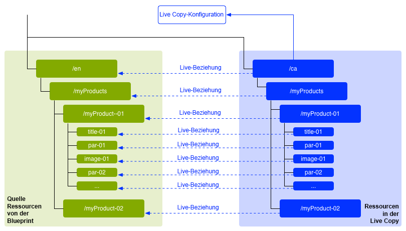
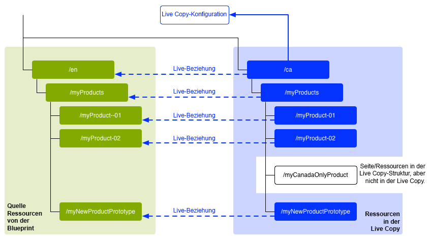
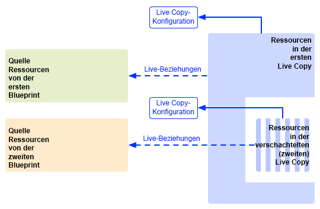
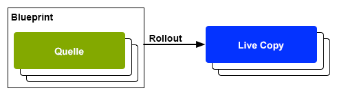
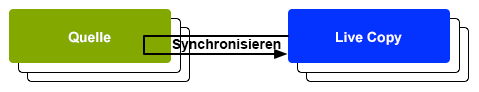

# Wiederverwenden von Inhalten: Multi Site Manager und Live Copy {#multi-site-manager-and-live-copy}

Multi Site Manager (MSM) ermöglicht Ihnen die Verwendung derselben Site-Inhalte an mehreren Standorten. MSM verwendet seine Live Copy-Funktion, um Folgendes zu erreichen.

* Mit MSM können Sie:
   * Inhalte einmalig erstellen und anschließend
   * Inhalte dann in anderen Bereichen derselben oder anderer Sites verwenden (über [Live Copies](#live-copies)).
* MSM behält dann die Live-Beziehungen zwischen Ihren Quellinhalten und deren Live Copies bei, sodass:
   * die Quelle und die Live Copies synchronisiert werden, wenn den Quellinhalt ändern.
   * Sie die Live-Beziehung zu einzelnen Unterseiten und/oder Komponenten trennen können, wenn Sie Anpassungen ausschließlich am Inhalt der Live Copies vornehmen wollen.

Diese Seite bietet einen Überblick über das Wiederverwenden von Inhalten mit MSM. Auf den folgenden Seiten werden die damit zusammenhängenden Probleme ausführlich behandelt.

* [Erstellen und Synchronisieren von Live Copies](creating-live-copies.md)
* [Konsole „Live Copy-Übersicht“](live-copy-overview.md)
* [Konfigurieren der Synchronisierung von Live Copies](live-copy-sync-config.md)
* [MSM-Rollout-Konflikte](rollout-conflicts.md)
* [Best Practices für MSM](best-practices.md)

>[!NOTE]
>
>MSM kann auch für Assets, einschließlich Inhaltsfragmente, verwendet werden. Siehe [Wiederverwenden von Inhaltsfragmenten mit MSM für Assets](/help/assets/reuse-assets-using-msm.md) (nur über die Assets-Konsole verfügbar).

## Mögliche Szenarien {#possible-scenarios}

MSM und Live Copies haben zahlreiche Anwendungsfälle. Szenarien können beispielsweise folgendermaßen aussehen:

* **Multinational: von globalen zu lokalen Unternehmen**

  Ein typisches Anwendungsbeispiel, das von MSM unterstützt wird, ist die Wiederverwendung von Inhalten auf mehreren multinationalen Websites mit derselben Sprache. Dies ermöglicht die Wiederverwendung der Kerninhalte und lässt gleichzeitig Abweichungen für verschiedene Länder zu.

  So wurde zum Beispiel der englische Abschnitt des [WKND-Beispieltutorials](/help/implementing/developing/introduction/develop-wknd-tutorial.md) für Kunden in den USA erstellt. Die meisten Inhalte auf dieser Site können auch für andere WKND-Websites verwendet werden, die sich an englischsprachige Kunden aus verschiedenen Ländern und Kulturkreisen richten. Der Kerninhalt bleibt auf allen Sites gleich, wobei regionale Anpassungen vorgenommen werden können.

  Die folgende Struktur kann für Sites in den Vereinigten Staaten und Kanada verwendet werden. Beachten Sie, dass der `language-masters`-Knoten nicht nur die primäre Kopie des englischen Inhalts, sondern auch die anderer Sprachinhalte beibehält. Diese Inhalte können als Grundlage für weitere regionale Sprachinhalte neben Englisch verwendet werden.

  ```xml
  /content
      |- wknd
          |- language-masters
              |- en
              |- es
              |- fr
          |- us
              |- en
              |- es
          |- ca
              |- en
              |- fr
  ```

  >[!NOTE]
  >
  >MSM übersetzt die Inhalte nicht. Er wird zur Erstellung der erforderlichen Struktur und zur Bereitstellung von Inhalten verwendet.
  >
  >
  >Ein Beispiel hierfür finden Sie unter [Übersetzen von Inhalten für mehrsprachige Sites](/help/sites-cloud/administering/translation/overview.md).

* **National – Zentrale zu Zweigstellen**

  Alternativ dazu möchte ein Unternehmen mit einem Händlernetzwerk vielleicht separate Websites für seine einzelnen Verkaufsvertretungen, von denen jede eine Variante der von der Zentrale bereitgestellten Haupt-Website darstellt. Dies könnte für ein einzelnes Unternehmen mit mehreren regionalen Niederlassungen oder ein nationales Franchise-System mit einem zentralen Franchise-Geber und mehreren lokalen Franchise-Nehmern gelten.

  Die Zentrale kann die Kerninformationen bereitstellen und die regionalen Standorte können lokale Informationen wie Kontaktdetails, Geschäftszeiten und Veranstaltungen ergänzen.

  ```xml
  /content
      |- head-office-berlin
      |- branch-hamburg
      |- branch-stuttgart
      |- branch-munich
      |- branch-frankfurt
  ```

* **Mehrere Versionen**

  MSM kann Versionen einer bestimmten Unterverzweigung erstellen. Beispielsweise kann eine Support-Unterwebsite Details zu den verschiedenen Versionen eines bestimmten Produkts enthalten, wobei die Basisinformationen konstant bleiben und nur die aktualisierten Funktionen geändert werden müssen:

  ```xml
  /content
      |- game-support
          |- polybius
              |- v5.0
              |- v4.0
              |- v3.0
              |- v2.0
              |- v1.0
  ```

  >[!TIP]
  >
  >In einem solchen Szenario stellt sich die Frage, ob eine einfache Kopie oder Live Copies erstellt werden. Zu berücksichtigen ist:
  >
  >* welcher Anteil des Kerninhalts über die diversen Versionen hinweg aktualisiert werden muss
  >
  >und
  >
  >* welcher Anteil der einzelnen Kopien angepasst werden muss.

## MSM über die Benutzeroberfläche {#msm-from-the-ui}

Auf MSM kann mithilfe verschiedener Optionen der jeweiligen Konsole direkt über die Benutzeroberfläche zugegriffen werden.

* **Website erstellen** (**Sites**)

   * MSM unterstützt Sie bei der Verwaltung mehrerer Websites, die gemeinsame Inhalte enthalten. Beispielsweise werden Websites oft so für internationale Zielgruppen bereitgestellt, dass der Großteil der Inhalte für alle Länder ist, ein Teil des Inhalts aber spezifisch für das jeweilige Land ist. MSM ermöglicht Ihnen die [Erstellung von Live Copies, die automatisch eine oder mehrere Sites basierend auf Ihrer Quell-Site aktualisieren](creating-live-copies.md#creating-a-live-copy-of-a-site-from-a-blueprint-configuration). Dies hilft Ihnen auch dabei, eine gemeinsame Basisstruktur zu erzwingen, die gemeinsamen Inhalte auf mehreren Sites zu nutzen, ein gemeinsames Erscheinungsbild zu erreichen und die Maßnahmen auf die Verwaltung der Inhalte zu konzentrieren, die sich auf den verschiedenen Sites tatsächlich unterscheiden. Erstellen einer Site auf diese Weise:
      * Für die Angabe der Quelle ist eine vordefinierte Blueprint-Konfiguration erforderlich.
      * Es wird eine Live Copy der (vordefinierten) Quelle erstellt.
      * Bietet den Benutzenden die Schaltfläche **Rollout**.

* **Erstellen einer Live Copy** (**Sites**)

   * Mit MSM können Sie [eine (einmalige) Ad-hoc-Live Copy einer einzelnen Seite oder einer Unterverzweigung einer Website erstellen](creating-live-copies.md#creating-a-live-copy-of-a-page), z. B. eine Unterverzweigung duplizieren, um Informationen über eine neue/aktualisierte Version eines Produkts bereitzustellen. Erstellen einer Live Copy auf diese Weise:
      * Erstellt eine Ad-hoc-Live Copy (keine Blueprint-Konfiguration erforderlich).
      * Kann verwendet werden, um (sofort) eine Live Copy einer beliebigen Seite/Verzweigung zu erstellen.
      * Erfordert die Option **Synchronisieren** (die **Rollout**-Schaltfläche wird nicht bereitgestellt).

* **Eigenschaften anzeigen** (**Sites**)

   * Bei Bedarf hilft Ihnen diese Option bei der [Überwachung Ihrer Live Copy](creating-live-copies.md#monitoring-your-live-copy), indem Informationen zur zugehörigen **Live Copy** oder zum **Blueprint** bereitgestellt werden.

* **Verweise** (**Sites**)

   * Die Leiste [Verweise](/help/sites-cloud/authoring/basic-handling.md#references) stellt Ihnen Informationen zu den **Live Copies** sowie den Zugriff auf die entsprechenden Aktionen bereit.

* **Live Copy-Übersicht** (**Sites**)

   * Diese Konsole ermöglicht Ihnen die [Ansicht und Verwaltung Ihres Blueprints und dessen Live Copies](live-copy-overview.md).

* **Blueprints** (**Tools** – **Sites**)

   * Diese Konsole ermöglicht Ihnen die [Erstellung und Verwaltung Ihrer Blueprint-Konfigurationen](creating-live-copies.md#creating-a-blueprint-configuration).

>[!NOTE]
>
>MSM kann sowohl mit Seiten als auch mit [Experience Fragments](/help/sites-cloud/authoring/fragments/experience-fragments.md) verwendet werden, da diese Fragmente Teil eines Erlebnisses (Seite) sind.

>[!NOTE]
>
>Aspekte der MSM-Funktionen werden in verschiedenen anderen AEM-Funktionen wie „Launches“ verwendet. In diesen Fällen wird die Live Copy von dieser Funktion verwaltet.

### Verwendete Begriffe {#terms-used}

Als Einführung bietet die folgende Tabelle einen Überblick über die wichtigsten Begriffe, die mit MSM verwendet werden. Diese werden in den nachfolgenden Abschnitten und Seiten ausführlicher behandelt.

| Begriff | Definition | Weitere Details |
|---|---|---|
| Quelle | Die als Grundlage für Live Copies verwendeten Originalseiten | Synonym für Blueprints und/oder Blueprint-Seiten |
| Live Copy | Die Kopie (der Quelle), die wie durch die Rollout-Konfigurationen definiert von Synchronisierungsaktionen aufrechterhalten wird |  |
| Live Copy-Konfiguration | Festlegen der Konfigurationsdetails für eine Live Copy |  |
| Live-Beziehung | Effektive Definition der Vererbung für eine bestimmte Ressource, d. h. die Verbindung(en) zwischen der Quelle und den Live Copys | Stellt sicher, dass Änderungen an der Quelle mit der Live Copy synchronisiert werden |
| Blueprint | Synonym für Quelle | Kann durch eine Blueprint-Konfiguration definiert werden |
| Blueprint-Konfiguration | Vordefinierte Konfiguration zur Angabe eines Quellpfads | Der Rollout-Befehl wird beim Verweis auf eine Blueprint-Seite in einer Blueprint-Konfiguration zur Verfügung gestellt. |
| Kapitel | Die Abschnitte des Blueprints, die die Live Copy enthalten soll | Dies sind im Allgemeinen Unterseiten des Stamms |
| Synchronisierung | Der allgemeine Begriff für die Synchronisierung von Inhalten zwischen der Quelle und den Live Copies (sowohl durch die Optionen **Rollout** als auch **Synchronisieren**) |  |
| Rollout | Synchronisiert die Quelle mit der Live Copy | Wird von einem Autor (auf einer Blueprint-Seite) oder von einem Systemereignis (wie durch die Rollout-Konfiguration definiert) ausgelöst |
| Rollout-Konfiguration | Regeln, die bestimmen, welche Eigenschaften wie und wann synchronisiert werden |  |
| Synchronisieren | Eine manuelle Anforderung einer Synchronisierung, die über die Live Copy-Seiten erfolgt |  |
| Vererbung | Eine Live Copy-Seite/-Komponente übernimmt bei einer Synchronisierung Inhalt von der Quellseite/-komponente |  |
| Aussetzen | Entfernt vorübergehend die Live-Beziehung zwischen einer Live Copy und der zugehörigen Blueprint-Seite |  |
| Trennen | Entfernt dauerhaft die Live-Beziehung zwischen einer Live Copy und der zugehörigen Blueprint-Seite |  |
| Zurücksetzen | Setzt eine Live Copy-Seite zurück, um alle abgebrochenen Vererbungsvorgänge zu entfernen und die Seite wieder in denselben Status wie die Quellseite zu versetzen | Eine Rücksetzung wirkt sich auf alle von Ihnen durchgeführten Änderungen an den Seiteneigenschaften, am Absatzsystem und an den Komponenten aus. |
| Flach | Eine Live Copy einer einzelnen Seite |  |
| Tief | Eine Live Copy einer Seite zusammen mit ihren untergeordneten Seiten |  |

>[!TIP]
>
>Siehe [Erweitern des Multi-Site-Managers](/help/implementing/developing/extending/msm.md#overview-of-the-java-api) für die Objektnamen.

## Live Copies {#live-copies}

Eine MSM-Live Copy ist eine Kopie spezifischer Site-Inhalte, die eine Live-Beziehung mit der Originalquelle beibehalten.

* Die Live Copy übernimmt Inhalte aus ihrer Quelle.
* Die Synchronisierung führt die tatsächliche Übertragung von Inhalten durch, wenn Änderungen an der Quelle vorgenommen werden.
* Eine Live Copy kann folgendermaßen betrachtet werden:
   * Flach: eine einzelne Seite
   * Tief: die Seite mit ihren untergeordneten Seiten
* Synchronisierungsregeln, die als Rollout-Konfigurationen bezeichnet werden, bestimmen, welche Eigenschaften synchronisiert werden und wann die Synchronisierung durchgeführt wird.

Im vorherigen Beispiel ist `/content/wknd/language-masters/en` die globale primäre Site in englischer Sprache. Zur Wiederverwendung des Inhalts dieser Site werden MSM-Live Copies erstellt:

* Der Inhalt unter `/content/wknd/language-masters/en` ist die Quelle.
* Der Inhalt unter `/content/wknd/language-masters/en` wird unter die Knoten `/content/wknd/us/en/` und `/content/wknd/ca/en` kopiert. Dabei handelt es sich um die Live Copies.
* Autorinnen und Autoren ändern die Seiten unterhalb von `/content/wknd/language-masters/en`.
* Nach der Auslösung synchronisiert MSM diese Änderungen mit den Live Copies.

### Live Copies – Komposition {#live-copies-composition}

>[!NOTE]
>
>Die Diagramme und Beschreibungen in diesem Abschnitt stellen Momentaufnahmen der potenziellen Live Copies dar. Sie erheben keinen Anspruch auf Vollständigkeit, stellen jedoch einen Überblick bereit, um bestimmte Merkmale hervorzuheben.

Beim erstmaligen Erstellen einer Live Copy werden die ausgewählten Quellseiten 1:1 in der Live Copy wiedergegeben. Danach können neue Ressourcen (Seiten und/oder Absätze) auch direkt innerhalb der Live Copy erstellt werden. Daher ist es hilfreich, sich dieser Varianten und ihrer Auswirkungen auf die Synchronisierung bewusst zu sein. Mögliche Kompositionen umfassen:

* [Live Copy mit Live Copy-fremden Seiten](#live-copy-with-non-live-copy-pages)
* [Verschachtelte Live Copies](#nested-live-copies)

Die grundlegende Form einer Live Copy verfügt über:

* Live Copy-Seiten, die die ausgewählten Quellseiten 1:1 wiedergeben
* Eine Konfigurationsdefinition.
* Eine zu jeder Ressource festgelegte Live-Beziehung:
   * Verknüpft die Live Copy-Ressource mit ihrem Blueprint/ihrer Quelle.
   * Wird bei der Umsetzung von Vererbung und Rollout verwendet.

Abhängig von den Anforderungen können Änderungen [synchronisiert](creating-live-copies.md#synchronizing-your-live-copy) werden.



#### Live Copy mit Live Copy-fremden Seiten {#live-copy-with-non-live-copy-pages}

Wenn Sie in AEM eine Live Copy erstellen, können Sie die Live Copy-Verzweigung sehen sowie durch diese navigieren und normale AEM-Funktionen auf der Live Copy-Verzweigung verwenden. Dies bedeutet, dass Sie (oder ein Prozess) neue Ressourcen (Seiten und/oder Absätze) in der Live Copy erstellen können. Beispielsweise ein Produkt für eine bestimmte Region oder ein bestimmtes Land.

* Solche Ressourcen verfügen über keine Live-Beziehung zu Quell-/Blueprint-Seiten und werden nicht synchronisiert.
* Es können Szenarien auftreten, die MSM als Spezialfälle behandelt. Ein Beispiel hierfür wäre, wenn Sie (oder ein Prozess) eine Seite mit der gleichen Position und dem gleichen Namen sowohl in der Quelle/dem Blueprint als auch in den Live Copy-Verzweigungen erstellen. Bei solchen Situationen finden Sie unter [MSM-Rollout-Konflikte](rollout-conflicts.md) weitere Informationen.



#### Verschachtelte Live Copies {#nested-live-copies}

Wenn Sie (oder ein Prozess) eine [neue Seite innerhalb einer vorhandenen Live Copy](#live-copy-with-non-live-copy-pages) erstellen, kann diese neue Seite auch als Live Copy eines anderen Blueprints eingerichtet werden. Dies wird als verschachtelte Live Copy bezeichnet. In verschachtelten Live Copies wird das Verhalten der zweiten oder inneren Live Copy durch die erste oder äußere Live Copy folgendermaßen beeinflusst:

* Ein tiefer Rollout, der für die Live Copy der obersten Ebene ausgelöst wird, kann in der verschachtelten Live Copy fortgesetzt werden.
* Alle Links zwischen den Quellen werden innerhalb der Live Copys neu geschrieben.

Es werden zum Beispiel Links vom zweiten auf den ersten Blueprint neu als Links von der verschachtelten/zweiten Live Copy auf die erste Live Copy geschrieben.



>[!NOTE]
>
>Wenn Sie eine Seite innerhalb der Live Copy-Verzweigung verschieben/umbenennen, wird dies als verschachtelte Live Copy behandelt, um AEM die Rückverfolgung der Beziehungen zu ermöglichen.

#### Gestapelte Live Copies {#stacked-live-copies}

Eine Live Copy wird als gestapelte Live Copy bezeichnet, wenn sie als untergeordnetes Element einer flachen Live Copy erstellt wird. Sie verhält sich auf die gleiche Weise wie eine [verschachtelte Live Copy](#nested-live-copies).

### Quelle, Blueprints und Blueprint-Konfigurationen {#source-blueprints-and-blueprint-configurations}

Jede Seite einer Verzweigung von Seiten kann als Quelle einer Live Copy verwendet werden. MSM ermöglicht Ihnen allerdings auch die Definition einer Blueprint-Konfiguration, die einen Quellpfad angibt. Eine Blueprint-Konfiguration hat die folgenden Vorteile:

* Der Autor kann die Option **Rollout** für einen Blueprint verwenden. Das heißt, dass Änderungen explizit an Live Copies gepusht werden, die von diesem Blueprint Konfigurationsoptionen übernehmen.
* Der Autor kann **Website erstellen** nutzen, wodurch der Benutzer einfach Sprachen auswählen und die Struktur der Live Copy konfigurieren kann.
* Sie definiert eine standardmäßige Rollout-Konfiguration für Live Copies, die über eine Beziehung mit dem Blueprint verfügen.

Bei der Quelle einer Live Copy handelt es sich entweder um reguläre Seiten oder um Seiten, die von einer Blueprint-Konfiguration abgedeckt sind. Beide Anwendungsfälle sind möglich.

Die Quelle bildet den Blueprint für die Live Copy. Der Blueprint wird durch eine der folgenden Maßnahmen definiert:

* [Erstellen einer Blueprint-Konfiguration](creating-live-copies.md#creating-a-blueprint-configuration) – Die Konfiguration definiert vorab die zur Erstellung der Live Copy zu verwendenden Seiten.
* [Erstellen einer Live Copy einer Seite](creating-live-copies.md#creating-a-live-copy-of-a-page) – Die zur Erstellung einer Live Copy verwendeten Seiten (die Quellseiten) sind die Blueprint-Seiten. Die Quellseite wird unter Umständen von einer Blueprint-Konfiguration referenziert.

### Rollout und Synchronisieren {#rollout-and-synchronize}

Ein Rollout ist die zentrale MSM-Aktion, die Live Copies mit ihrer Quelle synchronisiert. Sie können Rollouts manuell ausführen oder sie werden automatisch durchgeführt.

* Es kann eine [Rollout-Konfiguration](#rollout-configurations) definiert werden, sodass spezifische [Ereignisse](live-copy-sync-config.md#rollout-triggers) eine automatische Ausführung eines Rollouts bewirken.
* Beim Bearbeiten einer Blueprint-Seite pushen Sie mit dem Befehl **[Rollout](creating-live-copies.md#rolling-out-a-blueprint)** Änderungen auf die Live Copy.
   * Der Befehl **Rollout** ist auf einer Blueprint-Seite verfügbar, die von einer Blueprint-Konfiguration referenziert wird.

  

* Beim Bearbeiten einer Live Copy-Seite übertragen Sie mit dem Befehl **[Synchronisieren](creating-live-copies.md#synchronizing-a-live-copy)** Änderungen von der Quelle auf die Live Copy.
   * Der Befehl **Synchronisieren** ist auf der Live Copy-Seite immer verfügbar, unabhängig davon, ob die Quelle/Blueprint-Seite von einer Blueprint-Konfiguration abgedeckt ist.

  

### Rollout-Konfigurationen {#rollout-configurations}

Eine Rollout-Konfiguration definiert, wann und wie eine Live Copy mit dem Quellinhalt synchronisiert wird. Eine Rollout-Konfiguration besteht aus einem Auslöser und einer oder mehreren Synchronisierungsaktionen:

* **Auslöser** – Ein Auslöser ist ein Ereignis, das die Live-Aktionssynchronisierung bewirkt, wie zum Beispiel die Aktivierung einer Quellseite. MSM definiert die Auslöser, die Sie verwenden können.
* **Synchronisierungsaktionen** – Synchronisierungsaktionen werden auf der Live Copy durchgeführt, um sie mit der Quelle zu synchronisieren. Beispielaktionen kopieren Inhalte, sortieren untergeordnete Knoten und aktivieren die Live Copy-Seite. MSM stellt eine Reihe von Synchronisierungsaktionen bereit.

>[!NOTE]
>
>Mithilfe der Java-API erstellen Sie benutzerdefinierte Aktionen für Ihre Instanz.

Rollout-Konfigurationen können wiederverwendet werden, sodass mehr als eine Live Copy dieselbe Rollout-Konfiguration verwendet. Mehrere [Rollout-Konfigurationen](live-copy-sync-config.md#installed-rollout-configurations) sind in einer Standardinstallation enthalten.

### Rollout-Konflikte {#rollout-conflicts}

Rollouts können kompliziert werden, insbesondere wenn Autorinnen und Autoren Inhalte sowohl in der Quelle als auch in der Live Copy bearbeiten. Daher ist es nützlich, sich darüber im Klaren zu sein, wie AEM mit [möglichen Konflikten während des Rollouts](rollout-conflicts.md) verfährt.

### Aussetzen und Abbrechen der Vererbung und Synchronisierung {#suspending-and-cancelling-inheritance-and-synchronization}

Jede Seite und Komponente in einer Live Copy ist über eine Live-Beziehung mit ihrer Quellseite und -komponente verknüpft. Die Live-Beziehung konfiguriert die Synchronisierung des Live Copy-Inhalts der Quelle.

Sie können die Live Copy-Vererbung für eine Live Copy-Seite **aussetzen**, um Seiteneigenschaften und Komponenten zu ändern. Wenn Sie die Vererbung aussetzen, werden die Seiteneigenschaften und Komponenten nicht mehr mit der Quelle synchronisiert.

Bei der Bearbeitung einer einzelnen Seite können Autoren für eine Komponente die **Vererbung abbrechen**. Wird die Vererbung abgebrochen, wird die Live-Beziehung unterbrochen und die Synchronisierung tritt bei dieser Komponente nicht auf. Das Abbrechen der Vererbung und Synchronisierung ist nützlich, wenn Unterabschnitte des Inhalts angepasst werden müssen.

### Trennen von Live Copies {#detaching-a-live-copy}

Sie können außerdem [eine Live Copy von ihrem Blueprint trennen](creating-live-copies.md#detaching-a-live-copy), um alle Verbindungen zu entfernen.

>[!CAUTION]
>
>Die Trennung ist dauerhaft und kann nicht rückgängig gemacht werden.

Beim Trennen wird die Live-Beziehung zwischen einer Live Copy und der zugehörigen Blueprint-Seite dauerhaft entfernt. Alle MSM-bezogenen Eigenschaften werden aus der Live Copy entfernt und die Live Copy-Seiten werden zu einer eigenständigen Kopie.

>[!TIP]
>
>Die vollständigen Details, einschließlich der damit verbundenen Auswirkungen auf Unterseiten und übergeordnete Seiten, finden Sie unter [Trennen von Live Copies](creating-live-copies.md#detaching-a-live-copy).

## Standardschritte zur Verwendung von MSM {#standard-steps-for-using-msm}

Die folgenden Schritte beschreiben die standardmäßige Vorgehensweise für die Verwendung von MSM zur Wiederverwendung von Inhalten und Synchronisierung von Änderungen an Live Copies.

1. Entwickeln Sie die Inhalte der Quellseite.
1. Legen Sie die zu verwendende Rollout-Konfiguration fest.

   1. MSM [installiert mehrere Rollout-Konfigurationen](live-copy-sync-config.md#installed-rollout-configurations), die sich für eine Reihe von Nutzungsszenarien eignen.
   1. Optional können Sie [eine Rollout-Konfiguration erstellen](live-copy-sync-config.md#creating-a-rollout-configuration), falls nötig.

1. Bestimmen Sie, wo Sie [die zu verwendenden Rollout-Konfigurationen spezifizieren](live-copy-sync-config.md#specifying-the-rollout-configurations-to-use) müssen, und konfigurieren Sie sie nach Bedarf.
1. [Erstellen Sie gegebenenfalls eine Blueprint-Konfiguration](creating-live-copies.md#creating-a-blueprint-configuration), die den Quellinhalt der Live Copy identifiziert.
1. [Erstellen einer Live Copy](creating-live-copies.md#creating-a-live-copy).
1. Nehmen Sie bei Bedarf Änderungen am Quellinhalt vor. Sie sollten den normalen, von Ihrer Organisation etablierten Inhaltsprüfungs- und Genehmigungsprozess anwenden.
1. Führen Sie ein [Rollout](creating-live-copies.md#rolling-out-a-blueprint) des Blueprints durch oder [synchronisieren Sie die Live Copy](creating-live-copies.md#synchronizing-a-live-copy) mit den Änderungen.

## Anpassen von MSM {#customizing-msm}

MSM stellt Tools bereit, damit Ihre Implementierung sich an die außergewöhnlichen Komplexitäten anpasst, die bei der Freigabe von Inhalten auftreten können.

* **Benutzerdefinierte Rollout-Konfigurationen** – [Erstellen Sie eine Rollout-Konfiguration](live-copy-sync-config.md#creating-a-rollout-configuration), wenn die installierten Rollout-Konfigurationen Ihre Anforderungen nicht erfüllen. Sie können jeden verfügbaren Rollout-Auslöser und jede verfügbare Synchronisierungsaktion verwenden.

<!--
* **Custom Synchronization Actions** - [Create a custom synchronization action](/help/sites-developing/extending-msm.md#creating-a-new-synchronization-action) when the installed actions do not meet your specific application requirements. MSM provides a Java API for creating custom synchronization actions.
-->

## Best Practices {#best-practices}

Die Seite [Best Practices für MSM](best-practices.md) enthält wichtige Informationen zur Implementierung.
