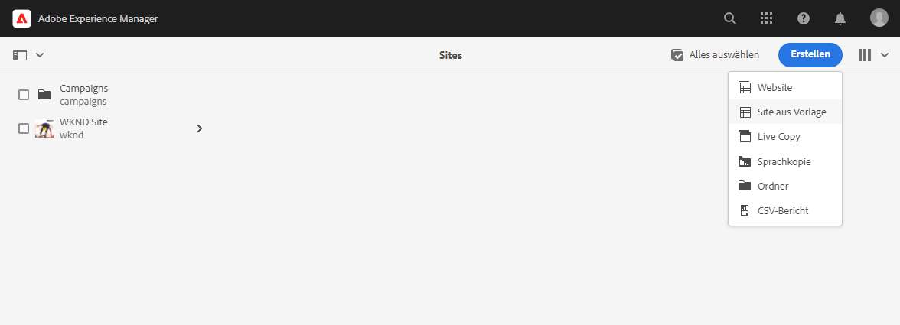
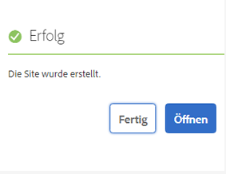
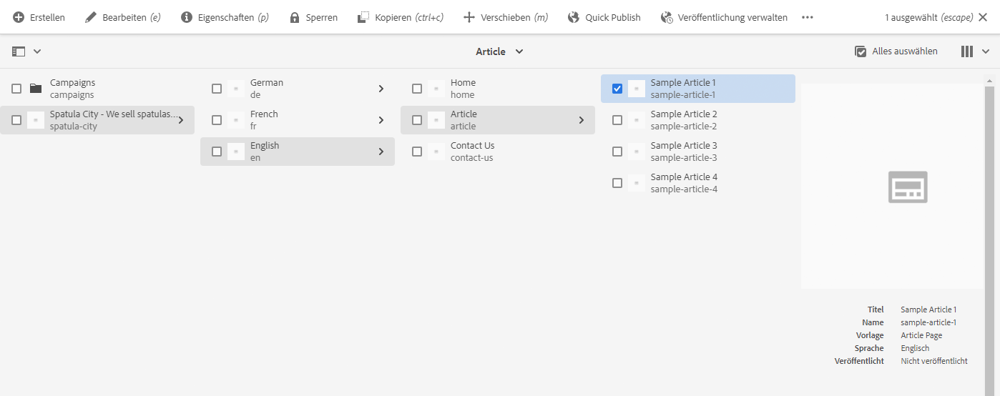

# Erstellen einer Site {#creating-site}

{{traditional-aem}}

Erfahren Sie, wie Sie mit AEM eine Site mithilfe von Site-Vorlagen erstellen, um den Stil und die Struktur Ihrer Site zu definieren.

## Übersicht {#overview}

Bevor Inhaltsautoren Seiten mit Inhalten erstellen können, muss die Site zuerst erstellt werden. Dies wird im Allgemeinen von einem AEM-Administrator durchgeführt, der die anfängliche Struktur der Site definiert. Die Verwendung von Site-Vorlagen ermöglicht eine schnelle und flexible Erstellung von Sites.

Mit dem AEM-Tool zur schnellen Site-Erstellung können auch Personen, die nicht in der Entwicklung tätig sind, mithilfe von Site-Vorlagen schnell eine Site von Grund auf erstellen.

Nach der Erstellung ermöglicht das Tool Quick Site Creation auch eine schnelle Anpassung des Designs und des Stils der AEM-Site (JavaScript, CSS und statische Ressourcen). Dadurch kann der Frontend-Entwickler, der keine Kenntnisse über AEM benötigt, getrennt und parallel zu den Erstellern von Inhalten arbeiten. Der AEM-Administrator lädt ganz einfach das Site-Design herunter und stellt es dem Frontend-Entwickler bereit, der es mithilfe seiner bevorzugten Tools anpasst und dann die Änderungen an das AEM Code-Repository übergibt, das dann bereitgestellt wird.

Dieses Dokument konzentriert sich auf die Erstellung von Sites mithilfe des Tools Quick Site Creation. Wenn Sie einen Überblick über den Site-Erstellungs- und -Anpassungs-Workflow erhalten möchten, lesen Sie die [Tour zur schnellen AEM-Site-Erstellung](/help/journey-sites/quick-site/overview.md)

## Planen der Site-Struktur {#structure}

Nehmen Sie sich Zeit, um den Zweck Ihrer Site und die geplanten Inhalte rechtzeitig im Voraus zu prüfen. Dadurch wird bestimmt, wie Sie die Struktur der Site entwerfen. Eine gute Site-Struktur unterstützt die einfache Navigation und Inhaltssuche für die Besucherinnen und Besucher Ihrer Site sowie verschiedene AEM-Funktionen wie [Multisite-Management und Übersetzung](/help/sites-cloud/administering/msm-and-translation.md).

>[!TIP]
>
>[Die WKND-Referenz-Website](https://wknd.site) bietet eine Best-Practice-Implementierung einer voll funktionsfähigen Website für Outdoor-Erlebnisse. Erkunden Sie sie, um zu sehen, wie eine gut aufgebaute AEM-Site strukturiert ist.

## Site-Vorlagen {#site-templates}

Da die Site-Struktur für den Erfolg einer Site so wichtig ist, ist es praktisch, vordefinierte Strukturen zur Verfügung zu haben, um schnell eine neue Site auf der Grundlage einer Reihe vorhandener Standards bereitzustellen. Site-Vorlagen bieten die Möglichkeit, grundlegende Site-Inhalte in einem handlichen und wiederverwendbaren Paket zu kombinieren.

Site-Vorlagen enthalten in der Regel grundlegende Site-Inhalte und -Struktur sowie Site-Styling-Informationen, um neue Sites schnell live schalten zu können. Vorlagen sind leistungsstark, da sie wiederverwendbar und anpassbar sind. Da in Ihrer AEM-Installation mehrere Vorlagen zur Verfügung stehen, können Sie verschiedene Sites erstellen, um unterschiedlichen geschäftlichen Anforderungen gerecht zu werden.

>[!TIP]
>
>Weitere Informationen zu Site-Vorlagen finden Sie unter [Site-Vorlagen](site-templates.md).

>[!NOTE]
>
>Die Site-Vorlage darf nicht mit Seitenvorlagen verwechselt werden. Site-Vorlagen definieren die Gesamtstruktur einer Site. Eine Seitenvorlage definiert die Struktur und den anfänglichen Inhalt einer einzelnen Seite.

## Erstellen einer Site {#create-site}

Die Verwendung einer Vorlage zum Erstellen einer Site ist einfach.

1. Melden Sie sich bei Ihrer AEM-Authoring-Umgebung an und navigieren Sie zur Sites-Konsole

   * `https://<your-author-environment>.adobeaemcloud.com/sites.html/content`

1. Wählen Sie oben rechts im Bildschirm die Option **Erstellen** und dann aus dem Dropdown-Menü die Option **Site aus Vorlage** aus.

   

1. Wählen Sie im Assistenten zur Site-Erstellung über das linke Bedienfeld eine vorhandene Vorlage oder oben in der linken Spalte die Option **Importieren** aus, um eine neue Vorlage zu importieren.

   

   1. Wenn Sie sich für den Import entschieden haben, suchen Sie im Datei-Browser die gewünschte Vorlage und wählen Sie **Hochladen** aus.

   1. Nach dem Hochladen wird sie in der Liste der verfügbaren Vorlagen angezeigt.

1. Bei der Auswahl einer Vorlage werden Informationen zur Vorlage in der rechten Spalte angezeigt. Wählen Sie bei ausgewählter Vorlage die Option **Weiter** aus.

   

1. Geben Sie einen Titel für die Site ein. Der Name der Site kann angegeben oder aus dem Titel generiert werden, falls er weggelassen wird.

   * Der Titel der Site wird in der Titelleiste des Browsers angezeigt.
   * Der Site-Name wird Teil der URL.
   * Der Site-Name muss den [AEM-Konventionen zur Seitenbenennung](/help/sites-cloud/authoring/sites-console/organizing-pages.md#page-name-restrictions-and-best-practices) entsprechen.

1. Wählen Sie **Erstellen** aus. Die Site wird daraufhin anhand der Site-Vorlage erstellt.

   

1. Wählen Sie im angezeigten Bestätigungsdialogfeld **Fertig** aus.

   

1. In der Sites-Konsole ist die neue Site sichtbar. Sie kann zur Untersuchung ihrer grundlegenden Struktur, wie von der Vorlage definiert, navigiert werden.

   

Inhaltsautoren können jetzt mit der Bearbeitung beginnen!

## Site-Anpassung {#site-customization}

Wenn Ihre Site über die verfügbaren Vorlagen hinaus angepasst werden muss, stehen Ihnen verschiedene Optionen zur Verfügung.

* Wenn die Site-Struktur oder der anfängliche Inhalt angepasst werden muss, [kann die Site-Vorlage an Ihre Anforderungen angepasst werden](site-templates.md).
* Wenn der Site-Stil angepasst werden muss, [kann das Site-Design heruntergeladen und angepasst werden](/help/journey-sites/quick-site/overview.md).
* Wenn die Site-Funktionalität angepasst werden muss, [kann die Site vollständig angepasst werden](/help/implementing/developing/introduction/develop-wknd-tutorial.md).

Jede Anpassung sollte mit Unterstützung eines Entwicklungs-Teams vorgenommen werden.
