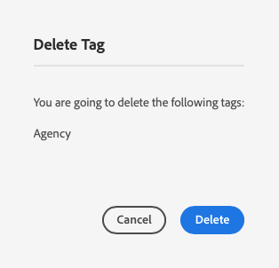
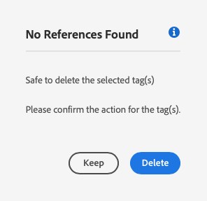

# Verwalten von Tags {#administering-tags}

Tags sind eine intuitive Methode zur Klassifizierung Ihrer Inhalte. Sie fungieren wie Schlüsselwörter oder Beschriftungen (Metadaten), mit denen Inhalte schneller gefunden werden können.

Bei Adobe Experience Manager (AEM) kann ein Tag die Eigenschaft sein von:

* Einem Inhaltsknoten für eine Seite
   * Weitere Informationen finden Sie im Dokument . [Verwenden von Tags](/help/sites-cloud/authoring/sites-console/tags.md).
* Einem Metadatenknoten für ein Asset
   * Weitere Informationen finden Sie im Dokument . [Verwalten von Metadaten für digitale Assets](/help/assets/manage-metadata.md).

>[!TIP]
>
>Es empfiehlt sich, die Anzahl der Tags zu minimieren, die sich auf dieselben Ideen beziehen. Beispielsweise benötigen Sie zur Verwaltung des Inhalts eines Lagers mit Outdoor-Produkten wahrscheinlich kein Tag für **Fußbekleidung** und ein anderes für **Schuhe**.

## Tag-Funktionen {#tag-features}

Tags bieten zuverlässige Funktionen zur Organisation und Verwaltung von Inhalten.

* Tags können in verschiedene Namespaces gruppiert werden.
   * Namespaces können als Hierarchien zur Erstellung von Taxonomien betrachtet werden.
   * Diese Taxonomien gelten für das gesamte AEM-System.
* Tags können von Autorinnen bzw. Autoren und Website-Besuchern verwendet werden.
* Unabhängig davon, wer die Tags erstellt hat, stehen alle Arten von Tags zur Verfügung, um sie einer Seite hinzuzufügen oder wenn man die Tags durchsucht.
* Tags werden von der [Listenkomponente](https://experienceleague.adobe.com/docs/experience-manager-core-components/using/wcm-components/list.html?lang=de) zum Generieren dynamischer Listen basierend auf den ausgewählten Tags verwendet.

## Tag-Voraussetzungen {#requirements}

Beim Erstellen und Verwalten von Tags sind einige technische Details zu beachten.

* Tags müssen innerhalb eines bestimmten Namespace eindeutig sein.
* Der Name eines Tags darf keine Tag-Trennzeichen enthalten:
   * Doppelpunkt (`:`) – Trennzeichen bei Namespace-Tags
   * Schrägstrich (`/`) – Trennzeichen bei untergeordneten Tags
* Wenn der Titel eines Tags Tag-Trennzeichen enthält, werden diese in der UI unterdrückt.
* Mitglieder der Gruppe `tag-administrators` und Mitglieder, die Bearbeitungsrechte für `/content/cq:tags` haben, können Tags erstellen und ihre Klassifikationsschemata ändern.
   * Ein Tag, das untergeordnete Tags enthält, bezeichnet man als Container-Tag.
   * Ein Tag, das kein Container-Tag ist, wird Leaf-Tag genannt.
   * Ein Tag-Namespace ist entweder ein Leaf-Tag oder ein Container-Tag.

Weitere technische Details zur Funktionsweise von Tags finden Sie unter [AEM-Tagging-Framework](/help/implementing/developing/introduction/tagging-framework.md).

## Tagging-Konsole {#tagging-console}

Über die Tagging-Konsole können Sie Tags und ihre Klassifikationsschemen erstellen und verwalten. Sie können die Tagging-Konsole wie folgt verwenden, um Ihre Tags wie folgt zu verwalten:

* Gruppieren in Namespaces.
* Überprüfen der Verwendung vorhandener Tags, bevor neue erstellt werden.
* Neuorganisation der Tags, ohne die Verbindung zwischen dem Tag und dem Inhalt, auf den aktuell verwiesen wird, zu trennen.

So greifen Sie auf die Tagging-Konsole zu:

1. Melden Sie sich bei der Authoring-Umgebung mit Administratorberechtigungen an.
1. Wählen Sie im globalen Navigationsmenü den Befehl **`Tools`** > **`General`** >
   **`Tagging`**.

## Erstellen neuer Tags {#creating-new-tags}

Es gibt mehrere Schritte zum Erstellen und Verwenden von Tags zum Organisieren Ihrer Inhalte.

1. [Erstellen Sie einen Namespace für Ihre Tags](#creating-namespaces) (oder wählen Sie einen vorhandenen, der wiederverwendet werden soll).
1. [Erstellen Sie ein neues Tag.](#creating-tags)
1. [Veröffentlichen Sie das Tag.](#publishing-tags)

### Erstellen von Namespaces {#creating-namespaces}

Ein Namespace wird zum Organisieren anderer Tags verwendet. Er kann als Tag der untersten Ebene betrachtet werden und wird normalerweise zum Gruppieren anderer Tags verwendet.

1. Um einen Namespace zu erstellen, öffnen Sie die [Tagging-Konsole](#tagging-console) und wählen Sie die Schaltfläche **Erstellen** in der Symbolleiste und dann **Namespace erstellen** aus.

   

1. Geben Sie die folgenden Informationen ein.

   * **Titel** – Ein Titel für den Namespace, der den Benutzenden in der Benutzeroberfläche angezeigt wird (optional)
   * **Name** – Wenn kein Name angegeben ist, wird ein gültiger Knotenname aus dem **Titel** erstellt. Weitere Informationen finden Sie im Dokument [AEM-Tagging-Framework](/help/implementing/developing/introduction/tagging-framework.md#tagid).
   * **Beschreibung** – Eine Beschreibung des Namespace (optional).

1. Wählen Sie nach Eingabe der erforderlichen Informationen die Option **Erstellen** aus.

Der Namespace wird erstellt. In der Tagging-Konsole befinden sich die Namespaces auf der niedrigsten Ebene (in der Spalte ganz links in der Konsole) und werden durch Ordnersymbole dargestellt, die ihre Art als „Container“ oder Gruppierung anderer Tags widerspiegeln.

Sie können in diesem Namespace jetzt [neue Tags erstellen](#creating-tags) oder [vorhandene Tags verwalten.](#managing-tags)

Ein Namespace darf keine Unter-Tags enthalten. Da ein Namespace selbst ein Tag ist, kann er wie jedes andere Tag zur Organisation Ihrer Inhalte verwendet werden. Um jedoch mit der Erstellung einer strukturierten Tagging-Taxonomie fortzufahren, können Sie in diesem Namespace basierend auf Ihren Projektanforderungen [Unter-Tags erstellen](#creating-tags).

### Erstellen von Tags {#creating-tags}

Tags werden im Allgemeinen zu Namespaces hinzugefügt.

1. Um ein Tag zu erstellen, öffnen Sie die [Tagging-Konsole.](#tagging-console)

1. Wählen Sie den Namespace aus, in dem Sie das Tag erstellen möchten. Oder wählen Sie ein anderes Tag aus, um ein untergeordnetes Tag darunter zu erstellen.

1. Wählen Sie die Schaltfläche **Erstellen** in der Symbolleiste und dann **Tag erstellen** aus.

1. Das Dialogfeld **Tag erstellen** wird geöffnet. Geben Sie die erforderlichen Informationen für das neue Tag an.

   * **Titel** – Ein Anzeigetitel für das Tag (erforderlich).
   * **Name** – Ein Name für das Tag (erforderlich). Wenn Sie keinen festlegen, wird ein gültiger Knotenname aus dem **Titel** erstellt. Siehe [TagID](/help/implementing/developing/introduction/tagging-framework.md#tagid).
   * **Beschreibung** – Eine Beschreibung des Tags.
   * **Tag-Pfad** – Die Standardeinstellung ist der Namespace (oder das Tag), den bzw. das Sie in der Tagging-Konsole ausgewählt haben. Dies kann manuell aktualisiert werden, indem Sie das Symbol für die Pfadauswahl auswählen.

   

1. Wählen Sie **Absenden**.

Das Tag wird erstellt und die Konsole wird aktualisiert, um das neue Tag anzuzeigen.

Tags ermöglichen die flexible Erstellung Ihrer eigenen Taxonomie entsprechend Ihren organisatorischen Anforderungen.

* Sie können Tags erstellen, die vorhandenen Tags untergeordnet sind, indem Sie in der Konsole das übergeordnete Tag auswählen, bevor Sie das neue Tag erstellen.
* Wenn Sie ein Tag erstellen, ohne einen Namespace oder ein anderes Tag auszuwählen, erstellen Sie effektiv einen Namespace.

### Veröffentlichen von Tags {#publishing-tags}

Genau wie beim Erstellen anderer Inhalte in AEM existiert dieser nur in der Authoring-Umgebung, nachdem Sie ein Tag (oder einen Namespace) erstellt haben. Damit Ihre Tags Ihren Benutzenden zur Verfügung stehen, müssen Sie die Tags veröffentlichen.

1. Um ein Tag zu veröffentlichen, öffnen Sie die [Tagging-Konsole](#tagging-console).

1. Wählen Sie die Tags aus, die Sie veröffentlichen möchten, und wählen Sie in der Symbolleiste **Veröffentlichen** aus.

   

1. Im Dialogfeld **Veröffentlichungs-Tag** werden Sie aufgefordert, die Veröffentlichung der ausgewählten Tags zu bestätigen. Wählen Sie **Veröffentlichen** aus.

   

1. Die Veröffentlichungsaktion wird mit einem Dialogfeld **Erfolgreich** bestätigt.

   

Die ausgewählten Tags werden zur Veröffentlichung in die Warteschlange gestellt. Ähnlich wie Seiteninhalte werden nur die ausgewählten Tags veröffentlicht, unabhängig davon, ob sie Unter-Tags aufweisen oder nicht.

Um eine vollständige Taxonomie (einen Namespace und untergeordnete Tags) zu veröffentlichen, empfehlen wir, ein [Paket](/help/implementing/developing/tools/package-manager.md) des Namespace zu erstellen (siehe [Taxonomie-Stammknoten](/help/implementing/developing/introduction/tagging-framework.md#taxonomy-root-node)).

<!--
Be sure to [apply permissions](#setting-tag-permissions) to the namespace before creating the package.
-->

## Verwalten von Tags {#managing-tags}

Es gibt verschiedene Aktionen, die Sie zum Verwalten und Organisieren vorhandener Tags und Namespaces ausführen können. Wählen Sie in der [Tagging-Konsole](#tagging-console) einfach ein Tag oder einen Namespace aus, um die verfügbaren Aktionen in der Symbolleiste anzuzeigen.

* [Eigenschaften anzeigen](#viewing-tag-properties)
* [Bearbeiten](#editing-tags)
* [Veröffentlichung aufheben](#unpublishing-tags)
* [Verweise](#viewing-tag-references)
* [Verschieben](#moving-tags)
* [Zusammenführen](#merging-tags)
* [Löschen](#deleting-tags)

Zusätzliche Optionen sind hinter dem Symbol mit den Auslassungspunkten verfügbar, wenn in der Symbolleiste nicht genügend Platz vorhanden ist.

### Anzeigen der Tag-Eigenschaften {#viewing-tag-properties}

Wenn ein einzelnes Tag, ein einzelner Namespace oder ein anderes Tag in der Tagging-Konsole ausgewählt ist, werden in der Spalte links neben der Tag-Spalte grundlegende Details zum ausgewählten Tag angezeigt, z. B. der Zeitpunkt der letzten Bearbeitung und Veröffentlichung.

Sie können weitere Details zum Tag anzeigen, darunter wer die letzte Veröffentlichung durchgeführt hat und wann, indem Sie in die Ansicht **Eigenschaften** der Konsole wechseln.

1. Um die Eigenschaften eines Tags anzuzeigen, öffnen Sie die [Tagging-Konsole](#tagging-console).

1. Wählen Sie das Tag, dessen Eigenschaften angezeigt werden sollen, und dann in der linken Leiste die Option **Eigenschaften** aus.

   

1. Die detaillierten Eigenschaften des ausgewählten Tags werden in der linken Leiste angezeigt.

   

Weitere Informationen zum Auswählen der Anzeigemodi und Leiste finden Sie unter [Grundlegende Handhabung](/help/sites-cloud/authoring/basic-handling.md#rail-selector).

### Bearbeiten von Tags {#editing-tags}

Tags und Namespaces können nach dem Erstellen bearbeitet werden.

1. Um ein Tag zu bearbeiten, öffnen Sie die [Tagging-Konsole](#tagging-console).

1. Wählen Sie das zu bearbeitende Tag und dann in der Symbolleiste die Option **Bearbeiten** aus.

1. Nehmen Sie die gewünschten Änderungen vor. Folgendes kann geändert werden:

   * **Titel**
   * **Beschreibung**
   * [**Lokalisierung**](#managing-tags-in-different-languages)

1. Wenn Sie die Änderungen vorgenommen haben, wählen Sie die Option **Absenden** aus.

Detaillierte Informationen zum Hinzufügen von Übersetzungen finden Sie im Abschnitt [Verwalten von Tags in verschiedenen Sprachen](#managing-tags-in-different-languages).

Wenn die von Ihnen vorgenommenen Änderungen an einem bereits veröffentlichten Tag vorgenommen wurden, sollten Sie [es erneut veröffentlichen](#publishing-tags).

### Rückgängigmachen der Veröffentlichung {#unpublishing-tags}

Um das Tag in Ihrer Autoreninstanz zu deaktivieren und es aus Ihrer Veröffentlichungsinstanz zu entfernen, können Sie seine Veröffentlichung aufheben.

1. Um die Veröffentlichung eines Tags aufzuheben, öffnen Sie die [Tagging-Konsole](#tagging-console).

1. Wählen Sie die Tags, deren Veröffentlichung aufgehoben werden soll, und dann in der Symbolleiste die Option **Veröffentlichung aufheben** aus.

   

1. Über das Dialogfeld zum **Aufheben der Tag-Veröffentlichung** werden Sie aufgefordert, den Vorgang für die ausgewählten Tags zu bestätigen. Wählen Sie **Veröffentlichung aufheben** aus.

   

1. Die Aktion zum Aufheben der Veröffentlichung wird mit einem Dialogfeld **Erfolg** bestätigt.

   

Die ausgewählten Tags werden zum Aufheben der Veröffentlichung in die Warteschlange gestellt. Wenn es sich bei dem ausgewählten Tag um ein Container-Tag handelt, werden auch alle zugehörigen untergeordneten Tags in der Autorenumgebung deaktiviert und aus der Veröffentlichungsumgebung entfernt.

### Anzeigen von Tag-Verweisen {#viewing-tag-references}

Es kann nützlich sein, zu sehen, auf welchen Inhalt ein bestimmtes Tag angewendet wird. Verwenden Sie dazu die Ansicht **Verweise** in der Tagging-Konsole.

1. Um die Verweise eines Tags anzuzeigen, öffnen Sie die [Tagging-Konsole](#tagging-console).

1. Wählen Sie das Tag, deren Verweise angezeigt werden sollen, und dann in der linken Leiste die Option **Verweise** aus.

   

1. Die Gesamtzahl der Verweise für das ausgewählte Tag wird in der linken Leiste angezeigt.

   

1. Wählen Sie die Anzahl der Tag-Verweise aus, um eine detaillierte Liste der dem Tag zugewiesenen Inhalte anzuzeigen.

   

Bewegen Sie den Mauszeiger über einen verweisenden Inhalt in der Liste oder wählen Sie ihn aus, um den vollständigen Inhaltspfad anzuzeigen.

Weitere Informationen zum Auswählen der Anzeigemodi und über die Leiste finden Sie unter [Grundlegende Handhabung](/help/sites-cloud/authoring/basic-handling.md#rail-selector).

### Verschieben von Tags {#moving-tags}

Es kann erforderlich sein, Ihre Tagging-Taxonomie zu bereinigen oder anderweitig neu zu organisieren, indem ein Tag an einen neuen Speicherort verschoben oder umbenannt wird.

>[!TIP]
>
>Es ist Best Practice, dass nur Admins Tags verschieben und umbenennen dürfen.

1. Um ein Tag zu verschieben oder umzubenennen, öffnen Sie die [Tagging-Konsole](#tagging-console).

1. Wählen Sie das zu verschiebende oder umzubenennende Tag und dann in der Symbolleiste die Option **Verschieben** aus.

1. Geben Sie im Dialogfeld **Tag verschieben** an, welche Eigenschaft geändert werden soll.

   * **Umbenennen in**: Der neue Name, der dem Tag gegeben werden soll.
      * Dieses Feld wird mit dem aktuellen Namen des Tags vorausgefüllt.
      * Ändern Sie nichts, wenn das Tag nur verschoben, aber nicht umbenannt werden soll.
   * **Verschieben nach**: Der Speicherort, an den das Tag verschoben werden soll.
      * Dieses Feld wird mit dem aktuellen Speicherort des Tags vorausgefüllt.
      * Ändern Sie nichts, wenn das Tag nur umbenannt, aber nicht verschoben werden soll.

   

1. Wählen Sie **Absenden**.

Das Tag wird umbenannt und/oder an seinen neuen Speicherort verschoben. Wenn es sich bei dem ausgewählten Tag um ein Container-Tag handelt, werden beim Verschieben auch die untergeordneten Tags verschoben.

### Zusammenführen von Tags {#merging-tags}

Wenn Ihre Tagging-Taxonomie Duplikate oder ähnliche Tags aufweist, kann es nützlich sein, diese Tags zusammenzuführen. Wenn Tag `A` mit Tag `B` zusammengeführt wird, werden alle mit Tag `A` gekennzeichneten Seiten mit Tag `B` gekennzeichnet, und Tag `A` steht Autorinnen und Autoren nicht mehr zur Verfügung.

1. Um zwei Tags zusammenzuführen, öffnen Sie die [Tagging-Konsole](#tagging-console).

1. Wählen Sie das Tag, das mit einem anderen Tag zusammengeführt werden soll, und dann in der Symbolleiste die Option **Zusammenführen** aus.

1. Wählen Sie im Dialogfeld **Tag zusammenführen** das Symbol **Durchsuchen** des Felds **Zusammenführen in** aus, um anzugeben, mit welchem Tag das ausgewählte Tag zusammengeführt werden soll.

   

1. Wählen Sie **Absenden**.

Das in der Konsole ausgewählte Tag wird mit dem im Dialogfeld angegebenen Tag zusammengeführt. Wenn ein referenziertes Tag verschoben oder zusammengeführt wird, wird es nicht physisch gelöscht, sodass Verweise beibehalten werden können. Weitere Informationen finden Sie unter [AEM-Tagging-Framework](/help/implementing/developing/introduction/tagging-framework.md#moving-and-merging-tags).

### Löschen von Tags {#deleting-tags}

Wenn sich Ihre Tagging-Taxonomie ändert und ein Tag oder Namespace nicht mehr benötigt wird, kann das Tag bzw. der Namespace gelöscht werden.

1. Um ein Tag zu löschen, öffnen Sie die [Tagging-Konsole](#tagging-console).

1. Wählen Sie das zu löschende Tag und dann in der Symbolleiste die Option **Löschen** aus.

1. Über das Dialogfeld **Tag löschen** werden Sie aufgefordert, den Löschvorgang für das ausgewählte Tag zu bestätigen. Wählen Sie **Löschen** aus.

   

1. AEM stellt anhand einer entsprechenden Prüfung sicher, dass nicht auf das Tag verwiesen wird.

   1. Wenn keine Verweise gefunden werden, fordert AEM zur endgültigen Bestätigung des Löschvorgangs auf. Wählen Sie **Löschen** aus

      

   1. Wenn Verweise gefunden werden, präsentiert AEM diese und fordert zur endgültigen Bestätigung des Löschvorgangs auf.

      

Das ausgewählte Tag wird gelöscht und dauerhaft aus der Autorenumgebung entfernt. Wenn das Tag veröffentlicht war, wird es auch aus der Veröffentlichungsumgebung entfernt. Wenn es sich bei dem ausgewählten Tag um ein Container-Tag handelt, werden alle zugehörigen untergeordneten Tags ebenfalls entfernt.

<!--

## Setting Tag Permissions {#setting-tag-permissions}

Tag permissions are ['secure (by default)'](/help/sites-administering/production-ready.md); a best practice for the publish environment that requires read permission to be explicitly allowed for tags. Bascially, this is done by creating a package of the Tag Namespace after permissions have been set on author, and installing the package on all publish instances.

* on author instance

    * sign in with administrative privileges
    * access the [Security Console](/help/sites-administering/security.md#accessing-user-administration-with-the-security-console),

        * for example, browse to http://localhost:4502/useradmin

    * in the left pane, select the group (or user) for which [read permission](/help/sites-administering/security.md#permissions) is to be granted
    * in the right pane, locate the **Path **to the Tag Namespace

        * for example, `/content/cq:tags/mycommunity`

    * select the `checkbox`in the **Read** column
    * select **Save**

* ensure all publish instances have same permissions

    * one approach is to [create a package](/help/sites-administering/package-manager.md#package-manager) of the namespace on author

        * on `Advanced` tab, for `AC Handling` select `Overwrite`

    * replicate the package

        * choose `Replicate` from package manager

-->

## Verwalten von Tags in verschiedenen Sprachen {#managing-tags-in-different-languages}

Die Eigenschaft `title` eines Tags kann in verschiedene Sprachen übersetzt werden. Nach der Übersetzung kann der entsprechende Tag-Titel entsprechend der Benutzer- oder Inhaltssprache angezeigt werden.

Angenommen, das Tag `Animals` soll ins Deutsche und Französische übersetzt werden.

1. Öffnen Sie die [Tagging-Konsole](#tagging-console).

1. Wählen Sie das zu übersetzende Tag und dann in der Symbolleiste die Option **Bearbeiten** aus.

1. Wählen Sie im Dialogfeld **Tag bearbeiten** in der Spalte **Lokalisierung** die Zielsprache aus, z. B. Deutsch.

1. Geben Sie im angezeigten Feld **Deutsch** den übersetzten Titel an.

1. Wiederholen Sie die beiden vorherigen Schritte für Französisch.

   

1. Wählen Sie **Absenden**.

Für Inhaltsseiten wird die Sprache für das Tag entsprechend der Sprache der Seite ausgewählt, sofern vorhanden.

In der Authoring-Umgebung verwendet AEM jedoch die benutzerseitige Spracheinstellung. Für Benutzende, die in den Benutzereigenschaften Französisch als Sprache festgelegt haben, wird `Animaux` für das Tag `Animals` in der Tagging-Konsole angezeigt.

Informationen zum Hinzufügen einer neuen Sprache zum Dialogfeld finden Sie im Dokument [Einbinden von Tagging in AEM-Anwendungen](/help/implementing/developing/introduction/tagging-applications.md#adding-a-new-language-to-the-edit-tag-dialog).

>[!TIP]
>
>Weitere Informationen zu AEM-Lokalisierungsfunktionen finden Sie unter [Übersetzen von Inhalten für mehrsprachige Sites](/help/sites-cloud/administering/translation/overview.md).
