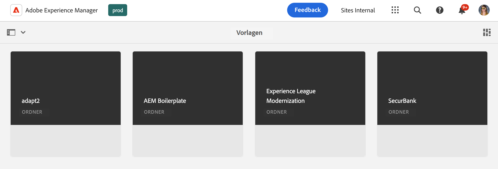

# Die Vorlagenkonsole {#templates-console}

Erfahren Sie, wie die Vorlagenkonsole als zentraler Speicherort zum Anzeigen und Verwalten Ihrer Seitenvorlagen dient.

## Überblick {#overview}

Wenn Sie eine Seite erstellen, müssen Sie eine Vorlage auswählen. Die Seitenvorlage wird als Basis für die neue Seite genutzt. [Bearbeitbare Vorlagen von AEM](/help/implementing/developing/components/templates.md) können die Struktur der resultierenden Seite, jeden anfänglichen Inhalt und die Komponenten definieren, die verwendet werden können (Design-Eigenschaften).

Inhaltsautoren werden eine Auswahl verfügbarer Vorlagen angezeigt, wenn sie [neue Seiten in der Sites-Konsole erstellen](/help/sites-cloud/authoring/sites-console/creating-pages.md). Vorlagen können verwendet werden, um Seiten zu erstellen, die bearbeitet werden können mit:

* [Der Seiteneditor](/help/sites-cloud/authoring/page-editor/templates.md) oder
* [Der universelle Editor](/help/sites-cloud/authoring/universal-editor/templates.md)

Die Vorlagenkonsole ermöglicht es einem Administrator, alle Seitenvorlagen an einem zentralen Ort anzuzeigen und zu verwalten.

## Zugriff auf die Vorlagenkonsole {#accessing}

1. Melden Sie sich bei AEM as a Cloud Service an.
1. Öffnen Sie die globale Navigation und wählen Sie das Bedienfeld **Tools** und dann **Allgemein** -> **Vorlagen**.

## Ausrichtung {#orientation}

Die Vorlagenkonsole ist in Ordner mit einem Ordner pro [Konfiguration) unterteilt](/help/implementing/developing/introduction/configurations.md) in dem bearbeitbare Vorlagen für die Konfiguration aktiviert wurden.

[Die Standardansicht](/help/sites-cloud/authoring/quick-start.md) der Konsole ist die Kartenansicht. Tippen oder klicken Sie auf einen Ordner, um dessen Inhalt zu untersuchen.

Wählen Sie eine Vorlage aus, um die in der Symbolleiste verfügbaren Optionen anzuzeigen.

* [Bearbeiten](#edit-edit)
* [Eigenschaften](#properties)
* [Deaktivieren/Aktivieren](#enable-disable)
* [Veröffentlichen](#publish)
* [Kopieren](#copy)
* [Löschen](#delete)

## Bearbeiten {#edit}

Durch Bearbeiten einer Vorlage wird der Editor geöffnet, mit dem die Vorlage erstellt wurde. Sie haben folgende Möglichkeiten:

* [Der Vorlageneditor](/help/sites-cloud/authoring/page-editor/templates.md)
* [Der universelle Editor](/help/sites-cloud/authoring/universal-editor/templates.md)

Mit dem entsprechenden Editor können Sie die erforderlichen Änderungen an der Vorlage vornehmen. Beachten Sie, dass sich die Bearbeitung einer verwendeten Vorlage auf Ihre Autoren auswirken kann.

* Bei Vorlagen, die mit dem Vorlageneditor erstellt wurden, können Änderungen Live-Seiten betreffen, die auf der ausgewählten Vorlage basieren.
* Bei Vorlagen, die mit dem universellen Editor erstellt wurden, wirken sich Änderungen nur auf neue Seiten aus, die Ihre Autoren basierend auf der ausgewählten Vorlage erstellen.

Wenn ein Autor eine Vorlage erstellt, die mit dem bereits aktivierten Vorlageneditor erstellt wurde, wird eine Warnung angezeigt.

>[!TIP]
>
>Nachdem Sie eine Vorlage in der Konsole ausgewählt haben, verwenden Sie den Hotkey-`e`, um die ausgewählte Vorlage zu bearbeiten.

## Eigenschaften {#properties}

Sie können die [Eigenschaften der Vorlage](/help/sites-cloud/authoring/page-editor/templates.md) ähnlich wie die folgenden bearbeiten [Seiteneigenschaften bearbeiten](/help/sites-cloud/authoring/sites-console/page-properties.md).Vorlageneigenschaften enthalten:

* Vorlagentitel
* Beschreibung
* Bild

>[!TIP]
>
>Nachdem Sie eine Vorlage in der Konsole ausgewählt haben, können Sie die Eigenschaften der ausgewählten Vorlage mit dem Hotkey `p` öffnen.

## Aktivieren und Deaktivieren {#enable-disable}

Eine Vorlage kann einen von drei Status haben:

* **Entwurf** - Die Vorlage wird noch erstellt und steht für das Erstellen neuer Seiten nicht zur Verfügung.
* **Aktiviert** - Die Vorlage ist vollständig und zum Erstellen neuer Seiten verfügbar.
* **Deaktiviert** - Die Vorlage ist abgeschlossen, aber für das Erstellen neuer Seiten nicht verfügbar.

Wenn eine Vorlage erstellt wird, befindet sie sich standardmäßig entweder im Status **Entwurf** (für Vorlagen, die mit dem [Vorlageneditor](/help/sites-cloud/authoring/page-editor/templates.md) erstellt wurden) oder **Aktiviert** (für Vorlagen, die mit dem [universellen Editor](/help/sites-cloud/authoring/universal-editor/templates.md) erstellt wurden).

Eine Vorlage muss aktiviert sein, damit sie von Inhaltsautoren zum Erstellen von Seiten verwendet werden kann. Wenn eine Vorlage nicht mehr benötigt wird, kann sie deaktiviert werden, sodass sie nicht mehr im Seitenerstellungsassistenten angezeigt wird.

* Wählen Sie die Vorlage aus und klicken Sie auf **Deaktivieren**, um die Vorlage zu deaktivieren.
* Wählen Sie die Vorlage aus und klicken Sie auf **Aktivieren**, um die Vorlage zu aktivieren.

## Veröffentlichung {#publish}

Eine mit dem Vorlageneditor erstellte Vorlage kann erst nach ihrer Veröffentlichung verwendet werden. Wählen Sie die Vorlage aus und klicken Sie auf **Veröffentlichen**, um sie zu veröffentlichen.

Mit dem universellen Editor erstellte Vorlagen müssen nicht veröffentlicht werden, damit sie verwendet werden können.

## Wird kopiert {#copy}

Wenn Sie über eine Anzahl von Seiten verfügen, die eine ähnliche Struktur aufweisen, können Sie die Schaltfläche **Kopieren** verwenden, um einen Bereich einer Vorlage zu erstellen und die Kopie dann je nach Bedarf zu variieren. Dies ist auch nützlich, wenn Sie eine Vorlage auf einer anderen Site verwenden möchten.

1. Wählen Sie die Vorlage aus und tippen oder klicken Sie auf **Kopieren**, um eine Kopie zu erstellen.
1. Navigieren Sie zu der Stelle, an der Sie die Kopie erstellen möchten.
1. Tippen oder klicken Sie auf **Einfügen** in der Symbolleiste.

Nach dem Einfügen können Sie:

* [Bearbeiten Sie die Vorlage](#edit) um sie nach Bedarf anzupassen.
* [Verwenden Sie das Fenster „Eigenschaften](#properties), um den Vorlagentitel zu aktualisieren.
* [Aktivieren Sie die ](#enable-disable), damit sie zum Erstellen der Seite verwendet werden kann.
* [Veröffentlichen Sie bei ](#publish) die Vorlage.

>[!TIP]
>
>Nachdem Sie eine Vorlage in der Konsole ausgewählt haben, verwenden Sie den Hotkey-`Command+c` oder die `ctrl+c` , um die ausgewählte Vorlage zu kopieren.

## Wird gelöscht {#delete}

Wenn eine Vorlage nicht mehr benötigt wird, kann sie gelöscht werden, sofern sie nicht von Seiten referenziert wird.

Wählen Sie die Vorlage aus und tippen oder klicken Sie auf **Löschen** um sie zu löschen.

>[!TIP]
>
>Nachdem Sie eine Vorlage in der Konsole ausgewählt haben, können Sie die ausgewählte Vorlage mit dem Hotkey-`Backspace` löschen.

## Erstellen von Vorlagen {#create}

Verwenden Sie die **Erstellen** in der Konsole, um eine neue Vorlage an Ihrem aktuellen Speicherort zu erstellen. Weitere Informationen zum Erstellen einer Vorlage finden Sie im Dokument [Vorlagen zum Erstellen von Seiten, die mit dem Seiteneditor bearbeitet werden können](/help/sites-cloud/authoring/page-editor/templates.md).

Die **Erstellen**-Schaltfläche wird nur verwendet, um Vorlagen zu erstellen, die mit dem Seiteneditor bearbeitet werden können. Weitere Informationen zum Erstellen [ Vorlagen auf der Grundlage von Seiten, die mit dem universellen Editor erstellt wurden, finden Sie ](/help/sites-cloud/authoring/universal-editor/templates.md) Dokument „Vorlagen zum Erstellen von Seiten, die mit dem universellen Editor bearbeitet werden können“.
