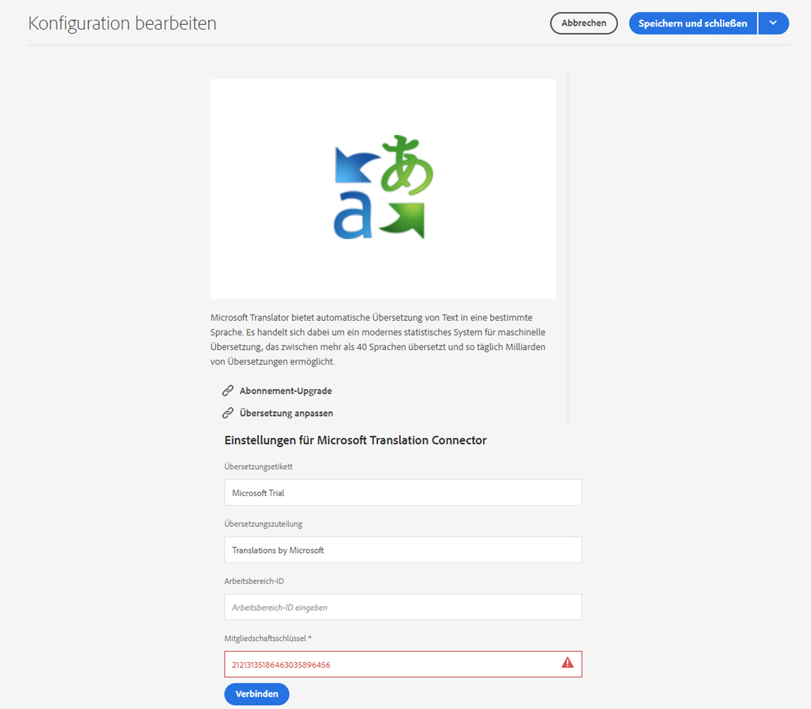

# Herstellen einer Verbindung mit Microsoft Translator {#connecting-to-microsoft-translator}

Erstellen Sie eine Konfiguration für den Cloud-Dienst [Microsoft Translator](https://hub.microsofttranslator.com), um Ihr Microsoft Translation-Konto für die Übersetzung von AEM Seiteninhalten, Community-Inhalten oder Assets zu verwenden.

| Eigenschaft | Beschreibung |
|---|---|
| Übersetzungsetikett | Der Anzeigename für den Übersetzungsdienst |
| Übersetzungszuteilung | (Optional) Bei benutzergenerierten Inhalten wird die Zuordnung neben dem übersetzten Text angezeigt, z. B. `Translations by Microsoft` |
| Workspace-ID | (Optional) Die ID Ihrer angepassten Microsoft Translator-Engine, die verwendet werden soll |
| Mitgliedschaftsschlüssel | Ihr Mitgliedschaftsschlüssel für Microsoft Translator |

Nachdem Sie die Konfiguration erstellt haben, müssen Sie [sie aktivieren](#activating-the-translator-service-configurations).

Im folgenden Verfahren wird eine Microsoft Translator-Konfiguration erstellt.

1. Klicken Sie im Navigationsbereich [auf oder tippen Sie auf **Tools** -> **Cloud Services** -> **Übersetzungsserver**.](/help/sites-cloud/authoring/getting-started/basic-handling.md#first-steps)
1. Navigieren Sie zu der Stelle, an der Sie die Konfiguration erstellen möchten. Normalerweise befindet sich dies in Ihrem Site-Stammordner oder kann eine globale Standardkonfiguration sein.
1. Tippen oder klicken Sie auf die Schaltfläche **Erstellen**.
1. Definieren Sie Ihre Konfiguration.
   1. Wählen Sie **Microsoft Translator** in der Dropdownliste aus.
   1. Geben Sie einen Titel für Ihre Konfiguration ein. Mit dem Titel wird die Konfiguration auf der Cloud-Services-Konsole und in Dropdown-Listen mit den Seiteneigenschaften identifiziert.
   1. Geben Sie optional einen Namen für den Repository-Knoten ein, auf dem die Konfiguration gespeichert wird.

   

1. Klicken Sie auf **Erstellen**.
1. Geben Sie im Fenster **Konfiguration bearbeiten** die Werte für den in der vorherigen Tabelle beschriebenen Übersetzungsdienst ein.

   

1. Tippen oder klicken Sie auf **Verbinden**, um die Verbindung zu überprüfen.
1. Tippen oder klicken Sie auf **Speichern und schließen**.

## Durchführen eines Upgrades für die Konfiguration „Microsoft Translator-Testlizenz“{#upgrading-the-microsoft-translator-trial-license-configuration}

Die Seiten der Microsoft Translation-Konfiguration enthalten einen direkten Link zur Microsoft-Website, über den Sie ein für Produktionssysteme geeignetes Kontoabonnement erhalten können.

1. Tippen Sie im Navigationsbereich [auf ](/help/sites-cloud/authoring/getting-started/basic-handling.md#first-steps) oder klicken Sie auf **Tools** -> **Cloud Services** -> **Übersetzungsserver**.
1. Tippen oder klicken Sie auf Ihre vorhandene Microsoft Translator-Konfiguration.
1. Tippen oder klicken Sie auf **Bearbeiten**.
1. Tippen oder klicken Sie im Fenster **Konfiguration bearbeiten** auf **Abonnement aktualisieren**. Eine Microsoft-Webseite mit weiteren Details zum Dienst wird geöffnet.

## Anpassen der Microsoft Translator-Engine {#customizing-your-microsoft-translator-engine}

Die Seiten der Microsoft Translation-Konfiguration enthalten einen direkten Link zur Microsoft-Website, auf der die Microsoft Translator-Engine angepasst werden kann.

1. Tippen Sie im Navigationsbereich [auf ](/help/sites-cloud/authoring/getting-started/basic-handling.md#first-steps) oder klicken Sie auf **Tools** -> **Cloud Services** -> **Übersetzungsserver**.
1. Tippen oder klicken Sie auf Ihre vorhandene Microsoft Translator-Konfiguration.
1. Tippen oder klicken Sie auf **Bearbeiten**.
1. Tippen oder klicken Sie im Fenster **Konfiguration bearbeiten** auf **Übersetzer anpassen**. Verwenden Sie die Microsoft-Webseite, die geöffnet wird, um Ihren Dienst anzupassen.

## Aktivieren der Übersetzungsdienstkonfigurationen {#activating-the-translator-service-configurations}

Sie müssen Ihre Cloud Service-Konfigurationen aktivieren, um übersetzte Inhalte zu unterstützen, die auf der Veröffentlichungsinstanz repliziert werden. Verwenden Sie die Methode [Veröffentlichen eines Baums](/help/sites-cloud/authoring/fundamentals/publishing-pages.md#publishing-and-unpublishing-a-tree), um die Repository-Knoten zu aktivieren, die die Microsoft Translator-Konfigurationen speichern. Die Knoten befinden sich unter den folgenden übergeordneten Knoten:

* `/libs/settings/cloudconfigs/translation/msft-translation`
