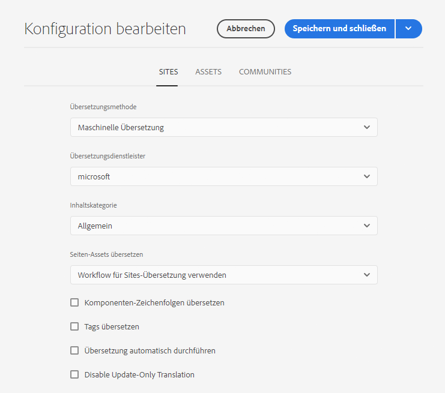
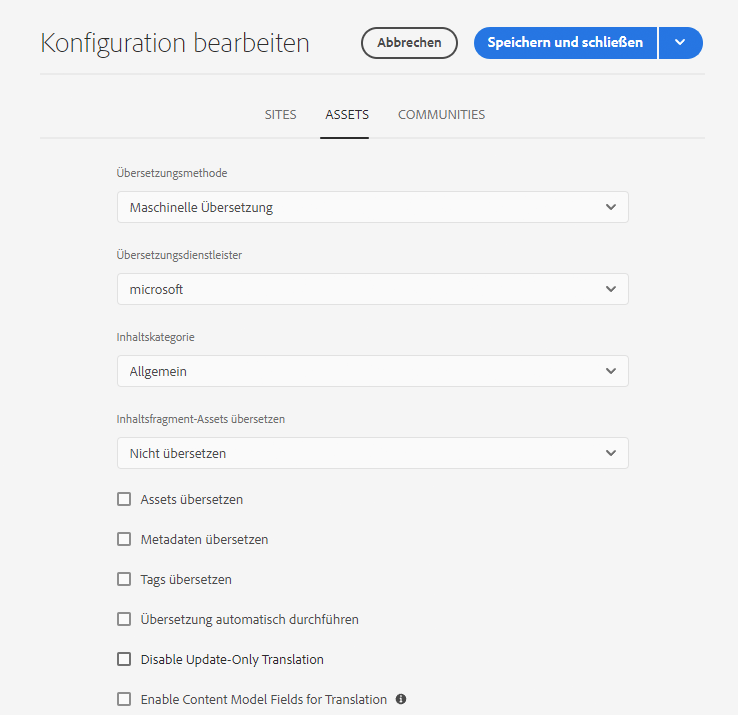

# Konfigurieren des Frameworks für die Übersetzungsintegration {#configuring-the-translation-integration-framework}

Das Framework für die Übersetzungsintegration integriert Übersetzungsdienstleistungen von Drittanbietern, um die Übersetzung von AEM-Inhalten zu orchestrieren. Dies umfasst drei grundlegende Schritte.

1. [Verbinden Sie sich mit Ihrem Übersetzungsdienstleister](#connecting-to-a-translation-service-provider).
1. [Erstellen Sie eine Framework-Konfiguration für die Übersetzungsintegration](#creating-a-translation-integration-configuration).
1. [Verknüpfen Sie die Cloud-Konfigurationen mit Ihren Seiten](#configuring-pages-for-translation).

Einen Überblick über die Funktionen zur Übersetzung von Inhalten in AEM erhalten Sie unter [Übersetzen von Inhalten für mehrsprachige Sites](overview.md).

>[!TIP]
>
>Wenn Sie mit der Übersetzung von Inhalten noch nicht vertraut sind, durchlaufen Sie unsere [Sites-Übersetzungs-Tour](/help/journey-sites/translation/overview.md), die Sie durch die Übersetzung Ihrer AEM Sites-Inhalte mithilfe der leistungsstarken Übersetzungs-Tools von AEM führt und ideal für alle ist, die noch keine Erfahrung mit AEM oder Übersetzungen haben.

## Herstellen einer Verbindung zu einem Übersetzungsdienstleister {#connecting-to-a-translation-service-provider}

Erstellen Sie eine Cloud-Konfiguration, die AEM an Ihren Übersetzungsdienstleister anbindet.

AEM enthält die Funktion, standardmäßig eine [Verbindung zu Microsoft® Translator herzustellen](connect-ms-translator.md). Weitere Übersetzungstechnologieanbieter mit AEM-Connectoren, die dem Adobe Exchange-Partnerprogramm angehören, finden Sie [hier](https://exchange.adobe.com/apps/browse/ec?page=1&amp;partnerLevel=All&amp;product=AEM&amp;q=experience+manager+translation&amp;sort=RELEVANCE).

Wenn Sie ein Connector-Paket installiert haben, können Sie eine Cloud-Konfiguration für den Connector erstellen. In der Regel müssen Sie Ihre Anmeldedaten für die Authentifizierung beim Übersetzungs-Service angeben. Weitere Informationen zum Hinzufügen einer Cloud-Konfiguration für den Microsoft® Translator-Connector finden Sie unter [Integrieren mit Microsoft® Translator](connect-ms-translator.md).

Sie können mehrere Cloud-Konfigurationen für denselben Connector erstellen, falls erforderlich. Beispielsweise können Sie eine Konfiguration für jedes Konto oder Projekt erstellen, das Sie bei einem Anbieter haben.

Nach der Konfiguration einer Verbindung können Sie die Framework-Konfiguration für die Übersetzungsintegration erstellen, von der diese Verbindung genutzt wird.

## Erstellen einer Konfiguration für die Übersetzungsintegration {#creating-a-translation-integration-configuration}

Erstellen Sie eine Framework-Konfiguration für die Übersetzungsintegration, um festzulegen, wie Ihre Inhalte übersetzt werden sollen. Die Konfiguration enthält die folgenden Informationen:

* welcher Übersetzungsanbieter eingesetzt werden soll
* ob eine menschliche oder maschinelle Übersetzung erfolgen soll
* ob andere Inhalte, die mit einer Seite oder einem Asset verknüpft sind, z. B. Tags, übersetzt werden sollen

Nachdem Sie eine Framework-Konfiguration erstellt haben, verknüpfen Sie die Cloud-Konfiguration mit den Seiten, die Sie gemäß der Konfiguration übersetzen möchten. Wenn der Übersetzungsvorgang gestartet wird, geht der Übersetzungsworkflow entsprechend der verknüpften Framework-Konfiguration vor.

Wenn für verschiedene Bereiche Ihrer Website unterschiedliche Übersetzungsanforderungen vorliegen, erstellen Sie entsprechend mehrere Framework-Konfigurationen. Beispielsweise enthält eine mehrsprachige Website möglicherweise deutsche, englische und japanische Sprachkopien. Der Website-Eigentümer nutzt zwei verschiedene Übersetzungsdienstleister für die englische und die deutsche Übersetzung. Daher werden zwei verschiedene Konfigurationen des Frameworks erstellt. Jede Konfiguration nutzt einen anderen Übersetzungsdienstleister.

Nachdem Sie ein Framework für die Übersetzungsintegration erstellt haben, können Sie es [mit den Seiten verknüpfen](preparation.md), die es verwenden.

>[!TIP]
>
>Einen Überblick über die Funktionen zur Übersetzung von Inhalten in AEM erhalten Sie unter [Übersetzen von Inhalten für mehrsprachige Sites](overview.md).

Eine einzelne Konfiguration des Frameworks steuert, wie Seiteninhalte und Assets übersetzt werden. So erstellen Sie eine Übersetzungskonfiguration:

1. Wählen Sie im [globalen Navigationsmenü](/help/sites-cloud/authoring/basic-handling.md#global-navigation) **Tools > Cloud-Services > Übersetzungs-Cloud-Services** aus.
1. Navigieren Sie zu der Stelle in Ihrer Inhaltsstruktur, an der Sie die Konfiguration erstellen möchten. Diese bezieht sich oft auf eine bestimmte Site oder kann global sein.
1. Geben Sie die folgenden Informationen in die Felder ein und wählen Sie dann **Erstellen** aus.:
   1. Wählen Sie **Konfigurationstyp** in der Dropdown-Liste aus.
   1. Geben Sie einen **Titel** für Ihre Konfiguration ein. Durch den **Titel** wird die Konfiguration in der **Cloud Services**-Konsole und in Dropdown-Listen mit den Seiteneigenschaften identifiziert.
   1. Geben Sie optional einen **Namen** für den Repository-Knoten ein, auf dem die Konfiguration gespeichert wird.
1. Konfigurieren Sie im Fenster **Konfiguration bearbeiten** die Eigenschaften auf den Registerkarten **Sites** und **Assets** und wählen Sie dann **Speichern und schließen** aus.

### Website-Konfigurationseigenschaften {#sites-configuration-properties}

Die Registerkarte **Sites** steuert, wie die Übersetzung von Seiteninhalten durchgeführt wird.

| Eigenschaft | Beschreibung |
|---|---|
| Übersetzungsmethode | Diese Eigenschaft definiert die Übersetzungsmethode, die das Framework für den Site-Inhalt ausführt: - Maschinelle Übersetzung: Der Übersetzungsanbieter führt die Übersetzung mithilfe der maschinellen Übersetzung in Echtzeit durch. - Menschliche Übersetzung: Der Übersetzungsdienstleister bekommt die Inhalte zugesendet und lässt sie durch Übersetzer übersetzen. - Nicht übersetzen: Inhalte werden nicht zur Übersetzung versendet. Damit können Sie bestimmte Inhaltszweige überspringen, die nicht übersetzt, aber mit den neuesten Inhalten aktualisiert werden sollen. |
| Übersetzungsanbieter | Diese Eigenschaft definiert den Übersetzungsanbieter, der die Übersetzung ausführt. Ein Anbieter wird in der Liste angezeigt, wenn sein entsprechender Connector installiert ist. |
| Inhaltskategorie | (Nur maschinelle Übersetzung) Diese Eigenschaft ist eine Kategorie, die den zu übersetzenden Inhalt beschreibt. Die Kategorie kann beeinflussen, welche Terminologie und welche Formulierungen bei der Übersetzung von Inhalten verwendet werden. |
| Tags übersetzen | Diese Option ermöglicht die Übersetzung von Tags, die der Seite zugeordnet sind. |
| Seiten-Assets übersetzen | Diese Eigenschaft definiert, wie Assets übersetzt werden, die Komponenten aus dem Dateisystem hinzugefügt oder aus Assets referenziert werden: - Nicht übersetzen: Seiten-Assets werden nicht übersetzt. - Workflow für Sites-Übersetzung verwenden: Assets werden entsprechend der Konfigurationseigenschaften auf der Registerkarte **Sites** bearbeitet. - Workflow für Assets-Übersetzung verwenden: Assets werden entsprechend der Eigenschaften auf der Registerkarte **Assets** bearbeitet. |
| Übersetzung automatisch durchführen | Aktivieren Sie diese Eigenschaft, um Übersetzungsaufträge nach der Erstellung von Übersetzungsprojekten automatisch auszuführen. Bei dieser Option haben Sie keine Möglichkeit, den Übersetzungsauftrag zu prüfen und seinen Umfang zu ermitteln. |
| Deaktivieren der Übersetzung „Nur Update“. | Wenn diese Option markiert ist, werden beim Aktualisieren des Übersetzungsprojekts alle übersetzbaren Felder zur Übersetzung übermittelt, nicht nur die seit der letzten Übersetzung geänderten Felder. |

### Assets-Konfigurationseigenschaften {#assets-configuration-properties}

Asset-Eigenschaften steuern, wie Assets konfiguriert werden. Weitere Informationen zur Übersetzung von Assets finden Sie unter [Erstellen von Sprachkopien für Assets](/help/assets/translate-assets.md).

| Eigenschaft | Beschreibung |
|---|---|
| Übersetzungsmethode | Diese Eigenschaft wählt die Art der Übersetzung aus, die das Framework für Assets durchführt: - Maschinelle Übersetzung: Der Übersetzungsanbieter führt die Übersetzung sofort mithilfe der maschinellen Übersetzung durch. - Menschliche Übersetzung: Der Übersetzungsdienstleister bekommt die Inhalte automatisch zugesendet und lässt sie durch Übersetzer übersetzen. - Nicht übersetzen: Assets werden nicht zur Übersetzung versendet. |
| Übersetzungsanbieter | Diese Eigenschaft definiert den Übersetzungsanbieter, der die Übersetzung ausführt. Ein Anbieter wird in der Liste angezeigt, wenn sein entsprechender Connector installiert ist. |
| Inhaltskategorie | (Nur maschinelle Übersetzung) Diese Eigenschaft beschreibt den zu übersetzenden Inhalt. Die Kategorie kann beeinflussen, welche Terminologie und welche Formulierungen bei der Übersetzung von Inhalten verwendet werden. |
| Assets übersetzen | Aktivieren Sie diese Eigenschaft, um Assets in das Übersetzungsprojekt einzubeziehen. |
| Metadaten übersetzen | Aktivieren Sie diese Eigenschaft, damit Sie Asset-Metadaten übersetzen können. |
| Tags übersetzen | Aktivieren Sie diese Eigenschaft, damit Sie Tags übersetzen können, die mit dem Asset verknüpft sind. |
| Übersetzung automatisch durchführen | Wählen Sie diese Eigenschaft aus, damit Sie Übersetzungsaufträge nach der Erstellung von Übersetzungsprojekten automatisch ausführen können. Bei dieser Option haben Sie keine Möglichkeit, den Übersetzungsauftrag zu prüfen oder seinen Umfang zu ermitteln. |
| Deaktivieren der Übersetzung „Nur Update“. | Wenn diese Option markiert ist, werden beim Aktualisieren des Übersetzungsprojekts alle übersetzbaren Felder zur Übersetzung übermittelt, nicht nur die seit der letzten Übersetzung geänderten Felder. |
| Aktivieren von Inhaltsmodellfeldern für die Übersetzung | Durch Aktivierung dieser Option wird das Feld **Übersetzbar** in [Inhaltsfragmentmodellen](/help/sites-cloud/administering/content-fragments/content-fragment-models.md#properties) verwendet, um zu ermitteln, ob das Feld übersetzt wurde. Entsprechend werden automatisch [Übersetzungsregeln](rules.md) erstellt. Diese Option ersetzt alle Übersetzungsregeln, die Sie ggf. erstellt haben. |

## Konfigurieren von Seiten für Übersetzungen {#configuring-pages-for-translation}

Um die Übersetzung Ihrer Quellseiten in andere Sprachen zu konfigurieren, verknüpfen Sie die Seiten mit den folgenden Cloud-Konfigurationen:

* mit der Cloud-Konfiguration, die AEM an Ihren Übersetzungsdienstleister anbindet
* mit dem Framework für die Übersetzungsintegration, das die Details der Übersetzung konfiguriert

Die Cloud-Konfiguration des Frameworks für die Übersetzungsintegration legt fest, mit welcher Cloud-Konfiguration die Verbindung zum Dienstleister hergestellt werden soll. Wenn Sie eine Quellseite mit der Cloud-Konfiguration eines Frameworks verknüpfen, muss die Seite mit der Cloud-Konfiguration des Dienstleisters verknüpft sein, die die Cloud-Konfiguration des Frameworks nutzt.

Wenn Sie eine Seite mit einer Cloud-Konfiguration verknüpfen, erben die untergeordneten Elemente der Seite diese Verknüpfung. Wenn Sie z. B. die Seite `/content/wknd/language-masters/en/magazine` mit einem Framework für die Übersetzungsintegration verknüpfen, werden die Seite `magazine` und die untergeordneten Seiten entsprechend diesem Framework übersetzt.

Bei Bedarf können Sie die Verknüpfung auf einer untergeordneten Seite überschreiben. Beispiel: Die Inhalte einer Website drehen sich größtenteils um Reisen und Lifestyle. Ein Zweig an Seiten beschreibt dagegen das Unternehmen. In einem solchen Fall ist die Stammseite der Website mit einem Framework für die Übersetzungsintegration verknüpft, das vorgibt, dass maschinelle Übersetzung mit der Kategorie „Lifestyle“ angewendet werden soll.  Der Zweig, der das Unternehmen beschreibt, würde dagegen ein Framework nutzen, bei dem maschinelle Übersetzung mit der Kategorie „Allgemein“ angewendet wird.

### Verknüpfen einer Seite mit einem Übersetzungsdienstleister {#associating-a-page-with-a-translation-provider}

Verknüpfen Sie eine Seite mit Ihrem Übersetzungsdienstleister, um die Seite und ihre untergeordneten Seiten zu übersetzen.

1. Wählen Sie in der Sites-Konsole die zu konfigurierende Seite und dann die Option **Eigenschaften anzeigen** aus.
1. Wählen Sie die Registerkarte **Cloud-Services** aus.
1. Wählen Sie in der Dropdown-Liste **Konfiguration hinzufügen** die Konfiguration aus.
1. Wählen Sie **Speichern und schließen**.

### Verknüpfen von Seiten mit einem Framework für die Übersetzungsintegration {#associating-pages-with-a-translation-integration-framework}

Verknüpfen Sie eine Seite mit dem Framework für die Übersetzungsintegration, das festlegt, wie die Übersetzung der Seite und der untergeordneten Seiten durchgeführt werden soll.

1. Wählen Sie in der Sites-Konsole die zu konfigurierende Seite und dann **Eigenschaften anzeigen** aus.
1. Wählen Sie die Registerkarte **Cloud-Services** aus.
1. Wählen Sie in der Dropdown-Liste **Konfiguration hinzufügen** die Konfiguration aus.
1. Wählen Sie **Speichern und schließen**.
