# Verwalten von Übersetzungsprojekten {#managing-translation-projects}

Mithilfe von Übersetzungsprojekten können Sie die Übersetzung von AEM-Inhalten verwalten. Ein Übersetzungsprojekt ist ein Typ eines AEM-[Projekts](/help/sites-cloud/authoring/projects/overview.md), das Ressourcen beinhaltet, die in andere Sprachen übersetzt werden sollen. Bei diesen Ressourcen handelt es sich um Seiten und Assets der [Sprachkopien](preparation.md), die vom Sprachstamm erstellt werden.

>[!TIP]
>
>Wenn Sie mit der Übersetzung von Inhalten noch nicht vertraut sind, lesen Sie [Sites Translation Journey](/help/journey-sites/translation/overview.md), die Sie durch die Übersetzung Ihrer AEM Sites-Inhalte mithilfe der leistungsstarken Übersetzungs-Tools von AEM führt und ideal für alle ist, die keine AEM- oder Übersetzungserfahrung haben.

Wenn einem Übersetzungsprojekt Ressourcen hinzugefügt werden, wird ein Übersetzungsauftrag für sie erstellt. Vorgänge enthalten Befehle und Statusinformationen, mit denen Sie die Workflows für menschliche und maschinelle Übersetzungen verwalten, die für die Ressourcen ausgeführt werden.

Übersetzungsprojekte sind langfristige Elemente, die durch Sprache und Übersetzungsmethode/-anbieter definiert werden, um sie für die Globalisierung an die organisatorische Steuerung anzupassen. Sie sollten einmal während der Erstübersetzung oder manuell initiiert werden und so lange gültig bleiben, wie Aktivitäten der Inhalts- und Übersetzungsaktualisierung ausgeführt werden.

Übersetzungsprojekte und -aufträge werden mit Übersetzungsvorbereitungs-Workflows erstellt. Diese Workflows umfassen drei Optionen für die Erstübersetzung (Erstellen und übersetzen) und für Aktualisierungen (Übersetzung aktualisieren):

1. [Neues Projekt erstellen](#creating-translation-projects-using-the-references-panel)
1. [Zu vorhandenem Projekt hinzufügen](#adding-pages-to-a-translation-project)
1. [Nur Inhaltsstruktur](#creating-the-structure-of-a-language-copy)

AEM erkennt, ob ein Übersetzungsprojekt für die Erstübersetzung von Inhalten oder für die Aktualisierung bereits übersetzter Sprachkopien erstellt wird. Wenn Sie ein Übersetzungsprojekt für eine Seite erstellen und die Sprachkopien angeben, die übersetzt werden sollen, erkennt AEM, ob die Quellseite bereits in den Zielsprachkopien vorhanden ist:

* **Die Sprachkopie enthält die Seite nicht:** AEM geht in diesem Fall von einer Erstübersetzung aus. Die Seite wird sofort in die Sprachkopie kopiert und in das Projekt aufgenommen. Wenn die übersetzte Seite in AEM importiert wird, kopiert AEM sie direkt in die Sprachkopie.
* **Die Sprachkopie enthält bereits die Seite:** AEM geht in diesem Fall davon aus, dass die Übersetzung aktualisiert wird. Ein Launch wird erstellt und eine Kopie der Seite zum Launch hinzugefügt und in das Projekt aufgenommen. Mithilfe von Launches können Sie aktualisierte Übersetzungen vor dem Einfügen in die Sprachkopie überprüfen:

   * Wenn die übersetzte Seite in AEM importiert wird, wird die Seite im Launch überschrieben.
   * Die übersetzte Seite überschreibt die Sprachkopie nur, wenn der Launch weitergeleitet (beworben) wird.

Beispiel: Der Sprachstamm `/content/wknd/fr` wurde für die französische Übersetzung der Stammsprache `/content/wknd/en` erstellt. Es gibt keine anderen Seiten in der französischen Sprachkopie.

* Es wird ein Übersetzungsprojekt für die Seite `/content/wknd/en/products` und alle untergeordneten Seiten erstellt, das mit der französischen Sprachkopie verknüpft ist. Da die Sprachkopie die Seite `/content/wknd/fr/products` nicht enthält, kopiert AEM die Seite `/content/wknd/en/products` und alle untergeordneten Seiten sofort in die französische Sprachkopie. Die Kopien werden auch in das Übersetzungsprojekt eingefügt.
* Es wird ein Übersetzungsprojekt für die Seite `/content/wknd/en` und alle untergeordneten Seiten erstellt, das mit der französischen Sprachkopie verknüpft ist. Da die Sprachkopie die Seite enthält, die der Seite `/content/wknd/en` (dem Sprachstamm) entspricht, kopiert AEM die Seite `/content/wknd/en` und alle untergeordneten Seiten und fügt sie einem Launch hinzu. Die Kopien werden auch in das Übersetzungsprojekt eingefügt.

## Übersetzung aus der Sites-Konsole {#performing-initial-translations-and-updating-existing-translations}

Übersetzungsprojekte können direkt über die Sites-Konsole erstellt oder aktualisiert werden.

### Erstellen von Übersetzungsprojekten mithilfe des Bedienfelds „Verweise“ {#creating-translation-projects-using-the-references-panel}

Erstellen Sie Übersetzungsprojekte so, dass Sie den Workflow zur Übersetzung der Ressourcen Ihres Sprachstamms ausführen und verwalten können. Wenn Sie Projekte erstellen, legen Sie die Seite im Sprachstamm, die Sie übersetzen wollen, und die Sprachkopien, für die Sie die Übersetzung durchführen wollen, fest:

* Die Cloud-Konfiguration des Frameworks für die Übersetzungsintegration, das mit der ausgewählten Seite verknüpft ist, bestimmt viele Eigenschaften der Übersetzungsprojekte, z. B. die zu verwendenden Übersetzungs-Workflows.
* Es wird ein Projekt für jede ausgewählte Sprachkopie erstellt.
* Es wird eine Kopie der ausgewählten Seite und der zugehörigen Assets erstellt und jedem Projekt hinzugefügt. Diese Kopien werden später zum Übersetzen an den Übersetzungsanbieter gesendet.

Sie können festlegen, dass die untergeordneten Seiten der ausgewählten Seite ebenfalls ausgewählt werden sollen. In diesem Fall werden jedem Projekt auch die Kopien der untergeordneten Seiten hinzugefügt, sodass sie übersetzt werden. Wenn alle untergeordneten Seiten mit unterschiedlichen Übersetzungsintegrations-Framework-Konfigurationen verknüpft sind, erstellt AEM weitere Projekte.

Sie können [Übersetzungsprojekte auch manuell erstellen](#creating-a-translation-project-using-the-projects-console).

>[!NOTE]
>
>Um ein Projekt zu erstellen, muss Ihr Konto Mitglied der Gruppe `project-administrators` sein.

### Erstübersetzungen und Aktualisieren von Übersetzungen {#initial-and-updating}

Im Bedienfeld „Verweise“ wird angezeigt, ob Sie vorhandene Sprachkopien aktualisieren oder die erste Version der Sprachkopien erstellen. Wenn für die ausgewählte Seite eine Sprachkopie vorhanden ist, wird die Registerkarte „Sprachkopien aktualisieren“ angezeigt, um Zugriff auf projektbezogene Befehle zu gewähren.

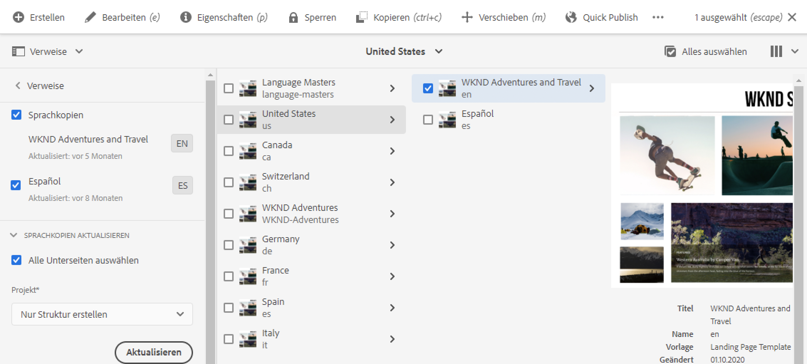

Nach dem Übersetzen können Sie [die Übersetzung überprüfen](#reviewing-and-promoting-updated-content), bevor Sie die Sprachkopie damit überschreiben. Wenn für die ausgewählte Seite keine Sprachkopie vorhanden ist, wird die Registerkarte „Erstellen und übersetzen“ angezeigt, um Zugriff auf projektbezogene Befehle zu gewähren.

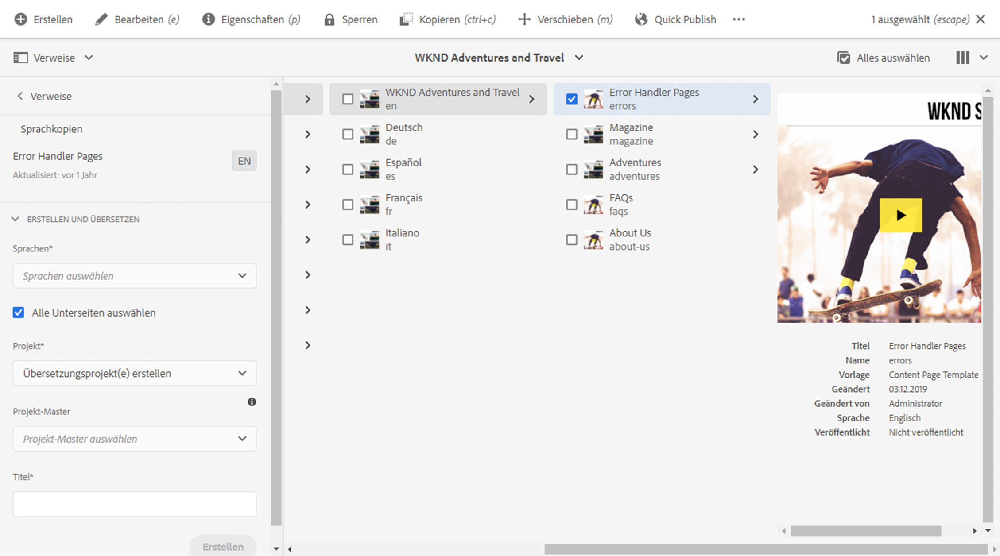

### Erstellen von Übersetzungsprojekten für eine neue Sprachkopie {#create-translation-projects-for-a-new-language-copy}

1. Verwenden Sie die Sites-Konsole, um die Seite auszuwählen, die Sie den Übersetzungsprojekten hinzufügen.

1. Öffnen Sie in der Symbolleiste die Leiste **Verweise**.

   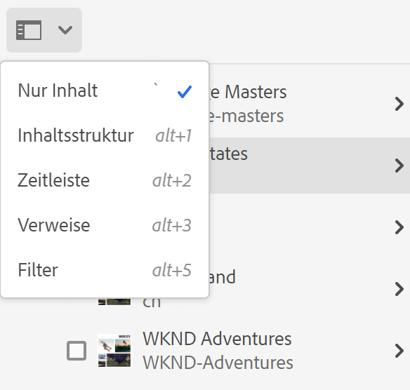

1. Wählen Sie die Option **Sprachkopien** und dann die Sprachkopien aus, für die Sie die Quellseiten übersetzen.
1. Wählen Sie **Erstellen und übersetzen** aus und konfigurieren Sie dann den Übersetzungsauftrag:

   * Wählen Sie mithilfe des Dropdown-Menüs **Sprache** eine Sprachkopie aus, für die Sie eine Übersetzung durchführen möchten. Wählen Sie bei Bedarf weitere Sprachen aus. Die in der Liste angezeigten Sprachen entsprechen den [von Ihnen erstellten Sprachstämmen](preparation.md#creating-a-language-root).
      * Wenn Sie mehrere Sprachen auswählen, wird ein Projekt mit einem Übersetzungsauftrag für jede Sprache erstellt.
   * Wählen Sie zur Übersetzung der von Ihnen ausgewählten Seite und allen untergeordneten Seiten die Option **Alle Unterseiten auswählen** aus. Um nur die von Ihnen ausgewählten Seiten zu übersetzen, wählen Sie diese Option ab.
   * Wählen Sie für **Projekt** **Übersetzungsprojekt(e) erstellen** aus.
   * Wählen Sie optional für **Projektstamm** ein Projekt aus, aus dem Benutzerrollen und -berechtigungen übernommen werden sollen.
   * Geben Sie unter **Titel** einen Namen für das Projekt ein.

   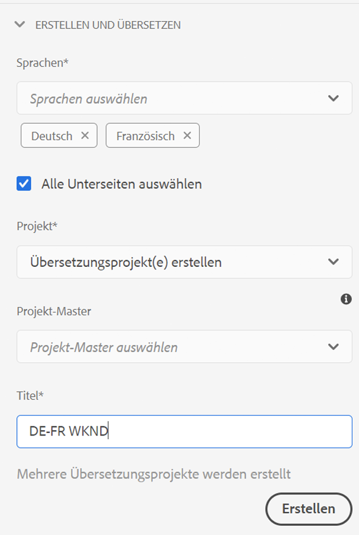

1. Wählen Sie **Erstellen** aus.

### Erstellen von Übersetzungsprojekten für vorhandene Sprachkopien {#create-translation-projects-for-an-existing-language-copy}

1. Verwenden Sie die Sites-Konsole, um die Seite auszuwählen, die Sie den Übersetzungsprojekten hinzufügen.

1. Öffnen Sie in der Symbolleiste die Leiste **Verweise**.

   

1. Wählen Sie die Option **Sprachkopien** und dann die Sprachkopien aus, für die Sie die Quellseiten übersetzen.
1. Wählen Sie **Sprachkopien aktualisieren** aus und konfigurieren Sie dann den Übersetzungsauftrag:

   * Wählen Sie zur Übersetzung der von Ihnen ausgewählten Seite und allen untergeordneten Seiten die Option **Alle Unterseiten auswählen** aus. Um nur die von Ihnen ausgewählten Seiten zu übersetzen, wählen Sie diese Option ab.
   * Wählen Sie für **Projekt** **Übersetzungsprojekt(e) erstellen** aus.
   * Wählen Sie optional für **Projektstamm** ein Projekt aus, aus dem Benutzerrollen und -berechtigungen übernommen werden sollen.
   * Geben Sie unter **Titel** einen Namen für das Projekt ein.

   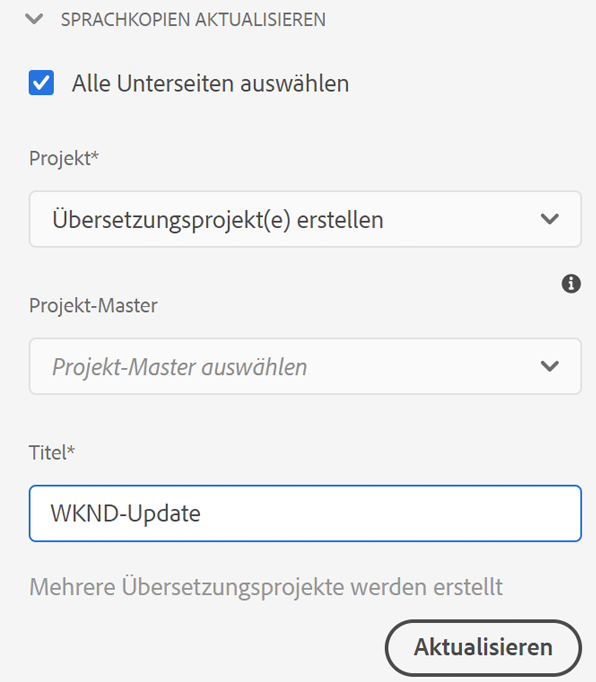

1. Wählen Sie **Erstellen** aus.

### Hinzufügen von Seiten zu einem Übersetzungsprojekt {#adding-pages-to-a-translation-project}

Nachdem Sie ein Übersetzungsprojekt erstellt haben, können Sie die Leiste **Ressourcen** verwenden, um Seiten zum Projekt hinzuzufügen. Das Hinzufügen von Seiten ist dann hilfreich, wenn Sie Seiten von verschiedenen Verzweigungen in dasselbe Projekt einfügen.

Wenn Sie einem Übersetzungsprojekt Seiten hinzufügen, werden die Seiten in einen neuen Übersetzungsauftrag einbezogen. Sie können auch [Seiten zu einem vorhandenen Vorgang hinzufügen](#adding-pages-assets-to-a-translation-job).

So wie beim Erstellen eines Projekts werden beim Hinzufügen von Seiten bei Bedarf Kopien der Seiten zu einem Launch hinzugefügt, um zu verhindern, dass vorhandene Sprachkopien überschrieben werden. (Siehe [Erstellen von Übersetzungsprojekten für bestehende Sprachkopien](#performing-initial-translations-and-updating-existing-translations).)

1. Verwenden Sie die Sites-Konsole, um die Seite auszuwählen, die Sie den Übersetzungsprojekten hinzufügen.

1. Öffnen Sie in der Symbolleiste die Leiste **Verweise**.

   

1. Wählen Sie die Option **Sprachkopien** und dann die Sprachkopien aus, für die Sie die Quellseiten übersetzen.

   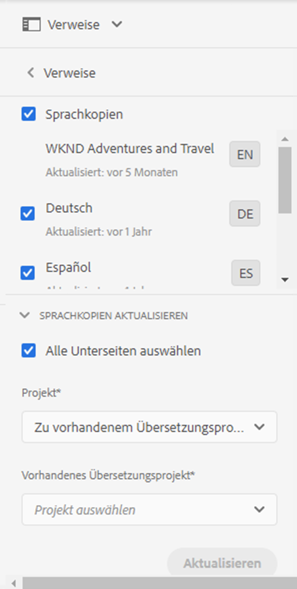

1. Wählen Sie **Sprachkopien aktualisieren** aus und konfigurieren Sie dann die Eigenschaften:

   * Wählen Sie zur Übersetzung der von Ihnen ausgewählten Seite und allen untergeordneten Seiten die Option **Alle Unterseiten auswählen** aus. Um nur die von Ihnen ausgewählten Seiten zu übersetzen, wählen Sie diese Option ab.
   * Wählen Sie für das **Projekt** die Option **Zu vorhandenem Übersetzungsprojekt hinzufügen** aus.
   * Wählen Sie das Projekt unter **Vorhandenes Übersetzungsprojekt** aus.

   >[!NOTE]
   >
   >Die im Übersetzungsprojekt festgelegte Sprache muss dem Pfad der Sprachkopie entsprechen, der in der Leiste „Verweise“ angezeigt wird.

1. Wählen Sie **Aktualisieren** aus.

### Erstellen der Struktur einer Sprachkopie {#creating-the-structure-of-a-language-copy}

Es ist möglich, nur die Struktur der Sprachkopie zu erstellen, so dass Sie Inhalte und strukturelle Änderungen im Sprachstamm in (nicht übersetzte) Sprachkopien kopieren können. Dies steht in keinem Zusammenhang mit einem Übersetzungsauftrag oder -projekt. Sie können diese Option verwenden, um Ihren Sprachstamm auch ohne Übersetzung zu synchronisieren.

Füllen Sie Ihre Sprachkopie so, dass sie Inhalte aus der Stammsprache enthält, die Sie übersetzen. Bevor Sie Ihre Sprachkopie füllen, müssen Sie [den Sprachstamm der Sprachkopie erstellt haben](preparation.md#creating-a-language-root).

1. Wählen Sie über die Sites-Konsole den Sprachstamm der Stammsprache aus, die Sie als Quelle verwenden.
1. Öffnen Sie die Leiste „Verweise“, indem Sie in der Symbolleiste auf **Verweise** klicken oder tippen.

   

1. Wählen Sie die Option **Sprachkopien** und dann die Sprachkopien aus, die Sie füllen möchten.

   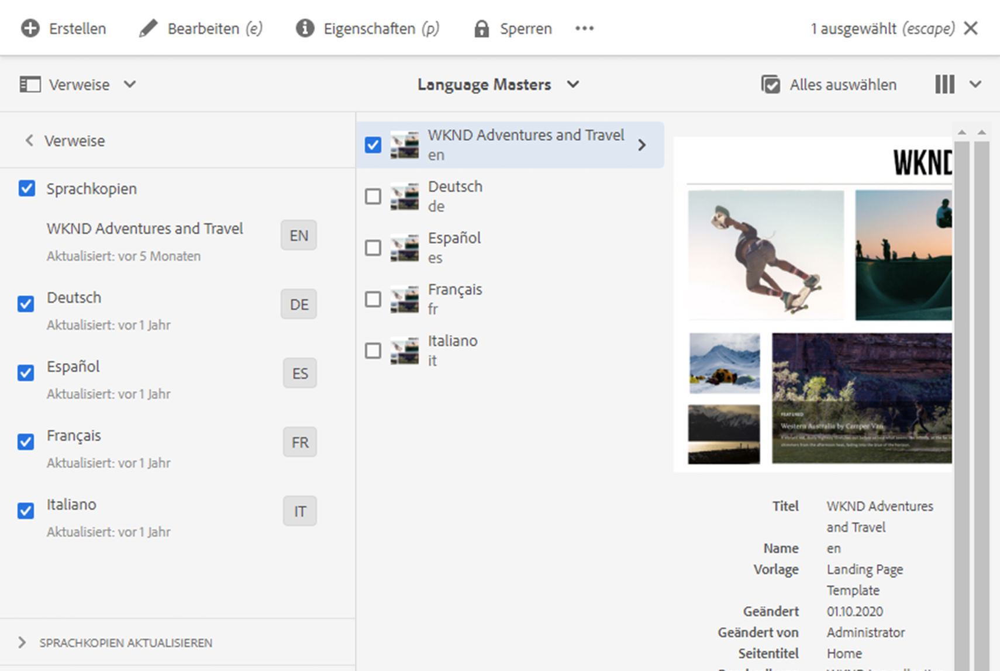

1. Wählen Sie **Sprachkopien aktualisieren** aus, um die Übersetzungs-Tools anzuzeigen, und konfigurieren Sie die Eigenschaften:

   * Wählen Sie die Option **Alle Unterseiten auswählen** aus.
   * Wählen Sie für das **Projekt** die Option **Nur Struktur erstellen** aus.

   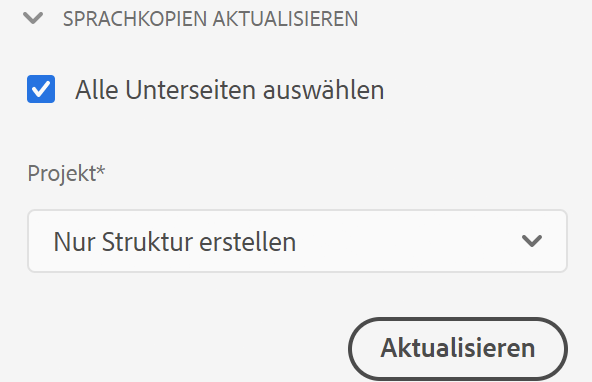

1. Wählen Sie **Aktualisieren** aus.

### Aktualisieren des Translation Memory {#updating-translation-memory}

Für manuelle Bearbeitungen von übersetzten Inhalten kann eine Synchronisierung mit dem Translation Management System (TMS) durchgeführt werden, um das Translation Memory zu trainieren.

1. Wählen Sie in der Sites-Konsole nach dem Aktualisieren des Textinhalts auf einer übersetzten Seite die Option **Speicher aktualisieren** aus.
1. In einer Listenansicht werden die Quelle und die Übersetzung für jede bearbeitete Textkomponente nebeneinander verglichen. Wählen Sie aus, welche Übersetzungsaktualisierungen mit dem Translation Memory synchronisiert werden sollen, und wählen Sie die Option **Speicher aktualisieren** aus.

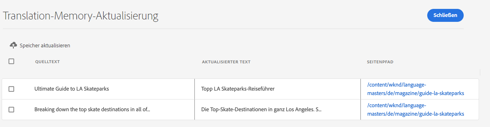

AEM aktualisiert die Übersetzung der vorhandenen Zeichenfolgen im Translation Memory des konfigurierten TMS.

* Die Aktion aktualisiert die Übersetzung vorhandener Zeichenfolgen im Translation Memory des konfigurierten TMS.
* Es werden keine neuen Übersetzungsvorgänge erstellt.
* Die Übersetzungen werden über die AEM-Übersetzungs-API an das TMS zurückgesendet (siehe unten).

So verwenden Sie diese Funktion:

* Ein TMS muss für die Verwendung mit AEM konfiguriert werden.
* Der Connector muss die Methode [`storeTranslation`](https://developer.adobe.com/experience-manager/reference-materials/cloud-service/javadoc/com/adobe/granite/translation/api/TranslationService.html) implementieren.
   * Der Code innerhalb dieser Methode bestimmt, was mit der Aktualisierungsanfrage für das Translation Memory geschieht.
   * Das AEM-Übersetzungs-Framework sendet die Zeichenfolgenwertpaare (ursprüngliche und aktualisierte Übersetzung) über diese Methodenimplementierung zurück an das TMS.

Die Aktualisierungen des Translation Memory können auch umgeleitet und an ein benutzerdefiniertes Ziel gesendet werden, wenn ein proprietäres Translation Memory verwendet wird.

### Überprüfen des Übersetzungsstatus einer Seite {#check-translation-status}

In der Listenansicht der Sites-Konsole kann eine Eigenschaft ausgewählt werden, die anzeigt, ob eine Seite bereits übersetzt wurde, sich in Übersetzung befindet oder noch nicht übersetzt wurde.

1. Wechseln Sie in der Sites-Konsole zur [Listenansicht](/help/sites-cloud/authoring/basic-handling.md#viewing-and-selecting-resources).
1. Wählen Sie **Anzeigeeinstellungen** im Dropdown-Menü „Ansicht“ aus.
1. Markieren Sie im Dialogfeld die Eigenschaft **Übersetzt** und wählen Sie **Aktualisieren** aus.

Die Sites-Konsole zeigt jetzt die Spalte **Übersetzt** mit dem Übersetzungsstatus der aufgeführten Seiten an.

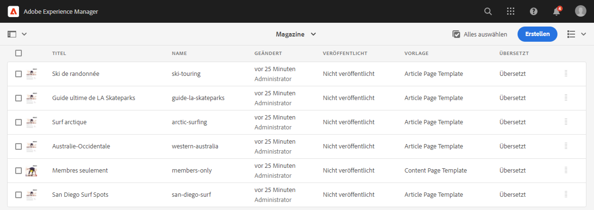

## Verwalten von Übersetzungsprojekten über die Projektkonsole

Auf viele Aufgaben und erweiterte Optionen kann in der Projektkonsole zugegriffen werden.

### Die Projektkonsole

Übersetzungsprojekte in AEM verwenden die standardmäßige [AEM-Projektkonsole](/help/sites-cloud/authoring/projects/overview.md). Wenn Sie mit AEM-Projekten nicht vertraut sind, lesen Sie bitte die Dokumentation.

Wie jedes andere Projekt besteht auch ein Übersetzungsprojekt aus Kacheln, die einen Überblick über die Projektaufgaben bieten.

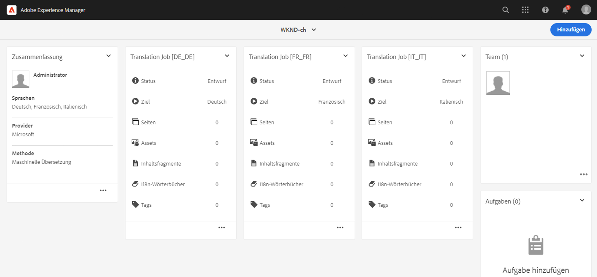

* **Zusammenfassung**: Ein Überblick über das Projekt
* **Aufgaben**: Eine oder mehrere Übersetzungsaufgaben
* **Team**: Die Benutzer, die am Übersetzungsprojekt arbeiten
* **Aufgaben**: Elemente, die im Rahmen des Übersetzungsprozesses erledigt werden müssen

Verwenden Sie die Befehlsschaltfläche und die Schaltfläche mit den drei Punkten oben und unten auf den Kacheln, um auf Steuerelemente und Optionen für die verschiedenen Kacheln zuzugreifen.

### Erstellen von Übersetzungsprojekten mithilfe der Projektkonsole {#creating-a-translation-project-using-the-projects-console}

Sie können ein Übersetzungsprojekt manuell erstellen, wenn Sie lieber die Projektkonsole anstelle der Sites-Konsole verwenden möchten.

>[!NOTE]
>
>Um ein Projekt zu erstellen, muss Ihr Konto Mitglied der Gruppe `project-administrators` sein.

Wenn Sie ein Übersetzungsprojekt manuell erstellen, müssen Sie neben den [grundlegenden Eigenschaften](/help/sites-cloud/authoring/projects/managing.md#creating-a-project) Werte für die folgenden übersetzungsspezifischen Eigenschaften angeben:

* **Name:** Projektname
* **Ausgangssprache:** Die Sprache der Quellinhalte
* **Zielsprache:** Die Sprache oder Sprachen, in die die Inhalte übersetzt werden
   * Wenn mehrere Sprachen ausgewählt sind, wird für jede Sprache im Projekt ein Auftrag erstellt.
* **Übersetzungsmethode:** Wählen Sie **Menschliche Übersetzung** aus, um anzugeben, dass die Übersetzung manuell durchgeführt werden soll.

1. Wählen Sie in der Symbolleiste der Projektkonsole die Option **Erstellen** aus.
1. Wählen Sie zunächst die Vorlage **Übersetzungsprojekt** aus und anschließend **Weiter**.
1. Geben Sie Werte für die Registerkarte der **Basiseigenschaften** ein.
1. Wählen Sie **Erweitert** aus und geben Sie Werte für die übersetzungsspezifischen Eigenschaften an.
1. Wählen Sie **Erstellen** aus. Wählen Sie im Bestätigungsfeld **Fertig** aus, um zur Projektkonsole zurückzukehren, oder **Projekt öffnen**, um das Projekt zu öffnen und mit der Verwaltung des Projekts zu beginnen.

### Hinzufügen von Seiten und Assets zu einem Übersetzungsauftrag {#adding-pages-assets-to-a-translation-job}

Sie können dem Übersetzungsauftrag Ihres Übersetzungsprojekts Seiten, Assets oder Tags hinzufügen. So fügen Sie Seiten oder Assets hinzu:

1. Wählen Sie im Übersetzungsprojekt unten in der Kachel „Übersetzungsauftrag“ die Auslassungspunkte aus.

   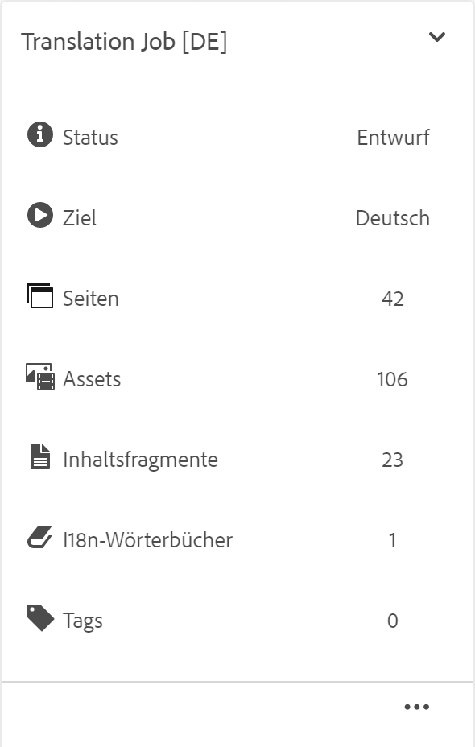

1. Wählen Sie im nächsten Fenster in der Symbolleiste die Schaltfläche **Hinzufügen** aus und wählen Sie dann **Assets/Seiten** aus.

   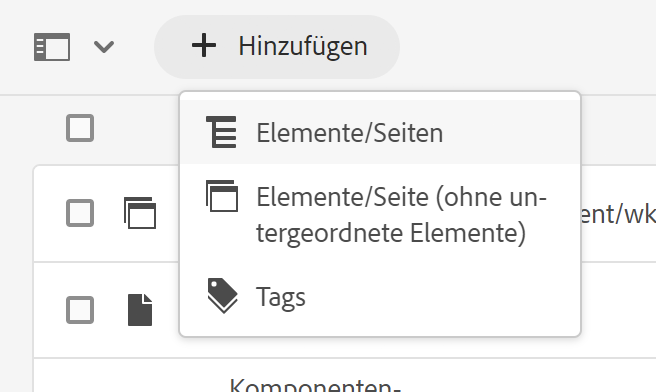

1. Wählen Sie im modalen Fenster das oberste Element der Verzweigung aus, das Sie hinzufügen wollen, und wählen Sie dann das Häkchensymbol aus. In diesem Fenster ist die Mehrfachauswahl aktiviert.

   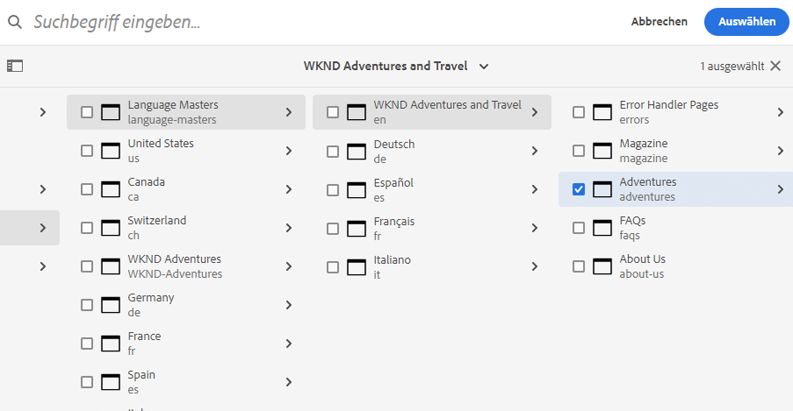

1. Alternativ können Sie das Symbol „Suchen“ auswählen, um schnell und einfach nach Seiten oder Assets zu suchen, die Sie Ihrem Übersetzungsauftrag hinzufügen möchten.

   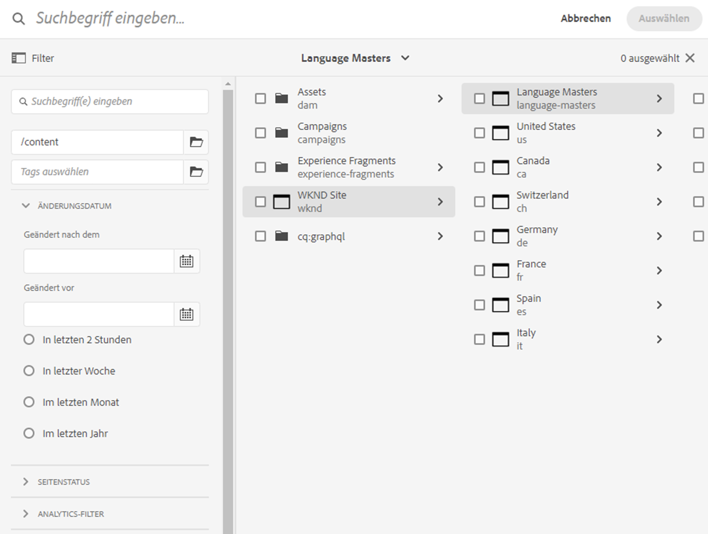

1. Wählen Sie anschließend **Auswählen** aus. Die Seiten und/oder Assets werden dem Übersetzungsauftrag hinzugefügt.

>[!TIP]
>
>Diese Methode fügt dem Projekt Seiten/Assets und deren untergeordnete Elemente hinzu. Wählen Sie **Asset/Seite (ohne untergeordnete Elemente)** aus, wenn Sie nur die übergeordneten Elemente hinzufügen möchten.

### Hinzufügen von Tags zu einem Übersetzungsauftrag {#adding-tags-to-a-translation-job}

Sie können Tags zu einem Übersetzungsprojekt hinzufügen, ähnlich wie Sie [Assets und Seiten zu einem Projekt hinzufügen](#adding-pages-assets-to-a-translation-job). Wählen Sie einfach **Tags** unter dem Menü **Hinzufügen** aus und folgen Sie dann denselben Schritten.

### Anzeigen von Details eines Übersetzungsprojekts {#seeing-translation-project-details}

Die Eigenschaften des Übersetzungsprojekts sind über die Schaltfläche mit den drei Punkten der Kachel mit der Projektzusammenfassung zugänglich. In den Eigenschaften des Übersetzungsprojekts finden Sie neben den generischen [Projektinformationen](/help/sites-cloud/authoring/projects/overview.md#project-info) auch übersetzungsspezifische.

Wählen Sie in Ihrem Übersetzungsprojekt unten auf der Kachel „Zusammenfassung der Übersetzung“ die Auslassungspunkte aus. Die meisten projektspezifischen Eigenschaften befinden sich auf der Registerkarte **Erweitert**.

* **Ausgangssprache:** Die Sprache der Seiten, die übersetzt werden
* **Zielsprache:** Die Sprache oder Sprachen, in die die Seiten übersetzt werden
* **Cloud-Konfiguration:** Die Cloud-Konfiguration für den Übersetzungs-Service-Connector, der für das Projekt verwendet wird
* **Übersetzungsmethode:** Der Übersetzungs-Workflow, entweder **Menschliche Übersetzung** oder **Maschinelle Übersetzung**
* **Übersetzungsanbieter:** Der Übersetzungsdienstleister, der die Übersetzung ausführt
* **Inhaltskategorie:** (Maschinelle Übersetzung) Die Inhaltskategorie, die für die Übersetzung verwendet wird
* **Anmeldedaten für den Übersetzungsanbieter:** Die Anmeldedaten zum Anmelden beim Anbieter
* **Übersetzungsstarts automatisch hervorheben:** Nach den Erhalt übersetzter Inhalte werden Übersetzungsstarts automatisch veröffentlicht
   * **Launch nach der Veröffentlichung löschen:** Wenn Übersetzungsstarts automatisch veröffentlicht werden, wird der Launch danach gelöscht.
* **Übersetzungen automatisch genehmigen:** Nach Erhalt übersetzter Inhalte werden Übersetzungsaufträge automatisch genehmigt.
* **Übersetzung wiederholen:** Konfigurieren Sie die wiederkehrende Ausführung eines Übersetzungsprojekts, indem Sie die Häufigkeit auswählen, mit der das Projekt automatisch Übersetzungsaufträge erstellen und ausführen soll.

Wenn ein Projekt unter Verwendung der Leiste „Verweise“ auf einer Seite erstellt wurde, werden diese Eigenschaften automatisch basierend auf den Eigenschaften der Quellseite konfiguriert.

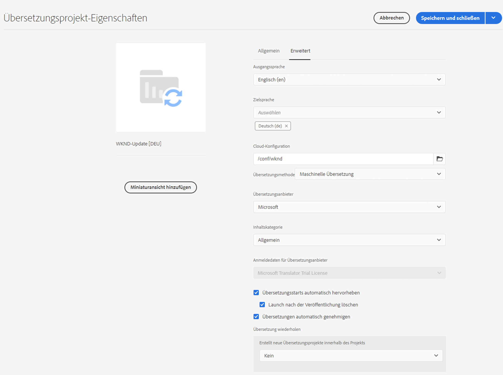

### Überwachen des Status von Übersetzungsaufträgen {#monitoring-the-status-of-a-translation-job}

Die Kachel des Übersetzungsauftrags eines Übersetzungsprojekts zeigt den Status eines Übersetzungsauftrags sowie die Anzahl an Seiten und Assets im Auftrag an.

Die folgende Tabelle beschreibt die einzelnen Status, die ein Auftrag oder ein Element im Auftrag haben kann:

| Status | Beschreibung |
|---|---|
| **Entwurf** | Der Übersetzungsauftrag wurde noch nicht gestartet. Übersetzungsaufträge haben den Status **Entwurf**, wenn sie erstellt werden. |
| **Übermittelt** | Dateien im Übersetzungsauftrag erhalten diesen Status, wenn sie erfolgreich an den Übersetzungs-Service gesendet wurden. Dieser Status kann nach Ausgabe des Befehls **Berechnung anfordern** oder des Befehls **Starten** angezeigt werden. |
| **Berechnung angefragt** | Für den Workflow für die menschliche Übersetzung wurden die Dateien des Auftrags zum Berechnen an den Übersetzungsdienstleister gesendet. Er wird nach Ausgabe des Befehls **Berechnung anfordern** angezeigt. |
| **Berechnung abgeschlossen** | Der Anbieter hat die Berechnung des Übersetzungsauftrag abgeschlossen. |
| **Übersetzung beauftragt** | Der Projektinhaber hat die Berechnung akzeptiert. Dieser Status zeigt an, dass der Übersetzungsanbieter mit der Übersetzung der Dateien im Auftrag beginnen soll. |
| **Übersetzung läuft** | Bei einem Auftrag ist die Übersetzung einer oder mehrerer Dateien im Auftrag noch nicht abgeschlossen. Hinsichtlich eines Elements im Auftrag besagt der Status, dass das Element übersetzt wird. |
| **Übersetzt** | Bei einem Auftrag ist die Übersetzung aller Dateien im Auftrag abgeschlossen. Hinsichtlich eines Elements im Auftrag besagt der Status, dass das Element übersetzt ist. |
| **Bereit für Überprüfung** | Das Element im Auftrag ist übersetzt und die Datei wurde in AEM importiert. |
| **Fertig stellen** | Der Projektinhaber hat mitgeteilt, dass der Übersetzungsvertrag abgeschlossen ist. |
| **Abbrechen** | Gibt an, dass der Übersetzungsanbieter die Arbeit an einem Übersetzungsauftrag anhalten soll. |
| **Fehler beim Update** | Beim Übertragen von Dateien zwischen AEM und dem Übersetzungs-Service ist ein Fehler aufgetreten. |
| **Unbekannter Status** | Ein unbekannter Fehler ist aufgetreten. |

Wählen Sie die Auslassungspunkte am unteren Rand der Kachel aus, um den Status der einzelnen Dateien im Auftrag anzuzeigen.

### Festlegen des Fälligkeitsdatums von Übersetzungsaufträgen {#setting-the-due-date-of-translation-jobs}

Geben Sie das Datum an, bis zu dem Ihr Übersetzungsanbieter die übersetzten Dateien liefern muss. Die Festlegung eines Fälligkeitsdatums funktioniert nur dann richtig, wenn der Übersetzungsanbieter diese Funktion unterstützt.

1. Wählen Sie am unteren Rand der Kachel „Zusammenfassung der Übersetzung“ die Auslassungspunkte aus.

   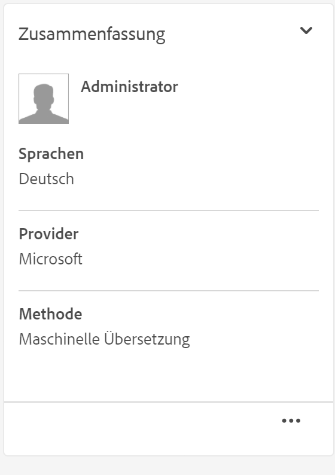

1. Wählen Sie auf der Registerkarte **Allgemein** mithilfe der Datumsauswahl der Eigenschaft **Fälligkeitsdatum** das Fälligkeitsdatum aus.

   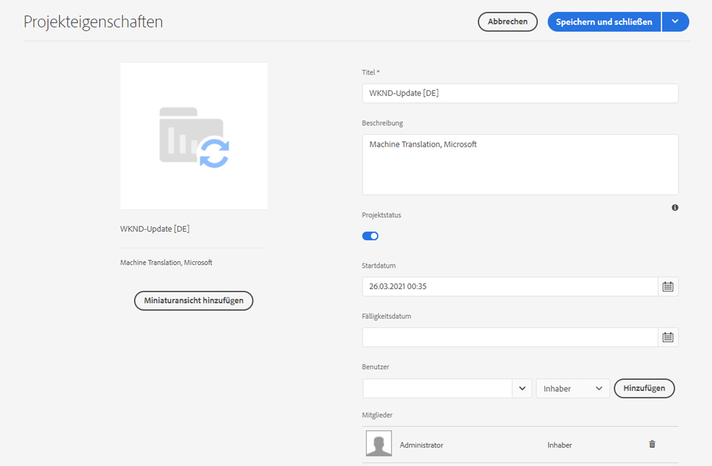

1. Wählen Sie **Speichern und schließen**.

### Berechnen des Umfangs eines Übersetzungsauftrags {#scoping-a-translation-job}

Berechnen Sie den Umfang eines Übersetzungsauftrags, um eine Kostenschätzung für die Übersetzung von Ihrem Übersetzungsdienstleister zu erhalten. Bei der Umfangsberechnung eines Auftrags werden Quelldateien an den Übersetzungsanbieter gesendet, der den Text mit seinem Pool an gespeicherten Übersetzungen (dem sogenannten Translation Memory) vergleicht. In der Regel handelt es sich beim Umfang um die Anzahl der zu übersetzenden Wörter.

Wenden Sie sich an Ihren Übersetzungsanbieter, um weitere Informationen zu den Ergebnissen der Umfangsberechnung zu erhalten.

>[!NOTE]
>
>Die Berechnung ist optional und gilt nur für die menschliche Übersetzung. Sie können einen Übersetzungsauftrag ohne Umfangsberechnung starten.

Wenn Sie den Umfang eines Übersetzungsauftrags berechnen, lautet der Status des Auftrags **Berechnung angefragt**. Wenn der Übersetzungsanbieter die Berechnung des Umfangs übermittelt, wechselt der Status zu **Berechnung abgeschlossen**. Ist die Berechnung des Umfangs abgeschlossen, können Sie den Befehl **Berechnung anzeigen** zur Überprüfung der Ergebnisse der Umfangsberechnung verwenden.

Die Umfangsberechnung funktioniert nur dann richtig, wenn der Übersetzungsanbieter diese Funktion unterstützt.

1. Öffnen Sie in der Projektkonsole das Übersetzungsprojekt.
1. Wählen Sie im Titel des Übersetzungsauftrags das Befehlsmenü aus und wählen Sie dann **Berechnung anfordern** aus.
1. Wenn sich der Auftragsstatus in **Berechnung abgeschlossen** ändert, wählen Sie das Befehlsmenü und dann **Berechnung anzeigen** aus.

### Starten von Übersetzungsaufträgen {#starting-translation-jobs}

Starten Sie einen Übersetzungsauftrag, um die Quellseiten in die Zielsprache zu übersetzen. Die Übersetzung wird gemäß den Eigenschaftswerten der Kachel „Zusammenfassung der Übersetzung“ durchgeführt.

Sie können einen einzelnen Auftrag aus dem Projekt heraus starten.

1. Öffnen Sie in der Projektkonsole das Übersetzungsprojekt.
1. Wählen Sie in der Kachel „Übersetzungsauftrag“ zunächst das Befehlsmenü und dann **Starten** aus.
1. Wählen Sie im Aktionsdialogfeld, das den Start der Übersetzung bestätigt, **Schließen** aus.

Nachdem Sie den Übersetzungsauftrag gestartet haben, wird in der Kachel „Übersetzungsauftrag“ der Status **Übersetzung läuft** angezeigt.

Sie können auch alle Übersetzungsaufträge für ein Projekt starten.

1. Wählen Sie in der Projektkonsole das Übersetzungsprojekt aus.
1. Wählen Sie in der Symbolleiste **Übersetzungsaufträge starten** aus.
1. Überprüfen Sie im Dialogfeld die Liste der Aufträge, die gestartet werden sollen, und bestätigen Sie dann mit **Starten** oder brechen Sie mit der Option **Abbrechen** ab.

### Abbrechen von Übersetzungsaufträgen {#canceling-a-translation-job}

Sie können einen Übersetzungsauftrag abbrechen, um den Übersetzungsprozess zu stoppen und den Übersetzungsanbieter daran zu hindern, weitere Übersetzungen durchzuführen. Sie können einen Auftrag abbrechen, wenn der Auftrag den Status **Übersetzung beauftragt** oder **Übersetzung läuft** hat.

1. Öffnen Sie in der Projektkonsole das Übersetzungsprojekt.
1. Wählen Sie in der Kachel „Übersetzungsauftrag“ zunächst das Befehlsmenü und dann **Abbrechen** aus.
1. Wählen Sie im Dialogfeld „Aktion“, das den Abbruch der Übersetzung bestätigt, **OK** aus.

### Workflow zum Akzeptieren und Ablehnen {#accept-reject-workflow}

Wenn die Inhalte nach der Übersetzung zurückgegeben werden und den Status **Bereit für Überprüfung** aufweisen, können Sie den Übersetzungsauftrag aufrufen und die Inhalte akzeptieren bzw. ablehnen.

Falls Sie die Option **Übersetzung ablehnen** auswählen, haben Sie die Möglichkeit, einen Kommentar hinzuzufügen.

Bei Ablehnung der Inhalte werden diese an den Übersetzungsanbieter zurückgesendet und der Anbieter kann dann den Kommentar einsehen.

### Abschließen und Archivieren von Übersetzungsaufträgen {#completing-and-archiving-translation-jobs}

Schließen Sie einen Übersetzungsauftrag ab, nachdem Sie die übersetzten Dateien vom Anbieter überprüft haben.

1. Öffnen Sie in der Projektkonsole das Übersetzungsprojekt.
1. Wählen Sie in der Kachel „Übersetzungsauftrag“ zunächst das Befehlsmenü und dann **Fertigstellen** aus.
1. Der Auftrag hat jetzt den Status **Fertig stellen**.

Beim Workflow „Menschliche Übersetzung“ signalisiert der Abschluss einer Übersetzung dem Anbieter, dass der Übersetzungsauftrag erfüllt wurde und er die Übersetzung in seinem Translation Memory speichern sollte.

Archivieren Sie einen Übersetzungsauftrag, nachdem er abgeschlossen ist und Sie die Auftragsstatusdetails nicht länger einsehen müssen.

1. Öffnen Sie in der Projektkonsole das Übersetzungsprojekt.
1. Wählen Sie in der Kachel „Übersetzungsauftrag“ zunächst das Befehlsmenü und dann **Archivieren** aus.

Wenn Sie den Auftrag archivieren, wird die Kachel „Übersetzungsauftrag“ aus dem Projekt entfernt.

## Überprüfen und Verwenden von übersetzten Inhalten {#reviewing-and-promoting-updated-content}

Sie können die Sites-Konsole verwenden, um Inhalte zu überprüfen, Sprachkopien zu vergleichen und den Inhalt zu aktivieren.

### Veröffentlichen von aktualisierten Inhalten {#promoting-updated-content}

Wenn Inhalte für eine vorhandene Sprachkopie übersetzt werden, überprüfen Sie die Übersetzungen, nehmen Sie bei Bedarf Änderungen vor und leiten Sie dann die Übersetzungen weiter, um die Übersetzungen in die Sprachkopie zu verschieben. Sie können übersetzte Dateien überprüfen, wenn der Übersetzungsauftrag den Status **Bereit für Überprüfung** aufweist.

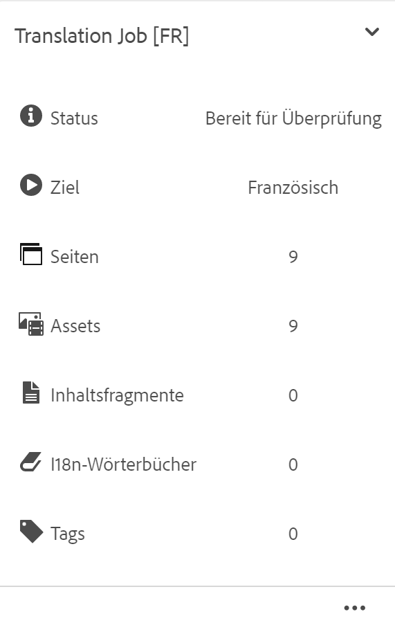

1. Wählen Sie die Seite zunächst in der Sprachmustervorlage aus, wählen Sie dann **Verweise** und abschließend **Sprachkopien**.
1. Wählen Sie die zu überprüfende Sprachkopie aus.

   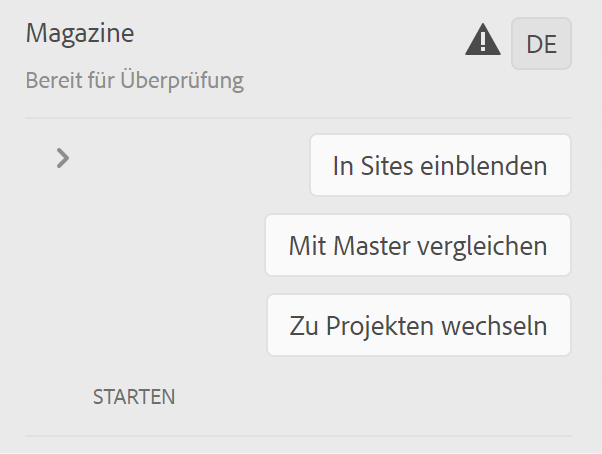

1. Wählen Sie **Launch** aus, um die Launch-Befehle anzuzeigen.

   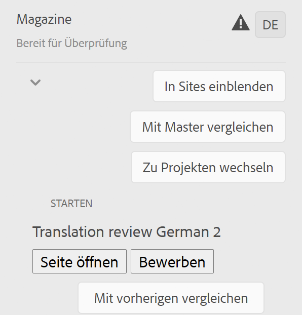

1. Klicken Sie auf **Seite öffnen**, um die Launch Copy der zu überprüfenden Seite zu öffnen und die Inhalte zu bearbeiten.
1. Nachdem Sie die Inhalte überprüft und alle notwendigen Änderungen vorgenommen haben, klicken Sie auf **Bewerben**, um die Launch Copy zu bewerben.
1. Legen Sie auf der Seite **Launch bewerben** fest, welche Seiten beworben werden sollen, und wählen Sie dann **Bewerben** aus.

### Vergleichen von Sprachkopien {#comparing-language-copies}

So vergleichen Sie Sprachkopien mit dem Sprachstamm:

1. Navigieren Sie in der Sites-Konsole zur Sprachkopie, die Sie vergleichen wollen.
1. Öffnen Sie die [Leiste „Verweise“](/help/sites-cloud/authoring/basic-handling.md#references).
1. Wählen Sie unter der Überschrift **Kopien** die Option **Sprachkopien** aus.
1. Wählen Sie Ihre spezifische Sprachkopie aus und klicken Sie dann entweder auf **Mit Stamm vergleichen** oder auf **Mit vorherigen vergleichen**.

   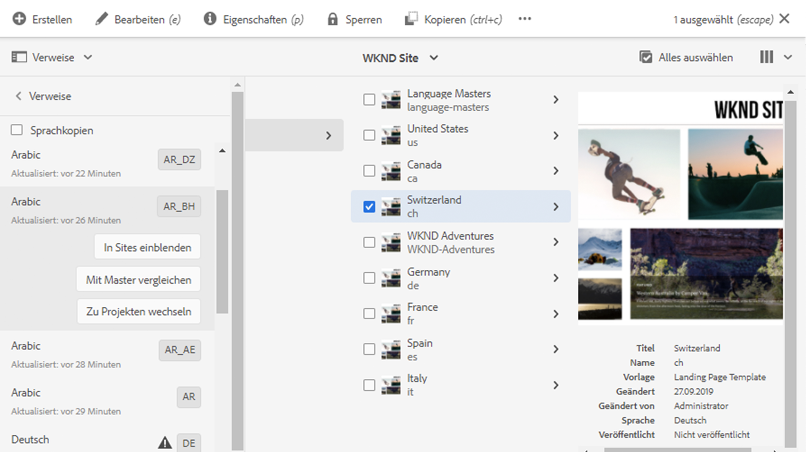

1. Die beiden Seiten (Launch und Quelle) werden nebeneinander geöffnet.
   * Vollständige Informationen zur Verwendung der Funktion finden Sie unter [Seitenvergleich](/help/sites-cloud/authoring/sites-console/page-diff.md).

## Verschieben oder Umbenennen einer Quellseite {#move-source}

Wenn eine bereits übersetzte Quellseite [umbenannt oder verschoben](/help/sites-cloud/authoring/sites-console/managing-pages.md#moving-or-renaming-a-page) werden muss, wird beim erneuten Übersetzen der Seite nach der Verschiebung eine Sprachkopie auf Grundlage des neuen Seitennamens/Speicherorts erstellt. Die alte Sprachkopie mit dem vorherigen Namen/Speicherort bleibt bestehen. Um dies zu verhindern, können Sie nach dem Verschieben die Funktion zum Aktualisieren der Sprachkopie verwenden:

1. Verschieben Sie eine Seite mit einer Sprachkopie.
1. Wählen Sie den Sprachkopiestamm aus.
1. Öffnen Sie das Bedienfeld **Verweise**.
1. Wählen Sie **Sprachkopien** aus.
1. Wählen Sie die zu aktualisierenden Zielsprachen aus.
1. Wählen Sie **Sprachkopien aktualisieren** aus.

   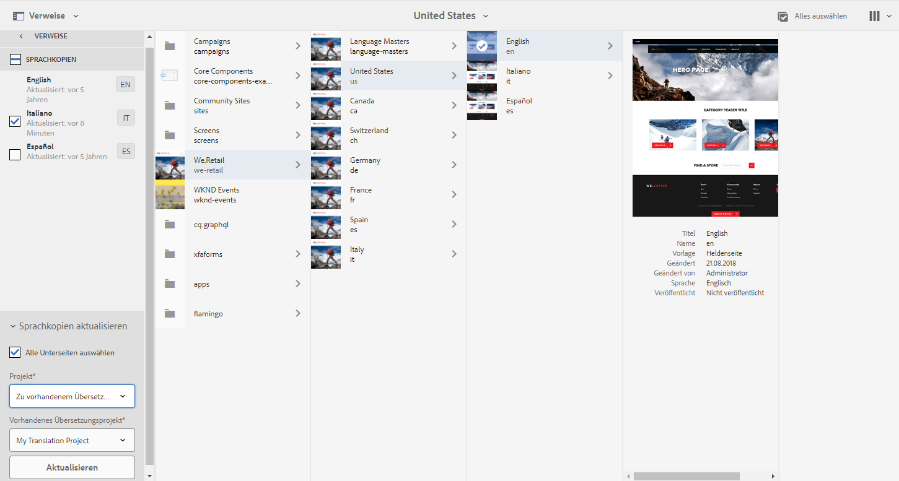

1. Klicken Sie auf **Aktualisieren**. Es wird ein [Launch](/help/sites-cloud/authoring/launches/promoting.md) erstellt.
1. Navigieren Sie zum erforderlichen Sprachstamm und wählen Sie ihn aus.
1. Wählen Sie über das Bedienfeld **Verweise** **Launches** aus.

   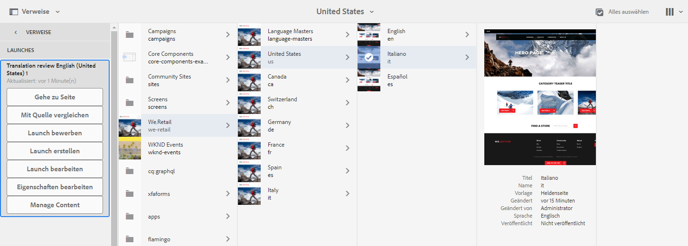

1. Klicken Sie auf den erstellten Launch und dann auf **Launch bewerben**.

Die Quellseite und die zugehörige Sprachkopie wurden nun verschoben.

## Importieren und Exportieren von Übersetzungsaufträgen {#import-export}

Obwohl AEM mehrere Übersetzungslösungen und -schnittstellen bietet, ist es auch möglich, Informationen zu Übersetzungsaufträgen manuell zu im- und exportieren.

### Exportieren von Übersetzungsaufträgen {#exporting-a-translation-job}

Sie können die Inhalte eines Übersetzungsauftrags herunterladen, um sie z. B. an einen Übersetzungsanbieter zu senden, der nicht über einen Connector in AEM integriert ist, oder um die Inhalte zu überprüfen.

1. Wählen Sie im Dropdown-Menü der Kachel „Übersetzungsauftrag“ **Exportieren** aus.
1. Wählen Sie im Dialogfeld **Exportierte Datei herunterladen** aus und speichern Sie die Datei ggf. über das Dialogfeld des Webbrowsers.
1. Wählen Sie im Dialogfeld **Schließen** aus.

### Importieren von Übersetzungsaufträgen {#importing-a-translation-job}

Sie können übersetzte Inhalte in AEM importieren, zum Beispiel wenn Ihr Übersetzungsanbieter die Inhalte an Sie sendet, da er nicht über einen Connector in AEM integriert ist.

1. Wählen Sie im Dropdown-Menü der Kachel „Übersetzungsauftrag“ **Importieren** aus.
1. Wählen Sie im Dialogfeld des Webbrowsers die zu importierende Datei aus.
1. Wählen Sie im Dialogfeld **Schließen** aus.
