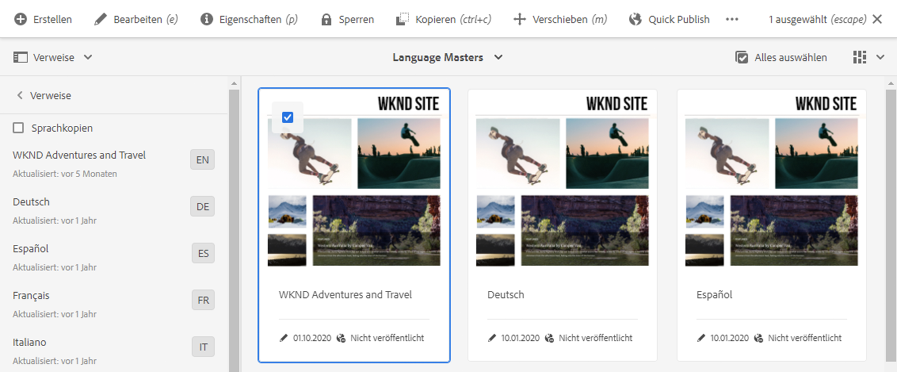

# Vorbereiten von Inhalten für die Übersetzung {#preparing-content-for-translation}

Bei mehrsprachigen Websites wird in der Regel ein Teil der Inhalte in mehreren Sprachen bereitgestellt. Die Website wird in einer Sprache verfasst und anschließend in weitere Sprachen übersetzt. Im Allgemeinen bestehen mehrsprachige Websites aus Zweigen von Seiten, wobei jeder Zweig die Seiten der Website in einer anderen Sprache enthält.

Die [WKND-Tutorial-Site](/help/implementing/developing/introduction/develop-wknd-tutorial.md) umfasst mehrere Sprachzweige und verwendet die folgende Struktur:

```text
/content
    |- wknd
        |- language-masters
            |- en
            |- de
            |- es
            |- fr
            |- it
        |- us
            |- en
            |- es
        |- ca
            |- en
            |- fr
        |- ch
            |- de
            |- fr
            |- it
        |- de
            |- de
        |- fr
            |- fr
        |- es
            |- es
        |- it
            |- it
```

Die Sprachkopie, für die Sie ursprünglich Inhalte verfassen, ist der Sprach-Master. Die Sprach-Master-Vorlage ist die Quelle, die in andere Sprachen übersetzt wird.

Jeder Sprachzweig einer Website wird als Sprachkopie bezeichnet. Die Stammseite einer Sprachkopie, auch als Sprachstamm bezeichnet, identifiziert die Sprache des Inhalts in der Sprachkopie. `/content/wknd/fr` ist beispielsweise der Sprachstamm für die französische Sprachkopie. Sprachkopien müssen einen [korrekt konfigurierten Sprachstamm](preparation.md#creating-a-language-root) verwenden, damit die korrekte Sprache angesprochen wird, wenn Übersetzungen von einer Quell-Website durchgeführt werden.

Führen Sie die folgenden Schritte aus, um Ihre Website für die Übersetzung vorzubereiten:

1. Erstellen Sie den Sprachstamm für Ihren Sprach-Master. Beispielsweise ist der Sprachstamm der englischen WKND-Demosite `/content/wknd/language-masters/en`. Stellen Sie sicher, dass der Sprachstamm gemäß den Informationen unter [Erstellen eines Sprachstamms](preparation.md#creating-a-language-root) korrekt konfiguriert ist.
1. Verfassen Sie den Inhalt des Sprach-Masters.
1. Erstellen Sie den Sprachstamm jeder Sprachkopie für die Website. Beispielsweise ist die französische Sprachkopie der WKND-Beispiel-Site `/content/wknd/language-masters/fr`.

Wenn Sie die Inhalte für die Übersetzung vorbereitet haben, können Sie automatisch fehlende Seiten in den Sprachkopien und zugehörigen Übersetzungsprojekten erstellen. (Siehe [Erstellen eines Übersetzungsprojekts](managing-projects.md).) Einen Überblick über den Prozess der Inhaltsübersetzung in AEM finden Sie unter [Übersetzen von Inhalten für mehrsprachige Websites](overview.md).

## Erstellen eines Sprachstamms {#creating-a-language-root}

Erstellen Sie einen Sprachstamm als Stammseite einer Sprachkopie, die die Sprache der Inhalte identifiziert. Nachdem Sie den Sprachstamm erstellt haben, können Sie Übersetzungsprojekte erstellen, die die Sprachkopie umfassen.

Um den Sprachstamm zu erstellen, erstellen Sie eine Seite und verwenden Sie einen ISO-Sprachcode als Wert für die Eigenschaft **Name** . Der Sprachcode muss eines der folgenden Formate aufweisen:

* `<language-code>` - Der unterstützte Sprachcode ist ein Code mit zwei Buchstaben gemäß ISO-639-1, zum Beispiel `en`.
* `<language-code>_<country-code>` oder  `<language-code>-<country-code>`  - Der unterstützte Ländercode ist ein aus zwei Buchstaben bestehender Code mit Kleinbuchstaben oder Großbuchstaben gemäß ISO 3166, z. B.  `en_US`,  `en_us`,  `en_GB`,  `en-gb`.

Sie können jedes dieser Formate verwenden, passend zur Struktur Ihrer globalen Website.  Beispielsweise hat die Stammseite der französischen Sprachkopie der WKND-Site `fr` als Eigenschaft **Name** . Beachten Sie, dass die Eigenschaft **Name** als Name des Seitenknotens im Repository verwendet wird und daher den Pfad der Seite (`http://<host>:<4502>/content/wknd/language-masters/fr.html`) bestimmt.

1. Navigieren Sie zu Sites.
1. Klicken oder tippen Sie auf die Website, für die Sie eine Sprachkopie erstellen möchten.
1. Klicken oder tippen Sie auf **Erstellen** und dann auf **Seite**.

   

1. Wählen Sie die Seitenvorlage aus und klicken oder tippen Sie auf **Weiter**.
1. Geben Sie im Feld **Name** den Ländercode im Format `<language-code>` oder `<language-code>_<country-code>` ein, z. B. `en`, `en_US`, `en_us`, `en_GB`, `en_gb`. Geben Sie einen Titel für die Seite ein.

   

1. Klicken oder tippen Sie auf **Erstellen**. Klicken oder tippen Sie im Bestätigungsdialogfeld auf **Fertig**, um zur Sites-Konsole zurückzukehren, oder auf **Öffnen**, um die Sprachkopie zu öffnen.

## Anzeigen des Status der Sprachstämme {#seeing-the-status-of-language-roots}

AEM bietet eine Leiste **Verweise**, die eine Liste der erstellten Sprachstämme anzeigt.



Verwenden Sie das folgende Verfahren, um die Sprachkopien für eine Seite mithilfe des Schienenselektors [anzuzeigen.](/help/sites-cloud/authoring/getting-started/basic-handling.md#rail-selector)

1. Wählen Sie in der Sites-Konsole eine Seite der Site aus und klicken oder tippen Sie dann auf **Verweise**.

   

1. Klicken oder tippen Sie in der Leiste &quot;Verweise&quot;auf **Sprachkopien**. Die Leiste zeigt die Sprachkopien der Website an.

## Sprachkopien auf mehreren Ebenen {#multiple-levels}

Sprachstämme können auch unter Knoten gruppiert werden, z. B. nach Region, wobei sie weiterhin als Wurzeln von Sprachkopien erkannt werden.

```text
/content
    |- wknd
        |- language-masters
            |- europe
                |- de
                |- fr
                |- it
                |- es
                ]- pt
            |- americas
                |- en
                |- es
                |- fr
                |- pt
            |- asia
                |- ...
            |- africa
                |- ...
            |- oceania
                |- ...
        |- europe
        |- americas
        |- asia
        |- africa
        |- oceania            
```

>[!NOTE]
>
>Hierbei ist nur eine Ebene zulässig. Beispielsweise lässt Folgendes nicht zu, dass die `es`-Seite in eine Sprachkopie aufgelöst wird:
>
>* `/content/wknd/language-masters/en`
>* `/content/wknd/language-masters/americas/central-america/es`

>
> 
Diese `es` Sprachkopie wird nicht erkannt, da sie 2 Ebenen (`americas/central-america`) vom Knoten `en` entfernt ist.

>[!TIP]
>
>In einem solchen Setup können Sprachstämme einen beliebigen Seitennamen haben, nicht nur den ISO-Code der Sprache. AEM prüft immer zuerst den Pfad und den Namen, aber wenn der Seitenname keine Sprache identifiziert, prüft AEM die Eigenschaft `cq:language` der Seite auf die Sprachkennung.
