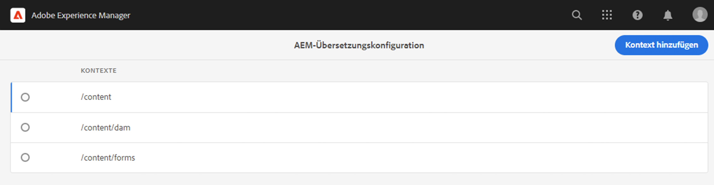
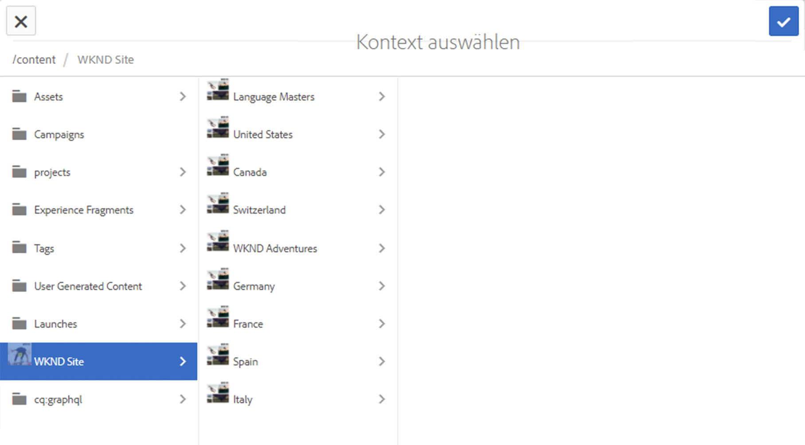
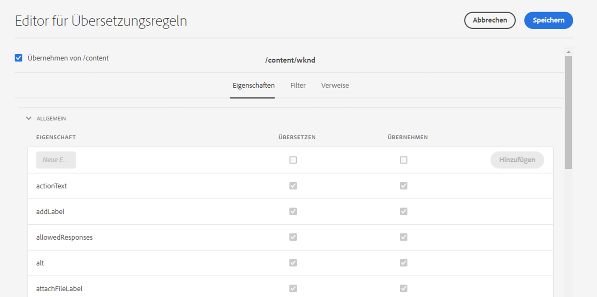
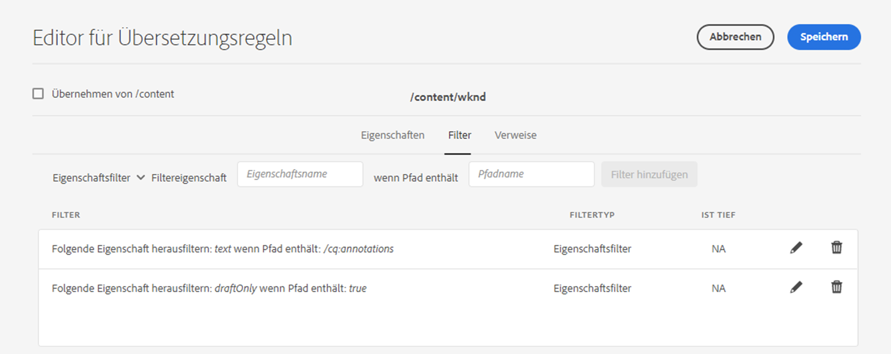
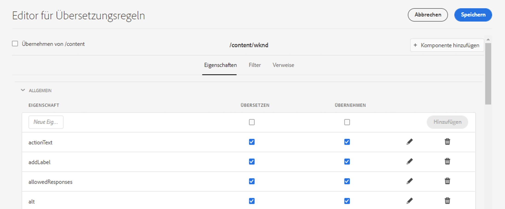

# Identifizieren zu übersetzender Inhalte {#identifying-content-to-translate}

Die Übersetzungsregeln identifizieren die zu übersetzenden Inhalte für Seiten, Komponenten und Assets, die in die Übersetzungsprojekte integriert oder von diesen ausgeschlossen sind. Wenn eine Seite oder ein Asset übersetzt wird, extrahiert AEM diese Inhalte, sodass sie an den Übersetzungsdienstleister gesendet werden können.

>[!TIP]
>
>Wenn Sie mit der Übersetzung von Inhalten noch nicht vertraut sind, durchlaufen Sie unsere [Sites-Übersetzungs-Tour](/help/journey-sites/translation/overview.md), die Sie durch die Übersetzung Ihrer AEM Sites-Inhalte mithilfe der leistungsstarken Übersetzungs-Tools von AEM führt und ideal für alle ist, die keine Erfahrung mit AEM oder Übersetzungen haben.

## Inhaltsfragmente und Übersetzungsregeln {#content-fragments}

Die in diesem Dokument beschriebenen Übersetzungsregeln gelten nur dann für Inhaltsfragmente, wenn die Option **Aktivieren von Inhaltsmodellfeldern für die Übersetzung** auf der [Konfigurationsebene des Übersetzungs-Integrations-Frameworks](integration-framework.md#assets-configuration-properties) nicht aktiviert wurde.

Wenn die Option **Aktivieren von Inhaltsmodellfeldern für die Übersetzung** aktiv ist, verwendet AEM das Feld **Übersetzbar** bei [Inhaltsfragmentmodellen](/help/sites-cloud/administering/content-fragments/content-fragment-models.md#properties), um zu bestimmen, ob das Feld übersetzt werden soll, und um automatisch Übersetzungsregeln zu erstellen. Diese Option ersetzt ggf. von Ihnen erstellte Übersetzungsregeln und erfordert keine Eingriffe oder zusätzlichen Schritte.

Wenn Sie Übersetzungsregeln für die Übersetzung Ihrer Inhaltsfragmente verwenden möchten, muss die Option **Aktivieren von Inhaltsmodellfeldern für die Übersetzung** in der Framework-Konfiguration für die Übersetzungsintegration deaktiviert sein und Sie müssen die unten beschriebenen Schritte ausführen, um Ihre Regeln zu erstellen.

## Überblick {#overview}

Die Seiten und Assets werden als Knoten im JCR-Repository dargestellt. Bei dem extrahierten Inhalt handelt es sich um einen oder mehrere Eigenschaftswerte des Knotens. Die Übersetzungsregeln identifizieren die Eigenschaften, die den zu extrahierenden Inhalt enthalten.

Übersetzungsregeln werden im XML-Format ausgedrückt und an folgenden Orten gespeichert:

* `/libs/settings/translation/rules/translation_rules.xml`
* `/apps/settings/translation/rules/translation_rules.xml`
* `/conf/global/settings/translation/rules/translation_rules.xml`

Die Datei gilt für alle Übersetzungsprojekte.

Die Regeln umfassen die folgenden Informationen:

* Den Pfad des Knotens, auf den die Regel angewendet wird
   * Die Regel gilt auch für die nachfolgenden Elemente des Knotens.
* Die Namen der Knoteneigenschaften, die den zu übersetzenden Inhalt enthalten
   * Die Eigenschaft kann sich speziell auf einen bestimmten Ressourcentyp oder auf alle Ressourcentypen beziehen.

Sie können zum Beispiel eine Regel erstellen, die den von den Autoren hinzugefügten Inhalt für alle Textkomponenten auf Ihren Seiten übersetzt. Die Regel kann den Knoten `/content` und die Eigenschaft `text` für die Komponente `core/wcm/components/text/v2/text` identifizieren.

Es gibt eine eigene [Konsole](#translation-rules-ui), die für die Konfiguration von Übersetzungsregeln hinzugefügt wurde. Die Definitionen in der Benutzeroberfläche füllen die Datei für Sie auf.

Einen Überblick über die Funktionen zur Übersetzung von Inhalten in AEM erhalten Sie unter [Übersetzen von Inhalten für mehrsprachige Sites](overview.md).

>[!NOTE]
>
>AEM unterstützt die 1-zu-1-Zuordnung zwischen Ressourcentypen und Bezugsattributen für die Übersetzung von referenziertem Inhalt auf einer Seite.

## Regelsyntax für Seiten, Komponenten und Assets {#rule-syntax-for-pages-components-and-assets}

Eine Regel ist ein `node`-Element mit einem oder mehreren untergeordneten `property`-Elementen und keinem oder mehreren untergeordneten `node`-Elementen:

```xml
<node path="content path">
          <property name="property name" [translate="false"]/>
          <node resourceType="component path" >
               <property name="property name" [translate="false"]/>
          </node>
</node>
```

Jedes dieser `node`-Elemente hat die folgenden Eigenschaften:

* Das `path`-Attribut enthält den Pfad zum Stammknoten des Zweigs, für den die Regeln gelten.
* Die untergeordneten `property`-Elemente identifizieren die Knoteneigenschaften, die für alle Ressourcentypen zu übersetzen sind:
   * Das Attribut `name` enthält den Eigenschaftsnamen.
   * Das optionale Attribut `translate` ist gleich `false`, wenn die Eigenschaft nicht übersetzt ist. Standardmäßig lautet der Wert `true`. Dieses Attribut ist nützlich für die Außerkraftsetzung vorheriger Regeln.
* Die untergeordneten `node`-Elemente identifizieren die Knoteneigenschaften, die für bestimmte Ressourcentypen zu übersetzen sind:
   * Das Attribut `resourceType` enthält den Pfad, der zu der für die Implementierung des Ressourcentyps verantwortlichen Komponente führt.
   * Die untergeordneten `property`-Elemente identifizieren die zu übersetzende Knoteneigenschaft. Verwenden Sie diesen Knoten auf dieselbe Art und Weise wie die untergeordneten `property`-Elemente zu den Knotenregeln.

Die folgende Beispielregel veranlasst, dass alle `text`-Eigenschaften für alle Seiten unter dem Knoten `/content` übersetzt werden. Die Regel ist für alle Komponenten wirksam, die Inhalte in einer `text`-Eigenschaft speichern, wie z. B. die Textkomponente.

```xml
<node path="/content">
          <property name="text"/>
</node>
```

Das folgende Beispiel übersetzt den Inhalt aller `text`-Eigenschaften sowie andere Eigenschaften der Bildkomponente. Wenn andere Komponenten über Eigenschaften mit demselben Namen verfügen, gilt die Regel nicht für sie.

```xml
<node path="/content">
      <property name="text"/>
      <node resourceType="core/wcm/components/image/v2/image">
         <property name="image/alt"/>
         <property name="image/jcr:description"/>
         <property name="image/jcr:title"/>
      </node>
</node>
```

## Regelsyntax für die Extrahierung von Assets von Seiten  {#rule-syntax-for-extracting-assets-from-pages}

Verwenden Sie die folgende Regelsyntax, um in andere Komponenten integrierte oder durch andere Komponenten referenzierte Assets einzubeziehen:

```xml
<assetNode resourceType="path to component" assetReferenceAttribute="property that stores asset"/>
```

Jedes `assetNode`-Element hat die folgenden Merkmale:

* Ein `resourceType`-Attribut, das dem zu der Komponente führenden Pfad entspricht
* Ein dem Namen der Eigenschaft entsprechendes `assetReferenceAttribute`, das (bei integrierten Assets) die Binärdaten des Assets oder den Pfad zum referenzierten Asset enthält

Das folgende Beispiel extrahiert Bilder aus der Bildkomponente:

```xml
<assetNode resourceType="core/wcm/components/image/v2/image" assetReferenceAttribute="fileReference"/>
```

## Außerkraftsetzungsregeln {#overriding-rules}

Die Datei `translation_rules.xml` besteht aus einem `nodelist`-Element mit mehreren untergeordneten `node`-Elementen. AEM liest die Knotenliste von oben nach unten. Wenn mehrere Regeln auf denselben Knoten abzielen, wird die in der Datei weiter unten aufgeführte Regel verwendet. Beispielsweise veranlassen die folgenden Regeln, dass alle Inhalte in den `text`-Eigenschaften übersetzt werden, außer dem Seitenzweig `/content/mysite/en`:

```xml
<nodelist>
     <node path="/content">
           <property name="text" />
     </node>
     <node path="/content/mysite/en">
          <property name="text" translate="false" />
     </node>
<nodelist>
```

## Filtern von Eigenschaften {#filtering-properties}

Mit dem`filter`-Element können Sie auf Knoten mit einer spezifischen Eigenschaft filtern.

Beispielsweise veranlassen die folgenden Regeln, dass alle Inhalte in `text`-Eigenschaften übersetzt werden – mit Ausnahme der Knoten, bei denen die Eigenschaft `draft` auf `true` eingestellt ist.

```xml
<nodelist>
    <node path="/content">
     <filter>
   <node containsProperty="draft" propertyValue="true" />
     </filter>
        <property name="text" />
    </node>
<nodelist>
```

## Benutzeroberfläche für Übersetzungsregeln {#translation-rules-ui}

Zum Konfigurieren von Übersetzungsregeln steht auch eine Konsole zur Verfügung.

So können Sie darauf zugreifen:

1. Navigieren Sie zu **Tools** und dann zu **Allgemein**.

1. Wählen Sie **Übersetzungskonfiguration** aus.

In der Benutzeroberfläche für Übersetzungsregeln können Sie:

1. **Kontext hinzufügen**, mit dem Sie einen Pfad hinzufügen können.

   

1. Verwenden Sie den Pfad-Browser, um den erforderlichen Kontext auszuwählen, und wählen Sie zum Speichern die Schaltfläche **Bestätigen** aus.

   

1. Anschließend müssen Sie Ihren Kontext auswählen und dann auf **Bearbeiten** klicken. Hierdurch wird der Editor für Übersetzungsregeln geöffnet.

   

Es gibt vier Attribute, die Sie über die Benutzeroberfläche ändern können:

* `isDeep`
* `inherit`
* `translate`
* `updateDestinationLanguage`

### isDeep {#isdeep}

**`isDeep`** lässt sich auf Knotenfilter anwenden und ist standardmäßig auf „true“ eingestellt. Es prüft, ob der Knoten oder seine Vorgängerelemente die Eigenschaft mit dem im Filter angegebenen Eigenschaftswert enthalten. Bei „false“ wird die Überprüfung nur für den aktuellen Knoten durchgeführt.

Beispielsweise werden untergeordnete Knoten einem Übersetzungsauftrag selbst dann hinzugefügt, wenn beim übergeordneten Knoten die Eigenschaft `draftOnly` auf „true“ eingestellt ist, um Entwurfsinhalte zu kennzeichnen. Hier kommt `isDeep` ins Spiel, prüft, ob bei den übergeordneten Knoten die Eigenschaft `draftOnly` auf „true“ eingestellt ist, und schließt diese untergeordneten Knoten aus.

Im Editor können Sie **Is Deep** auf der Registerkarte **Filter** aktivieren/deaktivieren.



Im folgenden Beispiel ist die XML dargestellt, die generiert wird, wenn **Is Deep** in der Benutzeroberfläche deaktiviert ist:

```xml
 <filter>
    <node containsProperty="draftOnly" isDeep="false" propertyValue="true"/>
</filter>
```

### inherit {#inherit}

**`inherit`** ist auf Eigenschaften anwendbar. Standardmäßig werden alle Eigenschaften übernommen. Sollten Sie jedoch wünschen, dass manche Eigenschaften nicht für das untergeordnete Element übernommen werden, können Sie diese Eigenschaft als „false“ markieren, sodass sie nur auf diesen spezifischen Knoten angewendet wird.

In der Benutzeroberfläche können Sie **Übernehmen** auf der Registerkarte **Eigenschaften** aktivieren/deaktivieren.

### translate {#translate}

**`translate`** wird einfach verwendet, um anzugeben, ob eine Eigenschaft zu übersetzen ist oder nicht.

In der Benutzeroberfläche können Sie **Übersetzen** auf der Registerkarte **Eigenschaften** aktivieren/deaktivieren.

### updateDestinationLanguage {#updatedestinationlanguage}

**`updateDestinationLanguage`** wird für Eigenschaften verwendet, die keinen Text, sondern Sprach-Codes enthalten, wie zum Beispiel `jcr:language`. Der Benutzer übersetzt keinen Text, sondern das Sprachschema von der Quelle ins Ziel. Solche Eigenschaften werden nicht zur Übersetzung versendet.

In der Benutzeroberfläche können Sie auf der Registerkarte **Eigenschaften** die Option **Übersetzen** aktivieren/deaktivieren, um diesen Wert zu ändern, allerdings nur für die spezifischen Eigenschaften, die Sprach-Codes als Wert haben.

Der Unterschied zwischen `updateDestinationLanguage` und `translate` lässt sich hier anhand eines einfachen Beispiels für einen Kontext mit zwei Regeln veranschaulichen:



Das Ergebnis in der xml sieht wie folgt aus:

```xml
<property inherit="true" name="text" translate="true" updateDestinationLanguage="false"/>
<property inherit="true" name="jcr:language" translate="false" updateDestinationLanguage="true"/>
```

## Manuelles Bearbeiten der Regeldatei {#editing-the-rules-file-manually}

Die in AEM installierte Datei `translation_rules.xml` enthält einen Standardsatz an Übersetzungsregeln. Sie können die Datei bearbeiten, damit die Anforderungen Ihrer Übersetzungsprojekte erfüllt werden. Sie können zum Beispiel Regeln hinzufügen, sodass die Inhalte Ihrer benutzerdefinierten Komponenten übersetzt werden.

Wenn Sie die Datei `translation_rules.xml` bearbeiten, speichern Sie zuvor eine Sicherungskopie im Inhaltspaket. Mit der Neuinstallation bestimmter AEM-Packages kann die aktuelle `translation_rules.xml`-Datei durch das Original ersetzt werden. Um in dieser Situation die Regeln wiederherzustellen, können Sie das Paket installieren, das Ihre Sicherungskopie enthält.

>[!NOTE]
>
>Erstellen Sie das Paket nach der Erstellung des Inhaltspakets bei jeder Bearbeitung der Datei neu.

## Beispiel für eine Datei mit Übersetzungsregeln {#example-translation-rules-file}

```xml
<?xml version="1.0" encoding="UTF-8"?><nodelist>
  <node path="/content">
    <property name="addLabel"/>
    <property name="allowedResponses"/>
    <property name="alt"/>
    <property name="attachFileLabel"/>
    <property name="benefits"/>
    <property name="buttonLabel"/>
    <property name="chartAlt"/>
    <property name="confirmationMessageToggle"/>
    <property name="confirmationMessageUntoggle"/>
    <property name="constraintMessage"/>
    <property name="contentLabel"/>
    <property name="denyText"/>
    <property name="detailDescription"/>
    <property name="emptyText"/>
    <property name="helpMessage"/>
    <property name="image/alt"/>
    <property name="image/jcr:description"/>
    <property name="image/jcr:title"/>
    <property name="jcr:description"/>
    <property name="jcr:title"/>
    <property name="heading"/>
    <property name="label"/>
    <property name="main"/>
    <property name="listLabel"/>
    <property name="moreText"/>
    <property name="pageTitle"/>
    <property name="placeholder"/>
    <property name="requiredMessage"/>
    <property name="resetTitle"/>
    <property name="subjectLabel"/>
    <property name="subtitle"/>
    <property name="tableData"/>
    <property name="text"/>
    <property name="title"/>
    <property name="navTitle"/>
    <property name="titleDivContent"/>
    <property name="toggleLabel"/>
    <property name="transitionLabel"/>
    <property name="untoggleLabel"/>
    <property name="name"/>
    <property name="occupations"/>
    <property name="greetingLabel"/>
    <property name="signInLabel"/>
    <property name="signOutLabel"/>
    <property name="pretitle"/>
    <property name="cq:panelTitle"/>
    <property name="actionText"/>
    <property name="cq:language" updateDestinationLanguage="true"/>
    <node pathContains="/cq:annotations">
      <property name="text" translate="false"/>
    </node>
    <node path="/content/wknd"/>
  </node>
  <node path="/content/forms">
    <property name="text" translate="false"/>
  </node>
  <node path="/content/dam">
    <property name="dc:description"/>
    <property name="dc:rights"/>
    <property name="dc:subject"/>
    <property name="dc:title"/>
    <property name="defaultContent"/>
    <property name="jcr:description"/>
    <property name="jcr:title"/>
    <property name="pdf:Title"/>
    <property name="xmpRights:UsageTerms"/>
    <property name="main"/>
    <property name="adventureActivity"/>
    <property name="adventureDescription"/>
    <property name="adventureDifficulty"/>
    <property name="adventureGearList"/>
    <property name="adventureGroupSize"/>
    <property name="adventureItinerary"/>
    <property name="adventurePrice"/>
    <property name="adventureTitle"/>
    <property name="adventureTripLength"/>
    <property name="adventureType"/>
    <node pathContains="/jcr:content/metadata/predictedTags">
      <property name="name"/>
    </node>
  </node>
  <assetNode assetReferenceAttribute="fragmentPath" resourceType="cq/experience-fragments/editor/components/experiencefragment"/>
  <assetNode assetReferenceAttribute="fragmentVariationPath" resourceType="core/wcm/components/experiencefragment/v1/experiencefragment"/>
  <assetNode assetReferenceAttribute="fileReference" resourceType="dam/cfm/components/contentfragment"/>
  <assetNode resourceType="docs/components/download"/>
  <assetNode resourceType="docs/components/image"/>
  <assetNode assetReferenceAttribute="fileReference" resourceType="foundation/components/image"/>
  <assetNode assetReferenceAttribute="asset" resourceType="foundation/components/video"/>
  <assetNode assetReferenceAttribute="fileReference" resourceType="foundation/components/download"/>
  <assetNode assetReferenceAttribute="fileReference" resourceType="core/wcm/components/download/v1/download"/>
  <assetNode assetReferenceAttribute="fileReference" resourceType="wcm/foundation/components/image"/>
  <assetNode assetReferenceAttribute="fragmentPath" resourceType="core/wcm/components/contentfragment/v1/contentfragment"/>
  <assetNode assetReferenceAttribute="fileReference" resourceType="core/wcm/components/image/v2/image"/>
</nodelist>
```
