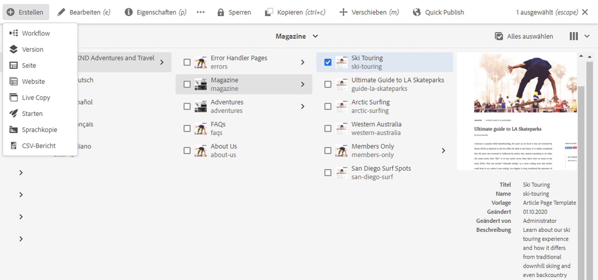
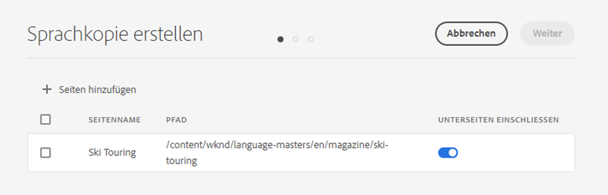
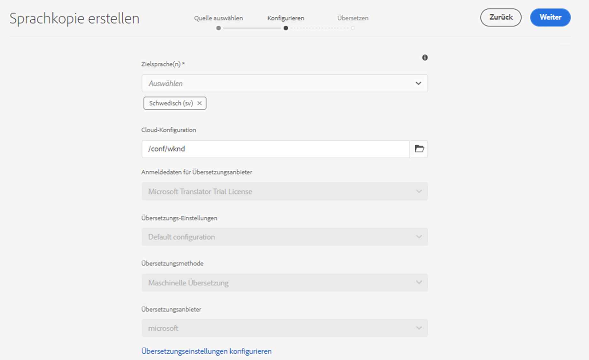
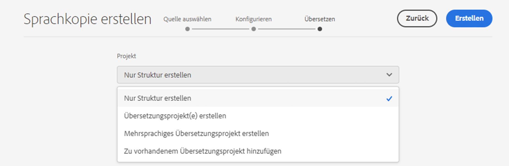
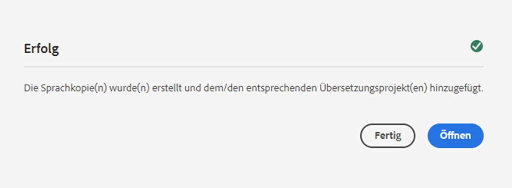

# Assistent „Sprachkopie erstellen“ {#language-copy-wizard}

Der Assistent „Sprachkopie erstellen“ führt Sie durch die Erstellung und Verwendung einer mehrsprachigen Inhaltsstruktur. Mit dem Assistenten erstellen Sie ganz einfach und schnell eine Sprachkopie.

>[!TIP]
>
>Wenn Sie mit der Übersetzung von Inhalten noch nicht vertraut sind, lesen Sie [Sites Translation Journey](/help/journey-sites/translation/overview.md), die Sie durch die Übersetzung Ihrer AEM Sites-Inhalte mithilfe der leistungsstarken Übersetzungs-Tools von AEM führt und ideal für alle ist, die keine AEM- oder Übersetzungserfahrung haben.

>[!NOTE]
>
>Benutzende müssen Mitglieder der Gruppe `project-administrators` sein, um eine Sprachkopie einer Site erstellen zu können.

Sie können wie folgt auf diesen Assistenten zugreifen:

1. Wählen Sie in der Sites-Konsole eine Seite, dann die Option **Erstellen** und anschließend **Sprachkopie** aus.

   

1. Der Assistent öffnet sich mit dem Schritt **Quelle auswählen**, mit dem Sie Seiten hinzufügen/entfernen können. Sie haben außerdem die Option, die Unterseiten ein- oder auszuschließen. Wählen Sie die Seiten aus, die Sie einschließen möchten, und wählen Sie **Weiter** aus.

   

1. Im Schritt **Konfigurieren** des Assistenten können Sie Sprachen hinzufügen/entfernen und die Übersetzungsmethode auswählen. Wählen Sie **Weiter** aus.

   

   >[!NOTE]
   >
   >Standardmäßig gibt es nur eine Übersetzungs-Einstellung. Um die Auswahl anderer Einstellungen zu ermöglichen, müssen Sie zuerst die Cloud-Einstellungen konfigurieren. Siehe [Konfigurieren des Übersetzungsintegrations-Frameworks](integration-framework.md).

1. Im Schritt **Übersetzen** können Sie im Assistenten zwischen dem Erstellen der Struktur, dem Erstellen eines neuen Übersetzungsprojekts oder dem Hinzufügen zu einem vorhandenen Übersetzungsprojekt wählen.

   >[!NOTE]
   >
   >Wenn Sie im vorherigen Schritt mehrere Sprachen ausgewählt haben, werden mehrere Übersetzungsprojekte erstellt.

   

1. Mit der Schaltfläche **Erstellen** wird der Assistent beendet. Wählen Sie **Fertig**, um den Assistenten zu schließen, oder **Öffnen**, um das entsprechende Übersetzungsprojekt anzuzeigen.

   
