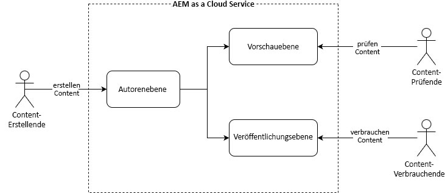

# Authoring- und Veröffentlichungskonzepte {#authoring-publishing}

Grundsätzlich hat eine AEM as a Cloud Service-Installation für Inhaltsautorinnen und Inhaltsautoren drei Hauptebenen:

* Autorenebene
* Vorschauebene
* Veröffentlichungsebene

Diese Ebenen interagieren miteinander und bieten Ihnen die Möglichkeit, Inhalte auf Ihrer Website verfügbar zu machen, sodass Ihre Besucherinnen und Besucher darauf zuzugreifen können. Der Standard-Workflow sieht wie folgt aus:

1. Inhaltsautorinnen und Inhaltsautoren erstellen ihren Inhalt über die Autorenebene.
1. Inhaltsautorinnen und Inhaltsautoren stellen ihren Inhalt für Prüfende zur Verfügung, um eine Vorschau mithilfe der Vorschauebene zu ermöglichen.
1. Sobald der Inhalt für den öffentlichen Gebrauch bereit ist, veröffentlichen die Autorinnen und Autoren den Inhalt über die Veröffentlichungsebene.

Der Inhalt kann verschiedenster Art sein. Es kann sich beispielsweise um Seiten, Assets und Veröffentlichungen handeln. Die Inhaltsvorschau kann nach Ermessen der Autorin oder des Autors ausgelassen werden.

Weitere Informationen zur technischen Architektur von AEM as a Cloud Service finden Sie im Dokument [Einführung in die Architektur von Adobe Experience Manager as a Cloud Service](/help/overview/architecture.md).

{{edge-delivery-authoring}}

## Inhaltserstellung {#author-environment}

Die Authoring-Umgebung der Autorenebene bietet eine einfach zu verwendende grafische Benutzeroberfläche zum Erstellen von Inhalten. Die Autorin bzw. der Autor muss sich mit einem Konto anmelden, dem die entsprechenden Zugriffsrechte zugewiesen wurden.

Je nachdem, wie Ihre Instanz und Ihre persönlichen Zugriffsrechte konfiguriert sind, können Sie viele Aufgaben in Bezug auf Ihre Inhalte durchführen, unter anderem:

* Erstellen neuer Inhalte oder Bearbeiten vorhandener Inhalte auf einer Seite
* Verwenden vordefinierter Vorlagen zum Erstellen von Inhaltsseiten
* Erstellen, Bearbeiten und Verwalten Ihrer Assets und Sammlungen
* Verschieben, Kopieren und Löschen von Inhaltsseiten und Assets.
* Veröffentlichen (oder Rückgängigmachen der Veröffentlichung) von Seiten und Assets.

Außerdem gibt es administrative Aufgaben, die Sie beim Verwalten des Inhalts unterstützen:

* Workflows für die Verwaltung von Änderungen, beispielsweise das Anfordern einer Prüfung vor der Veröffentlichung
* Projekte zur Koordinierung einzelner Aufgaben

AEM wird ebenfalls über die Autorenumgebung verwaltet.

Im Dokument [Schnellstartanleitung zum Authoring](/help/sites-cloud/authoring/quick-start.md) finden Sie einen Überblick über den Authoring-Prozess.

## Vorschau von Inhalten {#previewing-content}

AEM bietet außerdem einen Vorschau-Service, der Entwickelnden und Inhaltsautorinnen bzw. -autoren die Vorschau des endgültigen Erlebnisses einer Website ermöglicht, bevor dieses in die Veröffentlichungsumgebung gelangt und öffentlich verfügbar ist.

Weitere Einzelheiten finden Sie in dem Dokument [Vorschau von Inhalten](/help/sites-cloud/authoring/sites-console/previewing-content.md).

## Veröffentlichungsumgebung {#publish-environment}

Wenn die Inhalte Ihrer Site fertig sind, werden sie in der Veröffentlichungsumgebung der Veröffentlichungsebene veröffentlicht. Hier werden die Seiten der Website in Übereinstimmung mit dem Aussehen Ihrer Inhaltsvorlage der vorgesehenen Zielgruppe bereitgestellt.

Im Dokument [Veröffentlichen von Seiten](/help/sites-cloud/authoring/sites-console/publishing-pages.md) finden Sie weitere Informationen zum Veröffentlichen und Aufheben der Veröffentlichung von Seiten.

## Dispatcher {#dispatcher}

Um eine optimale Nutzung der Website durch Ihre Besucherinnen und Besucher zu gewährleisten, führt der **[Dispatcher](/help/implementing/dispatcher/overview.md)** eine Lastverteilung und Caching für die Veröffentlichungs- und Vorschauebene durch.
