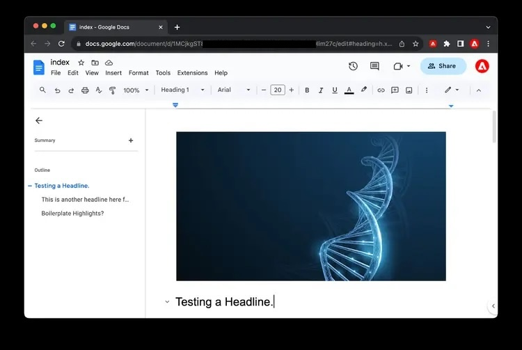

# Methoden zum Erstellen von Inhalten in AEM {#authoring-methods}

Erfahren Sie mehr über die verschiedenen Möglichkeiten, Inhalte in AEM zu erstellen, wie sie sich unterscheiden und wann Sie einen anderen verwenden können.

## AEM Authoring - Flexibilität {#authoring-flexibility}

AEM as a Cloud Service bietet verschiedene Editoren, um verschiedene Inhaltstypen zu bearbeiten und verschiedene Anwendungsfälle für das Authoring zu unterstützen.

* [AEM Seiten-Editor](#page-editor) - Dies ist der klassische Editor für die Inhaltserstellung in AEM, versucht und vertrauenswürdig für Tausende von Websites.
* [AEM Inhaltsfragment-Editor](#cf-editor) - Dies ist der Editor der Wahl für die Erstellung von Headless Content.
* [Universal Editor](#universal-editor) - Diese moderne Benutzeroberfläche ermöglicht es Ihnen, AEM Inhalte inhaltsunabhängig zu erstellen. Sie ist die erste Wahl für AEM Projekte, die Edge Delivery Services nutzen.
* [Dokumentenbasierte Bearbeitung](#document-based) - Wenn Sie Edge Delivery Services verwenden, können Sie Ihren Inhalt als herkömmliche Dokumente wie Microsoft Word- oder Google-Dokumente erstellen, die vollständig außerhalb AEM Konsolen liegen.

Aufgrund der integrierten und skalierbaren AEM können diese Methoden je nach den Anforderungen Ihres Projekts ausschließlich oder in Kombination miteinander verwendet werden.

Wenden Sie sich an Ihren Systemadministrator oder Projektmanager, wenn Sie nicht sicher sind, welche Bearbeitungsoptionen Ihnen zur Verfügung stehen, oder wenn Sie neue Optionen für die Inhaltserstellung erkunden möchten.

## AEM Seiten-Editor {#page-editor}

Dies ist der klassische Editor für die Inhaltserstellung in AEM, versucht und vertrauenswürdig für Tausende von Websites.

Der AEM-Seiteneditor stellt eine integrierte Umgebung zum Verfassen Ihres Inhalts mit einer WYSIWYG-Schnittstelle (What-you-see-is-what-you-get) dar. Sie können vordefinierte Komponenten per Drag &amp; Drop verschieben, um Ihre Seite zu erstellen und Inhalte direkt zu bearbeiten.

Weitere Informationen zum AEM Seiteneditor finden Sie im Dokument . [Der AEM Seiteneditor.](/help/sites-cloud/authoring/page-editor/introduction.md)

## AEM Inhaltsfragment-Editor {#cf-editor}

Der AEM Inhaltsfragment-Editor ist der Editor der Wahl für die Erstellung von Headless Content.

Der AEM Inhaltsfragment-Editor bietet eine klare Benutzeroberfläche zum Erstellen und Verwalten von strukturierten Inhalten, die sich ideal für die Headless-Bereitstellung eignet.

Weitere Informationen zum AEM Inhaltsfragment-Editor finden Sie in den Dokumenten . [Verwalten von Inhaltsfragmenten](/help/sites-cloud/administering/content-fragments/managing.md) und [Erstellen von Inhaltsfragmenten](/help/sites-cloud/administering/content-fragments/managing.md).

>[!NOTE]
>
>Die *new* Der in diesem Abschnitt hervorgehobene Editor ist nur in der Online-Adobe Experience Manager (AEM) as a Cloud Service verfügbar.
>
>Die [*original* Inhaltsfragmente-Editor](/help/assets/content-fragments/content-fragments-variations.md) ist auch verfügbar.

## Universeller Editor {#universal-editor}

Der universelle Editor ist eine moderne Benutzeroberfläche, mit der Sie AEM Inhalte inhaltsunabhängig erstellen können. Er ist die erste Wahl für AEM Projekte, die Edge Delivery Services nutzen.

Der universelle Editor wird über die Konsole &quot;Sites&quot;in AEM aufgerufen, bietet jedoch die Möglichkeit und inhaltsunabhängige Flexibilität, nicht nur AEM Inhalt, sondern auch ordnungsgemäß instrumentierte externe Inhalte zu erstellen.

Weitere Informationen zum universellen Editor finden Sie im Dokument . [Inhaltserstellung mit dem universellen Editor.](/help/implementing/universal-editor/authoring.md)

## Dokumentenbasierte Bearbeitung {#document-based}

Wenn Sie die Edge-Bereitstellungsdienste verwenden, können Sie festlegen, dass Ihre Inhalte als herkömmliche Dokumente wie Microsoft Word- oder Google-Dokumente vollständig außerhalb AEM Konsole erstellt werden.

Beim dokumentbasierten Authoring können Autoren die Tools verwenden, die sie bereits kennen, und dennoch von der Geschwindigkeit und Leistung AEM Edge Delivery Services profitieren, um ihre Inhalte zu veröffentlichen. Für das dokumentbasierte Authoring ist keine Verwendung der AEM-Konsole erforderlich.

Weitere Informationen zum dokumentbasierten Authoring finden Sie im Dokument . [Inhaltserstellung für Edge Delivery Services.](/help/edge/authoring.md)
