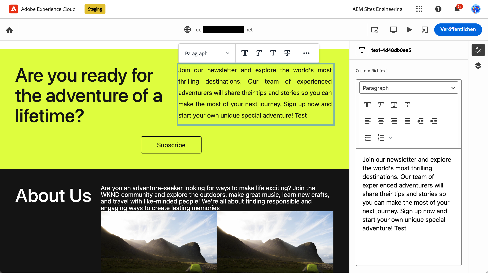

# Methoden zum Erstellen von Inhalten in AEM {#authoring-methods}

Erfahren Sie mehr über die verschiedenen Möglichkeiten, Inhalte in AEM zu erstellen, wie sich diese unterscheiden und wann sich welche Methode empfiehlt.

## Authoring-Flexibilität mit AEM {#authoring-flexibility}

AEM as a Cloud Service bietet verschiedene Editoren, um verschiedene Inhaltstypen zu bearbeiten und verschiedene Authoring-Anwendungsfälle zu unterstützen.

* [WYSIWYG-basiertes Authoring mit dem universellen Editor](#universal-editor): Der universelle Editor ist eine moderne Benutzeroberfläche, die es ermöglicht, AEM-Inhalte inhaltsunabhängig zu erstellen. Er ist die erste Wahl bei AEM-Projekten, die Edge Delivery Services nutzen.
* [WYSIWYG-basiertes Authoring mit dem Seiteneditor](#page-editor): Der Seiteneditor ist der klassische Editor für die Inhaltserstellung in AEM. Er hat sich bereits bei Tausenden von Websites bewährt.
* [Dokumentenbasiertes Authoring](#document-based): Wenn Sie Edge Delivery Services verwenden, können Sie Inhalte als herkömmliche Dokumente z. B. mit Microsoft Word oder Google Docs erstellen, und zwar komplett außerhalb der AEM-Konsolen.
* [AEM-Inhaltsfragmenteditor](#cf-editor): Dies ist der ideale Editor für die Erstellung von Headless-Inhalten.

Aufgrund der Integrierbarkeit und Skalierbarkeit von AEM können diese Methoden je nach den Anforderungen Ihres Projekts ausschließlich oder in Kombination miteinander verwendet werden.

Wenden Sie sich an die Systemadministration oder das Projekt.-Management, wenn Sie nicht sicher sind, welche Authoring-Optionen Ihnen zur Verfügung stehen oder wenn Sie neue Möglichkeiten für die Inhaltserstellung kennenlernen möchten.

## WYSIWYG-basiertes Authoring mit dem universellen Editor {#universal-editor}

Beim universellen Editor handelt es sich um eine moderne Benutzeroberfläche, mit der Sie AEM-Inhalte inhaltsunabhängig erstellen können. Er ist die erste Wahl bei AEM-Projekten, die Edge Delivery Services nutzen.

Der universelle Editor wird über die Sites-Konsole in AEM aufgerufen, bietet jedoch die Fähigkeit und inhaltsunabhängige Flexibilität, nicht nur AEM-Inhalte, sondern auch ordnungsgemäß instrumentierte externe Inhalte zu bearbeiten.

Weitere Informationen zum universellen Editor finden Sie im Dokument [Inhaltserstellung mit dem universellen Editor](/help/sites-cloud/authoring/universal-editor/authoring.md).

## WYSIWYG-basiertes Authoring mit dem Seiteneditor {#page-editor}

Hierbei handelt es sich um den klassischen Editor für die Inhaltserstellung in herkömmlichen AEM-Projekten. Er hat sich bereits bei Tausenden von Websites bewährt.

Der AEM-Seiteneditor steht für eine integrierte Umgebung zum Authoring von Inhalten über eine WYSIWYG(What-you-see-is-what-you-get)-Oberfläche. Sie können vordefinierte Komponenten per Drag &amp; Drop verschieben, um eine Seite zu erstellen und Inhalte im Kontext zu bearbeiten.

Weitere Informationen zum AEM-Seiteneditor finden Sie im Dokument [Der AEM-Seiteneditor](/help/sites-cloud/authoring/page-editor/introduction.md).

## Dokumentenbasiertes Authoring  {#document-based}

Wenn Sie Edge Delivery Services verwenden, können Sie Inhalte als herkömmliche Dokumente z. B. mit Microsoft Word oder Google Docs erstellen, und zwar komplett außerhalb der [AEM **Sites**-Konsole](/help/sites-cloud/authoring/sites-console/introduction.md).

Beim dokumentbasierten Authoring können Autorinnen und Autoren die Tools verwenden, die sie bereits kennen, und bei der Veröffentlichung von Inhalten trotzdem von der Geschwindigkeit und Leistungsfähigkeit von AEM Edge Delivery Services profitieren. Dokumentbasiertes Authoring ist ohne die AEM-Konsole möglich.

Weitere Informationen zum dokumentenbasierten Authoring finden Sie unter [Verfassen und Veröffentlichen von Inhalten](/help/edge/docs/authoring.md).

## AEM-Inhaltsfragment-Editor {#cf-editor}

Der AEM-Inhaltsfragment-Editor ist der Editor der Wahl für die Erstellung von Headless-Inhalten.

Der AEM-Inhaltsfragment-Editor bietet eine übersichtliche Benutzeroberfläche zum Erstellen und Verwalten strukturierter Inhalte, was für die Headless-Bereitstellung ideal ist.

Weitere Informationen zum AEM-Inhaltsfragment-Editor finden Sie unter [Verwalten von Inhaltsfragmenten](/help/sites-cloud/administering/content-fragments/managing.md) und [Erstellen von Inhaltsfragmenten](/help/sites-cloud/administering/content-fragments/managing.md).

>[!NOTE]
>
>Der *neue* Editor, der in diesem Abschnitt beschrieben wird, ist bei der lokalen Entwicklungsarbeit für AEM as a Cloud Service nicht verfügbar.
>
>Der [*ursprüngliche* Inhaltsfragmente-Editor](/help/assets/content-fragments/content-fragments-variations.md) steht ebenfalls zur Verfügung.
